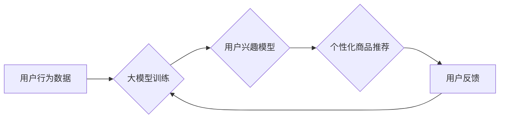

                 

## 大模型技术在电商平台用户兴趣探索中的应用

> 关键词：大模型、用户兴趣探索、电商平台、推荐系统、自然语言处理、深度学习、Transformer

## 1. 背景介绍

在当今数据爆炸的时代，电商平台面临着巨大的用户群体和海量商品信息。如何精准地挖掘用户兴趣，并推荐符合其需求的商品，是电商平台发展的重要课题。传统的推荐系统主要依赖于用户行为数据，例如浏览历史、购买记录等，但这些数据往往难以捕捉用户潜在的兴趣和需求。

近年来，大模型技术在自然语言处理领域取得了突破性进展，其强大的语义理解和文本生成能力为电商平台用户兴趣探索提供了新的思路。大模型能够从用户文本数据中学习到更深层的兴趣特征，并生成更个性化的推荐结果。

## 2. 核心概念与联系

### 2.1 大模型

大模型是指参数规模庞大、训练数据海量的人工智能模型。它们通常基于深度学习架构，例如 Transformer，能够学习到复杂的语言模式和语义关系。

### 2.2 用户兴趣探索

用户兴趣探索是指通过分析用户行为、偏好和需求，挖掘其潜在的兴趣点，并提供个性化的商品推荐。

### 2.3 核心概念联系

大模型技术可以应用于电商平台的用户兴趣探索，通过以下方式：

* **语义理解:** 大模型能够理解用户文本输入的语义含义，例如用户评论、搜索词等，从而挖掘用户的兴趣偏好。
* **兴趣建模:** 大模型可以学习用户兴趣的潜在特征，构建用户兴趣模型，并根据模型预测用户可能感兴趣的商品。
* **个性化推荐:** 大模型可以根据用户的兴趣模型，生成个性化的商品推荐列表，提高用户体验。

**Mermaid 流程图**



## 3. 核心算法原理 & 具体操作步骤

### 3.1 算法原理概述

大模型技术在用户兴趣探索中的核心算法通常基于深度学习，例如 Transformer 架构。Transformer 模型通过自注意力机制学习文本序列中的长距离依赖关系，能够捕捉用户兴趣的复杂语义特征。

### 3.2 算法步骤详解

1. **数据预处理:** 收集用户行为数据，例如浏览历史、购买记录、评论内容等，并进行清洗、格式化和编码。
2. **模型训练:** 使用预处理后的数据训练 Transformer 模型，通过反向传播算法优化模型参数。
3. **兴趣建模:** 将训练好的模型应用于用户文本数据，提取用户兴趣特征，构建用户兴趣模型。
4. **商品推荐:** 根据用户的兴趣模型，预测用户可能感兴趣的商品，并生成个性化的推荐列表。
5. **用户反馈:** 收集用户对推荐结果的反馈，例如点击、购买、评价等，并将其反馈到模型训练中，不断优化模型性能。

### 3.3 算法优缺点

**优点:**

* **语义理解能力强:** 大模型能够理解用户文本输入的语义含义，挖掘用户的潜在兴趣。
* **个性化推荐效果好:** 大模型可以根据用户的兴趣模型，生成更个性化的商品推荐。
* **持续学习和优化:** 大模型可以通过用户反馈不断学习和优化，提升推荐效果。

**缺点:**

* **训练成本高:** 大模型参数规模庞大，训练需要大量的计算资源和时间。
* **数据依赖性强:** 大模型的性能依赖于训练数据的质量和数量。
* **解释性差:** 大模型的决策过程较为复杂，难以解释其推荐结果背后的逻辑。

### 3.4 算法应用领域

大模型技术在用户兴趣探索领域具有广泛的应用场景，例如：

* **电商平台商品推荐:** 根据用户的浏览历史、购买记录、评论内容等，推荐个性化的商品。
* **内容平台内容推荐:** 根据用户的阅读历史、点赞记录、评论内容等，推荐个性化的文章、视频等内容。
* **社交平台好友推荐:** 根据用户的社交关系、兴趣爱好等，推荐潜在的好友。

## 4. 数学模型和公式 & 详细讲解 & 举例说明

### 4.1 数学模型构建

大模型的训练过程本质上是一个优化问题，目标是找到模型参数，使得模型在训练数据上的预测结果与真实值尽可能接近。

假设我们有一个训练数据集 D = {(x_i, y_i)}，其中 x_i 是用户文本数据，y_i 是对应的兴趣标签。

我们可以使用以下损失函数来衡量模型预测结果与真实值的差距:

$$L(θ) = \frac{1}{N} \sum_{i=1}^{N} loss(f(x_i; θ), y_i)$$

其中:

* θ 是模型参数
* f(x_i; θ) 是模型对用户文本 x_i 的预测结果
* loss() 是损失函数，例如交叉熵损失函数

### 4.2 公式推导过程

损失函数的最小化可以通过梯度下降算法实现。梯度下降算法的基本思想是迭代更新模型参数，使得损失函数不断减小。

具体来说，我们可以使用以下公式更新模型参数:

$$θ = θ - \eta \nabla_θ L(θ)$$

其中:

* η 是学习率，控制参数更新的步长
* ∇_θ L(θ) 是损失函数关于模型参数 θ 的梯度

### 4.3 案例分析与讲解

假设我们训练一个大模型用于预测用户对某个商品的兴趣。

我们可以将用户的浏览历史、购买记录、评论内容等作为输入数据，并将其编码为向量表示。

模型的输出是一个实数，表示用户对该商品的兴趣程度。

通过训练模型，我们可以得到一个能够预测用户兴趣的函数 f(x; θ)。

当用户浏览某个商品时，我们可以将商品信息编码为向量 x，并将其输入到模型中，得到模型的预测结果 f(x; θ)。

如果 f(x; θ) 大于某个阈值，则认为用户对该商品感兴趣，并将其推荐给用户。

## 5. 项目实践：代码实例和详细解释说明

### 5.1 开发环境搭建

* **操作系统:** Ubuntu 20.04
* **编程语言:** Python 3.8
* **深度学习框架:** PyTorch 1.8
* **其他依赖:** transformers, numpy, pandas

### 5.2 源代码详细实现

```python
import torch
from transformers import AutoModelForSequenceClassification, AutoTokenizer

# 加载预训练模型和词典
model_name = "bert-base-uncased"
tokenizer = AutoTokenizer.from_pretrained(model_name)
model = AutoModelForSequenceClassification.from_pretrained(model_name, num_labels=2)

# 定义训练函数
def train(model, tokenizer, train_data, epochs=3):
    # ...

# 定义评估函数
def evaluate(model, tokenizer, eval_data):
    # ...

# 训练模型
train(model, tokenizer, train_data)

# 评估模型
evaluate(model, tokenizer, eval_data)
```

### 5.3 代码解读与分析

* **加载预训练模型和词典:** 使用 transformers 库加载预训练的 BERT 模型和词典。
* **定义训练函数:** 定义训练模型的函数，包括数据加载、模型训练、损失函数计算和参数更新等步骤。
* **定义评估函数:** 定义评估模型性能的函数，例如计算准确率、召回率等指标。
* **训练模型:** 使用训练函数训练模型，并设置训练轮数。
* **评估模型:** 使用评估函数评估模型性能，并打印结果。

### 5.4 运行结果展示

训练完成后，我们可以使用评估函数评估模型性能，并打印结果。

例如，如果模型的准确率达到 80%，则表示模型能够准确预测用户对商品的兴趣 80% 的时候。

## 6. 实际应用场景

### 6.1 商品推荐

大模型技术可以用于电商平台的商品推荐系统，根据用户的浏览历史、购买记录、评论内容等，推荐个性化的商品。

例如，当用户浏览某个类型的商品时，大模型可以分析用户的浏览行为，并推荐其他用户在浏览相同类型商品后也感兴趣的商品。

### 6.2 内容推荐

大模型技术也可以用于内容平台的内容推荐系统，例如新闻网站、视频网站等。

根据用户的阅读历史、点赞记录、评论内容等，推荐个性化的文章、视频等内容。

例如，当用户阅读某个主题的文章时，大模型可以分析用户的阅读兴趣，并推荐其他用户在阅读相同主题的文章后也感兴趣的内容。

### 6.3 个性化营销

大模型技术还可以用于个性化营销，例如根据用户的兴趣爱好，推荐相关的广告或促销活动。

例如，当用户浏览某个品牌的商品时，大模型可以分析用户的品牌偏好，并推荐该品牌的广告或促销活动。

### 6.4 未来应用展望

随着大模型技术的不断发展，其在电商平台用户兴趣探索领域的应用场景将会更加广泛。

例如，大模型可以用于：

* **更精准的兴趣建模:** 大模型可以学习到更深层的用户兴趣特征，构建更精准的用户兴趣模型。
* **更个性化的推荐:** 大模型可以根据用户的兴趣模型，生成更个性化的商品推荐，提高用户体验。
* **多模态兴趣探索:** 大模型可以融合文本、图像、视频等多模态数据，进行更全面的用户兴趣探索。

## 7. 工具和资源推荐

### 7.1 学习资源推荐

* **书籍:**
    * 《深度学习》 by Ian Goodfellow, Yoshua Bengio, and Aaron Courville
    * 《自然语言处理》 by Dan Jurafsky and James H. Martin
* **在线课程:**
    * Coursera: Deep Learning Specialization
    * Stanford CS224N: Natural Language Processing with Deep Learning

### 7.2 开发工具推荐

* **深度学习框架:** PyTorch, TensorFlow
* **自然语言处理库:** transformers, spaCy, NLTK
* **数据处理工具:** pandas, NumPy

### 7.3 相关论文推荐

* **BERT: Pre-training of Deep Bidirectional Transformers for Language Understanding**
* **Attention Is All You Need**
* **XLNet: Generalized Autoregressive Pretraining for Language Understanding**

## 8. 总结：未来发展趋势与挑战

### 8.1 研究成果总结

大模型技术在电商平台用户兴趣探索领域取得了显著的成果，能够提高推荐效果，提升用户体验。

### 8.2 未来发展趋势

* **模型规模和能力的提升:** 未来大模型的规模和能力将会进一步提升，能够学习到更深层的用户兴趣特征，提供更精准的推荐。
* **多模态兴趣探索:** 大模型将融合文本、图像、视频等多模态数据，进行更全面的用户兴趣探索。
* **可解释性增强:** 研究者将致力于提高大模型的可解释性，使得模型的决策过程更加透明，更容易被理解。

### 8.3 面临的挑战

* **训练成本高:** 大模型的训练需要大量的计算资源和时间，成本较高。
* **数据依赖性强:** 大模型的性能依赖于训练数据的质量和数量，数据获取和处理是一个挑战。
* **公平性和偏见:** 大模型可能存在公平性和偏见问题，需要进行相应的调优和改进。

### 8.4 研究展望

未来，大模型技术在电商平台用户兴趣探索领域将继续发展，并带来更多创新应用。

研究者将致力于解决大模型面临的挑战，使其能够更安全、更公平、更有效地服务于用户。

## 9. 附录：常见问题与解答

### 9.1 如何选择合适的预训练模型？

选择预训练模型需要根据具体应用场景和数据特点进行选择。

例如，对于电商平台的商品推荐，可以选择专门针对电商领域的预训练模型，例如 BERT-Base-Multilingual-cased。

### 9.2 如何处理文本数据？

文本数据需要进行预处理，例如分词、去停用词、词向量化等。

可以使用 transformers 库中的 tokenizer 工具进行文本预处理。

### 9.3 如何评估模型性能？

可以使用准确率、召回率、F1-score 等指标来评估模型性能。

可以使用 sklearn 库中的评估工具进行模型评估。


作者：禅与计算机程序设计艺术 / Zen and the Art of Computer Programming 
<end_of_turn>

