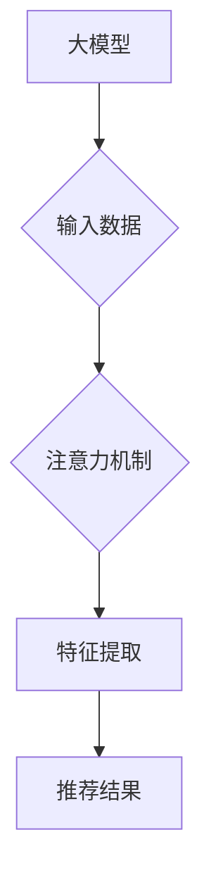

                 

## 大模型推荐中的注意力机制优化

> 关键词：大模型、推荐系统、注意力机制、优化、效率、准确性

## 1. 背景介绍

推荐系统作为信息过滤和个性化内容呈现的重要工具，在电商、社交媒体、视频平台等领域发挥着越来越重要的作用。随着大规模数据和深度学习技术的快速发展，大模型在推荐系统领域展现出强大的潜力。然而，大模型的训练和推理过程往往面临着巨大的计算成本和资源消耗。

注意力机制作为一种能够学习数据中重要信息的机制，在自然语言处理领域取得了显著的成功。近年来，注意力机制也被广泛应用于推荐系统，有效提升了推荐系统的准确性和效率。

## 2. 核心概念与联系

### 2.1  大模型

大模型是指参数量达到数百万甚至数十亿的深度学习模型。大模型通常具有强大的泛化能力和表示能力，能够处理复杂的任务，例如文本生成、图像识别、机器翻译等。

### 2.2  推荐系统

推荐系统旨在根据用户的历史行为、偏好和上下文信息，预测用户对特定物品的兴趣，并推荐用户可能感兴趣的物品。推荐系统通常分为基于内容的推荐、基于协同过滤的推荐和基于深度学习的推荐等类型。

### 2.3  注意力机制

注意力机制是一种能够学习数据中重要信息的机制。它通过赋予不同输入元素不同的权重，使得模型能够关注到对预测结果最重要的信息。注意力机制可以有效解决传统模型难以处理长序列数据的问题，并提升模型的准确性和效率。

**大模型推荐系统中的注意力机制**



## 3. 核心算法原理 & 具体操作步骤

### 3.1  算法原理概述

注意力机制的核心思想是学习每个输入元素对输出结果的贡献度，并根据贡献度分配不同的权重。常用的注意力机制包括自注意力机制和交叉注意力机制。

* **自注意力机制:**  用于学习输入序列中不同元素之间的关系，可以捕捉到长距离依赖关系。
* **交叉注意力机制:** 用于学习输入序列和输出序列之间的关系，可以将输入序列中的重要信息传递给输出序列。

### 3.2  算法步骤详解

1. **计算注意力权重:**  根据输入序列和输出序列之间的关系，计算每个输入元素对输出元素的注意力权重。
2. **加权求和:**  将注意力权重与输入序列元素相乘，并求和得到加权后的输出。
3. **输出结果:**  将加权后的输出作为模型的最终输出。

### 3.3  算法优缺点

**优点:**

* 能够学习数据中重要信息，提升模型的准确性和效率。
* 可以捕捉到长距离依赖关系，处理复杂的任务。

**缺点:**

* 计算复杂度较高，训练和推理过程需要更多的计算资源。
* 容易受到噪声数据的影响。

### 3.4  算法应用领域

注意力机制广泛应用于推荐系统、自然语言处理、计算机视觉等领域。

* **推荐系统:**  用于个性化推荐、商品关联推荐、用户画像构建等。
* **自然语言处理:**  用于机器翻译、文本摘要、问答系统等。
* **计算机视觉:**  用于图像识别、目标检测、图像 Captioning 等。

## 4. 数学模型和公式 & 详细讲解 & 举例说明

### 4.1  数学模型构建

假设我们有一个输入序列 $X = \{x_1, x_2, ..., x_n\}$ 和一个输出序列 $Y = \{y_1, y_2, ..., y_m\}$。

注意力机制的目标是学习一个注意力权重矩阵 $A \in R^{n \times m}$，其中 $A_{ij}$ 表示输入元素 $x_i$ 对输出元素 $y_j$ 的注意力权重。

### 4.2  公式推导过程

注意力权重矩阵 $A$ 通常通过以下公式计算:

$$
A_{ij} = \frac{exp(score(x_i, y_j))}{\sum_{k=1}^{n} exp(score(x_k, y_j))}
$$

其中，$score(x_i, y_j)$ 是输入元素 $x_i$ 和输出元素 $y_j$ 之间的相似度得分，可以使用点积、余弦相似度等方式计算。

### 4.3  案例分析与讲解

例如，在推荐系统中，输入序列 $X$ 可以是用户的历史行为数据，输出序列 $Y$ 可以是商品信息。注意力机制可以学习用户对不同商品的兴趣程度，并根据用户的兴趣推荐相关的商品。

## 5. 项目实践：代码实例和详细解释说明

### 5.1  开发环境搭建

* Python 3.6+
* TensorFlow/PyTorch
* CUDA (可选)

### 5.2  源代码详细实现

```python
import tensorflow as tf

# 定义注意力机制层
class AttentionLayer(tf.keras.layers.Layer):
    def __init__(self, units):
        super(AttentionLayer, self).__init__()
        self.W1 = tf.keras.layers.Dense(units)
        self.W2 = tf.keras.layers.Dense(units)
        self.v = tf.keras.layers.Dense(1)

    def call(self, inputs):
        # inputs: (batch_size, seq_len, embedding_dim)
        query = self.W1(inputs)
        key = self.W2(inputs)
        value = inputs
        # 计算注意力权重
        attention_scores = tf.matmul(query, key, transpose_b=True)
        attention_scores = tf.nn.softmax(attention_scores, axis=-1)
        # 加权求和
        output = tf.matmul(attention_scores, value)
        return output

# 示例使用
model = tf.keras.Sequential([
    tf.keras.layers.Embedding(input_dim=10000, output_dim=128),
    AttentionLayer(units=64),
    tf.keras.layers.Dense(units=10, activation='softmax')
])
```

### 5.3  代码解读与分析

* `AttentionLayer` 类定义了一个注意力机制层，包含三个稠密层 `W1`, `W2` 和 `v`。
* `call` 方法计算注意力权重并进行加权求和。
* 示例代码使用 `AttentionLayer` 层构建了一个简单的推荐模型。

### 5.4  运行结果展示

运行结果展示需要根据实际数据集和模型参数进行调整。

## 6. 实际应用场景

### 6.1  个性化推荐

注意力机制可以学习用户的兴趣偏好，并根据用户的历史行为、浏览记录、购买记录等信息，推荐个性化的商品、内容或服务。

### 6.2  商品关联推荐

注意力机制可以学习商品之间的关联关系，例如用户购买商品A的可能性，也可能购买商品B。

### 6.3  用户画像构建

注意力机制可以学习用户的特征和行为模式，构建用户画像，以便更好地理解用户的需求和兴趣。

### 6.4  未来应用展望

* **多模态推荐:**  结合文本、图像、视频等多模态数据，构建更全面的用户画像和推荐模型。
* **动态推荐:**  根据用户的实时行为和上下文信息，动态调整推荐结果。
* **解释性推荐:**  解释推荐结果背后的原因，提高用户对推荐结果的信任度。

## 7. 工具和资源推荐

### 7.1  学习资源推荐

* **书籍:**
    * Deep Learning
    * Attention Is All You Need
* **论文:**
    * [Attention Is All You Need](https://arxiv.org/abs/1706.03762)
    * [BERT: Pre-training of Deep Bidirectional Transformers for Language Understanding](https://arxiv.org/abs/1810.04805)
* **在线课程:**
    * Coursera: Deep Learning Specialization
    * Udacity: Deep Learning Nanodegree

### 7.2  开发工具推荐

* **TensorFlow:**  开源深度学习框架
* **PyTorch:**  开源深度学习框架
* **Keras:**  高层深度学习 API

### 7.3  相关论文推荐

* [Transformer-XL: Attentive Language Models Beyond a Fixed-Length Context](https://arxiv.org/abs/1901.08316)
* [Longformer: The Long-Document Transformer](https://arxiv.org/abs/2004.05121)
* [Reformer: The Efficient Transformer](https://arxiv.org/abs/1909.07726)

## 8. 总结：未来发展趋势与挑战

### 8.1  研究成果总结

注意力机制在推荐系统领域取得了显著的成果，有效提升了推荐系统的准确性和效率。

### 8.2  未来发展趋势

* **更有效的注意力机制:**  研究更有效的注意力机制，例如自适应注意力、动态注意力等，以更好地捕捉数据中的复杂关系。
* **多模态注意力机制:**  结合文本、图像、视频等多模态数据，构建更全面的用户画像和推荐模型。
* **可解释性注意力机制:**  解释推荐结果背后的原因，提高用户对推荐结果的信任度。

### 8.3  面临的挑战

* **计算复杂度:**  注意力机制的计算复杂度较高，需要更高效的算法和硬件支持。
* **数据稀疏性:**  推荐系统的数据往往是稀疏的，需要更有效的处理方法。
* **公平性与可解释性:**  需要确保推荐系统公平公正，并提供可解释的推荐结果。

### 8.4  研究展望

未来，注意力机制在推荐系统领域将继续发挥重要作用，并与其他先进技术相结合，构建更智能、更个性化的推荐系统。


## 9. 附录：常见问题与解答

**Q1: 注意力机制的计算复杂度如何降低？**

**A1:**  可以通过以下方法降低注意力机制的计算复杂度：

* 使用低秩分解技术
* 使用局部注意力机制
* 使用高效的注意力算法，例如Reformer

**Q2: 如何处理数据稀疏性问题？**

**A2:**  可以通过以下方法处理数据稀疏性问题：

* 使用嵌入技术
* 使用协同过滤算法
* 使用迁移学习

**Q3: 如何确保推荐系统的公平性？**

**A3:**  可以通过以下方法确保推荐系统的公平性：

* 使用公平性损失函数
* 使用对抗训练
* 进行定期评估和调整


作者：禅与计算机程序设计艺术 / Zen and the Art of Computer Programming 
<end_of_turn>

