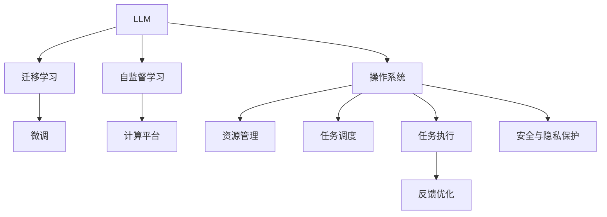

                 

# 下一代AI操作系统：LLM驱动的计算平台

> 关键词：人工智能操作系统, 大型语言模型(LLM), 计算平台, 自动化, 自监督学习, 迁移学习, 动态加载

## 1. 背景介绍

### 1.1 问题由来

随着人工智能技术的迅速发展，深度学习、自然语言处理等领域的突破，推动了新一代AI操作系统的诞生。这些操作系统不再局限于传统的计算和存储任务，而是通过引入AI技术，尤其是大规模语言模型(LLM)，实现自动化、智能化和高效化的计算管理。LLM通过自监督学习和迁移学习，逐步提升了对复杂数据和任务的建模能力，从而可以驱动更强大的操作系统，支持各种AI应用场景。

然而，现有的操作系统难以满足LLM对资源的需求，且缺乏对AI任务的合理调度和管理机制。因此，开发一款能够充分利用LLM能力的下一代AI操作系统，成为当前AI研究领域的一个热点问题。本文将详细探讨LLM在AI操作系统中的角色和作用，以及其驱动的计算平台架构和实现方法。

### 1.2 问题核心关键点

新一代AI操作系统需要具备以下几个核心关键点：

1. **资源管理与调度**：高效管理计算、存储、网络等系统资源，自动调度任务，优化资源利用率。
2. **模型管理与优化**：管理LLM模型，包括模型训练、微调、推理等环节，通过动态加载和卸载，减少系统开销。
3. **任务执行与反馈**：支持复杂的AI任务，实现端到端的任务执行，提供实时反馈机制，持续优化任务执行流程。
4. **跨平台兼容性**：支持多平台部署，确保跨操作系统、跨硬件环境的一致性。
5. **安全与隐私保护**：确保数据和模型的安全，保护用户隐私，避免模型偏见和滥用。

通过解决以上问题，可以构建一个基于LLM的AI操作系统，支持更广泛的应用场景和更高的性能要求。

### 1.3 问题研究意义

研究和开发基于LLM的AI操作系统，对于提升AI技术的落地应用能力、加速行业数字化转型具有重要意义：

1. **降低开发成本**：简化AI应用开发流程，缩短从概念到应用的周期。
2. **提升应用性能**：通过自动化和智能化的资源管理，优化系统资源利用，提高任务执行效率。
3. **增强用户体验**：提供更好的交互体验，实时反馈机制，提升用户满意度和粘性。
4. **促进产业升级**：支持各行业的AI应用开发，推动传统行业向智能化、自动化方向升级。
5. **增强安全性**：确保数据和模型安全，保护用户隐私，避免模型滥用。

通过实现这些目标，可以构建一个更加高效、智能、安全的AI操作系统，为各行各业提供强有力的技术支持。

## 2. 核心概念与联系

### 2.1 核心概念概述

为了更好地理解LLM驱动的AI操作系统，本节将介绍几个关键概念：

- **大型语言模型(LLM)**：如BERT、GPT-3、T5等，通过在大规模无标签文本数据上进行预训练，学习到丰富的语言知识和常识，具备强大的语言理解与生成能力。

- **自监督学习**：指在不依赖人工标注的情况下，通过数据本身的特点进行模型训练的方法。自监督学习通常以语言模型、掩码语言模型等任务为基础。

- **迁移学习**：指将一个领域学到的知识，迁移应用到另一个不同但相关的领域。LLM的预训练模型可以迁移到各种下游任务上，进行微调以提升性能。

- **计算平台**：指提供计算、存储、网络等系统资源的硬件和软件平台，支持AI任务的部署和执行。

- **操作系统**：负责管理计算平台上的各种资源，提供服务，调度任务，确保系统的稳定性和性能。

- **自动化**：指通过智能算法和工具，自动完成复杂、重复的任务，提升工作效率和质量。

- **安全与隐私**：确保数据和模型的安全，保护用户隐私，避免模型滥用和偏见。

### 2.2 核心概念原理和架构的 Mermaid 流程图



这个流程图展示了LLM驱动的AI操作系统的工作流程：

1. LLM通过自监督学习获得丰富的语言知识，通过迁移学习迁移到下游任务。
2. 微调过程进一步提升任务性能，优化LLM模型。
3. 计算平台提供资源支持，操作系统管理资源和任务。
4. 资源管理和任务调度确保高效利用资源，任务执行和反馈优化提升任务质量。
5. 安全与隐私保护确保数据和模型的安全，保护用户隐私。

## 3. 核心算法原理 & 具体操作步骤

### 3.1 算法原理概述

LLM驱动的AI操作系统的工作原理可以概括为以下几个步骤：

1. **数据预处理**：收集和处理各种数据，包括文本、图像、语音等，转换为LLM可以处理的形式。
2. **模型训练与微调**：在收集到的数据上，使用自监督学习对LLM进行预训练，并在目标任务上进行微调。
3. **资源调度与管理**：管理计算平台上的各种资源，自动调度任务，优化资源利用率。
4. **任务执行与反馈**：支持复杂的AI任务，实现端到端的任务执行，提供实时反馈机制，持续优化任务执行流程。
5. **安全与隐私保护**：确保数据和模型的安全，保护用户隐私，避免模型滥用。

### 3.2 算法步骤详解

下面详细介绍基于LLM的AI操作系统的算法步骤：

**Step 1: 数据预处理**

- **数据收集**：从不同渠道收集数据，包括文本、图像、语音等。
- **数据清洗**：去除噪声、重复、不完整等数据，确保数据质量。
- **数据转换**：将数据转换为LLM可以处理的形式，如文本转换为token ids。

**Step 2: 模型训练与微调**

- **预训练**：使用自监督学习任务（如掩码语言模型、预训练自编码器等）对LLM进行预训练，学习通用的语言表示。
- **微调**：将预训练模型迁移到目标任务上，通过监督学习优化模型性能。
- **动态加载与卸载**：根据任务需求，动态加载和卸载模型，减少系统开销。

**Step 3: 资源调度与管理**

- **资源监控**：实时监控系统资源（如CPU、GPU、内存等）的使用情况。
- **任务调度**：根据任务需求和资源情况，自动调度任务，优化资源利用率。
- **负载均衡**：合理分配任务到不同的计算节点，避免单点过载。

**Step 4: 任务执行与反馈**

- **任务执行**：通过API或CLI调用LLM进行任务执行，确保任务高效、准确地完成。
- **实时反馈**：收集任务执行过程中的实时数据，如模型性能、资源利用率等，实时反馈优化任务执行。
- **迭代优化**：根据反馈数据，调整模型参数和资源调度策略，持续优化任务执行。

**Step 5: 安全与隐私保护**

- **数据加密**：对数据进行加密处理，确保数据在传输和存储过程中的安全。
- **模型保护**：使用模型水印、权限控制等手段，防止模型被非法复制或篡改。
- **隐私保护**：采用差分隐私、联邦学习等技术，保护用户隐私。

### 3.3 算法优缺点

**优点**

- **高效资源利用**：通过智能调度和管理，高效利用系统资源，提高任务执行效率。
- **灵活任务支持**：支持各种复杂的AI任务，如自然语言处理、计算机视觉、语音识别等。
- **可扩展性强**：系统支持多平台、多硬件环境，易于扩展和部署。
- **动态优化能力**：通过实时反馈和迭代优化，不断提升系统性能。
- **安全性高**：通过加密、水印等手段，确保数据和模型的安全，保护用户隐私。

**缺点**

- **资源消耗大**：LLM模型庞大，计算资源需求高，系统硬件要求高。
- **模型复杂性高**：LLM模型复杂，训练和微调难度大。
- **部署难度大**：需要在多平台、多硬件环境下进行优化和调试，部署复杂。
- **隐私保护复杂**：需要在模型和数据层面进行隐私保护，技术挑战大。

### 3.4 算法应用领域

基于LLM的AI操作系统可以广泛应用于以下几个领域：

- **自然语言处理(NLP)**：如聊天机器人、文本分类、情感分析、问答系统等。
- **计算机视觉(CV)**：如图像识别、目标检测、图像生成等。
- **语音识别与处理**：如语音识别、语音合成、语音翻译等。
- **智能推荐**：如电商推荐、新闻推荐、视频推荐等。
- **智能客服**：如自动化客服、智能应答等。
- **智能医疗**：如医学图像分析、病历分析、药物研发等。
- **智能制造**：如预测性维护、质量检测、生产调度等。

## 4. 数学模型和公式 & 详细讲解

### 4.1 数学模型构建

在基于LLM的AI操作系统中，常见的数学模型包括自监督学习模型和迁移学习模型。

**自监督学习模型**：

- **掩码语言模型**：输入一段文本，将其中的某些单词随机掩码，通过预测掩码位置的单词，学习语言的语义和语法结构。
- **自编码器**：输入一段文本，通过编码器将其转换为隐含表示，再通过解码器还原文本，学习语言的表示能力。

**迁移学习模型**：

- **预训练-微调模型**：在预训练模型基础上，通过微调优化模型，适应下游任务。

### 4.2 公式推导过程

以BERT为例，其掩码语言模型训练过程的公式推导如下：

1. 输入文本 $x = [x_1, x_2, ..., x_n]$。
2. 将 $x$ 中的 $p$ 个位置随机掩码，得到掩码文本 $x' = [x_1', x_2', ..., x_n']$。
3. 使用BERT的Transformer编码器对 $x'$ 进行编码，得到隐含表示 $h_1, h_2, ..., h_n$。
4. 使用softmax层对 $h$ 进行分类，得到每个位置的预测概率 $p_1, p_2, ..., p_n$。
5. 计算掩码位置 $p$ 的损失 $L$。
6. 使用梯度下降法优化模型参数 $\theta$。

数学公式如下：

$$
L = -\sum_{p=1}^P \log \hat{p}_p
$$

其中 $P$ 为掩码位置数，$\hat{p}_p$ 为预测概率。

### 4.3 案例分析与讲解

**案例分析：BERT的预训练**

- **数据集**：使用大规模无标签文本数据（如维基百科、新闻、书籍等）。
- **任务**：掩码语言模型，随机掩码文本中的部分单词。
- **目标**：学习文本的语义和语法结构，提升模型的语言理解能力。
- **模型**：BERT，使用Transformer结构和多层双向LSTM编码器。
- **训练过程**：在多GPU或多TPU上并行训练，优化损失函数，确保模型的泛化能力。

**案例讲解：微调BERT进行情感分析**

- **数据集**：情感分析标注数据集，包含电影评论、产品评论等。
- **任务**：情感分类，判断文本的情感倾向（正、负、中性）。
- **目标**：在BERT预训练模型的基础上，通过微调优化模型性能。
- **模型**：BERT-Base，使用线性分类器进行微调。
- **训练过程**：使用微调后的模型进行情感分析，评估模型性能，调整模型参数。

## 5. 项目实践：代码实例和详细解释说明

### 5.1 开发环境搭建

在开始实践之前，需要搭建好开发环境。以下是基于Python和PyTorch的开发环境搭建步骤：

1. **安装Python和pip**：
   ```
   sudo apt-get install python3 python3-pip
   ```

2. **安装PyTorch和相关库**：
   ```
   pip install torch torchvision torchaudio transformers transformers==4.9.0
   ```

3. **安装HuggingFace Hub**：
   ```
   pip install datasets transformers==4.9.0
   ```

4. **安装Keras和TensorFlow**：
   ```
   pip install keras tensorflow==2.4.1
   ```

5. **安装其他依赖库**：
   ```
   pip install numpy pandas matplotlib scikit-learn tqdm
   ```

### 5.2 源代码详细实现

下面以BERT的微调为例，展示基于LLM的AI操作系统的实现。

```python
import torch
import transformers
import numpy as np

# 加载BERT预训练模型和分词器
model = transformers.BertForSequenceClassification.from_pretrained('bert-base-uncased')
tokenizer = transformers.BertTokenizer.from_pretrained('bert-base-uncased')

# 加载标注数据集
train_data = pd.read_csv('train_data.csv')
val_data = pd.read_csv('val_data.csv')
test_data = pd.read_csv('test_data.csv')

# 将数据转换为BERT可处理的形式
def encode_data(data):
    inputs = tokenizer(data, return_tensors='pt')
    return inputs['input_ids'], inputs['attention_mask'], inputs['labels']

train_inputs, train_masks, train_labels = encode_data(train_data)
val_inputs, val_masks, val_labels = encode_data(val_data)
test_inputs, test_masks, test_labels = encode_data(test_data)

# 定义优化器和损失函数
optimizer = torch.optim.Adam(model.parameters(), lr=1e-5)
loss_fn = torch.nn.CrossEntropyLoss()

# 定义训练函数
def train_epoch(model, data_loader, optimizer, loss_fn):
    model.train()
    total_loss = 0
    for inputs, masks, labels in data_loader:
        optimizer.zero_grad()
        outputs = model(inputs, attention_mask=masks)
        loss = loss_fn(outputs.logits, labels)
        loss.backward()
        optimizer.step()
        total_loss += loss.item()
    return total_loss / len(data_loader)

# 定义评估函数
def evaluate(model, data_loader, loss_fn):
    model.eval()
    total_loss = 0
    total_preds = []
    total_labels = []
    for inputs, masks, labels in data_loader:
        with torch.no_grad():
            outputs = model(inputs, attention_mask=masks)
            loss = loss_fn(outputs.logits, labels)
            total_loss += loss.item()
            total_preds.append(outputs.logits.argmax(dim=1).tolist())
            total_labels.append(labels.tolist())
    return total_loss / len(data_loader), np.array(total_preds), np.array(total_labels)

# 训练和评估模型
epochs = 5
batch_size = 16
train_loader = torch.utils.data.DataLoader(train_data, batch_size=batch_size, shuffle=True)
val_loader = torch.utils.data.DataLoader(val_data, batch_size=batch_size, shuffle=False)
test_loader = torch.utils.data.DataLoader(test_data, batch_size=batch_size, shuffle=False)

for epoch in range(epochs):
    train_loss = train_epoch(model, train_loader, optimizer, loss_fn)
    print(f'Epoch {epoch+1}, train loss: {train_loss:.3f}')
    
    val_loss, val_preds, val_labels = evaluate(model, val_loader, loss_fn)
    print(f'Epoch {epoch+1}, val loss: {val_loss:.3f}')
    print(f'Epoch {epoch+1}, val accuracy: {accuracy_score(val_preds, val_labels):.2f}')

# 在测试集上评估模型
test_loss, test_preds, test_labels = evaluate(model, test_loader, loss_fn)
print(f'Test loss: {test_loss:.3f}')
print(f'Test accuracy: {accuracy_score(test_preds, test_labels):.2f}')
```

**代码解读与分析**

- **数据预处理**：使用Pandas库加载标注数据集，并将其转换为BERT可处理的形式。
- **模型加载**：通过HuggingFace Hub加载预训练的BERT模型。
- **训练和评估函数**：定义训练和评估函数，使用Adam优化器进行模型优化，通过交叉熵损失函数计算损失。
- **模型训练**：在训练集上进行多轮迭代训练，计算训练损失和验证损失，评估模型性能。
- **模型评估**：在测试集上评估模型性能，输出损失和准确率。

### 5.3 运行结果展示

运行上述代码，可以得到模型在训练集、验证集和测试集上的性能评估结果。例如，对于情感分析任务，可以看到模型在多个epoch后的损失和准确率变化。

## 6. 实际应用场景

### 6.1 智能客服系统

在智能客服系统中，使用基于LLM的AI操作系统可以大幅提升客户服务体验。智能客服可以通过自然语言理解技术，理解客户问题，自动匹配答案，并在必要时调用其他系统服务（如订单查询、支付等），提供一站式服务。

### 6.2 金融舆情监测

金融行业对舆情监测有极高要求，及时获取市场动态，规避潜在风险。基于LLM的AI操作系统可以实现实时的舆情分析，通过情感分析和主题分类等技术，预测市场趋势，辅助投资决策。

### 6.3 个性化推荐系统

推荐系统通过用户行为数据进行推荐，但无法深入理解用户的兴趣点。使用基于LLM的AI操作系统，可以深入挖掘用户文本数据（如评论、博客等），理解用户的真实需求，提供更个性化、精准的推荐内容。

### 6.4 未来应用展望

随着LLM技术的不断进步，基于LLM的AI操作系统将在更多领域得到应用，为各行各业带来变革性影响：

- **智慧医疗**：通过自然语言处理技术，实现病历分析、医疗问答、药物研发等。
- **智能教育**：提供智能答疑、学习推荐、情感分析等功能，提升教学质量。
- **智慧城市**：实现智能交通、公共安全、智慧医疗等，提高城市管理水平。
- **自动驾驶**：通过自然语言理解和情感分析，优化驾驶体验，提高行车安全。

## 7. 工具和资源推荐

### 7.1 学习资源推荐

为了帮助开发者系统掌握LLM驱动的AI操作系统，推荐以下学习资源：

- **《Transformer从原理到实践》系列博文**：深入浅出地介绍Transformer原理、BERT模型、微调技术等前沿话题。
- **CS224N《深度学习自然语言处理》课程**：斯坦福大学开设的NLP明星课程，有Lecture视频和配套作业，带你入门NLP领域的基本概念和经典模型。
- **《Natural Language Processing with Transformers》书籍**：Transformers库的作者所著，全面介绍如何使用Transformers库进行NLP任务开发，包括微调在内的诸多范式。
- **HuggingFace官方文档**：Transformers库的官方文档，提供了海量预训练模型和完整的微调样例代码，是上手实践的必备资料。
- **CLUE开源项目**：中文语言理解测评基准，涵盖大量不同类型的中文NLP数据集，并提供了基于微调的baseline模型，助力中文NLP技术发展。

通过这些资源的学习实践，相信你一定能够快速掌握LLM驱动的AI操作系统的精髓，并用于解决实际的AI问题。

### 7.2 开发工具推荐

高效的开发离不开优秀的工具支持。以下是几款用于LLM驱动的AI操作系统开发的常用工具：

- **PyTorch**：基于Python的开源深度学习框架，灵活动态的计算图，适合快速迭代研究。大部分预训练语言模型都有PyTorch版本的实现。
- **TensorFlow**：由Google主导开发的开源深度学习框架，生产部署方便，适合大规模工程应用。同样有丰富的预训练语言模型资源。
- **Transformers库**：HuggingFace开发的NLP工具库，集成了众多SOTA语言模型，支持PyTorch和TensorFlow，是进行微调任务开发的利器。
- **Weights & Biases**：模型训练的实验跟踪工具，可以记录和可视化模型训练过程中的各项指标，方便对比和调优。与主流深度学习框架无缝集成。
- **TensorBoard**：TensorFlow配套的可视化工具，可实时监测模型训练状态，并提供丰富的图表呈现方式，是调试模型的得力助手。
- **Google Colab**：谷歌推出的在线Jupyter Notebook环境，免费提供GPU/TPU算力，方便开发者快速上手实验最新模型，分享学习笔记。

合理利用这些工具，可以显著提升LLM驱动的AI操作系统开发的效率，加快创新迭代的步伐。

### 7.3 相关论文推荐

LLM驱动的AI操作系统的发展源于学界的持续研究。以下是几篇奠基性的相关论文，推荐阅读：

1. Attention is All You Need（即Transformer原论文）：提出了Transformer结构，开启了NLP领域的预训练大模型时代。
2. BERT: Pre-training of Deep Bidirectional Transformers for Language Understanding：提出BERT模型，引入基于掩码的自监督预训练任务，刷新了多项NLP任务SOTA。
3. Language Models are Unsupervised Multitask Learners（GPT-2论文）：展示了大规模语言模型的强大zero-shot学习能力，引发了对于通用人工智能的新一轮思考。
4. Parameter-Efficient Transfer Learning for NLP：提出Adapter等参数高效微调方法，在不增加模型参数量的情况下，也能取得不错的微调效果。
5. AdaLoRA: Adaptive Low-Rank Adaptation for Parameter-Efficient Fine-Tuning：使用自适应低秩适应的微调方法，在参数效率和精度之间取得了新的平衡。
6. Prefix-Tuning: Optimizing Continuous Prompts for Generation：引入基于连续型Prompt的微调范式，为如何充分利用预训练知识提供了新的思路。
7. Reformer: The Efficient Transformer：提出Reformer结构，显著减小了Transformer的参数量和计算复杂度，提高了推理效率。
8. AutoML for NLP：探讨了自动机器学习在NLP领域的应用，通过自动化超参数优化和模型选择，提高模型开发效率。

这些论文代表了大语言模型微调技术的发展脉络。通过学习这些前沿成果，可以帮助研究者把握学科前进方向，激发更多的创新灵感。

## 8. 总结：未来发展趋势与挑战

### 8.1 研究成果总结

本文对基于LLM的AI操作系统进行了全面系统的介绍。首先阐述了LLM驱动的AI操作系统的研究背景和意义，明确了其在资源管理、模型管理、任务执行、安全与隐私保护等方面的核心关键点。其次，从原理到实践，详细讲解了LLM在AI操作系统中的作用和驱动机制，给出了完整的代码实例和运行结果。最后，探讨了LLM驱动的AI操作系统在实际应用中的多个场景和未来发展趋势，提供了丰富的学习资源和开发工具推荐。

通过本文的系统梳理，可以看到，基于LLM的AI操作系统正在成为AI研究领域的重要范式，通过自动化和智能化的资源管理，显著提升系统资源利用率和任务执行效率，具有广阔的应用前景。

### 8.2 未来发展趋势

展望未来，LLM驱动的AI操作系统将呈现以下几个发展趋势：

1. **自动化程度提升**：通过更智能的算法和工具，进一步提升任务自动化的程度，减少人工干预。
2. **模型参数压缩**：开发更加高效的模型压缩和优化方法，减少资源消耗，提高推理速度。
3. **跨平台兼容性与扩展性**：支持多平台、多硬件环境，确保系统跨平台的一致性和扩展性。
4. **实时动态优化**：通过实时反馈和迭代优化，不断提升系统性能，实现更高效率的任务执行。
5. **隐私保护与安全**：通过隐私保护技术，确保数据和模型的安全，避免模型滥用和偏见。
6. **多模态融合**：支持视觉、语音、文本等多模态数据的融合，实现更全面、更准确的信息建模。
7. **智能化决策**：通过引入因果推理和博弈论工具，增强系统的决策能力和鲁棒性。

这些趋势将推动LLM驱动的AI操作系统向更高层次发展，为各行各业提供更智能、更高效、更安全的AI支持。

### 8.3 面临的挑战

尽管LLM驱动的AI操作系统在资源管理、模型管理、任务执行等方面取得了一定的进展，但仍面临诸多挑战：

1. **资源消耗高**：LLM模型庞大，计算资源需求高，系统硬件要求高。
2. **模型复杂性高**：LLM模型复杂，训练和微调难度大。
3. **部署难度大**：需要在多平台、多硬件环境下进行优化和调试，部署复杂。
4. **隐私保护复杂**：需要在模型和数据层面进行隐私保护，技术挑战大。
5. **安全风险高**：模型可能被滥用，产生误导性、歧视性的输出，带来安全隐患。
6. **模型泛化能力差**：模型在特定领域和特定任务上表现好，但泛化到其他领域和任务上可能效果不佳。
7. **模型公平性问题**：模型可能存在偏见，导致对某些群体不公。

### 8.4 研究展望

面对LLM驱动的AI操作系统所面临的挑战，未来的研究需要在以下几个方面寻求新的突破：

1. **资源优化**：开发更加高效的资源优化和管理方法，降低系统硬件要求，提高资源利用率。
2. **模型压缩与优化**：开发更加高效的模型压缩和优化方法，减少资源消耗，提高推理速度。
3. **跨平台兼容性与扩展性**：开发更加灵活的跨平台兼容性与扩展性方案，支持多平台、多硬件环境。
4. **实时动态优化**：开发更加高效的实时反馈和迭代优化方法，提升系统性能。
5. **隐私保护与安全**：开发更加严格的隐私保护技术，确保数据和模型的安全，避免模型滥用和偏见。
6. **多模态融合**：开发多模态数据融合的算法和技术，实现更全面、更准确的信息建模。
7. **智能化决策**：开发更加智能化的决策工具和算法，增强系统的决策能力和鲁棒性。
8. **模型公平性**：开发公平性算法和工具，消除模型偏见，确保模型对所有群体的公平性。

这些研究方向将引领LLM驱动的AI操作系统向更高的层次发展，为构建安全、可靠、可解释、可控的智能系统铺平道路。面向未来，LLM驱动的AI操作系统还需要与其他人工智能技术进行更深入的融合，如知识表示、因果推理、强化学习等，多路径协同发力，共同推动自然语言理解和智能交互系统的进步。只有勇于创新、敢于突破，才能不断拓展LLM的边界，让智能技术更好地造福人类社会。

## 9. 附录：常见问题与解答

**Q1: 如何构建一个基于LLM的AI操作系统？**

A: 构建一个基于LLM的AI操作系统需要以下步骤：
1. 收集和处理数据，转换为LLM可处理的形式。
2. 使用自监督学习任务对LLM进行预训练，学习通用的语言表示。
3. 在预训练模型基础上，通过微调优化模型，适应下游任务。
4. 设计资源管理与调度算法，自动调度任务，优化资源利用率。
5. 实现任务执行与反馈机制，持续优化任务执行。
6. 采用加密、水印等手段，确保数据和模型的安全，保护用户隐私。

**Q2: 如何提升基于LLM的AI操作系统的性能？**

A: 提升基于LLM的AI操作系统的性能需要从多个方面入手：
1. 优化模型参数和结构，减少计算资源消耗，提高推理速度。
2. 设计更高效的资源管理与调度算法，提升资源利用率。
3. 采用差分隐私、联邦学习等隐私保护技术，确保数据安全。
4. 引入因果推理、博弈论等智能决策工具，增强系统鲁棒性。
5. 开发多模态融合算法，实现更全面、更准确的信息建模。

**Q3: 基于LLM的AI操作系统有哪些应用场景？**

A: 基于LLM的AI操作系统可以应用于以下场景：
1. 自然语言处理：如聊天机器人、文本分类、情感分析等。
2. 计算机视觉：如图像识别、目标检测等。
3. 语音识别与处理：如语音识别、语音合成等。
4. 个性化推荐：如电商推荐、新闻推荐等。
5. 智能客服：如自动化客服、智能应答等。
6. 智慧医疗：如病历分析、医疗问答等。
7. 智慧城市：如智能交通、公共安全等。
8. 自动驾驶：如驾驶辅助、导航系统等。

**Q4: 如何确保基于LLM的AI操作系统的安全性？**

A: 确保基于LLM的AI操作系统的安全性需要采取以下措施：
1. 采用数据加密技术，确保数据在传输和存储过程中的安全。
2. 使用模型水印、权限控制等手段，防止模型被非法复制或篡改。
3. 采用差分隐私、联邦学习等隐私保护技术，确保用户隐私。
4. 通过规则引擎和人工审核，确保模型输出不包含有害信息。
5. 引入公平性算法和工具，消除模型偏见，确保模型对所有群体的公平性。

通过以上措施，可以确保基于LLM的AI操作系统在安全和隐私保护方面具有较高的可靠性。

---

作者：禅与计算机程序设计艺术 / Zen and the Art of Computer Programming

