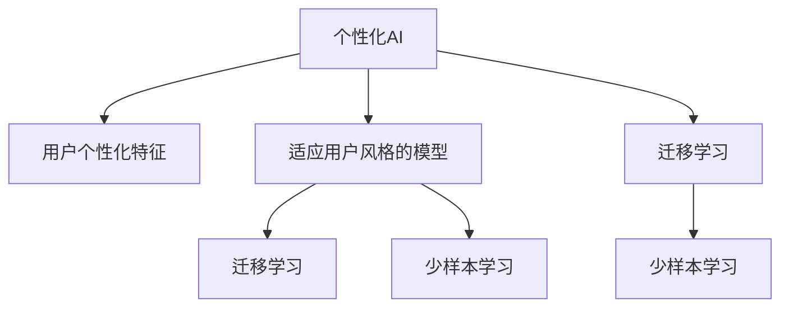

                 

# 个性化AI：适应用户风格的语言模型

在人工智能的迅猛发展中，个性化已成为技术发展的重要方向。特别是在自然语言处理（Natural Language Processing, NLP）领域，适应用户风格的语言模型不仅能够提供更为个性化的交互体验，还能提高任务的准确性和用户满意度。本文将深入探讨个性化AI的核心概念、算法原理和操作步骤，并结合实际应用场景，提出未来的发展趋势和面临的挑战，以期为AI技术的实践提供有价值的参考。

## 1. 背景介绍

### 1.1 问题由来
随着互联网和智能设备的普及，人们越来越依赖AI助手来进行日常沟通、信息查询、内容推荐等活动。然而，大多数通用AI系统缺乏对用户个性的深刻理解，导致推荐结果、对话交互常常难以满足用户预期。个性化AI模型通过适应用户风格，使得AI系统能够提供更为贴心的服务。

### 1.2 问题核心关键点
个性化AI的核心在于如何适应用户的个性化需求和风格。关键点包括：
1. **用户个性化特征提取**：从用户历史行为、偏好、语言习惯中提取个性化特征。
2. **适应用户风格的模型训练**：构建模型以适配用户的独特风格和需求。
3. **跨任务和跨领域适应性**：使得模型能够适应不同的任务和应用场景。
4. **动态更新和自适应性**：能够随着用户行为和环境变化，动态调整模型。

### 1.3 问题研究意义
适应用户风格的个性化AI技术具有重要意义：

- **提高用户体验**：通过个性化的服务，提升用户满意度和粘性。
- **优化推荐效果**：根据用户偏好，提供更精准的内容推荐。
- **提升决策质量**：在交互式任务中，提供更符合用户意图的服务。
- **促进社会互动**：通过个性化的交流，增强社会的互动和连通性。

## 2. 核心概念与联系

### 2.1 核心概念概述

为更好地理解个性化AI的核心概念，本节将介绍几个密切相关的核心概念：

- **个性化AI**：通过适应用户风格和偏好，提供个性化服务的人工智能系统。
- **用户个性化特征**：用户行为、兴趣、语言习惯等可量化特征。
- **适应用户风格的模型**：根据用户特征和风格训练的模型。
- **迁移学习**：将预训练模型适配到特定用户和任务上的过程。
- **少样本学习**：在少量标注样本下训练模型，实现快速适配新任务。

这些核心概念之间的逻辑关系可以通过以下Mermaid流程图来展示：



这个流程图展示了个性化AI的核心概念及其之间的关系：

1. 个性化AI系统通过用户个性化特征来适应用户风格。
2. 适应用户风格的模型通常通过迁移学习来实现，即将通用预训练模型适配到特定用户上。
3. 迁移学习中，少样本学习是一种高效的方式，能在少量标注样本下实现快速适配。

这些概念共同构成了个性化AI的实现框架，使得AI系统能够更好地理解和满足用户的个性化需求。

## 3. 核心算法原理 & 具体操作步骤
### 3.1 算法原理概述

个性化AI的算法原理主要涉及用户个性化特征的提取、适应用户风格的模型训练以及迁移学习等。其核心思想是通过对用户个性化特征的深入分析，构建适应特定用户风格的模型，并通过迁移学习等方法，将通用预训练模型适配到特定用户上，最终实现个性化的服务。

### 3.2 算法步骤详解

个性化AI的实现步骤通常包括以下几个关键环节：

**Step 1: 收集和处理用户数据**
- 收集用户行为数据（如浏览记录、点击记录、聊天记录等）。
- 对数据进行预处理和清洗，如去除噪声、标准化等。
- 提取用户个性化特征（如兴趣标签、语言风格等）。

**Step 2: 构建适应用户风格的模型**
- 选择合适的预训练模型（如BERT、GPT等）作为初始化参数。
- 根据用户个性化特征设计模型适配层。
- 使用迁移学习或少样本学习技术，将模型适配到特定用户上。

**Step 3: 训练和优化模型**
- 定义损失函数（如交叉熵损失、均方误差损失等）。
- 设置优化算法（如Adam、SGD等）及其参数。
- 使用梯度下降等优化算法进行模型训练，最小化损失函数。

**Step 4: 测试和部署**
- 在测试集上评估模型性能，如准确率、召回率等。
- 将模型部署到实际应用场景中，如智能客服、推荐系统等。
- 持续收集用户反馈，动态更新模型。

### 3.3 算法优缺点

个性化AI具有以下优点：

- **提升用户体验**：通过个性化的服务，提高用户满意度和粘性。
- **优化推荐效果**：根据用户偏好，提供更精准的内容推荐。
- **提升决策质量**：在交互式任务中，提供更符合用户意图的服务。

但同时也存在一些局限性：

- **数据隐私问题**：用户数据涉及隐私，需严格保护。
- **模型复杂性**：适应用户风格需设计复杂的模型结构，增加了开发难度。
- **泛化能力**：个性化模型往往针对特定用户，泛化能力有限。

### 3.4 算法应用领域

个性化AI技术在多个领域得到广泛应用，以下是一些典型的应用场景：

- **智能客服系统**：根据用户的历史对话记录，构建适应用户风格的模型，提供个性化回答。
- **内容推荐系统**：利用用户的行为数据，构建个性化模型，实现精准推荐。
- **个性化广告投放**：分析用户的兴趣和行为特征，提供定制化的广告内容。
- **聊天机器人**：适应用户的交流风格，提升对话的自然性和连贯性。
- **社交媒体**：根据用户的社交行为和兴趣，提供个性化的内容推荐。

## 4. 数学模型和公式 & 详细讲解 & 举例说明

### 4.1 数学模型构建

个性化AI的数学模型构建主要涉及用户个性化特征的提取和适应用户风格的模型训练。

**用户个性化特征**：假设用户的历史行为数据为 $D=\{(x_i,y_i)\}_{i=1}^N$，其中 $x_i$ 表示用户行为特征，$y_i$ 表示用户对 $x_i$ 的偏好。

**适应用户风格的模型**：记适应用户风格的模型为 $M_{\theta}$，其中 $\theta$ 为模型参数。定义模型 $M_{\theta}$ 在用户行为特征 $x$ 上的损失函数为 $\ell(M_{\theta}(x),y)$，则在数据集 $D$ 上的经验风险为：

$$
\mathcal{L}(\theta) = \frac{1}{N} \sum_{i=1}^N \ell(M_{\theta}(x_i),y_i)
$$

通过优化算法（如梯度下降）最小化经验风险，得到适配用户的模型参数 $\hat{\theta}$。

### 4.2 公式推导过程

以下我们以智能客服系统为例，推导适应用户风格的模型训练过程。

假设用户历史对话数据为 $D=\{(c_i, r_i)\}_{i=1}^N$，其中 $c_i$ 表示用户的历史回答，$r_i$ 表示用户的实际回复。定义模型 $M_{\theta}$ 在用户回答 $c$ 上的预测回复为 $r=M_{\theta}(c)$。

模型的训练目标是最小化预测回复 $r$ 与实际回复 $r_i$ 之间的差异，即最小化损失函数：

$$
\ell(r_i, r) = \frac{1}{N} \sum_{i=1}^N \ell(r_i, r)
$$

其中 $\ell(r_i, r)$ 为预测回复与实际回复之间的差异度量函数，如均方误差或交叉熵。通过梯度下降等优化算法，最小化损失函数，得到适应用户风格的模型参数 $\hat{\theta}$。

### 4.3 案例分析与讲解

**智能客服系统案例**：
假设某智能客服系统需要对用户进行个性化适配，收集到历史对话数据 $D=\{(c_i, r_i)\}_{i=1}^N$。

**步骤 1: 数据预处理**
- 对历史对话数据进行清洗和标准化。
- 提取用户语言风格特征（如语言习惯、用词偏好等）。

**步骤 2: 模型构建**
- 选择BERT或GPT等预训练模型作为初始化参数。
- 设计适配层，根据用户语言风格特征调整模型输出。

**步骤 3: 模型训练**
- 定义损失函数，如交叉熵损失。
- 设置优化算法（如Adam）及其参数。
- 使用梯度下降等优化算法进行模型训练，最小化损失函数。

**步骤 4: 模型评估**
- 在测试集上评估模型性能，如F1-score、BLEU等。
- 将模型部署到实际客服场景中，收集用户反馈。

## 5. 项目实践：代码实例和详细解释说明
### 5.1 开发环境搭建

在进行个性化AI的实践前，我们需要准备好开发环境。以下是使用Python进行PyTorch开发的环境配置流程：

1. 安装Anaconda：从官网下载并安装Anaconda，用于创建独立的Python环境。

2. 创建并激活虚拟环境：
```bash
conda create -n pytorch-env python=3.8 
conda activate pytorch-env
```

3. 安装PyTorch：根据CUDA版本，从官网获取对应的安装命令。例如：
```bash
conda install pytorch torchvision torchaudio cudatoolkit=11.1 -c pytorch -c conda-forge
```

4. 安装相关库：
```bash
pip install numpy pandas scikit-learn transformers
```

完成上述步骤后，即可在`pytorch-env`环境中开始个性化AI的实践。

### 5.2 源代码详细实现

下面我们以智能客服系统为例，给出使用Transformers库对BERT模型进行个性化适配的PyTorch代码实现。

首先，定义智能客服系统中的数据处理函数：

```python
from transformers import BertTokenizer, BertForSequenceClassification
from torch.utils.data import Dataset
import torch

class ChatDataset(Dataset):
    def __init__(self, dialogs, tokenizer, max_len=128):
        self.dialogs = dialogs
        self.tokenizer = tokenizer
        self.max_len = max_len
        
    def __len__(self):
        return len(self.dialogs)
    
    def __getitem__(self, item):
        dialog = self.dialogs[item]
        text = dialog[0]
        label = dialog[1]
        
        encoding = self.tokenizer(text, return_tensors='pt', max_length=self.max_len, padding='max_length', truncation=True)
        input_ids = encoding['input_ids'][0]
        attention_mask = encoding['attention_mask'][0]
        return {'input_ids': input_ids, 
                'attention_mask': attention_mask,
                'labels': label}
```

然后，定义模型和优化器：

```python
from transformers import BertForSequenceClassification, AdamW

model = BertForSequenceClassification.from_pretrained('bert-base-cased', num_labels=2)

optimizer = AdamW(model.parameters(), lr=2e-5)
```

接着，定义训练和评估函数：

```python
from torch.utils.data import DataLoader
from tqdm import tqdm
from sklearn.metrics import f1_score

device = torch.device('cuda') if torch.cuda.is_available() else torch.device('cpu')
model.to(device)

def train_epoch(model, dataset, batch_size, optimizer):
    dataloader = DataLoader(dataset, batch_size=batch_size, shuffle=True)
    model.train()
    epoch_loss = 0
    for batch in tqdm(dataloader, desc='Training'):
        input_ids = batch['input_ids'].to(device)
        attention_mask = batch['attention_mask'].to(device)
        labels = batch['labels'].to(device)
        model.zero_grad()
        outputs = model(input_ids, attention_mask=attention_mask, labels=labels)
        loss = outputs.loss
        epoch_loss += loss.item()
        loss.backward()
        optimizer.step()
    return epoch_loss / len(dataloader)

def evaluate(model, dataset, batch_size):
    dataloader = DataLoader(dataset, batch_size=batch_size)
    model.eval()
    preds, labels = [], []
    with torch.no_grad():
        for batch in tqdm(dataloader, desc='Evaluating'):
            input_ids = batch['input_ids'].to(device)
            attention_mask = batch['attention_mask'].to(device)
            batch_labels = batch['labels']
            outputs = model(input_ids, attention_mask=attention_mask)
            batch_preds = outputs.logits.argmax(dim=1).to('cpu').tolist()
            batch_labels = batch_labels.to('cpu').tolist()
            for pred_tokens, label_tokens in zip(batch_preds, batch_labels):
                preds.append(pred_tokens)
                labels.append(label_tokens)
                
    print(f1_score(labels, preds))
```

最后，启动训练流程并在测试集上评估：

```python
epochs = 5
batch_size = 16

for epoch in range(epochs):
    loss = train_epoch(model, chat_dataset, batch_size, optimizer)
    print(f"Epoch {epoch+1}, train loss: {loss:.3f}")
    
    print(f"Epoch {epoch+1}, dev results:")
    evaluate(model, chat_dataset, batch_size)
    
print("Test results:")
evaluate(model, chat_dataset, batch_size)
```

以上就是使用PyTorch对BERT进行智能客服系统个性化适配的完整代码实现。可以看到，通过Transformers库，我们能够快速构建并训练适应用户风格的模型。

### 5.3 代码解读与分析

让我们再详细解读一下关键代码的实现细节：

**ChatDataset类**：
- `__init__`方法：初始化对话数据、分词器和最大长度等关键组件。
- `__len__`方法：返回数据集的样本数量。
- `__getitem__`方法：对单个样本进行处理，将对话文本输入编码为token ids，将标签编码为数字，并对其进行定长padding，最终返回模型所需的输入。

**模型和优化器**：
- 选择BERT模型作为初始化参数，并设置适当的标签数。
- 设置Adam优化器和合适的学习率。

**训练和评估函数**：
- 使用PyTorch的DataLoader对数据集进行批次化加载，供模型训练和推理使用。
- 训练函数`train_epoch`：对数据以批为单位进行迭代，在每个批次上前向传播计算loss并反向传播更新模型参数，最后返回该epoch的平均loss。
- 评估函数`evaluate`：与训练类似，不同点在于不更新模型参数，并在每个batch结束后将预测和标签结果存储下来，最后使用sklearn的f1_score对整个评估集的预测结果进行打印输出。

**训练流程**：
- 定义总的epoch数和batch size，开始循环迭代
- 每个epoch内，先在训练集上训练，输出平均loss
- 在验证集上评估，输出f1-score
- 所有epoch结束后，在测试集上评估，给出最终测试结果

可以看到，PyTorch配合Transformers库使得BERT个性化适配的代码实现变得简洁高效。开发者可以将更多精力放在数据处理、模型改进等高层逻辑上，而不必过多关注底层的实现细节。

## 6. 实际应用场景
### 6.1 智能客服系统

智能客服系统可以通过个性化AI技术，根据用户的对话历史和行为特征，构建适应用户风格的模型，提供个性化的回答。这不仅提高了客服效率，还提升了用户满意度。例如，针对技术支持领域的智能客服，系统可以根据用户的历史咨询记录，适应用户的技术水平和语言习惯，提供更加准确和贴心的解答。

### 6.2 内容推荐系统

内容推荐系统通过分析用户的浏览、点击、评分等行为数据，构建适应用户风格的模型，实现精准推荐。例如，基于用户的阅读习惯和评分历史，推荐系统可以为用户推荐更加符合其兴趣和偏好的书籍、文章等。这种个性化推荐，不仅能提升用户体验，还能增加平台的粘性和活跃度。

### 6.3 个性化广告投放

个性化AI技术在广告投放中也得到了广泛应用。通过分析用户的搜索、浏览、购买等行为数据，广告系统可以构建适应用户风格的模型，实现精准的广告投放。例如，对于电商网站，可以根据用户的购物记录和浏览偏好，推荐符合其兴趣的商品广告，提高广告的点击率和转化率。

### 6.4 聊天机器人

聊天机器人是个性化AI的典型应用之一。通过适应用户的语言风格和偏好，聊天机器人可以提供自然流畅的对话交互体验。例如，针对医疗领域的聊天机器人，可以根据用户的问题和语言习惯，提供专业而友好的解答，增强用户的信任和依赖。

### 6.5 社交媒体

社交媒体平台通过分析用户的社交行为和兴趣，构建适应用户风格的模型，提供个性化的内容推荐。例如，根据用户的点赞、评论、分享等行为，社交媒体可以推荐符合其兴趣和偏好的内容，增加平台的活跃度和用户粘性。

## 7. 工具和资源推荐
### 7.1 学习资源推荐

为了帮助开发者系统掌握个性化AI的理论基础和实践技巧，这里推荐一些优质的学习资源：

1. 《深度学习》课程（斯坦福大学）：深入介绍深度学习的基本概念和原理，涵盖NLP等多个领域。
2. 《自然语言处理与深度学习》课程（Coursera）：系统讲解NLP的理论与实践，包括个性化的语言模型。
3. 《深度学习入门》书籍：详细阐述深度学习的核心技术，包括个性化AI的实现。
4. 《AI实战》书籍：结合具体应用案例，讲解AI技术在各行各业的应用，包括个性化AI。
5. HuggingFace官方文档：提供丰富的预训练模型和示例代码，助力个性化AI的开发。

通过对这些资源的学习实践，相信你一定能够快速掌握个性化AI的精髓，并用于解决实际的NLP问题。

### 7.2 开发工具推荐

高效的开发离不开优秀的工具支持。以下是几款用于个性化AI开发的常用工具：

1. PyTorch：基于Python的开源深度学习框架，灵活动态的计算图，适合快速迭代研究。
2. TensorFlow：由Google主导开发的开源深度学习框架，生产部署方便，适合大规模工程应用。
3. Transformers库：HuggingFace开发的NLP工具库，集成了众多SOTA语言模型，支持PyTorch和TensorFlow，是进行个性化AI开发的利器。
4. Weights & Biases：模型训练的实验跟踪工具，可以记录和可视化模型训练过程中的各项指标，方便对比和调优。
5. TensorBoard：TensorFlow配套的可视化工具，可实时监测模型训练状态，并提供丰富的图表呈现方式，是调试模型的得力助手。
6. Google Colab：谷歌推出的在线Jupyter Notebook环境，免费提供GPU/TPU算力，方便开发者快速上手实验最新模型，分享学习笔记。

合理利用这些工具，可以显著提升个性化AI的开发效率，加快创新迭代的步伐。

### 7.3 相关论文推荐

个性化AI技术的发展源于学界的持续研究。以下是几篇奠基性的相关论文，推荐阅读：

1. Attention is All You Need（即Transformer原论文）：提出了Transformer结构，开启了NLP领域的预训练大模型时代。
2. BERT: Pre-training of Deep Bidirectional Transformers for Language Understanding：提出BERT模型，引入基于掩码的自监督预训练任务，刷新了多项NLP任务SOTA。
3. Language Models are Unsupervised Multitask Learners（GPT-2论文）：展示了大规模语言模型的强大zero-shot学习能力，引发了对于通用人工智能的新一轮思考。
4. Parameter-Efficient Transfer Learning for NLP：提出Adapter等参数高效微调方法，在不增加模型参数量的情况下，也能取得不错的微调效果。
5. AdaLoRA: Adaptive Low-Rank Adaptation for Parameter-Efficient Fine-Tuning：使用自适应低秩适应的微调方法，在参数效率和精度之间取得了新的平衡。
6. Masked Language Model：引入掩码语言模型，提高语言模型的泛化能力和适应性。

这些论文代表了个性化AI的发展脉络。通过学习这些前沿成果，可以帮助研究者把握学科前进方向，激发更多的创新灵感。

## 8. 总结：未来发展趋势与挑战

### 8.1 总结

本文对适应用户风格的个性化AI模型进行了全面系统的介绍。首先阐述了个性化AI的研究背景和意义，明确了适应用户风格模型的重要性和实现框架。其次，从原理到实践，详细讲解了个性化AI的数学模型和关键操作步骤，给出了个性化AI任务开发的完整代码实例。同时，本文还广泛探讨了个性化AI在多个行业领域的应用前景，展示了个性化AI技术的广阔前景。

通过本文的系统梳理，可以看到，适应用户风格的个性化AI模型正在成为NLP领域的重要范式，极大地拓展了预训练语言模型的应用边界，催生了更多的落地场景。得益于大规模语料的预训练，个性化模型能够更好地适应用户需求，提升NLP系统的性能和用户满意度。未来，伴随个性化AI技术的持续演进，基于个性化模型的NLP系统必将在更多领域大放异彩，深刻影响人类的生产生活方式。

### 8.2 未来发展趋势

展望未来，适应用户风格的个性化AI技术将呈现以下几个发展趋势：

1. **数据隐私保护**：随着数据隐私意识的增强，如何在保证个性化服务的同时保护用户隐私，将是未来的一个重要研究方向。
2. **模型可解释性**：适应用户风格的模型需要具有更好的可解释性，以便用户理解和信任。如何设计模型结构和输出解释机制，将是研究热点。
3. **少样本学习**：在标注数据不足的情况下，如何通过适应用户风格的模型实现快速适配新任务，将是未来的重要研究方向。
4. **跨领域适应性**：如何构建适应用户风格的多领域模型，提升模型的跨领域适应能力，将是未来的重要课题。
5. **动态更新和自适应性**：适应用户风格的模型需要具有动态更新和自适应能力，以便随用户行为和环境变化进行调整。
6. **多模态融合**：适应用户风格的模型可以与其他模态的信息进行融合，提升模型的理解和生成能力。

以上趋势凸显了适应用户风格的个性化AI技术的广阔前景。这些方向的探索发展，必将进一步提升NLP系统的性能和用户满意度，为人工智能技术的应用提供新的思路和方向。

### 8.3 面临的挑战

尽管适应用户风格的个性化AI技术已经取得了显著进展，但在迈向更加智能化、普适化应用的过程中，仍面临诸多挑战：

1. **数据隐私问题**：个性化AI需要大量用户数据进行训练和适配，如何在保证数据隐私的前提下进行模型训练和适配，将是未来的一大难题。
2. **模型复杂性**：适应用户风格的模型需要设计复杂的模型结构和适配层，增加了开发和调试的难度。
3. **泛化能力**：个性化模型往往针对特定用户，泛化能力有限，如何在不同用户间进行迁移学习，是未来的重要研究方向。
4. **计算资源消耗**：适应用户风格的模型通常需要大量的计算资源进行训练和推理，如何在保证性能的同时降低资源消耗，将是未来的研究方向。
5. **可解释性问题**：适应用户风格的模型通常被视为"黑盒"系统，如何增强模型的可解释性和可审计性，将是未来的重要研究方向。
6. **安全性问题**：适应用户风格的模型可能学习到有害信息，如何保证模型输出的安全性，将是未来的重要研究方向。

### 8.4 未来突破

面对适应用户风格的个性化AI所面临的种种挑战，未来的研究需要在以下几个方面寻求新的突破：

1. **数据隐私保护技术**：采用差分隐私、联邦学习等技术，保护用户隐私，同时保证个性化服务的质量。
2. **模型可解释性技术**：引入因果推理、可解释性AI等技术，提高模型的可解释性和可审计性。
3. **少样本学习技术**：采用对抗学习、元学习等技术，实现少样本学习，减少对标注数据的依赖。
4. **跨领域适应性技术**：采用迁移学习、多任务学习等技术，提升模型的跨领域适应能力。
5. **动态更新技术**：采用在线学习、自适应学习等技术，提升模型的动态更新和自适应能力。
6. **多模态融合技术**：将视觉、语音等多模态信息与文本信息进行融合，提升模型的理解和生成能力。

这些研究方向的探索，必将引领适应用户风格的个性化AI技术迈向更高的台阶，为人工智能技术的应用提供新的思路和方向。只有勇于创新、敢于突破，才能不断拓展个性化AI的边界，让智能技术更好地造福人类社会。

## 9. 附录：常见问题与解答

**Q1：适应用户风格的模型如何进行训练？**

A: 适应用户风格的模型通常通过迁移学习和少样本学习进行训练。具体步骤如下：
1. 收集用户历史数据，提取用户个性化特征。
2. 选择预训练模型，如BERT、GPT等，作为初始化参数。
3. 设计适配层，根据用户个性化特征调整模型输出。
4. 使用迁移学习和少样本学习技术，最小化模型预测输出与用户真实标签的差异，得到适应用户风格的模型参数。

**Q2：适应用户风格的模型如何应用于实际场景？**

A: 适应用户风格的模型可以应用于多种实际场景，如智能客服、内容推荐、个性化广告等。具体步骤如下：
1. 收集用户历史数据，提取用户个性化特征。
2. 构建适应用户风格的模型，根据用户特征进行训练。
3. 将模型部署到实际应用场景中，如智能客服系统、内容推荐系统等。
4. 持续收集用户反馈，动态更新模型，提升服务质量。

**Q3：适应用户风格的模型面临哪些挑战？**

A: 适应用户风格的模型面临以下挑战：
1. 数据隐私问题：如何在保护用户隐私的前提下进行模型训练和适配。
2. 模型复杂性：适应用户风格的模型需要设计复杂的模型结构和适配层，增加了开发和调试的难度。
3. 泛化能力：个性化模型往往针对特定用户，泛化能力有限。
4. 计算资源消耗：适应用户风格的模型通常需要大量的计算资源进行训练和推理。
5. 可解释性问题：适应用户风格的模型通常被视为"黑盒"系统，如何增强模型的可解释性和可审计性。
6. 安全性问题：适应用户风格的模型可能学习到有害信息，如何保证模型输出的安全性。

**Q4：适应用户风格的模型有哪些应用场景？**

A: 适应用户风格的模型可以应用于多种场景，如智能客服系统、内容推荐系统、个性化广告等。具体应用场景包括：
1. 智能客服系统：根据用户历史对话记录，适应用户的语言习惯和风格，提供个性化的回答。
2. 内容推荐系统：分析用户的浏览、点击、评分等行为数据，提供个性化的内容推荐。
3. 个性化广告投放：分析用户的搜索、浏览、购买等行为数据，提供个性化的广告推荐。
4. 聊天机器人：适应用户的语言风格和偏好，提供自然流畅的对话交互体验。
5. 社交媒体：分析用户的点赞、评论、分享等行为，提供个性化的内容推荐。

---

作者：禅与计算机程序设计艺术 / Zen and the Art of Computer Programming

