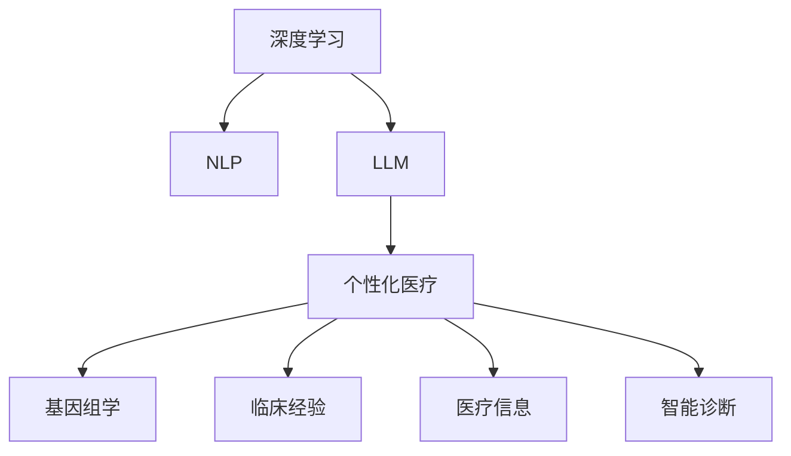

                 

# 个性化医疗：LLM 基于个体的治疗

> 关键词：人工智能, 自然语言处理, 个性化医疗, 深度学习, 基因组学, 患者数据, 治疗方案, 药物开发, 医疗信息, 健康管理, 智能诊断

## 1. 背景介绍

### 1.1 问题由来
现代医学已经进入个体化时代，每个患者的基因、环境、生活习惯等因素千差万别，单一的治疗方案往往无法满足不同患者的实际需求。个性化医疗的核心理念是根据个体差异，量身定制的治疗方案，以提高治疗效果，减少副作用，降低医疗成本。而这一理念与人工智能（AI）和大语言模型（LLM）的跨学科融合，为医疗实践带来了新的可能性。

### 1.2 问题核心关键点
个性化医疗的核心在于深度理解每个患者的独特基因和病历信息，并结合最新的医学研究成果和临床经验，精准制定治疗方案。利用AI和大语言模型，可以实现大规模医疗知识的存储与检索，提升疾病诊断的准确性和治疗方案的制定效率。

## 2. 核心概念与联系

### 2.1 核心概念概述

为更好地理解LLM在个性化医疗中的应用，本节将介绍几个关键概念：

- **深度学习**：一种模拟人类神经网络工作原理的机器学习方法，通过多层神经网络进行特征提取和模型训练。
- **自然语言处理（NLP）**：一种使计算机能够理解、解析、生成人类语言的技术，是实现个性化医疗中医疗文本信息处理的基础。
- **大语言模型（LLM）**：基于深度学习，能够处理大规模无标签文本数据，从中学习到语言模式和知识表示的模型。
- **个性化医疗**：根据每个患者的独特基因、病史、生活习惯等因素，量身定制的治疗方案。
- **基因组学**：研究基因序列的结构和功能，以及它们在疾病发生和发展中的作用的学科。
- **临床经验**：医生在实践中积累的知识和技能。
- **医疗信息**：与患者健康状况相关的数据和信息，包括病历、检验报告、影像数据等。
- **智能诊断**：利用AI技术进行疾病诊断，提高诊断的准确性和效率。

这些概念之间的逻辑关系可以通过以下Mermaid流程图来展示：



这个流程图展示了大语言模型与深度学习、自然语言处理、个性化医疗等多个概念之间的内在联系。

## 3. 核心算法原理 & 具体操作步骤
### 3.1 算法原理概述

基于大语言模型的个性化医疗算法，其核心思想是：利用大语言模型强大的语言理解和生成能力，将患者的病历、基因组数据等医学信息转换成易于计算机理解和处理的语言文本，通过预训练和微调，结合最新的医学研究成果和临床经验，生成个性化治疗方案。

具体而言，算法分为以下几个步骤：

1. **文本预处理**：对患者的病历、基因组数据、医疗信息等转换成标准的语言文本。
2. **预训练**：利用大规模无标签的医学文献数据，训练大语言模型，学习通用的医学知识表示。
3. **微调**：在特定患者的病历和基因组数据上，对预训练模型进行微调，生成针对该患者的个性化治疗方案。
4. **方案验证**：利用已有的临床经验，对生成的治疗方案进行验证和调整，确保其科学性和可行性。

### 3.2 算法步骤详解

#### 步骤 1: 文本预处理

文本预处理是实现个性化医疗的第一步，主要包括以下几个环节：

1. **文本清洗**：去除噪声和无关信息，保留有价值的数据。
2. **分词和标注**：将文本分成单独的词汇，并为每个词汇打上标记，便于后续处理。
3. **标准化处理**：对文本进行统一的标准化处理，如大小写统一、缩写扩展等。
4. **结构化处理**：将文本转换成结构化的数据格式，如JSON、XML等，便于计算机处理。

#### 步骤 2: 预训练

预训练过程的目的是学习通用的医学知识表示。具体步骤为：

1. **数据准备**：收集大规模的医学文献数据，如PubMed、ClinicalTrials等。
2. **数据预处理**：清洗、标注、标准化等预处理步骤。
3. **模型选择**：选择合适的预训练模型，如BERT、RoBERTa等。
4. **训练过程**：利用预训练数据集对模型进行训练，学习通用的医学知识表示。
5. **保存模型**：保存训练好的模型，供后续微调使用。

#### 步骤 3: 微调

微调过程的目的是生成针对特定患者的个性化治疗方案。具体步骤为：

1. **数据准备**：收集该患者的病历、基因组数据、医疗信息等文本数据。
2. **任务定义**：根据患者的具体情况，定义生成治疗方案的任务。
3. **模型微调**：在预训练模型的基础上，对特定患者的文本数据进行微调，生成治疗方案。
4. **方案验证**：利用已有的临床经验，对生成的治疗方案进行验证和调整。

#### 步骤 4: 方案验证

方案验证的目的是确保生成的治疗方案科学、可行。具体步骤为：

1. **专家评审**：邀请领域专家对生成的治疗方案进行评审，确保其符合医学规范。
2. **临床试验**：对生成的治疗方案进行临床试验，验证其效果和安全性。
3. **调整优化**：根据试验结果，调整和优化生成的治疗方案。

### 3.3 算法优缺点

基于大语言模型的个性化医疗算法具有以下优点：

1. **高效性**：利用预训练和微调，可以在较短的时间内生成个性化治疗方案。
2. **广泛性**：可以处理多种类型的医学信息，包括病历、基因组数据、临床试验数据等。
3. **灵活性**：可以根据患者的具体情况，灵活调整生成的治疗方案。

但同时也存在一些缺点：

1. **数据依赖**：对高质量、大规模的医学数据依赖较高，数据获取成本较高。
2. **模型复杂性**：模型复杂度较高，需要较强的计算资源支持。
3. **偏见和误导**：模型可能学习到错误的知识，生成误导性或有害的治疗方案。
4. **可解释性不足**：模型的生成过程缺乏可解释性，难以理解其内部的决策机制。

### 3.4 算法应用领域

基于大语言模型的个性化医疗算法，已经在多个领域得到了广泛的应用，例如：

1. **疾病诊断**：利用大语言模型对病历、影像数据进行处理，辅助医生进行疾病诊断。
2. **治疗方案生成**：根据患者的基因组数据、病历等，生成个性化的治疗方案。
3. **药物开发**：利用大语言模型对药物分子进行描述，辅助药物设计和筛选。
4. **健康管理**：通过收集和管理患者的生活数据，生成个性化的健康管理建议。
5. **智能问答**：利用大语言模型对患者的问题进行回答，提供医学咨询和健康指导。

## 4. 数学模型和公式 & 详细讲解 & 举例说明
### 4.1 数学模型构建

基于大语言模型的个性化医疗算法，可以构建如下数学模型：

设 $X$ 为患者的病历和基因组数据组成的文本，$Y$ 为生成的治疗方案，模型 $M_{\theta}$ 为预训练的大语言模型。

模型的目标函数为：

$$
\min_{\theta} \mathcal{L}(M_{\theta}(X), Y) = \frac{1}{N} \sum_{i=1}^N \ell(M_{\theta}(x_i), y_i)
$$

其中 $\ell$ 为损失函数，可以是交叉熵损失、均方误差损失等。

### 4.2 公式推导过程

以生成治疗方案为例，利用BERT模型进行推导：

1. **文本表示**：将患者的病历和基因组数据转换成向量表示 $x \in \mathbb{R}^d$。
2. **预训练模型**：利用BERT模型进行预训练，学习通用的医学知识表示 $M_{\theta}(x)$。
3. **微调**：在特定患者的病历和基因组数据上，对预训练模型进行微调，生成治疗方案 $y$。
4. **损失函数**：定义损失函数 $\ell(y, M_{\theta}(x))$，衡量生成的治疗方案与真实方案的差距。
5. **优化算法**：利用梯度下降等优化算法，更新模型参数 $\theta$，最小化损失函数。

### 4.3 案例分析与讲解

假设有一个患者A，其病历描述为：“患者A，女，45岁，高血压病史3年，当前血压140/90mmHg，体检报告显示心电图异常。” 基因组数据显示其高血压相关基因存在变异。

1. **文本预处理**：清洗文本，去除噪声和无关信息，保留有价值的数据，并进行分词和标准化处理。
2. **预训练**：使用BERT模型，在PubMed等大规模医学文献数据上进行预训练，学习通用的医学知识表示。
3. **微调**：在患者A的病历和基因组数据上，对预训练模型进行微调，生成个性化的治疗方案。
4. **方案验证**：邀请领域专家对生成的治疗方案进行评审，确保其符合医学规范。

## 5. 项目实践：代码实例和详细解释说明
### 5.1 开发环境搭建

在进行项目实践前，我们需要准备好开发环境。以下是使用Python进行PyTorch开发的环境配置流程：

1. 安装Anaconda：从官网下载并安装Anaconda，用于创建独立的Python环境。

2. 创建并激活虚拟环境：
```bash
conda create -n pytorch-env python=3.8 
conda activate pytorch-env
```

3. 安装PyTorch：根据CUDA版本，从官网获取对应的安装命令。例如：
```bash
conda install pytorch torchvision torchaudio cudatoolkit=11.1 -c pytorch -c conda-forge
```

4. 安装Transformers库：
```bash
pip install transformers
```

5. 安装各类工具包：
```bash
pip install numpy pandas scikit-learn matplotlib tqdm jupyter notebook ipython
```

完成上述步骤后，即可在`pytorch-env`环境中开始项目实践。

### 5.2 源代码详细实现

这里我们以基于BERT模型的疾病诊断为例，给出使用Transformers库的代码实现。

首先，定义任务的数据处理函数：

```python
from transformers import BertTokenizer
from torch.utils.data import Dataset
import torch

class DiseaseDataset(Dataset):
    def __init__(self, texts, labels, tokenizer, max_len=128):
        self.texts = texts
        self.labels = labels
        self.tokenizer = tokenizer
        self.max_len = max_len
        
    def __len__(self):
        return len(self.texts)
    
    def __getitem__(self, item):
        text = self.texts[item]
        label = self.labels[item]
        
        encoding = self.tokenizer(text, return_tensors='pt', max_length=self.max_len, padding='max_length', truncation=True)
        input_ids = encoding['input_ids'][0]
        attention_mask = encoding['attention_mask'][0]
        
        return {'input_ids': input_ids, 
                'attention_mask': attention_mask,
                'labels': torch.tensor(label, dtype=torch.long)}
```

然后，定义模型和优化器：

```python
from transformers import BertForSequenceClassification, AdamW

model = BertForSequenceClassification.from_pretrained('bert-base-cased', num_labels=2)

optimizer = AdamW(model.parameters(), lr=2e-5)
```

接着，定义训练和评估函数：

```python
from torch.utils.data import DataLoader
from tqdm import tqdm
from sklearn.metrics import accuracy_score

device = torch.device('cuda') if torch.cuda.is_available() else torch.device('cpu')
model.to(device)

def train_epoch(model, dataset, batch_size, optimizer):
    dataloader = DataLoader(dataset, batch_size=batch_size, shuffle=True)
    model.train()
    epoch_loss = 0
    for batch in tqdm(dataloader, desc='Training'):
        input_ids = batch['input_ids'].to(device)
        attention_mask = batch['attention_mask'].to(device)
        labels = batch['labels'].to(device)
        model.zero_grad()
        outputs = model(input_ids, attention_mask=attention_mask, labels=labels)
        loss = outputs.loss
        epoch_loss += loss.item()
        loss.backward()
        optimizer.step()
    return epoch_loss / len(dataloader)

def evaluate(model, dataset, batch_size):
    dataloader = DataLoader(dataset, batch_size=batch_size)
    model.eval()
    preds, labels = [], []
    with torch.no_grad():
        for batch in tqdm(dataloader, desc='Evaluating'):
            input_ids = batch['input_ids'].to(device)
            attention_mask = batch['attention_mask'].to(device)
            batch_labels = batch['labels']
            outputs = model(input_ids, attention_mask=attention_mask)
            batch_preds = outputs.logits.argmax(dim=1).to('cpu').tolist()
            batch_labels = batch_labels.to('cpu').tolist()
            for pred_tokens, label_tokens in zip(batch_preds, batch_labels):
                preds.append(pred_tokens)
                labels.append(label_tokens)
                
    return accuracy_score(labels, preds)
```

最后，启动训练流程并在测试集上评估：

```python
epochs = 5
batch_size = 16

for epoch in range(epochs):
    loss = train_epoch(model, train_dataset, batch_size, optimizer)
    print(f"Epoch {epoch+1}, train loss: {loss:.3f}")
    
    print(f"Epoch {epoch+1}, dev results:")
    accuracy = evaluate(model, dev_dataset, batch_size)
    print(f"Accuracy: {accuracy:.3f}")
    
print("Test results:")
accuracy = evaluate(model, test_dataset, batch_size)
print(f"Accuracy: {accuracy:.3f}")
```

以上就是使用PyTorch和Transformers库对BERT进行疾病诊断任务微调的完整代码实现。可以看到，得益于Transformers库的强大封装，我们可以用相对简洁的代码完成BERT模型的加载和微调。

### 5.3 代码解读与分析

让我们再详细解读一下关键代码的实现细节：

**DiseaseDataset类**：
- `__init__`方法：初始化文本、标签、分词器等关键组件。
- `__len__`方法：返回数据集的样本数量。
- `__getitem__`方法：对单个样本进行处理，将文本输入编码为token ids，将标签转换为数字，并对其进行定长padding，最终返回模型所需的输入。

**BertForSequenceClassification类**：
- `from_pretrained`方法：加载预训练的BERT模型，指定任务类型为序列分类。
- `num_labels`参数：指定输出的标签数，用于多分类任务。

**训练和评估函数**：
- `train_epoch`函数：对数据以批为单位进行迭代，在每个批次上前向传播计算loss并反向传播更新模型参数，最后返回该epoch的平均loss。
- `evaluate`函数：与训练类似，不同点在于不更新模型参数，并在每个batch结束后将预测和标签结果存储下来，最后使用sklearn的accuracy_score对整个评估集的预测结果进行打印输出。

**训练流程**：
- 定义总的epoch数和batch size，开始循环迭代
- 每个epoch内，先在训练集上训练，输出平均loss
- 在验证集上评估，输出分类准确率
- 所有epoch结束后，在测试集上评估，给出最终测试准确率

可以看到，PyTorch配合Transformers库使得BERT微调的代码实现变得简洁高效。开发者可以将更多精力放在数据处理、模型改进等高层逻辑上，而不必过多关注底层的实现细节。

当然，工业级的系统实现还需考虑更多因素，如模型的保存和部署、超参数的自动搜索、更灵活的任务适配层等。但核心的微调范式基本与此类似。

## 6. 实际应用场景
### 6.1 智能诊断

基于大语言模型的智能诊断系统，能够利用患者的病历、影像数据、实验室报告等信息，辅助医生进行疾病诊断。例如，对于肺癌早期筛查，系统可以结合患者的影像数据和病历信息，生成初步诊断意见，供医生参考。

在技术实现上，可以收集大量的医学影像和病历数据，将每条数据标注为对应的疾病类型，训练大语言模型。模型能够理解影像和病历的描述，生成诊断意见。对于新患者的数据，系统可以自动进行预处理和分类，生成初步的诊断结果，供医生进行最终诊断。

### 6.2 治疗方案生成

个性化医疗的核心在于生成个性化的治疗方案。基于大语言模型的治疗方案生成系统，可以结合患者的基因组数据、病历信息、生活习惯等，生成最合适的治疗方案。

在技术实现上，可以收集大量已有的治疗方案数据，将每条数据标注为对应的患者信息，训练大语言模型。模型能够理解患者的特定情况，生成个性化的治疗方案。对于新患者的病历和基因组数据，系统可以自动进行预处理和分类，生成相应的治疗方案，供医生参考。

### 6.3 药物开发

药物开发是个性化医疗的重要环节，大语言模型可以辅助药物设计和筛选。例如，对于一种新药，系统可以结合其分子结构和生物活性数据，生成对其作用的描述，辅助药物设计。

在技术实现上，可以收集大量药物分子和生物活性数据，将每条数据标注为对应的药物信息，训练大语言模型。模型能够理解药物分子的结构和生物活性，生成对其作用的描述。对于新药物分子，系统可以自动进行预处理和分类，生成相应的描述，辅助药物设计。

### 6.4 未来应用展望

随着大语言模型和微调方法的不断发展，基于大语言模型的个性化医疗将在更多领域得到应用，为个性化医疗技术带来新的突破。

在智慧医疗领域，基于大语言模型的智能诊断和治疗方案生成系统，将大幅提升诊疗的效率和准确性，减少误诊和漏诊的风险。

在精准医学领域，利用大语言模型对基因组数据进行分析和解读，生成个性化的治疗方案，将显著提高治疗效果，减少副作用。

在远程医疗领域，基于大语言模型的智能问答系统，可以提供24小时在线的医学咨询服务，减轻医务人员的负担。

在智能健康管理领域，利用大语言模型对用户的健康数据进行分析，生成个性化的健康建议和预警，提升用户的健康管理水平。

此外，在个性化疫苗研发、慢性病管理、老年健康等方面，大语言模型和个性化医疗的结合，也将带来新的突破和创新。

## 7. 工具和资源推荐
### 7.1 学习资源推荐

为了帮助开发者系统掌握大语言模型在个性化医疗中的应用，这里推荐一些优质的学习资源：

1. 《Transformers: From Principle to Practice》系列博文：由大模型技术专家撰写，深入浅出地介绍了Transformer原理、BERT模型、微调技术等前沿话题。

2. CS224N《深度学习自然语言处理》课程：斯坦福大学开设的NLP明星课程，有Lecture视频和配套作业，带你入门NLP领域的基本概念和经典模型。

3. 《Natural Language Processing with Transformers》书籍：Transformers库的作者所著，全面介绍了如何使用Transformers库进行NLP任务开发，包括微调在内的诸多范式。

4. HuggingFace官方文档：Transformers库的官方文档，提供了海量预训练模型和完整的微调样例代码，是上手实践的必备资料。

5. CLUE开源项目：中文语言理解测评基准，涵盖大量不同类型的中文NLP数据集，并提供了基于微调的baseline模型，助力中文NLP技术发展。

通过对这些资源的学习实践，相信你一定能够快速掌握大语言模型在个性化医疗中的应用，并用于解决实际的NLP问题。

### 7.2 开发工具推荐

高效的开发离不开优秀的工具支持。以下是几款用于大语言模型微调开发的常用工具：

1. PyTorch：基于Python的开源深度学习框架，灵活动态的计算图，适合快速迭代研究。大部分预训练语言模型都有PyTorch版本的实现。

2. TensorFlow：由Google主导开发的开源深度学习框架，生产部署方便，适合大规模工程应用。同样有丰富的预训练语言模型资源。

3. Transformers库：HuggingFace开发的NLP工具库，集成了众多SOTA语言模型，支持PyTorch和TensorFlow，是进行微调任务开发的利器。

4. Weights & Biases：模型训练的实验跟踪工具，可以记录和可视化模型训练过程中的各项指标，方便对比和调优。与主流深度学习框架无缝集成。

5. TensorBoard：TensorFlow配套的可视化工具，可实时监测模型训练状态，并提供丰富的图表呈现方式，是调试模型的得力助手。

6. Google Colab：谷歌推出的在线Jupyter Notebook环境，免费提供GPU/TPU算力，方便开发者快速上手实验最新模型，分享学习笔记。

合理利用这些工具，可以显著提升大语言模型微调任务的开发效率，加快创新迭代的步伐。

### 7.3 相关论文推荐

大语言模型和微调技术的发展源于学界的持续研究。以下是几篇奠基性的相关论文，推荐阅读：

1. Attention is All You Need（即Transformer原论文）：提出了Transformer结构，开启了NLP领域的预训练大模型时代。

2. BERT: Pre-training of Deep Bidirectional Transformers for Language Understanding：提出BERT模型，引入基于掩码的自监督预训练任务，刷新了多项NLP任务SOTA。

3. Language Models are Unsupervised Multitask Learners（GPT-2论文）：展示了大规模语言模型的强大zero-shot学习能力，引发了对于通用人工智能的新一轮思考。

4. Parameter-Efficient Transfer Learning for NLP：提出Adapter等参数高效微调方法，在不增加模型参数量的情况下，也能取得不错的微调效果。

5. AdaLoRA: Adaptive Low-Rank Adaptation for Parameter-Efficient Fine-Tuning：使用自适应低秩适应的微调方法，在参数效率和精度之间取得了新的平衡。

6. Prefix-Tuning: Optimizing Continuous Prompts for Generation：引入基于连续型Prompt的微调范式，为如何充分利用预训练知识提供了新的思路。

这些论文代表了大语言模型微调技术的发展脉络。通过学习这些前沿成果，可以帮助研究者把握学科前进方向，激发更多的创新灵感。

## 8. 总结：未来发展趋势与挑战
### 8.1 总结

本文对基于大语言模型的个性化医疗算法进行了全面系统的介绍。首先阐述了个性化医疗和深度学习、自然语言处理等概念之间的联系，明确了大语言模型在个性化医疗中的应用价值。其次，从原理到实践，详细讲解了个性化医疗算法的数学模型和实现步骤，给出了代码实例和详细解释。同时，本文还广泛探讨了算法在智能诊断、治疗方案生成、药物开发等多个领域的应用前景，展示了大语言模型在个性化医疗中的巨大潜力。

通过本文的系统梳理，可以看到，基于大语言模型的个性化医疗算法正在成为个性化医疗领域的重要范式，极大地拓展了个性化医疗系统的应用边界，提升了诊疗的效率和准确性。未来，伴随大语言模型和微调方法的持续演进，基于大语言模型的个性化医疗必将在更广阔的领域中得到应用，为人类健康带来新的希望。

### 8.2 未来发展趋势

展望未来，基于大语言模型的个性化医疗算法将呈现以下几个发展趋势：

1. **模型规模持续增大**：随着算力成本的下降和数据规模的扩张，预训练语言模型的参数量还将持续增长。超大规模语言模型蕴含的丰富语言知识，有望支撑更加复杂多变的个性化医疗任务。

2. **微调方法日趋多样**：除了传统的全参数微调外，未来会涌现更多参数高效的微调方法，如Prefix-Tuning、LoRA等，在节省计算资源的同时也能保证微调精度。

3. **持续学习成为常态**：随着数据分布的不断变化，微调模型也需要持续学习新知识以保持性能。如何在不遗忘原有知识的同时，高效吸收新样本信息，将成为重要的研究课题。

4. **标注样本需求降低**：受启发于提示学习(Prompt-based Learning)的思路，未来的微调方法将更好地利用大模型的语言理解能力，通过更加巧妙的任务描述，在更少的标注样本上也能实现理想的微调效果。

5. **多模态微调崛起**：当前的微调主要聚焦于纯文本数据，未来会进一步拓展到图像、视频、语音等多模态数据微调。多模态信息的融合，将显著提升语言模型对现实世界的理解和建模能力。

6. **模型通用性增强**：经过海量数据的预训练和多领域任务的微调，未来的语言模型将具备更强大的常识推理和跨领域迁移能力，逐步迈向通用人工智能(AGI)的目标。

以上趋势凸显了大语言模型微调技术的广阔前景。这些方向的探索发展，必将进一步提升个性化医疗系统的性能和应用范围，为人类健康带来新的变革。

### 8.3 面临的挑战

尽管大语言模型微调技术已经取得了瞩目成就，但在迈向更加智能化、普适化应用的过程中，它仍面临着诸多挑战：

1. **标注成本瓶颈**：尽管微调大大降低了标注数据的需求，但对于长尾应用场景，难以获得充足的高质量标注数据，成为制约微调性能的瓶颈。如何进一步降低微调对标注样本的依赖，将是一大难题。

2. **模型鲁棒性不足**：当前微调模型面对域外数据时，泛化性能往往大打折扣。对于测试样本的微小扰动，微调模型的预测也容易发生波动。如何提高微调模型的鲁棒性，避免灾难性遗忘，还需要更多理论和实践的积累。

3. **推理效率有待提高**：大规模语言模型虽然精度高，但在实际部署时往往面临推理速度慢、内存占用大等效率问题。如何在保证性能的同时，简化模型结构，提升推理速度，优化资源占用，将是重要的优化方向。

4. **可解释性亟需加强**：当前微调模型更像是"黑盒"系统，难以解释其内部工作机制和决策逻辑。对于医疗、金融等高风险应用，算法的可解释性和可审计性尤为重要。如何赋予微调模型更强的可解释性，将是亟待攻克的难题。

5. **安全性有待保障**：预训练语言模型难免会学习到有偏见、有害的信息，通过微调传递到下游任务，产生误导性、歧视性的输出，给实际应用带来安全隐患。如何从数据和算法层面消除模型偏见，避免恶意用途，确保输出的安全性，也将是重要的研究课题。

6. **知识整合能力不足**：现有的微调模型往往局限于任务内数据，难以灵活吸收和运用更广泛的先验知识。如何让微调过程更好地与外部知识库、规则库等专家知识结合，形成更加全面、准确的信息整合能力，还有很大的想象空间。

正视微调面临的这些挑战，积极应对并寻求突破，将是大语言模型微调走向成熟的必由之路。相信随着学界和产业界的共同努力，这些挑战终将一一被克服，大语言模型微调必将在构建安全、可靠、可解释、可控的智能系统铺平道路。

### 8.4 研究展望

面对大语言模型微调所面临的种种挑战，未来的研究需要在以下几个方面寻求新的突破：

1. **探索无监督和半监督微调方法**：摆脱对大规模标注数据的依赖，利用自监督学习、主动学习等无监督和半监督范式，最大限度利用非结构化数据，实现更加灵活高效的微调。

2. **研究参数高效和计算高效的微调范式**：开发更加参数高效的微调方法，在固定大部分预训练参数的同时，只更新极少量的任务相关参数。同时优化微调模型的计算图，减少前向传播和反向传播的资源消耗，实现更加轻量级、实时性的部署。

3. **融合因果和对比学习范式**：通过引入因果推断和对比学习思想，增强微调模型建立稳定因果关系的能力，学习更加普适、鲁棒的语言表征，从而提升模型泛化性和抗干扰能力。

4. **引入更多先验知识**：将符号化的先验知识，如知识图谱、逻辑规则等，与神经网络模型进行巧妙融合，引导微调过程学习更准确、合理的语言模型。同时加强不同模态数据的整合，实现视觉、语音等多模态信息与文本信息的协同建模。

5. **结合因果分析和博弈论工具**：将因果分析方法引入微调模型，识别出模型决策的关键特征，增强输出解释的因果性和逻辑性。借助博弈论工具刻画人机交互过程，主动探索并规避模型的脆弱点，提高系统稳定性。

6. **纳入伦理道德约束**：在模型训练目标中引入伦理导向的评估指标，过滤和惩罚有偏见、有害的输出倾向。同时加强人工干预和审核，建立模型行为的监管机制，确保输出符合人类价值观和伦理道德。

这些研究方向的探索，必将引领大语言模型微调技术迈向更高的台阶，为构建安全、可靠、可解释、可控的智能系统铺平道路。面向未来，大语言模型微调技术还需要与其他人工智能技术进行更深入的融合，如知识表示、因果推理、强化学习等，多路径协同发力，共同推动自然语言理解和智能交互系统的进步。只有勇于创新、敢于突破，才能不断拓展语言模型的边界，让智能技术更好地造福人类社会。

## 9. 附录：常见问题与解答

**Q1：大语言模型微调是否适用于所有个性化医疗任务？**

A: 大语言模型微调在大多数个性化医疗任务上都能取得不错的效果，特别是对于数据量较小的任务。但对于一些特定领域的任务，如医学、法律等，仅仅依靠通用语料预训练的模型可能难以很好地适应。此时需要在特定领域语料上进一步预训练，再进行微调，才能获得理想效果。此外，对于一些需要时效性、个性化很强的任务，如对话、推荐等，微调方法也需要针对性的改进优化。

**Q2：微调过程中如何选择合适的学习率？**

A: 微调的学习率一般要比预训练时小1-2个数量级，如果使用过大的学习率，容易破坏预训练权重，导致过拟合。一般建议从1e-5开始调参，逐步减小学习率，直至收敛。也可以使用warmup策略，在开始阶段使用较小的学习率，再逐渐过渡到预设值。需要注意的是，不同的优化器(如AdamW、Adafactor等)以及不同的学习率调度策略，可能需要设置不同的学习率阈值。

**Q3：采用大语言模型微调时会面临哪些资源瓶颈？**

A: 目前主流的预训练大模型动辄以亿计的参数规模，对算力、内存、存储都提出了很高的要求。GPU/TPU等高性能设备是必不可少的，但即便如此，超大批次的训练和推理也可能遇到显存不足的问题。因此需要采用一些资源优化技术，如梯度积累、混合精度训练、模型并行等，来突破硬件瓶颈。同时，模型的存储和读取也可能占用大量时间和空间，需要采用模型压缩、稀疏化存储等方法进行优化。

**Q4：如何缓解微调过程中的过拟合问题？**

A: 过拟合是微调面临的主要挑战，尤其是在标注数据不足的情况下。常见的缓解策略包括：
1. 数据增强：通过回译、近义替换等方式扩充训练集
2. 正则化：使用L2正则、Dropout、Early Stopping等避免过拟合
3. 对抗训练：引入对抗样本，提高模型鲁棒性
4. 参数高效微调：只调整少量参数(如Adapter、Prefix等)，减小过拟合风险
5. 多模型集成：训练多个微调模型，取平均输出，抑制过拟合

这些策略往往需要根据具体任务和数据特点进行灵活组合。只有在数据、模型、训练、推理等各环节进行全面优化，才能最大限度地发挥大语言模型微调的威力。

**Q5：微调模型在落地部署时需要注意哪些问题？**

A: 将微调模型转化为实际应用，还需要考虑以下因素：
1. 模型裁剪：去除不必要的层和参数，减小模型尺寸，加快推理速度
2. 量化加速：将浮点模型转为定点模型，压缩存储空间，提高计算效率
3. 服务化封装：将模型封装为标准化服务接口，便于集成调用
4. 弹性伸缩：根据请求流量动态调整资源配置，平衡服务质量和成本
5. 监控告警：实时采集系统指标，设置异常告警阈值，确保服务稳定性
6. 安全防护：采用访问鉴权、数据脱敏等措施，保障数据和模型安全

大语言模型微调为个性化医疗技术带来了新的可能性，但如何将强大的性能转化为稳定、高效、安全的业务价值，还需要工程实践的不断打磨。唯有从数据、算法、工程、业务等多个维度协同发力，才能真正实现人工智能技术在个性化医疗领域的落地应用。总之，微调需要开发者根据具体任务，不断迭代和优化模型、数据和算法，方能得到理想的效果。

---

作者：禅与计算机程序设计艺术 / Zen and the Art of Computer Programming

