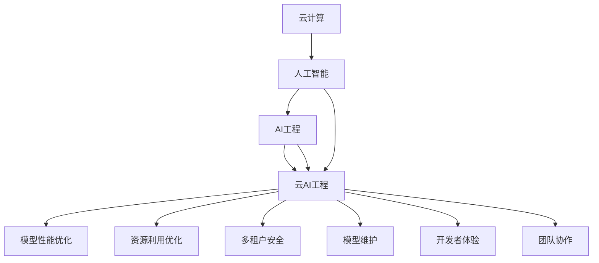

                 

# 云与AI的协同效应：贾扬清的观察，云计算与AI工程融合

## 1. 背景介绍

### 1.1 问题由来
随着云计算与人工智能(AI)技术的不断进步，越来越多的企业开始采用云AI工程实践，以高效、灵活地部署和管理AI模型。然而，云AI工程的复杂性给开发者带来了新的挑战：如何在云端和本地平衡模型性能、训练效率和资源利用，如何在多租户环境中保证模型的安全和隐私，如何优化开发流程和团队协作效率等。本文将从云AI工程的角度，探讨这些核心问题，并提出一些实践经验，为开发者提供指导。

### 1.2 问题核心关键点
云AI工程的核心问题包括：
1. 模型性能与资源利用的平衡
2. 多租户环境下的安全和隐私
3. 模型部署和维护的效率
4. 开发者体验和团队协作
5. 模型的可扩展性和弹性

## 2. 核心概念与联系

### 2.1 核心概念概述

为更好地理解云AI工程，本节将介绍几个关键概念：

- 云计算(Cloud Computing)：指通过网络提供可扩展、弹性的计算资源和服务，用户按需使用，无需购买或管理底层硬件。云计算提供弹性资源、多租户环境、自动扩展等特性。

- 人工智能(AI)：指通过算法和模型，使计算机具备类似人类的智能能力，包括感知、学习、推理、决策等。AI的核心在于通过数据和模型进行深度学习和训练。

- AI工程(AI Engineering)：指将AI模型和算法应用于实际应用场景的过程，包括模型开发、训练、部署、运维等环节。AI工程涉及数据工程、模型工程、模型服务化等多个方面。

- 云AI工程(Cloud AI Engineering)：指在云计算平台上，结合AI工程技术和云计算特性，实现高效、弹性、安全的AI模型部署和管理。云AI工程融合了云计算的弹性资源管理和AI模型的生命周期管理。

这些核心概念之间的逻辑关系可以通过以下Mermaid流程图来展示：



这个流程图展示出云计算、人工智能、AI工程与云AI工程的相互关系及其各自的关注点。云AI工程通过云计算的弹性资源管理和AI工程的多样化实践，实现AI模型的高效部署和维护。

## 3. 核心算法原理 & 具体操作步骤
### 3.1 算法原理概述

云AI工程的核心在于利用云计算平台提供的弹性资源管理机制，结合AI工程的多样化实践，实现AI模型的高效部署和维护。具体而言，云AI工程包括模型性能优化、资源利用优化、多租户安全和隐私保护、模型维护和开发者体验等关键环节。

### 3.2 算法步骤详解

云AI工程的一般步骤如下：

**Step 1: 选择合适的云平台**
- 根据业务需求和模型规模，选择合适的云平台（如AWS、Azure、Google Cloud等）。

**Step 2: 设计模型架构**
- 根据业务场景，设计模型架构（如DNN、CNN、RNN、Transformer等）。
- 确定模型输入输出接口，定义输入数据格式和输出结果类型。

**Step 3: 训练模型**
- 使用云计算平台提供的弹性计算资源，进行模型训练。
- 选择适合的优化算法和训练策略，如SGD、AdamW、分布式训练等。

**Step 4: 部署模型**
- 将训练好的模型封装成API服务或容器镜像，部署到云计算平台。
- 配置模型所需的计算资源，如CPU、GPU、内存等。

**Step 5: 运维监控**
- 实时监控模型运行状态，收集性能指标。
- 配置自动化告警，及时发现和处理异常。
- 定期进行模型更新和优化。

**Step 6: 模型优化**
- 根据监控数据，优化模型架构和超参数。
- 引入模型压缩、量化等技术，提升模型推理速度。

**Step 7: 模型评估**
- 定期评估模型效果，进行A/B测试和对比实验。
- 收集用户反馈，持续改进模型性能。

### 3.3 算法优缺点

云AI工程的主要优点包括：
1. 弹性资源管理：云计算平台提供了弹性资源管理，能够根据业务需求动态调整资源分配，避免资源浪费。
2. 高效模型部署：云计算平台支持自动化模型部署和弹性扩展，加快模型上线速度。
3. 低成本：通过按需使用计算资源，降低了固定成本。
4. 便捷维护：云平台提供了自动化运维工具，减少运维成本。

云AI工程的主要缺点包括：
1. 数据隐私和安全：多租户环境下的数据隐私和安全问题难以彻底解决。
2. 依赖第三方平台：云计算平台的依赖关系可能影响系统的稳定性和可用性。
3. 模型迁移困难：不同云平台之间的模型迁移和互操作性有待提升。
4. 网络延迟：云计算平台之间的数据传输可能会引入网络延迟，影响实时性。

## 4. 数学模型和公式 & 详细讲解 & 举例说明

### 4.1 数学模型构建

云AI工程的数学模型构建主要关注模型性能优化、资源利用优化、模型部署和维护等环节。以下以模型性能优化为例，构建优化模型：

设模型输入为 $x$，模型输出为 $y$，模型损失函数为 $\mathcal{L}(y, \hat{y})$，优化目标为最小化损失函数，即：

$$
\min_{\theta} \mathcal{L}(y, \hat{y}) = \min_{\theta} \frac{1}{N}\sum_{i=1}^N \mathcal{L}(y_i, \hat{y}_i)
$$

其中 $\theta$ 为模型参数，$N$ 为训练样本数量。

### 4.2 公式推导过程

优化目标函数对参数 $\theta$ 的梯度为：

$$
\nabla_{\theta}\mathcal{L}(y, \hat{y}) = \frac{1}{N}\sum_{i=1}^N \nabla_{\theta}\mathcal{L}(y_i, \hat{y}_i)
$$

使用随机梯度下降算法，每次随机抽取一个样本 $(x_i, y_i)$，计算损失函数对参数 $\theta$ 的梯度，更新参数：

$$
\theta \leftarrow \theta - \eta \nabla_{\theta}\mathcal{L}(y_i, \hat{y}_i)
$$

其中 $\eta$ 为学习率。

### 4.3 案例分析与讲解

以TensorFlow和AWS的SageMaker为例，展示云AI工程的优化过程：

1. 使用AWS SageMaker训练模型：
```python
import tensorflow as tf
import sagemaker

# 创建模型
model = tf.keras.Sequential([
    tf.keras.layers.Dense(128, activation='relu'),
    tf.keras.layers.Dense(64, activation='relu'),
    tf.keras.layers.Dense(10, activation='softmax')
])

# 训练模型
sagemaker_model = sagemaker.model.Model(model)

# 部署模型
predictor = sagemaker_model.deploy(initial_instance_count=1, instance_type='ml.m5.large')
```

2. 使用TensorFlow自动调参优化模型：
```python
from tensorflow.keras import optimizers
from tensorflow.keras.wrappers.scikit_learn import KerasRegressor
from sklearn.model_selection import RandomizedSearchCV

# 定义搜索空间
search_space = {'epochs': [10, 20, 30], 'batch_size': [32, 64, 128]}
    
# 定义优化器
optimizer = optimizers.Adam(learning_rate=0.001)

# 定义模型
def create_model(epochs, batch_size):
    model = tf.keras.Sequential([
        tf.keras.layers.Dense(128, activation='relu'),
        tf.keras.layers.Dense(64, activation='relu'),
        tf.keras.layers.Dense(10, activation='softmax')
    ])
    model.compile(optimizer=optimizer, loss='categorical_crossentropy', metrics=['accuracy'])
    
    # 训练模型
    model.fit(x_train, y_train, epochs=epochs, batch_size=batch_size)
    return model

# 创建模型对象
model = KerasRegressor(build_fn=create_model, verbose=0)

# 进行随机搜索
random_search = RandomizedSearchCV(model, search_space, cv=3, verbose=0)
random_search.fit(x_train, y_train)
```

通过上述代码示例，可以看出云AI工程通过利用云计算平台提供的优化算法和工具，可以高效地优化模型性能，实现高效部署和运维。

## 5. 项目实践：代码实例和详细解释说明
### 5.1 开发环境搭建

在进行云AI工程实践前，我们需要准备好开发环境。以下是使用Python进行AWS SageMaker开发的环境配置流程：

1. 安装Anaconda：从官网下载并安装Anaconda，用于创建独立的Python环境。

2. 创建并激活虚拟环境：
```bash
conda create -n sagemaker-env python=3.8 
conda activate sagemaker-env
```

3. 安装相关工具包：
```bash
pip install boto3 sagemaker tensorflow
```

4. 配置AWS CLI：
```bash
aws configure
```

5. 安装AWS SageMaker SDK：
```bash
pip install sagemaker
```

完成上述步骤后，即可在 `sagemaker-env` 环境中开始云AI工程实践。

### 5.2 源代码详细实现

以下是使用AWS SageMaker进行模型训练和部署的Python代码实现：

```python
import sagemaker
from sagemaker import get_execution_role
from sagemaker.tuner import HyperparameterTuner

# 获取角色
role = get_execution_role()

# 创建模型
model = sagemaker.estimator.Estimator(
    estimator_base_name='my_model',
    role=role,
    framework_version='1.15.0',
    entry_point='train.py',
    instance_count=1,
    instance_type='ml.m4.xlarge',
    train_instance_count=1,
    train_instance_type='ml.m4.xlarge',
    output_path='s3://my-bucket/my-model/output',
    sagemaker_session=sagemaker.Session()
)

# 定义超参数搜索空间
hyperparameter_ranges = {
    'epochs': 10,
    'batch_size': 64
}

# 创建超参数优化器
objective_metric_name = 'Accuracy'
hyperparameter_tuner = HyperparameterTuner(
    model,
    hyperparameter_ranges,
    objective_metric_name=objective_metric_name,
    objective_type='Maximize',
    max_jobs=10,
    max_parallel_jobs=3
)

# 开始优化
hyperparameter_tuner.fit({'train': train_data, 'validation': validation_data})
```

通过上述代码示例，可以看出AWS SageMaker提供了便捷的模型训练和超参数优化工具，可以快速构建和优化云AI模型。

### 5.3 代码解读与分析

让我们再详细解读一下关键代码的实现细节：

**AWS SageMaker环境配置**：
- 安装AWS CLI：使用 `aws configure` 命令配置AWS CLI，以便进行身份认证。
- 安装SageMaker SDK：使用 `pip install sagemaker` 命令安装AWS SageMaker SDK，以便调用SageMaker服务。

**模型训练和优化**：
- 创建Estimator对象：使用 `sagemaker.estimator.Estimator` 类创建Estimator对象，指定训练脚本、训练参数、输出路径等。
- 定义超参数搜索空间：使用 `hyperparameter_ranges` 字典定义超参数搜索空间，包括 `epochs` 和 `batch_size` 等。
- 创建超参数优化器：使用 `HyperparameterTuner` 类创建超参数优化器，指定优化目标、搜索空间、最大作业数和最大并行作业数等。
- 开始优化：使用 `fit` 方法开始超参数优化过程，传入训练数据和验证数据。

通过这些代码示例，可以看出AWS SageMaker提供了便捷的模型训练和优化工具，可以快速构建和优化云AI模型。

## 6. 实际应用场景
### 6.1 智慧医疗

云计算平台提供的高效计算资源和多租户环境，可以支持智慧医疗中的大规模数据处理和模型训练。例如，医院可以通过云计算平台实时收集和分析患者数据，使用AI模型进行疾病预测和个性化治疗方案推荐，提升医疗服务的质量和效率。

在技术实现上，可以采用云AI工程实践，将医疗数据和模型部署到云平台，使用分布式训练和自动调参技术，快速构建高效、可扩展的智慧医疗系统。

### 6.2 智能制造

智能制造需要实时处理和分析大量的生产数据，使用AI模型进行质量控制、设备维护和生产调度等任务。云计算平台提供的弹性资源和多租户环境，可以支持智能制造中的大数据处理和模型训练。

在技术实现上，可以采用云AI工程实践，将生产数据和模型部署到云平台，使用分布式训练和自动调参技术，快速构建高效、可扩展的智能制造系统。

### 6.3 金融服务

金融服务需要实时处理和分析大量的交易数据，使用AI模型进行风险评估、信用评分和欺诈检测等任务。云计算平台提供的高效计算资源和多租户环境，可以支持金融服务中的大数据处理和模型训练。

在技术实现上，可以采用云AI工程实践，将交易数据和模型部署到云平台，使用分布式训练和自动调参技术，快速构建高效、可扩展的金融服务系统。

## 7. 工具和资源推荐
### 7.1 学习资源推荐

为了帮助开发者系统掌握云AI工程的理论与实践，这里推荐一些优质的学习资源：

1. 《云计算基础》：该书详细介绍了云计算的基本概念、技术架构和发展趋势，适合初学者入门。

2. 《TensorFlow实战》：该书详细介绍了TensorFlow的开发技巧和最佳实践，包括模型训练、优化、部署等环节。

3. 《深度学习入门》：该书介绍了深度学习的基本原理和算法，包括神经网络、卷积神经网络、循环神经网络等。

4. 《Python云平台实战》：该书介绍了AWS SageMaker、Azure Machine Learning等云平台的使用方法和实践技巧，适合有一定基础的开发者。

5. 《云原生架构设计》：该书介绍了云原生架构的基本概念和技术栈，包括容器化、微服务、Kubernetes等，适合了解云原生架构的开发者。

通过对这些资源的学习实践，相信你一定能够快速掌握云AI工程的精髓，并用于解决实际的NLP问题。

### 7.2 开发工具推荐

高效的开发离不开优秀的工具支持。以下是几款用于云AI工程开发的常用工具：

1. AWS SageMaker：亚马逊提供的云AI开发平台，提供了模型训练、超参数优化、模型部署、自动化运维等功能，适合大规模云AI应用。

2. Google Cloud AI Platform：谷歌提供的云AI开发平台，提供了模型训练、超参数优化、模型部署、自动化运维等功能，适合大规模云AI应用。

3. Azure Machine Learning：微软提供的云AI开发平台，提供了模型训练、超参数优化、模型部署、自动化运维等功能，适合大规模云AI应用。

4. Jupyter Notebook：开源的交互式开发环境，支持多种编程语言，适合云AI应用的开发和调试。

5. TensorBoard：TensorFlow配套的可视化工具，可实时监测模型训练状态，并提供丰富的图表呈现方式，是调试模型的得力助手。

6. Weights & Biases：模型训练的实验跟踪工具，可以记录和可视化模型训练过程中的各项指标，方便对比和调优。

合理利用这些工具，可以显著提升云AI工程开发的效率，加快创新迭代的步伐。

### 7.3 相关论文推荐

云AI工程的发展源于学界的持续研究。以下是几篇奠基性的相关论文，推荐阅读：

1. "Towards Automated Machine Learning with SageMaker"：介绍了AWS SageMaker的自动化机器学习功能，展示了如何通过云平台自动化训练和优化模型。

2. "An Overview of Cloud Machine Learning Platforms"：介绍了当前主流云平台在机器学习领域的应用，包括AWS SageMaker、Google Cloud AI Platform、Azure Machine Learning等。

3. "Hyperparameter Optimization in Machine Learning"：介绍了超参数优化的基本概念和常用方法，包括网格搜索、随机搜索、贝叶斯优化等。

4. "Model Optimization for Edge Devices: A Survey"：介绍了边缘计算中的模型优化方法，包括模型压缩、量化、剪枝等。

5. "Cloud AI Engineering: A Survey on Practices and Challenges"：介绍了云AI工程的实践经验和面临的挑战，展示了当前云AI工程的发展现状和未来趋势。

这些论文代表了大规模云AI工程的研究方向和发展脉络。通过学习这些前沿成果，可以帮助研究者把握学科前进方向，激发更多的创新灵感。

## 8. 总结：未来发展趋势与挑战
### 8.1 总结

本文对基于云计算的AI工程实践进行了全面系统的介绍。首先阐述了云计算、人工智能、AI工程与云AI工程的相互关系及其各自的关注点。其次，从原理到实践，详细讲解了云AI工程的数学模型构建和算法步骤，给出了云AI任务开发的完整代码实例。同时，本文还探讨了云AI工程在智慧医疗、智能制造、金融服务等多个领域的应用前景，展示了云AI工程的广阔潜力。此外，本文精选了云AI工程的各类学习资源，力求为读者提供全方位的技术指引。

通过本文的系统梳理，可以看到，基于云计算的AI工程实践正在成为AI应用的重要范式，极大地拓展了AI模型的应用边界，催生了更多的落地场景。未来，伴随云计算技术的持续演进和AI模型的不断创新，云AI工程必将在更多行业领域发挥重要作用。

### 8.2 未来发展趋势

展望未来，云AI工程的发展将呈现以下几个趋势：

1. 弹性资源管理：云计算平台将提供更高效的弹性资源管理机制，支持自动扩展和弹性伸缩，避免资源浪费。

2. 自动化模型训练：云平台将提供更完善的自动化训练和优化工具，支持分布式训练和超参数优化，加速模型开发。

3. 模型部署和运维：云平台将提供更灵活的模型部署和运维工具，支持模型版本管理和自动化运维，提升模型部署效率。

4. 模型安全和隐私：云平台将提供更严格的数据安全和隐私保护机制，支持多租户环境下的安全隔离和数据加密。

5. 跨平台互操作：云平台将支持更广泛的模型互操作性，支持跨平台的数据迁移和模型部署。

6. 模型优化和压缩：云平台将提供更高效的模型压缩和量化技术，支持模型推理速度的提升和资源占用优化。

以上趋势凸显了云计算在AI工程中的重要地位和未来发展方向。这些方向的探索发展，将进一步提升云AI工程的高效性和可扩展性，为AI技术在更多行业领域的落地应用提供坚实基础。

### 8.3 面临的挑战

尽管云AI工程已经取得了显著进展，但在迈向更加智能化、普适化应用的过程中，它仍面临诸多挑战：

1. 数据隐私和安全：多租户环境下的数据隐私和安全问题难以彻底解决。如何保护用户数据隐私，防止数据泄露和滥用，将成为云AI工程的关键挑战。

2. 依赖第三方平台：云计算平台的依赖关系可能影响系统的稳定性和可用性。如何降低对第三方平台的依赖，提高系统的可靠性和自管理能力，将是重要的研究方向。

3. 模型迁移困难：不同云平台之间的模型迁移和互操作性有待提升。如何实现跨平台模型的无缝迁移和互操作，将是重要的优化方向。

4. 网络延迟：云计算平台之间的数据传输可能会引入网络延迟，影响实时性。如何优化数据传输和计算资源配置，减少网络延迟，将是重要的优化方向。

5. 模型压缩和优化：超大模型的推理速度和资源占用问题仍需解决。如何通过模型压缩、量化等技术，提升模型的推理速度和资源利用率，将是重要的优化方向。

6. 开发者体验和团队协作：云AI工程的开发流程和协作效率仍需提升。如何优化开发流程和协作工具，提升开发效率和团队协作体验，将是重要的优化方向。

正视云AI工程面临的这些挑战，积极应对并寻求突破，将是大规模云AI工程走向成熟的必由之路。相信随着云计算技术的持续演进和AI模型的不断创新，云AI工程必将在更多行业领域发挥重要作用。

### 8.4 研究展望

未来的研究应在以下几个方面寻求新的突破：

1. 探索无监督和半监督机器学习：摆脱对大规模标注数据的依赖，利用自监督学习、主动学习等无监督和半监督范式，最大限度利用非结构化数据，实现更加灵活高效的模型训练。

2. 研究参数高效和计算高效的模型训练方法：开发更加参数高效和计算高效的模型训练方法，如稀疏化训练、分布式训练等，提升模型训练效率和资源利用率。

3. 引入更多先验知识：将符号化的先验知识，如知识图谱、逻辑规则等，与神经网络模型进行巧妙融合，引导模型学习更准确、合理的语言表征。同时加强不同模态数据的整合，实现视觉、语音等多模态信息与文本信息的协同建模。

4. 结合因果分析和博弈论工具：将因果分析方法引入模型训练过程，识别出模型决策的关键特征，增强输出解释的因果性和逻辑性。借助博弈论工具刻画人机交互过程，主动探索并规避模型的脆弱点，提高系统稳定性。

5. 纳入伦理道德约束：在模型训练目标中引入伦理导向的评估指标，过滤和惩罚有偏见、有害的输出倾向。同时加强人工干预和审核，建立模型行为的监管机制，确保输出符合人类价值观和伦理道德。

这些研究方向将引领云AI工程走向更高的台阶，为构建安全、可靠、可解释、可控的智能系统铺平道路。面向未来，云计算和AI工程的融合必将引领新一轮的技术革命，推动人工智能技术在更多行业领域的落地应用。

## 9. 附录：常见问题与解答
----------------------------------------------------------------

**Q1：云AI工程是否适用于所有NLP任务？**

A: 云AI工程在大多数NLP任务上都能取得不错的效果，特别是对于数据量较小的任务。但对于一些特定领域的任务，如医学、法律等，仅仅依靠通用语料预训练的模型可能难以很好地适应。此时需要在特定领域语料上进一步预训练，再进行微调，才能获得理想效果。此外，对于一些需要时效性、个性化很强的任务，如对话、推荐等，云AI方法也需要针对性的改进优化。

**Q2：云AI工程中的模型性能优化和资源利用优化是如何实现的？**

A: 模型性能优化和资源利用优化是云AI工程中的关键环节，主要通过以下方法实现：

1. 分布式训练：使用云计算平台的分布式训练功能，加快模型训练速度，提升模型性能。

2. 自动调参：使用云计算平台的自动调参工具，优化模型超参数，提高模型性能。

3. 模型压缩和量化：通过模型压缩和量化技术，减少模型大小，提升推理速度，优化资源利用。

4. 弹性资源管理：利用云计算平台的弹性资源管理机制，动态调整计算资源，避免资源浪费。

5. 自动化模型部署：利用云计算平台的自动化模型部署工具，快速部署和更新模型，提升模型部署效率。

通过这些方法，云AI工程可以实现高效的模型性能优化和资源利用，提升模型的训练和推理效率。

**Q3：云AI工程中的多租户安全和隐私保护是如何实现的？**

A: 多租户安全和隐私保护是云AI工程中的重要挑战，主要通过以下方法实现：

1. 数据加密：使用数据加密技术，保护数据在传输和存储过程中的安全性。

2. 访问控制：使用访问控制机制，限制不同租户对数据和模型的访问权限，保护数据隐私。

3. 审计和监控：使用审计和监控工具，实时监控数据和模型的使用情况，防止数据泄露和滥用。

4. 合规性检查：使用合规性检查工具，确保数据和模型使用符合相关法律法规和行业标准。

通过这些方法，云AI工程可以有效地保护数据和模型的安全，防止数据泄露和滥用。

**Q4：云AI工程中如何优化开发流程和团队协作？**

A: 开发流程和团队协作是云AI工程中的重要环节，主要通过以下方法实现：

1. DevOps：使用DevOps工具链，实现持续集成和持续部署，提升开发效率和协作体验。

2. 自动化测试：使用自动化测试工具，快速检测模型和系统的质量，提高开发效率。

3. 版本控制：使用版本控制工具，如Git，管理代码和模型版本，支持团队协作和代码审查。

4. 容器化和微服务：使用容器化和微服务技术，实现代码和模型的模块化管理，提升系统可扩展性和灵活性。

5. 协作平台：使用协作平台，如Jira、Trello等，支持任务管理和团队协作，提升开发效率。

通过这些方法，云AI工程可以实现高效的开发流程和团队协作，提升开发效率和系统质量。

---

作者：禅与计算机程序设计艺术 / Zen and the Art of Computer Programming

