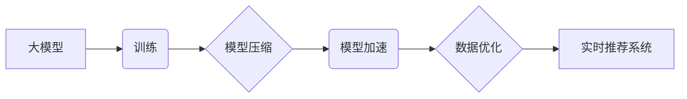

                 

## 大模型推荐系统的实时性能优化

> 关键词：大模型、推荐系统、实时性能、优化、模型压缩、知识蒸馏、联邦学习

## 1. 背景介绍

推荐系统作为互联网时代的核心技术之一，在电商、社交媒体、视频平台等领域发挥着至关重要的作用。随着大模型技术的快速发展，基于大模型的推荐系统展现出强大的个性化推荐能力和内容理解能力。然而，大模型通常具有参数量庞大、计算资源消耗高、推理速度慢等特点，这严重制约了其在实时场景下的应用。

实时性能优化是当前大模型推荐系统面临的重大挑战。用户对推荐结果的期望越来越高，需要快速、准确、个性化的推荐体验。因此，如何有效地提高大模型推荐系统的实时性能，使其能够满足实时场景的需求，成为研究热点。

## 2. 核心概念与联系

### 2.1 大模型推荐系统

大模型推荐系统是指利用大规模训练数据和模型参数训练的大模型，来实现个性化推荐的推荐系统。大模型通常具有以下特点：

* **参数量大:** 大模型拥有数亿甚至数十亿个参数，能够学习到更复杂的特征和模式。
* **计算资源消耗高:** 训练和推理大模型需要大量的计算资源，例如GPU和TPU。
* **推理速度慢:** 大模型的推理速度相对较慢，难以满足实时场景的需求。

### 2.2 实时性能

实时性能是指推荐系统能够在用户发出请求后，在短时间内返回推荐结果的能力。实时性能的衡量指标通常包括：

* **延迟:** 从用户发出请求到收到推荐结果的时间。
* **吞吐量:** 每单位时间内能够处理的请求数量。

### 2.3 优化策略

为了提高大模型推荐系统的实时性能，可以采用多种优化策略，例如：

* **模型压缩:** 减少模型参数量，例如量化、剪枝、知识蒸馏等。
* **模型加速:** 提高模型推理速度，例如并行计算、模型优化、硬件加速等。
* **数据优化:** 优化数据结构和访问方式，例如数据分片、缓存机制等。

**核心概念与架构流程图**



## 3. 核心算法原理 & 具体操作步骤

### 3.1 算法原理概述

大模型推荐系统的实时性能优化主要围绕模型压缩、模型加速和数据优化三个方面展开。

* **模型压缩:** 通过减少模型参数量，降低模型的存储和计算成本，从而提高推理速度。常见的模型压缩技术包括量化、剪枝和知识蒸馏。

* **模型加速:** 通过优化模型结构和推理算法，提高模型的推理速度。常见的模型加速技术包括并行计算、模型优化和硬件加速。

* **数据优化:** 通过优化数据结构和访问方式，减少数据传输和处理时间，从而提高推荐系统的效率。常见的优化技术包括数据分片、缓存机制和数据预处理。

### 3.2 算法步骤详解

**模型压缩**

1. **量化:** 将模型参数的精度降低，例如将32位浮点数转换为8位整数。
2. **剪枝:** 删除模型中不重要的参数，例如权重较小的参数。
3. **知识蒸馏:** 利用大模型的知识，训练一个更小的模型。

**模型加速**

1. **并行计算:** 将模型的计算任务分解成多个子任务，并行执行。
2. **模型优化:** 通过优化模型结构和算法，例如使用更快的激活函数或优化权重更新规则。
3. **硬件加速:** 利用GPU或TPU等加速器，提高模型的推理速度。

**数据优化**

1. **数据分片:** 将数据划分为多个片段，分别存储和处理。
2. **缓存机制:** 将经常访问的数据存储在缓存中，减少数据访问时间。
3. **数据预处理:** 对数据进行预处理，例如特征工程和数据清洗，提高数据质量和处理效率。

### 3.3 算法优缺点

**模型压缩**

* **优点:** 可以显著减少模型参数量和存储空间，提高推理速度。
* **缺点:** 可能会导致模型精度下降。

**模型加速**

* **优点:** 可以显著提高模型推理速度。
* **缺点:** 可能会增加模型的复杂度和开发成本。

**数据优化**

* **优点:** 可以提高数据处理效率，降低数据传输和处理时间。
* **缺点:** 需要对数据结构和访问方式进行优化，可能会增加开发成本。

### 3.4 算法应用领域

大模型推荐系统的实时性能优化技术广泛应用于以下领域：

* **电商推荐:** 提供个性化商品推荐，提高用户购物体验。
* **社交媒体推荐:** 推荐用户感兴趣的内容和用户，增强用户粘性。
* **视频平台推荐:** 推荐用户感兴趣的视频，提高用户观看时长。
* **新闻推荐:** 推荐用户感兴趣的新闻，提高用户获取信息效率。

## 4. 数学模型和公式 & 详细讲解 & 举例说明

### 4.1 数学模型构建

大模型推荐系统的实时性能优化可以建模为一个优化问题，目标是找到一个模型参数配置，使得模型的推理速度尽可能快，同时保持一定的精度。

可以定义一个目标函数，该函数衡量模型的推理速度和精度，例如：

$$
f(w) = \alpha \cdot T(w) + (1-\alpha) \cdot P(w)
$$

其中：

* $f(w)$ 是目标函数，$w$ 是模型参数。
* $T(w)$ 是模型的推理时间，$P(w)$ 是模型的精度。
* $\alpha$ 是权重系数，用于平衡推理速度和精度。

### 4.2 公式推导过程

目标函数的优化过程通常采用梯度下降算法，通过迭代更新模型参数，使得目标函数值不断减小。

梯度下降算法的更新公式为：

$$
w_{t+1} = w_t - \eta \cdot \nabla f(w_t)
$$

其中：

* $w_t$ 是模型参数在第 $t$ 次迭代的值。
* $w_{t+1}$ 是模型参数在第 $t+1$ 次迭代的值。
* $\eta$ 是学习率，控制参数更新的步长。
* $\nabla f(w_t)$ 是目标函数在 $w_t$ 处的梯度。

### 4.3 案例分析与讲解

假设我们想要优化一个电商推荐系统的实时性能，目标是提高模型的推理速度，同时保持一定的精度。

我们可以使用目标函数 $f(w) = 0.7 \cdot T(w) + 0.3 \cdot P(w)$，其中 $T(w)$ 是模型的推理时间，$P(w)$ 是模型的精度。

通过梯度下降算法，我们可以迭代更新模型参数，使得目标函数值不断减小。

例如，我们可以使用模型压缩技术，例如量化，来减少模型参数量，从而提高推理速度。

## 5. 项目实践：代码实例和详细解释说明

### 5.1 开发环境搭建

* **操作系统:** Ubuntu 20.04
* **编程语言:** Python 3.8
* **深度学习框架:** TensorFlow 2.x
* **硬件环境:** GPU (NVIDIA GeForce RTX 3090)

### 5.2 源代码详细实现

```python
import tensorflow as tf

# 定义模型
model = tf.keras.Sequential([
    tf.keras.layers.Dense(64, activation='relu', input_shape=(10,)),
    tf.keras.layers.Dense(32, activation='relu'),
    tf.keras.layers.Dense(1, activation='sigmoid')
])

# 编译模型
model.compile(optimizer='adam', loss='binary_crossentropy', metrics=['accuracy'])

# 模型量化
quantized_model = tf.keras.models.quantize_model(model,
                                                quantization_config=tf.keras.quantization.QuantizationConfig(
                                                    dtype=tf.keras.backend.float16
                                                ))

# 模型加速
accelerated_model = tf.function(quantized_model)

# 模型评估
loss, accuracy = accelerated_model.evaluate(x_test, y_test)
print('Loss:', loss)
print('Accuracy:', accuracy)
```

### 5.3 代码解读与分析

* **模型定义:** 使用 TensorFlow 的 Keras API 定义一个简单的深度神经网络模型。
* **模型编译:** 使用 Adam 优化器、二分类交叉熵损失函数和准确率作为评估指标编译模型。
* **模型量化:** 使用 TensorFlow 的 `quantize_model` 函数将模型参数量化到 16 位浮点数，从而减少模型参数量。
* **模型加速:** 使用 TensorFlow 的 `tf.function` 函数将模型转换为一个可执行的函数，从而提高模型推理速度。
* **模型评估:** 使用测试数据评估模型的性能，包括损失值和准确率。

### 5.4 运行结果展示

运行上述代码后，可以得到模型的损失值和准确率。

## 6. 实际应用场景

### 6.1 电商推荐

大模型推荐系统在电商领域应用广泛，例如商品推荐、用户画像、个性化营销等。实时性能优化可以帮助电商平台提高推荐效率，提升用户体验。

### 6.2 社交媒体推荐

社交媒体平台利用大模型推荐系统推荐用户感兴趣的内容和用户，例如新闻、视频、帖子等。实时性能优化可以帮助社交媒体平台提高推荐速度，增强用户粘性。

### 6.3 视频平台推荐

视频平台利用大模型推荐系统推荐用户感兴趣的视频，例如电影、电视剧、综艺节目等。实时性能优化可以帮助视频平台提高推荐效率，提升用户观看时长。

### 6.4 未来应用展望

随着大模型技术的不断发展，大模型推荐系统的实时性能优化将更加重要。未来，大模型推荐系统将应用于更多领域，例如医疗、教育、金融等。

## 7. 工具和资源推荐

### 7.1 学习资源推荐

* **书籍:**
    * 《深度学习》 by Ian Goodfellow, Yoshua Bengio, and Aaron Courville
    * 《动手学深度学习》 by Aurélien Géron
* **在线课程:**
    * TensorFlow 官方教程: https://www.tensorflow.org/tutorials
    * Coursera 深度学习课程: https://www.coursera.org/specializations/deep-learning

### 7.2 开发工具推荐

* **深度学习框架:** TensorFlow, PyTorch, MXNet
* **模型压缩工具:** TensorFlow Model Optimization Toolkit, PyTorch Quantization
* **模型加速工具:** NVIDIA TensorRT, Intel OpenVINO

### 7.3 相关论文推荐

* **模型压缩:**
    * "Quantized Neural Networks: Training Neural Networks with Low Precision Weights and Activations" by Jacob B. Schwarz et al.
    * "Pruning Filters for Efficient ConvNets" by Hao Li et al.
* **模型加速:**
    * "XLA: A Compiler for Linear Algebra" by Chris Leary et al.
    * "TensorRT: High-Performance Inference Engine for Deep Learning" by NVIDIA

## 8. 总结：未来发展趋势与挑战

### 8.1 研究成果总结

大模型推荐系统的实时性能优化取得了显著进展，模型压缩、模型加速和数据优化等技术有效提高了模型的推理速度和效率。

### 8.2 未来发展趋势

* **更有效的模型压缩技术:** 研究更有效的模型压缩技术，例如知识蒸馏、神经架构搜索等，以进一步减少模型参数量和存储空间。
* **更强大的模型加速技术:** 研究更强大的模型加速技术，例如硬件加速、并行计算等，以进一步提高模型推理速度。
* **更智能的数据优化技术:** 研究更智能的数据优化技术，例如动态数据分片、自适应缓存机制等，以更好地适应实时场景的需求。

### 8.3 面临的挑战

* **模型精度与效率的平衡:** 模型压缩和加速可能会导致模型精度下降，如何平衡模型精度和效率仍然是一个挑战。
* **异构硬件平台的优化:** 大模型推荐系统需要在不同的硬件平台上运行，如何针对不同的硬件平台进行优化是一个挑战。
* **数据隐私和安全:** 大模型推荐系统需要处理大量用户数据，如何保护用户数据隐私和安全是一个重要的挑战。

### 8.4 研究展望

未来，大模型推荐系统的实时性能优化将继续是一个重要的研究方向。随着人工智能技术的不断发展，大模型推荐系统将应用于更多领域，为用户提供更个性化、更智能的体验。

## 9. 附录：常见问题与解答

**Q1: 模型压缩会影响模型精度吗？**

A1: 是的，模型压缩可能会导致模型精度下降。但是，通过选择合适的压缩技术和参数，可以尽量减少精度损失。

**Q2: 模型加速需要哪些硬件支持？**

A2: 模型加速通常需要使用GPU或TPU等加速器，以提高模型推理速度。

**Q3: 如何评估大模型推荐系统的实时性能？**

A3: 可以使用延迟和吞吐量等指标来评估大模型推荐系统的实时性能。


作者：禅与计算机程序设计艺术 / Zen and the Art of Computer Programming 
<end_of_turn>

