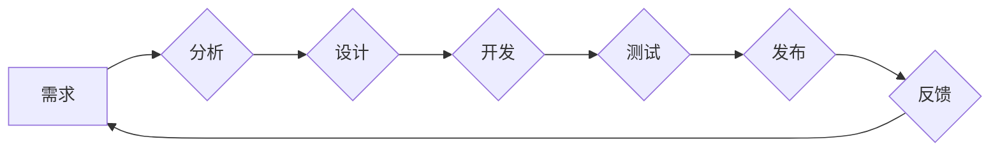

                 

## 如何从经典案例中学习管理智慧

> 关键词：管理智慧、经典案例、软件开发、项目管理、团队合作、沟通技巧、决策分析

## 1. 背景介绍

在当今瞬息万变的科技时代，管理智慧已成为企业持续发展的关键驱动力。 优秀的管理者不仅需要精通技术，更需要具备洞察力、战略思维和领导力。学习经典案例，从成功和失败中汲取经验教训，是提升管理智慧的有效途径。

软件开发领域作为科技创新的前沿阵地，孕育了众多经典案例，这些案例不仅展现了软件开发的精髓，也蕴含着丰富的管理智慧。通过深入分析这些案例，我们可以学习到团队合作、沟通技巧、决策分析、风险管理等方面的宝贵经验，从而提升自身的管理能力。

## 2. 核心概念与联系

### 2.1  敏捷开发

敏捷开发是一种迭代式软件开发方法，强调灵活性和客户反馈。它强调团队合作、持续改进和快速交付，以适应不断变化的需求。

### 2.2  Scrum

Scrum是敏捷开发中最流行的框架之一，它通过一系列仪式和角色来指导团队的开发工作。Scrum的核心价值观包括：

* **个人和交互** 优先于流程和工具
* **工作软件** 优先于详尽的文档
* **客户合作** 优先于合同谈判
* **响应变化** 优先于遵循计划

### 2.3  Kanban

Kanban是一种可视化项目管理方法，它通过看板来展示工作流程，帮助团队成员了解工作进度和瓶颈。Kanban强调持续流动和有限工作量，以提高团队效率。

**Mermaid 流程图**



## 3. 核心算法原理 & 具体操作步骤

### 3.1  算法原理概述

敏捷开发的核心算法原理是迭代开发和持续改进。通过将项目分解成多个迭代周期，团队可以快速交付功能，并根据客户反馈进行调整和改进。

### 3.2  算法步骤详解

1. **需求分析:** 团队首先需要对项目需求进行详细分析，并将其分解成可实现的子任务。
2. **迭代规划:** 团队根据需求和时间限制，制定每个迭代周期的目标和任务清单。
3. **开发和测试:** 团队成员按照计划进行开发和测试，并定期进行代码审查和测试演示。
4. **客户反馈:** 团队将每次迭代的结果展示给客户，并收集客户反馈。
5. **迭代改进:** 团队根据客户反馈和项目进展，对下一个迭代周期进行调整和改进。

### 3.3  算法优缺点

**优点:**

* 能够快速交付功能，满足客户不断变化的需求。
* 能够及时发现和解决问题，降低项目风险。
* 能够提高团队协作和沟通效率。

**缺点:**

* 需要团队成员具备较高的自律性和沟通能力。
* 需要客户积极参与项目，并及时提供反馈。
* 对于大型复杂项目，可能需要更复杂的管理机制。

### 3.4  算法应用领域

敏捷开发方法广泛应用于软件开发、产品设计、项目管理等领域。

## 4. 数学模型和公式 & 详细讲解 & 举例说明

### 4.1  数学模型构建

在敏捷开发中，可以使用数学模型来评估项目进度和风险。例如，可以使用甘特图来展示项目任务的开始和结束时间，并计算项目完成所需的时间。

### 4.2  公式推导过程

甘特图中的关键公式是：

$$
项目总时间 = 最大任务持续时间
$$

其中，最大任务持续时间是指项目中所有任务的持续时间中最大的一个。

### 4.3  案例分析与讲解

假设一个软件项目需要完成三个任务，任务A持续时间为2周，任务B持续时间为3周，任务C持续时间为1周。

根据公式，项目总时间为3周。

## 5. 项目实践：代码实例和详细解释说明

### 5.1  开发环境搭建

敏捷开发可以使用多种开发工具和平台，例如：

* **版本控制系统:** Git, SVN
* **项目管理工具:** Jira, Trello
* **协作工具:** Slack, Microsoft Teams

### 5.2  源代码详细实现

由于篇幅限制，这里只提供一个简单的代码示例，演示如何使用Git进行版本控制。

```
git init  # 初始化仓库
git add .  # 添加所有文件
git commit -m "第一次提交"  # 提交代码
```

### 5.3  代码解读与分析

* `git init`: 初始化一个新的Git仓库。
* `git add .`: 将当前目录下的所有文件添加到暂存区。
* `git commit -m "第一次提交"`: 将暂存区中的文件提交到本地仓库，并添加提交信息。

### 5.4  运行结果展示

使用Git命令行工具可以查看本地仓库的状态，例如：

* `git status`: 查看暂存区和本地仓库的状态。
* `git log`: 查看提交历史记录。

## 6. 实际应用场景

敏捷开发方法广泛应用于软件开发、产品设计、项目管理等领域。

### 6.1  软件开发

敏捷开发方法可以帮助软件开发团队快速交付高质量的软件产品，并适应不断变化的需求。

### 6.2  产品设计

敏捷开发方法可以帮助产品设计团队快速迭代产品原型，并根据用户反馈进行改进。

### 6.3  项目管理

敏捷开发方法可以帮助项目管理团队更好地管理项目进度和风险，并提高团队协作效率。

### 6.4  未来应用展望

随着科技的不断发展，敏捷开发方法将继续演进和完善，并应用于更多领域。

## 7. 工具和资源推荐

### 7.1  学习资源推荐

* **书籍:** 《敏捷软件开发》
* **网站:** Agile Alliance

### 7.2  开发工具推荐

* **版本控制系统:** Git, SVN
* **项目管理工具:** Jira, Trello
* **协作工具:** Slack, Microsoft Teams

### 7.3  相关论文推荐

* **Scrum: A Lightweight Process Framework for Managing Complex Projects**
* **Agile Software Development: Principles, Patterns, and Practices**

## 8. 总结：未来发展趋势与挑战

### 8.1  研究成果总结

敏捷开发方法已成为软件开发领域的主流方法，并取得了显著的成功。

### 8.2  未来发展趋势

未来，敏捷开发方法将继续朝着更加灵活、高效、智能的方向发展。

### 8.3  面临的挑战

敏捷开发方法也面临一些挑战，例如：

* 如何更好地应对复杂项目的需求
* 如何提高团队成员的敏捷意识
* 如何将敏捷开发方法与其他管理方法相结合

### 8.4  研究展望

未来，需要进一步研究和探索敏捷开发方法的应用场景和最佳实践，以更好地应对科技发展带来的挑战。

## 9. 附录：常见问题与解答

### 9.1  什么是敏捷开发？

敏捷开发是一种迭代式软件开发方法，强调灵活性和客户反馈。

### 9.2  敏捷开发有哪些优点？

敏捷开发的优点包括：快速交付功能、及时发现和解决问题、提高团队协作和沟通效率。

### 9.3  如何学习敏捷开发？

可以通过阅读书籍、参加培训课程、参与实践项目等方式学习敏捷开发。

作者：禅与计算机程序设计艺术 / Zen and the Art of Computer Programming


<end_of_turn>

