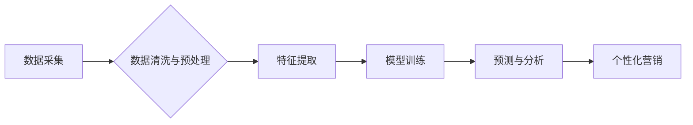

                 

## 如何在自动化创业中实现精准营销

> 关键词：自动化创业、精准营销、机器学习、数据分析、人工智能、客户画像、个性化推荐、营销自动化

## 1. 背景介绍

在当今数字化时代，创业者面临着激烈的市场竞争。传统营销方式的成本高昂，效率低下，难以精准触达目标客户。自动化创业的兴起为精准营销提供了新的机遇。通过利用人工智能、机器学习等技术，创业者可以实现数据分析、客户画像、个性化推荐等功能，从而提高营销效率，降低成本，提升转化率。

## 2. 核心概念与联系

**2.1 精准营销**

精准营销是指根据客户的个人特征、行为模式、兴趣爱好等信息，制定个性化的营销策略，精准触达目标客户。

**2.2 自动化创业**

自动化创业是指利用自动化技术，提高创业效率，降低运营成本，实现规模化发展。

**2.3 核心联系**

自动化创业为精准营销提供了技术基础和实施路径。通过自动化技术，创业者可以收集、分析和利用海量客户数据，构建精准的客户画像，并根据客户画像制定个性化的营销策略。

**2.4 架构图**



## 3. 核心算法原理 & 具体操作步骤

**3.1 算法原理概述**

精准营销的核心算法主要包括：

* **机器学习算法:** 用于从数据中学习客户特征和行为模式，构建客户画像。常见的机器学习算法包括决策树、支持向量机、神经网络等。
* **推荐算法:** 用于根据客户的兴趣爱好和历史行为，推荐个性化的产品或服务。常见的推荐算法包括协同过滤、内容过滤、混合推荐等。

**3.2 算法步骤详解**

1. **数据采集:** 收集客户的各种数据，包括人口信息、购买记录、浏览历史、社交行为等。
2. **数据清洗与预处理:** 对收集到的数据进行清洗、转换和预处理，去除噪声和异常值，并将其转换为算法可处理的格式。
3. **特征提取:** 从数据中提取客户特征，例如年龄、性别、职业、兴趣爱好、购买频率等。
4. **模型训练:** 利用机器学习算法对提取的特征进行训练，构建客户画像模型。
5. **预测与分析:** 利用训练好的模型对新客户进行预测和分析，构建其客户画像。
6. **个性化营销:** 根据客户画像，制定个性化的营销策略，例如推荐产品、发送优惠信息、定制广告等。

**3.3 算法优缺点**

* **优点:**

    * 精准触达目标客户，提高营销效率。
    * 个性化营销体验，提升客户满意度。
    * 数据驱动决策，降低营销成本。

* **缺点:**

    * 需要大量的数据支持。
    * 模型训练和维护需要专业技术。
    * 存在隐私安全风险。

**3.4 算法应用领域**

* **电商:** 商品推荐、个性化促销、客户分层。
* **金融:** 贷款审批、风险评估、个性化理财。
* **教育:** 个性化学习推荐、学生行为分析。
* **医疗:** 疾病诊断、个性化治疗方案。

## 4. 数学模型和公式 & 详细讲解 & 举例说明

**4.1 数学模型构建**

精准营销的数学模型通常基于统计学和机器学习理论，例如：

* **客户画像模型:** 利用聚类算法将客户分为不同的群体，并为每个群体构建特征描述。
* **推荐模型:** 利用协同过滤算法或内容过滤算法预测客户对特定产品的兴趣。

**4.2 公式推导过程**

例如，协同过滤算法中的余弦相似度公式：

$$
\text{相似度} = \frac{\mathbf{u} \cdot \mathbf{v}}{\|\mathbf{u}\| \|\mathbf{v}\|}
$$

其中：

* $\mathbf{u}$ 和 $\mathbf{v}$ 是两个用户的特征向量。
* $\cdot$ 表示点积运算。
* $\|\mathbf{u}\|$ 和 $\|\mathbf{v}\|$ 分别表示 $\mathbf{u}$ 和 $\mathbf{v}$ 的模长。

**4.3 案例分析与讲解**

假设有两个用户 A 和 B，他们的特征向量分别为：

* $\mathbf{u} = [1, 0, 1, 0]$
* $\mathbf{v} = [0, 1, 1, 0]$

则它们的余弦相似度为：

$$
\text{相似度} = \frac{(1 \times 0) + (0 \times 1) + (1 \times 1) + (0 \times 0)}{\sqrt{1^2 + 0^2 + 1^2 + 0^2} \sqrt{0^2 + 1^2 + 1^2 + 0^2}} = \frac{1}{\sqrt{2} \sqrt{2}} = \frac{1}{2}
$$

该结果表明 A 和 B 的兴趣爱好有一定的相似性。

## 5. 项目实践：代码实例和详细解释说明

**5.1 开发环境搭建**

* 操作系统: Ubuntu 20.04
* Python 版本: 3.8
* 必要的库: pandas, numpy, scikit-learn, matplotlib

**5.2 源代码详细实现**

```python
import pandas as pd
from sklearn.cluster import KMeans

# 加载数据
data = pd.read_csv('customer_data.csv')

# 数据预处理
# ...

# 特征提取
features = data[['age', 'income', 'education', 'purchase_frequency']]

# 模型训练
kmeans = KMeans(n_clusters=3)
kmeans.fit(features)

# 预测客户群组
data['cluster'] = kmeans.predict(features)

# 分析客户群组特征
# ...

# 个性化营销策略
# ...
```

**5.3 代码解读与分析**

* 代码首先加载客户数据，并进行数据预处理。
* 然后，提取客户特征，例如年龄、收入、教育程度和购买频率。
* 利用 KMeans 聚类算法将客户分为不同的群组。
* 最后，根据客户群组特征，制定个性化的营销策略。

**5.4 运行结果展示**

运行代码后，可以得到客户群组的划分结果，以及每个群组的特征描述。

## 6. 实际应用场景

**6.1 电商平台**

电商平台可以利用精准营销技术，根据用户的购买历史、浏览记录、兴趣爱好等信息，推荐个性化的商品，提高转化率。

**6.2 金融机构**

金融机构可以利用精准营销技术，根据用户的信用评分、收入水平、投资偏好等信息，推荐个性化的理财产品，提升客户粘性。

**6.3 教育机构**

教育机构可以利用精准营销技术，根据学生的学习成绩、兴趣爱好、学习习惯等信息，推荐个性化的学习课程，提高学习效率。

**6.4 未来应用展望**

随着人工智能技术的不断发展，精准营销将在更多领域得到应用，例如医疗、旅游、娱乐等。未来，精准营销将更加个性化、智能化、自动化。

## 7. 工具和资源推荐

**7.1 学习资源推荐**

* **书籍:**

    * 《机器学习》 by Tom Mitchell
    * 《Python机器学习实战》 by Sebastian Raschka

* **在线课程:**

    * Coursera: Machine Learning
    * edX: Artificial Intelligence

**7.2 开发工具推荐**

* **Python:** 强大的数据分析和机器学习库，例如 pandas, numpy, scikit-learn。
* **Spark:** 大数据处理框架，可以处理海量客户数据。
* **TensorFlow:** 深度学习框架，可以构建更复杂的机器学习模型。

**7.3 相关论文推荐**

* **Collaborative Filtering for Recommender Systems** by Su-Yin Lee and Wei-Min Chen
* **A Survey on Clustering Algorithms** by A. K. Jain

## 8. 总结：未来发展趋势与挑战

**8.1 研究成果总结**

自动化创业为精准营销提供了新的机遇和挑战。通过利用人工智能、机器学习等技术，创业者可以实现数据分析、客户画像、个性化推荐等功能，提高营销效率，降低成本，提升转化率。

**8.2 未来发展趋势**

* **更精准的客户画像:** 利用更先进的机器学习算法和数据分析技术，构建更精准的客户画像。
* **更个性化的营销策略:** 根据客户的个性化需求，制定更精准的营销策略。
* **更智能化的营销自动化:** 利用人工智能技术，实现营销自动化的更高水平。

**8.3 面临的挑战**

* **数据隐私安全:** 确保客户数据的安全和隐私。
* **算法模型的解释性:** 提高机器学习模型的解释性，让营销人员更好地理解模型的决策过程。
* **技术人才的短缺:** 吸引和培养更多的人才，推动精准营销技术的应用。

**8.4 研究展望**

未来，精准营销将更加智能化、自动化、个性化。研究者将继续探索更先进的算法和技术，以实现更精准的客户画像和更个性化的营销策略。


## 9. 附录：常见问题与解答

**9.1 如何收集客户数据？**

可以通过以下方式收集客户数据：

* 网站访问记录
* 购买记录
* 邮件订阅
* 社交媒体互动
* 问卷调查

**9.2 如何处理客户数据隐私？**

在收集和使用客户数据时，必须遵守相关法律法规，并采取必要的安全措施，保护客户数据的隐私和安全。

**9.3 如何评估精准营销的效果？**

可以通过以下指标评估精准营销的效果：

* 转化率
* 客户生命周期价值
* 营销成本


作者：禅与计算机程序设计艺术 / Zen and the Art of Computer Programming 
<end_of_turn>

