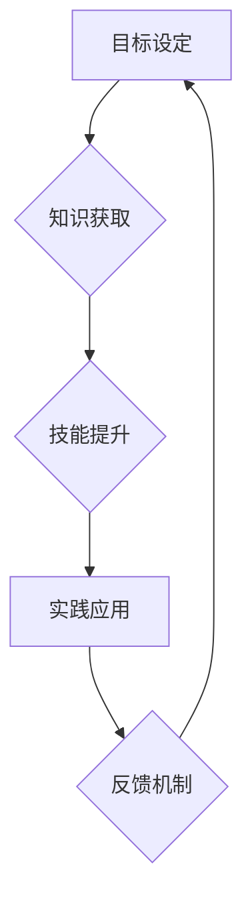

                 

## 学习体系:持续进化的动力源泉

> 关键词：学习体系、持续进化、知识获取、技能提升、实践应用、反馈机制、自我驱动、终身学习

### 1. 背景介绍

在瞬息万变的科技时代，知识更新迭代的速度前所未有，技术革新日新月异。作为一名IT从业者，想要保持竞争力，必须具备持续学习的能力，不断提升自己的技能和知识储备。然而，学习并非一蹴而就，需要一个系统化的学习体系来引导和支撑。

传统的学习模式往往是碎片化、被动式的，缺乏有效的反馈机制和实践应用环节。这导致学习效果不佳，难以将所学知识转化为实际能力。因此，构建一个高效的学习体系，能够有效地促进知识获取、技能提升和实践应用，成为IT从业者持续发展的关键。

### 2. 核心概念与联系

**2.1 学习体系的构成**

一个完整的学习体系通常包含以下几个核心要素：

* **目标设定:** 明确学习的目标和方向，为学习提供动力和指引。
* **知识获取:** 通过多种途径获取所需知识，例如书籍、课程、文档、实践项目等。
* **技能提升:** 将知识转化为实际技能，通过练习、项目开发等方式不断提升。
* **实践应用:** 将所学知识和技能应用于实际项目中，检验学习成果，并积累经验。
* **反馈机制:** 通过自我评估、他人反馈、项目结果等方式，及时了解学习效果，并进行调整和改进。

**2.2 学习体系的运作机制**

学习体系的运作机制是一个循环的过程，每个环节相互关联，共同推动学习的持续发展。



**2.3 学习体系的个性化定制**

每个人的学习风格、兴趣爱好和职业目标都不同，因此学习体系也需要根据个人的实际情况进行个性化定制。

### 3. 核心算法原理 & 具体操作步骤

**3.1 算法原理概述**

在学习体系中，算法可以帮助我们更高效地获取、处理和应用知识。例如，推荐算法可以根据用户的学习历史和兴趣推荐相关的学习资源；知识图谱算法可以帮助我们构建知识网络，发现知识之间的关联性；机器学习算法可以帮助我们自动生成学习内容和评估学习效果。

**3.2 算法步骤详解**

具体算法的步骤会根据算法类型而有所不同，但一般来说，都会包含以下几个步骤：

* **数据收集:** 收集相关数据，例如用户的学习记录、知识库信息、项目需求等。
* **数据预处理:** 对收集到的数据进行清洗、转换和格式化，使其能够被算法处理。
* **模型训练:** 使用训练数据训练算法模型，使其能够学习到知识和规律。
* **模型评估:** 使用测试数据评估算法模型的性能，并进行调整和优化。
* **模型应用:** 将训练好的算法模型应用于实际场景，例如推荐学习资源、生成学习内容、评估学习效果等。

**3.3 算法优缺点**

不同的算法具有不同的优缺点，需要根据实际情况选择合适的算法。例如，推荐算法的优点是能够个性化推荐学习资源，但缺点是可能会陷入信息茧房，限制用户的视野。

**3.4 算法应用领域**

算法在学习体系中的应用领域非常广泛，例如：

* **个性化学习推荐:** 根据用户的学习历史和兴趣推荐相关的学习资源。
* **智能学习助手:** 提供学习计划制定、知识点讲解、练习题解答等辅助功能。
* **知识图谱构建:** 建立知识网络，帮助用户理解知识之间的关联性。
* **自动生成学习内容:** 根据用户的学习需求自动生成学习内容，例如习题、案例分析、总结归纳等。
* **学习效果评估:** 使用机器学习算法评估用户的学习效果，并提供个性化的学习建议。

### 4. 数学模型和公式 & 详细讲解 & 举例说明

**4.1 数学模型构建**

在学习体系中，我们可以使用数学模型来描述学习过程和学习效果。例如，我们可以使用贝叶斯定理来描述知识更新的过程，使用信息论来描述知识的量和质量，使用机器学习算法来建模学习效果。

**4.2 公式推导过程**

例如，我们可以使用贝叶斯定理来描述知识更新的过程：

$$P(A|B) = \frac{P(B|A)P(A)}{P(B)}$$

其中：

* $P(A|B)$ 是在已知事件 B 发生的情况下，事件 A 发生的概率。
* $P(B|A)$ 是在已知事件 A 发生的情况下，事件 B 发生的概率。
* $P(A)$ 是事件 A 发生的概率。
* $P(B)$ 是事件 B 发生的概率。

**4.3 案例分析与讲解**

例如，假设我们学习了一个新的概念，这个概念与我们之前已有的知识有相关性。我们可以使用贝叶斯定理来计算我们学习这个新概念后，对之前知识的理解程度提升的概率。

### 5. 项目实践：代码实例和详细解释说明

**5.1 开发环境搭建**

为了实现学习体系的项目实践，我们可以选择 Python 作为开发语言，并使用相关的库和框架，例如 TensorFlow、PyTorch、Scikit-learn 等。

**5.2 源代码详细实现**

以下是一个简单的学习推荐系统的代码示例：

```python
import pandas as pd
from sklearn.metrics.pairwise import cosine_similarity

# 加载用户学习记录数据
data = pd.read_csv('user_learning_data.csv')

# 计算用户之间的相似度
user_similarity = cosine_similarity(data)

# 根据用户相似度推荐学习资源
def recommend_learning_resources(user_id, top_n=5):
    similar_users = user_similarity[user_id].argsort()[:-top_n-1:-1]
    recommended_resources = data.iloc[similar_users].groupby('resource_id').size().sort_values(ascending=False)
    return recommended_resources.index.tolist()

# 获取用户 ID
user_id = 1

# 推荐学习资源
recommended_resources = recommend_learning_resources(user_id)

# 打印推荐结果
print(f'推荐给用户 {user_id} 的学习资源：{recommended_resources}')
```

**5.3 代码解读与分析**

这段代码首先加载用户学习记录数据，然后使用余弦相似度计算用户之间的相似度。最后，根据用户相似度推荐学习资源。

**5.4 运行结果展示**

运行这段代码后，会输出一个包含推荐学习资源的列表。

### 6. 实际应用场景

学习体系的应用场景非常广泛，例如：

* **在线教育平台:** 为用户提供个性化学习推荐、智能学习助手、知识图谱导航等功能。
* **企业培训系统:** 为员工提供定制化的培训计划、知识库检索、技能评估等功能。
* **个人学习管理:** 为个人提供学习目标设定、学习进度跟踪、知识积累等功能。

**6.4 未来应用展望**

未来，随着人工智能、大数据等技术的不断发展，学习体系将会更加智能化、个性化和高效化。例如，我们可以使用深度学习算法来更精准地预测用户的学习需求，使用虚拟现实技术来打造沉浸式的学习体验，使用区块链技术来保障学习成果的真实性和可信度。

### 7. 工具和资源推荐

**7.1 学习资源推荐**

* **在线课程平台:** Coursera、edX、Udemy、Khan Academy 等
* **技术博客:** Hacker News、Medium、Stack Overflow 等
* **开源项目:** GitHub、GitLab 等

**7.2 开发工具推荐**

* **编程语言:** Python、Java、C++ 等
* **机器学习框架:** TensorFlow、PyTorch、Scikit-learn 等
* **数据分析工具:** Pandas、NumPy、Matplotlib 等

**7.3 相关论文推荐**

* **深度学习在教育领域的应用:** "Deep Learning for Education: A Survey"
* **个性化学习推荐系统:** "Personalized Learning Recommendation Systems: A Survey"
* **知识图谱构建与应用:** "Knowledge Graph Construction and Applications"

### 8. 总结：未来发展趋势与挑战

**8.1 研究成果总结**

在过去的几年中，学习体系的研究取得了显著的进展，涌现出许多优秀的学习工具和平台。这些工具和平台为IT从业者提供了更加高效、个性化的学习体验。

**8.2 未来发展趋势**

未来，学习体系将会更加智能化、个性化和高效化。人工智能、大数据、虚拟现实等技术的融合将推动学习体系的创新发展。

**8.3 面临的挑战**

学习体系的发展也面临着一些挑战，例如：

* **数据隐私和安全:** 学习体系需要收集和处理大量用户数据，如何保障数据隐私和安全是一个重要的挑战。
* **算法公平性和可解释性:** 学习算法可能会存在偏见和不可解释性，如何确保算法公平性和可解释性是一个需要解决的问题。
* **学习效果评估:** 如何准确评估学习效果是一个长期存在的问题，需要不断探索新的评估方法。

**8.4 研究展望**

未来，我们需要继续深入研究学习体系的各个方面，例如：

* **开发更加智能、个性化的学习算法。**
* **构建更加安全、可靠的学习平台。**
* **探索新的学习效果评估方法。**
* **促进学习体系与其他领域的融合发展。**


### 9. 附录：常见问题与解答

**9.1 如何选择合适的学习资源？**

选择学习资源时，需要考虑自身的学习目标、兴趣爱好和学习水平。可以参考在线课程平台的评价和推荐，也可以咨询其他学习者的经验。

**9.2 如何保持学习的动力？**

学习是一个长期的过程，需要保持持续的动力。可以设定学习目标、记录学习进度、与他人交流学习心得等方式来保持学习的动力。

**9.3 如何将学习成果转化为实际能力？**

将学习成果转化为实际能力需要通过实践应用来实现。可以参加项目开发、撰写技术博客、分享学习经验等方式来巩固学习成果。


作者：禅与计算机程序设计艺术 / Zen and the Art of Computer Programming 
<end_of_turn>

