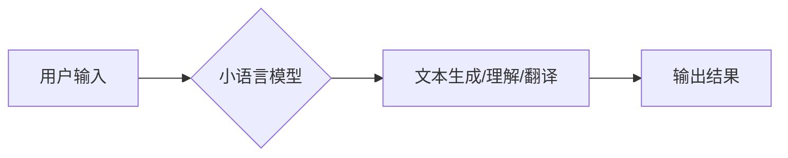

                 

## 小语言模型的应用价值评估:商业价值和社会价值

> 关键词：小语言模型、LLM、商业价值、社会价值、应用场景、技术趋势、伦理挑战

## 1. 背景介绍

近年来，深度学习技术取得了飞速发展，尤其是Transformer模型的出现，为自然语言处理（NLP）领域带来了革命性的变革。基于Transformer架构的小语言模型（LLM）凭借其强大的文本生成、理解和翻译能力，迅速成为人工智能研究和应用的热点。从ChatGPT的爆火到各行各业的探索应用，LLM正在改变着我们与信息交互的方式，并为商业和社会带来了前所未有的机遇和挑战。

本篇文章将深入探讨小语言模型的应用价值，从商业价值和社会价值两个维度进行分析，并展望其未来发展趋势和面临的挑战。

## 2. 核心概念与联系

### 2.1 小语言模型 (LLM)

小语言模型是指训练数据量相对较小，参数规模相对较小的语言模型。与大型语言模型（LLM）相比，小语言模型在计算资源和训练时间方面更具优势，更容易部署和应用于实际场景。

### 2.2 Transformer 架构

Transformer是一种基于注意力机制的深度学习架构，其能够有效地捕捉文本序列中的长距离依赖关系。相比于传统的循环神经网络（RNN），Transformer具有更快的训练速度和更好的性能。

### 2.3 应用场景

小语言模型在各个领域都有广泛的应用场景，例如：

* **聊天机器人:** 提供自然、流畅的对话体验，用于客服、陪伴等场景。
* **文本生成:** 自动生成各种文本内容，如文章、故事、诗歌等。
* **机器翻译:** 实现不同语言之间的文本翻译。
* **文本摘要:** 自动提取文本的关键信息，生成简洁的摘要。
* **代码生成:** 根据自然语言描述自动生成代码。

**Mermaid 流程图**



## 3. 核心算法原理 & 具体操作步骤

### 3.1 算法原理概述

小语言模型的核心算法原理是基于Transformer架构的深度学习模型训练。训练过程主要包括以下步骤：

1. **数据预处理:** 将文本数据进行清洗、分词、标记等预处理操作，使其能够被模型理解。
2. **模型训练:** 使用预处理后的数据训练Transformer模型，通过调整模型参数，使其能够准确地预测文本序列的下一个词。
3. **模型评估:** 使用测试数据评估模型的性能，例如准确率、困惑度等指标。
4. **模型部署:** 将训练好的模型部署到实际应用场景中，用于文本生成、理解、翻译等任务。

### 3.2 算法步骤详解

1. **输入嵌入:** 将文本序列中的每个词转换为向量表示，称为词嵌入。
2. **多头注意力机制:** 利用多头注意力机制，捕捉文本序列中词之间的关系，并赋予每个词不同的权重。
3. **前馈神经网络:** 对每个词的注意力权重进行加权求和，并将其输入到前馈神经网络中进行处理。
4. **输出层:** 将前馈神经网络的输出映射到目标词的概率分布，预测下一个词。

### 3.3 算法优缺点

**优点:**

* 能够捕捉文本序列中的长距离依赖关系。
* 训练速度快，性能优异。
* 可用于多种自然语言处理任务。

**缺点:**

* 训练数据量大，需要大量的计算资源。
* 模型参数规模大，部署成本较高。
* 容易受到训练数据偏差的影响。

### 3.4 算法应用领域

小语言模型的应用领域非常广泛，包括：

* **自然语言理解:** 文本分类、情感分析、问答系统等。
* **自然语言生成:** 文本摘要、机器翻译、对话系统等。
* **代码生成:** 根据自然语言描述自动生成代码。
* **数据分析:** 文本数据挖掘、信息提取等。

## 4. 数学模型和公式 & 详细讲解 & 举例说明

### 4.1 数学模型构建

小语言模型的数学模型通常基于概率论和统计学，其目标是学习一个概率分布，能够预测文本序列的下一个词。

**例子:**

假设我们有一个文本序列 "The cat sat on the mat"，我们要预测下一个词。我们可以使用以下概率公式：

$$P(w_n | w_1, w_2, ..., w_{n-1})$$

其中：

* $w_n$ 是要预测的下一个词。
* $w_1, w_2, ..., w_{n-1}$ 是前面的词序列。

### 4.2 公式推导过程

Transformer模型利用多头注意力机制和前馈神经网络来计算上述概率。

**注意力机制:**

注意力机制可以理解为模型对输入序列中不同词的关注程度。

$$Attention(Q, K, V) = softmax(\frac{QK^T}{\sqrt{d_k}})V$$

其中：

* $Q$, $K$, $V$ 分别是查询矩阵、键矩阵和值矩阵。
* $d_k$ 是键向量的维度。

**前馈神经网络:**

前馈神经网络对每个词的注意力权重进行加权求和，并将其输入到多层神经网络中进行处理。

### 4.3 案例分析与讲解

我们可以通过一个具体的例子来分析小语言模型的应用。

**例子:**

假设我们有一个聊天机器人，用户输入 "今天天气怎么样？"，聊天机器人需要根据用户输入预测下一个词。

小语言模型会首先将用户输入的文本序列 "今天天气怎么样？" 进行词嵌入，然后利用多头注意力机制计算每个词之间的关系，并赋予每个词不同的权重。

接着，小语言模型会将注意力权重进行加权求和，并将结果输入到前馈神经网络中进行处理。

最后，前馈神经网络会输出一个概率分布，预测下一个词可能是 "好"、"坏"、"晴" 等。

## 5. 项目实践：代码实例和详细解释说明

### 5.1 开发环境搭建

为了实现小语言模型的应用，我们需要搭建一个合适的开发环境。

**步骤:**

1. 安装Python语言环境。
2. 安装深度学习框架，例如TensorFlow或PyTorch。
3. 安装必要的库，例如NLTK、spaCy等。

### 5.2 源代码详细实现

以下是一个简单的文本生成小语言模型的代码示例，使用TensorFlow框架实现：

```python
import tensorflow as tf

# 定义模型结构
model = tf.keras.Sequential([
    tf.keras.layers.Embedding(input_dim=vocab_size, output_dim=embedding_dim),
    tf.keras.layers.LSTM(units=lstm_units),
    tf.keras.layers.Dense(units=vocab_size, activation='softmax')
])

# 编译模型
model.compile(optimizer='adam', loss='sparse_categorical_crossentropy', metrics=['accuracy'])

# 训练模型
model.fit(x_train, y_train, epochs=epochs)

# 生成文本
def generate_text(seed_text, num_words):
    for _ in range(num_words):
        # 将seed_text转换为词嵌入
        input_text = tf.expand_dims(seed_text, 0)
        # 使用模型预测下一个词
        predictions = model.predict(input_text)
        # 选择概率最高的词作为下一个词
        predicted_word = tf.argmax(predictions[0]).numpy()
        # 将预测的词添加到seed_text中
        seed_text += ' ' + words[predicted_word]
    return seed_text
```

### 5.3 代码解读与分析

* **Embedding层:** 将词转换为向量表示。
* **LSTM层:** 用于捕捉文本序列中的长距离依赖关系。
* **Dense层:** 将LSTM层的输出映射到目标词的概率分布。
* **训练过程:** 使用训练数据训练模型，调整模型参数，使其能够准确地预测下一个词。
* **文本生成过程:** 使用训练好的模型，根据给定的seed_text，预测下一个词，并将其添加到seed_text中，直到生成指定数量的词。

### 5.4 运行结果展示

运行上述代码，可以生成一些简单的文本。

## 6. 实际应用场景

### 6.1 商业价值

小语言模型在商业领域具有广泛的应用价值，例如：

* **客户服务:** 自动化客服，提高效率和客户满意度。
* **内容创作:** 自动生成营销文案、产品描述、新闻报道等。
* **个性化推荐:** 根据用户行为和偏好，提供个性化的产品推荐。
* **数据分析:** 自动提取文本数据中的关键信息，进行数据分析和洞察。

### 6.2 社会价值

小语言模型在社会领域也具有重要的价值，例如：

* **教育:** 提供个性化的学习辅导，帮助学生提高学习效率。
* **医疗:** 辅助医生诊断疾病，提供患者个性化的医疗建议。
* **科研:** 自动生成研究报告、文献综述等，加速科研进度。
* **文化传承:** 帮助保护和传承传统文化，例如自动翻译古籍、生成诗歌等。

### 6.4 未来应用展望

随着小语言模型技术的不断发展，其应用场景将更加广泛，例如：

* **虚拟助手:** 更智能、更自然的虚拟助手，能够理解和响应用户的复杂指令。
* **跨语言沟通:** 实现更准确、更流畅的跨语言沟通，打破语言障碍。
* **创意写作:** 辅助人类进行创意写作，例如生成故事、剧本、诗歌等。
* **个性化教育:** 提供更加个性化的教育体验，满足不同学生的学习需求。

## 7. 工具和资源推荐

### 7.1 学习资源推荐

* **书籍:**
    * "Deep Learning" by Ian Goodfellow, Yoshua Bengio, and Aaron Courville
    * "Speech and Language Processing" by Daniel Jurafsky and James H. Martin
* **在线课程:**
    * Coursera: Natural Language Processing Specialization
    * edX: Deep Learning
* **博客和论坛:**
    * Towards Data Science
    * Reddit: r/MachineLearning

### 7.2 开发工具推荐

* **深度学习框架:** TensorFlow, PyTorch
* **自然语言处理库:** NLTK, spaCy
* **代码编辑器:** VS Code, Atom

### 7.3 相关论文推荐

* "Attention Is All You Need" by Vaswani et al.
* "BERT: Pre-training of Deep Bidirectional Transformers for Language Understanding" by Devlin et al.
* "GPT-3: Language Models are Few-Shot Learners" by Brown et al.

## 8. 总结：未来发展趋势与挑战

### 8.1 研究成果总结

近年来，小语言模型取得了显著的进展，在文本生成、理解、翻译等任务上取得了优异的性能。

### 8.2 未来发展趋势

* **模型规模和能力的提升:** 随着计算资源的不断发展，小语言模型的规模和能力将进一步提升，能够处理更复杂的任务。
* **多模态学习:** 小语言模型将与其他模态数据，例如图像、音频等进行融合，实现更全面的理解和生成。
* **可解释性和安全性:** 研究者将更加关注小语言模型的可解释性和安全性，使其能够更好地服务于人类。

### 8.3 面临的挑战

* **数据偏见:** 小语言模型容易受到训练数据中的偏见影响，需要开发更有效的去偏见方法。
* **计算资源:** 训练大型语言模型需要大量的计算资源，成本较高。
* **伦理问题:** 小语言模型的应用可能带来一些伦理问题，例如信息操纵、隐私泄露等，需要制定相应的规范和制度。

### 8.4 研究展望

未来，小语言模型的研究将更加注重以下方面:

* **高效训练方法:** 开发更有效的训练方法，降低训练成本和时间。
* **跨语言理解:** 突破语言障碍，实现更准确的跨语言理解和生成。
* **通用人工智能:** 将小语言模型与其他人工智能技术融合，实现更接近人类智能的系统。

## 9. 附录：常见问题与解答

**问题:** 小语言模型的训练数据需要多么大才能达到较好的效果？

**答案:** 小语言模型的训练数据量取决于模型的规模和任务的复杂度。一般来说，数据量越大，模型的效果越好。

**问题:** 如何评估小语言模型的性能？

**答案:** 小语言模型的性能可以评估多种指标，例如准确率、困惑度、BLEU分数等。

**问题:** 小语言模型容易受到训练数据中的偏见影响，如何解决这个问题？

**答案:** 可以通过以下方法来解决这个问题：

* 使用更全面、更均衡的训练数据。
* 开发去偏见算法，对训练数据进行预处理。
* 在模型训练过程中加入正则化项，抑制模型对偏见数据的过度拟合。


作者：禅与计算机程序设计艺术 / Zen and the Art of Computer Programming 
<end_of_turn>

