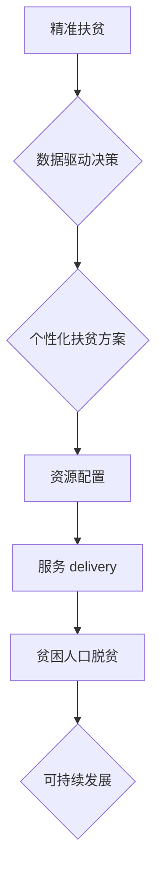

                 

## 2050年的全球减贫：从精准扶贫到可持续减贫的全球减贫合作

> 关键词：精准扶贫、可持续发展、人工智能、大数据、机器学习、全球合作、社会公平、数据驱动决策

### 1. 背景介绍

全球贫困问题是人类社会面临的重大挑战。联合国将消除贫困作为其可持续发展目标的核心议题，并设定了到2030年实现这一目标的期限。然而，尽管在过去几十年中取得了显著进展，但全球贫困问题依然根深蒂固，尤其是在发展中国家。

传统的扶贫模式往往缺乏针对性和可持续性，难以有效解决贫困的根本原因。随着人工智能、大数据和机器学习等技术的快速发展，为精准扶贫和可持续减贫提供了新的机遇。

### 2. 核心概念与联系

精准扶贫是指通过对贫困人口进行细致的识别、分析和评估，制定个性化的扶贫方案，并通过有效的资源配置和服务 delivery 实现精准帮扶。可持续减贫是指通过促进经济增长、改善社会环境和加强全球合作，实现长远、稳定的贫困消除目标。

**精准扶贫与可持续减贫的联系**

精准扶贫是实现可持续减贫的重要途径。通过精准识别贫困人口，制定个性化扶贫方案，可以有效提高扶贫资源的利用效率，并帮助贫困人口摆脱贫困，实现自我发展。同时，可持续减贫的理念强调经济增长、社会发展和环境保护的协调发展，为精准扶贫创造了良好的外部环境。

**Mermaid 流程图**



### 3. 核心算法原理 & 具体操作步骤

**3.1 算法原理概述**

精准扶贫的算法原理主要基于机器学习和数据挖掘技术。通过对贫困人口的社会经济特征、生活状况、教育水平、健康状况等数据进行分析，可以建立预测模型，识别贫困风险，并为不同群体制定个性化的扶贫方案。

**3.2 算法步骤详解**

1. **数据收集与预处理:** 收集贫困人口的社会经济特征、生活状况、教育水平、健康状况等数据，并进行清洗、转换和标准化处理。
2. **特征工程:** 从原始数据中提取有价值的特征，例如年龄、性别、收入、居住地、教育程度等，并进行组合和转换，以提高模型的预测精度。
3. **模型选择与训练:** 选择合适的机器学习算法，例如逻辑回归、支持向量机、决策树等，并根据训练数据对模型进行训练，学习贫困风险的预测规律。
4. **模型评估与优化:** 使用测试数据对模型进行评估，并根据评估结果调整模型参数，优化模型的预测精度。
5. **个性化扶贫方案制定:** 根据模型预测结果，为不同群体制定个性化的扶贫方案，例如提供教育培训、技能提升、就业机会、医疗保障等。

**3.3 算法优缺点**

**优点:**

* **精准性:** 通过数据分析，可以精准识别贫困人口，并为其制定个性化的扶贫方案。
* **效率:** 数据驱动决策可以提高扶贫资源的利用效率，并缩短扶贫周期。
* **可持续性:** 通过促进经济增长和社会发展，可以为精准扶贫创造良好的外部环境。

**缺点:**

* **数据依赖:** 算法的准确性依赖于数据的质量和完整性。
* **算法偏差:** 算法可能存在偏差，导致对某些群体进行不公平的对待。
* **伦理问题:** 数据收集和使用需要遵循伦理规范，避免侵犯个人隐私。

**3.4 算法应用领域**

精准扶贫算法可以应用于以下领域:

* **贫困人口识别:** 通过分析人口数据，识别贫困风险人群。
* **扶贫方案设计:** 根据不同群体的需求，制定个性化的扶贫方案。
* **资源分配:** 根据贫困人口的分布和需求，优化扶贫资源的分配。
* **扶贫效果评估:** 通过数据分析，评估扶贫项目的成效，并进行改进。

### 4. 数学模型和公式 & 详细讲解 & 举例说明

**4.1 数学模型构建**

精准扶贫的数学模型可以基于概率论和统计学原理构建。例如，可以建立一个预测贫困风险的Logistic回归模型，其中输入变量包括人口的社会经济特征、生活状况、教育水平、健康状况等，输出变量为贫困风险概率。

**4.2 公式推导过程**

Logistic回归模型的公式如下:

$$
P(Y=1|X) = \frac{1}{1 + e^{-(β_0 + β_1X_1 + β_2X_2 + ... + β_nX_n)}}
$$

其中:

* $P(Y=1|X)$ 是给定特征向量 $X$ 下贫困风险为 1 的概率。
* $β_0, β_1, β_2, ..., β_n$ 是模型参数，需要通过训练数据进行估计。
* $X_1, X_2, ..., X_n$ 是特征变量。

**4.3 案例分析与讲解**

假设我们想要预测一个地区的贫困风险，并收集了该地区的居民年龄、收入、教育水平等数据。我们可以使用Logistic回归模型对这些数据进行分析，并得到一个预测模型。

通过输入该地区的居民数据，模型可以输出每个居民的贫困风险概率。我们可以根据这些概率，为不同风险等级的居民制定不同的扶贫方案。例如，对于贫困风险较高的居民，我们可以提供更多的经济援助和社会服务；对于贫困风险较低的居民，我们可以提供更多的教育培训和就业机会。

### 5. 项目实践：代码实例和详细解释说明

**5.1 开发环境搭建**

* 操作系统: Ubuntu 20.04 LTS
* Python 版本: 3.8.10
* 必要的库: pandas, scikit-learn, matplotlib, seaborn

**5.2 源代码详细实现**

```python
import pandas as pd
from sklearn.linear_model import LogisticRegression
from sklearn.model_selection import train_test_split
from sklearn.metrics import accuracy_score

# 加载数据
data = pd.read_csv('poverty_data.csv')

# 选择特征变量和目标变量
features = ['age', 'income', 'education']
target = 'poverty_status'

# 将数据划分为训练集和测试集
X_train, X_test, y_train, y_test = train_test_split(data[features], data[target], test_size=0.2, random_state=42)

# 创建Logistic回归模型
model = LogisticRegression()

# 训练模型
model.fit(X_train, y_train)

# 对测试集进行预测
y_pred = model.predict(X_test)

# 计算模型精度
accuracy = accuracy_score(y_test, y_pred)
print(f'模型精度: {accuracy}')
```

**5.3 代码解读与分析**

* 首先，我们加载数据并选择特征变量和目标变量。
* 然后，我们将数据划分为训练集和测试集，用于训练和评估模型。
* 接下来，我们创建Logistic回归模型并训练模型。
* 最后，我们对测试集进行预测，并计算模型精度。

**5.4 运行结果展示**

运行上述代码后，可以得到模型的精度值。精度值越高，模型的预测能力越强。

### 6. 实际应用场景

精准扶贫算法已经在多个国家和地区得到应用，例如：

* **中国:** 中国政府利用大数据和人工智能技术，建立了精准扶贫平台，为贫困人口提供个性化的扶贫服务。
* **印度:** 印度政府利用手机应用程序，为贫困人口提供金融服务和教育培训。
* **肯尼亚:** 肯尼亚政府利用卫星遥感数据，监测贫困人口的居住环境和生活状况。

**6.4 未来应用展望**

随着人工智能、大数据和物联网技术的不断发展，精准扶贫算法将更加智能化、个性化和可持续化。未来，精准扶贫算法可能应用于以下领域:

* **预测性维护:** 通过分析贫困人口的生活状况和需求，预测未来可能出现的困难，并提前提供帮助。
* **个性化教育:** 根据贫困人口的学习能力和兴趣，提供个性化的教育培训，帮助他们提升技能和获得就业机会。
* **精准医疗:** 通过分析贫困人口的健康状况，提供精准的医疗服务，提高他们的健康水平。

### 7. 工具和资源推荐

**7.1 学习资源推荐**

* **在线课程:** Coursera, edX, Udacity 等平台提供人工智能、机器学习和数据挖掘相关的在线课程。
* **书籍:** 《深度学习》、《机器学习实战》、《数据挖掘导论》等书籍可以帮助读者深入了解相关知识。
* **开源项目:** TensorFlow, PyTorch, scikit-learn 等开源项目可以帮助读者实践相关技术。

**7.2 开发工具推荐**

* **Python:** Python 是机器学习和数据挖掘领域最常用的编程语言。
* **Jupyter Notebook:** Jupyter Notebook 是一个交互式编程环境，方便进行数据分析和模型开发。
* **云计算平台:** AWS, Azure, GCP 等云计算平台提供强大的计算资源和数据存储服务。

**7.3 相关论文推荐**

* **《深度学习》**
* **《机器学习实战》**
* **《数据挖掘导论》**

### 8. 总结：未来发展趋势与挑战

**8.1 研究成果总结**

精准扶贫算法在解决全球贫困问题方面取得了显著进展。通过数据驱动决策，可以提高扶贫资源的利用效率，并帮助贫困人口摆脱贫困。

**8.2 未来发展趋势**

未来，精准扶贫算法将更加智能化、个性化和可持续化。人工智能、大数据和物联网技术的不断发展将为精准扶贫提供更强大的技术支撑。

**8.3 面临的挑战**

精准扶贫算法也面临着一些挑战，例如数据质量、算法偏差、伦理问题等。需要加强数据治理，改进算法模型，并制定相应的伦理规范，才能确保精准扶贫算法的公平、有效和可持续发展。

**8.4 研究展望**

未来，需要进一步研究精准扶贫算法的理论基础、技术方法和应用场景，并加强跨学科合作，推动精准扶贫算法的创新发展，为实现全球减贫目标贡献力量。

### 9. 附录：常见问题与解答

**常见问题:**

* 精准扶贫算法是否会侵犯个人隐私？
* 精准扶贫算法是否会加剧社会不平等？
* 精准扶贫算法的准确性如何保证？

**解答:**

* 数据收集和使用需要遵循伦理规范，保护个人隐私。
* 需要不断改进算法模型，避免算法偏差，确保公平性。
* 需要使用高质量的数据进行训练，并定期评估模型精度。


作者：禅与计算机程序设计艺术 / Zen and the Art of Computer Programming 
<end_of_turn>

