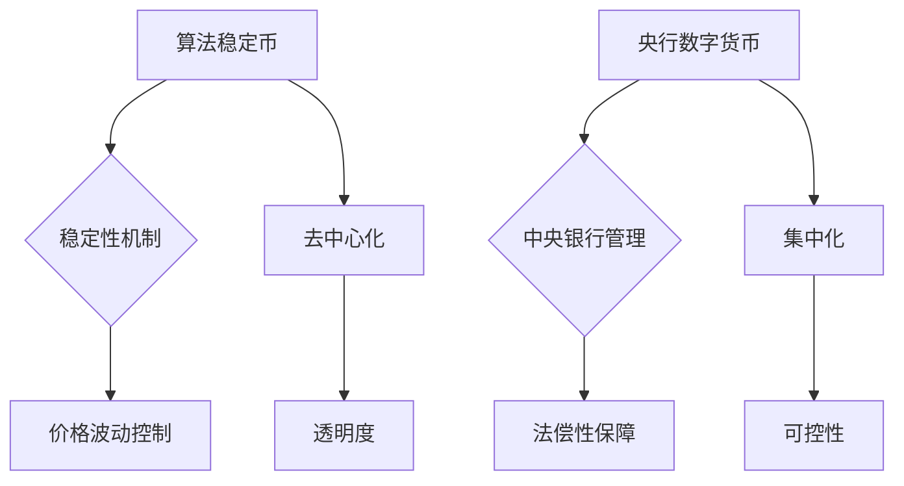

                 

## 2050年的数字货币：从算法稳定币到全球央行数字货币的数字货币竞争

> 关键词：数字货币、算法稳定币、央行数字货币、区块链、去中心化、金融科技、加密货币、未来趋势

### 1. 背景介绍

2023年，数字货币已经不再是科幻小说中的概念，而是日益走进现实生活的金融工具。从比特币的诞生到以太坊的智能合约，从稳定币的出现到央行数字货币的探索，数字货币的发展历程充满了创新和挑战。

随着技术的不断进步，数字货币在2050年将迎来一场新的变革。算法稳定币和央行数字货币将成为两个主要竞争者，它们各自拥有独特的优势和劣势，将共同塑造未来金融体系的格局。

### 2. 核心概念与联系

#### 2.1 算法稳定币

算法稳定币是一种基于区块链技术的加密货币，其价值与其他加密货币或法定货币挂钩，并通过算法机制来维持稳定。

#### 2.2 央行数字货币

央行数字货币（CBDC）是由中央银行发行的数字货币，具有法偿性，并由中央银行直接管理和发行。

#### 2.3 核心概念关系图



### 3. 核心算法原理 & 具体操作步骤

#### 3.1 算法原理概述

算法稳定币的稳定性机制主要通过以下几种方式实现：

* **算法调控：** 通过智能合约自动调节供应量，例如销毁或发行稳定币，以维持其与目标资产的挂钩。
* **抵押机制：** 稳定币发行需要抵押相应的法定货币或其他加密资产，以保证其价值。
* **双重代币体系：** 稳定币由两部分组成，一部分是稳定币本身，另一部分是算法代币，两者通过算法机制相互关联，实现稳定性。

#### 3.2 算法步骤详解

以算法调控为例，其具体操作步骤如下：

1. **设定目标资产：** 稳定币发行方选择一个目标资产，例如美元或黄金，作为其价值锚定点。
2. **设计算法机制：** 根据目标资产的价格波动情况，设计一个算法机制，用于自动调节稳定币的供应量。
3. **智能合约部署：** 将算法机制部署到智能合约中，使其能够自动执行。
4. **用户兑换：** 用户可以使用法定货币或其他加密资产兑换稳定币。
5. **价格波动：** 当稳定币的价格与目标资产的价格出现偏差时，智能合约会自动执行算法机制，例如销毁或发行稳定币，以将价格拉回目标区间。

#### 3.3 算法优缺点

**优点：**

* **去中心化：** 算法稳定币不受任何单一机构控制，更加透明和安全。
* **自动化：** 算法机制能够自动调节供应量，实现价格稳定。
* **高效性：** 智能合约能够快速高效地执行交易。

**缺点：**

* **算法复杂性：** 设计一个能够有效控制价格波动的算法机制非常复杂。
* **黑客攻击风险：** 智能合约存在被黑客攻击的风险。
* **监管挑战：** 算法稳定币的去中心化特性给监管带来挑战。

#### 3.4 算法应用领域

* **支付结算：** 算法稳定币可以作为一种更便捷、更安全的支付工具。
* **跨境交易：** 算法稳定币可以降低跨境交易成本和时间。
* **金融衍生品：** 算法稳定币可以作为金融衍生品的标的资产。

### 4. 数学模型和公式 & 详细讲解 & 举例说明

#### 4.1 数学模型构建

假设稳定币的价值锚定于美元，其价格波动范围为±1%。我们可以构建一个简单的数学模型来描述其价格波动：

* **S:** 稳定币价格
* **D:** 目标资产价格（美元）
* **α:** 价格波动范围（例如，0.01）

**模型公式：**

$$S = D * (1 ± α)$$

#### 4.2 公式推导过程

当稳定币价格低于目标资产价格时，算法机制会自动发行更多稳定币，以增加其供应量，从而推升价格。反之，当稳定币价格高于目标资产价格时，算法机制会自动销毁部分稳定币，以减少其供应量，从而降低价格。

#### 4.3 案例分析与讲解

假设目标资产价格为1美元，稳定币价格波动范围为±1%。

* 当稳定币价格低于0.99美元时，算法机制会自动发行更多稳定币，以将价格拉回目标区间。
* 当稳定币价格高于1.01美元时，算法机制会自动销毁部分稳定币，以将价格拉回目标区间。

### 5. 项目实践：代码实例和详细解释说明

#### 5.1 开发环境搭建

* **编程语言：** Solidity
* **开发工具：** Remix IDE
* **区块链网络：** 以太坊测试网络

#### 5.2 源代码详细实现

```solidity
pragma solidity ^0.8.0;

contract StableCoin {
    string public name = "My StableCoin";
    string public symbol = "MSC";
    uint8 public decimals = 18;
    uint public totalSupply;
    mapping(address => uint) public balanceOf;

    event Transfer(address indexed from, address indexed to, uint value);

    constructor(uint initialSupply) {
        totalSupply = initialSupply;
        balanceOf[msg.sender] = initialSupply;
    }

    function transfer(address to, uint value) public returns (bool) {
        require(balanceOf[msg.sender] >= value, "Insufficient balance");
        balanceOf[msg.sender] -= value;
        balanceOf[to] += value;
        emit Transfer(msg.sender, to, value);
        return true;
    }
}
```

#### 5.3 代码解读与分析

* **合约名称和符号：** `name` 和 `symbol` 定义了稳定币的名称和符号。
* **小数点位数：** `decimals` 定义了稳定币的小数点位数。
* **总供应量：** `totalSupply` 记录了稳定币的总供应量。
* **账户余额：** `balanceOf` 记录了每个账户的稳定币余额。
* **转移事件：** `Transfer` 事件记录了稳定币的转移操作。
* **构造函数：** `constructor` 函数在合约部署时初始化总供应量并分配给创建者。
* **转移函数：** `transfer` 函数实现稳定币的转移操作，需要满足余额充足的条件。

#### 5.4 运行结果展示

在以太坊测试网络上部署合约后，可以进行稳定币的创建、转移和查询余额等操作。

### 6. 实际应用场景

#### 6.1 跨境支付

算法稳定币可以降低跨境支付成本和时间，为跨境贸易和移民提供更便捷的支付方式。

#### 6.2 微小支付

算法稳定币可以用于微小支付场景，例如在线游戏、内容订阅和共享经济平台。

#### 6.3 供应链金融

算法稳定币可以提高供应链金融的效率，例如为中小企业提供更便捷的融资渠道。

#### 6.4 未来应用展望

随着技术的进步，算法稳定币的应用场景将更加广泛，例如：

* **去中心化金融（DeFi）：** 作为DeFi协议中的基础资产。
* **数字身份：** 与数字身份系统结合，实现身份验证和数据管理。
* **物联网（IoT）：** 用于物联网设备之间的支付和数据交易。

### 7. 工具和资源推荐

#### 7.1 学习资源推荐

* **书籍：** 《Mastering Ethereum》
* **在线课程：** Coursera、Udemy
* **社区论坛：** Ethereum Stack Exchange、Reddit

#### 7.2 开发工具推荐

* **Remix IDE：** 在线 Solidity 开发环境
* **Truffle Suite：** Ethereum 开发工具套件
* **Hardhat：** Ethereum 开发框架

#### 7.3 相关论文推荐

* **The Bitcoin Whitepaper：** https://bitcoin.org/bitcoin.pdf
* **A Next-Generation Smart Contract Platform：** https://ethereum.org/en/whitepaper/

### 8. 总结：未来发展趋势与挑战

#### 8.1 研究成果总结

2050年，数字货币将成为金融体系的重要组成部分，算法稳定币和央行数字货币将共同推动其发展。

#### 8.2 未来发展趋势

* **更广泛的应用场景：** 数字货币将应用于更多领域，例如支付、金融、供应链、物联网等。
* **更完善的监管框架：** 各国政府将制定更完善的监管框架，以规范数字货币的市场秩序。
* **更强大的技术支持：** 区块链技术将不断发展，为数字货币提供更强大的技术支持。

#### 8.3 面临的挑战

* **技术挑战：** 如何提高数字货币的安全性、隐私性和可扩展性。
* **监管挑战：** 如何平衡数字货币的创新发展和金融稳定。
* **公众认知：** 如何提高公众对数字货币的理解和接受度。

#### 8.4 研究展望

未来，我们需要继续深入研究数字货币的原理、技术和应用，并积极探索其在未来金融体系中的作用。

### 9. 附录：常见问题与解答

#### 9.1 什么是算法稳定币？

算法稳定币是一种基于区块链技术的加密货币，其价值与其他加密货币或法定货币挂钩，并通过算法机制来维持稳定。

#### 9.2 央行数字货币有哪些优势？

央行数字货币具有法偿性保障、可控性强、支付效率高等优势。

#### 9.3 数字货币的未来发展趋势是什么？

数字货币将应用于更多领域，并逐渐成为金融体系的重要组成部分。


作者：禅与计算机程序设计艺术 / Zen and the Art of Computer Programming 
<end_of_turn>

