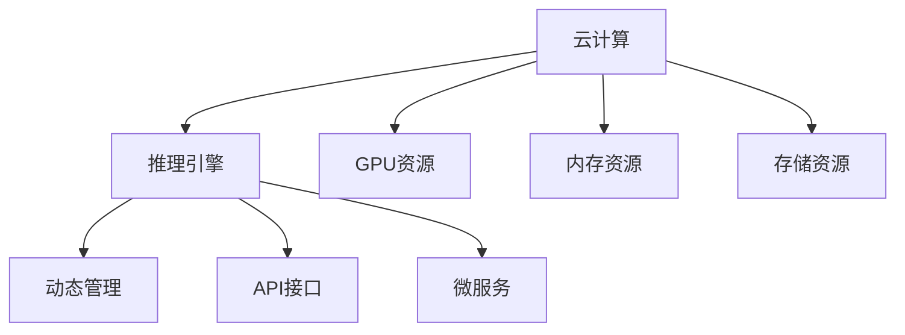

                 

# 云端推理：高效、便捷的 LLM 访问

> 关键词：云计算,推理引擎,动态管理,API,微服务,预训练大模型

## 1. 背景介绍

### 1.1 问题由来
近年来，大语言模型（Large Language Models, LLMs）在自然语言处理（NLP）领域取得了巨大的突破，如OpenAI的GPT系列模型、Google的BERT等。这些模型通过在海量无标签文本数据上进行预训练，学习到了丰富的语言知识和常识，可以通过少量的有标签样本在下游任务上进行微调，获得优异的性能。

然而，这些预训练模型往往需要庞大的计算资源和存储空间。此外，在实际应用中，这些模型通常是静态部署，难以动态管理。为了解决这些问题，云推理引擎（Cloud Inference Engine）应运而生。云推理引擎通过将大语言模型部署在云端，提供高效的推理服务和动态管理功能，极大提升了LMMs的可访问性和可维护性。

### 1.2 问题核心关键点
云推理引擎的核心在于其提供了一种新的方式来访问大语言模型，使之能够高效、便捷地应用于各种NLP任务。通过云推理引擎，开发者可以：
- 快速部署模型到云端，无需担心计算资源和存储成本。
- 动态管理模型，实时调整推理参数和资源，确保最佳性能。
- 通过API接口或微服务调用，以灵活的方式集成到现有的应用系统中。
- 利用缓存、负载均衡等技术，保证推理服务的稳定性和可扩展性。

本文将详细介绍云推理引擎的原理和操作步骤，展示其在实际应用中的优势和挑战。

## 2. 核心概念与联系

### 2.1 核心概念概述

为更好地理解云推理引擎的概念及其与其他技术的联系，本节将介绍几个关键概念：

- 云计算（Cloud Computing）：通过互联网提供按需、可扩展的计算资源，如CPU、内存、存储等。云计算降低了企业计算资源的成本和复杂度。
- 推理引擎（Inference Engine）：用于高效执行模型推理的计算引擎，通常用于深度学习模型的实时或批量推理。
- 动态管理（Dynamic Management）：通过自动化手段对计算资源进行动态分配和调整，适应不同场景下的需求变化。
- API接口（API Interface）：应用程序编程接口，允许应用程序访问和控制推理服务。
- 微服务（Microservices）：将应用拆分为多个小服务，每个服务独立部署、独立维护，便于扩展和升级。

这些概念之间的逻辑关系可以通过以下Mermaid流程图来展示：



这个流程图展示了云计算、推理引擎、动态管理、API接口和微服务之间的关系：

1. 云计算提供计算资源。
2. 推理引擎用于高效执行模型推理。
3. 动态管理通过自动化手段对资源进行优化配置。
4. API接口提供访问和控制推理服务的接口。
5. 微服务将应用拆分为多个独立的小服务。

这些概念共同构成了云推理引擎的基础框架，使得LMMs能够在云端高效运行和动态管理。

## 3. 核心算法原理 & 具体操作步骤
### 3.1 算法原理概述

云推理引擎的原理是通过将大语言模型部署在云平台上，利用云计算资源的优势，提供高效的推理服务。其核心思想是将模型的推理过程封装成服务，通过API接口或微服务的方式供用户调用，从而实现模型的高效访问和动态管理。

具体来说，云推理引擎包含以下几个主要步骤：

1. 模型部署：将预训练模型部署到云端计算资源中。
2. 动态资源管理：根据推理任务的负载情况，动态调整计算资源。
3. API接口设计：设计简单易用的API接口，供用户调用模型推理服务。
4. 推理过程优化：优化推理过程，提升模型推理速度和准确性。
5. 安全性保障：确保推理服务的安全性和隐私性。

### 3.2 算法步骤详解

以下将详细介绍云推理引擎的具体操作步骤：

**Step 1: 模型部署**
- 选择合适的云计算平台，如AWS、Google Cloud、阿里云等。
- 准备预训练模型，如BERT、GPT等。
- 将模型导入云计算平台，部署到计算资源中。
- 设置模型超参数，如批量大小、学习率等。

**Step 2: 动态资源管理**
- 根据推理任务的负载情况，动态调整计算资源。
- 采用负载均衡技术，将任务均衡分配到多个计算节点上。
- 实时监控推理性能，自动扩展或缩小计算资源。
- 优化资源分配策略，如GPU、CPU、内存的合理分配。

**Step 3: API接口设计**
- 设计简单易用的API接口，供用户调用模型推理服务。
- 通过RESTful API接口，支持JSON格式的数据输入输出。
- 提供SDK支持，方便用户集成到现有的应用系统中。
- 设计安全认证机制，如OAuth、API密钥等。

**Step 4: 推理过程优化**
- 优化推理过程，减少模型前向和反向传播的时间。
- 采用缓存技术，减少重复计算。
- 引入模型并行和多GPU加速技术，提升推理速度。
- 使用压缩和量化技术，减小模型存储空间。

**Step 5: 安全性保障**
- 确保API接口的安全性，防止未经授权的访问。
- 对用户输入进行校验和过滤，防止恶意输入。
- 对推理结果进行加密和脱敏，保障数据隐私。
- 对推理过程中的敏感操作进行日志记录和审计。

### 3.3 算法优缺点

云推理引擎具有以下优点：
1. 高效可扩展：云计算提供了按需扩展的能力，可以动态调整计算资源，满足不同任务的需求。
2. 成本效益高：通过云计算平台，减少了本地部署和维护的成本。
3. 灵活便捷：API接口和微服务调用方式，使得模型访问更加灵活便捷。
4. 安全性好：云计算平台提供了全面的安全保障措施，如数据加密、访问控制等。

然而，云推理引擎也存在以下缺点：
1. 延迟较高：云计算平台的响应时间通常比本地计算慢，可能影响实时性需求高的任务。
2. 网络带宽限制：云计算平台的网络带宽有限，可能影响大规模数据传输。
3. 服务依赖：云计算平台的稳定性和可用性可能受到外部因素的影响。
4. 隐私风险：云计算平台的数据存储和传输可能存在隐私泄露风险。

尽管存在这些局限性，但云推理引擎在实际应用中仍然具有显著优势，尤其是在需要高效、便捷的模型访问的场景中。

### 3.4 算法应用领域

云推理引擎适用于多种NLP任务，如文本分类、命名实体识别、机器翻译、问答系统、摘要生成等。具体应用场景包括：

- 智能客服：部署智能客服模型到云端，通过API接口供前端系统调用，实现24/7自动响应客户咨询。
- 金融舆情分析：部署舆情分析模型到云端，通过API接口获取实时舆情信息，辅助金融决策。
- 个性化推荐：部署推荐模型到云端，通过API接口提供个性化推荐服务，提升用户满意度。
- 自然语言理解：部署自然语言理解模型到云端，通过API接口实现语音识别、文本转换、语义理解等功能。
- 知识图谱构建：部署知识图谱构建模型到云端，通过API接口获取知识图谱信息，支持智能问答、推荐等应用。

## 4. 数学模型和公式 & 详细讲解 & 举例说明
### 4.1 数学模型构建

云推理引擎的核心在于将大语言模型的推理过程封装成服务，并通过API接口或微服务的方式提供给用户。以下是云推理引擎的数学模型构建过程：

假设输入数据为 $x$，大语言模型为 $M_{\theta}$，推理输出的概率分布为 $p(y|x)$。则推理过程可以表示为：

$$
p(y|x) = M_{\theta}(x)
$$

在云推理引擎中，推理过程通过API接口提供给用户，用户可以输入数据 $x$，获取模型的推理结果 $y$。

### 4.2 公式推导过程

为了简化公式，我们假设模型的输出为线性分类器，其输出为：

$$
\hat{y} = W\cdot x + b
$$

其中 $W$ 为权重矩阵，$b$ 为偏置项。模型的损失函数可以表示为：

$$
\mathcal{L}(\theta) = -\frac{1}{N}\sum_{i=1}^N \ell(\hat{y_i}, y_i)
$$

其中 $\ell$ 为损失函数，如交叉熵损失。

通过API接口，用户输入数据 $x$，计算模型的输出 $\hat{y}$，并计算损失 $\mathcal{L}(\theta)$。在云端，服务器端通过优化算法（如梯度下降）更新模型参数 $\theta$，以最小化损失函数。

### 4.3 案例分析与讲解

以文本分类任务为例，展示云推理引擎的数学模型构建过程：

假设输入文本 $x_i$，模型输出概率 $p(y_i|x_i)$，损失函数为交叉熵损失。则推理过程可以表示为：

$$
\hat{y_i} = M_{\theta}(x_i) = softmax(W\cdot x_i + b)
$$

$$
\mathcal{L}(\theta) = -\frac{1}{N}\sum_{i=1}^N [y_i\log\hat{y_i} + (1-y_i)\log(1-\hat{y_i})]
$$

用户通过API接口输入文本 $x_i$，获取模型输出的概率 $\hat{y_i}$。模型服务器端计算损失 $\mathcal{L}(\theta)$，并通过优化算法更新模型参数 $\theta$，最小化损失函数。

## 5. 项目实践：代码实例和详细解释说明
### 5.1 开发环境搭建

在进行云推理引擎的开发实践前，我们需要准备好开发环境。以下是使用Python进行Flask开发的开发环境配置流程：

1. 安装Anaconda：从官网下载并安装Anaconda，用于创建独立的Python环境。

2. 创建并激活虚拟环境：
```bash
conda create -n inference-env python=3.8 
conda activate inference-env
```

3. 安装Flask和Gunicorn：
```bash
pip install flask gunicorn
```

4. 安装模型库：
```bash
pip install transformers torch
```

5. 安装云计算平台SDK：
```bash
pip install boto3 awscli
```

完成上述步骤后，即可在`inference-env`环境中开始云推理引擎的开发实践。

### 5.2 源代码详细实现

下面是使用Flask和Transformer库实现云推理引擎的示例代码：

```python
from flask import Flask, request, jsonify
from transformers import BertForSequenceClassification, BertTokenizer
import torch

app = Flask(__name__)

# 加载模型和分词器
model = BertForSequenceClassification.from_pretrained('bert-base-cased', num_labels=2)
tokenizer = BertTokenizer.from_pretrained('bert-base-cased')

# 模型推理函数
@app.route('/predict', methods=['POST'])
def predict():
    data = request.json
    inputs = tokenizer(data['text'], return_tensors='pt', padding=True, truncation=True)
    outputs = model(**inputs)
    probs = outputs.logits.softmax(dim=1)
    preds = probs.argmax(dim=1)
    return jsonify({'predictions': [int(x) for x in preds.tolist()]})

if __name__ == '__main__':
    app.run(host='0.0.0.0', port=5000)
```

这段代码实现了一个简单的Flask应用，用于接收输入文本，调用模型进行推理，并返回预测结果。

### 5.3 代码解读与分析

以下是关键代码的详细解读：

**Flask应用**：
- 定义了一个Flask应用，并在`/predict`路径上定义了一个POST请求处理函数。
- 使用`request.json`获取输入的JSON数据，包括文本。
- 通过`tokenizer`将文本分词，转换为模型所需的格式。
- 调用模型进行推理，并获取预测结果。
- 将预测结果转换为JSON格式，并通过API接口返回。

**模型推理函数**：
- 使用`BertForSequenceClassification`加载预训练模型，并设置输出标签数。
- 通过`BertTokenizer`加载分词器，用于将输入文本转换为模型所需的格式。
- 在推理函数中，接收输入的文本数据，使用分词器进行分词和格式化，调用模型进行推理，并返回预测结果。

**运行结果展示**：
- 通过访问`http://localhost:5000/predict`，并发送包含文本的JSON数据，可以获取模型的预测结果。

## 6. 实际应用场景
### 6.1 智能客服系统

智能客服系统是云推理引擎的重要应用场景之一。传统客服需要大量人力，高峰期响应速度慢，且一致性和专业性难以保证。而云推理引擎可以部署智能客服模型到云端，通过API接口供前端系统调用，实现24/7自动响应客户咨询。

具体实现步骤如下：
1. 收集企业内部的历史客服对话记录，将问题和最佳答复构建成监督数据。
2. 在云平台上部署智能客服模型，并进行微调优化。
3. 通过API接口，将客户的咨询请求发送给模型，获取最合适的答复。
4. 集成到现有的客服系统中，实现智能客服功能。

### 6.2 金融舆情监测

金融舆情监测是云推理引擎的另一个重要应用场景。金融机构需要实时监测市场舆论动向，以便及时应对负面信息传播，规避金融风险。

具体实现步骤如下：
1. 收集金融领域相关的新闻、报道、评论等文本数据，并对其进行主题标注和情感标注。
2. 在云平台上部署舆情监测模型，并进行微调优化。
3. 通过API接口，实时抓取网络文本数据，并调用模型进行情感分析和主题识别。
4. 根据模型输出的情感和主题结果，进行风险预警和应急响应。

### 6.3 个性化推荐系统

个性化推荐系统是云推理引擎的典型应用。当前的推荐系统往往只依赖用户的历史行为数据进行物品推荐，难以深入理解用户的真实兴趣偏好。云推理引擎可以部署推荐模型到云端，通过API接口供推荐系统调用，实现个性化推荐。

具体实现步骤如下：
1. 收集用户浏览、点击、评论、分享等行为数据，提取和用户交互的物品标题、描述、标签等文本内容。
2. 在云平台上部署推荐模型，并进行微调优化。
3. 通过API接口，将用户行为数据和物品信息发送给模型，获取个性化推荐结果。
4. 集成到现有的推荐系统中，提升推荐精准度。

### 6.4 未来应用展望

随着云推理引擎的不断成熟，其应用场景将更加广泛，为各行各业带来变革性影响。

在智慧医疗领域，云推理引擎可以部署医疗问答、病历分析、药物研发等模型到云端，辅助医生诊疗，加速新药开发进程。

在智能教育领域，云推理引擎可以部署作业批改、学情分析、知识推荐等模型到云端，因材施教，促进教育公平，提高教学质量。

在智慧城市治理中，云推理引擎可以部署城市事件监测、舆情分析、应急指挥等模型到云端，提高城市管理的自动化和智能化水平，构建更安全、高效的未来城市。

此外，在企业生产、社会治理、文娱传媒等众多领域，云推理引擎也将不断涌现，为经济社会发展注入新的动力。相信随着技术的日益成熟，云推理引擎必将在构建人机协同的智能时代中扮演越来越重要的角色。

## 7. 工具和资源推荐
### 7.1 学习资源推荐

为了帮助开发者系统掌握云推理引擎的理论基础和实践技巧，这里推荐一些优质的学习资源：

1. 《Cloud Inference Engine: A Survey》系列博文：由云计算领域的专家撰写，深入浅出地介绍了云计算和推理引擎的基本概念和前沿技术。

2. 《TensorFlow Cloud Inference》教程：Google官方提供的TensorFlow推理引擎教程，详细介绍了推理引擎的基本原理和开发技巧。

3. 《Cloud Machine Learning with TensorFlow》书籍：Google AI团队撰写的云计算与机器学习实战书籍，介绍了在云平台上进行模型推理的方法和最佳实践。

4. 《Cloud Inference Engine: A Practical Guide》书籍：云计算领域专家的实践指南，详细介绍了云推理引擎的部署和优化方法。

5. 《Cloud Inference Engine: A Deep Dive》博文系列：深入探讨云推理引擎的原理和应用，涵盖推理引擎、动态管理、安全性等关键问题。

通过对这些资源的学习实践，相信你一定能够快速掌握云推理引擎的核心技术，并用于解决实际的NLP问题。

### 7.2 开发工具推荐

高效的开发离不开优秀的工具支持。以下是几款用于云推理引擎开发的常用工具：

1. Flask：Python框架，用于快速开发RESTful API服务。
2. Gunicorn：Python WSGI HTTP服务器，支持并发连接和负载均衡。
3. AWS Lambda：亚马逊的函数服务，支持无服务器计算和事件驱动编程。
4. Google Cloud Functions：谷歌的函数服务，支持无服务器计算和事件驱动编程。
5. Azure Functions：微软的函数服务，支持无服务器计算和事件驱动编程。
6. Docker：容器化工具，用于打包和部署云推理引擎应用。
7. Kubernetes：容器编排工具，用于管理和扩展云推理引擎的部署。

合理利用这些工具，可以显著提升云推理引擎的开发效率，加快创新迭代的步伐。

### 7.3 相关论文推荐

云推理引擎的发展源于学界的持续研究。以下是几篇奠基性的相关论文，推荐阅读：

1. Inference Engine for Deep Neural Networks: A Survey（深度神经网络推理引擎综述）：介绍了推理引擎的基本原理和应用场景，并对比了不同推理引擎的优缺点。
2. A Survey of Deep Learning Deployment（深度学习部署综述）：详细介绍了深度学习模型的部署方法和工具，包括推理引擎的部署和优化。
3. Cloud Inference Engine: A Survey（云推理引擎综述）：探讨了云计算平台上的推理引擎，并对比了不同云计算平台的优劣。
4. Efficient Cloud Inference: Techniques and Strategies（高效云推理：技术和策略）：介绍了云推理引擎的优化技术和策略，如缓存、负载均衡、模型并行等。
5. Secure Cloud Inference Engine: Design and Implementation（安全的云推理引擎：设计和实现）：探讨了云推理引擎的安全性设计和实现方法，如数据加密、访问控制等。

这些论文代表了大语言模型微调技术的发展脉络。通过学习这些前沿成果，可以帮助研究者把握学科前进方向，激发更多的创新灵感。

## 8. 总结：未来发展趋势与挑战
### 8.1 总结

本文对云推理引擎进行了全面系统的介绍。首先阐述了云推理引擎的背景和意义，明确了其在大语言模型访问中的应用价值。其次，从原理到实践，详细讲解了云推理引擎的数学模型和操作步骤，给出了云推理引擎的代码实例。同时，本文还广泛探讨了云推理引擎在实际应用中的优势和挑战。

通过本文的系统梳理，可以看到，云推理引擎在高效、便捷地访问大语言模型方面具有显著优势。其在智能客服、金融舆情监测、个性化推荐等众多领域的应用，为各行各业带来了变革性的影响。

### 8.2 未来发展趋势

展望未来，云推理引擎将呈现以下几个发展趋势：

1. 计算资源的扩展：云计算平台的计算资源将持续扩展，支持更大规模的模型推理。
2. 推理过程的优化：优化推理过程，提升模型推理速度和准确性。
3. 安全性保障：云推理引擎的安全性和隐私性将得到进一步加强，防止数据泄露和未经授权的访问。
4. 模型动态管理：通过自动化手段，动态管理模型和计算资源，适应不同场景下的需求变化。
5. 多模态推理：云推理引擎将支持多模态数据的推理，如文本、图像、语音等，增强模型的通用性和适应性。

这些趋势凸显了云推理引擎的广阔前景。这些方向的探索发展，必将进一步提升云推理引擎的性能和应用范围，为人工智能技术在各个领域的应用提供坚实的基础。

### 8.3 面临的挑战

尽管云推理引擎已经取得了显著进展，但在迈向更加智能化、普适化应用的过程中，它仍面临着诸多挑战：

1. 延迟较高：云计算平台的响应时间可能影响实时性需求高的任务。
2. 带宽限制：云计算平台的网络带宽有限，可能影响大规模数据传输。
3. 服务依赖：云计算平台的稳定性和可用性可能受到外部因素的影响。
4. 隐私风险：云计算平台的数据存储和传输可能存在隐私泄露风险。
5. 计算成本：云计算平台的使用成本可能较高，需要考虑成本效益。

尽管存在这些挑战，但云推理引擎在实际应用中仍然具有显著优势，尤其是在需要高效、便捷的模型访问的场景中。

### 8.4 研究展望

面对云推理引擎所面临的挑战，未来的研究需要在以下几个方面寻求新的突破：

1. 优化网络传输：通过缓存和压缩等技术，减少数据传输时间。
2. 提升计算效率：优化计算过程，提高模型推理速度和资源利用率。
3. 增强安全性：通过数据加密、访问控制等技术，保障云推理引擎的安全性。
4. 扩展服务功能：增强云推理引擎的功能，如推理过程监控、异常检测等。
5. 支持多语言：实现多语言的模型推理，支持多种语言的输入和输出。

这些研究方向的探索，必将引领云推理引擎技术迈向更高的台阶，为构建安全、可靠、可解释、可控的智能系统提供坚实的基础。面向未来，云推理引擎需要与其他人工智能技术进行更深入的融合，如知识表示、因果推理、强化学习等，多路径协同发力，共同推动自然语言理解和智能交互系统的进步。

## 9. 附录：常见问题与解答
----------------------------------------------------------------

**Q1：云推理引擎是否可以支持分布式部署？**

A: 是的，云推理引擎支持分布式部署，可以在多个计算节点上同时部署模型，提升推理速度和稳定性。云计算平台通常提供负载均衡和自动扩展功能，可以根据需求动态调整资源分配，确保高性能的分布式推理。

**Q2：如何优化云推理引擎的延迟问题？**

A: 云推理引擎的延迟问题可以通过以下方法优化：
1. 使用缓存技术，减少重复计算。
2. 优化模型推理过程，减少前向和反向传播时间。
3. 采用GPU或TPU等高性能硬件加速推理过程。
4. 合理配置计算资源，避免资源瓶颈。

**Q3：云推理引擎的模型参数是否可以动态更新？**

A: 是的，云推理引擎支持动态更新模型参数。云计算平台通常提供弹性计算资源和自动化管理功能，可以实时更新模型参数，适应不同任务的需求变化。同时，云计算平台也支持模型微调功能，可以在大规模数据上更新模型，提升模型性能。

**Q4：云推理引擎的安全性如何保障？**

A: 云推理引擎的安全性保障主要通过以下方法实现：
1. 数据加密：在数据传输和存储过程中，使用加密技术保护数据隐私。
2. 访问控制：通过身份验证和权限管理，限制非法访问。
3. 审计日志：记录所有访问和操作日志，便于跟踪和审计。
4. 异常检测：实时监控推理过程，检测和处理异常情况。

**Q5：云推理引擎在应用中是否可以支持大规模数据处理？**

A: 是的，云推理引擎可以支持大规模数据处理。云计算平台通常提供高吞吐量的数据存储和传输功能，可以高效处理大规模数据。同时，云计算平台还支持分布式计算和大规模数据处理，可以满足不同规模的任务需求。

**Q6：云推理引擎是否可以支持多种编程语言？**

A: 是的，云推理引擎支持多种编程语言。可以通过API接口或微服务调用方式，支持多种编程语言进行模型推理。常用的编程语言包括Python、Java、C++等。

以上是云推理引擎的详细介绍和实际应用场景，相信通过本文的学习，你对云推理引擎有了更加深入的了解，并可以在实际应用中发挥其强大的功能和优势。

