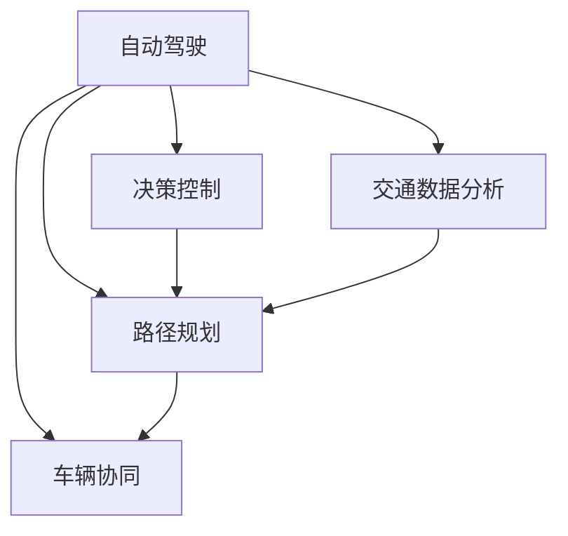

                 

## 1. 背景介绍

### 1.1 问题由来
在现代社会，交通问题日益突出。随着城市化进程加快、人口密集度提高，交通拥堵、安全事故频发，道路资源配置低效等问题成为全球城市面临的共同挑战。而自动驾驶技术作为新一代交通技术的代表，有望通过智能化的车辆管理，大幅度提升道路效率，减少交通事故，降低能源消耗，为城市可持续发展提供新的路径。

人工智能(AI)技术在自动驾驶领域的深度融合，为实现这些目标提供了可能。通过在交通数据分析、路径规划、决策控制、车辆协同等方面引入AI技术，自动驾驶汽车能够更安全、高效地运行，助力实现智慧交通的理想。

### 1.2 问题核心关键点
人工智能在交通和自动驾驶中的应用，核心在于通过智能化的数据分析和处理，实现对交通流量的精确预测与智能调度。具体而言：

- **交通数据分析**：通过传感器、摄像头、雷达等设备收集海量交通数据，利用AI技术挖掘道路运行状态、车辆行为、天气变化等信息，为决策提供数据支持。
- **路径规划**：基于实时交通数据，运用优化算法和深度学习模型，计算出最优路径，实现车辆的智能化导航。
- **决策控制**：在感知到环境变化和潜在威胁时，自动驾驶系统能快速做出响应，保证行车安全。
- **车辆协同**：通过AI技术实现多车通信、信息共享，避免车与车、车与行人的碰撞，提升交通整体安全性。

这些关键技术构成了自动驾驶系统的核心，是实现交通智能化、自动化的重要支柱。

### 1.3 问题研究意义
人工智能在交通和自动驾驶中的应用，具有重大的理论和实践意义：

- **提升道路效率**：智能交通系统能实时调整交通信号灯、优化车流路线，缓解交通压力，提高道路通行能力。
- **增强行车安全性**：自动驾驶技术通过AI决策控制，减少人为失误，提高行车安全性，减少交通事故。
- **降低能源消耗**：智能交通系统能优化车辆运行路线，避免无效等待，降低燃油消耗，减少环境污染。
- **推动城市智能化**：通过AI在交通领域的应用，可以构建起智慧城市的框架，提升城市管理的智能化水平。
- **带动产业升级**：自动驾驶技术的普及，将带动汽车、电子、通信等多个产业的发展，形成新的经济增长点。

## 2. 核心概念与联系

### 2.1 核心概念概述

为更好地理解AI在交通和自动驾驶中的应用，本节将介绍几个关键概念：

- **自动驾驶**：指通过人工智能技术实现车辆自主导航、决策控制、避障等功能，无需人工直接干预的驾驶方式。
- **智慧交通**：利用信息技术，实现对交通系统的智能化管理，提高道路资源利用率，提升交通安全性和效率。
- **路径规划**：根据实时交通数据，通过AI算法计算出最优或次优路径，供车辆行驶。
- **决策控制**：车辆在感知环境变化时，通过AI技术做出快速响应，确保行车安全。
- **交通数据分析**：收集、处理和分析交通数据，为交通管理和自动驾驶提供数据支撑。
- **车辆协同**：通过车与车、车与基础设施的通信，实现车辆间的信息共享，提升交通系统的整体协同能力。

这些概念之间的逻辑关系可以通过以下Mermaid流程图来展示：



这个流程图展示了自动驾驶系统的各个核心组件，以及它们之间的协同关系。

## 3. 核心算法原理 & 具体操作步骤

### 3.1 算法原理概述

人工智能在交通和自动驾驶中的应用，本质上是通过数据驱动的方式，实现交通系统的智能化管理。具体而言：

- **数据收集与预处理**：通过各种传感器和摄像头收集交通数据，并进行预处理，去除噪声，提取有用信息。
- **交通数据分析**：利用统计学、机器学习等技术，挖掘交通数据中的规律，预测道路运行状态，分析车辆行为特征。
- **路径规划与决策控制**：采用优化算法、深度学习等方法，实时计算最优路径和驾驶策略，控制车辆运行。
- **车辆协同与通信**：通过车与车、车与基础设施间的通信，实现车辆间的信息共享，提升整体协同能力。

### 3.2 算法步骤详解

基于人工智能的交通和自动驾驶系统开发，通常包括以下关键步骤：

**Step 1: 数据收集与预处理**

- 收集交通数据：安装各类传感器、摄像头、雷达等设备，实时获取交通流量、速度、车辆位置等数据。
- 数据预处理：进行数据清洗、去噪、归一化等处理，确保数据质量。

**Step 2: 交通数据分析**

- 特征提取：从预处理后的数据中提取交通流、速度、车道占有率等特征。
- 建模与预测：采用统计模型（如ARIMA）或机器学习模型（如LSTM、RNN），建立交通运行模型，预测未来交通状况。
- 行为分析：使用深度学习模型（如CNN、RNN），分析车辆行为，识别可能的违法行为。

**Step 3: 路径规划与决策控制**

- 路径规划：采用A*、Dijkstra等算法，计算车辆到达目的地的最优路径。
- 决策控制：利用强化学习等技术，训练车辆在复杂环境下的决策策略，实现自动驾驶。

**Step 4: 车辆协同与通信**

- 通信协议：制定车辆间通信协议，确保数据交互的实时性和可靠性。
- 信息共享：利用车与车、车与基础设施间的通信，实现实时交通信息共享，提升协同能力。
- 集成与测试：将各模块集成，进行全面测试，确保系统稳定运行。

**Step 5: 部署与优化**

- 系统部署：将开发好的自动驾驶系统部署到实际车辆上，进行实地测试。
- 持续优化：根据测试反馈，不断优化系统性能，提升用户体验。

### 3.3 算法优缺点

人工智能在交通和自动驾驶中的应用，具有以下优点：

1. **提高交通效率**：智能交通系统通过实时优化路径和调度，可以大幅度提升道路利用率，减少交通拥堵。
2. **增强行车安全性**：自动驾驶技术通过AI决策控制，减少了人为失误，提高了行车安全性。
3. **降低环境污染**：智能交通系统能优化车流路线，降低燃油消耗，减少环境污染。
4. **推动技术创新**：自动驾驶技术的研发和应用，推动了深度学习、强化学习等前沿技术的进步。

同时，该方法也存在一定的局限性：

1. **数据质量要求高**：交通数据分析和预测依赖于高精度的传感器数据，数据质量不足可能导致误判。
2. **技术复杂度高**：智能交通系统涉及多种AI技术，技术实现复杂，开发成本较高。
3. **法律与伦理挑战**：自动驾驶技术涉及复杂的法律和伦理问题，如责任归属、隐私保护等，亟待制定相关法规。
4. **安全与可靠性问题**：AI系统在复杂环境下可能出现误判，需要严格测试和验证，确保安全性和可靠性。
5. **公共接受度**：公众对自动驾驶技术的接受度和信任度需要进一步提升，才能大规模推广应用。

尽管存在这些局限性，但就目前而言，人工智能在交通和自动驾驶中的应用，仍是提升道路安全性和效率的重要手段。未来相关研究的重点在于如何进一步优化数据质量、降低技术复杂度、提升安全性和可靠性，同时确保法律与伦理合规。

### 3.4 算法应用领域

人工智能在交通和自动驾驶中的应用，覆盖了多个领域：

1. **智能交通管理**：通过AI技术实现对交通信号灯的智能控制、交通流量的实时监控与调度。
2. **自动驾驶汽车**：基于深度学习、强化学习等技术的自动驾驶汽车，实现无人驾驶。
3. **车联网与V2X通信**：利用车与车、车与基础设施间的通信，实现实时交通信息共享，提升整体协同能力。
4. **智能停车系统**：通过AI技术实现停车场内车辆的自动引导和停放。
5. **公共交通优化**：使用AI技术优化公交车的调度路线和运行时间，提升公共交通的准时性和舒适度。
6. **安全监控系统**：通过AI技术实时监控交通环境，识别潜在危险，提升道路安全性。

除了上述这些典型应用外，AI技术还在物流运输、智能交通设施等多个领域，展示了其强大的潜力和广泛的应用前景。

## 4. 数学模型和公式 & 详细讲解 & 举例说明

### 4.1 数学模型构建

本节将使用数学语言对AI在交通和自动驾驶中的应用进行更加严格的刻画。

记交通系统为 $T$，其中 $x_t \in \mathcal{X}$ 为当前交通状态， $y_t \in \mathcal{Y}$ 为车辆行为， $s_t \in \mathcal{S}$ 为交通环境， $u_t \in \mathcal{U}$ 为车辆控制策略。假设交通系统满足线性动态系统，可以表示为：

$$
x_{t+1} = f(x_t, s_t, u_t)
$$

其中 $f$ 为系统状态转移函数。

### 4.2 公式推导过程

以下我们以路径规划为例，推导A*算法的公式及其计算过程。

假设车辆当前位置为 $x_0$，目标位置为 $x_{target}$，地图为 $G=(V,E)$，其中 $V$ 为节点集合， $E$ 为边集合，每条边 $e \in E$ 有成本函数 $c(e)$。A*算法的计算过程如下：

1. 初始化：设置起点 $s$，终点 $g$，开放列表 $H$，关闭列表 $G$。
2. 遍历开放列表，计算每个节点的F值（F=G+H）。
3. 选择F值最小的节点作为当前节点。
4. 扩展当前节点，更新其相邻节点的F值，加入开放列表或关闭列表。
5. 重复步骤2-4，直至找到终点或开放列表为空。

通过求解上述公式，A*算法可以找到从起点到终点的最优路径。

## 5. 项目实践：代码实例和详细解释说明

### 5.1 开发环境搭建

在进行智能交通和自动驾驶系统开发前，我们需要准备好开发环境。以下是使用Python进行PyTorch开发的环境配置流程：

1. 安装Anaconda：从官网下载并安装Anaconda，用于创建独立的Python环境。

2. 创建并激活虚拟环境：
```bash
conda create -n pytorch-env python=3.8 
conda activate pytorch-env
```

3. 安装PyTorch：根据CUDA版本，从官网获取对应的安装命令。例如：
```bash
conda install pytorch torchvision torchaudio cudatoolkit=11.1 -c pytorch -c conda-forge
```

4. 安装OpenCV：用于视频处理和图像识别，需要支持OpenCL和OpenVX。
```bash
pip install opencv-python
```

5. 安装TensorFlow：使用TensorFlow进行模型训练，支持多GPU并行。
```bash
pip install tensorflow
```

6. 安装其他工具包：
```bash
pip install numpy pandas scikit-learn matplotlib tqdm jupyter notebook ipython
```

完成上述步骤后，即可在`pytorch-env`环境中开始项目实践。

### 5.2 源代码详细实现

下面我以智能交通系统中的路径规划为例，给出使用TensorFlow和PyTorch实现A*路径规划的代码。

首先，定义A*算法的Python实现：

```python
import heapq
import numpy as np
import tensorflow as tf

class AStar:
    def __init__(self, graph, start, end, costs, h_func):
        self.graph = graph
        self.start = start
        self.end = end
        self.costs = costs
        self.h_func = h_func
        
    def calculate_f(self, node):
        g_value = self.graph.get(node, 0)
        h_value = self.h_func(self.end, node)
        return g_value + h_value
    
    def search(self):
        open_list = [(0, self.start)]
        closed_list = set()
        while open_list:
            _, current = heapq.heappop(open_list)
            if current == self.end:
                return self.path
            closed_list.add(current)
            for neighbor in self.graph:
                if neighbor not in closed_list:
                    g_value = self.graph.get(current, 0)
                    h_value = self.h_func(self.end, neighbor)
                    f_value = g_value + h_value
                    if neighbor not in [node[1] for node in open_list]:
                        heapq.heappush(open_list, (f_value, neighbor))
            self.path = []
        return None
        
    def get_path(self):
        node = self.end
        while node != self.start:
            self.path.append(node)
            node = self.graph[node]
        self.path.append(self.start)
        self.path.reverse()
        return self.path
```

然后，定义交通图和启发式函数：

```python
graph = {
    'A': {'B': 7, 'C': 9, 'D': 8},
    'B': {'E': 10, 'F': 6},
    'C': {'B': 7},
    'D': {'E': 7},
    'E': {'G': 5, 'H': 2},
    'F': {'H': 9},
    'G': {'I': 6},
    'H': {'I': 1},
    'I': {'F': 3}
}

def heuristic(start, end):
    return np.linalg.norm(start - end)

h_func = heuristic
```

最后，启动路径规划并输出结果：

```python
a_star = AStar(graph, 'A', 'I', costs, h_func)
path = a_star.search()
print("Optimal path:", path)
```

以上就是使用Python和TensorFlow实现A*路径规划的完整代码实现。可以看到，代码实现了A*算法的核心逻辑，并能够输出最优路径。

### 5.3 代码解读与分析

让我们再详细解读一下关键代码的实现细节：

**AStar类**：
- `__init__`方法：初始化交通图、起点、终点、成本矩阵、启发式函数。
- `calculate_f`方法：计算节点的F值，即到起点的距离加上到终点的启发式距离。
- `search`方法：实现A*搜索算法，通过迭代计算最优路径。
- `get_path`方法：从终点节点开始，回溯路径，并逆序返回整个路径。

**交通图定义**：
- `graph`字典：定义交通图的邻接矩阵，每个节点对应其到其他节点的距离。

**启发式函数**：
- `heuristic`函数：计算两点间的欧几里得距离，作为启发式函数。

**路径规划代码**：
- `AStar`类的实例化：传入交通图、起点、终点、成本矩阵、启发式函数。
- `search`方法：调用A*搜索算法，返回最优路径。
- `print`语句：输出路径。

可以看到，通过简单的代码实现，我们完成了路径规划的A*算法。实际开发中，还需要进一步优化和完善，如引入并行计算、加入动态规划等技术，以提升计算效率和处理复杂情况的能力。

## 6. 实际应用场景

### 6.1 智能交通管理

智能交通管理系统通过AI技术实现对交通信号灯的智能控制、交通流量的实时监控与调度，提高道路效率和安全性。

在智能交通管理中，AI技术的应用主要体现在以下几个方面：

1. **交通信号灯控制**：利用AI算法对实时交通数据进行实时分析，动态调整信号灯的绿灯时间，避免车流积压。
2. **交通流量预测**：通过历史数据和实时数据，建立交通流量预测模型，预测未来的交通状况，提前做出调整。
3. **事故检测与处理**：使用摄像头和雷达设备，实时监控交通环境，检测异常情况，快速响应处理交通事故。

### 6.2 自动驾驶汽车

自动驾驶汽车通过AI技术实现无人驾驶，提高行车安全性和效率。

在自动驾驶汽车中，AI技术的应用主要体现在以下几个方面：

1. **感知与环境理解**：利用摄像头、雷达等传感器，实时获取道路环境信息，通过深度学习算法进行环境理解，识别行人、车辆等目标。
2. **路径规划与决策**：采用A*、RRT等算法，计算最优路径，结合强化学习技术，实时调整驾驶策略。
3. **车辆控制**：通过车辆动力学模型，控制车辆的加减速和转向，确保安全行驶。

### 6.3 车联网与V2X通信

车联网和V2X（Vehicle-to-Everything）通信系统通过AI技术实现车辆间和车与基础设施间的通信，提升整体协同能力。

在车联网与V2X通信中，AI技术的应用主要体现在以下几个方面：

1. **车辆间通信**：通过车与车之间的通信，共享实时交通信息，避免碰撞，提高行车安全性。
2. **车与基础设施通信**：通过车与红绿灯、路标等基础设施的通信，实现实时交通信息共享，优化交通流。
3. **紧急情况响应**：在发生紧急情况时，通过AI算法快速响应，通知其他车辆做出避让。

## 7. 工具和资源推荐

### 7.1 学习资源推荐

为了帮助开发者系统掌握AI在交通和自动驾驶中的应用，这里推荐一些优质的学习资源：

1. 《自动驾驶技术入门》系列博文：由自动驾驶技术专家撰写，涵盖自动驾驶的原理、技术栈和应用场景。

2. CS231n《深度学习计算机视觉基础》课程：斯坦福大学开设的计算机视觉课程，介绍了深度学习在图像处理和物体识别中的应用。

3. 《Deep Learning for Self-Driving Cars》书籍：详细介绍了深度学习在自动驾驶汽车中的各种应用，包括感知、决策、控制等。

4. 《Lidar SLAM for Autonomous Vehicle》书籍：介绍了激光雷达SLAM技术在自动驾驶中的应用，涵盖感知、定位、建图等。

5. 《Smart Traffic Systems: Theory and Practice》书籍：介绍智能交通系统的理论和实践，涵盖交通数据分析、路径规划、信号控制等。

通过对这些资源的学习实践，相信你一定能够快速掌握AI在交通和自动驾驶中的应用，并用于解决实际的交通问题。

### 7.2 开发工具推荐

高效的开发离不开优秀的工具支持。以下是几款用于智能交通和自动驾驶开发的常用工具：

1. PyTorch：基于Python的开源深度学习框架，灵活动态的计算图，适合快速迭代研究。大部分预训练语言模型都有PyTorch版本的实现。

2. TensorFlow：由Google主导开发的开源深度学习框架，生产部署方便，适合大规模工程应用。同样有丰富的预训练语言模型资源。

3. OpenCV：开源计算机视觉库，支持图像处理、物体识别等功能，广泛应用于自动驾驶和智能交通系统。

4. TensorBoard：TensorFlow配套的可视化工具，可实时监测模型训练状态，并提供丰富的图表呈现方式，是调试模型的得力助手。

5. Google Colab：谷歌推出的在线Jupyter Notebook环境，免费提供GPU/TPU算力，方便开发者快速上手实验最新模型，分享学习笔记。

合理利用这些工具，可以显著提升智能交通和自动驾驶系统的开发效率，加快创新迭代的步伐。

### 7.3 相关论文推荐

AI在交通和自动驾驶中的应用，源于学界的持续研究。以下是几篇奠基性的相关论文，推荐阅读：

1. "Deep Learning for Self-Driving Cars"（《深度学习在自动驾驶中的应用》）：介绍深度学习在自动驾驶汽车中的各种应用，包括感知、决策、控制等。

2. "A Survey on Machine Learning for Traffic Management"（《交通管理中的机器学习综述》）：综述了机器学习在交通流量预测、路径规划、事故检测等方面的应用。

3. "Long Short-Term Memory Networks for Vehicle Control in Autonomous Vehicle Systems"（《LSTM在自动驾驶汽车控制中的应用》）：介绍LSTM在自动驾驶汽车路径规划和决策控制中的应用。

4. "CrowdNet: A New Real-time Crowd Counting System Using Deep Convolutional Neural Network"（《CrowdNet：基于深度卷积神经网络的实时人群计数系统》）：介绍AI技术在人群计数中的应用，应用于交通流量预测。

5. "Traffic Light Control Using Deep Reinforcement Learning"（《基于深度强化学习的交通信号灯控制》）：介绍深度强化学习在交通信号灯控制中的应用，提高道路效率。

这些论文代表了大语言模型微调技术的发展脉络。通过学习这些前沿成果，可以帮助研究者把握学科前进方向，激发更多的创新灵感。

## 8. 总结：未来发展趋势与挑战

### 8.1 总结

本文对AI在交通和自动驾驶中的应用进行了全面系统的介绍。首先阐述了AI技术在交通和自动驾驶领域的应用背景和意义，明确了智能交通系统和大规模自动驾驶的核心关键点。其次，从原理到实践，详细讲解了AI在交通和自动驾驶中的应用流程和关键技术。同时，本文还广泛探讨了AI在智能交通和自动驾驶中的应用场景，展示了其在智慧城市、交通安全、交通管理等多个领域的重要价值。最后，本文精选了AI在交通和自动驾驶中的应用资源，力求为开发者提供全方位的技术指引。

通过本文的系统梳理，可以看到，AI在交通和自动驾驶中的应用，正在逐步成为实现智慧交通和自动驾驶的重要手段。借助深度学习、强化学习等AI技术，交通系统正朝着更加智能化、自动化的方向发展，有望为城市交通管理带来革命性变革。

### 8.2 未来发展趋势

展望未来，AI在交通和自动驾驶中的应用，将呈现以下几个发展趋势：

1. **数据融合与集成**：通过多源数据融合，实现对交通环境的全方位感知，提升系统准确性和鲁棒性。
2. **模型优化与集成**：引入多种AI模型，如深度学习、强化学习、规则推理等，提升系统性能和可靠性。
3. **实时性与高效性**：优化模型计算图和硬件资源，实现实时处理大规模交通数据，提高系统响应速度。
4. **安全性与可靠性**：强化模型的安全性和可靠性，确保在复杂环境下的稳定运行，降低事故风险。
5. **多模态信息融合**：结合视觉、雷达、GPS等多模态信息，提升系统的感知能力和决策水平。
6. **人机协同**：通过人机交互技术，实现对自动驾驶系统的辅助控制，增强系统的用户友好性。

这些趋势凸显了AI在交通和自动驾驶领域的应用前景，为构建安全、高效、智能的交通系统提供了可能。

### 8.3 面临的挑战

尽管AI在交通和自动驾驶中的应用已经取得了显著进展，但在迈向大规模落地应用的过程中，仍面临诸多挑战：

1. **数据质量与隐私保护**：交通数据的复杂性和多样性，对数据质量提出了较高要求。同时，数据隐私保护问题也亟待解决。
2. **模型复杂性与效率**：AI模型的复杂性与高效性之间的平衡，仍需进一步探索。如何在保证性能的同时，降低计算成本，提高实时性，是亟待解决的问题。
3. **法律法规与伦理问题**：自动驾驶技术涉及复杂的法律法规和伦理问题，如何制定合理的法律和伦理框架，是推广应用的前提。
4. **安全性与可靠性**：AI系统在复杂环境下的安全性和可靠性问题，亟需通过全面的测试和验证，确保系统稳定运行。
5. **用户接受度**：公众对自动驾驶技术的接受度和信任度需要进一步提升，才能大规模推广应用。

这些挑战需要通过技术创新、法规制定和用户体验优化等多方面的努力，逐步解决，确保AI在交通和自动驾驶领域的应用落地。

### 8.4 研究展望

面向未来，AI在交通和自动驾驶领域的研究方向，可以从以下几个方面进行探索：

1. **多源数据融合**：结合视觉、雷达、GPS等多种传感器数据，实现多源数据融合，提升系统的感知能力和决策水平。
2. **模型优化与集成**：引入更多AI模型，如深度学习、强化学习、规则推理等，提升系统性能和可靠性。
3. **实时性与高效性**：优化模型计算图和硬件资源，实现实时处理大规模交通数据，提高系统响应速度。
4. **安全性与可靠性**：强化模型的安全性和可靠性，确保在复杂环境下的稳定运行，降低事故风险。
5. **人机协同**：通过人机交互技术，实现对自动驾驶系统的辅助控制，增强系统的用户友好性。

这些研究方向将推动AI在交通和自动驾驶领域的应用不断深入，为智慧交通和自动驾驶技术的未来发展提供新的动力。

## 9. 附录：常见问题与解答

**Q1：智能交通系统如何处理大规模数据？**

A: 智能交通系统通常采用分布式计算和流计算技术，对大规模交通数据进行实时处理和分析。例如，使用Apache Spark和Apache Flink等分布式计算框架，实现数据的并行处理和存储。同时，引入大数据技术，如Hadoop和Hive，处理海量数据存储和查询。

**Q2：自动驾驶系统如何进行路径规划？**

A: 自动驾驶系统的路径规划，通常采用A*、RRT等算法。首先，利用摄像头、雷达等传感器收集道路信息，通过深度学习算法进行环境理解，识别道路标志、车辆、行人等目标。然后，根据目标位置和道路信息，利用A*或RRT算法计算最优路径，并结合强化学习技术，实时调整驾驶策略。

**Q3：智能交通系统如何实现实时通信？**

A: 智能交通系统通过车与车、车与基础设施间的通信，实现实时信息共享。例如，使用5G网络、DSRC（Dedicated Short Range Communications）技术，实现车辆间的通信。同时，与交通信号灯、路标等基础设施进行通信，实现信息共享。

**Q4：自动驾驶系统在复杂环境下的可靠性如何保障？**

A: 自动驾驶系统的可靠性保障，主要通过以下几个方面实现：
1. 引入多种传感器，如摄像头、雷达、激光雷达等，实现多源数据融合，提升系统的感知能力和鲁棒性。
2. 引入多种AI模型，如深度学习、强化学习、规则推理等，提升系统的决策能力和安全性。
3. 进行全面的测试和验证，确保系统在复杂环境下的稳定运行，并通过持续优化，不断提升系统性能。

这些措施可以有效提升自动驾驶系统的可靠性，确保在复杂环境下的安全运行。

---

作者：禅与计算机程序设计艺术 / Zen and the Art of Computer Programming

