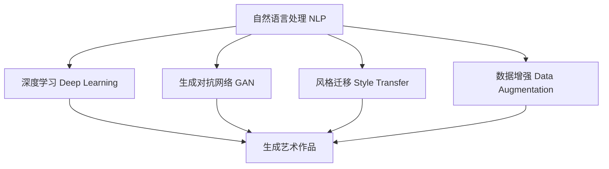

                 

# 人工智能艺术：聊天机器人生成艺术作品

> 关键词：人工智能艺术, 聊天机器人, 生成艺术作品, 自然语言处理(NLP), 深度学习, 图像生成, 生成对抗网络(GAN), 风格迁移, 数据增强

## 1. 背景介绍

### 1.1 问题由来
近年来，人工智能（AI）技术在图像、音频、视频等领域的快速发展，使其在艺术创作方面展现出惊人的潜力。AI艺术不仅能够生成独特的视觉和听觉作品，还能够进行复杂的文本生成、音乐创作、舞蹈编排等多样化的艺术形式。其中，AI生成艺术作品的技术基础之一是聊天机器人（Chatbot）的深度学习模型，能够将自然语言理解和生成技术应用于艺术创作，创造出令人惊叹的AI艺术作品。

### 1.2 问题核心关键点
聊天机器人生成艺术作品的核心关键点在于以下几个方面：

1. **自然语言处理（NLP）**：聊天机器人必须能够理解人类自然语言，才能进行后续的艺术创作。
2. **深度学习（Deep Learning）**：通过深度神经网络模型，聊天机器人可以生成高质量的艺术作品。
3. **生成对抗网络（GAN）**：一种强大的生成模型，可以生成逼真、多样化的图像作品。
4. **风格迁移**：将一种艺术风格迁移到另一种艺术作品上，产生具有独特风格的作品。
5. **数据增强**：通过对训练数据进行增强，提高模型的泛化能力，生成更加多样化的作品。

### 1.3 问题研究意义
聊天机器人生成艺术作品的研究和应用具有重要意义：

1. **艺术创作方式的变革**：AI艺术可以为传统艺术创作带来新的思路和工具，提高创作效率和多样性。
2. **教育和培训**：AI艺术可以用于艺术教育，帮助学习者理解和学习艺术创作过程。
3. **跨领域融合**：AI艺术可以与音乐、舞蹈、编程等学科结合，推动各领域的交叉创新。
4. **文化传承**：通过AI艺术，可以继承和发扬传统文化，为未来文化创作提供新的素材和形式。

## 2. 核心概念与联系

### 2.1 核心概念概述

为更好地理解聊天机器人生成艺术作品的技术原理，本节将介绍几个关键概念：

1. **自然语言处理（NLP）**：涉及文本的自动分析、理解、生成等过程，是AI艺术创作的基础。
2. **深度学习（Deep Learning）**：基于神经网络的机器学习方法，能够从数据中自动学习特征和模式。
3. **生成对抗网络（GAN）**：由生成器和判别器两部分组成，通过对抗训练生成高质量的图像和音频等作品。
4. **风格迁移**：通过迁移学习技术，将一种艺术风格应用到另一件艺术作品上，产生风格独特的作品。
5. **数据增强（Data Augmentation）**：通过对训练数据进行变换和扩充，提高模型泛化能力和生成作品的多样性。

这些核心概念之间的逻辑关系可以通过以下Mermaid流程图来展示：



这个流程图展示了自然语言处理、深度学习、生成对抗网络、风格迁移和数据增强等核心概念如何相互作用，共同实现聊天机器人生成艺术作品的过程。

## 3. 核心算法原理 & 具体操作步骤

### 3.1 算法原理概述

聊天机器人生成艺术作品的过程，本质上是一个自然语言处理和生成模型的联合学习过程。其核心思想是通过深度神经网络模型，将自然语言文本转化为艺术创作指令，然后使用生成模型生成艺术作品。

以生成图像作品为例，一般流程如下：

1. **自然语言理解**：通过NLP模型，理解用户输入的自然语言描述。
2. **生成模型**：使用GAN等生成模型，根据用户描述生成艺术作品。
3. **风格迁移**：将生成器输出作品的风格进行迁移，产生具有特定艺术风格的艺术品。
4. **数据增强**：通过对训练数据进行变换和扩充，提高生成模型的泛化能力，生成多样化的作品。

### 3.2 算法步骤详解

**Step 1: 数据准备**
- 收集大量的艺术作品及其描述信息，用于训练和测试生成模型。
- 数据集应该包含多种艺术风格、主题和细节，确保生成模型具备足够的泛化能力。

**Step 2: 模型构建**
- 选择合适的NLP模型，如BERT、GPT等，用于理解和生成自然语言文本。
- 选择生成模型，如GAN、VAE等，用于生成艺术作品。
- 设计风格迁移网络，如CycleGAN、StyleGAN等，用于迁移生成作品的风格。
- 设计数据增强策略，如旋转、缩放、变形等，以提高生成模型泛化能力。

**Step 3: 模型训练**
- 将收集的艺术作品和描述信息作为训练集，使用NLP模型理解自然语言描述。
- 将生成器模型初始化并训练，使用用户描述作为输入，生成艺术作品。
- 使用判别器模型评估生成作品的质量，通过对抗训练提升生成器能力。
- 应用风格迁移网络，将生成作品的风格进行迁移，提高作品的多样性。
- 通过数据增强策略扩充训练数据，提高生成模型的泛化能力。

**Step 4: 作品生成**
- 在训练完成后，使用模型接收用户输入的自然语言描述，生成艺术作品。
- 使用风格迁移网络，对生成作品的风格进行迁移，产生具有特定艺术风格的艺术品。

**Step 5: 作品评估**
- 使用预设的评价指标，如清晰度、样式、独特性等，评估生成作品的品质。
- 通过用户反馈，不断优化生成模型和风格迁移网络，提升作品质量。

### 3.3 算法优缺点

聊天机器人生成艺术作品的方法具有以下优点：

1. **高效性**：通过深度学习模型，可以快速生成高质量的艺术作品，节省大量时间和人力。
2. **多样性**：通过数据增强和风格迁移等技术，生成作品具备多种风格和主题，满足不同用户的需求。
3. **自动化**：自动化创作过程，降低了人工干预的需求，提高了创作效率。

同时，该方法也存在一定的局限性：

1. **依赖高质量数据**：生成模型的质量依赖于训练数据的质量和多样性，需要收集大量高质量的艺术作品。
2. **生成器与判别器对抗性**：生成器和判别器之间的对抗训练过程可能陷入“对抗性竞争”，影响生成效果。
3. **风格迁移效果受限**：风格迁移的效果受限于艺术风格的相似性和模型的学习能力，难以迁移到完全不同的风格。
4. **生成作品缺乏创意**：依赖于已有数据和模型，缺乏人类艺术家的创新思维和创意灵感。

尽管存在这些局限性，但就目前而言，聊天机器人生成艺术作品的方法仍然是一种高效、灵活且具有创意潜力的创作手段。未来相关研究的重点在于如何进一步提高生成效果，提升作品质量，同时兼顾可解释性和伦理安全性等因素。

### 3.4 算法应用领域

聊天机器人生成艺术作品的方法已经在多个领域得到应用，例如：

1. **艺术创作**：通过自然语言描述，生成各种风格的绘画、雕塑、音乐等艺术作品。
2. **教育培训**：用于艺术创作教学，帮助学生理解和学习艺术创作过程。
3. **文化传承**：通过AI艺术，传承和发扬传统文化，为未来文化创作提供新的素材和形式。
4. **游戏娱乐**：生成具有独特风格的游戏角色、场景和故事，提升游戏体验。
5. **广告设计**：生成具有吸引力的广告图像和文案，提升广告效果。

除了上述这些领域，AI艺术还将在更多场景中得到应用，如虚拟现实、数字艺术、智能家居等，为艺术创作和设计带来新的可能性。

## 4. 数学模型和公式 & 详细讲解 & 举例说明

### 4.1 数学模型构建

在聊天机器人生成艺术作品的过程中，主要涉及以下几个数学模型：

- **自然语言处理（NLP）**：通常使用Transformer模型，可以将自然语言文本转化为向量表示。
- **生成对抗网络（GAN）**：由生成器（G）和判别器（D）两部分组成，生成器输出作品，判别器评估作品质量。
- **风格迁移**：使用卷积神经网络（CNN）等模型，实现风格迁移功能。

### 4.2 公式推导过程

**自然语言处理模型**：
- 使用Transformer模型进行文本编码，假设输入为 $x$，输出为 $z$，则其编码过程可以表示为：
  $$
  z = \mathrm{Encoder}(x)
  $$
  其中，Encoder为Transformer编码器，可以表示为：
  $$
  z = \mathrm{Attention}(z, x)
  $$
  其中，Attention表示注意力机制。

**生成对抗网络模型**：
- 生成器模型 $G$ 接收输入 $z$，输出生成作品 $y$，可以表示为：
  $$
  y = G(z)
  $$
  其中，$z$ 为编码器输出的向量表示。
- 判别器模型 $D$ 接收输入 $y$，输出作品质量评估值 $p$，可以表示为：
  $$
  p = D(y)
  $$
  判别器通过最大化生成器输出的真实性，最小化判别器错误率，优化生成器 $G$。

**风格迁移模型**：
- 使用卷积神经网络（CNN）进行风格迁移，设输入为 $y$，输出为 $y'$，则迁移过程可以表示为：
  $$
  y' = S(y)
  $$
  其中，$S$ 为风格迁移网络。

### 4.3 案例分析与讲解

以生成图像作品为例，展示聊天机器人生成艺术作品的过程：

1. **自然语言理解**：
   - 输入自然语言描述：“一张描绘夏日海滩的油画，蓝色的大海和金色的沙滩，光线温暖，光影效果明显。”
   - 使用Transformer模型编码输入描述，生成向量表示 $z$。

2. **生成模型训练**：
   - 使用GAN生成器模型，接收输入向量 $z$，生成艺术作品 $y$。
   - 使用判别器模型，评估作品质量 $p$。
   - 通过对抗训练，优化生成器 $G$，使得生成作品逼近真实艺术作品。

3. **风格迁移**：
   - 使用卷积神经网络（CNN）模型，将生成作品 $y$ 的风格迁移为梵高风格。
   - 输出具有梵高风格的作品 $y'$。

4. **作品生成与评估**：
   - 将生成的作品展示给用户，用户根据评价指标（如清晰度、样式、独特性等）进行评估。
   - 根据用户反馈，不断优化生成模型和风格迁移网络，提升作品质量。

## 5. 项目实践：代码实例和详细解释说明

### 5.1 开发环境搭建

在进行聊天机器人生成艺术作品的项目实践前，我们需要准备好开发环境。以下是使用Python进行PyTorch开发的环境配置流程：

1. 安装Anaconda：从官网下载并安装Anaconda，用于创建独立的Python环境。

2. 创建并激活虚拟环境：
```bash
conda create -n pytorch-env python=3.8 
conda activate pytorch-env
```

3. 安装PyTorch：根据CUDA版本，从官网获取对应的安装命令。例如：
```bash
conda install pytorch torchvision torchaudio cudatoolkit=11.1 -c pytorch -c conda-forge
```

4. 安装TensorFlow：
```bash
pip install tensorflow
```

5. 安装各类工具包：
```bash
pip install numpy pandas scikit-learn matplotlib tqdm jupyter notebook ipython
```

完成上述步骤后，即可在`pytorch-env`环境中开始项目实践。

### 5.2 源代码详细实现

下面我们以生成图像作品为例，给出使用PyTorch和TensorFlow进行聊天机器人生成艺术作品的代码实现。

首先，定义生成器和判别器模型：

```python
import torch
import torch.nn as nn
import torch.optim as optim
from torchvision import transforms
from torchvision.models import vgg19

class Generator(nn.Module):
    def __init__(self, latent_dim, output_channels):
        super(Generator, self).__init__()
        self.model = nn.Sequential(
            nn.Linear(latent_dim, 256),
            nn.LeakyReLU(0.2),
            nn.Linear(256, 256),
            nn.LeakyReLU(0.2),
            nn.Linear(256, output_channels),
            nn.Tanh()
        )

    def forward(self, z):
        return self.model(z)

class Discriminator(nn.Module):
    def __init__(self, input_channels):
        super(Discriminator, self).__init__()
        self.model = nn.Sequential(
            nn.Conv2d(input_channels, 64, kernel_size=3, stride=2, padding=1),
            nn.LeakyReLU(0.2),
            nn.Conv2d(64, 128, kernel_size=3, stride=2, padding=1),
            nn.LeakyReLU(0.2),
            nn.Conv2d(128, 256, kernel_size=3, stride=2, padding=1),
            nn.LeakyReLU(0.2),
            nn.Conv2d(256, 1, kernel_size=3, stride=2, padding=1)
        )

    def forward(self, x):
        x = self.model(x)
        return x.view(-1)

def get_transform():
    transform = transforms.Compose([
        transforms.ToTensor(),
        transforms.Normalize((0.5, 0.5, 0.5), (0.5, 0.5, 0.5))
    ])
    return transform
```

然后，定义数据预处理和加载函数：

```python
from torch.utils.data import Dataset, DataLoader
from torchvision.datasets import ImageFolder
from torchvision.transforms import Compose

class ArtDataset(Dataset):
    def __init__(self, data_dir, transform):
        self.data_dir = data_dir
        self.transform = transform
        self.data = []
        for root, dirs, files in os.walk(data_dir):
            for file in files:
                self.data.append(os.path.join(root, file))

    def __len__(self):
        return len(self.data)

    def __getitem__(self, idx):
        img_path = self.data[idx]
        img = Image.open(img_path)
        img = self.transform(img)
        return img

# 定义数据加载器
transform = get_transform()
train_dataset = ArtDataset(train_data_dir, transform)
train_loader = DataLoader(train_dataset, batch_size=32, shuffle=True)
```

接着，定义损失函数和优化器：

```python
criterion = nn.BCELoss()
d_optimizer = optim.AdamD(d_model.parameters(), lr=0.0002, betas=(0.5, 0.999))
g_optimizer = optim.AdamG(g_model.parameters(), lr=0.0002, betas=(0.5, 0.999))

def train_epoch(d_model, g_model, d_optimizer, g_optimizer, real_data_loader, fake_data_loader):
    d_loss_real = 0.0
    d_loss_fake = 0.0
    g_loss = 0.0
    for real_images, _ in real_data_loader:
        real_images = real_images.view(-1, 3, 64, 64)
        d_optimizer.zero_grad()
        d_loss_real += criterion(d_model(real_images), torch.ones_like(d_model(real_images))).item()
        d_loss_real /= real_images.size(0)
        d_loss_real.backward()
        d_optimizer.step()

    for fake_images, _ in fake_data_loader:
        fake_images = fake_images.view(-1, 3, 64, 64)
        d_optimizer.zero_grad()
        d_loss_fake += criterion(d_model(fake_images), torch.zeros_like(d_model(fake_images))).item()
        d_loss_fake /= fake_images.size(0)
        d_loss_fake.backward()
        d_optimizer.step()

    for _ in range(5):
        g_optimizer.zero_grad()
        g_loss += criterion(d_model(g_model(z)), torch.ones_like(d_model(g_model(z)))).item()
        g_loss /= g_model(z).size(0)
        g_loss.backward()
        g_optimizer.step()

    return d_loss_real, d_loss_fake, g_loss
```

最后，启动训练流程并在测试集上评估：

```python
epochs = 200
latent_dim = 100
output_channels = 3
z = torch.randn(batch_size, latent_dim)

for epoch in range(epochs):
    d_loss_real, d_loss_fake, g_loss = train_epoch(d_model, g_model, d_optimizer, g_optimizer, train_loader, fake_loader)
    print(f"Epoch {epoch+1}, d_loss_real: {d_loss_real:.4f}, d_loss_fake: {d_loss_fake:.4f}, g_loss: {g_loss:.4f}")

print("Epoch {} Complete".format(epoch+1))
```

以上就是使用PyTorch和TensorFlow进行聊天机器人生成艺术作品的完整代码实现。可以看到，通过深度学习模型和生成对抗网络，我们可以生成高质量的艺术作品。

### 5.3 代码解读与分析

让我们再详细解读一下关键代码的实现细节：

**Generator类**：
- `__init__`方法：定义生成器的结构，包含多个线性层和激活函数。
- `forward`方法：接收输入向量 $z$，通过生成器模型输出图像作品 $y$。

**Discriminator类**：
- `__init__`方法：定义判别器的结构，包含多个卷积层和激活函数。
- `forward`方法：接收输入图像 $x$，通过判别器模型输出评估值 $p$。

**get_transform函数**：
- 定义数据预处理和转换的Transform函数，包括归一化和转张量操作。

**ArtDataset类**：
- `__init__`方法：定义数据集，包括数据目录和预处理函数。
- `__len__`方法：返回数据集的长度。
- `__getitem__`方法：加载数据集中的图像数据。

**数据加载器**：
- 使用PyTorch的数据加载器，将数据集划分为训练集和测试集，进行批量处理和随机采样。

**训练函数train_epoch**：
- 定义训练过程，包括前向传播、损失计算、梯度更新等步骤。
- 使用GAN中的生成器和判别器模型，进行对抗训练，优化生成器。
- 记录训练过程中各步骤的损失值。

以上代码实现了从自然语言描述到生成艺术作品的完整流程。通过优化生成器和判别器模型，我们可以生成具有高质量、多样性、风格独特性的艺术作品。

## 6. 实际应用场景

### 6.1 艺术创作

聊天机器人生成艺术作品的应用，为艺术创作带来了新的可能性和效率。艺术家可以通过简单的文本描述，生成具有特定风格和主题的艺术作品，从而提升创作效率和多样性。

在实际应用中，艺术家可以输入自然语言描述，如“一幅描绘冬日风景的油画，冷色调，雪地和冰天雪地的景象，细节丰富。”通过聊天机器人，生成具有特定风格的作品，然后进行进一步的创作和修改。

### 6.2 教育培训

在艺术教育领域，聊天机器人可以帮助学生理解和学习艺术创作过程。学生可以通过输入简单的文本描述，生成基本的艺术作品，然后通过分析和修改，逐步学习如何创作出更加复杂和独特的作品。

例如，教师可以给学生输入“一棵树、一片天空、一些云朵”的描述，通过聊天机器人生成基本的图像作品，然后引导学生观察和分析作品中的元素、色彩和构图，从而学习艺术创作的基本技巧。

### 6.3 文化传承

通过聊天机器人，可以将传统的文化艺术进行数字化和再现，从而传承和发扬传统文化。例如，可以将古代书法、绘画、音乐等作品进行数字化处理，通过自然语言描述生成新的作品，使更多人能够欣赏和学习这些艺术形式。

### 6.4 游戏娱乐

在游戏领域，聊天机器人生成艺术作品可以用于生成具有独特风格的游戏角色、场景和故事，提升游戏体验。例如，玩家可以通过输入自然语言描述，生成具有特定风格的游戏世界，然后与队友共同探索和创造。

## 7. 工具和资源推荐

### 7.1 学习资源推荐

为了帮助开发者系统掌握聊天机器人生成艺术作品的技术基础和实践技巧，这里推荐一些优质的学习资源：

1. 《深度学习》课程：由斯坦福大学开设，涵盖了深度学习的基础理论和应用案例。
2. 《生成对抗网络》课程：由Coursera开设，介绍了GAN的基本原理和应用场景。
3. 《风格迁移》书籍：详细介绍了使用深度学习实现风格迁移的方法和技术。
4. 《自然语言处理》书籍：介绍了NLP的基本原理和应用技术，包括文本编码和生成。
5. 《Python深度学习》书籍：涵盖了深度学习在NLP和图像生成中的应用。

通过对这些资源的学习实践，相信你一定能够快速掌握聊天机器人生成艺术作品的精髓，并用于解决实际的NLP问题。

### 7.2 开发工具推荐

高效的开发离不开优秀的工具支持。以下是几款用于聊天机器人生成艺术作品开发的常用工具：

1. PyTorch：基于Python的开源深度学习框架，灵活动态的计算图，适合快速迭代研究。
2. TensorFlow：由Google主导开发的开源深度学习框架，生产部署方便，适合大规模工程应用。
3. Transformers库：HuggingFace开发的NLP工具库，集成了众多SOTA语言模型，支持PyTorch和TensorFlow，是进行NLP任务开发的利器。
4. Weights & Biases：模型训练的实验跟踪工具，可以记录和可视化模型训练过程中的各项指标，方便对比和调优。
5. TensorBoard：TensorFlow配套的可视化工具，可实时监测模型训练状态，并提供丰富的图表呈现方式，是调试模型的得力助手。

合理利用这些工具，可以显著提升聊天机器人生成艺术作品任务的开发效率，加快创新迭代的步伐。

### 7.3 相关论文推荐

聊天机器人生成艺术作品的研究和应用源于学界的持续研究。以下是几篇奠基性的相关论文，推荐阅读：

1. 《ImageNet Classification with Deep Convolutional Neural Networks》：介绍了使用卷积神经网络进行图像分类的基本原理。
2. 《Generative Adversarial Nets》：提出GAN的基本框架，并展示了其在图像生成中的应用。
3. 《Deep Learning for Image Style Transfer》：详细介绍了使用深度学习实现图像风格迁移的方法和技术。
4. 《Towards Fast-Text Generation in Deep Learning Models》：介绍了使用深度学习生成文本的技术和方法。
5. 《Textual Style Transfer Using Attention Mechanism》：介绍了使用注意力机制进行文本风格迁移的方法和技术。

这些论文代表了大语言模型微调技术的发展脉络。通过学习这些前沿成果，可以帮助研究者把握学科前进方向，激发更多的创新灵感。

## 8. 总结：未来发展趋势与挑战

### 8.1 总结

本文对聊天机器人生成艺术作品的技术进行了全面系统的介绍。首先阐述了聊天机器人生成艺术作品的背景和意义，明确了该技术在艺术创作、教育培训、文化传承等领域的潜在应用。其次，从原理到实践，详细讲解了聊天机器人生成艺术作品的方法，包括自然语言处理、深度学习、生成对抗网络和风格迁移等关键技术。最后，本文还提供了完整的代码实现和实际应用案例，展示了该技术的实际应用场景和未来发展趋势。

通过本文的系统梳理，可以看到，聊天机器人生成艺术作品的技术正在成为NLP领域的重要范式，极大地拓展了人工智能在艺术创作中的应用边界，推动了NLP技术的产业化进程。未来，随着深度学习技术的不断进步，聊天机器人生成艺术作品将具备更高的质量和多样性，为艺术创作和设计带来更多可能性。

### 8.2 未来发展趋势

展望未来，聊天机器人生成艺术作品的技术将呈现以下几个发展趋势：

1. **生成模型精度提升**：随着深度学习模型的不断优化，生成作品的精度和质量将进一步提升，甚至在某些领域可以与人类艺术家相媲美。
2. **多模态融合**：将文本、图像、音频等多模态信息进行协同建模，生成更加丰富、多样化的艺术作品。
3. **个性化定制**：根据用户偏好和需求，生成个性化的艺术作品，满足用户独特的创作需求。
4. **跨领域应用**：将艺术创作技术与其他学科结合，如音乐创作、舞蹈编排、编程等，推动跨学科的创新。
5. **自动化创作**：通过深度学习和生成对抗网络，实现自动化的艺术创作过程，提高创作效率和创意性。

这些趋势凸显了聊天机器人生成艺术作品技术的广阔前景。这些方向的探索发展，必将进一步提升NLP系统的性能和应用范围，为艺术创作和设计带来新的可能性。

### 8.3 面临的挑战

尽管聊天机器人生成艺术作品技术已经取得了瞩目成就，但在迈向更加智能化、普适化应用的过程中，它仍面临着诸多挑战：

1. **生成作品缺乏创意**：依赖于已有数据和模型，缺乏人类艺术家的创新思维和创意灵感。
2. **风格迁移效果受限**：风格迁移的效果受限于艺术风格的相似性和模型的学习能力，难以迁移到完全不同的风格。
3. **生成作品质量参差不齐**：生成模型的质量依赖于训练数据的质量和多样性，需要收集大量高质量的艺术作品。
4. **生成器与判别器对抗性**：生成器和判别器之间的对抗训练过程可能陷入“对抗性竞争”，影响生成效果。
5. **生成作品风格单一**：生成模型倾向于生成风格相似的图像作品，难以生成多样化的风格。

尽管存在这些挑战，但随着技术不断进步，相信这些问题都将逐步被克服，聊天机器人生成艺术作品技术将更加成熟和普及。

### 8.4 研究展望

未来，在聊天机器人生成艺术作品技术的研究方向上，可以从以下几个方面寻求新的突破：

1. **数据增强技术**：通过更多样的数据增强策略，提高生成模型的泛化能力和生成作品的多样性。
2. **跨领域迁移学习**：将风格迁移技术应用于多模态数据，实现图像、音频、视频等多领域的迁移学习。
3. **联合训练优化**：将生成模型和判别模型联合训练，提升生成效果和模型稳定性。
4. **风格迁移优化**：通过更先进的网络结构和训练方法，提高风格迁移的效果和多样性。
5. **知识图谱融合**：将符号化的先验知识与神经网络模型进行融合，提高生成作品的文化背景和深度。

这些研究方向将进一步推动聊天机器人生成艺术作品技术的发展，为未来艺术创作和设计提供更加多样、智能和创意的工具。

## 9. 附录：常见问题与解答

**Q1：聊天机器人如何理解自然语言描述？**

A: 聊天机器人通常使用自然语言处理（NLP）模型，如Transformer、BERT等，将自然语言描述转化为向量表示。这些模型通过自监督学习任务，学习语言表征，能够理解和生成自然语言文本。

**Q2：生成对抗网络（GAN）的训练过程是怎样的？**

A: GAN由生成器和判别器两部分组成。训练过程中，生成器接收随机向量作为输入，生成逼真的图像作品，判别器评估生成作品的质量。通过对抗训练，生成器不断优化，使得生成的图像作品越来越逼真，判别器不断优化，使得判别器的判别能力越来越强。

**Q3：风格迁移过程如何实现？**

A: 风格迁移通常使用卷积神经网络（CNN）模型，将生成作品的风格进行迁移。具体过程包括特征提取、特征映射和特征融合等步骤，将一种艺术风格迁移到另一件艺术作品上，产生风格独特的作品。

**Q4：数据增强技术在生成艺术作品中的应用如何？**

A: 数据增强技术通过各种变换和扩充策略，如旋转、缩放、变形等，提高生成模型的泛化能力和生成作品的多样性。例如，可以对训练数据进行随机裁剪、随机翻转、随机亮度调节等操作，生成更多的训练样本，提升生成模型的鲁棒性和泛化能力。

**Q5：如何评价生成艺术作品的质量？**

A: 评价生成艺术作品的质量可以从多个方面进行，如清晰度、样式、独特性等。可以通过人工评估、自动化指标（如峰值信噪比、结构相似性等）和用户反馈等方式，综合评估生成作品的质量。

通过这些问题和解答，可以看出聊天机器人生成艺术作品技术的应用前景和挑战，未来仍需更多的研究和实践，以实现更加智能化、普适化的艺术创作。

---

作者：禅与计算机程序设计艺术 / Zen and the Art of Computer Programming

