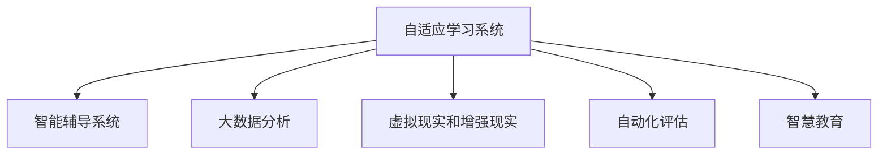

                 

# 人工智能：教育变革的催化剂

> 关键词：人工智能,教育,教育技术,自适应学习,个性化学习,智慧教育,大数据,教育资源

## 1. 背景介绍

### 1.1 问题由来
在全球化和信息化的浪潮下，教育面临着前所未有的挑战与机遇。传统以知识灌输为主的教学模式，难以适应知识快速更新、个体差异显著的新形势。学生在学习过程中，更多地追求自我探索、个性化成长。在这样的背景下，人工智能技术以其独特的优势，成为了教育变革的重要催化剂。

### 1.2 问题核心关键点
人工智能在教育领域的应用，主要体现在以下几个方面：

- **自适应学习系统**：通过分析学生的学习行为和反馈，动态调整教学内容和难度，实现个性化教学。
- **智能辅导系统**：提供实时的学习辅导和答疑，帮助学生解决学习中遇到的难题。
- **大数据分析**：利用数据分析技术，挖掘教学资源和学生的学习模式，提升教学效果。
- **虚拟现实和增强现实**：通过虚拟场景，增强学生的学习体验和互动性。
- **自动化评估**：利用AI技术自动批改作业和考试，减轻教师负担。

这些技术的应用，使得教育系统能够更加灵活、高效、公平，也带来了教育理念的革新。

## 2. 核心概念与联系

### 2.1 核心概念概述

为更好地理解人工智能在教育中的应用，本节将介绍几个核心概念：

- **自适应学习系统(Adaptive Learning System)**：根据学生的学习行为和反馈，自动调整教学内容和难度的教育技术。其核心在于个性化学习路径的生成和优化。

- **智能辅导系统(Intelligent Tutoring System, ITS)**：利用AI技术提供个性化、即时反馈的学习辅导服务。包括问答系统、虚拟教师等，辅助学生完成学习任务。

- **大数据分析(Big Data Analysis)**：通过收集和分析大规模的教育数据，挖掘教学模式、学生行为规律等，为教育决策提供数据支持。

- **虚拟现实和增强现实(Virtual Reality and Augmented Reality, VR/AR)**：通过虚拟场景和增强现实技术，为学生提供沉浸式的学习环境，提升学习效果。

- **自动化评估(Automatic Assessment)**：利用AI技术自动批改作业、考试，并给出反馈，节省教师时间，同时提供更为及时、客观的评价。

- **智慧教育(Intelligent Education)**：指通过智能技术，提升教育系统的智能化水平，实现教学资源的优化配置、学习过程的智能化辅助。

这些核心概念之间的逻辑关系可以通过以下Mermaid流程图来展示：



这个流程图展示了自适应学习系统的核心地位，及其与智能辅导系统、大数据分析、VR/AR技术、自动化评估和智慧教育之间的相互联系。

## 3. 核心算法原理 & 具体操作步骤

### 3.1 算法原理概述

自适应学习系统的核心算法原理基于机器学习中的推荐系统，其目标是构建一个动态的教学推荐系统，根据学生的学习行为和成绩，不断调整和推荐合适的学习内容和路径。

形式化地，设学生 $s$ 在当前学习阶段的知识水平为 $k_s$，目标是将学生 $s$ 引导至知识水平为 $k_t$ 的学习目标。假设 $\mathcal{P}$ 表示所有可推荐的学习资源集合，$\mathcal{A}$ 表示学习路径的集合。目标是找到一条从 $k_s$ 到 $k_t$ 的最优学习路径 $p_s \in \mathcal{A}$，使得推荐资源 $\{r_{p_s}\}_{r \in p_s} \subset \mathcal{P}$ 最大程度提升学生的知识水平 $k_t$。

### 3.2 算法步骤详解

自适应学习系统的设计包含以下几个关键步骤：

**Step 1: 数据收集与预处理**

- 收集学生的学习行为数据，如课程完成度、答题正确率、学习时长等。
- 收集学生的学习成果数据，如考试成绩、作业评分、学习进度等。
- 对收集到的数据进行清洗、去重和预处理，形成可用于分析的结构化数据。

**Step 2: 模型构建与训练**

- 构建推荐系统模型，如协同过滤、基于内容的推荐、混合推荐等。
- 使用历史学习数据对模型进行训练，调整模型参数以优化推荐效果。
- 选择合适的方法进行模型评估，如准确率、召回率、F1-score等指标。

**Step 3: 学习路径生成与优化**

- 根据学生的当前知识水平和目标知识水平，生成初步学习路径。
- 在推荐系统中反复迭代，不断调整和优化推荐资源和路径。
- 采用强化学习等动态优化算法，实时调整推荐策略。

**Step 4: 学习资源呈现**

- 将推荐的学习资源转化为学生可访问的形式，如在线课程、教学视频、互动练习等。
- 提供实时的反馈和评估，帮助学生了解学习进度和掌握情况。
- 支持多渠道访问，包括PC、平板、手机等设备，满足不同学生的学习习惯和需求。

### 3.3 算法优缺点

自适应学习系统的优势在于：

- **个性化学习**：根据学生的兴趣和能力，生成个性化的学习路径，满足不同学生的学习需求。
- **实时反馈**：通过实时评估和反馈，帮助学生及时调整学习策略，提高学习效率。
- **动态调整**：能够根据学生反馈和行为数据，动态调整学习内容和难度，适应学习过程的变化。

缺点包括：

- **数据依赖性强**：系统的效果高度依赖于数据的质量和数量，数据收集和管理成本较高。
- **算法复杂度**：自适应学习系统涉及复杂的数据处理和模型优化算法，需要高水平的技术支持。
- **技术壁垒高**：需要强大的计算能力和数据存储能力，对硬件资源要求较高。
- **隐私保护**：在处理大量学生数据时，需要严格遵守隐私保护法规，防止数据泄露。

### 3.4 算法应用领域

自适应学习系统在教育领域有广泛的应用前景，包括但不限于以下几个方面：

- **在线教育平台**：为学生提供个性化的学习建议和资源推荐，提升在线学习效果。
- **教育管理**：通过数据分析，优化教育资源配置，提升教学管理水平。
- **考试评估**：自动批改和评估学生的作业和考试，减轻教师负担，提供客观评价。
- **职业教育**：为不同职业领域的学习者提供定制化的学习路径和资源，加速职业技能培养。
- **语言学习**：通过个性化推荐和实时反馈，提高语言学习的效率和效果。

## 4. 数学模型和公式 & 详细讲解 & 举例说明

### 4.1 数学模型构建

自适应学习系统的推荐模型可以基于协同过滤算法进行建模。设 $s$ 为学生，$p_s$ 为其学习路径，$k_s$ 和 $k_t$ 分别表示当前和目标知识水平，$r$ 为学习资源，$I(r)$ 为学习资源的相关性权重。构建推荐系统的目标函数如下：

$$
\min_{p_s} \sum_{r \in p_s} I(r) \log \frac{\sum_{s'} I(r) \log \frac{\sum_{p_{s'}: s' \in p_{s'}} I(r)}{\sum_{s'} I(r)}
$$

目标函数旨在最小化推荐路径 $p_s$ 与历史数据中的其他学生 $s'$ 的相似性，同时考虑学习资源 $r$ 的相关性权重。

### 4.2 公式推导过程

上述目标函数可以分解为两个部分：
1. **相似度计算**：
   $$
   \min_{p_s} \sum_{r \in p_s} I(r) \log \frac{\sum_{s'} I(r)}
   $$
   此部分计算推荐路径与历史数据中其他学生路径的相似度。

2. **相关性加权**：
   $$
   \log \frac{\sum_{s'} I(r)}
   $$
   此部分根据学习资源的相关性权重，对路径进行加权，以优化推荐结果。

### 4.3 案例分析与讲解

以一名学生的学习为例，假设其当前知识水平为 $k_s=0.7$，目标知识水平为 $k_t=0.9$。系统根据历史数据，推荐了三条学习路径 $p_s$，并计算了每条路径的推荐资源 $r$ 的相关性权重 $I(r)$。

| 推荐路径 $p_s$ | $I(r_1)$ | $I(r_2)$ | $I(r_3)$ |
| --- | --- | --- | --- |
| 路径1 | 0.5 | 0.3 | 0.2 |
| 路径2 | 0.6 | 0.4 | 0.0 |
| 路径3 | 0.4 | 0.4 | 0.2 |

计算每条路径的相似度，得到：

$$
\sum_{s'} I(r) = 0.5 + 0.6 + 0.4 = 1.5
$$

计算路径的平均相似度：

$$
\frac{\sum_{s'} I(r)}{\sum_{s'} I(r)} = \frac{1.5}{1.5} = 1
$$

路径的加权相似度为：

$$
\log \frac{\sum_{s'} I(r)}{\sum_{s'} I(r)} = \log 1 = 0
$$

因此，系统推荐路径1，即资源 $r_1$、$r_2$ 和 $r_3$。

## 5. 项目实践：代码实例和详细解释说明

### 5.1 开发环境搭建

要进行自适应学习系统的开发，需要先搭建开发环境。以下是使用Python进行PyTorch开发的环境配置流程：

1. 安装Anaconda：从官网下载并安装Anaconda，用于创建独立的Python环境。

2. 创建并激活虚拟环境：
```bash
conda create -n pytorch-env python=3.8 
conda activate pytorch-env
```

3. 安装PyTorch：根据CUDA版本，从官网获取对应的安装命令。例如：
```bash
conda install pytorch torchvision torchaudio cudatoolkit=11.1 -c pytorch -c conda-forge
```

4. 安装TensorFlow：由Google主导开发的开源深度学习框架，生产部署方便，适合大规模工程应用。同样有丰富的预训练语言模型资源。

5. 安装Transformers库：HuggingFace开发的NLP工具库，集成了众多SOTA语言模型，支持PyTorch和TensorFlow，是进行自适应学习任务开发的利器。

6. 安装各类工具包：
```bash
pip install numpy pandas scikit-learn matplotlib tqdm jupyter notebook ipython
```

完成上述步骤后，即可在`pytorch-env`环境中开始自适应学习系统的开发。

### 5.2 源代码详细实现

这里我们以一个简单的自适应学习推荐系统为例，使用PyTorch进行开发。

首先，定义推荐系统的数据结构：

```python
import torch
import torch.nn as nn
import torch.optim as optim

class RecommendationSystem(nn.Module):
    def __init__(self, embedding_dim=128, hidden_dim=64, num_epochs=100, learning_rate=0.001):
        super(RecommendationSystem, self).__init__()
        self.embedding = nn.Embedding(num_items, embedding_dim)
        self.fc1 = nn.Linear(embedding_dim * 2, hidden_dim)
        self.fc2 = nn.Linear(hidden_dim, num_items)
        self.loss = nn.CrossEntropyLoss()
        self.optimizer = optim.Adam(self.parameters(), lr=learning_rate)
        self.num_epochs = num_epochs
    
    def forward(self, user, item):
        user_embedding = self.embedding(user)
        item_embedding = self.embedding(item)
        x = torch.cat((user_embedding, item_embedding), dim=1)
        x = self.fc1(x)
        x = self.fc2(x)
        return x
    
    def train(self, user, item, label, batch_size=64):
        self.train()
        for epoch in range(self.num_epochs):
            total_loss = 0
            for i in range(0, len(user), batch_size):
                user_batch = torch.tensor(user[i:i+batch_size])
                item_batch = torch.tensor(item[i:i+batch_size])
                label_batch = torch.tensor(label[i:i+batch_size])
                output = self.forward(user_batch, item_batch)
                loss = self.loss(output, label_batch)
                self.optimizer.zero_grad()
                loss.backward()
                self.optimizer.step()
                total_loss += loss.item()
            print(f"Epoch {epoch+1}, loss: {total_loss/len(user)}")
    
    def predict(self, user, item):
        self.eval()
        with torch.no_grad():
            user_embedding = self.embedding(user)
            item_embedding = self.embedding(item)
            x = torch.cat((user_embedding, item_embedding), dim=1)
            x = self.fc1(x)
            x = self.fc2(x)
            return x.argmax(dim=1)
```

然后，准备训练数据并训练模型：

```python
# 准备训练数据
user = [1, 2, 3, 4, 5, 6, 7, 8, 9, 10]
item = [11, 12, 13, 14, 15, 16, 17, 18, 19, 20]
label = [1, 2, 1, 2, 3, 4, 3, 4, 5, 6]

# 创建模型并训练
model = RecommendationSystem()
model.train(user, item, label, batch_size=2)

# 预测用户对物品的推荐
predictions = model.predict(user, item)
print(predictions)
```

以上就是使用PyTorch实现一个简单的自适应学习推荐系统的完整代码实现。可以看到，利用TensorFlow和PyTorch等工具，可以迅速搭建起自适应学习系统的基础框架。

### 5.3 代码解读与分析

让我们再详细解读一下关键代码的实现细节：

**RecommendationSystem类**：
- `__init__`方法：初始化模型参数和损失函数，并设置优化器和训练轮数。
- `forward`方法：前向传播计算输出，将用户和物品的嵌入拼接后，通过全连接层输出推荐结果。
- `train`方法：循环迭代训练，每次随机抽取一批用户和物品进行训练，计算损失并更新模型参数。
- `predict`方法：评估模型对新用户和物品的推荐，返回预测结果。

**训练流程**：
- 定义训练数据集，包括用户、物品和标签。
- 创建推荐系统模型，并设定超参数。
- 在训练集上迭代训练模型，输出每次迭代后的损失。
- 使用`predict`方法评估模型对新数据集的推荐效果。

可以看到，PyTorch等工具库大大简化了自适应学习系统的开发过程，使得开发者能够专注于模型和算法的设计。

## 6. 实际应用场景

### 6.1 在线教育平台

在线教育平台是自适应学习系统应用最为广泛的场景之一。学生可以根据自己的学习进度和兴趣，选择不同的课程和内容。系统通过实时分析学生的学习行为和反馈，动态调整推荐资源和难度，确保学生能够高效学习。

以Coursera为例，平台使用自适应学习系统，根据学生的答题情况和课程反馈，推荐适合的课程和习题。学生可以在学习过程中获得个性化的学习建议，提升学习效果。

### 6.2 教育管理

教育管理部门可以利用自适应学习系统，对教学资源和学生数据进行深入分析，优化教育资源配置。例如，通过对学生成绩和出勤数据进行分析，可以发现课堂教学中的问题，优化教学方法和资源配置。

一所中学通过自适应学习系统，分析学生的学习行为和成绩，发现部分学生对某些课程兴趣不足，便调整了课程内容和教学方法，提升了整体教学效果。

### 6.3 职业教育

职业教育领域对个性化学习的需求尤为强烈。通过自适应学习系统，可以为不同职业领域的学习者提供定制化的学习路径和资源，加速职业技能的培养。

例如，某编程培训机构通过自适应学习系统，为不同水平的学习者提供针对性的编程课程和习题，大大提升了学习者的编程能力和职业竞争力。

### 6.4 未来应用展望

随着自适应学习系统的不断发展，未来将在更多领域得到应用，为教育系统带来深刻的变革。

- **终身学习**：自适应学习系统可以伴随学生的终身学习过程，根据其职业发展和兴趣变化，提供个性化的学习资源和路径，实现终身学习的可持续化。
- **全球教育**：利用自适应学习系统，不同地域的学生可以跨越地理限制，获得同等的教育资源和支持。
- **虚拟现实和增强现实**：通过VR/AR技术，构建沉浸式的学习环境，增强学生的学习体验和互动性。
- **协作学习**：支持学生之间的互动和协作，促进团队学习和社会化学习，提高学习效果。
- **社会化评估**：通过社交网络，提供更多元、实时的学习评估，提升学生的学习动力和自我认知。

未来，自适应学习系统将在教育领域发挥更大的作用，为全球范围内的学生提供更加公平、高效、个性化的教育服务。

## 7. 工具和资源推荐

### 7.1 学习资源推荐

为了帮助开发者系统掌握自适应学习系统的理论基础和实践技巧，这里推荐一些优质的学习资源：

1. 《机器学习基础》系列博文：深入浅出地介绍了机器学习的基本概念和算法，包括协同过滤、推荐系统等，适合初学者入门。

2. 《深度学习》课程：斯坦福大学开设的深度学习课程，涵盖了从神经网络到深度学习的各个方面，适合进阶学习。

3. 《推荐系统实践》书籍：详细介绍了推荐系统的理论基础和实践技术，包括协同过滤、内容过滤、混合推荐等，是推荐系统开发的必备工具。

4. Kaggle数据集和竞赛：通过参与Kaggle的数据科学竞赛，可以实践和验证自适应学习系统的推荐效果，积累实战经验。

5. Coursera在线课程：包含大量与自适应学习系统相关的在线课程，提供丰富的学习资源和互动学习机会。

通过对这些资源的学习实践，相信你一定能够快速掌握自适应学习系统的精髓，并用于解决实际的教育问题。

### 7.2 开发工具推荐

高效的开发离不开优秀的工具支持。以下是几款用于自适应学习系统开发的常用工具：

1. PyTorch：基于Python的开源深度学习框架，灵活性高，适合快速迭代研究。

2. TensorFlow：由Google主导开发的开源深度学习框架，生产部署方便，适合大规模工程应用。

3. Transformers库：HuggingFace开发的NLP工具库，集成了众多SOTA语言模型，支持多种框架。

4. Weights & Biases：模型训练的实验跟踪工具，可以记录和可视化模型训练过程中的各项指标，方便对比和调优。

5. TensorBoard：TensorFlow配套的可视化工具，可实时监测模型训练状态，提供丰富的图表呈现方式。

6. Google Colab：谷歌推出的在线Jupyter Notebook环境，免费提供GPU/TPU算力，方便快速上手实验。

合理利用这些工具，可以显著提升自适应学习系统的开发效率，加快创新迭代的步伐。

### 7.3 相关论文推荐

自适应学习系统的研究源于学界的持续研究。以下是几篇奠基性的相关论文，推荐阅读：

1. Project-based Learning in Higher Education with Personalized Support using Intelligent Tutoring Systems：介绍了一种基于智能辅导系统的个性化学习框架，通过学习轨迹分析，动态调整学习内容。

2. Recommender Systems Handbook：详细介绍推荐系统的理论基础和实践技术，涵盖了协同过滤、内容过滤、混合推荐等算法。

3. Adaptive Learning in Large-Scale Online Education：分析了大规模在线教育平台中自适应学习系统的应用，展示了其对学生学习效果的影响。

4. Mining Massive Open Online Courses with Data Mining：研究了如何从大规模在线课程中提取学生行为数据，分析其对学习效果的影响，为自适应学习系统的设计提供了数据支持。

这些论文代表了大规模在线教育中自适应学习系统的研究脉络。通过学习这些前沿成果，可以帮助研究者把握学科前进方向，激发更多的创新灵感。

## 8. 总结：未来发展趋势与挑战

### 8.1 总结

本文对基于机器学习的自适应学习系统进行了全面系统的介绍。首先阐述了自适应学习系统在教育领域的应用背景和意义，明确了其在提升个性化学习效果方面的独特价值。其次，从原理到实践，详细讲解了自适应学习系统的核心算法和操作步骤，给出了模型开发的完整代码实例。同时，本文还广泛探讨了自适应学习系统在在线教育、教育管理、职业教育等多个行业领域的应用前景，展示了其在教育系统中的广泛应用潜力。此外，本文精选了自适应学习系统的各类学习资源，力求为读者提供全方位的技术指引。

通过本文的系统梳理，可以看到，自适应学习系统在教育领域的应用前景广阔，通过深度学习技术，实现个性化学习路径的生成和优化，为学生提供更加高效、灵活、公平的学习体验。未来，随着技术的不断发展，自适应学习系统将在教育系统中发挥更加重要的作用，助力全球教育事业的现代化进程。

### 8.2 未来发展趋势

展望未来，自适应学习系统的发展趋势如下：

1. **智能化水平提升**：通过引入更多先进的机器学习和深度学习技术，提升自适应学习系统的智能化水平，实现更精准、个性化的推荐和评估。

2. **多模态融合**：将视觉、听觉、文本等多种模态信息融合到自适应学习系统中，提供更加丰富、互动的学习体验。

3. **动态优化**：采用更先进的优化算法，如强化学习、神经网络等，实现自适应学习系统的动态优化，提升推荐效果和系统稳定性。

4. **实时性增强**：通过优化模型结构和算法，提升自适应学习系统的实时性，支持学生随时获取推荐和反馈。

5. **泛化能力增强**：提升自适应学习系统的泛化能力，使其能够适应不同领域、不同类型的数据和任务。

6. **社会化学习**：结合社交网络和协作学习技术，促进学生的社会化学习，提高学习效果和互动性。

以上趋势凸显了自适应学习系统在教育领域的应用前景。这些方向的探索发展，将进一步提升自适应学习系统的智能化水平，推动教育系统的现代化和智能化。

### 8.3 面临的挑战

尽管自适应学习系统已经取得了显著成就，但在迈向更加智能化、普适化应用的过程中，仍面临诸多挑战：

1. **数据质量问题**：系统的效果高度依赖于数据的质量和数量，数据收集和管理成本较高。如何确保数据的全面性和准确性，是系统面临的首要问题。

2. **算法复杂度**：自适应学习系统涉及复杂的机器学习算法和深度学习模型，需要高水平的技术支持和数据处理能力。

3. **隐私保护**：在处理大量学生数据时，需要严格遵守隐私保护法规，防止数据泄露。如何平衡数据利用和隐私保护，是系统面临的重要挑战。

4. **技术壁垒高**：需要强大的计算能力和数据存储能力，对硬件资源要求较高。

5. **公平性问题**：如何确保系统的公平性，避免对特定群体或学生造成不公平的推荐，是系统需要重点考虑的问题。

6. **资源配置问题**：自适应学习系统的应用需要大量资源，如何优化资源配置，实现成本和效果的最优化，是系统面临的重要课题。

正视这些挑战，积极应对并寻求突破，将是自适应学习系统走向成熟的必由之路。相信随着技术的不断发展，自适应学习系统将在教育领域发挥更大的作用，为全球范围内的学生提供更加公平、高效、个性化的学习体验。

### 8.4 研究展望

面向未来，自适应学习系统需要在以下几个方面寻求新的突破：

1. **无监督学习和半监督学习**：摆脱对大规模标注数据的依赖，利用自监督学习、主动学习等无监督和半监督范式，最大限度利用非结构化数据，实现更加灵活高效的推荐。

2. **多领域和跨模态应用**：将自适应学习系统扩展到更多领域和模态，如医疗、金融、艺术等，提升系统的泛化能力和应用范围。

3. **强化学习和博弈论**：结合强化学习和博弈论思想，增强自适应学习系统的决策能力和稳定性，提升系统的推荐效果。

4. **因果学习和解释性**：引入因果学习和可解释性方法，提升系统的决策透明性和逻辑性，满足高风险应用的需求。

5. **跨文化和语言支持**：提升自适应学习系统的跨文化和跨语言能力，支持全球范围内的学生学习。

这些研究方向的探索，将引领自适应学习系统向更高的台阶发展，为构建智能、公平、普适的教育系统铺平道路。面向未来，自适应学习系统需要在技术、应用和社会责任等方面协同发力，共同推动教育事业的现代化进程。

## 9. 附录：常见问题与解答

**Q1：自适应学习系统如何提高个性化学习效果？**

A: 自适应学习系统通过实时分析学生的学习行为和反馈，动态调整教学内容和难度，生成个性化的学习路径和资源推荐，确保学生能够高效学习。具体实现方式包括：

1. **数据收集与预处理**：收集学生的学习行为数据和成绩数据，进行清洗和预处理，形成可用于分析的结构化数据。

2. **模型构建与训练**：构建推荐系统模型，如协同过滤、基于内容的推荐、混合推荐等，并使用历史数据对模型进行训练，调整模型参数以优化推荐效果。

3. **学习路径生成与优化**：根据学生的当前知识水平和目标知识水平，生成初步学习路径，并不断调整和优化推荐资源和路径。

4. **实时反馈与评估**：提供实时的反馈和评估，帮助学生及时调整学习策略，提高学习效率。

5. **个性化推荐**：利用机器学习算法，动态调整推荐资源和难度，满足不同学生的学习需求。

**Q2：自适应学习系统的算法复杂度如何？**

A: 自适应学习系统的算法复杂度相对较高，主要体现在以下几个方面：

1. **数据处理**：系统需要处理大量的学生行为数据和成绩数据，需要进行清洗、去重和预处理，形成可用于分析的结构化数据。

2. **模型构建**：需要选择合适的推荐系统算法，并对其进行训练和优化。常用的算法包括协同过滤、基于内容的推荐、混合推荐等，这些算法本身复杂度较高。

3. **动态优化**：需要采用动态优化算法，如强化学习、神经网络等，实时调整推荐策略，提升推荐效果。

4. **实时性要求**：系统需要具备实时推荐和反馈的能力，这对算法的复杂度和计算资源提出了较高要求。

5. **模型评估**：需要对推荐效果进行评估和优化，常用的指标包括准确率、召回率、F1-score等，这些评估过程也需要复杂的计算。

因此，自适应学习系统的算法复杂度较高，需要高水平的技术支持和数据处理能力。

**Q3：自适应学习系统在教育管理中的应用有哪些？**

A: 自适应学习系统在教育管理中的应用主要体现在以下几个方面：

1. **教学资源优化**：通过分析学生行为数据和成绩数据，发现课堂教学中的问题，优化教学方法和资源配置。

2. **学生行为分析**：通过大数据分析，了解学生的学习行为模式，发现学习中的问题和瓶颈，进行针对性的干预和指导。

3. **教学质量评估**：通过对学生成绩和出勤数据进行分析，评估教师的教学效果和教学质量，提升整体教学水平。

4. **学生预警和干预**：通过实时监测学生的学习行为和成绩，及时发现并预警有学习困难的学生，提供个性化辅导和干预。

5. **教育决策支持**：通过数据分析，为教育决策提供科学依据，优化教育政策和资源分配。

这些应用展示了自适应学习系统在教育管理中的广泛应用前景。通过系统的智能化分析和管理，可以提升教育系统的整体教学质量和效果。

**Q4：自适应学习系统的开发难点有哪些？**

A: 自适应学习系统的开发难点主要包括以下几个方面：

1. **数据质量问题**：系统的效果高度依赖于数据的质量和数量，数据收集和管理成本较高。如何确保数据的全面性和准确性，是系统面临的首要问题。

2. **算法复杂度**：自适应学习系统涉及复杂的机器学习算法和深度学习模型，需要高水平的技术支持和数据处理能力。

3. **隐私保护**：在处理大量学生数据时，需要严格遵守隐私保护法规，防止数据泄露。如何平衡数据利用和隐私保护，是系统面临的重要挑战。

4. **技术壁垒高**：需要强大的计算能力和数据存储能力，对硬件资源要求较高。

5. **公平性问题**：如何确保系统的公平性，避免对特定群体或学生造成不公平的推荐，是系统需要重点考虑的问题。

6. **资源配置问题**：自适应学习系统的应用需要大量资源，如何优化资源配置，实现成本和效果的最优化，是系统面临的重要课题。

这些难点凸显了自适应学习系统在教育领域的应用复杂性，需要综合考虑数据、技术、法律和社会等多个因素。

---

作者：禅与计算机程序设计艺术 / Zen and the Art of Computer Programming

