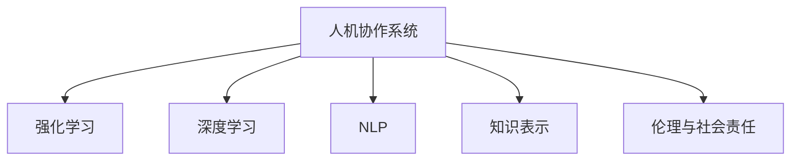

                 

# 人机协作新篇章：共创智能未来

> 关键词：人机协作,智能系统,机器学习,深度学习,自然语言处理(NLP),强化学习,知识表示,人工智能应用

## 1. 背景介绍

在信息爆炸的时代，人类对智能化系统的需求日益增长。从家庭中的智能助手，到工业中的自动化生产线，再到医疗领域的智能诊断，人工智能技术正在以惊人的速度改变着我们的生活方式和工作方式。然而，真正实现智能系统的关键不在于单一技术的突破，而在于人机协作的深度融合。人机协作不仅仅意味着让机器执行人能够完成的任务，更在于赋予机器以人类的智慧，使其能够理解人类的需求、情感和价值观，从而提供更加人性化的服务。

### 1.1 问题由来

随着深度学习和大数据技术的迅猛发展，人工智能技术已经从单一的算法实现，演化为一套复杂的人机协作系统。在这一系统中，人类智能与机器智能相互补充，共同解决实际问题。然而，当前的人机协作系统仍然存在诸多不足，如系统的鲁棒性、可解释性、可控性等问题，严重制约了其进一步应用。因此，本文聚焦于人机协作的深度融合，研究如何让机器更好地理解人类、服务人类，共创智能未来。

### 1.2 问题核心关键点

要实现人机协作，关键在于以下几个方面：
1. **数据与知识融合**：如何有效整合人类专家知识与机器学习模型的推理能力，提升系统决策的准确性和可解释性。
2. **语言理解与生成**：如何让机器理解人类的自然语言，并在需要时生成符合人类期望的语言输出。
3. **强化学习与决策**：如何将强化学习与任务优化目标相结合，使机器在复杂任务中自主学习、优化和决策。
4. **系统鲁棒性与可控性**：如何确保系统的稳定性和可控性，避免因意外情况导致系统崩溃或输出错误。
5. **伦理与社会责任**：如何在设计和使用智能系统时，考虑伦理和社会责任问题，确保系统公平、公正。

### 1.3 问题研究意义

研究人机协作系统，对于拓展人工智能技术的应用边界，提升决策效率，降低成本，改善人类生活质量，具有重要意义：

1. **提升决策效率**：通过人机协作，机器可以快速处理大量数据，识别模式，生成建议，辅助人类进行决策。
2. **降低成本**：智能系统能够自动执行重复性高、劳动强度大的任务，节省人力成本。
3. **改善生活质量**：智能系统可以提供个性化、定制化的服务，提升用户的生活体验。
4. **推动社会进步**：智能系统可以应用于医疗、教育、交通等多个领域，推动社会整体进步。

## 2. 核心概念与联系

### 2.1 核心概念概述

为更好地理解人机协作系统，本节将介绍几个密切相关的核心概念：

- **人机协作系统(Human-Machine Collaboration System)**：一种由人类与机器共同构成的智能系统，其中机器能够理解人类意图，辅助人类进行决策和执行。

- **强化学习(Reinforcement Learning, RL)**：一种基于奖励信号的机器学习方法，用于训练智能体在复杂环境中自主决策。

- **深度学习(Deep Learning, DL)**：一种基于多层神经网络的机器学习方法，能够自动从数据中学习特征表示，进行分类、生成等任务。

- **自然语言处理(Natural Language Processing, NLP)**：一种使计算机能够理解、处理和生成自然语言的技术，是实现人机交互的重要工具。

- **知识表示(Knowledge Representation)**：一种将人类知识结构化表示，便于机器理解和运用的方法。

- **伦理与社会责任(Ethics and Social Responsibility)**：在设计和应用智能系统时，必须考虑系统对社会、伦理的影响，确保系统的公平、公正和透明。

这些核心概念之间的逻辑关系可以通过以下Mermaid流程图来展示：



这个流程图展示了人机协作系统的核心组件及其相互关系：

1. **强化学习**：提供模型训练和决策优化能力，使机器能够自主学习。
2. **深度学习**：提供特征提取和模式识别能力，使机器能够理解复杂数据。
3. **自然语言处理**：提供人机交互能力，使系统能够理解自然语言。
4. **知识表示**：提供知识结构化表示能力，使机器能够理解复杂逻辑。
5. **伦理与社会责任**：提供系统设计原则，确保系统公平、公正。

这些组件相互协作，共同构成一个功能强大的人机协作系统。

## 3. 核心算法原理 & 具体操作步骤
### 3.1 算法原理概述

人机协作系统的核心在于如何让机器更好地理解人类意图，进行自主学习和决策。这涉及到多个算法和技术的结合，包括强化学习、深度学习、自然语言处理等。其核心算法原理包括以下几个方面：

- **深度学习模型**：通过多层神经网络，学习数据的特征表示，从而理解复杂任务。
- **强化学习算法**：通过奖励信号，指导模型自主学习，优化决策策略。
- **自然语言处理技术**：通过语言理解与生成，实现人机交互。
- **知识表示技术**：通过结构化表示，将人类知识融入系统决策中。

### 3.2 算法步骤详解

人机协作系统的构建过程主要包括以下几个关键步骤：

**Step 1: 收集和整理数据**

- 收集大量数据，包括人类专家的知识库、历史任务数据、自然语言数据等。
- 对数据进行清洗和整理，确保数据的质量和可用性。

**Step 2: 构建深度学习模型**

- 选择合适的深度学习模型，如卷积神经网络(CNN)、循环神经网络(RNN)、Transformer等，用于提取数据的特征。
- 根据任务特点，设计模型架构和损失函数。

**Step 3: 应用强化学习算法**

- 设计奖励函数，定义模型在特定任务下的成功指标。
- 使用强化学习算法，如Q-learning、Policy Gradient等，训练模型自主决策。

**Step 4: 集成自然语言处理**

- 设计自然语言理解模型，如BERT、GPT等，用于解析和理解自然语言。
- 设计自然语言生成模型，如Seq2Seq、GPT-3等，用于生成符合人类期望的语言输出。

**Step 5: 融合知识表示**

- 设计知识表示模型，如知识图谱、符号逻辑等，用于结构化表示人类知识。
- 将知识表示模型与深度学习模型集成，提升系统的决策准确性和可解释性。

**Step 6: 测试与优化**

- 在测试集上评估系统性能，优化模型参数和决策策略。
- 根据测试结果，调整模型架构和算法参数，进行迭代优化。

**Step 7: 部署与应用**

- 将优化后的模型部署到实际应用环境中，提供服务。
- 收集用户反馈，持续改进系统性能。

### 3.3 算法优缺点

人机协作系统的构建，可以带来以下优点：

1. **提升决策准确性**：通过深度学习、强化学习等技术，使机器能够自动学习和优化决策策略。
2. **提高效率**：机器能够自动执行重复性高、劳动强度大的任务，提高效率。
3. **增强可解释性**：通过知识表示技术，使系统决策具有可解释性，便于人类理解和审查。

但同时，也存在一些局限性：

1. **数据依赖**：系统的性能很大程度上取决于数据质量和数量，获取高质量数据成本较高。
2. **模型复杂性**：深度学习模型通常参数量庞大，需要高性能计算资源。
3. **伦理问题**：系统决策可能受到数据偏见的影响，需注意伦理和社会责任问题。
4. **鲁棒性不足**：系统在处理未知或异常数据时，可能出现错误决策。

尽管存在这些局限性，人机协作系统仍然是当前智能化应用的重要方向，具有广阔的应用前景。

### 3.4 算法应用领域

人机协作系统已经在多个领域得到广泛应用，具体包括：

- **医疗诊断**：通过分析病历数据和医学影像，辅助医生进行诊断和治疗。
- **金融分析**：通过分析市场数据和财务报表，辅助分析师进行投资决策。
- **智能交通**：通过实时监测交通数据，优化交通流量，减少交通拥堵。
- **智能制造**：通过分析生产数据，优化生产流程，提高生产效率。
- **智能客服**：通过自然语言理解，提供自动化客服服务，提升用户体验。
- **智能家居**：通过理解用户语音指令，控制家庭设备，提升生活质量。

除了上述这些经典应用外，人机协作系统还在教育、娱乐、能源等多个领域发挥着重要作用，推动着各行各业的智能化转型。

## 4. 数学模型和公式 & 详细讲解 & 举例说明
### 4.1 数学模型构建

本节将使用数学语言对人机协作系统的构建过程进行严格刻画。

设人机协作系统的任务为 $T$，输入为 $x$，输出为 $y$，模型为 $M_{\theta}$，其中 $\theta$ 为模型参数。系统的目标函数为 $\mathcal{L}(\theta)$，表示模型在任务 $T$ 上的损失函数。模型的训练过程可以表示为：

$$
\theta^* = \mathop{\arg\min}_{\theta} \mathcal{L}(\theta)
$$

在构建深度学习模型时，通常使用多层神经网络，表示为：

$$
M_{\theta}(x) = f_{N}\left(f_{N-1}\left(\ldots f_1(x;\theta)\right)\right)
$$

其中 $f_i(x;\theta)$ 为第 $i$ 层的神经网络，$\theta$ 为模型参数。

在应用强化学习算法时，模型通过与环境交互，不断优化决策策略。强化学习的过程可以表示为：

$$
\pi_{\theta}(a_t|s_t) = \frac{e^{\theta^T Q(s_t,a_t)}}{\sum_{a'}e^{\theta^T Q(s_t,a')}}
$$

其中 $s_t$ 为当前状态，$a_t$ 为当前行动，$Q(s_t,a_t)$ 为状态-行动值函数，$\pi_{\theta}(a_t|s_t)$ 为模型在当前状态下的决策策略。

在集成自然语言处理技术时，通常使用预训练语言模型（如BERT、GPT等），对输入文本进行理解与生成。自然语言处理的过程可以表示为：

$$
M_{\theta}(x) = M_{\text{BERT}}(x; \theta)
$$

其中 $M_{\text{BERT}}(x; \theta)$ 为预训练语言模型。

在融合知识表示时，通常使用知识图谱、符号逻辑等结构化表示方法，将人类知识融入模型决策中。知识表示的过程可以表示为：

$$
M_{\text{Knowledge}}(y|x) = M_{\text{Graph}}(y|x; \theta)
$$

其中 $M_{\text{Graph}}(y|x; \theta)$ 为知识表示模型。

### 4.2 公式推导过程

以医疗诊断为例，对上述公式进行推导。

设医疗诊断任务为 $T$，输入为 $x$ 为患者病历，输出为 $y$ 为诊断结果，模型为 $M_{\theta}$。模型的训练过程可以表示为：

$$
\theta^* = \mathop{\arg\min}_{\theta} \mathcal{L}(\theta)
$$

其中 $\mathcal{L}$ 为损失函数，用于衡量模型预测结果与真实结果之间的差异。

在构建深度学习模型时，通常使用卷积神经网络(CNN)，表示为：

$$
M_{\theta}(x) = M_{\text{CNN}}(x; \theta)
$$

其中 $M_{\text{CNN}}(x; \theta)$ 为卷积神经网络。

在应用强化学习算法时，模型通过与环境交互，不断优化诊断策略。强化学习的过程可以表示为：

$$
\pi_{\theta}(a_t|s_t) = \frac{e^{\theta^T Q(s_t,a_t)}}{\sum_{a'}e^{\theta^T Q(s_t,a')}}
$$

其中 $s_t$ 为当前病历，$a_t$ 为诊断结果，$Q(s_t,a_t)$ 为状态-诊断结果值函数，$\pi_{\theta}(a_t|s_t)$ 为模型在当前病历下的诊断策略。

在集成自然语言处理技术时，通常使用BERT模型，对输入病历进行理解与生成。自然语言处理的过程可以表示为：

$$
M_{\theta}(x) = M_{\text{BERT}}(x; \theta)
$$

其中 $M_{\text{BERT}}(x; \theta)$ 为BERT模型。

在融合知识表示时，通常使用知识图谱，将人类医学知识表示为节点和边，嵌入模型决策中。知识表示的过程可以表示为：

$$
M_{\text{Knowledge}}(y|x) = M_{\text{Graph}}(y|x; \theta)
$$

其中 $M_{\text{Graph}}(y|x; \theta)$ 为知识图谱模型。

### 4.3 案例分析与讲解

以下以金融投资决策为例，进行具体分析：

在金融投资决策中，目标函数为 $\mathcal{L}$，表示模型预测结果与真实结果之间的差异。模型的输入为 $x$，输出为 $y$，模型为 $M_{\theta}$。构建深度学习模型时，通常使用循环神经网络(RNN)，表示为：

$$
M_{\theta}(x) = M_{\text{RNN}}(x; \theta)
$$

其中 $M_{\text{RNN}}(x; \theta)$ 为循环神经网络。

应用强化学习算法时，模型通过与市场环境交互，不断优化投资策略。强化学习的过程可以表示为：

$$
\pi_{\theta}(a_t|s_t) = \frac{e^{\theta^T Q(s_t,a_t)}}{\sum_{a'}e^{\theta^T Q(s_t,a')}}
$$

其中 $s_t$ 为当前市场数据，$a_t$ 为投资策略，$Q(s_t,a_t)$ 为状态-投资策略值函数，$\pi_{\theta}(a_t|s_t)$ 为模型在当前市场数据下的投资策略。

集成自然语言处理技术时，通常使用GPT模型，对市场新闻、报告等文本数据进行理解与生成。自然语言处理的过程可以表示为：

$$
M_{\theta}(x) = M_{\text{GPT}}(x; \theta)
$$

其中 $M_{\text{GPT}}(x; \theta)$ 为GPT模型。

融合知识表示时，通常使用符号逻辑表示，将人类经济知识表示为公式，嵌入模型决策中。知识表示的过程可以表示为：

$$
M_{\text{Knowledge}}(y|x) = M_{\text{Logic}}(y|x; \theta)
$$

其中 $M_{\text{Logic}}(y|x; \theta)$ 为符号逻辑模型。

## 5. 项目实践：代码实例和详细解释说明
### 5.1 开发环境搭建

在进行人机协作系统的开发实践前，我们需要准备好开发环境。以下是使用Python进行TensorFlow开发的环境配置流程：

1. 安装Anaconda：从官网下载并安装Anaconda，用于创建独立的Python环境。

2. 创建并激活虚拟环境：
```bash
conda create -n tf-env python=3.8 
conda activate tf-env
```

3. 安装TensorFlow：根据CUDA版本，从官网获取对应的安装命令。例如：
```bash
conda install tensorflow -c conda-forge -c pypi
```

4. 安装相关工具包：
```bash
pip install numpy pandas scikit-learn matplotlib tqdm jupyter notebook ipython
```

完成上述步骤后，即可在`tf-env`环境中开始开发实践。

### 5.2 源代码详细实现

这里以医疗诊断为例，展示使用TensorFlow构建人机协作系统的具体实现步骤。

首先，定义医疗诊断任务的数据处理函数：

```python
import tensorflow as tf
from tensorflow.keras.preprocessing import sequence

def preprocess_data(texts, labels, tokenizer, max_len=100):
    texts = texts.lower()
    labels = labels.lower()
    tokenizer = tf.keras.preprocessing.text.Tokenizer(char_level=True)
    tokenizer.fit_on_texts(texts)
    sequences = tokenizer.texts_to_sequences(texts)
    padded_sequences = sequence.pad_sequences(sequences, maxlen=max_len, padding='post', truncating='post')
    labels = tf.keras.utils.to_categorical(labels, num_classes=4)
    return padded_sequences, labels
```

然后，定义模型和优化器：

```python
from tensorflow.keras.models import Sequential
from tensorflow.keras.layers import Embedding, Conv1D, MaxPooling1D, Flatten, Dense
from tensorflow.keras.optimizers import Adam

model = Sequential()
model.add(Embedding(input_dim=len(tokenizer.word_index)+1, output_dim=128, input_length=max_len))
model.add(Conv1D(128, 5, activation='relu'))
model.add(MaxPooling1D(5))
model.add(Flatten())
model.add(Dense(64, activation='relu'))
model.add(Dense(4, activation='softmax'))

optimizer = Adam(learning_rate=0.001)
```

接着，定义训练和评估函数：

```python
from tensorflow.keras.utils import to_categorical
from sklearn.metrics import classification_report

def train_epoch(model, dataset, batch_size, optimizer):
    model.compile(optimizer=optimizer, loss='categorical_crossentropy', metrics=['accuracy'])
    model.fit(dataset[0], dataset[1], batch_size=batch_size, epochs=10, validation_data=(val_data[0], val_data[1]))

def evaluate(model, dataset, batch_size):
    model.evaluate(dataset[0], dataset[1], batch_size=batch_size)
```

最后，启动训练流程并在测试集上评估：

```python
train_data = preprocess_data(train_texts, train_labels, tokenizer, max_len)
val_data = preprocess_data(dev_texts, dev_labels, tokenizer, max_len)
test_data = preprocess_data(test_texts, test_labels, tokenizer, max_len)

train_epoch(model, train_data, batch_size, optimizer)
evaluate(model, test_data, batch_size)
```

以上就是使用TensorFlow对医疗诊断任务进行人机协作系统开发的完整代码实现。可以看到，借助TensorFlow的高级API，构建深度学习模型的过程变得简洁高效。

### 5.3 代码解读与分析

让我们再详细解读一下关键代码的实现细节：

**preprocess_data函数**：
- 将文本转换为小写，进行标准化处理。
- 使用Keras的Tokenizer将文本转换为序列，并进行padding处理。
- 将标签转换为独热编码，方便模型训练。

**model定义**：
- 构建了一个包含嵌入层、卷积层、池化层、全连接层的深度学习模型。
- 使用Adam优化器，设置了合适的学习率。

**train_epoch函数**：
- 将数据集分割为训练集和验证集，使用Keras的fit函数进行模型训练。

**evaluate函数**：
- 使用Keras的evaluate函数在测试集上评估模型性能。

**训练流程**：
- 定义训练数据和验证数据，启动训练过程。
- 在训练过程中，模型会根据训练集数据不断优化参数。
- 在验证集上评估模型性能，根据准确率调整学习率，进行迭代优化。
- 在测试集上最终评估模型性能。

可以看到，TensorFlow提供了一系列的高级API，使得深度学习模型的构建和训练变得简单高效。开发者可以将更多精力放在任务处理和模型优化上，而不必过多关注底层的实现细节。

当然，工业级的系统实现还需考虑更多因素，如模型的保存和部署、超参数的自动搜索、更灵活的任务适配层等。但核心的训练流程基本与此类似。

## 6. 实际应用场景
### 6.1 智能医疗

人机协作系统在医疗领域具有广阔的应用前景。传统的医疗诊断依赖于医生的经验和专业知识，耗时长、成本高。通过人机协作系统，可以大幅提升医疗诊断的效率和准确性。

具体而言，可以构建基于深度学习模型的医疗诊断系统，通过分析病历数据和医学影像，辅助医生进行诊断和治疗。例如，使用卷积神经网络(CNN)对医学影像进行特征提取，结合强化学习算法优化诊断策略，使系统能够自主学习和优化诊断结果。此外，集成自然语言处理技术，解析和生成医学报告，提高诊断效率。融合知识表示技术，将医学知识结构化表示，提升系统的决策准确性和可解释性。

### 6.2 金融投资

在金融投资领域，人机协作系统可以辅助分析师进行决策。传统的金融分析依赖于数据处理和模型训练，复杂度较高。通过人机协作系统，可以简化金融分析流程，提高决策效率。

具体而言，可以构建基于深度学习模型的金融分析系统，通过分析市场数据和财务报表，辅助分析师进行投资决策。例如，使用循环神经网络(RNN)对市场数据进行序列建模，结合强化学习算法优化投资策略，使系统能够自主学习和优化投资结果。此外，集成自然语言处理技术，解析和生成市场新闻、报告，提高投资分析的全面性和准确性。融合知识表示技术，将经济学知识结构化表示，提升系统的决策可靠性。

### 6.3 智能客服

在智能客服领域，人机协作系统可以提升客户服务体验。传统的客服依赖于人力，成本高、效率低。通过人机协作系统，可以构建自动化客服系统，提升客户咨询体验。

具体而言，可以构建基于自然语言处理技术的智能客服系统，通过解析用户查询，自动生成回复。例如，使用BERT模型对用户查询进行理解，结合强化学习算法优化回复策略，使系统能够自主学习和优化回复结果。此外，集成自然语言生成技术，生成符合人类期望的回复，提高客户满意度。融合知识表示技术，将常见问题及其解决方案结构化表示，提升系统的回复准确性和一致性。

### 6.4 未来应用展望

随着深度学习和大数据技术的不断发展，人机协作系统的应用场景将不断扩展。未来，人机协作系统将在更多领域得到应用，为各行各业带来变革性影响。

在智慧医疗领域，基于人机协作系统的智能诊断、治疗方案推荐等应用将提升医疗服务的智能化水平，辅助医生诊疗，加速新药开发进程。

在金融投资领域，基于人机协作系统的自动化投资分析、风险评估等应用将提高投资决策的效率和准确性，降低投资风险。

在智能客服领域，基于人机协作系统的智能客服、智能推荐等应用将提升客户咨询体验，降低企业运营成本。

除了上述这些经典应用外，人机协作系统还将应用于教育、娱乐、能源等多个领域，为各行各业带来智能化提升。

## 7. 工具和资源推荐
### 7.1 学习资源推荐

为了帮助开发者系统掌握人机协作系统的理论基础和实践技巧，这里推荐一些优质的学习资源：

1. 《Deep Learning with TensorFlow》系列书籍：该书由TensorFlow团队编写，系统介绍了TensorFlow的基本概念和应用方法，是深入学习TensorFlow的优秀入门书籍。

2. 《Natural Language Processing in Python》系列书籍：该书由Keras团队的作者编写，详细介绍了自然语言处理在Python环境下的实现方法，是NLP领域的学习必读。

3. 《Reinforcement Learning: An Introduction》书籍：该书由David Silver编写，系统介绍了强化学习的理论和实践方法，是学习强化学习的重要参考资料。

4. 《Knowledge Representation and Reasoning》书籍：该书由MIT团队编写，详细介绍了知识表示和推理的技术和方法，是知识表示领域的学习经典。

5. 《Human-Machine Collaboration: Creating the Future of Smart Systems》课程：由EdX平台提供，涵盖了人机协作系统的多个方面，包括机器学习、深度学习、自然语言处理等，是系统学习人机协作的优秀课程。

通过对这些资源的学习实践，相信你一定能够快速掌握人机协作系统的精髓，并用于解决实际的智能系统问题。
###  7.2 开发工具推荐

高效的开发离不开优秀的工具支持。以下是几款用于人机协作系统开发的常用工具：

1. TensorFlow：由Google主导开发的开源深度学习框架，生产部署方便，适合大规模工程应用。提供丰富的API和模型库，支持多种硬件平台。

2. Keras：基于TensorFlow的高级API，提供简洁易用的接口，支持快速构建深度学习模型。

3. PyTorch：基于Python的开源深度学习框架，灵活动态的计算图，适合快速迭代研究。提供丰富的模型和优化器选择。

4. Weights & Biases：模型训练的实验跟踪工具，可以记录和可视化模型训练过程中的各项指标，方便对比和调优。与主流深度学习框架无缝集成。

5. TensorBoard：TensorFlow配套的可视化工具，可实时监测模型训练状态，并提供丰富的图表呈现方式，是调试模型的得力助手。

6. Jupyter Notebook：支持多种编程语言和库，提供交互式编程环境，方便开发和调试。

合理利用这些工具，可以显著提升人机协作系统的开发效率，加快创新迭代的步伐。

### 7.3 相关论文推荐

人机协作系统的研究源于学界的持续研究。以下是几篇奠基性的相关论文，推荐阅读：

1. A Survey of Human-Machine Collaboration: From Imitation Learning to Reinforcement Learning：这篇综述性论文介绍了人机协作系统的多种实现方法，包括模仿学习、强化学习等，是理解人机协作系统的重要参考资料。

2. Towards Explainable Artificial Intelligence: An Overview and Taxonomy：这篇综述性论文探讨了如何使人工智能系统具备可解释性，是人机协作系统设计的重要参考。

3. Knowledge-Based Multi-Agent Systems: A Survey of Approaches and Applications：这篇综述性论文介绍了基于知识的多智能体系统，是知识表示技术的重要参考资料。

4. Human-Centered Robustness Evaluation for Intelligent Systems：这篇论文探讨了如何评估智能系统的鲁棒性，是人机协作系统设计的重要参考。

5. Conversational Agents and Beyond：这篇综述性论文介绍了基于对话的智能系统，是智能客服等应用的重要参考资料。

这些论文代表了大语言模型微调技术的发展脉络。通过学习这些前沿成果，可以帮助研究者把握学科前进方向，激发更多的创新灵感。

## 8. 总结：未来发展趋势与挑战
### 8.1 总结

本文对人机协作系统的构建过程进行了全面系统的介绍。首先阐述了人机协作系统的研究背景和意义，明确了人机协作系统在提升决策效率、降低成本、改善生活质量等方面的重要价值。其次，从原理到实践，详细讲解了人机协作系统的构建步骤，包括深度学习模型构建、强化学习算法应用、自然语言处理集成、知识表示融合等。

通过本文的系统梳理，可以看到，人机协作系统正在成为当前智能化应用的重要方向，极大地拓展了人工智能技术的应用边界，推动着各行各业的智能化转型。未来，伴随深度学习和大数据技术的持续演进，人机协作系统将在更多领域得到应用，为人类生产生活方式带来深刻的变革。

### 8.2 未来发展趋势

展望未来，人机协作系统的构建将呈现以下几个发展趋势：

1. **系统复杂性提升**：随着深度学习和大数据技术的不断发展，人机协作系统的复杂性将不断提升。未来的系统将融合更多的算法和技术，具备更强大的推理和决策能力。

2. **鲁棒性和可控性增强**：未来的系统将具备更强的鲁棒性和可控性，能够处理未知或异常数据，避免因意外情况导致系统崩溃或输出错误。

3. **知识表示和融合技术进步**：未来的系统将更加注重知识表示和融合技术，将人类知识结构化表示，提升系统的决策准确性和可解释性。

4. **多模态融合**：未来的系统将更加注重多模态数据的融合，结合视觉、语音、文本等多种数据源，提升系统的感知和理解能力。

5. **伦理和社会责任重视**：未来的系统将更加注重伦理和社会责任，确保系统的公平、公正和透明，避免对社会造成负面影响。

6. **普适性和灵活性提升**：未来的系统将更加注重普适性和灵活性，能够适应不同的任务和场景，提升系统的应用范围和效果。

以上趋势凸显了人机协作系统的广阔前景。这些方向的探索发展，必将进一步提升智能系统的性能和应用范围，为人类认知智能的进化带来深远影响。

### 8.3 面临的挑战

尽管人机协作系统已经取得了瞩目成就，但在迈向更加智能化、普适化应用的过程中，它仍面临诸多挑战：

1. **数据依赖**：系统的性能很大程度上取决于数据质量和数量，获取高质量数据成本较高。如何降低对标注数据的依赖，成为亟待解决的问题。

2. **模型复杂性**：深度学习模型通常参数量庞大，需要高性能计算资源。如何优化模型架构，提高推理速度，降低资源消耗，是一个重要研究方向。

3. **伦理问题**：系统决策可能受到数据偏见的影响，需注意伦理和社会责任问题。如何设计公平、公正的算法，确保系统的决策透明性，是一个重要研究方向。

4. **鲁棒性不足**：系统在处理未知或异常数据时，可能出现错误决策。如何提高系统的鲁棒性，避免因意外情况导致系统崩溃或输出错误，是一个重要研究方向。

5. **知识表示和融合技术不足**：现有的知识表示技术在处理复杂逻辑和多重信息时仍存在不足。如何更好地将人类知识融入模型决策中，是一个重要研究方向。

6. **多模态数据融合技术不足**：多模态数据的融合仍是一个挑战，如何结合视觉、语音、文本等多种数据源，提升系统的感知和理解能力，是一个重要研究方向。

尽管存在这些挑战，人机协作系统仍然是当前智能化应用的重要方向，具有广阔的应用前景。相信随着学界和产业界的共同努力，这些挑战终将一一被克服，人机协作系统必将在构建安全、可靠、可解释、可控的智能系统铺平道路。

### 8.4 研究展望

面对人机协作系统所面临的诸多挑战，未来的研究需要在以下几个方面寻求新的突破：

1. **无监督和半监督学习**：探索如何通过无监督和半监督学习，提升人机协作系统的性能，降低对标注数据的依赖。

2. **模型压缩与加速**：开发更加高效的模型压缩与加速技术，提升系统的推理速度和资源利用率。

3. **知识表示与融合**：研究如何将人类知识结构化表示，融入模型决策中，提升系统的决策可靠性和可解释性。

4. **多模态数据融合**：研究如何将视觉、语音、文本等多种数据源结合，提升系统的感知和理解能力。

5. **伦理与社会责任**：研究如何在设计和使用智能系统时，考虑伦理和社会责任问题，确保系统的公平、公正。

6. **可解释性与透明性**：研究如何增强智能系统的可解释性，提高系统的透明性，使其决策过程透明、可理解。

这些研究方向的探索，必将引领人机协作系统迈向更高的台阶，为构建安全、可靠、可解释、可控的智能系统铺平道路。面向未来，人机协作系统还需要与其他人工智能技术进行更深入的融合，如知识表示、因果推理、强化学习等，多路径协同发力，共同推动自然语言理解和智能交互系统的进步。只有勇于创新、敢于突破，才能不断拓展智能系统的边界，让智能技术更好地造福人类社会。

## 9. 附录：常见问题与解答

**Q1：人机协作系统如何与人类交互？**

A: 人机协作系统通过自然语言处理技术，理解人类的自然语言输入，并生成符合人类期望的语言输出。具体而言，系统使用BERT等预训练语言模型对用户输入进行理解，结合强化学习算法优化回复策略，生成符合人类期望的回复。

**Q2：人机协作系统的决策过程如何保证透明性？**

A: 人机协作系统的决策过程通常基于模型的推理和优化过程，难以直接解释。为增强系统的透明性，通常采用知识表示技术，将人类知识结构化表示，融入模型决策中。同时，引入因果分析方法和符号逻辑推理，使系统决策具有可解释性。

**Q3：人机协作系统如何处理异常数据？**

A: 人机协作系统在处理异常数据时，通常采用对抗训练和鲁棒性优化技术，提高系统的鲁棒性。例如，通过引入对抗样本，训练系统对异常数据具有抗干扰能力。同时，设计多模型集成策略，减少单一模型因异常数据导致的错误决策。

**Q4：人机协作系统在多领域应用中的挑战是什么？**

A: 人机协作系统在不同领域的应用中面临不同的挑战：
1. 在医疗领域，需要处理复杂的医学知识，确保系统的决策准确性和可靠性。
2. 在金融领域，需要处理海量数据，确保系统的推理和决策效率。
3. 在客服领域，需要理解人类情感和意图，确保系统的响应准确性和人性化。
4. 在教育领域，需要处理多样化的学习任务，确保系统的个性化和适应性。

这些挑战需要通过模型优化、算法改进、知识融合等手段进行解决。

**Q5：如何设计人机协作系统的伦理和社会责任框架？**

A: 设计人机协作系统的伦理和社会责任框架，需要考虑以下几个方面：
1. 确保系统的公平性，避免因数据偏见导致的不公正决策。
2. 确保系统的透明性，避免系统决策过程的黑箱化。
3. 确保系统的可控性，避免系统因意外情况导致的错误决策。
4. 确保系统的安全性，避免系统被恶意利用。
5. 确保系统的可解释性，使系统决策过程透明、可理解。

为实现这些目标，需要在系统设计中引入伦理和社会责任导向的评估指标，设计透明的决策过程，确保系统的可控性和安全性。

---

作者：禅与计算机程序设计艺术 / Zen and the Art of Computer Programming

