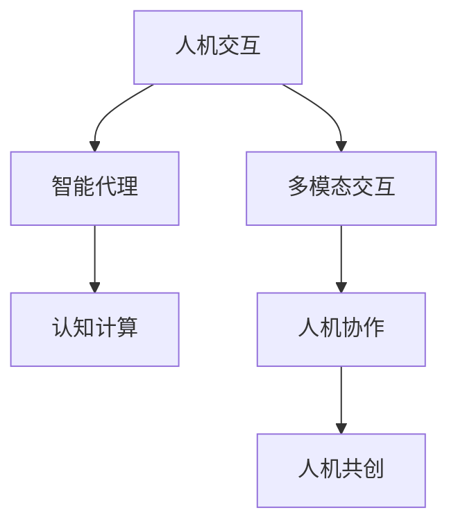

                 

# 人机协作：共创智能未来新世界

> 关键词：人机协作,智能系统,人工智能,共创未来,新兴技术,变革驱动,应用场景,技术挑战,研究展望,未来展望

## 1. 背景介绍

### 1.1 问题由来

在信息时代的浪潮中，人工智能（AI）和人类智能（Human Intelligence）的融合与协作已经成为了推动社会进步的重要力量。从自监督学习到强化学习，从传统机器学习到深度学习，人类通过不断的技术革新，逐步建立起一个个智能系统，使计算机能够更加高效地完成复杂任务。然而，人机协作并非一蹴而就，它需要充分理解人工智能与人类智能的互补性和交互性。在这一过程中，理解并运用人机协作的技术原理，成为智能系统建设的关键。

### 1.2 问题核心关键点

人机协作的核心关键点在于：
- **交互与融合**：智能系统如何与人进行自然、高效、多模态的交互，以及如何将AI技术与人类智能深度融合。
- **决策与执行**：智能系统如何辅助人类决策，并在必要时执行任务。
- **知识与经验**：智能系统如何高效地获取、表示和利用人类知识与经验，以提升系统性能。
- **透明性与可解释性**：智能系统如何在复杂场景中提供透明的决策过程和可解释的推理逻辑。
- **适应性与鲁棒性**：智能系统如何适应不断变化的现实世界，并具备一定的鲁棒性以应对异常和不确定性。

这些关键点共同构成了人机协作的技术框架，使得AI系统能够更好地融入人类生活和工作中，共创智能未来新世界。

## 2. 核心概念与联系

### 2.1 核心概念概述

为更好地理解人机协作的原理和框架，本节将介绍几个核心概念：

- **人机交互（Human-Computer Interaction, HCI）**：研究人如何与计算机系统进行交互的技术，旨在使交互过程更自然、直观和高效。
- **智能代理（Intelligent Agents）**：能够在复杂环境中自主决策和执行任务的智能体，其核心在于代理的感知、推理、决策和学习能力。
- **多模态交互（Multi-modal Interaction）**：利用语音、视觉、触觉等多种感官信息进行人机交互的技术，提升用户体验和系统智能水平。
- **认知计算（Cognitive Computing）**：结合心理学、神经科学和计算机科学的理论和方法，研究智能系统的认知过程和知识表示。
- **人机协作（Human-Machine Collaboration）**：结合人机交互、智能代理、多模态交互和认知计算的原理和技术，提升系统的协作效果。
- **人机共创（Human-Machine Co-Creation）**：通过智能系统和人类共同创造新价值的过程，实现人机协同工作。

这些核心概念之间的联系可以通过以下Mermaid流程图来展示：



这个流程图展示了人机协作技术的主要组成部分及其相互关系：

1. 人机交互是基础，涉及感知和理解用户需求的技术。
2. 智能代理是核心，负责决策和执行任务。
3. 多模态交互是手段，通过多样化的信息输入提升交互体验。
4. 认知计算是理论，提供人机协作的认知和知识表示方法。
5. 人机协作是目标，通过技术手段实现人机融合。
6. 人机共创是愿景，通过协同工作创造更多价值。

这些概念共同构成了人机协作的完整框架，为实现智能系统的高效、透明和可解释奠定了基础。

## 3. 核心算法原理 & 具体操作步骤

### 3.1 算法原理概述

人机协作的核心算法原理在于，通过智能系统对人类智能的辅助，实现复杂任务的自动化和智能化。主要包括以下几个步骤：

1. **任务建模**：将具体任务分解为可执行的步骤，形成任务模型。
2. **需求理解**：智能系统通过感知和理解技术，获取用户需求和目标。
3. **信息融合**：结合多源信息，智能系统进行感知、推理和决策。
4. **协同工作**：智能系统与人类进行多模态交互，共享信息和知识。
5. **执行与反馈**：智能系统执行任务，并通过反馈机制调整策略。

这些步骤涵盖了智能系统的决策链条和执行流程，是实现高效人机协作的关键。

### 3.2 算法步骤详解

**Step 1: 任务建模**
- **分解任务**：将复杂任务分解为子任务，形成任务图。
- **定义变量**：明确各子任务的输入、输出和状态。
- **建立规则**：为各子任务设计执行规则和约束条件。

**Step 2: 需求理解**
- **感知输入**：智能系统通过传感器或输入设备获取用户指令和数据。
- **信息提取**：智能系统对输入数据进行预处理和特征提取。
- **意图识别**：智能系统通过自然语言处理（NLP）等技术，理解用户需求。

**Step 3: 信息融合**
- **多源融合**：智能系统整合来自不同渠道的信息，包括语音、图像、文本等。
- **认知推理**：智能系统利用认知计算理论，进行知识推理和决策。
- **情境感知**：智能系统根据环境和上下文信息，调整决策策略。

**Step 4: 协同工作**
- **交互设计**：设计友好的人机交互界面，提供多种交互方式。
- **知识共享**：智能系统与人类共享信息和知识，通过协同工作提升系统性能。
- **反馈机制**：智能系统通过反馈机制，调整任务执行策略。

**Step 5: 执行与反馈**
- **执行任务**：智能系统根据决策结果，执行具体任务。
- **评估效果**：智能系统评估任务执行效果，生成评估报告。
- **优化调整**：智能系统根据反馈信息，优化任务执行策略。

### 3.3 算法优缺点

人机协作算法具有以下优点：
- **高效性**：通过自动化和智能化，显著提高任务执行效率。
- **灵活性**：智能系统可根据环境和任务动态调整策略。
- **鲁棒性**：多模态交互和认知计算使系统具备一定的鲁棒性。
- **透明性**：通过反馈机制和解释性技术，提升系统透明性。

然而，该算法也存在一些局限性：
- **依赖高质量数据**：智能系统依赖大量高质量的数据进行训练和优化。
- **复杂性高**：任务建模和信息融合过程较为复杂，需大量计算资源。
- **用户参与度**：用户需参与到协同工作过程中，工作流程可能不够简洁。
- **伦理与隐私**：智能系统可能涉及敏感数据和隐私问题，需确保数据安全。

尽管存在这些局限性，但人机协作算法仍是实现智能系统高效、透明和可解释的重要手段。

### 3.4 算法应用领域

人机协作算法在多个领域得到了广泛应用，包括但不限于：

- **医疗健康**：智能诊疗系统通过分析医疗数据，辅助医生进行诊断和治疗。
- **教育培训**：智能教育系统通过自然语言处理和认知计算，个性化推荐学习内容。
- **金融服务**：智能理财顾问通过分析用户财务数据，提供个性化理财建议。
- **制造业**：智能制造系统通过感知和决策技术，优化生产流程和质量控制。
- **零售电商**：智能推荐系统通过多模态信息融合，提升用户购物体验。

这些应用场景展示了人机协作算法的强大潜力，为各行业提供了智能化的解决方案。

## 4. 数学模型和公式 & 详细讲解  
### 4.1 数学模型构建

本节将使用数学语言对人机协作的算法过程进行更加严格的刻画。

假设智能系统需要执行的任务为 $T$，其任务模型为 $M_T = (G_T, I_T, O_T)$，其中 $G_T$ 为任务图，$I_T$ 为任务输入，$O_T$ 为任务输出。智能系统的感知模块为 $P$，决策模块为 $D$，执行模块为 $E$，反馈模块为 $F$。智能系统与人交互的过程可表示为：

$$
I_{T_{prev}} \to P \to O_{T_{prev}} \to D \to O_T \to E \to I_{T_{next}}
$$

其中 $T_{prev}$ 表示当前执行的任务，$T_{next}$ 表示下一个执行的任务。

智能系统的多模态信息融合过程可表示为：

$$
I_{multi} = \bigcup_{i=1}^n I_i, O_{multi} = \bigcap_{i=1}^n O_i
$$

其中 $I_i$ 为第 $i$ 种信息输入，$O_i$ 为第 $i$ 种信息输出。

### 4.2 公式推导过程

以下我们以医疗诊断任务为例，推导智能系统的决策过程。

假设智能系统根据用户输入的病症描述，执行诊断任务。智能系统的感知模块 $P$ 获取病症描述 $I_{symptom}$，决策模块 $D$ 根据病症描述和先验知识 $K$ 进行推理，得到诊断结果 $O_{diagnosis}$。执行模块 $E$ 根据诊断结果，生成治疗建议 $O_{treatment}$，并反馈给用户。智能系统的决策过程可表示为：

$$
\begin{aligned}
O_{diagnosis} &= D(I_{symptom}, K) \\
O_{treatment} &= E(O_{diagnosis})
\end{aligned}
$$

其中 $D$ 为推理函数，$K$ 为先验知识库。

在具体实现中，智能系统可以采用基于规则的推理引擎、基于神经网络的模型等进行决策。例如，采用神经网络模型时，推理过程可以表示为：

$$
O_{diagnosis} = \hat{y} = \sigma(W^T x + b)
$$

其中 $W$ 为权重矩阵，$b$ 为偏置项，$\sigma$ 为激活函数。

### 4.3 案例分析与讲解

以智能诊断为例，智能系统通过自然语言处理技术，从用户输入的病症描述中提取关键信息，与先验知识库中的症状进行匹配，判断可能的诊断结果，并给出治疗建议。以下是一个简单的案例：

假设智能系统接收到用户输入的病症描述 "咳嗽、发热、呼吸困难"，智能系统通过自然语言处理技术，提取关键词 "咳嗽"、"发热"、"呼吸困难"。智能系统根据先验知识库，推理出可能的诊断结果 "肺炎"，并给出治疗建议 "使用抗生素"。

## 5. 项目实践：代码实例和详细解释说明
### 5.1 开发环境搭建

在进行人机协作系统开发前，我们需要准备好开发环境。以下是使用Python进行PyTorch开发的环境配置流程：

1. 安装Anaconda：从官网下载并安装Anaconda，用于创建独立的Python环境。

2. 创建并激活虚拟环境：
```bash
conda create -n pytorch-env python=3.8 
conda activate pytorch-env
```

3. 安装PyTorch：根据CUDA版本，从官网获取对应的安装命令。例如：
```bash
conda install pytorch torchvision torchaudio cudatoolkit=11.1 -c pytorch -c conda-forge
```

4. 安装各类工具包：
```bash
pip install numpy pandas scikit-learn matplotlib tqdm jupyter notebook ipython
```

完成上述步骤后，即可在`pytorch-env`环境中开始人机协作系统的开发。

### 5.2 源代码详细实现

下面我们以智能诊断系统为例，给出使用Transformers库对BERT模型进行人机协作开发的PyTorch代码实现。

首先，定义智能诊断系统的任务模型：

```python
from transformers import BertForSequenceClassification, BertTokenizer
import torch

class DiagnosisModel:
    def __init__(self, model_path):
        self.model = BertForSequenceClassification.from_pretrained(model_path)
        self.tokenizer = BertTokenizer.from_pretrained(model_path)
        self.num_labels = len(tag2id)
        
    def predict(self, input_text):
        input_ids = self.tokenizer(input_text, return_tensors='pt', max_length=128, padding='max_length', truncation=True)
        input_ids = input_ids['input_ids']
        attention_mask = input_ids['attention_mask']
        output = self.model(input_ids, attention_mask=attention_mask)
        probs = output.logits.softmax(1)
        _, preds = probs.max(1)
        return preds.item()
```

然后，定义智能诊断系统的决策流程：

```python
def diagnose_symptom(symptom):
    model = DiagnosisModel('bert-base-cased')
    prediction = model.predict(symptom)
    return id2tag[prediction]
```

最后，启动智能诊断系统的交互流程：

```python
while True:
    symptom = input("请输入症状描述：")
    if symptom:
        diagnosis = diagnose_symptom(symptom)
        print(f"可能诊断结果为：{diagnosis}")
    else:
        break
```

以上就是使用PyTorch对BERT进行智能诊断系统开发的完整代码实现。可以看到，利用Transformer库和预训练模型，我们可以快速构建起一个基本的智能诊断系统。

### 5.3 代码解读与分析

让我们再详细解读一下关键代码的实现细节：

**DiagnosisModel类**：
- `__init__`方法：初始化模型和分词器。
- `predict`方法：对输入文本进行编码和预测，返回预测结果。

**标号`tag2id`和`id2tag`字典**：
- 定义标签与数字id之间的映射关系，用于将预测结果解码为具体的诊断名称。

**决策流程`diagnose_symptom`**：
- 实例化智能诊断系统，对用户输入的症状进行编码和预测，返回诊断结果。

**交互流程**：
- 持续循环，提示用户输入症状描述，通过智能诊断系统进行预测，并输出结果。

可以看到，PyTorch配合Transformer库使得智能诊断系统的开发变得简洁高效。开发者可以将更多精力放在数据处理、模型改进等高层逻辑上，而不必过多关注底层的实现细节。

当然，工业级的系统实现还需考虑更多因素，如模型的保存和部署、超参数的自动搜索、更灵活的任务适配层等。但核心的协作范式基本与此类似。

## 6. 实际应用场景
### 6.1 智能诊疗系统

基于人机协作的智能诊疗系统，可以广泛应用于医疗诊断和治疗过程中。传统诊疗方式往往依赖医生丰富的临床经验和大量时间，容易出现误诊或漏诊。智能诊疗系统通过融合医生的先验知识和多源信息，可以辅助医生快速诊断病情，提出个性化治疗方案，提升诊疗效率和准确性。

在技术实现上，可以收集医生的诊疗记录、医学文献、症状数据库等数据，训练基于BERT等预训练模型的智能诊断系统。系统能够自动理解用户的症状描述，与先验知识库进行匹配，给出诊断结果和治疗建议。对于复杂病例，系统还能生成详细的诊断报告，供医生参考。如此构建的智能诊疗系统，能显著减轻医生的工作负担，提高诊疗效率。

### 6.2 智能教育系统

基于人机协作的智能教育系统，可以辅助教师进行个性化教学，提升学生的学习效果。传统教学方式往往以教师为主导，无法满足每个学生的个性化需求。智能教育系统通过自然语言处理和认知计算技术，能够实时分析学生的学习情况，提供个性化的学习建议和资源推荐，实现因材施教。

在技术实现上，可以收集学生的作业、测试、笔记等数据，训练基于Transformer等预训练模型的智能教育系统。系统能够自动分析学生的学习进度和表现，发现薄弱环节，生成个性化的学习计划和资源推荐。同时，系统还能通过多模态交互，与学生进行自然语言交流，解答问题，激发学习兴趣。如此构建的智能教育系统，能显著提高学生的学习效果，减轻教师的负担。

### 6.3 智能客服系统

基于人机协作的智能客服系统，可以广泛应用于客户服务领域。传统客服方式往往依赖大量人力，响应速度慢，效率低。智能客服系统通过自然语言处理和认知计算技术，能够快速理解客户的需求，提供精准的回复和解决方案，提升客户满意度。

在技术实现上，可以收集企业的客服对话记录、FAQ文档、用户反馈等数据，训练基于BERT等预训练模型的智能客服系统。系统能够自动理解客户的咨询内容，与FAQ文档进行匹配，提供最合适的答案。对于复杂问题，系统还能实时查询内部数据库，动态生成答案。如此构建的智能客服系统，能显著提升客户服务的效率和质量。

### 6.4 未来应用展望

随着人机协作技术的不断发展，其在各行业的广泛应用将带来深远影响。

在智慧医疗领域，智能诊疗系统的普及将显著提升医疗服务的智能化水平，辅助医生进行诊断和治疗，降低误诊率，提高诊疗效率。

在智能教育领域，智能教育系统将成为教师和学生的得力助手，实现个性化教学，提升教学质量和学生学习效果。

在智能客服领域，智能客服系统将提供更高效、更智能的客户服务，提升客户体验和企业竞争力。

此外，在人机协作的驱动下，智能技术还将深入渗透到更多领域，如金融、零售、制造等，为各行各业带来变革性影响。相信随着技术的不断进步，人机协作将成为未来智能系统的重要特征，推动人类社会迈向智能化新纪元。

## 7. 工具和资源推荐
### 7.1 学习资源推荐

为了帮助开发者系统掌握人机协作的理论基础和实践技巧，这里推荐一些优质的学习资源：

1. 《Human-Machine Collaboration》系列博文：由大模型技术专家撰写，深入浅出地介绍了人机协作的原理和应用场景。

2. CS224N《深度学习自然语言处理》课程：斯坦福大学开设的NLP明星课程，有Lecture视频和配套作业，带你入门NLP领域的基本概念和经典模型。

3. 《Human-Machine Collaboration in AI》书籍：全面介绍了人机协作的原理、方法和应用，是理解人机协作技术的绝佳参考。

4. HuggingFace官方文档：Transformer库的官方文档，提供了海量预训练模型和完整的协作样例代码，是上手实践的必备资料。

5. CLUE开源项目：中文语言理解测评基准，涵盖大量不同类型的中文NLP数据集，并提供了基于协作的baseline模型，助力中文NLP技术发展。

通过对这些资源的学习实践，相信你一定能够快速掌握人机协作的精髓，并用于解决实际的NLP问题。

### 7.2 开发工具推荐

高效的开发离不开优秀的工具支持。以下是几款用于人机协作开发的常用工具：

1. PyTorch：基于Python的开源深度学习框架，灵活动态的计算图，适合快速迭代研究。大部分预训练语言模型都有PyTorch版本的实现。

2. TensorFlow：由Google主导开发的开源深度学习框架，生产部署方便，适合大规模工程应用。同样有丰富的预训练语言模型资源。

3. Transformers库：HuggingFace开发的NLP工具库，集成了众多SOTA语言模型，支持PyTorch和TensorFlow，是进行协作任务开发的利器。

4. Weights & Biases：模型训练的实验跟踪工具，可以记录和可视化模型训练过程中的各项指标，方便对比和调优。与主流深度学习框架无缝集成。

5. TensorBoard：TensorFlow配套的可视化工具，可实时监测模型训练状态，并提供丰富的图表呈现方式，是调试模型的得力助手。

6. Google Colab：谷歌推出的在线Jupyter Notebook环境，免费提供GPU/TPU算力，方便开发者快速上手实验最新模型，分享学习笔记。

合理利用这些工具，可以显著提升人机协作任务的开发效率，加快创新迭代的步伐。

### 7.3 相关论文推荐

人机协作技术的发展源于学界的持续研究。以下是几篇奠基性的相关论文，推荐阅读：

1. "Human-Machine Collaboration in Cognitive Systems"：探讨了人机协作在认知系统中的应用，提出了多种协作模型和算法。

2. "Collaborative Filtering for Recommender Systems"：研究了协同过滤在推荐系统中的应用，通过人机协作提升推荐效果。

3. "Multi-modal Human-Machine Collaboration in Robotics"：讨论了多模态人机协作在机器人领域的应用，提供了丰富的实验案例。

4. "Human-Robot Collaboration in Assisted Living Environments"：介绍了人机协作在助老环境中的应用，展示了具体的系统实现和效果评估。

5. "Towards a Human-Machine Synergistic Model for Decision Making"：研究了人机协作在决策过程中的应用，提出了基于博弈论的协作模型。

这些论文代表了大模型协作技术的发展脉络。通过学习这些前沿成果，可以帮助研究者把握学科前进方向，激发更多的创新灵感。

## 8. 总结：未来发展趋势与挑战

### 8.1 总结

本文对基于人机协作的智能系统进行了全面系统的介绍。首先阐述了人机协作的研究背景和意义，明确了协作技术在智能系统建设中的核心价值。其次，从原理到实践，详细讲解了协作算法的数学模型和关键步骤，给出了协作任务开发的完整代码实例。同时，本文还广泛探讨了协作技术在多个行业领域的应用前景，展示了协作范式的强大潜力。此外，本文精选了协作技术的各类学习资源，力求为读者提供全方位的技术指引。

通过本文的系统梳理，可以看到，基于人机协作的智能系统已经成为推动社会进步的重要力量。人机协作算法通过自动化和智能化，显著提高了任务执行效率和准确性，同时提升了系统的透明性和可解释性。未来，伴随技术的不断进步，人机协作技术必将在更多领域得到应用，为人类社会带来深远影响。

### 8.2 未来发展趋势

展望未来，人机协作技术将呈现以下几个发展趋势：

1. **多模态融合**：通过视觉、语音、触觉等多种感官信息，提升人机交互的丰富性和自然性。

2. **认知计算增强**：结合心理学、神经科学和计算机科学的理论和方法，提升智能系统的认知推理能力。

3. **知识图谱整合**：通过知识图谱技术，整合外部知识和先验信息，增强系统的知识表示和推理能力。

4. **协作机制优化**：引入博弈论、社会心理学等理论，优化人机协作机制，提高系统的协同效果。

5. **个性化定制**：通过机器学习和自然语言处理技术，提供个性化的人机交互体验，满足用户多样化需求。

6. **实时性提升**：通过优化模型结构和算法，提升人机协作系统的实时性和响应速度。

以上趋势凸显了人机协作技术的广阔前景。这些方向的探索发展，必将进一步提升智能系统的性能和应用范围，为人类社会带来更深远的变革。

### 8.3 面临的挑战

尽管人机协作技术已经取得了瞩目成就，但在迈向更加智能化、普适化应用的过程中，它仍面临着诸多挑战：

1. **数据隐私与安全**：智能系统涉及大量个人数据，需确保数据安全和隐私保护。

2. **算法透明与可解释**：智能系统的决策过程复杂，难以提供透明的解释和解释性。

3. **鲁棒性与可靠性**：智能系统在应对异常和不确定性时，需具备一定的鲁棒性和可靠性。

4. **资源消耗与效率**：智能系统的计算和存储需求较高，需优化资源使用，提高系统效率。

5. **伦理与社会责任**：智能系统可能存在伦理和社会责任问题，需制定相应的规范和标准。

这些挑战需要研究者和开发者共同努力，从技术、伦理、法律等多个维度协同发力，才能确保人机协作技术的健康发展。

### 8.4 研究展望

面对人机协作技术所面临的挑战，未来的研究需要在以下几个方面寻求新的突破：

1. **隐私保护技术**：研究基于差分隐私、联邦学习等技术的隐私保护方法，确保数据安全和隐私保护。

2. **可解释性算法**：研究可解释性算法，提供透明和可解释的决策过程，增强用户信任。

3. **鲁棒性增强**：研究鲁棒性算法，提高智能系统应对异常和不确定性的能力。

4. **资源优化**：研究资源优化技术，提升人机协作系统的计算效率和存储效率。

5. **伦理框架**：研究人机协作的伦理框架，制定相关规范和标准，确保技术应用的合理性和合法性。

这些研究方向的探索，必将引领人机协作技术迈向更高的台阶，为构建安全、可靠、可解释、可控的智能系统铺平道路。面向未来，人机协作技术还需要与其他人工智能技术进行更深入的融合，如知识表示、因果推理、强化学习等，多路径协同发力，共同推动智能系统的进步。只有勇于创新、敢于突破，才能不断拓展人机协作的边界，让人工智能技术更好地造福人类社会。

## 9. 附录：常见问题与解答

**Q1：人机协作系统如何实现智能化的任务执行？**

A: 人机协作系统通过融合感知、推理、决策和学习等能力，实现智能化的任务执行。具体而言，系统通过感知模块获取任务相关的输入信息，如语音、图像、文本等，通过认知计算模块进行信息融合和推理，通过决策模块生成任务执行策略，并通过执行模块实际执行任务。在整个过程中，系统不断根据反馈信息进行调整，以优化任务执行效果。

**Q2：人机协作系统如何进行多模态信息融合？**

A: 人机协作系统通常采用多模态感知技术，结合语音、视觉、触觉等多种感官信息，进行多源信息的融合和处理。例如，系统可以通过摄像头获取图像信息，通过麦克风获取语音信息，通过触觉传感器获取用户交互信息，并将这些信息整合起来进行推理和决策。在具体实现中，可以使用Transformer等模型对多源信息进行编码和融合，形成统一的特征表示。

**Q3：人机协作系统如何确保决策的透明性和可解释性？**

A: 人机协作系统通常采用可解释性技术，如特征可视化、决策树、LIME等，对系统的决策过程进行解释和分析。例如，系统可以通过可视化技术展示决策过程中关键特征的变化，或者生成决策树和LIME解释，解释模型推理的具体逻辑。此外，系统还可以通过自然语言处理技术，提供清晰的决策说明和解释，帮助用户理解系统的决策依据。

**Q4：人机协作系统如何确保数据安全和隐私保护？**

A: 人机协作系统通常采用差分隐私、联邦学习等技术，确保数据安全和隐私保护。例如，差分隐私技术可以通过添加噪声等方法，保护数据隐私；联邦学习技术可以在不共享原始数据的情况下，实现分布式模型的训练和优化。此外，系统还可以采用数据加密、访问控制等手段，保护敏感数据的安全。

**Q5：人机协作系统如何提升实时性和响应速度？**

A: 人机协作系统可以通过优化模型结构和算法，提升实时性和响应速度。例如，系统可以采用轻量级模型，如MobileNet等，减少模型大小和计算量；可以采用混合精度训练等技术，提高计算效率；可以采用模型并行等技术，实现分布式计算。此外，系统还可以通过缓存和预取技术，优化数据访问和处理，提升系统的响应速度。

---

作者：禅与计算机程序设计艺术 / Zen and the Art of Computer Programming

