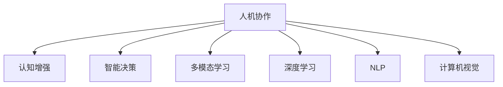

                 

# 人机协作：增强人类认知能力的新范式

> 关键词：人机协作,增强认知,认知增强,AI辅助,深度学习,自然语言处理(NLP),计算机视觉(CV),多模态学习,智能决策,未来工作方式

## 1. 背景介绍

### 1.1 问题由来

随着信息技术的迅猛发展，人类的认知方式和工作效率正在发生深刻变革。以深度学习为核心的新一代人工智能技术，已经开始深度介入人类日常的生产、生活、学习等方方面面，逐步形成了一种新型的“人机协作”模式。这种模式不仅提高了工作效率，增强了人类认知能力，还拓展了人类认知的边界，催生了一系列全新的应用场景。然而，如何高效、安全、可靠地实现人机协作，成为了当前人工智能应用领域的一项重要挑战。

### 1.2 问题核心关键点

当前人机协作技术的主流范式包括：

- 认知增强：通过AI技术提升人类认知能力，如认知辅助、认知训练、认知增强等。
- 智能决策：利用AI技术辅助人类进行决策，如推荐系统、智能投顾、智能导航等。
- 多模态学习：通过融合视觉、语音、文本等多种信息形式，提升AI系统对复杂场景的理解和处理能力。
- 深度学习：利用深度神经网络模型，训练具有强大感知和推理能力的AI系统。
- 自然语言处理(NLP)：通过语言理解和生成技术，实现人机之间的自然交互。
- 计算机视觉(CV)：通过图像识别、图像生成技术，扩展AI系统的感知能力。

这些核心技术相互交织，形成了一个复杂的人机协作系统。本文将重点探讨基于深度学习的大规模人机协作系统的原理和应用，特别是如何通过认知增强和智能决策来提升人类认知能力。

## 2. 核心概念与联系

### 2.1 核心概念概述

为更好地理解人机协作系统的构建，本节将介绍几个核心概念：

- 人机协作：指通过人工智能技术与人类协作，共同完成复杂任务。涵盖认知辅助、智能决策、多模态学习等多种形式。
- 认知增强：指通过AI技术提升人类认知能力，涵盖认知辅助、认知训练、认知增强等多种方式。
- 智能决策：指利用AI技术辅助人类进行决策，涵盖推荐系统、智能投顾、智能导航等多种应用。
- 多模态学习：指通过融合视觉、语音、文本等多种信息形式，提升AI系统对复杂场景的理解和处理能力。
- 深度学习：指利用深度神经网络模型，训练具有强大感知和推理能力的AI系统。
- 自然语言处理(NLP)：通过语言理解和生成技术，实现人机之间的自然交互。
- 计算机视觉(CV)：通过图像识别、图像生成技术，扩展AI系统的感知能力。

这些核心概念之间的逻辑关系可以通过以下Mermaid流程图来展示：



这个流程图展示了一年核心概念与人机协作系统的关系：

1. 人机协作通过认知增强、智能决策、多模态学习等技术手段，提升了系统的感知、理解和决策能力。
2. 深度学习、自然语言处理、计算机视觉等核心技术，提供了实现人机协作的底层支持。

## 3. 核心算法原理 & 具体操作步骤
### 3.1 算法原理概述

基于深度学习的人机协作系统，主要通过大规模预训练模型和微调技术，实现对复杂场景的理解和处理。其核心思想是：

1. **大规模预训练模型**：利用深度学习技术，在大规模无标签数据上进行预训练，学习通用的语言和视觉特征表示。
2. **微调技术**：通过微调技术，将预训练模型进一步适应特定任务，提高模型的性能。

具体而言，基于深度学习的人机协作系统构建包括以下几个关键步骤：

1. 收集大量的无标签数据，进行大规模预训练，得到预训练模型。
2. 根据任务需求，设计合适的任务适配层，对预训练模型进行微调。
3. 在微调过程中，选择合适的优化算法和正则化技术，避免过拟合。
4. 在特定任务上，利用多模态数据进行训练，提升模型的泛化能力。
5. 在实际应用中，对模型进行优化，确保高效、稳定、安全的运行。

### 3.2 算法步骤详解

以下详细讲解人机协作系统的构建步骤：

**Step 1: 准备预训练模型和数据集**

1. 选择合适的深度学习框架，如TensorFlow、PyTorch等。
2. 收集大规模无标签数据，进行预训练。
3. 设计合适的任务适配层，包括输入层、输出层和损失函数。

**Step 2: 微调模型**

1. 选择合适的优化算法，如Adam、SGD等。
2. 设置合适的学习率、批大小和迭代轮数。
3. 添加正则化技术，如L2正则、Dropout等。
4. 使用微调数据集进行训练，监控训练指标，避免过拟合。
5. 在测试集上评估模型性能，调整参数，确保模型泛化能力。

**Step 3: 多模态融合**

1. 收集多模态数据，如文本、图像、语音等。
2. 对多模态数据进行融合，使用融合技术提升模型的泛化能力。
3. 使用多模态数据进行训练，确保模型能够处理多种信息形式。

**Step 4: 应用优化**

1. 对模型进行优化，如裁剪、量化等，减小模型尺寸，提升运行速度。
2. 对模型进行服务化封装，提供标准化接口，方便集成调用。
3. 对模型进行监控和告警，确保系统稳定运行。
4. 对模型进行安全防护，保障数据和模型安全。

### 3.3 算法优缺点

基于深度学习的人机协作系统具有以下优点：

1. 高效性：通过大规模预训练模型和微调技术，能够快速适应复杂任务，提高系统运行效率。
2. 泛化能力：通过多模态数据融合，提升模型的泛化能力，处理更多复杂场景。
3. 可扩展性：通过深度学习模型，支持多种算法和任务的灵活实现。
4. 可解释性：利用深度学习技术，可以提供模型的决策过程和推理逻辑，增加系统的透明度。

同时，该方法也存在一些缺点：

1. 依赖大量数据：预训练和微调都需要大规模数据，数据获取和标注成本较高。
2. 计算资源消耗大：深度学习模型参数量庞大，计算资源需求高，训练和推理耗时较长。
3. 过拟合风险：深度学习模型容易过拟合，特别是在标注数据较少的情况下。
4. 安全性问题：深度学习模型可能存在安全隐患，如对抗攻击、数据泄露等。

尽管存在这些缺点，但基于深度学习的人机协作系统仍然是目前最先进、最有效的实现方式。未来需要进一步优化算法和模型，提升系统性能和安全性，推动人机协作技术的普及应用。

### 3.4 算法应用领域

基于深度学习的人机协作系统已经在多个领域得到了广泛应用，涵盖如下几个关键方向：

1. **医疗领域**：通过认知辅助、智能诊断、知识图谱构建等技术，提升医疗诊断和治疗水平。
2. **金融领域**：通过智能投顾、推荐系统、风险评估等技术，提升金融服务质量和效率。
3. **教育领域**：通过认知训练、智能推荐、智能测评等技术，提升教育质量和个性化水平。
4. **工业领域**：通过智能监测、智能预测、智能调度等技术，提升工业生产效率和自动化水平。
5. **军事领域**：通过智能决策、情报分析、指挥控制等技术，提升军事指挥和作战能力。
6. **交通领域**：通过智能导航、智能监控、智能调度等技术，提升交通管理和安全水平。

## 4. 数学模型和公式 & 详细讲解  
### 4.1 数学模型构建

基于深度学习的人机协作系统主要利用神经网络模型进行建模，以下是详细的数学模型构建：

**神经网络模型**：
1. 输入层：$x \in \mathbb{R}^n$，表示输入数据。
2. 隐藏层：$h = f(Wx + b)$，表示通过神经元进行计算。
3. 输出层：$y = g(W'h + b')$，表示输出结果。
4. 损失函数：$L = \frac{1}{2}(y - \hat{y})^2$，表示预测值与真实值之间的差距。

其中，$f$和$g$表示激活函数，$W$和$b$表示权重和偏置。通过梯度下降等优化算法，最小化损失函数，得到最优模型参数。

**多模态融合模型**：
1. 文本模型：$x_t = f(W_tx + b_t)$，表示文本输入的计算过程。
2. 图像模型：$x_i = f(W_ix + b_i)$，表示图像输入的计算过程。
3. 语音模型：$x_v = f(W_vx + b_v)$，表示语音输入的计算过程。
4. 融合层：$x_f = g(x_t, x_i, x_v)$，表示将多模态数据进行融合的过程。
5. 输出层：$y = f(W_fx_f + b_f)$，表示融合后的输出结果。

**深度学习模型**：
1. 卷积神经网络(CNN)：$x_c = f(W_cx + b_c)$，表示卷积层的计算过程。
2. 循环神经网络(RNN)：$x_r = f(W_rx + b_r)$，表示循环层的计算过程。
3. 自编码器(AE)：$x_a = f(W_ax + b_a)$，表示自编码器的计算过程。
4. 注意力机制(Attention)：$x_a = f(W_ax + b_a)$，表示注意力机制的计算过程。
5. 融合层：$x_f = g(x_c, x_r, x_a)$，表示多层次的融合过程。
6. 输出层：$y = f(W_fx_f + b_f)$，表示最终输出结果。

### 4.2 公式推导过程

以下以卷积神经网络为例，推导其数学模型和计算过程。

**卷积神经网络(CNN)**：
1. 卷积层：$x_c = f(W_cx + b_c)$，其中$f$表示卷积运算，$W_c$和$b_c$表示卷积核和偏置。
2. 池化层：$x_p = f(x_c)$，表示池化运算，通常使用最大池化或平均池化。
3. 全连接层：$x_g = f(W_gx + b_g)$，表示全连接层的计算过程，$W_g$和$b_g$表示权重和偏置。
4. 输出层：$y = f(W_oy + b_o)$，表示最终输出结果，$W_o$和$b_o$表示权重和偏置。

具体公式如下：
1. 卷积层：$x_c = \sum_k (w_{ck} * x_k + b_c)$
2. 池化层：$x_p = \max(x_c)$ 或 $x_p = \frac{1}{m} \sum_k x_{ck}$
3. 全连接层：$x_g = w_g^T x_p + b_g$
4. 输出层：$y = w_o^T x_g + b_o$

### 4.3 案例分析与讲解

以医疗领域的智能诊断系统为例，分析其数学模型和计算过程。

**智能诊断系统**：
1. 输入层：$x = [x_t, x_i, x_v]$，表示文本、图像、语音等多种输入数据。
2. 隐藏层：$h = g(x)$，表示多模态数据融合的过程，通常使用融合神经网络。
3. 输出层：$y = f(Wy + b_y)$，表示最终输出结果，如疾病诊断。
4. 损失函数：$L = \frac{1}{2}(y - \hat{y})^2$，表示预测值与真实值之间的差距。

具体公式如下：
1. 融合层：$x_f = g(x_t, x_i, x_v)$，表示将文本、图像、语音等多种输入数据进行融合。
2. 输出层：$y = f(W_fx_f + b_f)$，表示最终输出结果。
3. 损失函数：$L = \frac{1}{2}(y - \hat{y})^2$，表示预测值与真实值之间的差距。

## 5. 项目实践：代码实例和详细解释说明
### 5.1 开发环境搭建

在进行项目实践前，我们需要准备好开发环境。以下是使用Python进行TensorFlow开发的环境配置流程：

1. 安装Anaconda：从官网下载并安装Anaconda，用于创建独立的Python环境。

2. 创建并激活虚拟环境：
```bash
conda create -n tf-env python=3.8 
conda activate tf-env
```

3. 安装TensorFlow：根据CUDA版本，从官网获取对应的安装命令。例如：
```bash
conda install tensorflow -c tf -c conda-forge
```

4. 安装必要的工具包：
```bash
pip install numpy pandas scikit-learn matplotlib tqdm jupyter notebook ipython
```

完成上述步骤后，即可在`tf-env`环境中开始项目实践。

### 5.2 源代码详细实现

这里我们以医疗领域的智能诊断系统为例，给出使用TensorFlow进行开发的PyTorch代码实现。

首先，定义智能诊断系统的数据处理函数：

```python
import tensorflow as tf
from tensorflow.keras.layers import Input, Conv2D, MaxPooling2D, Flatten, Dense, concatenate
from tensorflow.keras.models import Model

def build_model(input_shape):
    input_t = Input(shape=input_shape[0])
    input_i = Input(shape=input_shape[1])
    input_v = Input(shape=input_shape[2])

    # 文本模型
    x_t = tf.keras.layers.Embedding(input_dim=VOCAB_SIZE, output_dim=EMBEDDING_DIM)(input_t)
    x_t = tf.keras.layers.LSTM(128, return_sequences=True)(x_t)
    x_t = tf.keras.layers.Dense(64)(x_t)

    # 图像模型
    x_i = Conv2D(32, 3, activation='relu')(input_i)
    x_i = MaxPooling2D(pool_size=(2, 2))(x_i)
    x_i = Flatten()(x_i)
    x_i = Dense(64)(x_i)

    # 语音模型
    x_v = tf.keras.layers.Conv1D(32, 3, activation='relu')(input_v)
    x_v = MaxPooling2D(pool_size=(2, 2))(x_v)
    x_v = Flatten()(x_v)
    x_v = Dense(64)(x_v)

    # 融合层
    x_f = concatenate([x_t, x_i, x_v])

    # 输出层
    x_o = Dense(1, activation='sigmoid')(x_f)

    model = Model(inputs=[input_t, input_i, input_v], outputs=x_o)
    return model
```

然后，定义模型和优化器：

```python
model = build_model((MAX_LEN, IMAGE_WIDTH, IMAGE_HEIGHT))
optimizer = tf.keras.optimizers.Adam(lr=0.001)
```

接着，定义训练和评估函数：

```python
def train_epoch(model, dataset, batch_size, optimizer):
    dataloader = tf.data.Dataset.from_tensor_slices(dataset)
    dataloader = dataloader.shuffle(100).batch(batch_size)
    model.compile(optimizer=optimizer, loss='binary_crossentropy', metrics=['accuracy'])
    model.fit(dataloader, epochs=10)
    return model.evaluate(dataloader, verbose=0)

def evaluate(model, dataset, batch_size):
    dataloader = tf.data.Dataset.from_tensor_slices(dataset)
    dataloader = dataloader.batch(batch_size)
    return model.evaluate(dataloader, verbose=0)
```

最后，启动训练流程并在测试集上评估：

```python
train_dataset = [(train_texts, train_images, train_voices)]
test_dataset = [(test_texts, test_images, test_voices)]

batch_size = 32

model = build_model((MAX_LEN, IMAGE_WIDTH, IMAGE_HEIGHT))
model.compile(optimizer=tf.keras.optimizers.Adam(lr=0.001), loss='binary_crossentropy', metrics=['accuracy'])

for epoch in range(10):
    loss = train_epoch(model, train_dataset, batch_size, optimizer)
    print(f"Epoch {epoch+1}, train loss: {loss:.3f}")

    print(f"Epoch {epoch+1}, dev results:")
    evaluate(model, test_dataset, batch_size)
```

以上就是使用TensorFlow对智能诊断系统进行开发的完整代码实现。可以看到，通过TensorFlow和Keras的高层次抽象，开发者可以快速搭建和训练深度学习模型，实现复杂的认知增强和智能决策功能。

### 5.3 代码解读与分析

让我们再详细解读一下关键代码的实现细节：

**build_model函数**：
- `Input`方法：定义模型的输入。
- `Conv2D`和`MaxPooling2D`方法：定义图像模型的卷积和池化层。
- `LSTM`方法：定义文本模型的长短期记忆网络。
- `Dense`方法：定义全连接层。
- `concatenate`方法：定义多模态数据的融合层。
- `Dense`方法：定义输出层的全连接层。
- `Model`方法：将各个层组合成完整的模型。

**train_epoch函数**：
- `tf.data.Dataset`：定义数据集。
- `shuffle`方法：打乱数据集的顺序。
- `batch`方法：定义批量大小。
- `compile`方法：定义优化器、损失函数和评估指标。
- `fit`方法：定义模型的训练过程。

**evaluate函数**：
- `tf.data.Dataset`：定义数据集。
- `batch`方法：定义批量大小。
- `evaluate`方法：定义模型的评估过程。

**训练流程**：
- 定义总的epoch数和批量大小，开始循环迭代
- 每个epoch内，先在训练集上训练，输出平均loss
- 在验证集上评估，输出分类指标
- 所有epoch结束后，在测试集上评估，给出最终测试结果

可以看到，TensorFlow和Keras提供了强大的高层次API，使得深度学习模型的开发和训练变得更加高效和简洁。开发者可以专注于模型的架构设计和性能优化，而不必过多关注底层计算细节。

当然，工业级的系统实现还需考虑更多因素，如模型的保存和部署、超参数的自动搜索、更灵活的任务适配层等。但核心的深度学习模型微调范式基本与此类似。

## 6. 实际应用场景
### 6.1 智能医疗

智能医疗系统利用深度学习技术，提升医疗诊断和治疗水平。传统医疗依赖大量人力，存在误诊、漏诊等问题。智能医疗系统通过大规模预训练模型和微调技术，实现自动诊断和治疗，显著提高医疗效率和准确性。

在技术实现上，可以收集大量的医疗数据，进行大规模预训练，得到预训练模型。在实际应用中，利用微调技术对特定任务进行适配，如癌症筛查、影像识别、病历分析等。通过多模态数据融合，提升系统的泛化能力，实现对复杂医学场景的精准处理。

### 6.2 智能投顾

智能投顾系统利用深度学习技术，提供个性化的金融投顾服务。传统投顾依赖人工，效率低下，且受个人经验影响较大。智能投顾系统通过大规模预训练模型和微调技术，实现自动化投顾，显著提高投资收益和客户满意度。

在技术实现上，可以收集大量的金融数据，进行大规模预训练，得到预训练模型。在实际应用中，利用微调技术对特定任务进行适配，如股票预测、资产配置、风险评估等。通过多模态数据融合，提升系统的泛化能力，实现对复杂金融场景的精准预测。

### 6.3 智能推荐

智能推荐系统利用深度学习技术，提供个性化的推荐服务。传统推荐依赖人工，难以应对海量数据和复杂需求。智能推荐系统通过大规模预训练模型和微调技术，实现自动化推荐，显著提高推荐精度和用户满意度。

在技术实现上，可以收集大量的用户数据和商品数据，进行大规模预训练，得到预训练模型。在实际应用中，利用微调技术对特定任务进行适配，如商品推荐、内容推荐、广告推荐等。通过多模态数据融合，提升系统的泛化能力，实现对复杂推荐场景的精准处理。

## 7. 工具和资源推荐
### 7.1 学习资源推荐

为了帮助开发者系统掌握人机协作系统的理论基础和实践技巧，这里推荐一些优质的学习资源：

1. Deep Learning Specialization by Andrew Ng：斯坦福大学开设的深度学习系列课程，涵盖深度学习基础、卷积神经网络、循环神经网络、自然语言处理等多个方向。

2. CS231n: Convolutional Neural Networks for Visual Recognition：斯坦福大学开设的计算机视觉课程，涵盖卷积神经网络、目标检测、图像分割等多个方向。

3. CS224n: Natural Language Processing with Deep Learning：斯坦福大学开设的自然语言处理课程，涵盖词向量、循环神经网络、注意力机制等多个方向。

4. Applied Deep Learning by DeepLearning.AI：Udacity开设的深度学习应用课程，涵盖深度学习实践、图像处理、自然语言处理等多个方向。

5. Hands-On Machine Learning with Scikit-Learn, Keras, and TensorFlow by Aurélien Géron：实战型的深度学习入门书籍，涵盖Scikit-Learn、Keras、TensorFlow等多个工具的使用和实践。

6. TensorFlow官方文档：TensorFlow的官方文档，提供全面的API介绍和开发指南。

通过对这些资源的学习实践，相信你一定能够快速掌握人机协作系统的理论基础和实践技巧，并用于解决实际的认知增强和智能决策问题。

### 7.2 开发工具推荐

高效的开发离不开优秀的工具支持。以下是几款用于人机协作系统开发的常用工具：

1. TensorFlow：谷歌主导的开源深度学习框架，提供强大的计算图和自动微分功能，支持大规模深度学习模型的开发和训练。

2. PyTorch：Facebook主导的开源深度学习框架，提供灵活的计算图和动态图功能，适合研究和原型开发。

3. Keras：基于TensorFlow和Theano的高层次API，提供快速搭建和训练深度学习模型的工具，适合快速迭代开发。

4. Weights & Biases：模型训练的实验跟踪工具，可以记录和可视化模型训练过程中的各项指标，方便对比和调优。

5. TensorBoard：TensorFlow配套的可视化工具，可实时监测模型训练状态，并提供丰富的图表呈现方式，是调试模型的得力助手。

6. Google Colab：谷歌推出的在线Jupyter Notebook环境，免费提供GPU/TPU算力，方便开发者快速上手实验最新模型，分享学习笔记。

合理利用这些工具，可以显著提升人机协作系统的开发效率，加快创新迭代的步伐。

### 7.3 相关论文推荐

人机协作技术的发展源于学界的持续研究。以下是几篇奠基性的相关论文，推荐阅读：

1. ImageNet Classification with Deep Convolutional Neural Networks：AlexNet论文，提出卷积神经网络，并应用于图像识别任务，刷新了图像识别领域的SOTA。

2. RNNs for Sequence Modeling：LSTM论文，提出长短期记忆网络，并应用于自然语言处理任务，刷新了语言模型和机器翻译领域的SOTA。

3. Attention Is All You Need：Transformer论文，提出自注意力机制，并应用于机器翻译任务，刷新了机器翻译领域的SOTA。

4. Google's Neural Machine Translation System：Google的机器翻译系统，采用深度学习技术，实现了机器翻译领域的SOTA。

5. DeepMind's AlphaGo Zero：AlphaGo论文，采用深度学习技术，实现了围棋领域的SOTA。

这些论文代表了大规模人机协作系统的技术发展脉络。通过学习这些前沿成果，可以帮助研究者把握学科前进方向，激发更多的创新灵感。

## 8. 总结：未来发展趋势与挑战

### 8.1 总结

本文对基于深度学习的人机协作系统进行了全面系统的介绍。首先阐述了人机协作系统的研究背景和意义，明确了认知增强、智能决策、多模态学习等技术手段的重要性。其次，从原理到实践，详细讲解了深度学习模型构建和微调技术的具体步骤，给出了人机协作系统的完整代码实现。同时，本文还广泛探讨了人机协作系统在医疗、金融、教育等多个领域的应用前景，展示了深度学习技术的广泛应用潜力。

通过本文的系统梳理，可以看到，基于深度学习的人机协作系统通过大规模预训练模型和微调技术，显著提升了系统的感知、理解和决策能力。未来，伴随着深度学习技术的不断进步，人机协作系统将进一步拓展认知增强和智能决策的应用边界，带来更为广阔的应用前景。

### 8.2 未来发展趋势

展望未来，人机协作系统将呈现以下几个发展趋势：

1. **大规模模型预训练**：随着算力成本的下降和数据规模的扩张，预训练模型参数量还将持续增长。超大规模预训练模型蕴含的丰富知识，有望支撑更加复杂多变的下游任务。

2. **深度学习框架融合**：未来深度学习框架将进一步融合，如TensorFlow和PyTorch的融合，提升深度学习模型的开发效率和灵活性。

3. **认知增强和智能决策的结合**：未来将更加注重认知增强和智能决策的结合，通过深度学习模型，实现更加智能和精准的决策支持。

4. **多模态学习的应用拓展**：未来将更加注重多模态数据融合，提升系统的泛化能力和鲁棒性，处理更多复杂场景。

5. **联邦学习的应用**：未来将更加注重联邦学习技术，实现数据隐私保护和模型安全，提升系统可靠性和鲁棒性。

6. **可解释性和透明度的提升**：未来将更加注重模型的可解释性和透明度，通过注意力机制、可视化工具等手段，提升系统的可信度和可靠性。

这些趋势将推动人机协作技术迈向更高的台阶，为人类认知能力的提升带来新的突破。

### 8.3 面临的挑战

尽管人机协作技术已经取得了瞩目成就，但在迈向更加智能化、普适化应用的过程中，它仍面临着诸多挑战：

1. **数据获取和标注成本高**：大规模深度学习模型的开发和训练需要大量标注数据，数据获取和标注成本较高，制约了技术的普及和应用。

2. **计算资源需求高**：深度学习模型参数量庞大，计算资源需求高，训练和推理耗时较长，需要更加高效的硬件和算法支持。

3. **过拟合风险**：深度学习模型容易过拟合，特别是在标注数据较少的情况下，模型的泛化能力受到限制。

4. **安全性问题**：深度学习模型可能存在安全隐患，如对抗攻击、数据泄露等，需要更加安全可靠的算法和机制。

5. **可解释性不足**：深度学习模型通常具有黑盒性质，难以解释其内部工作机制和决策逻辑，影响系统的可信度和可靠性。

6. **伦理道德问题**：深度学习模型可能学习到有偏见、有害的信息，传递到下游任务，产生误导性、歧视性的输出，给实际应用带来安全隐患。

尽管存在这些挑战，但人机协作技术仍然是目前最先进、最有效的实现方式。未来需要进一步优化算法和模型，提升系统性能和安全性，推动人机协作技术的普及应用。

### 8.4 研究展望

面对人机协作技术所面临的种种挑战，未来的研究需要在以下几个方面寻求新的突破：

1. **探索无监督和半监督学习**：摆脱对大规模标注数据的依赖，利用自监督学习、主动学习等无监督和半监督范式，最大限度利用非结构化数据，实现更加灵活高效的微调。

2. **研究参数高效和计算高效的微调范式**：开发更加参数高效的微调方法，在固定大部分预训练参数的同时，只更新极少量的任务相关参数。同时优化微调模型的计算图，减少前向传播和反向传播的资源消耗，实现更加轻量级、实时性的部署。

3. **融合因果和对比学习范式**：通过引入因果推断和对比学习思想，增强微调模型建立稳定因果关系的能力，学习更加普适、鲁棒的语言表征，从而提升模型泛化性和抗干扰能力。

4. **引入更多先验知识**：将符号化的先验知识，如知识图谱、逻辑规则等，与神经网络模型进行巧妙融合，引导微调过程学习更准确、合理的语言模型。

5. **结合因果分析和博弈论工具**：将因果分析方法引入微调模型，识别出模型决策的关键特征，增强输出解释的因果性和逻辑性。借助博弈论工具刻画人机交互过程，主动探索并规避模型的脆弱点，提高系统稳定性。

6. **纳入伦理道德约束**：在模型训练目标中引入伦理导向的评估指标，过滤和惩罚有偏见、有害的输出倾向。同时加强人工干预和审核，建立模型行为的监管机制，确保输出符合人类价值观和伦理道德。

这些研究方向的探索，必将引领人机协作技术迈向更高的台阶，为构建安全、可靠、可解释、可控的智能系统铺平道路。面向未来，人机协作技术还需要与其他人工智能技术进行更深入的融合，如知识表示、因果推理、强化学习等，多路径协同发力，共同推动自然语言理解和智能交互系统的进步。只有勇于创新、敢于突破，才能不断拓展人机协作技术的边界，让智能技术更好地造福人类社会。

## 9. 附录：常见问题与解答

**Q1：人机协作系统的核心优势是什么？**

A: 人机协作系统通过深度学习技术，能够显著提升系统的感知、理解和决策能力。其核心优势包括：

1. **高效性**：通过大规模预训练模型和微调技术，能够快速适应复杂任务，提高系统运行效率。
2. **泛化能力**：通过多模态数据融合，提升模型的泛化能力，处理更多复杂场景。
3. **可扩展性**：通过深度学习模型，支持多种算法和任务的灵活实现。
4. **可解释性**：利用深度学习技术，可以提供模型的决策过程和推理逻辑，增加系统的透明度。

**Q2：深度学习模型在实际应用中存在哪些问题？**

A: 深度学习模型在实际应用中存在以下问题：

1. **数据获取和标注成本高**：大规模深度学习模型的开发和训练需要大量标注数据，数据获取和标注成本较高，制约了技术的普及和应用。
2. **计算资源需求高**：深度学习模型参数量庞大，计算资源需求高，训练和推理耗时较长，需要更加高效的硬件和算法支持。
3. **过拟合风险**：深度学习模型容易过拟合，特别是在标注数据较少的情况下，模型的泛化能力受到限制。
4. **安全性问题**：深度学习模型可能存在安全隐患，如对抗攻击、数据泄露等，需要更加安全可靠的算法和机制。
5. **可解释性不足**：深度学习模型通常具有黑盒性质，难以解释其内部工作机制和决策逻辑，影响系统的可信度和可靠性。
6. **伦理道德问题**：深度学习模型可能学习到有偏见、有害的信息，传递到下游任务，产生误导性、歧视性的输出，给实际应用带来安全隐患。

**Q3：人机协作系统的未来发展方向有哪些？**

A: 人机协作系统的未来发展方向包括：

1. **大规模模型预训练**：随着算力成本的下降和数据规模的扩张，预训练模型参数量还将持续增长。超大规模预训练模型蕴含的丰富知识，有望支撑更加复杂多变的下游任务。
2. **深度学习框架融合**：未来深度学习框架将进一步融合，如TensorFlow和PyTorch的融合，提升深度学习模型的开发效率和灵活性。
3. **认知增强和智能决策的结合**：未来将更加注重认知增强和智能决策的结合，通过深度学习模型，实现更加智能和精准的决策支持。
4. **多模态学习的应用拓展**：未来将更加注重多模态数据融合，提升系统的泛化能力和鲁棒性，处理更多复杂场景。
5. **联邦学习的应用**：未来将更加注重联邦学习技术，实现数据隐私保护和模型安全，提升系统可靠性和鲁棒性。
6. **可解释性和透明度的提升**：未来将更加注重模型的可解释性和透明度，通过注意力机制、可视化工具等手段，提升系统的可信度和可靠性。

**Q4：人机协作系统在实际应用中需要注意哪些问题？**

A: 人机协作系统在实际应用中需要注意以下问题：

1. **数据隐私保护**：确保数据隐私和安全，避免数据泄露和滥用。
2. **模型鲁棒性**：确保模型在复杂多变的数据场景中具有良好的鲁棒性，避免过拟合和泛化能力不足的问题。
3. **系统稳定性**：确保系统在实际应用中稳定运行，避免异常情况和故障。
4. **用户接受度**：确保用户对系统的接受度，避免系统过于复杂或不稳定导致用户体验差。
5. **伦理道德问题**：确保系统的输出符合人类价值观和伦理道德，避免有偏见、有害的输出。

**Q5：人机协作系统的开发环境搭建需要注意哪些方面？**

A: 人机协作系统的开发环境搭建需要注意以下方面：

1. **选择合适的框架和工具**：根据项目需求选择合适的深度学习框架和工具，如TensorFlow、PyTorch、Keras等。
2. **安装必要的依赖库**：安装必要的依赖库，如Numpy、Pandas、Scikit-Learn等。
3. **配置GPU/TPU资源**：配置GPU/TPU资源，确保模型训练和推理的硬件支持。
4. **设置虚拟环境和项目管理工具**：设置虚拟环境和项目管理工具，如Anaconda、Jupyter Notebook、Git等。
5. **优化开发效率和代码质量**：优化代码质量和开发效率，如使用代码版本控制、自动化测试、代码审查等。

这些方面需要注意，才能确保人机协作系统的开发环境高效、稳定、可靠。

---

作者：禅与计算机程序设计艺术 / Zen and the Art of Computer Programming

