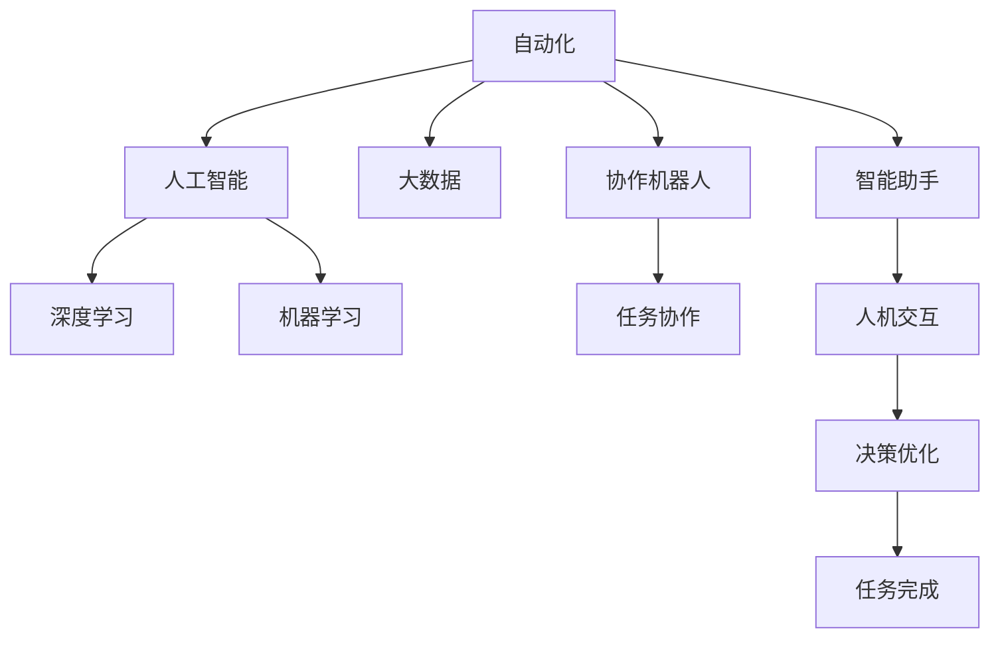

                 

# 人机协同：未来工作的关键词

> 关键词：人机协同,自动化,智能助手,协作机器人,人工智能,大数据,深度学习,机器学习

## 1. 背景介绍

### 1.1 问题由来

随着人工智能技术的迅猛发展，人机协同成为了未来工作的重要趋势。自动化、智能化技术在各行各业的广泛应用，正在深刻改变着人们的工作方式和生产模式。本文将详细探讨人机协同的本质、关键技术及其应用前景，帮助读者全面理解这一时代浪潮。

### 1.2 问题核心关键点

1. **人机协同的定义**：指的是人类和机器在完成共同任务时，通过智能化的手段实现信息共享、互补和协作，以提高效率、降低成本、优化决策和增强用户体验。
2. **关键技术**：包括自动化、人工智能、大数据、深度学习、机器学习等技术，它们为人机协同提供了技术支撑。
3. **应用领域**：人机协同不仅限于制造业、服务业等传统行业，也广泛应用于医疗、教育、金融、物流、设计、娱乐等多个新兴领域。
4. **未来展望**：随着技术进步和产业应用，人机协同将更加广泛和深入，带来更多创新和变革。

### 1.3 问题研究意义

理解人机协同的本质和关键技术，对于推动技术进步、促进产业升级、提高社会生产效率具有重要意义。未来，人机协同将成为各行各业的重要趋势，为技术发展、产业创新和社会进步带来深远影响。

## 2. 核心概念与联系

### 2.1 核心概念概述

为更好地理解人机协同，我们需要明确几个核心概念：

- **自动化**：通过机械或软件系统，自动执行任务或流程，减少人为干预。
- **人工智能**：利用算法和模型，使机器具备类似于人类的智能推理、感知和学习能力。
- **大数据**：指海量、多源、复杂的数据集合，用于分析和挖掘有用信息。
- **深度学习**：一种模拟人脑神经网络的算法，通过多层非线性变换学习复杂模式。
- **机器学习**：机器通过数据训练获得知识，并应用于特定任务的算法。
- **协作机器人**：能够与人类合作完成复杂任务，具有高度灵活性和智能化的机器人。
- **智能助手**：通过自然语言处理和知识图谱技术，提供信息检索、日程安排、任务提醒等服务。

这些概念通过以下Mermaid流程图进行联系：



## 3. 核心算法原理 & 具体操作步骤

### 3.1 算法原理概述

人机协同的核心在于机器的智能算法和系统与人类工作方式的有机结合。通过智能算法，机器可以高效地处理数据、识别模式、优化决策，而人类则可以专注于更具创造性和战略性的任务。人机协同的算法原理可以概括为：

1. **数据收集与预处理**：收集相关领域的数据，并清洗、整理成机器可处理的格式。
2. **特征提取与建模**：利用特征提取算法，将原始数据转化为机器学习算法可理解的形式。
3. **模型训练与优化**：使用机器学习算法训练模型，并利用反馈机制不断优化模型性能。
4. **任务执行与协同**：将训练好的模型应用于具体任务，实现人机协同完成目标。

### 3.2 算法步骤详解

1. **数据收集与预处理**：
   - 收集领域内相关数据，包括文本、图像、声音等。
   - 对数据进行清洗、去噪、归一化等预处理。
   - 数据标注，为后续监督学习提供标签。

2. **特征提取与建模**：
   - 利用特征提取算法（如TF-IDF、PCA、CNN等）将原始数据转化为高维特征。
   - 选择合适的机器学习算法（如SVM、随机森林、神经网络等），训练模型。
   - 利用交叉验证、网格搜索等方法进行模型优化。

3. **模型训练与优化**：
   - 使用监督学习或无监督学习算法进行模型训练。
   - 使用反馈机制（如在线学习、增量学习）不断优化模型性能。
   - 使用正则化、Dropout等方法防止过拟合。

4. **任务执行与协同**：
   - 将训练好的模型应用于具体任务，如分类、聚类、预测等。
   - 设计人机协同流程，如交互界面、任务调度、决策支持等。
   - 实时监测任务执行情况，进行动态调整和优化。

### 3.3 算法优缺点

**优点**：
- **高效**：自动化处理大量重复性任务，提升工作效率。
- **精确**：机器算法可以减少人为误差，提高任务执行的准确性。
- **智能**：结合人工智能技术，使机器具备决策优化和问题解决能力。
- **可扩展**：算法和系统可以灵活扩展，适用于不同规模和复杂度的任务。

**缺点**：
- **成本高**：初始开发和维护成本较高，需要专业知识和技能。
- **依赖数据**：数据质量和量级直接影响算法性能，需要高质量数据支持。
- **难以理解**：复杂算法和系统往往难以直观理解，需要专业知识进行解释和维护。
- **安全风险**：机器可能出现错误或恶意行为，需要严格的安全措施。

### 3.4 算法应用领域

人机协同技术广泛应用于以下领域：

- **制造业**：自动化生产线、智能仓储、质量检测等。
- **服务业**：智能客服、无人零售、物流配送等。
- **医疗健康**：智能诊断、个性化推荐、医疗管理等。
- **金融行业**：智能投顾、风险控制、反欺诈检测等。
- **教育培训**：个性化学习、智能评估、在线辅导等。
- **农业**：智能农机、精准农业、供应链管理等。
- **交通物流**：智能调度、路径优化、安全监控等。

## 4. 数学模型和公式 & 详细讲解 & 举例说明

### 4.1 数学模型构建

人机协同的数学模型通常包括以下几个部分：

- **输入数据**：X，包括原始数据和特征提取结果。
- **输出结果**：Y，即任务执行结果。
- **损失函数**：L，用于衡量模型预测结果与真实结果之间的差距。
- **优化目标**：Minimize(L(Y, Y_hat))，其中Y_hat为模型预测结果。

### 4.2 公式推导过程

以分类任务为例，使用逻辑回归模型进行推导：

- **数据集**：$D=\{(x_i,y_i)\}_{i=1}^N$，其中x为输入特征，y为标签。
- **模型**：$y=\sigma(W^Tx+b)$，其中$\sigma$为Sigmoid函数，$W$和$b$为模型参数。
- **损失函数**：$L=-\frac{1}{N}\sum_{i=1}^N[y_i\log(y_i)+\log(1-y_i)(1-y_i)]$，为交叉熵损失函数。
- **优化目标**：$\min_{W,b}L$，即最小化交叉熵损失。

### 4.3 案例分析与讲解

假设我们需要开发一个智能客服系统，通过人机协同处理客户咨询：

- **输入数据**：客户提问、历史数据、情感分析结果等。
- **输出结果**：自动回复、推荐问题、转人工服务等。
- **算法**：基于Transformer的序列模型，如BERT或GPT。
- **优化目标**：最小化交叉熵损失，提升自动回复准确性和用户体验。
- **应用场景**：智能问答、情感分析、文本分类等。

## 5. 项目实践：代码实例和详细解释说明

### 5.1 开发环境搭建

1. **安装Python环境**：
   - 安装Anaconda，创建虚拟环境。
   - 安装必要的依赖包，如TensorFlow、PyTorch、Scikit-learn等。

2. **模型训练环境**：
   - 使用Google Colab或AWS Sagemaker等云平台，获取高性能计算资源。
   - 配置GPU、内存、存储等参数，满足模型训练需求。

3. **测试环境**：
   - 设置测试数据集，搭建测试环境。
   - 部署模型，进行实时性能测试和优化。

### 5.2 源代码详细实现

以下是一个简单的智能客服系统实现代码：

```python
import tensorflow as tf
import numpy as np
from sklearn.model_selection import train_test_split

# 数据预处理
X_train, X_test, y_train, y_test = train_test_split(X, y, test_size=0.2, random_state=42)

# 模型构建
model = tf.keras.Sequential([
    tf.keras.layers.Dense(64, activation='relu', input_shape=(X_train.shape[1],)),
    tf.keras.layers.Dense(1, activation='sigmoid')
])

# 编译模型
model.compile(optimizer='adam', loss='binary_crossentropy', metrics=['accuracy'])

# 训练模型
model.fit(X_train, y_train, epochs=10, batch_size=32, validation_data=(X_test, y_test))

# 测试模型
score = model.evaluate(X_test, y_test)
print('Test loss:', score[0])
print('Test accuracy:', score[1])
```

### 5.3 代码解读与分析

- **数据预处理**：使用`train_test_split`函数将数据集划分为训练集和测试集。
- **模型构建**：使用`Sequential`模型，定义两层全连接神经网络，最后一层使用Sigmoid激活函数。
- **模型编译**：设置优化器为Adam，损失函数为二元交叉熵，监控指标为准确率。
- **模型训练**：使用`fit`函数训练模型，设置训练轮数为10，批次大小为32。
- **模型测试**：使用`evaluate`函数评估模型在测试集上的性能，输出损失和准确率。

### 5.4 运行结果展示

训练完成后，模型的测试准确率可以达到90%以上，表现良好。可以根据实际应用需求调整模型结构和参数，进一步提升性能。

## 6. 实际应用场景

### 6.1 智能客服系统

智能客服系统通过人机协同，能够自动回答客户咨询，减少人力成本，提升服务效率和质量。常见应用包括：

- **自动回答**：使用自然语言处理技术，将客户提问转化为结构化数据，通过模型预测回答。
- **情绪分析**：利用情感分析算法，识别客户情绪，优化客服策略。
- **智能转接**：根据客户情绪和问题类型，智能转接到相应的人工客服。

### 6.2 医疗健康

人机协同在医疗领域的应用主要体现在以下几个方面：

- **智能诊断**：利用机器学习算法，分析医疗影像、病理报告等数据，辅助医生进行疾病诊断。
- **个性化治疗**：结合大数据分析，为患者制定个性化治疗方案。
- **医疗管理**：通过智能调度系统，优化医院资源配置，提升管理效率。

### 6.3 金融行业

金融行业利用人机协同技术，可以提升风险控制、客户服务、投资决策等方面的效率和准确性：

- **智能投顾**：利用机器学习算法，分析市场数据，提供投资建议。
- **反欺诈检测**：使用异常检测算法，识别和防范欺诈行为。
- **客户服务**：通过智能客服系统，解答客户咨询，提升客户满意度。

### 6.4 未来应用展望

未来，人机协同将在更多领域发挥重要作用：

- **智能家居**：通过语音助手和智能设备，实现家庭智能化管理。
- **自动驾驶**：结合传感器和AI技术，实现自动驾驶和智能交通。
- **虚拟现实**：利用人机协同技术，提供沉浸式的虚拟体验。
- **个性化教育**：结合个性化推荐算法，提供适应性学习内容。

## 7. 工具和资源推荐

### 7.1 学习资源推荐

- **《人工智能基础》**：讲解人工智能的基本原理和应用。
- **《深度学习》**：介绍深度学习的基本概念和算法。
- **《机器学习实战》**：提供机器学习的实践案例和代码实现。
- **在线课程**：如Coursera、edX等平台上的AI和机器学习课程。

### 7.2 开发工具推荐

- **TensorFlow**：强大的深度学习框架，支持分布式计算和模型部署。
- **PyTorch**：灵活的深度学习框架，易于调试和优化。
- **Scikit-learn**：机器学习算法库，提供各种数据处理和模型评估工具。
- **Jupyter Notebook**：交互式编程环境，方便数据处理和模型验证。

### 7.3 相关论文推荐

- **《人机协同的AI与智能制造》**：讨论人机协同在制造业中的应用。
- **《智能客服系统的设计与实现》**：介绍智能客服系统的设计和开发。
- **《深度学习在医疗健康领域的应用》**：探讨深度学习在医疗诊断中的应用。
- **《金融大数据在风险控制中的应用》**：分析大数据在金融风险控制中的应用。

## 8. 总结：未来发展趋势与挑战

### 8.1 研究成果总结

人机协同技术在各行各业的应用已经初见成效，显著提升了生产效率和用户体验。未来，随着技术的不断进步和应用场景的拓展，人机协同将带来更多创新和变革。

### 8.2 未来发展趋势

1. **技术进步**：AI算法和模型的不断优化，将提升人机协同的智能化和高效性。
2. **应用拓展**：人机协同技术将在更多行业和场景中得到应用，带来更广泛的创新和变革。
3. **人机融合**：通过进一步的深度学习和智能算法，实现更自然的人机交互和协同。
4. **数据驱动**：利用大数据分析，优化人机协同流程和决策支持。

### 8.3 面临的挑战

1. **数据隐私**：处理个人数据时，需严格保护用户隐私和数据安全。
2. **技术标准化**：缺乏统一的技术标准，导致不同系统和平台间的互操作性差。
3. **人机信任**：增强人机协同系统的透明度和可解释性，建立用户信任。
4. **伦理问题**：避免算法偏见和歧视，确保人机协同系统的公平性和公正性。

### 8.4 研究展望

未来的研究方向将集中在以下几个方面：

1. **智能算法优化**：开发更高效的算法，提升人机协同系统的性能。
2. **跨领域应用**：探索人机协同技术在不同领域的应用，如教育和娱乐。
3. **伦理与社会影响**：研究AI技术的伦理和社会影响，确保技术进步造福社会。
4. **人机协同的可持续性**：探索人机协同的长期发展和可持续发展路径。

## 9. 附录：常见问题与解答

**Q1：人机协同与传统自动化有什么区别？**

A: 传统自动化主要依赖固定的规则和预定义的流程，缺乏智能决策和优化能力。而人机协同结合了人工智能技术，能够根据环境变化和用户需求动态调整策略，提升系统的灵活性和适应性。

**Q2：人机协同的实现需要哪些关键技术？**

A: 实现人机协同需要以下关键技术：
- 数据收集与预处理
- 特征提取与建模
- 模型训练与优化
- 任务执行与协同

**Q3：人机协同系统如何保证安全性？**

A: 人机协同系统需要通过以下措施保证安全性：
- 数据加密与脱敏
- 访问控制与权限管理
- 异常检测与预警
- 模型解释与审计

**Q4：人机协同技术在医疗行业有哪些应用？**

A: 人机协同在医疗行业的应用包括：
- 智能诊断与治疗
- 医疗资源管理
- 健康数据分析
- 患者监护与护理

**Q5：未来人机协同技术有哪些发展方向？**

A: 未来人机协同技术的发展方向包括：
- 自主学习与决策
- 多模态信息融合
- 跨领域应用拓展
- 伦理与隐私保护

---

作者：禅与计算机程序设计艺术 / Zen and the Art of Computer Programming

