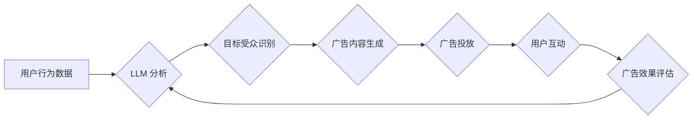

                 

## 广告和 LLM：高效的针对性营销

> 关键词：LLM, 大语言模型, 广告营销, 针对性营销, 个性化推荐, 自然语言处理, 深度学习

### 1. 背景介绍

广告营销一直是商业世界中不可或缺的一部分，其目标是将产品或服务推向目标受众，并最终促成销售。随着互联网和移动技术的蓬勃发展，广告营销形式也发生了巨大变化，从传统的电视广告、报纸广告逐渐演变为更精准、更个性化的数字广告。

然而，传统的广告营销方式面临着诸多挑战：

* **信息过载:** 用户每天接触大量的广告信息，导致广告疲劳和忽视。
* **精准度不足:** 传统的广告投放方式难以精准地锁定目标受众，导致广告成本高且效果不佳。
* **缺乏互动性:** 传统的广告形式缺乏互动性，难以与用户建立情感连接。

近年来，大语言模型 (LLM) 的快速发展为广告营销带来了新的机遇。LLM 拥有强大的自然语言理解和生成能力，能够理解用户需求，生成个性化的广告内容，并与用户进行互动，从而提升广告的精准度、互动性和转化率。

### 2. 核心概念与联系

#### 2.1  LLM 简介

大语言模型 (LLM) 是一种基于深度学习的强大人工智能模型，能够理解和生成人类语言。LLM 通过训练海量文本数据，学习语言的语法、语义和上下文关系，从而具备以下能力：

* **文本生成:**  LLM 可以生成各种类型的文本，例如文章、故事、诗歌、代码等。
* **文本理解:** LLM 可以理解文本的含义，例如识别情感、主题、实体等。
* **对话生成:** LLM 可以与用户进行自然流畅的对话。
* **翻译:** LLM 可以将文本从一种语言翻译成另一种语言。

#### 2.2  广告营销与 LLM 的结合

LLM 的强大能力可以应用于广告营销的各个环节，例如：

* **广告创意生成:** LLM 可以根据目标受众的兴趣和需求，生成个性化的广告文案和创意。
* **目标受众识别:** LLM 可以分析用户行为和语言特征，识别潜在的广告目标受众。
* **广告投放优化:** LLM 可以根据广告效果数据，优化广告投放策略，提高广告转化率。
* **用户互动增强:** LLM 可以与用户进行个性化的对话，增强用户体验，提高广告粘性。

#### 2.3  LLM 在广告营销中的流程



### 3. 核心算法原理 & 具体操作步骤

#### 3.1  算法原理概述

LLM 在广告营销中的应用主要基于以下核心算法：

* **Transformer 模型:** Transformer 模型是一种深度学习模型，能够有效地处理序列数据，例如文本。它通过注意力机制，学习文本中的长距离依赖关系，从而提升文本理解和生成能力。
* **自然语言处理 (NLP) 技术:** NLP 技术包括词嵌入、文本分类、情感分析等，能够帮助 LLMs 理解用户需求和广告内容。
* **机器学习 (ML) 算法:** ML 算法，例如回归算法和分类算法，能够帮助 LLMs 预测广告效果和优化广告投放策略。

#### 3.2  算法步骤详解

1. **数据收集和预处理:** 收集用户行为数据、广告数据和文本数据，并进行清洗、格式化和标注。
2. **LLM 训练:** 使用 Transformer 模型训练 LLM，并根据广告营销任务进行微调。
3. **目标受众识别:** 利用 LLM 分析用户行为数据和语言特征，识别潜在的广告目标受众。
4. **广告内容生成:** 根据目标受众的兴趣和需求，利用 LLM 生成个性化的广告文案和创意。
5. **广告投放优化:** 利用 ML 算法分析广告效果数据，优化广告投放策略，提高广告转化率。
6. **用户互动增强:** 利用 LLM 与用户进行个性化的对话，增强用户体验，提高广告粘性。

#### 3.3  算法优缺点

**优点:**

* **精准度高:** LLM 可以根据用户行为和语言特征，精准地识别目标受众。
* **个性化强:** LLM 可以生成个性化的广告内容，提升用户体验。
* **互动性高:** LLM 可以与用户进行互动，增强广告粘性。

**缺点:**

* **数据依赖性强:** LLM 的性能取决于训练数据的质量和数量。
* **计算资源消耗大:** 训练和部署 LLM 需要大量的计算资源。
* **伦理风险:** LLM 可能被用于生成虚假信息或进行恶意营销。

#### 3.4  算法应用领域

LLM 在广告营销领域的应用非常广泛，例如：

* **搜索引擎广告:** 根据用户搜索关键词，生成个性化的广告内容。
* **社交媒体广告:** 根据用户兴趣和行为，精准投放广告。
* **电商广告:** 根据用户购买历史和浏览记录，推荐个性化的商品广告。
* **内容营销:** 利用 LLM 生成高质量的广告内容，吸引用户关注。

### 4. 数学模型和公式 & 详细讲解 & 举例说明

#### 4.1  数学模型构建

LLM 的训练过程本质上是一个优化问题，目标是找到一个模型参数，使得模型在训练数据上表现最佳。常用的数学模型包括：

* **交叉熵损失函数:** 用于衡量模型预测结果与真实标签之间的差异。

$$
Loss = - \sum_{i=1}^{N} y_i \log(p_i)
$$

其中：

* $N$ 是样本数量
* $y_i$ 是真实标签
* $p_i$ 是模型预测概率

* **梯度下降算法:** 用于更新模型参数，使得损失函数最小化。

#### 4.2  公式推导过程

梯度下降算法的核心思想是迭代地更新模型参数，沿着损失函数梯度的负方向移动，直到找到损失函数的最小值。

具体公式如下：

$$
\theta_{t+1} = \theta_t - \alpha \nabla Loss(\theta_t)
$$

其中：

* $\theta$ 是模型参数
* $t$ 是迭代次数
* $\alpha$ 是学习率
* $\nabla Loss(\theta_t)$ 是损失函数在当前参数 $\theta_t$ 处的梯度

#### 4.3  案例分析与讲解

假设我们训练一个 LLM 用于文本分类任务，目标是将文本分类为正类或负类。

* 训练数据包含 1000 个文本样本，每个样本都有对应的标签。
* 模型参数 $\theta$ 包含词嵌入向量、隐藏层权重等。
* 损失函数为交叉熵损失函数。
* 梯度下降算法用于更新模型参数。

通过训练过程，模型会不断调整参数，使得在训练数据上分类准确率越来越高。最终，模型能够将新的文本样本准确地分类为正类或负类。

### 5. 项目实践：代码实例和详细解释说明

#### 5.1  开发环境搭建

* **操作系统:** Linux 或 macOS
* **编程语言:** Python
* **深度学习框架:** TensorFlow 或 PyTorch
* **其他工具:** Git、Jupyter Notebook

#### 5.2  源代码详细实现

```python
# 使用 TensorFlow 框架实现一个简单的文本分类模型

import tensorflow as tf

# 定义模型结构
model = tf.keras.models.Sequential([
    tf.keras.layers.Embedding(input_dim=vocab_size, output_dim=embedding_dim),
    tf.keras.layers.LSTM(units=128),
    tf.keras.layers.Dense(units=1, activation='sigmoid')
])

# 编译模型
model.compile(optimizer='adam',
              loss='binary_crossentropy',
              metrics=['accuracy'])

# 训练模型
model.fit(x_train, y_train, epochs=10)

# 评估模型
loss, accuracy = model.evaluate(x_test, y_test)
print('Loss:', loss)
print('Accuracy:', accuracy)
```

#### 5.3  代码解读与分析

* **Embedding 层:** 将文本单词映射到低维向量空间，捕捉单词之间的语义关系。
* **LSTM 层:** 是一种循环神经网络，能够处理序列数据，例如文本。
* **Dense 层:** 全连接层，用于将 LSTM 层的输出映射到分类结果。
* **Adam 优化器:** 用于更新模型参数，加速训练过程。
* **Binary Crossentropy 损失函数:** 用于衡量模型预测结果与真实标签之间的差异，适用于二分类任务。

#### 5.4  运行结果展示

训练完成后，模型会输出训练过程中的损失值和准确率。

### 6. 实际应用场景

#### 6.1  搜索引擎广告

LLM 可以根据用户的搜索关键词，分析用户的意图，并生成个性化的广告内容，例如推荐相关的商品、服务或信息。

#### 6.2  社交媒体广告

LLM 可以分析用户的兴趣爱好、行为特征和社交关系，精准地识别目标受众，并投放个性化的广告，提高广告转化率。

#### 6.3  电商广告

LLM 可以根据用户的购买历史、浏览记录和购物车内容，推荐个性化的商品广告，提升用户购物体验。

#### 6.4  未来应用展望

LLM 在广告营销领域的应用前景广阔，未来可能出现以下应用场景：

* **个性化广告创意生成:** LLM 可以根据用户的兴趣和需求，生成更具吸引力和创意的广告文案和视觉效果。
* **智能广告投放:** LLM 可以根据用户的行为和反馈，智能地调整广告投放策略，提高广告效果。
* **用户与广告的互动增强:** LLM 可以与用户进行自然流畅的对话，增强用户体验，提高广告粘性。

### 7. 工具和资源推荐

#### 7.1  学习资源推荐

* **书籍:**
    * 《深度学习》 by Ian Goodfellow, Yoshua Bengio, and Aaron Courville
    * 《自然语言处理入门》 by Jacob Eisenstein
* **在线课程:**
    * Coursera: Natural Language Processing Specialization
    * Udacity: Deep Learning Nanodegree

#### 7.2  开发工具推荐

* **深度学习框架:** TensorFlow, PyTorch
* **文本处理工具:** NLTK, SpaCy
* **云计算平台:** AWS, Google Cloud, Azure

#### 7.3  相关论文推荐

* **BERT: Pre-training of Deep Bidirectional Transformers for Language Understanding**
* **GPT-3: Language Models are Few-Shot Learners**
* **T5: Text-to-Text Transfer Transformer**

### 8. 总结：未来发展趋势与挑战

#### 8.1  研究成果总结

LLM 在广告营销领域的应用取得了显著成果，例如提高广告精准度、个性化程度和互动性。

#### 8.2  未来发展趋势

* **模型规模和能力提升:** 未来 LLM 的规模和能力将会进一步提升，能够处理更复杂的任务，生成更精细的广告内容。
* **多模态广告营销:** LLM 将与其他模态数据，例如图像和视频，融合在一起，实现多模态广告营销。
* **伦理和可解释性:** 随着 LLM 应用的普及，伦理和可解释性问题将更加重要，需要研究如何确保 LLM 的公平、透明和可控性。

#### 8.3  面临的挑战

* **数据隐私和安全:** LLM 的训练需要大量用户数据，如何保护用户隐私和数据安全是一个重要挑战。
* **模型偏见和歧视:** LLM 可能存在模型偏见和歧视问题，需要研究如何 mitigate 这些问题。
* **计算资源消耗:** 训练和部署大型 LLM 需要大量的计算资源，如何降低计算成本是一个挑战。

#### 8.4  研究展望

未来，LLM 在广告营销领域的应用将更加广泛和深入，需要进一步研究以下问题：

* 如何开发更安全、更可靠、更可解释的 LLM 模型？
* 如何更好地利用多模态数据，实现更智能的广告营销？
* 如何应对 LLM 应用带来的伦理和社会挑战？


### 9. 附录：常见问题与解答

#### 9.1  LLM 是否会取代广告营销人员？

LLM 可以自动化一些广告营销任务，例如广告创意生成和投放优化，但它并不会完全取代广告营销人员。广告营销仍然需要创意、策略和人际交往能力，这些都是 LLM 无法替代的。

#### 9.2  如何确保 LLM 生成的广告内容是准确和可靠的？

LLM 的训练数据可能会包含错误信息，因此生成的广告内容也可能存在问题。需要对 LLM 生成的广告内容进行人工审核，确保其准确性和可靠性。

#### 9.3  如何保护用户隐私和数据安全？

在使用 LLM 进行广告营销时，需要采取措施保护用户隐私和数据安全，例如：

* 使用匿名化技术处理用户数据。
* 获得用户明确的同意，才能使用其数据进行广告营销。
* 加强数据安全防护措施，防止数据泄露。


作者：禅与计算机程序设计艺术 / Zen and the Art of Computer Programming<end_of_turn>

