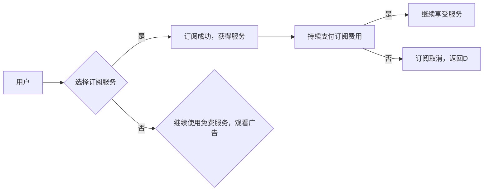

                 

## 广告时代结束：订阅制模式的崛起

> 关键词：订阅制、广告模式、商业模式、用户体验、数据驱动、人工智能、个性化推荐

### 1. 背景介绍

互联网时代，广告模式作为主要的商业模式，支撑着无数网站、平台和应用的运营。然而，随着用户对广告的疲劳感日益加剧，以及数据隐私和安全问题日益突出，传统的广告模式面临着前所未有的挑战。

近年来，订阅制模式逐渐成为一种备受关注的商业模式，它以持续的订阅费用为基础，为用户提供更优质、更个性化的服务体验。订阅制模式的崛起，标志着互联网商业模式的又一次重大变革，也预示着广告时代即将结束。

### 2. 核心概念与联系

#### 2.1 订阅制模式

订阅制模式是指用户支付一定的费用，定期获得特定产品或服务的权利。订阅制模式可以分为以下几种类型：

* **按需订阅:** 用户根据自己的需求，选择订阅特定服务或内容。
* **固定订阅:** 用户支付固定费用，获得特定服务或内容的长期使用权。
* **混合订阅:** 用户可以选择订阅不同类型的服务或内容，并根据自己的需求调整订阅内容和费用。

#### 2.2 广告模式

广告模式是指通过向用户展示广告来获取收入的商业模式。广告模式可以分为以下几种类型：

* **展示广告:** 在网站或应用中展示图片、视频或文本广告。
* **搜索广告:** 在搜索引擎结果页中展示与用户搜索词相关的广告。
* **社交媒体广告:** 在社交媒体平台上展示针对特定用户群体的广告。

#### 2.3 订阅制与广告模式的联系

订阅制模式和广告模式在本质上是两种不同的商业模式，但它们之间也存在着一定的联系。

* **互补关系:** 在某些情况下，订阅制模式和广告模式可以相互补充。例如，一些平台可以提供免费的基础服务，并通过展示广告来获取收入，同时也可以提供付费订阅服务，为用户提供更优质的体验。
* **竞争关系:** 随着订阅制模式的崛起，广告模式面临着越来越大的竞争压力。一些用户开始厌倦广告，并愿意为更优质的体验付费。

**Mermaid 流程图**



### 3. 核心算法原理 & 具体操作步骤

#### 3.1 算法原理概述

订阅制模式的核心算法原理在于用户行为分析和个性化推荐。通过对用户的行为数据进行分析，可以了解用户的兴趣爱好、消费习惯等信息，从而为用户提供更精准、更个性化的服务推荐。

#### 3.2 算法步骤详解

1. **数据收集:** 收集用户的行为数据，例如浏览历史、购买记录、评价反馈等。
2. **数据清洗:** 对收集到的数据进行清洗和处理，去除无效数据和噪声数据。
3. **特征提取:** 从用户行为数据中提取特征，例如用户偏好、消费能力、使用频率等。
4. **模型训练:** 使用机器学习算法，对用户特征进行建模，构建用户画像。
5. **个性化推荐:** 根据用户的画像，推荐个性化的订阅服务或内容。
6. **反馈机制:** 收集用户的反馈信息，不断优化模型和推荐策略。

#### 3.3 算法优缺点

**优点:**

* **精准推荐:** 能够根据用户的兴趣爱好和需求，提供更精准的推荐。
* **提升用户体验:** 为用户提供更个性化的服务体验，提高用户粘性。
* **增加收入:** 通过精准推荐，提高用户转化率，增加订阅收入。

**缺点:**

* **数据依赖:** 算法的准确性依赖于数据的质量和数量。
* **算法复杂:** 建立和维护用户画像模型需要复杂的算法和技术。
* **隐私安全:** 用户行为数据收集和使用需要考虑隐私安全问题。

#### 3.4 算法应用领域

订阅制模式的算法应用领域非常广泛，例如：

* **流媒体平台:** 推荐影视、音乐、游戏等内容。
* **新闻订阅平台:** 推荐新闻资讯、专栏文章等内容。
* **教育平台:** 推荐在线课程、学习资源等内容。
* **软件服务平台:** 推荐软件工具、开发平台等服务。

### 4. 数学模型和公式 & 详细讲解 & 举例说明

#### 4.1 数学模型构建

订阅制模式的数学模型可以基于用户价值和订阅成本进行构建。

* **用户价值:** 用户对订阅服务的感知价值，可以根据用户的需求、使用频率、付费意愿等因素进行量化。
* **订阅成本:** 用户支付的订阅费用，可以根据服务内容、订阅周期、优惠政策等因素进行设定。

#### 4.2 公式推导过程

用户订阅决策可以看作是一个成本效益分析的过程。用户会根据订阅服务的价值和成本进行权衡，最终决定是否订阅。

$$
\text{用户订阅决策} = \begin{cases}
\text{订阅} & \text{if } \text{用户价值} > \text{订阅成本} \\
\text{不订阅} & \text{if } \text{用户价值} \leq \text{订阅成本}
\end{cases}
$$

#### 4.3 案例分析与讲解

假设一个流媒体平台，其用户价值可以根据用户观看时长、观看频率、付费意愿等因素进行量化，订阅成本为每月10美元。

如果用户的观看时长和观看频率较高，并且付费意愿强，那么其用户价值可能超过10美元，用户就会选择订阅该平台。

反之，如果用户的观看时长和观看频率较低，或者付费意愿较弱，那么其用户价值可能低于10美元，用户就不会选择订阅该平台。

### 5. 项目实践：代码实例和详细解释说明

#### 5.1 开发环境搭建

* **操作系统:** Linux/macOS/Windows
* **编程语言:** Python
* **框架:** Django/Flask
* **数据库:** MySQL/PostgreSQL

#### 5.2 源代码详细实现

```python
# 用户模型
class User(models.Model):
    username = models.CharField(max_length=255)
    email = models.EmailField()
    # 其他用户属性

# 订阅服务模型
class SubscriptionService(models.Model):
    name = models.CharField(max_length=255)
    price = models.DecimalField(max_digits=6, decimal_places=2)
    # 其他服务属性

# 用户订阅记录模型
class SubscriptionRecord(models.Model):
    user = models.ForeignKey(User, on_delete=models.CASCADE)
    service = models.ForeignKey(SubscriptionService, on_delete=models.CASCADE)
    start_date = models.DateTimeField()
    end_date = models.DateTimeField()

# 用户行为分析模型
class UserBehaviorAnalysis(models.Model):
    user = models.ForeignKey(User, on_delete=models.CASCADE)
    # 用户行为数据
    # ...

# 个性化推荐模型
class RecommendationEngine(object):
    def __init__(self):
        # 初始化模型参数
        pass

    def recommend_services(self, user):
        # 根据用户行为数据，推荐个性化服务
        pass
```

#### 5.3 代码解读与分析

* 用户模型、订阅服务模型、用户订阅记录模型分别用于存储用户、订阅服务和用户订阅记录的信息。
* 用户行为分析模型用于存储用户行为数据，例如浏览历史、观看时长、评价反馈等。
* 个性化推荐模型负责根据用户行为数据，推荐个性化的订阅服务。

#### 5.4 运行结果展示

通过运行上述代码，可以实现用户注册、订阅服务、记录用户行为数据、进行个性化推荐等功能。

### 6. 实际应用场景

#### 6.1 流媒体平台

Netflix、Spotify、Disney+ 等流媒体平台已经广泛采用订阅制模式，为用户提供个性化的影视、音乐、游戏等内容推荐。

#### 6.2 新闻订阅平台

The New York Times、The Wall Street Journal 等新闻订阅平台，通过提供深度报道、独家新闻等优质内容，吸引用户付费订阅。

#### 6.3 教育平台

Coursera、Udemy 等教育平台，通过提供在线课程、学习资源等，吸引用户付费订阅，获得更优质的学习体验。

#### 6.4 软件服务平台

GitHub、Adobe Creative Cloud 等软件服务平台，通过提供代码托管、设计工具等服务，吸引用户付费订阅，获得更便捷、更强大的功能。

#### 6.5 未来应用展望

订阅制模式的应用场景将会更加广泛，例如：

* **智能家居:** 用户可以订阅智能家居服务，获得更智能、更便捷的家庭体验。
* **医疗保健:** 用户可以订阅医疗保健服务，获得更个性化的医疗服务和健康管理。
* **金融服务:** 用户可以订阅金融服务，获得更专业的理财建议和投资服务。

### 7. 工具和资源推荐

#### 7.1 学习资源推荐

* **书籍:**

* 《订阅经济》
* 《零成本营销》
* 《数据驱动》

* **在线课程:**

* Coursera: 数据科学、机器学习
* Udemy: 订阅制模式、用户行为分析

#### 7.2 开发工具推荐

* **编程语言:** Python
* **框架:** Django/Flask
* **数据库:** MySQL/PostgreSQL
* **云平台:** AWS/Azure/GCP

#### 7.3 相关论文推荐

* **用户行为分析:**

* 《Collaborative Filtering for Implicit Feedback Datasets》
* 《Matrix Factorization Techniques for Recommender Systems》

* **个性化推荐:**

* 《A Survey on Recommender Systems》
* 《Deep Learning for Recommender Systems》

### 8. 总结：未来发展趋势与挑战

#### 8.1 研究成果总结

订阅制模式的崛起，标志着互联网商业模式的又一次重大变革。通过用户行为分析和个性化推荐，订阅制模式能够为用户提供更优质、更个性化的服务体验，并为平台带来更高的收入。

#### 8.2 未来发展趋势

* **人工智能驱动:** 人工智能技术将进一步推动订阅制模式的发展，例如更精准的个性化推荐、更智能的客户服务等。
* **数据隐私保护:** 随着数据隐私保护意识的增强，订阅制模式需要更加重视用户数据安全和隐私保护。
* **多元化订阅模式:** 订阅制模式将更加多元化，例如混合订阅、按需订阅等，满足不同用户的需求。

#### 8.3 面临的挑战

* **用户获取成本:** 吸引新用户并提高用户粘性仍然是订阅制模式面临的挑战。
* **内容更新:** 需要持续更新优质内容，才能满足用户的需求。
* **竞争压力:** 订阅制模式的竞争日益激烈，需要不断创新和优化服务。

#### 8.4 研究展望

未来，订阅制模式的研究方向将更加注重以下几个方面:

* **更精准的个性化推荐算法:** 探索更先进的机器学习算法，提高推荐的精准度和用户体验。
* **数据隐私保护技术:** 研究更有效的用户数据安全和隐私保护技术，保障用户权益。
* **订阅模式的商业化策略:** 探索更有效的商业化策略，提高订阅模式的盈利能力。

### 9. 附录：常见问题与解答

#### 9.1 如何提高用户订阅率?

* 提供优质、个性化的服务内容。
* 优化用户体验，降低订阅门槛。
* 进行有效的用户推广和营销。
* 提供优惠政策和会员权益。

#### 9.2 如何降低用户流失率?

* 定期收集用户反馈，改进服务。
* 提供优质的客户服务，解决用户问题。
* 增强用户粘性，例如提供社区功能、互动活动等。
* 定期推出新内容和功能，保持用户新鲜感。


作者：禅与计算机程序设计艺术 / Zen and the Art of Computer Programming 
<end_of_turn>

