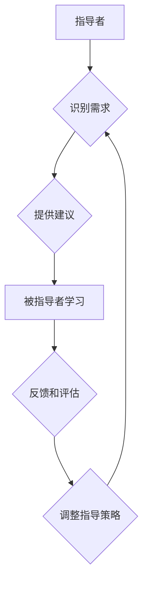

                 

## 技术mentoring：影响力与收益

> 关键词：技术指导、技术传授、知识分享、影响力、收益、团队建设、职业发展、技术社区

## 1. 背景介绍

在当今科技日新月异的时代，技术人才的需求量持续增长，而技术知识的更新迭代速度也越来越快。在这种背景下，技术mentoring（技术指导）的重要性日益凸显。技术mentoring是指经验丰富的技术专家为经验不足的从业者提供指导、建议和支持，帮助他们提升技术能力、解决技术难题，并加速职业发展。

技术mentoring不仅对个人成长至关重要，也对企业和整个技术社区的发展具有深远影响。它可以促进知识的传承和积累，加速技术创新，提升团队协作效率，并培养下一代技术领袖。

## 2. 核心概念与联系

技术mentoring的核心概念包括：

* **指导者（Mentor）:** 拥有丰富经验和专业知识的技术专家，能够提供有效的指导和建议。
* **被指导者（Mentee）:** 经验不足、渴望学习和成长的技术从业者，需要指导者的帮助和支持。
* **知识分享（Knowledge Sharing）:** 指导者将自己的知识、经验和技能传授给被指导者，促进技术能力的提升。
* **职业发展（Career Development）:** 技术mentoring可以帮助被指导者明确职业目标，制定发展计划，并获得必要的资源和支持，加速职业发展。
* **团队建设（Team Building）:** 技术mentoring可以促进团队成员之间的交流和合作，提升团队凝聚力和协作效率。

**技术mentoring流程图:**

## 3. 核心算法原理 & 具体操作步骤

技术mentoring本身并非一个算法，而是基于人际关系和知识分享的指导模式。然而，我们可以将技术mentoring过程中的某些环节抽象成算法，例如匹配指导者和被指导者、评估指导效果等。

### 3.1  算法原理概述

匹配指导者和被指导者是一个典型的推荐系统问题，可以利用机器学习算法进行解决。例如，基于用户的兴趣和技能，以及指导者的经验和领域，可以使用协同过滤算法或内容过滤算法进行匹配。

### 3.2  算法步骤详解

1. **数据收集:** 收集指导者和被指导者的相关信息，例如技能、经验、兴趣、职业目标等。
2. **特征提取:** 对收集到的数据进行特征提取，例如将技能转换为向量表示，将兴趣转换为标签等。
3. **算法训练:** 使用协同过滤算法或内容过滤算法对数据进行训练，建立指导者和被指导者之间的匹配模型。
4. **匹配推荐:** 根据被指导者的需求和匹配模型，推荐合适的指导者。

### 3.3  算法优缺点

* **优点:** 可以提高匹配效率，推荐更合适的指导者，提升指导效果。
* **缺点:** 需要大量的训练数据，算法的准确性依赖于数据质量，可能存在偏差和误差。

### 3.4  算法应用领域

* **技术社区:** 为社区成员提供技术指导和支持。
* **企业内部:** 帮助员工提升技术能力，促进职业发展。
* **教育机构:** 为学生提供技术指导和职业规划建议。

## 4. 数学模型和公式 & 详细讲解 & 举例说明

技术mentoring过程中的某些环节可以利用数学模型进行分析和优化。例如，可以利用信息论中的熵的概念来衡量指导者的知识丰富程度，并根据熵值进行指导者排序。

### 4.1  数学模型构建

假设指导者 $i$ 拥有 $n$ 个知识点，每个知识点 $j$ 的概率为 $p_{ij}$，则指导者的知识熵 $H_i$ 可以表示为：

$$H_i = -\sum_{j=1}^{n} p_{ij} \log_2 p_{ij}$$

### 4.2  公式推导过程

知识熵的公式推导过程如下：

1. 对于每个知识点 $j$，其信息量为 $-\log_2 p_{ij}$。
2. 所有知识点的总信息量为 $\sum_{j=1}^{n} p_{ij} (-\log_2 p_{ij})$。
3. 知识熵 $H_i$ 为所有知识点的总信息量的期望值，即 $-\sum_{j=1}^{n} p_{ij} \log_2 p_{ij}$。

### 4.3  案例分析与讲解

假设有两个指导者 $A$ 和 $B$，他们的知识点分布如下：

* 指导者 $A$：拥有 10 个知识点，每个知识点的概率为 0.1。
* 指导者 $B$：拥有 5 个知识点，每个知识点的概率为 0.2。

根据公式计算，指导者的知识熵分别为：

* $H_A = - \sum_{j=1}^{10} 0.1 \log_2 0.1 = 3.32$
* $H_B = - \sum_{j=1}^{5} 0.2 \log_2 0.2 = 1.66$

由此可见，指导者 $A$ 的知识熵大于指导者 $B$，说明指导者 $A$ 的知识更加丰富。

## 5. 项目实践：代码实例和详细解释说明

技术mentoring的实践可以借助各种工具和平台，例如在线社区、协作平台、视频会议等。以下是一个简单的技术mentoring项目实例，使用在线社区平台进行实践。

### 5.1  开发环境搭建

* 选择一个在线社区平台，例如 Stack Overflow、GitHub Discussions 等。
* 创建一个技术mentoring小组，并设置相应的规则和流程。

### 5.2  源代码详细实现

由于技术mentoring本身不是一个软件项目，因此没有具体的源代码实现。

### 5.3  代码解读与分析

N/A

### 5.4  运行结果展示

通过在线社区平台，指导者和被指导者可以进行交流、分享知识、解决问题，并促进彼此的成长。

## 6. 实际应用场景

技术mentoring在各个领域都有广泛的应用场景，例如：

* **软件开发:** 经验丰富的开发人员可以指导新手开发人员，帮助他们学习编程语言、掌握开发工具、解决技术难题。
* **数据科学:** 数据科学家可以指导数据分析师，帮助他们学习数据挖掘、机器学习等技术，并进行实际项目实践。
* **网络安全:** 安全专家可以指导安全工程师，帮助他们学习安全技术、应对网络威胁、提升安全意识。

### 6.4  未来应用展望

随着人工智能、云计算等技术的不断发展，技术mentoring将更加智能化、个性化和高效化。例如，可以利用人工智能算法自动匹配指导者和被指导者，并提供个性化的学习建议和指导方案。

## 7. 工具和资源推荐

### 7.1  学习资源推荐

* **在线课程平台:** Coursera、edX、Udemy 等
* **技术博客和论坛:** Stack Overflow、Medium、Hacker News 等
* **开源项目:** GitHub、GitLab 等

### 7.2  开发工具推荐

* **代码编辑器:** VS Code、Sublime Text、Atom 等
* **版本控制系统:** Git、SVN 等
* **协作平台:** Slack、Microsoft Teams 等

### 7.3  相关论文推荐

* **Mentoring in Software Engineering:** https://dl.acm.org/doi/10.1145/3326987.3327009
* **The Impact of Mentoring on Career Development:** https://journals.sagepub.com/doi/abs/10.1177/0022167818784779

## 8. 总结：未来发展趋势与挑战

技术mentoring在促进技术人才培养、加速技术创新、提升团队协作效率方面发挥着重要作用。未来，技术mentoring将朝着更加智能化、个性化和高效化的方向发展。

### 8.1  研究成果总结

* 技术mentoring的有效性已被大量研究证实，并被广泛应用于各个领域。
* 各种技术和工具可以帮助提升技术mentoring的效率和效果。

### 8.2  未来发展趋势

* **人工智能驱动的匹配和推荐:** 利用人工智能算法自动匹配指导者和被指导者，并提供个性化的学习建议和指导方案。
* **虚拟现实和增强现实技术:** 利用虚拟现实和增强现实技术，创造更加沉浸式的技术mentoring体验。
* **跨地域和跨文化的技术mentoring:** 利用网络技术，打破地域和文化障碍，实现全球范围的技术mentoring。

### 8.3  面临的挑战

* 如何确保指导者的质量和专业性。
* 如何建立有效的评估机制，衡量技术mentoring的效果。
* 如何克服技术mentoring过程中可能出现的沟通障碍和文化差异。

### 8.4  研究展望

* 深入研究技术mentoring的机制和影响因素，探索其在不同领域和不同人群中的应用。
* 开发更加智能化、个性化和高效的技术mentoring平台和工具。
* 构建一个全球性的技术mentoring社区，促进技术知识的共享和传播。

## 9. 附录：常见问题与解答

* **如何找到合适的指导者？**

可以通过在线社区平台、企业内部的导师制度、专业组织的活动等途径寻找合适的指导者。

* **技术mentoring的频率和持续时间如何？**

根据指导者的经验和被指导者的需求，可以灵活安排技术mentoring的频率和持续时间。一般来说，每周一次或每月一次的交流比较合适。

* **技术mentoring的费用如何？**

有些技术mentoring平台或组织会收取一定的费用，但也有很多免费的资源和平台可以利用。

* **技术mentoring的成果如何评估？**

可以通过被指导者的技术能力提升、职业发展进步、项目成果等方面进行评估。

作者：禅与计算机程序设计艺术 / Zen and the Art of Computer Programming 
<end_of_turn>

