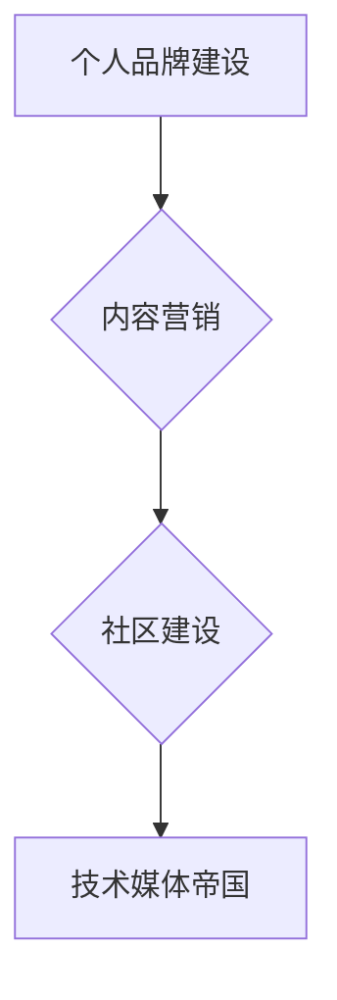

                 

## 技术博客：从个人品牌到技术媒体帝国的构建

> 关键词：个人品牌、技术博客、内容营销、社区建设、技术媒体、商业化

### 1. 背景介绍

在当今数字时代，技术知识日新月异，信息爆炸式增长。作为技术从业者，如何将自己的专业知识和见解有效地传播出去，建立个人影响力，并最终构建一个成功的技术媒体帝国，成为了一个重要的议题。

个人技术博客作为一种信息传播和个人品牌建设的重要平台，为技术人员提供了展示自我、分享经验、建立网络和获取认可的机会。然而，仅仅拥有一个博客远远不够，想要从个人品牌发展到技术媒体帝国，需要更深层的思考和策略。

### 2. 核心概念与联系

**2.1 个人品牌建设**

个人品牌是个人在特定领域内所建立的独特形象和声誉。对于技术人员来说，个人品牌代表着其专业技能、知识深度、创作能力和个人价值观。

**2.2 内容营销**

内容营销是通过创造和分享有价值、相关且一致的内容来吸引和留住目标受众，并最终促成销售或其他行动的一种营销策略。

**2.3 社区建设**

社区建设是指围绕共同兴趣或目标建立一个互动和协作的群体。对于技术博客来说，社区建设可以帮助吸引读者、促进内容传播和增强用户粘性。

**2.4 技术媒体帝国**

技术媒体帝国是指一个拥有多个平台、内容和收入来源的综合性技术媒体组织，其核心是提供高质量的技术内容和服务，并建立强大的用户社区。

**2.5 Mermaid 流程图**



### 3. 核心算法原理 & 具体操作步骤

**3.1 算法原理概述**

构建个人品牌到技术媒体帝国的“算法”并非一个严格的数学公式，而是基于一系列策略和实践的组合。其核心原理在于：

* **价值创造:** 提供有价值、原创、高质量的技术内容，满足读者需求，并建立专业形象。
* **内容传播:** 利用多种渠道和平台推广内容，扩大影响力，吸引更多读者。
* **社区互动:** 积极参与社区活动，与读者互动交流，建立信任关系，增强用户粘性。
* **商业化探索:** 探索多种商业化模式，例如广告、赞助、课程、产品等，实现可持续发展。

**3.2 算法步骤详解**

1. **明确目标和定位:** 确定目标受众、内容方向和个人品牌定位，制定清晰的战略规划。
2. **打造优质内容:** 创作原创、有价值、易于理解的技术文章、视频、音频等内容，并保持持续更新。
3. **选择合适的平台:** 选择适合目标受众的平台，例如博客、社交媒体、论坛等，并进行内容推广。
4. **积极参与社区:** 参与技术社区活动，与读者互动交流，分享经验，建立人脉关系。
5. **探索商业化模式:** 探索广告、赞助、课程、产品等商业化模式，实现可持续发展。

**3.3 算法优缺点**

* **优点:** 
    * 灵活性和可定制性强，可以根据个人情况和目标进行调整。
    * 成本相对较低，可以利用现有资源和技能进行实施。
    * 能够建立个人品牌和影响力，并获得潜在的商业回报。
* **缺点:** 
    * 需要持续投入时间和精力，才能获得良好的效果。
    * 竞争激烈，需要不断创新和提升内容质量才能脱颖而出。
    * 商业化需要谨慎规划，避免影响内容质量和用户体验。

**3.4 算法应用领域**

* **技术博客:** 个人技术博客可以利用此算法构建个人品牌，分享技术经验，并吸引潜在读者和雇主。
* **技术媒体:** 技术媒体可以利用此算法打造优质内容，建立用户社区，并实现商业化。
* **技术教育:** 技术教育机构可以利用此算法开发在线课程，建立学习社区，并提供技术培训服务。

### 4. 数学模型和公式 & 详细讲解 & 举例说明

**4.1 数学模型构建**

我们可以用一个简单的数学模型来描述技术博客的增长过程：

```latex
N(t) = N_0 * e^{rt}
```

其中：

* $N(t)$ 代表博客在时间 $t$ 时的用户数量。
* $N_0$ 代表博客初始的用户数量。
* $r$ 代表用户增长率。
* $t$ 代表时间。

这个模型假设用户增长率是恒定的，并且用户增长是指数级的。

**4.2 公式推导过程**

这个模型的推导过程基于以下假设：

* 每位用户都会吸引新的用户。
* 新用户吸引的速度与现有用户数量成正比。

根据这些假设，我们可以推导出上述的数学模型。

**4.3 案例分析与讲解**

假设一个技术博客初始用户数量为 100 人，用户增长率为 10% per month。那么，一个月后，博客的用户数量将是：

```latex
N(1) = 100 * e^{0.1 * 1} \approx 110.5 人
```

三个月后，博客的用户数量将是：

```latex
N(3) = 100 * e^{0.1 * 3} \approx 134.5 人
```

我们可以看到，随着时间的推移，博客的用户数量呈指数级增长。

### 5. 项目实践：代码实例和详细解释说明

**5.1 开发环境搭建**

* 选择合适的博客平台，例如 WordPress、Ghost、Medium 等。
* 安装必要的软件和工具，例如代码编辑器、版本控制系统等。
* 设置域名和服务器，并进行网站部署。

**5.2 源代码详细实现**

由于博客平台和技术栈多种多样，这里不再提供具体的源代码实现。

**5.3 代码解读与分析**

博客平台的源代码通常包含以下部分：

* 前端代码：负责用户界面和交互逻辑。
* 后端代码：负责数据处理、业务逻辑和数据库操作。
* 主题和插件：提供博客外观和功能扩展。

**5.4 运行结果展示**

运行后的博客网站将呈现出用户界面，并提供文章发布、评论、分享等功能。

### 6. 实际应用场景

**6.1 个人品牌建设**

技术人员可以通过博客分享技术经验、发表原创文章、参与社区讨论，建立个人品牌和影响力。

**6.2 技术传播**

技术博客可以作为技术知识传播的平台，帮助读者了解新技术、学习新技能，并促进技术交流。

**6.3 商业化应用**

技术博客可以实现广告收入、赞助合作、课程销售等商业化模式，并为作者带来经济收益。

**6.4 未来应用展望**

随着人工智能、区块链等技术的不断发展，技术博客将更加智能化、个性化和互动化。

### 7. 工具和资源推荐

**7.1 学习资源推荐**

* 博客写作指南：https://www.copyblogger.com/
* 内容营销课程：https://www.udemy.com/topic/content-marketing/
* 社区建设指南：https://www.communityroundtable.com/

**7.2 开发工具推荐**

* 博客平台：WordPress、Ghost、Medium
* 代码编辑器：VS Code、Sublime Text
* 版本控制系统：Git

**7.3 相关论文推荐**

* The Impact of Social Media on Brand Building: A Literature Review
* Content Marketing: A Strategic Approach
* Building Online Communities: A Guide for Practitioners

### 8. 总结：未来发展趋势与挑战

**8.1 研究成果总结**

构建个人品牌到技术媒体帝国的“算法”并非一个简单的公式，而是需要综合运用多种策略和实践，并不断迭代优化。

**8.2 未来发展趋势**

* 智能化：人工智能将被应用于内容创作、用户推荐、社区管理等方面，提高效率和个性化。
* 个性化：技术博客将更加注重用户需求，提供个性化的内容和服务。
* 交互化：技术博客将更加注重用户互动，提供更丰富的社区功能和体验。

**8.3 面临的挑战**

* 内容质量竞争：随着技术博客数量的增加，内容质量竞争将更加激烈。
* 用户注意力分散：用户注意力分散，技术博客需要更加努力地吸引和留住用户。
* 商业化模式创新：技术博客需要不断探索新的商业化模式，实现可持续发展。

**8.4 研究展望**

未来研究可以更加深入地探讨技术博客的算法模型、用户行为分析、内容推荐算法等方面，并探索新的技术和商业模式，推动技术博客的发展。

### 9. 附录：常见问题与解答

**9.1 如何提高博客内容的质量？**

* 撰写原创、有价值、易于理解的内容。
* 关注读者需求，提供有用的信息和解决方案。
* 使用清晰的语言和结构，并配以图片、视频等多媒体元素。
* 坚持定期更新，保持内容新鲜度。

**9.2 如何吸引更多读者？**

* 选择合适的平台和推广渠道。
* 利用社交媒体进行内容推广。
* 积极参与社区活动，与读者互动交流。
* 优化博客搜索引擎排名。

**9.3 如何实现博客的商业化？**

* 广告收入：在博客上展示广告，并获得广告收入。
* 赞助合作：与企业合作，进行产品推广或赞助活动。
* 课程销售：开发和销售技术课程或培训服务。
* 产品销售：开发和销售与博客内容相关的产品。


作者：禅与计算机程序设计艺术 / Zen and the Art of Computer Programming 
<end_of_turn>

