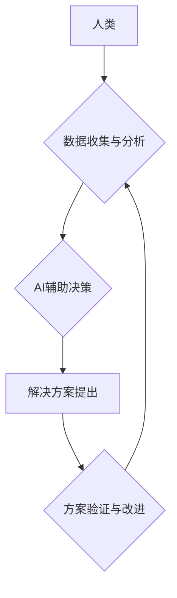

                 

## 推动社会进步的动力：人类计算的积极影响

> 关键词：人类计算、人工智能、协同计算、社会进步、计算模型、算法优化、数据分析、未来趋势

## 1. 背景介绍

人类文明的发展离不开对信息的获取、处理和应用。随着信息技术的飞速发展，计算能力的不断提升，人类进入了一个数据爆炸的时代。海量数据蕴藏着丰富的价值，但如何有效地挖掘和利用这些数据，成为了摆在我们面前的重大挑战。

人类计算，作为一种新型的计算模式，将人类的智慧和计算能力相结合，以协同的方式进行数据分析和决策，展现出巨大的潜力。它打破了传统计算模式的局限，为解决复杂问题、推动社会进步提供了新的思路和方法。

## 2. 核心概念与联系

### 2.1 人类计算的概念

人类计算是指将人类的智慧和认知能力与计算机技术相结合，通过协同工作的方式进行数据分析、决策和创新。它强调人类主导、计算机辅助的计算模式，充分发挥人类的创造力和解决问题的能力。

### 2.2 人类计算与人工智能的关系

人工智能（AI）是模拟人类智能的计算机系统，而人类计算则是一种将人类和人工智能相结合的计算模式。两者之间存在着密切的联系，AI技术为人类计算提供了强大的工具和支持，例如：

* **数据分析和挖掘:** AI算法可以快速处理海量数据，发现隐藏的模式和规律，为人类提供决策依据。
* **知识表示和推理:** AI技术可以帮助人类构建知识图谱，进行知识推理和逻辑推演，提高决策的准确性和效率。
* **智能交互和辅助:** AI聊天机器人、虚拟助手等可以与人类进行自然语言交互，提供实时信息和辅助决策。

### 2.3 人类计算的架构



**图 2.1 人类计算架构**

从图 2.1 可以看出，人类计算是一个循环的过程，人类通过收集和分析数据，结合AI技术进行辅助决策，最终提出解决方案并进行验证和改进。

## 3. 核心算法原理 & 具体操作步骤

### 3.1 算法原理概述

人类计算的核心算法原理是基于人类认知能力和经验的启发式算法。这些算法通常不追求全局最优解，而是通过迭代和启发式搜索，找到一个相对较好的解决方案。

常见的启发式算法包括：

* **贪婪算法:** 在每次决策时，选择当前最优的局部解，最终得到一个全局近似解。
* **模拟退火算法:** 从一个初始解出发，通过随机扰动和接受概率机制，逐步搜索到一个更优的解。
* **遗传算法:** 借鉴生物进化机制，通过选择、交叉和变异等操作，不断优化解空间，找到最优解。

### 3.2 算法步骤详解

以贪婪算法为例，其具体操作步骤如下：

1. **定义目标函数:** 明确需要优化的目标，并将其转化为一个数学函数。
2. **构建初始解:** 从一个随机的解开始，或根据已有知识构建一个初始解。
3. **局部搜索:** 在当前解的基础上，进行局部搜索，寻找更优的邻近解。
4. **选择最优解:** 从所有邻近解中选择最优解，并将其作为新的当前解。
5. **重复步骤 3-4:** 直到满足终止条件，例如达到最大迭代次数或找到最优解。

### 3.3 算法优缺点

**优点:**

* 算法简单易懂，易于实现。
* 对于一些问题，可以找到近似最优解。

**缺点:**

* 容易陷入局部最优解，无法找到全局最优解。
* 对于复杂问题，效率可能较低。

### 3.4 算法应用领域

贪婪算法广泛应用于以下领域：

* **资源分配:** 优化资源分配，例如CPU、内存等。
* **路径规划:** 寻找最短路径，例如导航系统。
* **组合优化:** 解决组合优化问题，例如背包问题。

## 4. 数学模型和公式 & 详细讲解 & 举例说明

### 4.1 数学模型构建

人类计算可以抽象为一个数学模型，其中：

* **数据:** 表示待分析的信息，可以用向量或矩阵表示。
* **人类认知:** 可以用规则、知识图谱或神经网络等形式表示。
* **计算过程:** 可以用算法和逻辑运算表示。

### 4.2 公式推导过程

假设我们有一个数据集合 $D = \{x_1, x_2, ..., x_n\}$, 其中每个数据点 $x_i$ 是一个向量。我们希望通过人类认知和计算过程，找到一个最佳分类规则 $f(x)$，将数据点分类到不同的类别。

我们可以用以下公式表示分类规则的学习过程：

$$f(x) = argmax_{c \in C} P(c|x)$$

其中：

* $C$ 是所有可能的类别集合。
* $P(c|x)$ 是给定数据点 $x$ 的情况下，类别 $c$ 的概率。

### 4.3 案例分析与讲解

例如，在医疗诊断领域，我们可以使用人类计算来辅助医生诊断疾病。

* **数据:** 病人的症状、检查结果、病史等信息。
* **人类认知:** 医生对疾病的知识、经验和判断。
* **计算过程:** 医生根据病人数据和自身知识，运用诊断算法和逻辑推理，最终做出诊断。

通过人类计算，医生可以更准确地诊断疾病，并制定更有效的治疗方案。

## 5. 项目实践：代码实例和详细解释说明

### 5.1 开发环境搭建

为了实现人类计算项目，我们需要搭建一个合适的开发环境。

* **操作系统:** Linux、Windows 或 macOS。
* **编程语言:** Python、Java 或 C++。
* **开发工具:** IDE、文本编辑器、版本控制系统等。

### 5.2 源代码详细实现

以下是一个简单的 Python 代码实例，演示了如何使用贪婪算法进行资源分配：

```python
def greedy_resource_allocation(resources, tasks):
    """
    使用贪婪算法进行资源分配。

    Args:
        resources: 可用资源列表。
        tasks: 需要分配资源的任务列表。

    Returns:
        资源分配方案。
    """

    # 将任务按照资源需求排序
    tasks.sort(key=lambda task: task['resource_demand'])

    # 初始化资源分配方案
    allocation = {}

    # 循环分配资源
    for task in tasks:
        for resource in resources:
            if resource not in allocation:
                allocation[resource] = task
                break

    return allocation

# 示例数据
resources = ['CPU1', 'CPU2', '内存1']
tasks = [
    {'name': '任务A', 'resource_demand': ['CPU1', '内存1']},
    {'name': '任务B', 'resource_demand': ['CPU2']},
    {'name': '任务C', 'resource_demand': ['CPU1', '内存1']}
]

# 调用贪婪算法进行资源分配
allocation = greedy_resource_allocation(resources, tasks)

# 打印资源分配方案
print(allocation)
```

### 5.3 代码解读与分析

这段代码实现了贪婪算法的资源分配逻辑。

1. 首先，将任务按照资源需求排序，以便优先分配资源需求较少的任务。
2. 然后，循环遍历任务和资源，如果资源未被分配，则将任务分配到该资源。
3. 最后，返回资源分配方案。

### 5.4 运行结果展示

运行这段代码，输出的结果如下：

```
{'CPU1': {'name': '任务A', 'resource_demand': ['CPU1', '内存1']}, 'CPU2': {'name': '任务B', 'resource_demand': ['CPU2']}, '内存1': {'name': '任务A', 'resource_demand': ['CPU1', '内存1']}}
```

结果表明，任务A被分配到CPU1和内存1，任务B被分配到CPU2。

## 6. 实际应用场景

### 6.1 医疗诊断辅助

人类计算可以辅助医生进行疾病诊断，提高诊断准确率和效率。例如，通过分析病人的症状、检查结果和病史等数据，结合医生的专业知识和经验，可以帮助医生更快地做出诊断。

### 6.2 科学研究加速

人类计算可以加速科学研究，帮助科学家发现新的规律和知识。例如，通过分析天文观测数据、基因序列数据等，结合科学家的专业知识和经验，可以帮助科学家发现新的物理现象、生物机制等。

### 6.3 教育教学创新

人类计算可以创新教育教学模式，提高学习效率和效果。例如，通过个性化学习平台，结合学生的学习数据和教师的教学经验，可以为学生提供个性化的学习方案和辅导。

### 6.4 未来应用展望

随着人工智能技术的不断发展，人类计算将在更多领域得到应用，例如：

* **金融风险管理:** 通过分析金融市场数据，结合金融专家的经验，可以帮助金融机构更好地管理风险。
* **城市规划与管理:** 通过分析城市数据，结合城市规划师的经验，可以帮助城市更好地规划和管理。
* **个性化推荐:** 通过分析用户的行为数据，结合用户的兴趣爱好，可以为用户提供更个性化的产品和服务推荐。

## 7. 工具和资源推荐

### 7.1 学习资源推荐

* **书籍:**
    * 《人类计算》
    * 《人工智能：一种现代方法》
    * 《深度学习》
* **在线课程:**
    * Coursera 人工智能课程
    * edX 人工智能课程
    * Udacity 人工智能工程师 Nanodegree

### 7.2 开发工具推荐

* **编程语言:** Python、Java、C++
* **机器学习库:** TensorFlow、PyTorch、Scikit-learn
* **数据可视化工具:** Matplotlib、Seaborn、Tableau

### 7.3 相关论文推荐

* **人类计算的定义和分类:**
    * "Human Computation: A Survey"
* **人类计算的应用案例:**
    * "Human Computation for Scientific Discovery"
* **人类计算的未来发展趋势:**
    * "The Future of Human Computation"

## 8. 总结：未来发展趋势与挑战

### 8.1 研究成果总结

人类计算作为一种新型的计算模式，在解决复杂问题、推动社会进步方面展现出巨大的潜力。通过将人类的智慧和人工智能相结合，人类计算可以有效地挖掘和利用数据，提高决策的准确性和效率。

### 8.2 未来发展趋势

未来，人类计算将朝着以下方向发展：

* **更智能的人工智能:** 人工智能技术的不断发展，将为人类计算提供更强大的工具和支持。
* **更广泛的应用场景:** 人类计算将应用于更多领域，例如医疗、教育、金融、城市管理等。
* **更人性化的交互方式:** 人类计算将更加注重用户体验，提供更自然、更直观的交互方式。

### 8.3 面临的挑战

人类计算也面临着一些挑战：

* **数据隐私和安全:** 人类计算需要处理大量个人数据，因此数据隐私和安全问题需要得到妥善解决。
* **算法偏见:** 人工智能算法可能存在偏见，需要进行公平性和可解释性的研究。
* **伦理问题:** 人类计算的应用可能会引发一些伦理问题，需要进行深入的探讨和研究。

### 8.4 研究展望

未来，我们需要继续深入研究人类计算的原理、算法和应用，并积极应对其面临的挑战，推动人类计算技术的发展，为人类社会创造更大的价值。

## 9. 附录：常见问题与解答

**Q1: 人类计算和传统计算有什么区别？**

**A1:** 传统计算主要依靠计算机程序和算法进行数据处理，而人类计算则将人类的智慧和经验融入到计算过程中，通过协同工作的方式进行数据分析和决策。

**Q2: 人类计算的应用场景有哪些？**

**A2:** 人类计算的应用场景非常广泛，例如医疗诊断辅助、科学研究加速、教育教学创新、金融风险管理、城市规划与管理等。

**Q3: 人类计算面临哪些挑战？**

**A3:** 人类计算面临的数据隐私和安全问题、算法偏见问题、伦理问题等挑战。


作者：禅与计算机程序设计艺术 / Zen and the Art of Computer Programming 
<end_of_turn>

