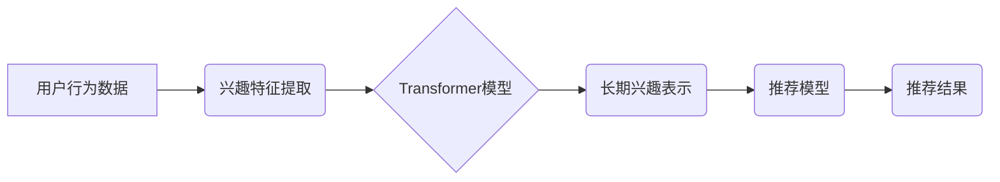

                 

## 推荐系统中AI大模型的长期用户兴趣建模

> 关键词：推荐系统、AI大模型、长期用户兴趣建模、Transformer、用户行为分析、个性化推荐

## 1. 背景介绍

推荐系统作为互联网时代的重要组成部分，旨在根据用户的历史行为、偏好和上下文信息，精准推荐用户感兴趣的内容或商品。传统的推荐系统主要依赖于协同过滤、内容过滤等方法，但这些方法在捕捉用户长期兴趣变化、处理高维稀疏数据、应对冷启动问题等方面存在局限性。

近年来，随着深度学习技术的快速发展，基于AI大模型的推荐系统逐渐成为研究热点。AI大模型，例如Transformer，凭借其强大的语义理解能力和序列建模能力，能够更好地捕捉用户长期兴趣的演变趋势，并生成更个性化的推荐结果。

## 2. 核心概念与联系

**2.1 核心概念**

* **长期用户兴趣建模:**  旨在理解用户在长时间内持续变化的兴趣偏好，并将其融入推荐系统中，以提供更精准、更个性化的推荐体验。
* **AI大模型:** 指拥有海量参数、强大的学习能力的深度学习模型，例如Transformer、BERT等。
* **Transformer:**  一种基于注意力机制的序列建模网络，能够有效捕捉文本序列中的长距离依赖关系，在自然语言处理领域取得了突破性进展。

**2.2 架构关系**



**2.3 核心联系**

AI大模型，特别是Transformer，能够有效地从用户行为数据中提取兴趣特征，并将其转化为长期兴趣表示。这些表示可以被用于训练推荐模型，从而生成更精准、更个性化的推荐结果。

## 3. 核心算法原理 & 具体操作步骤

**3.1 算法原理概述**

基于AI大模型的长期用户兴趣建模主要依赖于Transformer模型的强大序列建模能力。Transformer模型通过多头注意力机制，能够捕捉用户行为序列中的长距离依赖关系，并学习用户兴趣的演变趋势。

**3.2 算法步骤详解**

1. **数据预处理:** 收集用户行为数据，例如点击记录、浏览历史、购买记录等，并进行清洗、格式化和编码。
2. **兴趣特征提取:** 利用自然语言处理技术，从用户行为数据中提取兴趣特征，例如商品类别、品牌、关键词等。
3. **Transformer模型训练:** 将提取的兴趣特征作为输入，训练Transformer模型，使其能够学习用户兴趣的长期演变趋势。
4. **长期兴趣表示生成:** 将训练好的Transformer模型应用于新的用户行为数据，生成用户的长期兴趣表示。
5. **推荐模型训练:** 将用户的长期兴趣表示作为输入，训练推荐模型，例如基于内容的推荐模型、协同过滤模型等。
6. **推荐结果生成:** 利用训练好的推荐模型，根据用户的兴趣表示和上下文信息，生成个性化的推荐结果。

**3.3 算法优缺点**

**优点:**

* 能够捕捉用户长期兴趣的演变趋势，提供更精准的推荐。
* 能够处理高维稀疏数据，提升推荐系统的泛化能力。
* 能够应对冷启动问题，为新用户提供个性化推荐。

**缺点:**

* 需要大量的用户行为数据进行训练，训练成本较高。
* 模型训练时间较长，部署成本较高。
* 对模型参数的调优较为复杂，需要专业知识和经验。

**3.4 算法应用领域**

* 电子商务推荐：推荐商品、优惠券、促销活动等。
* 内容推荐：推荐文章、视频、音乐、书籍等。
* 社交推荐：推荐好友、群组、活动等。
* 个性化教育：推荐学习资源、课程、辅导等。

## 4. 数学模型和公式 & 详细讲解 & 举例说明

**4.1 数学模型构建**

假设用户 $u$ 的行为序列为 $H_u = (h_1, h_2, ..., h_T)$, 其中 $h_t$ 表示用户 $u$ 在时间 $t$ 的行为。

用户长期兴趣表示可以建模为：

$$
\mathbf{z}_u = \text{Transformer}(H_u)
$$

其中，$\mathbf{z}_u$ 是用户 $u$ 的长期兴趣表示，$\text{Transformer}$ 是 Transformer 模型。

**4.2 公式推导过程**

Transformer 模型的核心是多头注意力机制，其能够捕捉序列中的长距离依赖关系。

注意力机制的计算公式为：

$$
\text{Attention}(Q, K, V) = \text{softmax}\left(\frac{Q K^T}{\sqrt{d_k}}\right) V
$$

其中，$Q$, $K$, $V$ 分别是查询矩阵、键矩阵和值矩阵，$d_k$ 是键向量的维度。

Transformer 模型通过多层编码器和解码器结构，将输入序列编码为上下文表示，并生成输出序列。

**4.3 案例分析与讲解**

假设用户 $u$ 的行为序列为：

$$
H_u = (\text{浏览商品A}, \text{购买商品B}, \text{浏览商品C}, \text{购买商品D})
$$

Transformer 模型可以学习到用户 $u$ 对商品类别 A 和 D 具有持续的兴趣。

## 5. 项目实践：代码实例和详细解释说明

**5.1 开发环境搭建**

* Python 3.7+
* PyTorch 1.7+
* Transformers 库

**5.2 源代码详细实现**

```python
import torch
from transformers import AutoModelForSequenceClassification, AutoTokenizer

# 加载预训练模型和词典
model_name = "bert-base-uncased"
tokenizer = AutoTokenizer.from_pretrained(model_name)
model = AutoModelForSequenceClassification.from_pretrained(model_name)

# 用户行为序列
user_behavior = ["浏览商品A", "购买商品B", "浏览商品C", "购买商品D"]

# 将用户行为序列转换为文本格式
input_ids = tokenizer(user_behavior, return_tensors="pt").input_ids

# 使用预训练模型生成用户兴趣表示
output = model(input_ids)

# 获取用户兴趣表示
user_interest = output.logits

# ...后续使用用户兴趣表示进行推荐
```

**5.3 代码解读与分析**

* 使用预训练的 Transformer 模型 (BERT) 来提取用户行为序列中的兴趣特征。
* 将用户行为序列转换为文本格式，并使用预训练的词典进行编码。
* 使用 Transformer 模型生成用户兴趣表示，该表示包含了用户行为序列中的语义信息。
* 后续可以将用户兴趣表示作为输入，训练推荐模型，生成个性化的推荐结果。

**5.4 运行结果展示**

运行代码后，会输出用户兴趣表示，该表示是一个向量，包含了用户对不同商品类别的兴趣程度。

## 6. 实际应用场景

**6.1 电子商务推荐**

基于AI大模型的长期用户兴趣建模可以用于推荐商品、优惠券、促销活动等。例如，电商平台可以根据用户的浏览历史、购买记录等行为数据，学习用户的兴趣偏好，并推荐用户可能感兴趣的商品。

**6.2 内容推荐**

基于AI大模型的长期用户兴趣建模可以用于推荐文章、视频、音乐、书籍等内容。例如，新闻网站可以根据用户的阅读历史、点赞记录等行为数据，学习用户的兴趣偏好，并推荐用户可能感兴趣的新闻文章。

**6.3 社交推荐**

基于AI大模型的长期用户兴趣建模可以用于推荐好友、群组、活动等。例如，社交平台可以根据用户的社交行为、兴趣爱好等数据，学习用户的社交偏好，并推荐用户可能感兴趣的朋友、群组或活动。

**6.4 未来应用展望**

随着AI技术的不断发展，基于AI大模型的长期用户兴趣建模将在更多领域得到应用，例如个性化教育、医疗保健、金融服务等。

## 7. 工具和资源推荐

**7.1 学习资源推荐**

* **论文:**
    * Vaswani, A., Shazeer, N., Parmar, N., Uszkoreit, J., Jones, L., Gomez, A. N., ... & Polosukhin, I. (2017). Attention is all you need. In Advances in neural information processing systems (pp. 5998-6008).
    * Devlin, J., Chang, M. W., Lee, K., & Toutanova, K. (2018). Bert: Pre-training of deep bidirectional transformers for language understanding. arXiv preprint arXiv:1810.04805.
* **书籍:**
    * Deep Learning by Ian Goodfellow, Yoshua Bengio, and Aaron Courville
    * Natural Language Processing with PyTorch by Yoav Goldberg

**7.2 开发工具推荐**

* **PyTorch:** 深度学习框架
* **Transformers:** 预训练 Transformer 模型库
* **HuggingFace:** 预训练模型和数据集平台

**7.3 相关论文推荐**

* **基于Transformer的推荐系统研究进展**
* **深度学习在推荐系统中的应用**
* **个性化推荐系统的设计与实现**

## 8. 总结：未来发展趋势与挑战

**8.1 研究成果总结**

基于AI大模型的长期用户兴趣建模取得了显著进展，能够有效捕捉用户长期兴趣的演变趋势，并生成更精准、更个性化的推荐结果。

**8.2 未来发展趋势**

* **模型架构创新:** 研究更强大的 Transformer 模型架构，例如多模态 Transformer，能够处理文本、图像、音频等多种数据类型。
* **数据增强:** 开发新的数据增强技术，提高训练数据的质量和多样性。
* **解释性建模:** 研究更具解释性的 AI 模型，能够解释推荐结果背后的逻辑，提升用户信任度。

**8.3 面临的挑战**

* **数据隐私保护:** 如何在保护用户隐私的前提下，有效利用用户行为数据进行模型训练。
* **模型可解释性:** 如何提高 AI 模型的解释性，让用户能够理解推荐结果背后的逻辑。
* **公平性与偏见:** 如何避免 AI 模型产生公平性问题和偏见，确保推荐结果公平公正。

**8.4 研究展望**

未来，基于AI大模型的长期用户兴趣建模将继续朝着更精准、更个性化、更可解释的方向发展，为用户提供更优质的推荐体验。


## 9. 附录：常见问题与解答

**9.1 Q: 如何选择合适的 Transformer 模型？**

**A:** 选择 Transformer 模型需要根据具体应用场景和数据特点进行选择。例如，对于文本数据，BERT、RoBERTa 等模型效果较好；对于图像数据，ViT 等模型效果较好。

**9.2 Q: 如何处理冷启动问题？**

**A:** 可以利用用户画像、协同过滤等方法，为新用户生成初始兴趣表示，并逐步完善兴趣表示。

**9.3 Q: 如何评估推荐系统的效果？**

**A:** 可以使用 NDCG、MAP 等指标来评估推荐系统的效果。

**9.4 Q: 如何提高模型的解释性？**

**A:** 可以使用注意力机制、集成学习等方法，提高模型的解释性。


作者：禅与计算机程序设计艺术 / Zen and the Art of Computer Programming 
<end_of_turn>

