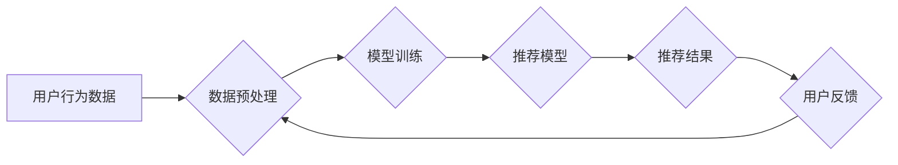

                 

## 搜索推荐中的实时学习：AI大模型方案

> 关键词：实时学习、AI大模型、搜索推荐、用户行为、个性化推荐、模型更新、在线学习

### 1. 背景介绍

在当今数据爆炸的时代，搜索引擎和推荐系统已经成为人们获取信息和发现内容的重要途径。传统的搜索推荐系统通常依赖于离线训练的模型，这些模型在面对快速变化的用户行为和内容更新时显得捉襟见肘。实时学习技术应运而生，它允许模型在接收到新数据后实时更新，从而能够更好地适应动态环境，提供更精准、更个性化的推荐结果。

随着人工智能技术的飞速发展，大模型在搜索推荐领域展现出巨大的潜力。大模型拥有海量参数和强大的学习能力，能够从海量数据中学习到更复杂的模式和关系，从而提供更精准、更个性化的推荐。然而，大模型的训练和部署也面临着巨大的挑战，例如模型规模庞大、训练时间长、资源消耗大等。

实时学习与大模型的结合，为搜索推荐领域带来了新的机遇和挑战。本文将深入探讨实时学习在搜索推荐中的应用，分析其核心概念、算法原理、实践案例以及未来发展趋势。

### 2. 核心概念与联系

**2.1 搜索推荐系统概述**

搜索推荐系统旨在根据用户的搜索历史、浏览记录、购买行为等信息，推荐用户可能感兴趣的商品、内容或服务。传统的搜索推荐系统通常包括以下几个模块：

* **数据采集:** 收集用户行为数据，例如搜索词、点击记录、购买记录等。
* **数据预处理:** 对收集到的数据进行清洗、转换和特征提取。
* **模型训练:** 利用机器学习算法训练推荐模型，例如协同过滤、内容过滤、深度学习等。
* **推荐生成:** 根据用户的查询或上下文信息，利用训练好的模型生成推荐结果。
* **结果展示:** 将推荐结果以用户友好的方式展示给用户。

**2.2 实时学习**

实时学习是指模型在接收到新数据后，能够实时更新自身参数，从而不断提升推荐效果的技术。与传统的离线训练相比，实时学习具有以下优势：

* **适应性强:** 可以及时响应用户行为和内容更新的变化，提供更精准的推荐。
* **效率高:** 不需要等待大规模数据收集和模型重新训练，可以快速迭代更新模型。
* **个性化程度高:** 可以根据用户的实时行为进行个性化推荐，提升用户体验。

**2.3 AI大模型**

AI大模型是指拥有海量参数和强大学习能力的深度学习模型。大模型能够从海量数据中学习到更复杂的模式和关系，从而提供更精准、更个性化的推荐。

**2.4 实时学习与AI大模型的结合**

将实时学习技术与AI大模型结合，可以构建出更智能、更适应动态环境的搜索推荐系统。大模型可以提供强大的学习能力和推荐精度，而实时学习则可以保证模型能够及时更新，适应用户行为和内容的变化。

**2.5 架构图**



### 3. 核心算法原理 & 具体操作步骤

**3.1 算法原理概述**

实时学习算法的核心思想是利用在线学习技术，在接收到新数据后，不断更新模型参数，从而使模型能够随着时间推移而不断提升推荐效果。常见的实时学习算法包括：

* **在线梯度下降:** 每次接收到新数据后，根据梯度下降算法更新模型参数。
* **随机梯度下降:** 每次随机选择一部分数据进行更新，可以加速模型更新速度。
* **更新率调整:** 根据模型更新情况，动态调整更新率，提高模型收敛速度和稳定性。

**3.2 算法步骤详解**

1. **初始化模型参数:**  随机初始化模型参数。
2. **接收新数据:**  实时接收用户行为数据，例如点击记录、购买记录等。
3. **数据预处理:** 对新数据进行预处理，例如特征提取、数据转换等。
4. **计算损失函数:**  根据新数据和模型预测结果，计算模型的损失函数值。
5. **更新模型参数:**  利用在线学习算法，根据损失函数值更新模型参数。
6. **重复步骤2-5:**  不断接收新数据，更新模型参数，直到模型达到预期的性能指标。

**3.3 算法优缺点**

**优点:**

* **适应性强:** 可以及时响应用户行为和内容更新的变化。
* **效率高:** 不需要等待大规模数据收集和模型重新训练。
* **个性化程度高:** 可以根据用户的实时行为进行个性化推荐。

**缺点:**

* **数据质量要求高:**  实时学习算法对数据质量要求较高，数据噪声和偏差会影响模型性能。
* **模型稳定性:**  模型参数更新过于频繁可能会导致模型不稳定，需要进行适当的正则化和参数控制。

**3.4 算法应用领域**

实时学习算法广泛应用于搜索推荐、广告推荐、个性化内容推荐等领域。例如：

* **搜索引擎:** 根据用户的实时搜索行为，动态更新搜索结果排序，提供更精准的搜索结果。
* **电商平台:** 根据用户的浏览记录和购买历史，实时推荐商品，提高转化率。
* **社交媒体:** 根据用户的兴趣爱好和社交关系，实时推荐内容，提升用户粘性。

### 4. 数学模型和公式 & 详细讲解 & 举例说明

**4.1 数学模型构建**

假设我们有一个搜索推荐系统，用户 $u$ 对商品 $i$ 的评分为 $r_{ui}$。我们的目标是预测用户 $u$ 对商品 $i$ 的评分。我们可以使用以下数学模型来构建推荐系统：

$$
\hat{r}_{ui} = \mathbf{u}^T \mathbf{v}_i + b
$$

其中：

* $\hat{r}_{ui}$ 是模型预测的用户 $u$ 对商品 $i$ 的评分。
* $\mathbf{u}$ 是用户 $u$ 的特征向量。
* $\mathbf{v}_i$ 是商品 $i$ 的特征向量。
* $b$ 是一个偏差项。

**4.2 公式推导过程**

这个模型基于矩阵分解的思想，将用户和商品映射到低维特征空间，通过计算特征向量的内积来预测评分。

**4.3 案例分析与讲解**

假设我们有一个包含 100 个用户和 1000 个商品的数据集。我们可以使用协同过滤算法训练模型，得到每个用户的特征向量和每个商品的特征向量。然后，我们可以使用上述公式来预测用户对商品的评分。

例如，如果用户 $u$ 的特征向量为 $\mathbf{u} = [0.2, 0.5, 0.1, ..., 0.8]$，商品 $i$ 的特征向量为 $\mathbf{v}_i = [0.1, 0.3, 0.7, ..., 0.4]$，偏差项为 $b = 0$，那么模型预测的用户 $u$ 对商品 $i$ 的评分为：

$$
\hat{r}_{ui} = 0.2 \times 0.1 + 0.5 \times 0.3 + 0.1 \times 0.7 + ... + 0.8 \times 0.4 = 0.5
$$

### 5. 项目实践：代码实例和详细解释说明

**5.1 开发环境搭建**

* Python 3.7+
* TensorFlow 2.0+
* PyTorch 1.0+
* Jupyter Notebook

**5.2 源代码详细实现**

```python
import tensorflow as tf

# 定义模型
class RecommenderModel(tf.keras.Model):
    def __init__(self, user_dim, item_dim):
        super(RecommenderModel, self).__init__()
        self.user_embedding = tf.keras.layers.Embedding(input_dim=user_num, output_dim=user_dim)
        self.item_embedding = tf.keras.layers.Embedding(input_dim=item_num, output_dim=item_dim)

    def call(self, user_ids, item_ids):
        user_embeddings = self.user_embedding(user_ids)
        item_embeddings = self.item_embedding(item_ids)
        return tf.reduce_sum(user_embeddings * item_embeddings, axis=1)

# 训练模型
model = RecommenderModel(user_dim=64, item_dim=64)
model.compile(optimizer='adam', loss='mse')
model.fit(train_data, train_labels, epochs=10)

# 预测评分
predictions = model.predict([user_ids, item_ids])
```

**5.3 代码解读与分析**

* 我们定义了一个名为 `RecommenderModel` 的模型类，该模型使用 Embedding 层来学习用户和商品的特征向量。
* `user_embedding` 和 `item_embedding` 是两个 Embedding 层，分别用于学习用户和商品的特征向量。
* `call` 方法定义了模型的计算过程，它将用户和商品的特征向量进行点积，得到预测评分。
* 我们使用 Adam 优化器和均方误差损失函数训练模型。
* `predict` 方法用于预测用户对商品的评分。

**5.4 运行结果展示**

训练完成后，我们可以使用模型预测用户对商品的评分，并与实际评分进行比较，评估模型的性能。

### 6. 实际应用场景

**6.1 搜索引擎推荐**

实时学习可以用于搜索引擎的推荐系统，根据用户的实时搜索行为，动态更新搜索结果排序，提供更精准的搜索结果。例如，如果用户频繁搜索某个特定主题，搜索引擎可以根据用户的搜索历史，将相关结果提升到搜索结果的顶部。

**6.2 电商平台推荐**

实时学习可以用于电商平台的商品推荐系统，根据用户的浏览记录和购买历史，实时推荐商品，提高转化率。例如，如果用户浏览了某个特定商品，电商平台可以根据用户的浏览记录，推荐其他用户也喜欢购买的商品。

**6.3 个性化内容推荐**

实时学习可以用于社交媒体、新闻网站等平台的个性化内容推荐系统，根据用户的兴趣爱好和社交关系，实时推荐内容，提升用户粘性。例如，如果用户喜欢某个特定类型的文章，社交媒体平台可以根据用户的阅读历史，推荐其他用户也喜欢阅读的类似文章。

**6.4 未来应用展望**

随着人工智能技术的不断发展，实时学习在搜索推荐领域的应用将更加广泛和深入。例如：

* **多模态推荐:** 将文本、图像、视频等多种数据类型融合到推荐系统中，提供更丰富的推荐结果。
* **联邦学习:** 在保护用户隐私的前提下，利用联邦学习技术进行实时学习，提升推荐系统的安全性。
* **强化学习:** 利用强化学习技术，让推荐系统能够根据用户的反馈不断优化推荐策略，提供更精准的推荐。

### 7. 工具和资源推荐

**7.1 学习资源推荐**

* **书籍:**
    * 《深度学习》 by Ian Goodfellow, Yoshua Bengio, Aaron Courville
    * 《推荐系统实践》 by  Paul Covington, Jay Adams, and  H.  

* **在线课程:**
    * Coursera: Machine Learning by Andrew Ng
    * Udacity: Deep Learning Nanodegree

**7.2 开发工具推荐**

* **TensorFlow:**  https://www.tensorflow.org/
* **PyTorch:** https://pytorch.org/
* **Scikit-learn:** https://scikit-learn.org/

**7.3 相关论文推荐**

* **Collaborative Filtering for Implicit Feedback Datasets** by  Koren, Y. (2009)
* **Factorization Machines** by  Rendle, S. (2010)
* **Deep Learning for Recommender Systems** by  Wang, S., &  Wang, Y. (2019)

### 8. 总结：未来发展趋势与挑战

**8.1 研究成果总结**

实时学习技术在搜索推荐领域取得了显著的成果，能够有效提升推荐效果，并适应动态环境的变化。大模型的应用进一步提升了推荐系统的精度和个性化程度。

**8.2 未来发展趋势**

* **多模态推荐:** 将文本、图像、视频等多种数据类型融合到推荐系统中，提供更丰富的推荐结果。
* **联邦学习:** 在保护用户隐私的前提下，利用联邦学习技术进行实时学习，提升推荐系统的安全性。
* **强化学习:** 利用强化学习技术，让推荐系统能够根据用户的反馈不断优化推荐策略，提供更精准的推荐。

**8.3 面临的挑战**

* **数据质量:** 实时学习算法对数据质量要求较高，数据噪声和偏差会影响模型性能。
* **模型稳定性:** 模型参数更新过于频繁可能会导致模型不稳定，需要进行适当的正则化和参数控制。
* **计算资源:** 大模型的训练和部署需要大量的计算资源，这对于一些资源有限的机构来说是一个挑战。

**8.4 研究展望**

未来，实时学习技术将继续在搜索推荐领域得到发展和应用。研究者们将致力于解决上述挑战，开发出更智能、更高效、更安全的实时学习推荐系统。

### 9. 附录：常见问题与解答

**9.1 如何评估实时学习模型的性能？**

常用的评估指标包括：

* **均方误差 (MSE):**  预测评分与实际评分的平均平方差。
* **均方根误差 (RMSE):** MSE 的平方根。
* **平均绝对误差 (MAE):** 预测评分与实际评分的平均绝对差。

**9.2 如何处理实时学习模型中的数据噪声？**

可以使用以下方法处理数据噪声：

* **数据清洗:**  去除明显的数据错误和异常值。
* **数据降噪:** 使用降噪算法，例如均值滤波、中值滤波等，减少数据噪声的影响。
* **正则化:** 在模型训练过程中，使用正则化技术，例如 L1 正则化、L2 正则化等，防止模型过拟合，提高模型鲁棒性。

**9.3 如何保证实时学习模型的稳定性？**

可以使用以下方法保证模型稳定性：

* **学习率调整:** 动态调整学习率，防止模型更新过于频繁。
* **动量项:** 使用动量项，加速模型收敛速度，并提高模型稳定性。
* **早停机制:** 在训练过程中，监控模型性能，如果性能不再提升，则停止训练，防止模型过拟合。


作者：禅与计算机程序设计艺术 / Zen and the Art of Computer Programming<end_of_turn>

