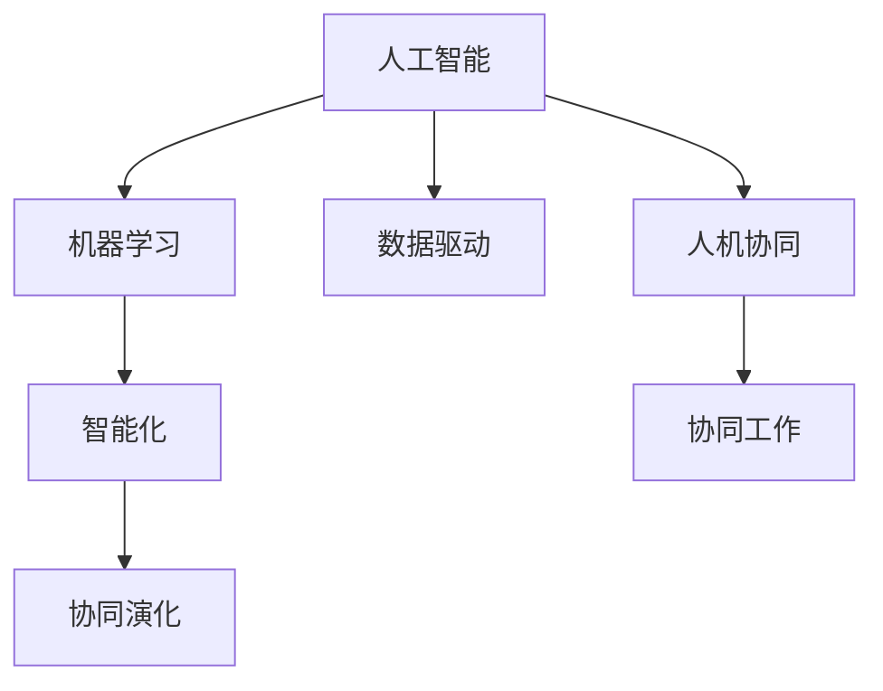

                 

# 人机协同：未来工作的核心驱动力

> 关键词：人机协同,未来工作,核心驱动力,人工智能,机器学习,数据驱动,智能化,协同演化,企业转型

## 1. 背景介绍

### 1.1 问题由来

在全球化和数字化的浪潮下，劳动力市场正在发生深刻的变革。传统意义上，劳动力以人为主导，但随着人工智能和自动化技术的迅猛发展，机器与人的协作模式正在变得愈加重要。尤其是在智能工厂、智能客服、智能医疗等场景中，人机协同已成为推动生产效率、服务质量和创新能力的关键驱动力。

### 1.2 问题核心关键点

人机协同的兴起，反映了现代工作方式从以人为主导逐渐向以数据和算法为主导的转变。在智能系统与人类共同完成工作任务的过程中，关键在于理解和利用人的优势（如创新思维、情感智能等）和机器的优势（如计算能力、学习速度等）。

1. **人机协同的核心**：在复杂的决策和任务执行中，通过人机融合，实现知识共享、技能互补，提升整体性能。
2. **技术基础**：包括机器学习、自然语言处理、计算机视觉等前沿技术，支撑了人机协同的基础框架。
3. **应用场景**：从智能制造、智能客服到远程医疗，人机协同已广泛应用于各行各业，极大地提升了工作效率和服务质量。

### 1.3 问题研究意义

研究人机协同的原理与实践，对于推动各行业智能化转型，提升整体创新能力和竞争力，具有重要意义：

1. **效率提升**：通过优化人机分工，将人类专注于高价值任务，降低重复性劳动，提升工作效率。
2. **质量保障**：结合人类判断和机器分析，减少人为错误，提高决策的准确性和一致性。
3. **成本节约**：自动化部分流程，降低人力成本，减少因人为因素导致的损失。
4. **创新催化**：结合人的创新思维和机器的学习能力，加速技术创新和应用迭代。
5. **能力拓展**：通过协同工作，弥补个人或团队能力的不足，拓展新的工作能力。

## 2. 核心概念与联系

### 2.1 核心概念概述

为更好地理解人机协同在现代工作中的应用，本节将介绍几个密切相关的核心概念：

- **人机协同**：指在复杂任务中，将人类智慧与机器能力结合起来，形成互补合作的协同系统。
- **人工智能(AI)**：一种使计算机模拟人类智能的技术，通过学习、推理和决策，完成各种任务。
- **机器学习(ML)**：人工智能的一个子领域，通过数据训练模型，使机器能够从经验中学习和改进。
- **数据驱动**：指在决策和任务执行中，充分利用数据资源，驱动系统进行优化和改进。
- **智能化**：通过人工智能技术，使系统能够自主执行任务，完成复杂决策。
- **协同演化**：在复杂系统中，人机共同演化，相互促进，达到最优协同效果。

这些核心概念之间的逻辑关系可以通过以下Mermaid流程图来展示：



这个流程图展示了人工智能、机器学习等技术是如何支撑人机协同的，以及协同工作如何通过智能化和协同演化，实现更高的协同效果。

## 3. 核心算法原理 & 具体操作步骤
### 3.1 算法原理概述

人机协同的核心算法原理基于机器学习和数据驱动。以下是对这些原理的详细阐述：

- **数据驱动**：在协同工作过程中，系统通过收集和分析大量数据，不断优化决策和行为，实现智能化。
- **机器学习**：通过对历史数据的学习，机器能够预测未来的趋势和行为，辅助人类进行决策。
- **协同演化**：在人机互动中，机器不断学习和改进，同时人类也根据机器的反馈调整策略，实现双向优化。

### 3.2 算法步骤详解

基于人机协同的核心算法原理，以下是对具体操作步骤的详细讲解：

**Step 1: 数据收集与预处理**
- 收集人机协同过程中产生的各类数据，如操作日志、任务进度、质量评价等。
- 对数据进行清洗和标注，剔除噪声，标注标注任务所需的关键特征。
- 将数据划分为训练集、验证集和测试集，以供模型训练和评估。

**Step 2: 模型选择与训练**
- 选择合适的机器学习算法和模型，如决策树、神经网络、支持向量机等。
- 使用训练集对模型进行训练，通过迭代优化，减少误差。
- 在验证集上评估模型性能，调整模型参数和结构。

**Step 3: 协同学习与优化**
- 将模型嵌入人机协同系统中，进行协同学习。
- 在协同工作中，不断收集反馈数据，更新模型参数。
- 结合人类专家的经验，优化模型决策和行为。

**Step 4: 输出与反馈**
- 通过协同系统完成任务执行和决策。
- 收集协同工作中的反馈信息，用于进一步优化模型和系统。
- 在协同过程中，实时监控系统状态，确保协同工作的稳定性和效率。

### 3.3 算法优缺点

人机协同的算法具有以下优点：

- **效率提升**：利用机器的高效计算能力，快速处理大量数据，提升工作速度。
- **质量保障**：结合人类经验，提高决策的准确性和一致性。
- **灵活性高**：通过数据驱动，系统可以根据环境变化进行动态调整。
- **可扩展性**：人机协同系统可以根据需求进行扩展和定制，适应不同的工作场景。

然而，该算法也存在一些局限性：

- **依赖数据质量**：人机协同系统依赖于高质量的数据，数据噪声和偏差可能导致系统误判。
- **人机交互复杂**：在复杂任务中，人机协同需要高水平的协调和配合，可能需要较长时间适应。
- **模型解释性不足**：机器学习模型通常缺乏可解释性，难以理解其决策过程。
- **安全性问题**：系统依赖机器学习，可能存在被攻击的风险，需加强安全防护。

### 3.4 算法应用领域

人机协同的算法已在多个领域得到了广泛应用，例如：

- **智能制造**：通过机器学习优化生产流程，提高生产效率和产品质量。
- **智能客服**：结合自然语言处理技术，使机器能够理解用户需求，提供个性化服务。
- **智能医疗**：利用机器学习分析医学数据，辅助医生进行疾病诊断和治疗。
- **智能交通**：通过协同工作，优化交通流量，减少交通事故。
- **金融分析**：利用机器学习分析金融数据，进行风险管理和投资决策。
- **零售推荐**：结合用户行为数据和机器学习，提供个性化购物推荐。

## 4. 数学模型和公式 & 详细讲解 & 举例说明
### 4.1 数学模型构建

在协同工作场景中，数据驱动和机器学习通常通过构建数学模型来实现。以下是一个简单的协同工作模型：

设 $x$ 为输入变量，$y$ 为输出变量，$w$ 为模型参数。协同工作模型的目标函数为：

$$
\min_{w} \sum_{i=1}^N (y_i - f(x_i, w))^2
$$

其中 $f(x_i, w)$ 为模型对输入 $x_i$ 的预测输出。通过最小化损失函数，优化模型参数 $w$。

### 4.2 公式推导过程

以下是对协同工作模型目标函数的详细推导：

设 $x_i$ 为输入，$y_i$ 为输出，模型参数为 $w$。模型预测输出的误差为 $e_i = y_i - f(x_i, w)$，则目标函数为：

$$
\min_{w} \sum_{i=1}^N e_i^2
$$

通过最小化误差平方和，可以使模型预测输出与实际输出尽可能接近。设 $f(x_i, w) = \sum_{j=1}^m w_j \phi_j(x_i)$，其中 $\phi_j(x_i)$ 为输入的特征函数，$m$ 为模型参数的个数。则目标函数变为：

$$
\min_{w} \sum_{i=1}^N (\sum_{j=1}^m w_j \phi_j(x_i) - y_i)^2
$$

将上式展开并求导，得到：

$$
\frac{\partial}{\partial w_j} \sum_{i=1}^N (\sum_{k=1}^m w_k \phi_k(x_i) - y_i)^2 = 0
$$

解上述方程组，得到模型参数 $w$。通过反复迭代求解，得到最优的模型参数 $w^*$。

### 4.3 案例分析与讲解

以智能制造为例，机器学习模型可以用于优化生产流程。设 $x$ 为生产参数，如温度、湿度等；$y$ 为输出变量，如产品质量、生产效率等。通过收集历史生产数据，构建协同工作模型：

$$
y = f(x, w)
$$

其中 $f(x, w)$ 为预测函数，$w$ 为模型参数。通过数据驱动，不断优化模型参数，提升生产效率和产品质量。

## 5. 项目实践：代码实例和详细解释说明
### 5.1 开发环境搭建

在进行协同工作项目开发前，我们需要准备好开发环境。以下是使用Python进行TensorFlow开发的快速搭建流程：

1. 安装Anaconda：从官网下载并安装Anaconda，用于创建独立的Python环境。

2. 创建并激活虚拟环境：
```bash
conda create -n tf-env python=3.8
conda activate tf-env
```

3. 安装TensorFlow：根据CUDA版本，从官网获取对应的安装命令。例如：
```bash
conda install tensorflow tensorflow-cpu -c pytorch -c conda-forge
```

4. 安装Pandas、NumPy等常用工具包：
```bash
pip install pandas numpy scikit-learn
```

5. 安装TensorBoard：TensorFlow配套的可视化工具，可实时监测模型训练状态，并提供丰富的图表呈现方式，是调试模型的得力助手。

完成上述步骤后，即可在`tf-env`环境中开始协同工作项目开发。

### 5.2 源代码详细实现

以下是一个使用TensorFlow进行协同工作的完整代码实现，以智能制造生产效率优化为例：

```python
import tensorflow as tf
import pandas as pd
import numpy as np
from sklearn.model_selection import train_test_split

# 读取数据集
data = pd.read_csv('production_data.csv')
X = data.drop(['quality', 'efficiency'], axis=1)
y = data[['quality', 'efficiency']]

# 数据预处理
X = (X - X.mean()) / X.std()

# 划分数据集
X_train, X_test, y_train, y_test = train_test_split(X, y, test_size=0.2)

# 构建模型
model = tf.keras.Sequential([
    tf.keras.layers.Dense(32, activation='relu'),
    tf.keras.layers.Dense(2, activation='sigmoid')
])

# 编译模型
model.compile(optimizer=tf.keras.optimizers.Adam(0.01),
              loss='mean_squared_error',
              metrics=['mae', 'mse'])

# 训练模型
model.fit(X_train, y_train, epochs=50, batch_size=32, validation_data=(X_test, y_test))

# 评估模型
test_loss, test_mae, test_mse = model.evaluate(X_test, y_test)
print(f'Test loss: {test_loss}, Test MAE: {test_mae}, Test MSE: {test_mse}')
```

### 5.3 代码解读与分析

让我们再详细解读一下关键代码的实现细节：

**读取和预处理数据**：
- 使用Pandas读取生产数据，将输入变量 `X` 和输出变量 `y` 分离。
- 对输入变量进行标准化处理，以便后续的模型训练。

**模型构建**：
- 使用TensorFlow的Sequential模型，定义两层全连接神经网络。
- 输出层使用sigmoid激活函数，适应二分类输出。

**模型编译与训练**：
- 使用Adam优化器进行模型优化。
- 设置损失函数为均方误差，优化目标为最小化预测误差。
- 使用MAE和MSE作为评估指标，监控模型性能。
- 通过循环迭代，使用训练集和验证集进行模型训练。

**模型评估**：
- 在测试集上评估模型性能，输出测试损失、平均绝对误差和均方误差。

可以看到，TensorFlow提供了丰富的API和工具，支持协同工作模型的快速构建和训练。开发者可以根据具体需求进行模型选择和参数调优，实现高效的协同工作任务。

## 6. 实际应用场景

### 6.1 智能制造

在智能制造中，协同工作系统可以用于优化生产流程，提升生产效率和产品质量。例如，使用机器学习模型预测生产参数，根据预测结果调整机器设置，实现智能生产。

**Step 1: 数据收集**
- 收集生产过程中的温度、湿度、压力等数据。
- 记录生产结果，如产品数量、缺陷率等。

**Step 2: 模型训练**
- 使用收集到的数据训练协同工作模型，预测生产参数。
- 通过不断迭代优化模型参数，提升预测精度。

**Step 3: 协同工作**
- 在生产过程中，根据预测结果调整机器参数。
- 实时监控生产状态，及时调整生产流程。

**Step 4: 反馈与优化**
- 收集生产结果和反馈信息，更新模型参数。
- 持续优化模型，适应不同的生产环境。

### 6.2 智能客服

智能客服系统通过协同工作，可以提升客户服务质量，降低运营成本。例如，结合自然语言处理技术和机器学习，使机器能够理解和回应用户咨询，提供个性化服务。

**Step 1: 数据收集**
- 收集历史客服对话记录，标注问题类型和解决方案。
- 提取对话中的关键词和语境信息。

**Step 2: 模型训练**
- 使用标注数据训练协同工作模型，预测用户问题类型。
- 根据预测结果，选择最合适的解决方案。

**Step 3: 协同工作**
- 系统自动理解用户咨询，推荐解决方案。
- 收集用户反馈，不断优化问题分类和推荐算法。

**Step 4: 反馈与优化**
- 根据用户反馈，更新问题分类模型。
- 不断优化推荐算法，提升服务质量。

### 6.3 智能医疗

在智能医疗中，协同工作系统可以辅助医生进行疾病诊断和治疗。例如，使用机器学习模型分析医学影像和病历，预测疾病风险和治疗效果。

**Step 1: 数据收集**
- 收集医学影像、病历、基因数据等。
- 标注疾病类型和治疗效果。

**Step 2: 模型训练**
- 使用标注数据训练协同工作模型，预测疾病风险和治疗效果。
- 通过不断迭代优化模型参数，提升预测精度。

**Step 3: 协同工作**
- 医生结合机器学习结果，进行疾病诊断和治疗。
- 实时监控治疗效果，调整治疗方案。

**Step 4: 反馈与优化**
- 收集医生和治疗结果，更新疾病预测模型。
- 持续优化模型，适应不同的病情和患者情况。

## 7. 工具和资源推荐
### 7.1 学习资源推荐

为了帮助开发者系统掌握协同工作原理和实践技巧，这里推荐一些优质的学习资源：

1. 《协同工作：人工智能与人类协作的未来》系列博文：由协同工作技术专家撰写，深入浅出地介绍了协同工作的原理、技术和应用。

2. 《机器学习理论与实践》课程：由斯坦福大学开设的机器学习课程，涵盖从基础算法到高级应用的全方位内容，帮助理解协同工作的数学原理。

3. 《协同工作：理论与实践》书籍：全面介绍协同工作的理论基础和实际应用，提供大量实例和案例分析。

4. TensorFlow官方文档：提供了丰富的教程和样例代码，助力开发者快速上手协同工作系统开发。

5. Kaggle竞赛平台：提供大量的数据集和协同工作挑战，帮助开发者进行实践和验证。

通过对这些资源的学习实践，相信你一定能够快速掌握协同工作的精髓，并用于解决实际的协同工作问题。

### 7.2 开发工具推荐

高效的开发离不开优秀的工具支持。以下是几款用于协同工作开发的常用工具：

1. TensorFlow：基于Python的开源深度学习框架，灵活动态的计算图，适合快速迭代研究。

2. PyTorch：灵活的深度学习框架，提供了丰富的神经网络模块和优化算法，支持协同工作模型的构建。

3. TensorBoard：TensorFlow配套的可视化工具，可实时监测模型训练状态，提供丰富的图表呈现方式。

4. Jupyter Notebook：交互式编程环境，支持多种语言和库，适合协同工作项目的快速开发和调试。

5. GitHub：代码托管平台，提供版本控制和协作工具，方便开发者进行协同工作项目的版本管理和协作开发。

合理利用这些工具，可以显著提升协同工作项目的开发效率，加快创新迭代的步伐。

### 7.3 相关论文推荐

协同工作技术的发展源于学界的持续研究。以下是几篇奠基性的相关论文，推荐阅读：

1. 《协同工作：将人工智能与人结合》：介绍了协同工作的基本原理和应用场景，探讨了人机协同的最佳实践。

2. 《基于协同工作的智能制造系统》：研究了协同工作在智能制造中的应用，提出了一种结合机器学习和数据驱动的协同工作模型。

3. 《智能客服系统的协同工作架构》：介绍了智能客服系统的协同工作机制，展示了基于自然语言处理和机器学习的协同工作模型。

4. 《智能医疗中的协同工作模型》：探讨了协同工作在智能医疗中的应用，提出了一种结合医学影像和病历数据的协同工作模型。

这些论文代表了大协同工作技术的发展脉络。通过学习这些前沿成果，可以帮助研究者把握学科前进方向，激发更多的创新灵感。

## 8. 总结：未来发展趋势与挑战
### 8.1 总结

本文对协同工作的原理与实践进行了全面系统的介绍。首先阐述了协同工作在现代工作中的重要性，明确了协同工作在提高工作效率、保障决策质量等方面的独特价值。其次，从原理到实践，详细讲解了协同工作的数学原理和关键步骤，给出了协同工作任务开发的完整代码实例。同时，本文还广泛探讨了协同工作在智能制造、智能客服、智能医疗等多个行业领域的应用前景，展示了协同工作范式的巨大潜力。此外，本文精选了协同工作的各类学习资源，力求为读者提供全方位的技术指引。

通过本文的系统梳理，可以看到，协同工作作为未来工作的重要驱动力，已经在各个行业得到广泛应用，显著提升了工作效率和服务质量。未来，伴随协同工作的持续演进，必将带来更多创新，推动各行各业实现智能化转型。

### 8.2 未来发展趋势

展望未来，协同工作技术将呈现以下几个发展趋势：

1. **智能化升级**：协同工作系统将结合更多的智能算法和技术，如自然语言处理、计算机视觉、知识图谱等，提升协同工作的效果和质量。
2. **多模态融合**：在协同工作过程中，将融合多种模态的信息，如图像、语音、文本等，实现更全面的数据驱动。
3. **人机融合深化**：在协同工作系统中，将更加注重人机融合，发挥各自优势，实现协同优化的最佳效果。
4. **个性化定制**：根据不同用户的需求和工作场景，定制化协同工作系统，提升用户体验。
5. **跨领域应用扩展**：协同工作技术将扩展到更多领域，如教育、娱乐、金融等，推动各行业的智能化转型。

以上趋势凸显了协同工作技术的广阔前景。这些方向的探索发展，必将进一步提升协同工作系统的性能和应用范围，为各行业的智能化转型提供有力支撑。

### 8.3 面临的挑战

尽管协同工作技术已经取得了显著成就，但在迈向更加智能化、普适化应用的过程中，它仍面临诸多挑战：

1. **数据质量和隐私**：协同工作系统依赖于高质量的数据，数据噪声和隐私问题可能导致系统误判。
2. **复杂性管理**：在复杂的协同工作中，系统设计和管理难度大，需不断优化和调整。
3. **可解释性不足**：机器学习模型通常缺乏可解释性，难以理解其决策过程。
4. **安全性和可靠性**：协同工作系统需具备高可靠性和安全性，以应对各种突发情况和攻击。
5. **成本控制**：协同工作系统的开发和维护成本较高，需合理控制和优化。

### 8.4 研究展望

面对协同工作面临的这些挑战，未来的研究需要在以下几个方面寻求新的突破：

1. **数据质量提升**：通过数据清洗和标注技术，提升数据质量和一致性，减少噪声和偏差。
2. **模型可解释性**：开发更具可解释性的模型，如因果模型、规则增强模型等，提高系统的透明度和可信度。
3. **安全性增强**：结合数据加密、访问控制等技术，提升系统的安全性和隐私保护。
4. **复杂性简化**：采用模块化设计和微服务架构，降低系统复杂度，提高可维护性。
5. **成本控制**：采用轻量级模型和高效算法，优化资源使用，降低开发和维护成本。

这些研究方向的探索，必将引领协同工作技术迈向更高的台阶，为构建安全、可靠、可解释、可控的智能系统铺平道路。面向未来，协同工作技术还需要与其他人工智能技术进行更深入的融合，如知识表示、因果推理、强化学习等，多路径协同发力，共同推动自然语言理解和智能交互系统的进步。只有勇于创新、敢于突破，才能不断拓展协同工作的边界，让智能技术更好地造福人类社会。

## 9. 附录：常见问题与解答

**Q1: 协同工作系统如何提高生产效率和质量？**

A: 协同工作系统通过结合机器学习和大数据，实现了对生产过程的优化和预测。具体来说：
1. 数据驱动：收集生产过程中的各种数据，利用机器学习模型进行分析和预测。
2. 模型优化：通过不断迭代优化模型参数，提升预测精度和效果。
3. 实时调整：根据预测结果，实时调整生产参数和流程，减少浪费和错误。

**Q2: 协同工作系统如何保障数据安全和隐私？**

A: 协同工作系统需采取以下措施保障数据安全和隐私：
1. 数据加密：对存储和传输的数据进行加密，防止数据泄露。
2. 访问控制：限制对数据的访问权限，防止未经授权的访问。
3. 匿名化处理：对敏感数据进行匿名化处理，保护用户隐私。
4. 安全审计：定期进行安全审计，发现和修复潜在的安全漏洞。

**Q3: 协同工作系统如何提高系统的可解释性？**

A: 提高系统可解释性的方法包括：
1. 透明模型：选择可解释性强的模型，如决策树、规则增强模型等。
2. 特征解释：通过解释模型中的特征，说明模型的决策依据。
3. 可视化分析：利用可视化工具展示模型内部工作原理和决策路径。

**Q4: 协同工作系统如何适应不同行业和任务？**

A: 协同工作系统需根据不同行业和任务进行定制和优化：
1. 行业特定：根据不同行业的特点，定制化协同工作流程和任务。
2. 任务适配：根据具体任务的需求，优化协同工作系统的算法和模型。
3. 动态调整：根据环境变化，动态调整系统参数和策略，适应不同任务和场景。

总之，协同工作技术作为未来工作的重要驱动力，具有广阔的应用前景和发展潜力。只有不断创新和优化，才能更好地推动各行业的智能化转型，提升整体生产效率和服务质量。

---

作者：禅与计算机程序设计艺术 / Zen and the Art of Computer Programming

