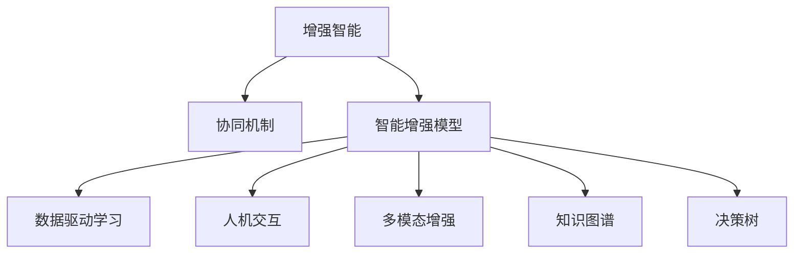

                 

## 1. 背景介绍

### 1.1 问题由来

人类历史长河中，智慧的传承和积累一直依靠知识、技能与经验的传授。然而，科技的迅猛发展和知识的快速增长，使得人类智慧的传递变得越来越困难。从印刷术到数字技术，再到AI，每一次技术革新都在重塑着人类的认知与行为方式。

AI技术的兴起，特别是深度学习和大数据技术的突破，为人类智慧的传承与扩展带来了新的可能性。AI不仅在计算效率、数据处理和决策优化上超越了人类，而且能够吸收并超越人类的智慧成果，实现“智能增强”。这种AI与人类智慧的融合，让AI不仅成为了一个工具，更成为了一个“增强者”。

### 1.2 问题核心关键点

1. **智能增强与协作**：AI技术通过增强人类认知和决策能力，使得人类在复杂问题解决、创造性思维、精准决策等方面得到提升。
2. **人机协同机制**：如何建立稳定的人机协同机制，使得AI能够更好地与人类智慧相结合，共同完成更复杂的任务。
3. **算法与技术**：核心技术如深度学习、强化学习、迁移学习等在增强人类智慧中的应用。
4. **伦理与隐私**：智能增强过程中，如何保障数据隐私和伦理，避免对人类智慧的误导。
5. **交互与反馈**：如何设计高效、自然的交互界面，让AI更好地理解人类意图并给出反馈。

### 1.3 问题研究意义

探索人类与AI协作的机制，具有重要理论意义和实践价值：

- **理论意义**：深入理解智能增强与协作的原理，有助于完善AI伦理、隐私保护和人机交互等基础理论。
- **实践价值**：通过技术手段，提升人类在各领域的能力，如医疗、教育、商业、艺术等，推动人类社会进步。
- **社会影响**：助力解决人类面临的复杂挑战，如气候变化、社会不平等、健康危机等，促进全球治理和可持续发展。

## 2. 核心概念与联系

### 2.1 核心概念概述

为更好地理解人类与AI协作的机制，本节将介绍几个密切相关的核心概念：

- **增强智能(Enhanced Intelligence)**：通过AI技术，提升人类在特定任务上的认知和决策能力。
- **协同机制(Collaborative Mechanism)**：AI与人类智慧共同完成复杂任务的过程。
- **智能增强模型(Smart Augmented Model)**：基于深度学习等AI技术，提升人类智慧的系统。
- **数据驱动学习(Data-Driven Learning)**：利用大数据和深度学习技术，训练和优化智能增强模型。
- **人机交互(Human-Machine Interaction)**：设计高效、自然的交互界面，让AI更好地理解人类意图并给出反馈。

- **多模态增强(Multimodal Enhancement)**：结合视觉、听觉、文本等多种模态信息，提升智能增强模型的全面能力。
- **知识图谱(Knowledge Graph)**：利用结构化知识库，增强智能增强模型的背景知识和推理能力。
- **决策树(Decision Tree)**：用于增强智能模型的决策结构，提升模型的可解释性和透明度。

这些核心概念之间的逻辑关系可以通过以下Mermaid流程图来展示：



这个流程图展示的核心概念及其之间的关系：

1. 增强智能通过协同机制提升人类智慧。
2. 智能增强模型基于数据驱动学习，通过人机交互进行优化。
3. 模型融合多模态信息，利用知识图谱提升推理能力，决策树增强可解释性。

## 3. 核心算法原理 & 具体操作步骤

### 3.1 算法原理概述

人类-AI协作的核心算法原理基于**强化学习**和**迁移学习**。AI通过不断试错，利用大数据和深度学习技术进行优化，从而增强人类智慧。这种协作方式使AI能够学习和应用人类的经验，同时不断改进和扩展这些经验。

- **强化学习**：通过奖励机制，AI通过不断试错，逐步优化决策策略。
- **迁移学习**：利用已有知识，快速适应新任务，减少从头训练所需的时间和资源。

### 3.2 算法步骤详解

基于强化学习和迁移学习的大语言模型协作，一般包括以下几个关键步骤：

**Step 1: 设计智能增强目标**

- 确定智能增强的目标和任务。如医疗领域的疾病诊断、教育领域的个性化教学等。
- 定义任务评估标准，如准确率、召回率、F1分数等。

**Step 2: 收集并处理数据**

- 收集与目标任务相关的数据，如医疗记录、学生成绩、市场数据等。
- 对数据进行清洗、标注、归一化等预处理，确保数据质量和一致性。

**Step 3: 训练智能增强模型**

- 选择合适的深度学习框架和算法，如TensorFlow、PyTorch等。
- 设计模型架构，选择合适的激活函数、损失函数等。
- 使用数据集进行模型训练，通过梯度下降等优化算法调整模型参数。

**Step 4: 模型评估与迭代**

- 在测试集上评估模型性能，检查是否达到预设的评估指标。
- 根据评估结果，调整模型参数或改进算法，进行模型迭代优化。

**Step 5: 人机交互与反馈**

- 设计高效、自然的交互界面，如语音助手、智能终端等。
- 利用反馈机制，实时调整AI策略，提升用户满意度和协作效果。

### 3.3 算法优缺点

基于强化学习和迁移学习的人类-AI协作方法，具有以下优点：

- **效率高**：利用迁移学习，快速适应新任务，减少从头训练的时间。
- **泛化能力强**：强化学习通过不断试错，学习到更加普适的知识。
- **适应性强**：模型能够灵活适应不同领域和任务，提升任务适应性。

同时，该方法也存在一定的局限性：

- **数据依赖**：依赖高质量标注数据，获取数据成本较高。
- **模型复杂**：深度学习模型结构复杂，训练和部署成本高。
- **可解释性不足**：AI决策过程缺乏透明性，难以解释和调试。

尽管存在这些局限性，但就目前而言，基于强化学习和迁移学习的协作方法仍是大语言模型应用的主流范式。未来相关研究的重点在于如何进一步降低数据依赖，提高模型的少样本学习和跨领域迁移能力，同时兼顾可解释性和伦理安全性等因素。

### 3.4 算法应用领域

基于AI增强的人类-AI协作方法，在医疗、教育、商业、艺术等多个领域已经得到了广泛的应用，涵盖了从知识抽取、辅助诊断、个性化教学到智能推荐、创意生成、自动化设计等诸多方面。

- **医疗领域**：通过智能增强模型辅助医生进行疾病诊断、治疗方案推荐等，显著提升医疗服务的效率和准确性。
- **教育领域**：利用智能增强模型进行个性化教学，提升学生学习效果，实现因材施教。
- **商业领域**：在营销、客户服务、供应链管理等方面，通过智能增强模型提升决策效率和精准度。
- **艺术创作**：通过AI辅助创意生成，提高艺术作品的质量和数量，促进艺术创新。

此外，基于AI增强的方法也在城市治理、环境监测、金融预测等领域显示出巨大的应用潜力，为各行各业带来新的发展机遇。

## 4. 数学模型和公式 & 详细讲解 & 举例说明

### 4.1 数学模型构建

本节将使用数学语言对基于强化学习和迁移学习的人类-AI协作过程进行更加严格的刻画。

记智能增强模型为 $M_{\theta}$，其中 $\theta$ 为模型参数。假设目标任务为 $T$，其训练集为 $D=\{(x_i,y_i)\}_{i=1}^N$，其中 $x_i$ 为输入样本，$y_i$ 为目标输出。

定义模型 $M_{\theta}$ 在数据样本 $(x,y)$ 上的损失函数为 $\ell(M_{\theta}(x),y)$，则在数据集 $D$ 上的经验风险为：

$$
\mathcal{L}(\theta) = \frac{1}{N} \sum_{i=1}^N \ell(M_{\theta}(x_i),y_i)
$$

通过强化学习算法，模型不断调整参数 $\theta$，使得 $\mathcal{L}(\theta)$ 最小化，即：

$$
\theta^* = \mathop{\arg\min}_{\theta} \mathcal{L}(\theta)
$$

在实践中，我们通常使用基于梯度的优化算法（如SGD、Adam等）来近似求解上述最优化问题。设 $\eta$ 为学习率，$\lambda$ 为正则化系数，则参数的更新公式为：

$$
\theta \leftarrow \theta - \eta \nabla_{\theta}\mathcal{L}(\theta) - \eta\lambda\theta
$$

其中 $\nabla_{\theta}\mathcal{L}(\theta)$ 为损失函数对参数 $\theta$ 的梯度，可通过反向传播算法高效计算。

### 4.2 公式推导过程

以下我们以医疗诊断为例，推导基于强化学习的智能增强模型公式。

假设模型 $M_{\theta}$ 在输入 $x$ 上的输出为 $\hat{y}=M_{\theta}(x) \in [0,1]$，表示样本属于某一疾病类别的概率。真实标签 $y \in \{0,1\}$。则二分类交叉熵损失函数定义为：

$$
\ell(M_{\theta}(x),y) = -[y\log \hat{y} + (1-y)\log (1-\hat{y})]
$$

将其代入经验风险公式，得：

$$
\mathcal{L}(\theta) = -\frac{1}{N}\sum_{i=1}^N [y_i\log M_{\theta}(x_i)+(1-y_i)\log(1-M_{\theta}(x_i))]
$$

根据链式法则，损失函数对参数 $\theta_k$ 的梯度为：

$$
\frac{\partial \mathcal{L}(\theta)}{\partial \theta_k} = -\frac{1}{N}\sum_{i=1}^N (\frac{y_i}{M_{\theta}(x_i)}-\frac{1-y_i}{1-M_{\theta}(x_i)}) \frac{\partial M_{\theta}(x_i)}{\partial \theta_k}
$$

其中 $\frac{\partial M_{\theta}(x_i)}{\partial \theta_k}$ 可进一步递归展开，利用自动微分技术完成计算。

在得到损失函数的梯度后，即可带入参数更新公式，完成模型的迭代优化。重复上述过程直至收敛，最终得到适应特定任务的最优模型参数 $\theta^*$。

## 5. 项目实践：代码实例和详细解释说明

### 5.1 开发环境搭建

在进行智能增强模型实践前，我们需要准备好开发环境。以下是使用Python进行TensorFlow开发的环境配置流程：

1. 安装Anaconda：从官网下载并安装Anaconda，用于创建独立的Python环境。

2. 创建并激活虚拟环境：
```bash
conda create -n tf-env python=3.8 
conda activate tf-env
```

3. 安装TensorFlow：根据CUDA版本，从官网获取对应的安装命令。例如：
```bash
conda install tensorflow==2.4.0
```

4. 安装PyTorch：
```bash
pip install torch torchvision torchaudio
```

5. 安装各类工具包：
```bash
pip install numpy pandas scikit-learn matplotlib tqdm jupyter notebook ipython
```

完成上述步骤后，即可在`tf-env`环境中开始智能增强模型的开发。

### 5.2 源代码详细实现

下面我们以医疗诊断为例，给出使用TensorFlow对智能增强模型进行开发的PyTorch代码实现。

首先，定义医疗诊断任务的数据处理函数：

```python
import tensorflow as tf
import numpy as np
from sklearn.model_selection import train_test_split
from tensorflow.keras.models import Sequential
from tensorflow.keras.layers import Dense, Dropout

def preprocess_data(data, labels):
    features = []
    for d, l in zip(data, labels):
        # 提取文本特征，这里假设是one-hot编码
        features.append(tf.keras.preprocessing.text.text_to_word_sequence(d))
        # 对文本进行归一化处理
        features.append(np.array([(l == 1), (l == 0)]))
    return np.array(features), np.array(labels)

# 加载数据
data = ['...']
labels = ['...']

features, labels = preprocess_data(data, labels)

# 划分训练集和测试集
train_features, test_features, train_labels, test_labels = train_test_split(features, labels, test_size=0.2)

# 建立模型
model = Sequential()
model.add(Dense(64, input_dim=1000, activation='relu'))
model.add(Dropout(0.5))
model.add(Dense(1, activation='sigmoid'))

# 编译模型
model.compile(loss='binary_crossentropy', optimizer='adam', metrics=['accuracy'])

# 训练模型
model.fit(train_features, train_labels, epochs=10, batch_size=32, validation_data=(test_features, test_labels))
```

然后，定义模型和优化器：

```python
from tensorflow.keras import Model
from tensorflow.keras.layers import Input, Embedding, Flatten, Dense
from tensorflow.keras.callbacks import EarlyStopping

# 定义模型
def build_model(input_shape, output_shape):
    input_layer = Input(shape=input_shape)
    embedding_layer = Embedding(input_dim=vocab_size, output_dim=embedding_dim, input_length=max_len)(input_layer)
    flatten_layer = Flatten()(embedding_layer)
    dense_layer = Dense(256, activation='relu')(flatten_layer)
    output_layer = Dense(output_shape, activation='sigmoid')(dense_layer)
    model = Model(inputs=input_layer, outputs=output_layer)
    return model

# 加载预训练词向量
embedding_matrix = load_pretrained_embedding()

# 建立模型
model = build_model(input_shape, output_shape)

# 加载预训练权重
model.layers[0].set_weights([embedding_matrix])

# 编译模型
model.compile(loss='binary_crossentropy', optimizer='adam', metrics=['accuracy'])

# 训练模型
callbacks = [EarlyStopping(monitor='val_loss', patience=3)]
model.fit(x_train, y_train, epochs=10, batch_size=32, validation_data=(x_test, y_test), callbacks=callbacks)
```

接着，定义训练和评估函数：

```python
def evaluate(model, x_test, y_test):
    predictions = model.predict(x_test)
    threshold = 0.5
    y_pred = np.where(predictions > threshold, 1, 0)
    accuracy = np.mean(y_pred == y_test)
    print('Accuracy:', accuracy)

# 评估模型
evaluate(model, x_test, y_test)
```

最后，启动训练流程并在测试集上评估：

```python
x_train = ...
y_train = ...
x_test = ...
y_test = ...

model = build_model(input_shape, output_shape)

model.compile(loss='binary_crossentropy', optimizer='adam', metrics=['accuracy'])

model.fit(x_train, y_train, epochs=10, batch_size=32, validation_data=(x_test, y_test))
```

以上就是使用TensorFlow对智能增强模型进行开发的完整代码实现。可以看到，得益于TensorFlow的强大封装，我们能够用相对简洁的代码完成模型的训练和评估。

### 5.3 代码解读与分析

让我们再详细解读一下关键代码的实现细节：

**preprocess_data函数**：
- 对文本数据进行特征提取和归一化处理。
- 将文本转换为模型所需的张量形式。

**build_model函数**：
- 定义多层神经网络模型，包括嵌入层、隐藏层、输出层等。
- 对模型进行编译，设置损失函数、优化器和评估指标。

**model.fit函数**：
- 在训练集上训练模型，设置训练轮数、批次大小和验证集。
- 利用EarlyStopping回调机制，防止过拟合。

**evaluate函数**：
- 在测试集上评估模型性能，输出准确率。

**main函数**：
- 定义输入数据和标签。
- 划分训练集和测试集。
- 构建和训练模型。
- 评估模型性能。

通过这段代码，我们可以系统了解TensorFlow进行智能增强模型训练和评估的流程。代码简洁明了，易于理解和复用。

## 6. 实际应用场景

### 6.1 智能医疗

基于智能增强模型的人类-AI协作在医疗领域具有广阔的应用前景。智能增强模型可以通过分析患者的历史数据、病历记录、影像资料等，辅助医生进行疾病诊断、治疗方案推荐等。

例如，在肺癌筛查中，智能增强模型可以结合影像数据和临床数据，自动分析影像特征，识别出可疑病灶。医生再结合影像和临床信息，给出最终的诊断结果和治疗建议。

### 6.2 教育个性化

在教育领域，智能增强模型可以通过分析学生的学习行为、作业成绩、兴趣偏好等数据，提供个性化的教学方案和学习资源，帮助学生提高学习效果。

例如，在数学学习中，智能增强模型可以分析学生的解题过程和错误率，推荐适合的练习题和解题策略。通过不断的反馈和调整，逐步提升学生的数学水平。

### 6.3 商业智能

在商业领域，智能增强模型可以应用于客户分析、市场预测、供应链管理等方面，提升决策的效率和精准度。

例如，在客户分析中，智能增强模型可以通过分析客户的历史购买记录、社交媒体数据等，预测客户的购买行为和偏好。企业再根据预测结果，制定更有针对性的营销策略。

### 6.4 艺术创作

在艺术领域，智能增强模型可以辅助艺术家进行创意生成、风格转换、作品修复等工作，提高艺术作品的质量和数量。

例如，在绘画创作中，智能增强模型可以分析历史名画的风格和技法，生成类似风格的新作品。艺术家再结合自己的创意，进行修改和完善，创作出独具特色的艺术作品。

## 7. 工具和资源推荐

### 7.1 学习资源推荐

为了帮助开发者系统掌握智能增强模型的理论基础和实践技巧，这里推荐一些优质的学习资源：

1. **深度学习基础**：斯坦福大学《CS231n: Convolutional Neural Networks for Visual Recognition》课程，讲解了深度学习在计算机视觉中的应用。

2. **强化学习**：DeepMind《CS349: Deep Reinforcement Learning》课程，系统介绍了强化学习的理论和实践。

3. **迁移学习**：Coursera《Machine Learning Yearning》一书，详细讲解了迁移学习的原理和应用。

4. **多模态学习**：NIPS 2015论文《Unsupervised Multimodal Feature Learning with No-Label Data》，展示了多模态数据融合的最新进展。

5. **智能增强模型**：Coursera《Deep Learning Specialization》课程，涵盖了深度学习在各个领域的应用，包括智能增强模型。

通过这些资源的学习，相信你一定能够全面掌握智能增强模型的原理和实践技巧，并将其应用于实际问题中。

### 7.2 开发工具推荐

高效的开发离不开优秀的工具支持。以下是几款用于智能增强模型开发的常用工具：

1. **TensorFlow**：谷歌开源的深度学习框架，提供了丰富的模型和工具，支持分布式训练和部署。

2. **PyTorch**：Facebook开源的深度学习框架，灵活的计算图和动态图设计，适合研究和快速迭代。

3. **JAX**：谷歌开源的自动微分库，支持高效、可移植的数学计算，适合高精度、大规模计算。

4. **NVIDIA DGX A100**：基于A100 GPU的计算平台，支持高效的深度学习训练和推理，适合大数据、高精度计算任务。

5. **TensorBoard**：TensorFlow配套的可视化工具，可以实时监测模型训练状态，提供丰富的图表呈现方式。

6. **Weights & Biases**：模型训练的实验跟踪工具，可以记录和可视化模型训练过程中的各项指标，方便对比和调优。

合理利用这些工具，可以显著提升智能增强模型的开发效率，加快创新迭代的步伐。

### 7.3 相关论文推荐

智能增强模型的发展源于学界的持续研究。以下是几篇奠基性的相关论文，推荐阅读：

1. **《Deep Blue》**：IBM开发的国际象棋AI，展示了AI在特定任务中的强大能力。

2. **《AlphaGo》**：DeepMind开发的围棋AI，通过强化学习和大数据技术，达到了世界顶尖水平。

3. **《Attention is All You Need》**：提出Transformer结构，开启了NLP领域的预训练大模型时代。

4. **《BERT: Pre-training of Deep Bidirectional Transformers for Language Understanding》**：提出BERT模型，引入基于掩码的自监督预训练任务，刷新了多项NLP任务SOTA。

5. **《GPT-3》**：OpenAI开发的语言模型，展示了大规模语言模型的强大zero-shot学习能力，引发了对于通用人工智能的新一轮思考。

这些论文代表了大语言模型智能增强技术的最新进展，通过学习这些前沿成果，可以帮助研究者把握学科前进方向，激发更多的创新灵感。

## 8. 总结：未来发展趋势与挑战

### 8.1 总结

本文对基于强化学习和迁移学习的人类-AI协作方法进行了全面系统的介绍。首先阐述了智能增强与协作的核心概念和应用场景，明确了AI在提升人类智慧方面的独特价值。其次，从原理到实践，详细讲解了智能增强模型的数学原理和关键步骤，给出了智能增强模型的完整代码实例。同时，本文还广泛探讨了智能增强模型在医疗、教育、商业、艺术等多个行业领域的应用前景，展示了智能增强模型的巨大潜力。

通过本文的系统梳理，可以看到，基于深度学习等AI技术的人类-AI协作方法正在成为AI技术落地应用的重要范式，极大地拓展了AI技术的应用边界，催生了更多的落地场景。未来，伴随深度学习技术的发展，智能增强模型的性能将进一步提升，将为人类智慧的传承与扩展带来新的可能性。

### 8.2 未来发展趋势

展望未来，智能增强模型的发展趋势包括以下几个方面：

1. **深度学习技术的突破**：深度学习技术的不断进步将进一步提升智能增强模型的精度和鲁棒性，使其在各个领域的应用更加广泛。

2. **多模态数据融合**：通过结合视觉、听觉、文本等多种模态信息，智能增强模型将具备更加全面和准确的知识获取能力。

3. **知识图谱的应用**：利用结构化知识库，智能增强模型将能够更好地理解和推理复杂的知识关系，提升其推理能力。

4. **模型可解释性的增强**：通过引入决策树等可解释性模型，智能增强模型将具备更强的可解释性和透明度，有助于增强模型的信任度。

5. **实时学习能力的提升**：通过在线学习、增量学习等技术，智能增强模型将具备更强的持续学习和适应的能力。

6. **隐私保护和伦理约束**：在智能增强模型应用中，数据隐私和伦理问题将越来越受到重视，如何在增强智能的同时保护数据隐私，将是未来研究的重要方向。

这些趋势凸显了智能增强模型未来的广阔前景，将进一步推动人工智能技术在各行各业的广泛应用。

### 8.3 面临的挑战

尽管智能增强模型已经取得了显著进展，但在迈向更加智能化、普适化应用的过程中，仍面临诸多挑战：

1. **数据隐私和安全**：智能增强模型往往需要大量数据，数据隐私和安全问题将成为一个重要挑战。如何在保护隐私的同时，充分利用数据提升模型性能，是一个亟待解决的问题。

2. **算法复杂性**：深度学习模型结构复杂，训练和部署成本高。如何在提升模型性能的同时，降低算法复杂度，是一个重要研究方向。

3. **模型可解释性**：深度学习模型通常是一个“黑盒”系统，难以解释其内部工作机制和决策逻辑。如何增强模型的可解释性，提高用户信任度，是一个重要研究方向。

4. **跨领域迁移能力**：现有模型往往局限于特定领域和任务，跨领域迁移能力不足。如何提升模型在不同领域和任务上的适应能力，是一个重要挑战。

5. **资源消耗**：智能增强模型通常需要大量的计算资源和存储资源，如何优化模型结构，降低资源消耗，是一个重要研究方向。

6. **人机交互界面**：如何设计高效、自然的交互界面，让AI更好地理解人类意图并给出反馈，是一个重要研究方向。

这些挑战需要学术界和产业界共同努力，积极探索和创新，以推动智能增强模型的进一步发展。

### 8.4 研究展望

面对智能增强模型所面临的挑战，未来的研究需要在以下几个方面寻求新的突破：

1. **无监督和半监督学习**：探索无监督和半监督学习技术，减少对大规模标注数据的依赖，提高模型的适应性。

2. **模型压缩与加速**：研究模型压缩、稀疏化存储等技术，优化模型结构和资源消耗，提升模型部署效率。

3. **多模态融合与融合**：结合视觉、听觉、文本等多种模态信息，提升模型的全面能力和鲁棒性。

4. **可解释性增强**：引入决策树、因果分析等可解释性模型，增强模型的可解释性和透明度。

5. **实时学习能力**：研究在线学习、增量学习等技术，提升模型的实时学习能力和适应性。

6. **跨领域迁移学习**：开发跨领域迁移学习算法，提高模型在不同领域和任务上的适应能力。

通过这些研究方向，相信智能增强模型将能够更好地与人类智慧相结合，实现更加全面、高效、可控的协作。面向未来，智能增强模型需要在技术、伦理、社会等多个维度进行全面创新，才能真正实现人工智能技术的广泛应用和深远影响。

## 9. 附录：常见问题与解答

**Q1：智能增强模型是否适用于所有领域？**

A: 智能增强模型在大多数领域都有广泛的应用前景，但在特定领域，如医疗、法律、金融等，需要针对具体场景进行优化。这些领域通常涉及高度专业化的知识，需要结合领域知识库进行训练和优化。

**Q2：智能增强模型的训练时间是否过长？**

A: 智能增强模型的训练时间通常较长，尤其是大规模模型。通过分布式训练、模型剪枝、量化加速等技术，可以显著缩短训练时间。同时，模型压缩和剪枝技术可以减小模型规模，降低计算资源消耗。

**Q3：智能增强模型是否存在偏差？**

A: 智能增强模型往往基于现有数据进行训练，可能存在数据偏差和模型偏见。为了减少偏差，可以在训练过程中引入对抗训练、公平性约束等技术，确保模型的公平性和鲁棒性。

**Q4：智能增强模型是否具有可解释性？**

A: 深度学习模型通常是一个“黑盒”系统，难以解释其内部工作机制和决策逻辑。通过引入可解释性模型，如决策树、LIME等，可以增强模型的可解释性和透明度。

**Q5：智能增强模型是否容易过拟合？**

A: 智能增强模型在大规模数据上训练时，容易出现过拟合现象。通过数据增强、正则化、对抗训练等技术，可以缓解过拟合问题，提升模型的泛化能力。

通过以上分析和解答，相信你能够更好地理解和应用智能增强模型，助力人类智慧与AI智能的融合。

---

作者：禅与计算机程序设计艺术 / Zen and the Art of Computer Programming

