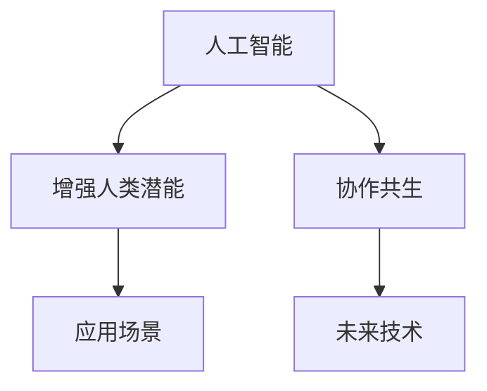

                 

# 人类-AI协作：增强人类潜能与AI能力的未来发展

> 关键词：人工智能(AI),增强人类潜能,协作共生,未来技术,前沿趋势

## 1. 背景介绍

### 1.1 问题由来

随着人工智能(AI)技术的迅猛发展，人工智能与人类之间的协作已经渗透到了各个领域。无论是医疗、教育、金融，还是工业制造、交通物流，人工智能都在提供新的解决方案，增强人类工作的效率和精度，拓展人类认知的边界。但同时，AI的崛起也引发了关于“机器是否会取代人类”的广泛讨论。其实，AI并不是要取代人类，而是要通过协作，提升人类潜能，共同创造更多价值。

当前，AI已展现出强大的潜力，但尚处于发展初期，其应用更多集中在自动化和辅助决策上。未来，AI将在增强人类潜能、提升协作效率、优化决策制定等方面发挥更大的作用。为更好地理解这一趋势，本文将深入探讨人类-AI协作的原理与方法，并展望其在各个领域的未来应用。

## 2. 核心概念与联系

### 2.1 核心概念概述

为更好地理解人类-AI协作，本文将介绍几个关键概念：

- **人工智能(AI)**：指通过模拟人类智能行为，如学习、推理、感知等，来使计算机系统具有智能能力的技术。

- **增强人类潜能**：指通过AI技术的应用，使人类能够更高效、更精确地完成工作，拓展认知范围，提升决策质量，从而在个人和组织层面创造更大的价值。

- **协作共生**：指AI与人类通过技术手段紧密结合，共同解决问题、优化流程，实现技术优势互补，形成持续发展的良性循环。

这些核心概念之间的联系和相互作用，可以通过以下Mermaid流程图来展示：



这个流程图展示了人工智能如何通过增强人类潜能和协作共生，影响具体的应用场景，并进一步催生未来的技术发展。

## 3. 核心算法原理 & 具体操作步骤

### 3.1 算法原理概述

人类-AI协作的原理基于计算与智能的融合，通过AI技术赋能人类，提升决策和执行能力。核心思想是通过数据驱动的AI模型，学习人类的行为模式、知识结构和决策逻辑，并在实际场景中应用这些知识，辅助人类进行更加高效、精确的决策。

形式化地，假设人类为智能体，AI为辅助工具，协作过程可以描述为：

$$
\text{协作效果} = \text{人类决策能力} + \text{AI辅助能力}
$$

其中，人类决策能力指人类在特定领域的知识和经验，AI辅助能力指AI模型在数据处理、模式识别、预测分析等方面的能力。通过优化上述两个因素，可以显著提升协作效果。

### 3.2 算法步骤详解

基于上述原理，人类-AI协作的具体操作步骤包括：

**Step 1: 数据准备与模型训练**

1. 收集相关的数据集，涵盖不同领域、不同场景下的数据。
2. 预处理数据，去除噪声，标准化格式。
3. 选择合适的AI模型，并对其进行训练。训练过程应充分考虑模型的泛化能力和鲁棒性，确保在实际应用中能够稳定运行。

**Step 2: 模型评估与调优**

1. 在实际应用场景中进行模型评估，收集反馈数据。
2. 根据反馈数据，对模型进行调整和优化，确保其适应性更强，效果更好。

**Step 3: 人类-AI融合**

1. 将AI模型嵌入到人类决策流程中，形成人机协同工作模式。
2. 设计合理的交互界面，使人类能够自然、高效地使用AI工具。

**Step 4: 持续优化与迭代**

1. 根据新的数据和反馈，不断优化AI模型。
2. 持续改进人类-AI协作机制，提升整体协作效果。

### 3.3 算法优缺点

人类-AI协作的算法具有以下优点：

- **效率提升**：AI能够处理大量数据，提取隐藏模式，辅助人类进行快速、精确的决策。
- **成本节约**：通过自动化、智能化的方式，降低人力成本和运营成本。
- **创新驱动**：AI的深度学习和数据分析能力，有助于发现新的商业模式和市场机会。

但同时也存在一些缺点：

- **数据依赖**：AI模型的性能高度依赖于数据质量，数据的获取和处理成本较高。
- **隐私风险**：在使用AI处理敏感数据时，需注意数据隐私和安全问题。
- **伦理挑战**：AI决策的透明性和可解释性问题，可能导致决策偏见和错误。

### 3.4 算法应用领域

人类-AI协作技术已经应用于多个领域，具体包括：

- **医疗健康**：AI辅助诊断、个性化治疗、药物研发等，提升医疗服务质量和效率。
- **教育培训**：智能助教、在线学习、课程推荐等，提升学习效果和教学质量。
- **金融服务**：智能投顾、风险管理、反欺诈等，提升金融服务的准确性和安全性。
- **制造工业**：智能监控、质量检测、供应链优化等，提升生产效率和产品质量。
- **交通物流**：自动驾驶、路径规划、货物追踪等，提升运输效率和安全性。

这些应用领域展示了AI如何通过增强人类潜能，实现协作共生，推动各行业的数字化转型和智能化升级。

## 4. 数学模型和公式 & 详细讲解 & 举例说明

### 4.1 数学模型构建

本节将使用数学语言对人类-AI协作过程进行更严格的刻画。

假设AI模型为 $M$，其输入为 $x$，输出为 $y$。人类在特定领域的专业知识为 $k$，决策策略为 $p$。协作过程可以表示为：

$$
y = M(x) + k \cdot p(x)
$$

其中，$M(x)$ 表示AI模型对输入数据的处理结果，$k \cdot p(x)$ 表示人类决策对结果的修正。

### 4.2 公式推导过程

以医疗诊断为例，公式可以进一步展开：

1. 数据准备：收集患者的医疗数据 $x = [x_1, x_2, ..., x_n]$，包括病历、影像、实验室检查结果等。
2. AI模型训练：使用深度学习模型 $M$，对数据进行训练，得到模型参数 $\theta$。
3. 人类决策：医生根据自身经验 $k$，对AI模型的输出结果 $M(x)$ 进行修正，得到最终诊断结果 $y$。

具体推导如下：

$$
y = M(x; \theta) + k \cdot p(x)
$$

其中，$M(x; \theta)$ 为AI模型输出，$k$ 为医生的专业知识和经验权重，$p(x)$ 为医生的决策策略。

### 4.3 案例分析与讲解

假设在肿瘤诊断场景中，AI模型 $M$ 可以识别出病灶的位置和大小，但其对肿瘤类型的判断仍存在误差。人类医生 $k$ 在特定领域的知识丰富，能够根据经验进行修正。协作过程中，AI模型和人类医生的决策策略共同作用，生成最终的诊断结果。

## 5. 项目实践：代码实例和详细解释说明

### 5.1 开发环境搭建

在进行人类-AI协作实践前，我们需要准备好开发环境。以下是使用Python进行TensorFlow开发的环境配置流程：

1. 安装Anaconda：从官网下载并安装Anaconda，用于创建独立的Python环境。

2. 创建并激活虚拟环境：
```bash
conda create -n tf-env python=3.8 
conda activate tf-env
```

3. 安装TensorFlow：根据CUDA版本，从官网获取对应的安装命令。例如：
```bash
conda install tensorflow -c pytorch -c conda-forge
```

4. 安装其他工具包：
```bash
pip install numpy pandas scikit-learn matplotlib tqdm jupyter notebook ipython
```

完成上述步骤后，即可在`tf-env`环境中开始协作实践。

### 5.2 源代码详细实现

下面我们以医疗诊断为例，给出使用TensorFlow进行AI辅助诊断的代码实现。

```python
import tensorflow as tf
from tensorflow import keras

# 加载数据集
(x_train, y_train), (x_test, y_test) = keras.datasets.mnist.load_data()

# 数据预处理
x_train = x_train.reshape(-1, 28*28).astype('float32') / 255.0
x_test = x_test.reshape(-1, 28*28).astype('float32') / 255.0

# 构建AI模型
model = keras.Sequential([
    keras.layers.Dense(128, activation='relu', input_shape=(28*28,)),
    keras.layers.Dense(10, activation='softmax')
])
model.compile(optimizer='adam', loss='sparse_categorical_crossentropy', metrics=['accuracy'])

# 训练模型
model.fit(x_train, y_train, epochs=10, batch_size=64)

# 预测测试集
y_pred = model.predict(x_test)

# 输出准确率
print('Accuracy:', model.evaluate(x_test, y_test)[1])
```

### 5.3 代码解读与分析

让我们再详细解读一下关键代码的实现细节：

**加载数据集**：
- `keras.datasets.mnist.load_data()` 函数用于加载手写数字数据集，包含60000个训练样本和10000个测试样本。

**数据预处理**：
- 将图像数据展平为一维数组，并进行归一化处理，使得模型可以更高效地处理数据。

**构建AI模型**：
- 使用Sequential模型，添加两个全连接层，使用ReLU激活函数，输出层为Softmax，用于多分类任务。
- `model.compile()` 函数用于模型编译，设置优化器和损失函数。

**训练模型**：
- `model.fit()` 函数用于模型训练，设置训练轮数和批次大小。

**预测测试集**：
- `model.predict()` 函数用于模型预测，返回每个样本的预测结果。

**输出准确率**：
- `model.evaluate()` 函数用于模型评估，返回测试集上的准确率。

## 6. 实际应用场景

### 6.1 医疗健康

AI在医疗健康领域的应用已经取得了显著成果。AI技术可以辅助医生进行疾病诊断、手术规划、药物研发等工作，显著提升医疗服务的质量和效率。

例如，IBM Watson Health 利用自然语言处理和深度学习技术，辅助医生阅读和分析医学文献，提供临床决策支持。Google Health 通过图像识别技术，帮助医生快速诊断皮肤病，提高诊断准确率。

**实际案例**：
- IBM Watson Health 在医学文献搜索和分析方面，通过AI模型学习大量文献数据，能够快速提供相关疾病的治疗方案和最新研究成果，帮助医生进行精准治疗。
- Google Health 利用深度学习模型，对皮肤病影像进行识别，自动化标注，提升诊断速度和准确率。

### 6.2 教育培训

AI在教育培训领域的应用，通过智能助教、在线学习、课程推荐等方式，提升学习效果和教学质量。

例如，Coursera 利用AI技术，根据学生的历史学习数据和行为数据，推荐适合的学习内容和课程，提升学习体验。Khan Academy 使用AI技术，实时分析学生学习情况，提供个性化反馈和辅导。

**实际案例**：
- Coursera 通过分析学生的学习历史和行为数据，推荐适合的课程和内容，提升学习效率和满意度。
- Khan Academy 利用AI技术，实时监控学生学习进度，提供个性化辅导和反馈，帮助学生克服学习难点。

### 6.3 金融服务

AI在金融服务领域的应用，通过智能投顾、风险管理、反欺诈等方式，提升金融服务的准确性和安全性。

例如，J.P. Morgan Chase 利用AI技术，通过自动化风险评估和欺诈检测，提升金融安全性和效率。AIG 使用深度学习模型，分析客户行为数据，提供个性化的保险服务。

**实际案例**：
- J.P. Morgan Chase 利用AI技术，自动化处理风险评估和欺诈检测，减少人工工作量，提高金融服务的效率和安全性。
- AIG 通过深度学习模型，分析客户行为数据，提供个性化的保险服务，提升客户满意度和忠诚度。

### 6.4 未来应用展望

随着AI技术的不断进步，人类-AI协作的未来应用前景广阔。AI将通过增强人类潜能，在更多领域实现协作共生，推动技术创新和产业发展。

1. **智能城市**：AI将应用于城市管理、智能交通、环保监测等方面，提升城市运行效率和居民生活质量。
2. **智能制造**：AI将应用于生产自动化、质量检测、供应链优化等方面，提升制造业的智能化水平。
3. **环境保护**：AI将应用于气候变化预测、环境监测、资源管理等方面，提升环境保护的科学性和准确性。
4. **社会治理**：AI将应用于公共安全、犯罪预防、社会服务等领域，提升社会治理的智能化水平。

这些应用场景展示了AI如何通过增强人类潜能，实现协作共生，推动社会各领域的数字化转型和智能化升级。

## 7. 工具和资源推荐

### 7.1 学习资源推荐

为了帮助开发者系统掌握人类-AI协作的理论基础和实践技巧，这里推荐一些优质的学习资源：

1. **《人工智能：一个现代方法》**：斯坦福大学深度学习课程，涵盖人工智能的各个方面，包括机器学习、深度学习、强化学习等，是学习AI技术的经典教材。
2. **《深度学习》**：Ian Goodfellow 等人著，详细介绍了深度学习的基本原理和应用，是深度学习领域的权威指南。
3. **Coursera AI课程**：提供多门AI相关课程，涵盖机器学习、深度学习、自然语言处理、计算机视觉等方向，适合初学者和进阶学习者。
4. **Kaggle竞赛平台**：提供丰富的AI竞赛数据集和算法模型，帮助开发者实践和提升AI应用能力。
5. **AI News网站**：实时更新AI领域的最新研究和技术动态，帮助开发者了解AI领域的最新进展。

通过对这些资源的学习实践，相信你一定能够快速掌握人类-AI协作的精髓，并用于解决实际的AI应用问题。

### 7.2 开发工具推荐

高效的开发离不开优秀的工具支持。以下是几款用于人类-AI协作开发的常用工具：

1. **TensorFlow**：由Google主导开发的开源深度学习框架，功能丰富，支持分布式训练和多种硬件平台，适合大规模工程应用。
2. **PyTorch**：Facebook开发的开源深度学习框架，灵活性高，支持动态计算图，适合研究和原型开发。
3. **HuggingFace Transformers库**：Google开源的自然语言处理工具库，集成了众多预训练语言模型，支持多种任务，易于微调和部署。
4. **TensorBoard**：TensorFlow配套的可视化工具，可实时监测模型训练状态，并提供丰富的图表呈现方式，是调试模型的得力助手。
5. **Weights & Biases**：模型训练的实验跟踪工具，可以记录和可视化模型训练过程中的各项指标，方便对比和调优。

合理利用这些工具，可以显著提升人类-AI协作任务的开发效率，加快创新迭代的步伐。

### 7.3 相关论文推荐

人类-AI协作技术的发展源于学界的持续研究。以下是几篇奠基性的相关论文，推荐阅读：

1. **DeepMind AlphaGo**：DeepMind开发的围棋AI，通过深度学习和蒙特卡洛树搜索技术，实现了人类围棋水平的目标。
2. **OpenAI GPT系列**：OpenAI开发的预训练语言模型，通过大规模无监督学习，提升了自然语言理解和生成的能力，展示了AI在语言处理领域的潜力。
3. **IBM Watson**：IBM开发的AI系统，通过自然语言处理、图像识别、数据分析等技术，辅助医生进行诊断和治疗，提升了医疗服务的智能化水平。
4. **Google AI Impact Team**：Google AI团队发布的关于AI对社会影响的报告，分析了AI技术在不同领域的应用和影响，为AI发展提供了伦理和政策建议。

这些论文代表了大规模协作技术的发展脉络。通过学习这些前沿成果，可以帮助研究者把握学科前进方向，激发更多的创新灵感。

## 8. 总结：未来发展趋势与挑战

### 8.1 总结

本文对人类-AI协作的原理与方法进行了全面系统的介绍。首先阐述了人类-AI协作的背景和意义，明确了协作在增强人类潜能和提升AI能力方面的重要作用。其次，从原理到实践，详细讲解了协作的数学模型和操作步骤，给出了协作任务开发的完整代码实例。同时，本文还广泛探讨了协作方法在各个行业领域的应用前景，展示了协作范式的广阔潜力。此外，本文精选了协作技术的各类学习资源，力求为读者提供全方位的技术指引。

通过本文的系统梳理，可以看到，人类-AI协作技术正在成为AI领域的重要范式，极大地拓展了AI技术的应用边界，催生了更多的落地场景。未来，伴随AI技术的不断进步，人类-AI协作必将在更多领域得到应用，为社会发展和人类进步带来深远影响。

### 8.2 未来发展趋势

展望未来，人类-AI协作技术将呈现以下几个发展趋势：

1. **技术融合加速**：AI技术将与更多领域的技术进行深度融合，如物联网、区块链、量子计算等，推动技术创新和产业发展。
2. **智能应用普及**：AI将在更多行业中实现广泛应用，如智能家居、智能交通、智能制造等，提升各行业的智能化水平。
3. **伦理和社会责任**：AI技术的应用将更加注重伦理和社会责任，确保技术的公正性、透明性和可解释性。
4. **人机协作优化**：AI将通过增强人类潜能，实现更加高效、精确的人机协作，提升工作质量和效率。
5. **跨领域知识整合**：AI将更好地整合不同领域的专业知识，形成更加全面、准确的解决方案。

以上趋势凸显了人类-AI协作技术的广阔前景。这些方向的探索发展，必将进一步提升AI系统的性能和应用范围，为社会发展和人类进步提供更加强大的技术支撑。

### 8.3 面临的挑战

尽管人类-AI协作技术已经取得了瞩目成就，但在迈向更加智能化、普适化应用的过程中，它仍面临着诸多挑战：

1. **数据依赖**：AI模型的性能高度依赖于数据质量，数据的获取和处理成本较高。如何获取更多高质量数据，是未来需要解决的重要问题。
2. **隐私和安全**：在使用AI处理敏感数据时，需注意数据隐私和安全问题。如何在保护隐私的前提下，实现高效的AI应用，是未来需要关注的重点。
3. **伦理挑战**：AI决策的透明性和可解释性问题，可能导致决策偏见和错误。如何确保AI决策的透明性和可解释性，是未来需要解决的重要问题。
4. **技术融合复杂性**：AI技术与其他技术进行深度融合时，可能会出现兼容性问题。如何实现技术的无缝整合，是未来需要解决的难点。
5. **跨领域知识整合难度**：AI在整合不同领域的专业知识时，可能会出现知识冲突和误解。如何更好地整合跨领域知识，是未来需要解决的重要问题。

正视协作面临的这些挑战，积极应对并寻求突破，将是人类-AI协作技术走向成熟的必由之路。相信随着学界和产业界的共同努力，这些挑战终将一一被克服，人类-AI协作必将在构建人机协同的智能时代中扮演越来越重要的角色。

### 8.4 研究展望

面对人类-AI协作技术面临的种种挑战，未来的研究需要在以下几个方面寻求新的突破：

1. **数据高效获取**：开发更多高效的数据获取和处理技术，降低数据依赖，提升模型的泛化能力。
2. **隐私保护技术**：研究数据隐私保护和匿名化技术，确保数据安全和隐私保护。
3. **AI决策透明性**：开发可解释性AI技术，提升AI决策的透明性和可解释性。
4. **跨领域知识整合**：开发跨领域知识整合技术，解决知识冲突和误解问题。
5. **技术融合框架**：研究AI与其他技术的融合框架，确保技术的无缝整合。

这些研究方向的探索，必将引领人类-AI协作技术迈向更高的台阶，为构建人机协同的智能系统铺平道路。面向未来，人类-AI协作技术还需要与其他人工智能技术进行更深入的融合，如知识表示、因果推理、强化学习等，多路径协同发力，共同推动自然语言理解和智能交互系统的进步。只有勇于创新、敢于突破，才能不断拓展AI系统的边界，让智能技术更好地造福人类社会。

## 9. 附录：常见问题与解答

**Q1：人类-AI协作是否会导致人类失业？**

A: 协作并不意味着替代，而是通过增强人类潜能，提升人类工作的效率和质量。AI将帮助人类解决更复杂、更高价值的任务，而人类则可以专注于更具创造性和战略性的工作。AI和人类将形成互补，共同创造更多的社会价值。

**Q2：人类-AI协作中的数据隐私和安全问题如何解决？**

A: 在协作过程中，需要采用多种数据保护技术，如数据加密、差分隐私、联邦学习等，确保数据隐私和安全。同时，制定严格的隐私保护政策，明确数据使用的范围和方式，避免数据滥用和泄露。

**Q3：人类-AI协作中的决策透明性和可解释性问题如何解决？**

A: 开发可解释性AI技术，如模型可视化、特征重要性分析、决策路径可视化等，提升AI决策的透明性和可解释性。同时，采用多方参与的决策机制，确保决策的公正性和透明性。

**Q4：人类-AI协作中的跨领域知识整合如何实现？**

A: 开发跨领域知识整合技术，如知识图谱、逻辑推理、专家系统等，解决知识冲突和误解问题。同时，通过多方协作和知识共享，提升跨领域知识的整合能力。

**Q5：人类-AI协作中的伦理和社会责任如何确保？**

A: 在协作过程中，制定明确的伦理和社会责任规范，确保技术的公正性、透明性和可解释性。同时，建立多方参与的监督机制，确保技术的公平性和透明性。

通过这些措施，可以有效应对协作技术面临的挑战，确保协作过程的公正性和透明性，提升协作效果，推动社会发展和人类进步。

---

作者：禅与计算机程序设计艺术 / Zen and the Art of Computer Programming

