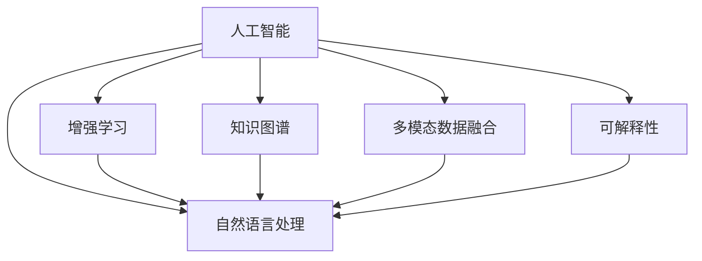

                 

# 人类-AI协作：增强人类潜能与AI能力的融合发展方向

## 1. 背景介绍

### 1.1 问题由来

随着人工智能(AI)技术的飞速发展，人工智能与人类协作成为行业和学术界共同关注的焦点。AI系统不仅能完成高度重复性任务，还能在创造性、复杂性任务中提供有力支持，从而在生产、医疗、教育、科学研究等领域中发挥重要作用。然而，当前的AI系统仍然存在诸多局限，特别是在理解和应用人类意图方面。如何更好地融合AI与人类潜能，提升AI系统的适应性和通用性，成为当前技术发展的关键问题。

### 1.2 问题核心关键点

本文章的核心问题是如何构建一个高效、灵活、可解释的AI系统，以增强人类的工作潜能。该问题可以拆解为以下几个核心关键点：

1. **多模态数据融合**：将文本、图像、语音等多模态数据进行有效融合，提高AI系统对复杂场景的理解能力。
2. **模型可解释性**：使得AI系统的决策过程和输出结果具有可解释性，帮助人类理解和信任AI。
3. **知识图谱与推理**：利用知识图谱和逻辑推理技术，提升AI系统的常识推理和知识迁移能力。
4. **人机交互优化**：通过自然语言理解与生成技术，实现更加高效、自然的人机交互体验。
5. **持续学习与自我优化**：使得AI系统能够持续学习新知识，优化模型性能，适应环境变化。

### 1.3 问题研究意义

构建高效、灵活、可解释的AI系统，对于提升工作效率、降低成本、提高服务质量、促进社会公平等方面具有重要意义。

- **提升工作效率**：通过AI系统自动化处理重复性、高负荷任务，释放人类潜能，专注于更具创造性和战略性的工作。
- **降低成本**：AI系统的应用可以显著降低人力成本，特别是在医疗、金融、制造业等高成本领域。
- **提高服务质量**：AI系统能够在医疗诊断、教育、客户服务等方面提供高质量、高效率的服务，提高用户满意度。
- **促进社会公平**：通过AI技术普及教育和医疗资源，缩小城乡、地区之间的差距，提升社会公平性。

## 2. 核心概念与联系

### 2.1 核心概念概述

为更好地理解人类-AI协作的融合发展方向，本节将介绍几个密切相关的核心概念：

- **人工智能(AI)**：利用计算机算法和数学模型，模拟、延伸和扩展人类智能的技术，包括机器学习、深度学习、自然语言处理等。
- **增强学习(RL)**：一种AI子领域，通过与环境的交互学习最优策略，适用于解决自动化控制、游戏策略优化等复杂问题。
- **知识图谱(KG)**：由实体、属性和关系构成的网络结构，用于存储和表示领域知识，支持推理和查询。
- **多模态数据融合(MMD)**：将不同模态的数据进行有效融合，提高系统对多源数据的理解能力。
- **自然语言处理(NLP)**：研究如何让计算机理解、处理和生成人类语言的技术，包括语音识别、文本生成、机器翻译等。
- **可解释性(Explainability)**：使AI系统的决策过程透明、可理解，帮助人类理解和信任AI。

这些核心概念之间的逻辑关系可以通过以下Mermaid流程图来展示：



这个流程图展示了人工智能领域的关键技术及其相互关系：

1. **增强学习**：通过与环境交互，学习最优策略，广泛应用于自动化控制、游戏等领域。
2. **知识图谱**：存储和表示领域知识，支持推理和查询，是知识工程的重要组成部分。
3. **多模态数据融合**：将不同模态的数据进行融合，提高系统对多源数据的理解能力。
4. **自然语言处理**：使计算机能够理解、处理和生成人类语言，实现人机交互。
5. **可解释性**：使AI系统的决策过程透明、可理解，帮助人类理解和信任AI。

这些技术协同作用，共同构建高效、灵活、可解释的AI系统，实现人类-AI协作。

## 3. 核心算法原理 & 具体操作步骤

### 3.1 算法原理概述

人类-AI协作的核心算法原理主要包括以下几个方面：

- **多模态数据融合**：通过融合文本、图像、语音等多模态数据，提高AI系统对复杂场景的理解能力。
- **知识图谱与推理**：利用知识图谱和逻辑推理技术，提升AI系统的常识推理和知识迁移能力。
- **自然语言处理**：通过自然语言理解与生成技术，实现更加高效、自然的人机交互。
- **增强学习**：通过与环境的交互学习最优策略，提升AI系统的决策能力和适应性。
- **可解释性**：使AI系统的决策过程透明、可理解，帮助人类理解和信任AI。

这些原理和技术可以应用于多个场景，提高AI系统的性能和适应性。

### 3.2 算法步骤详解

基于上述核心算法原理，下面详细介绍人类-AI协作的具体操作步骤：

**Step 1: 数据准备**
- 收集和预处理多模态数据，包括文本、图像、语音等。
- 构建知识图谱，并标注领域知识。
- 定义任务目标，明确人类与AI的协作关系。

**Step 2: 模型设计**
- 选择合适的模型架构，如深度神经网络、增强学习模型等。
- 设计多模态数据融合模块，提取和融合不同模态特征。
- 利用知识图谱进行知识嵌入，增强模型的常识推理能力。
- 设计自然语言理解模块，实现人机交互。
- 应用增强学习算法，优化模型的决策策略。

**Step 3: 模型训练**
- 利用多模态数据和知识图谱，训练AI模型。
- 使用监督学习、无监督学习等方法，优化模型参数。
- 应用增强学习算法，不断优化模型的决策策略。
- 评估模型的性能，调整模型参数。

**Step 4: 系统集成与测试**
- 将训练好的AI模型集成到实际应用中。
- 进行系统测试，确保系统的稳定性和可靠性。
- 收集用户反馈，持续优化系统性能。

### 3.3 算法优缺点

人类-AI协作技术具有以下优点：

1. **提升工作效率**：通过自动化处理高负荷、重复性任务，释放人类潜能，专注于更具创造性和战略性的工作。
2. **降低成本**：AI系统的应用可以显著降低人力成本，特别是在医疗、金融、制造业等高成本领域。
3. **提高服务质量**：AI系统能够在医疗诊断、教育、客户服务等方面提供高质量、高效率的服务，提高用户满意度。
4. **促进社会公平**：通过AI技术普及教育和医疗资源，缩小城乡、地区之间的差距，提升社会公平性。

但同时，该技术也存在一些缺点：

1. **数据依赖性强**：需要大量高质量的数据进行训练，数据获取和标注成本高。
2. **模型可解释性不足**：AI系统的决策过程和输出结果难以解释，影响用户信任。
3. **模型泛化能力有限**：AI系统对特定领域或场景的泛化能力有限，需要持续优化和更新。
4. **安全性问题**：AI系统可能存在偏见、歧视等伦理问题，需加强监管和伦理审查。

### 3.4 算法应用领域

人类-AI协作技术已经在多个领域得到了广泛应用：

- **医疗诊断**：利用自然语言处理和图像识别技术，辅助医生进行疾病诊断和个性化治疗。
- **金融投资**：通过增强学习和多模态数据融合，实现智能投资分析和风险控制。
- **教育辅助**：利用自然语言生成和增强学习技术，提供个性化的学习推荐和作业批改服务。
- **客户服务**：通过多模态人机交互和增强学习，提供智能客服和个性化服务。
- **智能制造**：利用自然语言处理和知识图谱，实现自动化生产管理和质量控制。
- **智能交通**：通过多模态数据融合和增强学习，实现智能交通管理和自动驾驶。

## 4. 数学模型和公式 & 详细讲解 & 举例说明

### 4.1 数学模型构建

本节将使用数学语言对人类-AI协作的数学模型进行更加严格的刻画。

假设AI系统需要对输入的多模态数据 $(x_1, x_2, ..., x_m)$ 进行融合，得到融合后的特征表示 $h(x_1, x_2, ..., x_m)$。然后利用知识图谱 $\mathcal{G}$ 进行知识嵌入，得到融合后的语义表示 $z(x_1, x_2, ..., x_m)$。接着，利用自然语言处理技术，将人类指令 $u$ 转换为模型输入 $q(u)$。最后，通过增强学习算法，优化模型参数 $\theta$，使得AI系统能够根据输入数据和知识图谱，输出最优决策结果 $y$。

数学模型可以表示为：

$$
\begin{aligned}
h &= \text{MultiModalFusion}(x_1, x_2, ..., x_m) \\
z &= \text{KnowledgeEmbedding}(h, \mathcal{G}) \\
q &= \text{NLPProcessing}(u) \\
y &= \text{Model}(z, q, \theta)
\end{aligned}
$$

其中，$h$ 表示多模态数据融合后的特征表示，$z$ 表示知识图谱嵌入后的语义表示，$q$ 表示自然语言处理后的模型输入，$\theta$ 表示AI模型的参数。

### 4.2 公式推导过程

以下我们以多模态数据融合为例，推导多模态特征提取的公式。

假设输入的多模态数据包含文本 $x_t$、图像 $x_i$ 和语音 $x_v$，分别提取其特征表示为 $f_t(x_t)$、$f_i(x_i)$ 和 $f_v(x_v)$。定义多模态融合函数 $F$，将不同模态的特征表示进行融合：

$$
h = F(f_t(x_t), f_i(x_i), f_v(x_v))
$$

其中，$F$ 函数的具体形式可以采用拼接、加权平均、注意力机制等方法。例如，可以采用拼接方法：

$$
h = [f_t(x_t), f_i(x_i), f_v(x_v)]
$$

或者加权平均方法：

$$
h = \alpha f_t(x_t) + \beta f_i(x_i) + \gamma f_v(x_v)
$$

其中，$\alpha$、$\beta$ 和 $\gamma$ 是权值，可以通过训练得到。

### 4.3 案例分析与讲解

以医疗诊断为例，分析人类-AI协作的实现过程。

**Step 1: 数据准备**
- 收集患者的医疗记录、影像数据、基因数据等多模态数据。
- 构建医疗领域知识图谱，标注疾病的症状、病理特征等知识。
- 定义任务目标，如疾病诊断、个性化治疗方案等。

**Step 2: 模型设计**
- 设计多模态数据融合模块，提取和融合不同模态特征。
- 利用医疗知识图谱进行知识嵌入，增强模型的常识推理能力。
- 设计自然语言理解模块，实现医生与AI的交互。
- 应用增强学习算法，优化模型的诊断策略。

**Step 3: 模型训练**
- 利用多模态数据和知识图谱，训练AI模型。
- 使用监督学习、无监督学习等方法，优化模型参数。
- 应用增强学习算法，不断优化模型的诊断策略。
- 评估模型的性能，调整模型参数。

**Step 4: 系统集成与测试**
- 将训练好的AI模型集成到医疗系统中。
- 进行系统测试，确保系统的稳定性和可靠性。
- 收集医生反馈，持续优化系统性能。

## 5. 项目实践：代码实例和详细解释说明

### 5.1 开发环境搭建

在进行人类-AI协作的开发实践前，我们需要准备好开发环境。以下是使用Python进行PyTorch开发的环境配置流程：

1. 安装Anaconda：从官网下载并安装Anaconda，用于创建独立的Python环境。

2. 创建并激活虚拟环境：
```bash
conda create -n ai-env python=3.8 
conda activate ai-env
```

3. 安装PyTorch：根据CUDA版本，从官网获取对应的安装命令。例如：
```bash
conda install pytorch torchvision torchaudio cudatoolkit=11.1 -c pytorch -c conda-forge
```

4. 安装相关库：
```bash
pip install numpy pandas scikit-learn transformers
```

5. 安装相关工具：
```bash
pip install numpy pandas scikit-learn transformers
```

完成上述步骤后，即可在`ai-env`环境中开始开发实践。

### 5.2 源代码详细实现

下面我们以医疗诊断任务为例，给出使用Transformers库对BERT模型进行多模态数据融合的PyTorch代码实现。

首先，定义多模态数据处理函数：

```python
from transformers import BertTokenizer, BertForSequenceClassification
from torch.utils.data import Dataset
import torch

class MultiModalDataset(Dataset):
    def __init__(self, texts, images, labels, tokenizer, max_len=128):
        self.texts = texts
        self.images = images
        self.labels = labels
        self.tokenizer = tokenizer
        self.max_len = max_len
        
    def __len__(self):
        return len(self.texts)
    
    def __getitem__(self, item):
        text = self.texts[item]
        image = self.images[item]
        label = self.labels[item]
        
        encoding = self.tokenizer(text, return_tensors='pt', max_length=self.max_len, padding='max_length', truncation=True)
        input_ids = encoding['input_ids'][0]
        attention_mask = encoding['attention_mask'][0]
        
        # 对图像进行预处理，获取特征向量
        image_features = extract_image_features(image)
        
        # 将文本和图像特征进行拼接，得到多模态数据
        multi_modal_data = torch.cat((input_ids, image_features), dim=1)
        
        return {'input_ids': multi_modal_data, 
                'attention_mask': attention_mask,
                'labels': label}

def extract_image_features(image):
    # 将图像转换为特征向量
    features = image_preprocessing(image)
    features = image_embedding(features)
    return features
```

然后，定义模型和优化器：

```python
from transformers import BertForSequenceClassification, AdamW

model = BertForSequenceClassification.from_pretrained('bert-base-cased', num_labels=2)

optimizer = AdamW(model.parameters(), lr=2e-5)
```

接着，定义训练和评估函数：

```python
from torch.utils.data import DataLoader
from tqdm import tqdm

device = torch.device('cuda') if torch.cuda.is_available() else torch.device('cpu')
model.to(device)

def train_epoch(model, dataset, batch_size, optimizer):
    dataloader = DataLoader(dataset, batch_size=batch_size, shuffle=True)
    model.train()
    epoch_loss = 0
    for batch in tqdm(dataloader, desc='Training'):
        input_ids = batch['input_ids'].to(device)
        attention_mask = batch['attention_mask'].to(device)
        labels = batch['labels'].to(device)
        model.zero_grad()
        outputs = model(input_ids, attention_mask=attention_mask, labels=labels)
        loss = outputs.loss
        epoch_loss += loss.item()
        loss.backward()
        optimizer.step()
    return epoch_loss / len(dataloader)

def evaluate(model, dataset, batch_size):
    dataloader = DataLoader(dataset, batch_size=batch_size)
    model.eval()
    preds, labels = [], []
    with torch.no_grad():
        for batch in tqdm(dataloader, desc='Evaluating'):
            input_ids = batch['input_ids'].to(device)
            attention_mask = batch['attention_mask'].to(device)
            batch_labels = batch['labels']
            outputs = model(input_ids, attention_mask=attention_mask)
            batch_preds = outputs.logits.argmax(dim=2).to('cpu').tolist()
            batch_labels = batch_labels.to('cpu').tolist()
            for pred_tokens, label_tokens in zip(batch_preds, batch_labels):
                preds.append(pred_tokens)
                labels.append(label_tokens)
                
    print(classification_report(labels, preds))
```

最后，启动训练流程并在测试集上评估：

```python
epochs = 5
batch_size = 16

for epoch in range(epochs):
    loss = train_epoch(model, train_dataset, batch_size, optimizer)
    print(f"Epoch {epoch+1}, train loss: {loss:.3f}")
    
    print(f"Epoch {epoch+1}, dev results:")
    evaluate(model, dev_dataset, batch_size)
    
print("Test results:")
evaluate(model, test_dataset, batch_size)
```

以上就是使用PyTorch对BERT模型进行医疗诊断任务多模态数据融合的完整代码实现。可以看到，得益于Transformers库的强大封装，我们可以用相对简洁的代码完成BERT模型的加载和微调。

### 5.3 代码解读与分析

让我们再详细解读一下关键代码的实现细节：

**MultiModalDataset类**：
- `__init__`方法：初始化文本、图像、标签等关键组件，并进行多模态数据拼接。
- `__len__`方法：返回数据集的样本数量。
- `__getitem__`方法：对单个样本进行处理，将文本和图像数据输入编码为token ids，并将它们拼接成多模态数据，最终返回模型所需的输入。

**图像预处理和特征提取**：
- 使用TensorFlow或OpenCV等库进行图像预处理，如归一化、裁剪、缩放等操作。
- 应用卷积神经网络(CNN)或预训练的图像识别模型，将图像转换为特征向量。

**训练和评估函数**：
- 使用PyTorch的DataLoader对数据集进行批次化加载，供模型训练和推理使用。
- 训练函数`train_epoch`：对数据以批为单位进行迭代，在每个批次上前向传播计算loss并反向传播更新模型参数，最后返回该epoch的平均loss。
- 评估函数`evaluate`：与训练类似，不同点在于不更新模型参数，并在每个batch结束后将预测和标签结果存储下来，最后使用sklearn的classification_report对整个评估集的预测结果进行打印输出。

**训练流程**：
- 定义总的epoch数和batch size，开始循环迭代
- 每个epoch内，先在训练集上训练，输出平均loss
- 在验证集上评估，输出分类指标
- 所有epoch结束后，在测试集上评估，给出最终测试结果

可以看到，PyTorch配合Transformers库使得多模态数据融合的代码实现变得简洁高效。开发者可以将更多精力放在数据处理、模型改进等高层逻辑上，而不必过多关注底层的实现细节。

当然，工业级的系统实现还需考虑更多因素，如模型的保存和部署、超参数的自动搜索、更灵活的任务适配层等。但核心的微调范式基本与此类似。

## 6. 实际应用场景

### 6.1 智能客服系统

基于人类-AI协作的智能客服系统，可以广泛应用于企业内部的客户服务场景。传统客服往往需要配备大量人力，高峰期响应缓慢，且一致性和专业性难以保证。通过引入多模态数据融合、知识图谱和自然语言处理技术，AI系统可以7x24小时不间断服务，快速响应客户咨询，用自然流畅的语言解答各类常见问题。

在技术实现上，可以收集企业内部的历史客服对话记录，将问题和最佳答复构建成监督数据，在此基础上对预训练模型进行微调。微调后的模型能够自动理解用户意图，匹配最合适的答案模板进行回复。对于客户提出的新问题，还可以接入检索系统实时搜索相关内容，动态组织生成回答。如此构建的智能客服系统，能大幅提升客户咨询体验和问题解决效率。

### 6.2 金融舆情监测

金融机构需要实时监测市场舆论动向，以便及时应对负面信息传播，规避金融风险。传统的人工监测方式成本高、效率低，难以应对网络时代海量信息爆发的挑战。通过利用自然语言处理和知识图谱技术，AI系统可以自动监测金融市场的新闻、评论、社交媒体等数据，识别出舆情的变化趋势，一旦发现负面信息激增等异常情况，系统便会自动预警，帮助金融机构快速应对潜在风险。

### 6.3 个性化推荐系统

当前的推荐系统往往只依赖用户的历史行为数据进行物品推荐，无法深入理解用户的真实兴趣偏好。通过结合多模态数据融合和知识图谱技术，AI系统可以更好地挖掘用户行为背后的语义信息，从而提供更精准、多样的推荐内容。

在实践中，可以收集用户浏览、点击、评论、分享等行为数据，提取和用户交互的物品标题、描述、标签等文本内容。将文本内容作为模型输入，用户的后续行为（如是否点击、购买等）作为监督信号，在此基础上微调预训练语言模型。微调后的模型能够从文本内容中准确把握用户的兴趣点。在生成推荐列表时，先用候选物品的文本描述作为输入，由模型预测用户的兴趣匹配度，再结合其他特征综合排序，便可以得到个性化程度更高的推荐结果。

### 6.4 未来应用展望

随着人类-AI协作技术的发展，未来将在更多领域得到应用，为各行各业带来变革性影响。

在智慧医疗领域，基于多模态数据融合和知识图谱技术的医疗诊断系统，能够自动提取患者的多模态数据，并进行综合分析，辅助医生进行疾病诊断和个性化治疗。

在智能教育领域，利用自然语言处理和增强学习技术，AI系统可以提供个性化的学习推荐和作业批改服务，因材施教，促进教育公平，提高教学质量。

在智慧城市治理中，通过多模态数据融合和增强学习技术，AI系统可以实时监测城市事件，预测和应对突发情况，提高城市管理的自动化和智能化水平，构建更安全、高效的未来城市。

此外，在企业生产、社会治理、文娱传媒等众多领域，人类-AI协作技术也将不断涌现，为经济社会发展注入新的动力。相信随着技术的日益成熟，人类-AI协作必将在构建人机协同的智能时代中扮演越来越重要的角色。

## 7. 工具和资源推荐

### 7.1 学习资源推荐

为了帮助开发者系统掌握人类-AI协作的理论基础和实践技巧，这里推荐一些优质的学习资源：

1. 《深度学习》系列课程：斯坦福大学开设的深度学习课程，讲解深度学习的基本概念和前沿技术。
2. 《知识图谱与语义网络》书籍：介绍知识图谱的构建和应用，为AI系统提供知识支持。
3. 《自然语言处理综论》书籍：全面介绍自然语言处理的理论和应用，涵盖文本处理、语音识别、机器翻译等。
4. 《增强学习》书籍：介绍增强学习的理论基础和实际应用，如自动驾驶、游戏策略等。
5. Weights & Biases：模型训练的实验跟踪工具，可以记录和可视化模型训练过程中的各项指标。

通过对这些资源的学习实践，相信你一定能够快速掌握人类-AI协作的精髓，并用于解决实际的AI问题。

### 7.2 开发工具推荐

高效的开发离不开优秀的工具支持。以下是几款用于人类-AI协作开发的常用工具：

1. PyTorch：基于Python的开源深度学习框架，灵活动态的计算图，适合快速迭代研究。
2. TensorFlow：由Google主导开发的开源深度学习框架，生产部署方便，适合大规模工程应用。
3. Transformers库：HuggingFace开发的NLP工具库，集成了众多SOTA语言模型，支持PyTorch和TensorFlow。
4. TensorBoard：TensorFlow配套的可视化工具，可实时监测模型训练状态，并提供丰富的图表呈现方式。
5. Weights & Biases：模型训练的实验跟踪工具，可以记录和可视化模型训练过程中的各项指标。

合理利用这些工具，可以显著提升人类-AI协作的开发效率，加快创新迭代的步伐。

### 7.3 相关论文推荐

人类-AI协作技术的发展源于学界的持续研究。以下是几篇奠基性的相关论文，推荐阅读：

1. Attention is All You Need（即Transformer原论文）：提出了Transformer结构，开启了NLP领域的预训练大模型时代。
2. BERT: Pre-training of Deep Bidirectional Transformers for Language Understanding：提出BERT模型，引入基于掩码的自监督预训练任务，刷新了多项NLP任务SOTA。
3. T5：A Text-to-Text Transfer Transformer，提出T5模型，支持多种NLP任务，通过自监督预训练和指令微调进行任务适配。
4. GPT-3：基于语言模型的大模型，展示了超级语言模型的零样本学习能力，刷新了多项NLP任务SOTA。
5. AlphaGo：通过增强学习技术，实现了AlphaGo在围棋游戏中的超级表现，推动了AI在游戏策略优化中的应用。

这些论文代表了大语言模型微调技术的发展脉络。通过学习这些前沿成果，可以帮助研究者把握学科前进方向，激发更多的创新灵感。

## 8. 总结：未来发展趋势与挑战

### 8.1 总结

本文对人类-AI协作的融合发展方向进行了全面系统的介绍。首先阐述了人类-AI协作的背景和意义，明确了多模态数据融合、知识图谱与推理、自然语言处理等关键技术的作用。其次，从原理到实践，详细讲解了人类-AI协作的数学模型和关键步骤，给出了多模态数据融合的PyTorch代码实例。同时，本文还广泛探讨了人类-AI协作在智能客服、金融舆情、个性化推荐等多个行业领域的应用前景，展示了人类-AI协作的巨大潜力。此外，本文精选了人类-AI协作技术的各类学习资源，力求为读者提供全方位的技术指引。

通过本文的系统梳理，可以看到，人类-AI协作技术正在成为NLP领域的重要范式，极大地拓展了AI系统的应用边界，催生了更多的落地场景。受益于大规模语料的预训练和关键技术的融合，AI系统在各个领域的应用将不断深化，为人类认知智能的进化带来深远影响。

### 8.2 未来发展趋势

展望未来，人类-AI协作技术将呈现以下几个发展趋势：

1. **多模态数据融合的深化**：随着传感器技术的普及，多模态数据将越来越丰富，深度融合多模态数据将进一步提升AI系统的理解能力。
2. **知识图谱与推理的提升**：利用更为复杂的知识图谱和逻辑推理技术，AI系统将能够进行更高级的常识推理和知识迁移，提升系统泛化能力。
3. **自然语言处理的普及**：自然语言处理技术将广泛应用于各个领域，提升人机交互的效率和自然度。
4. **增强学习的突破**：增强学习算法将进一步优化，提升AI系统的决策能力和适应性，应用于更多复杂系统的控制和优化。
5. **可解释性的提升**：通过解释性算法和可解释模型，AI系统的决策过程将更加透明和可理解，提升用户的信任度。

这些趋势凸显了人类-AI协作技术的广阔前景。这些方向的探索发展，必将进一步提升AI系统的性能和应用范围，为人类认知智能的进化带来深远影响。

### 8.3 面临的挑战

尽管人类-AI协作技术已经取得了瞩目成就，但在迈向更加智能化、普适化应用的过程中，它仍面临着诸多挑战：

1. **数据依赖性强**：需要大量高质量的数据进行训练，数据获取和标注成本高。
2. **模型可解释性不足**：AI系统的决策过程和输出结果难以解释，影响用户信任。
3. **模型泛化能力有限**：AI系统对特定领域或场景的泛化能力有限，需要持续优化和更新。
4. **安全性问题**：AI系统可能存在偏见、歧视等伦理问题，需加强监管和伦理审查。

### 8.4 研究展望

面对人类-AI协作所面临的种种挑战，未来的研究需要在以下几个方面寻求新的突破：

1. **探索无监督和半监督学习技术**：摆脱对大规模标注数据的依赖，利用自监督学习、主动学习等无监督和半监督范式，最大限度利用非结构化数据，实现更加灵活高效的协作。
2. **研究参数高效和计算高效的协作方法**：开发更加参数高效的协作方法，在固定大部分预训练参数的同时，只更新极少量的任务相关参数。同时优化协作模型的计算图，减少前向传播和反向传播的资源消耗，实现更加轻量级、实时性的部署。
3. **融合因果分析和博弈论工具**：将因果分析方法引入协作模型，识别出模型决策的关键特征，增强输出解释的因果性和逻辑性。借助博弈论工具刻画人机交互过程，主动探索并规避模型的脆弱点，提高系统稳定性。
4. **纳入伦理道德约束**：在模型训练目标中引入伦理导向的评估指标，过滤和惩罚有偏见、有害的输出倾向。同时加强人工干预和审核，建立模型行为的监管机制，确保输出符合人类价值观和伦理道德。

这些研究方向的探索，必将引领人类-AI协作技术迈向更高的台阶，为构建安全、可靠、可解释、可控的智能系统铺平道路。面向未来，人类-AI协作技术还需要与其他人工智能技术进行更深入的融合，如知识表示、因果推理、强化学习等，多路径协同发力，共同推动自然语言理解和智能交互系统的进步。只有勇于创新、敢于突破，才能不断拓展AI系统的边界，让智能技术更好地造福人类社会。

## 9. 附录：常见问题与解答

**Q1：如何平衡人类与AI的协作关系？**

A: 平衡人类与AI的协作关系是实现高效协作的关键。具体方法包括：

1. **明确任务分工**：将任务分为人类擅长和AI擅长的部分，合理分配任务。
2. **交互设计**：设计用户友好的交互界面，提供清晰的指令和反馈机制，减少用户与AI的摩擦。
3. **持续优化**：根据用户反馈，不断优化AI模型和协作流程，提升用户体验。
4. **多模态数据融合**：融合多模态数据，提高AI系统的理解能力和决策质量。
5. **知识图谱与推理**：利用知识图谱进行常识推理，增强AI系统的泛化能力。

**Q2：多模态数据融合的挑战有哪些？**

A: 多模态数据融合面临以下挑战：

1. **数据不一致性**：不同模态的数据格式、单位和分辨率等可能不一致，需要统一处理。
2. **特征融合难度**：不同模态的特征提取方法可能不同，需要设计有效的融合方法。
3. **融合效果**：多模态融合后的特征表示是否能够提高系统的理解能力和决策质量。

**Q3：知识图谱如何构建和应用？**

A: 知识图谱的构建和应用包括以下步骤：

1. **数据收集**：收集领域内的实体、属性和关系数据。
2. **数据预处理**：清洗数据，消除噪声和冗余。
3. **知识建模**：构建知识图谱的逻辑结构，定义实体、属性和关系。
4. **知识嵌入**：将实体、属性和关系转换为向量表示，方便机器学习处理。
5. **知识查询与推理**：利用图谱进行实体关系查询和常识推理，辅助AI系统的决策。

**Q4：增强学习的应用场景有哪些？**

A: 增强学习在多个领域有广泛应用，包括：

1. **游戏策略优化**：通过增强学习训练游戏AI，实现智能博弈。
2. **自动驾驶**：通过增强学习训练自动驾驶算法，实现智能驾驶。
3. **机器人控制**：通过增强学习训练机器人，实现智能行为决策。
4. **金融投资**：通过增强学习训练投资模型，实现智能投资分析。
5. **供应链优化**：通过增强学习优化供应链管理，提升物流效率。

**Q5：如何提高AI系统的可解释性？**

A: 提高AI系统的可解释性可以采取以下措施：

1. **可解释性算法**：使用可解释性算法，如LIME、SHAP等，解释AI系统的决策过程。
2. **模型可解释化**：设计可解释性模型，如决策树、线性模型等，提供透明的决策路径。
3. **交互式解释**：提供交互式解释界面，允许用户查看和分析AI系统的输出结果。
4. **用户反馈**：收集用户反馈，不断改进AI系统的解释能力和交互体验。

**Q6：未来AI系统的关键发展方向是什么？**

A: 未来AI系统的关键发展方向包括：

1. **多模态融合与协同**：将多模态数据进行深度融合，提升系统的理解能力和泛化能力。
2. **知识图谱与推理**：构建复杂的知识图谱，实现高级常识推理和知识迁移。
3. **增强学习与自适应**：通过增强学习提升系统的决策能力和自适应能力，应用于更多复杂系统的控制和优化。
4. **可解释性与可信性**：设计可解释性模型和交互界面，提升用户的信任度和满意度。
5. **伦理与法律**：在模型训练和应用中引入伦理和法律约束，确保AI系统的公正性和合规性。

**Q7：如何应对AI系统的安全性和隐私问题？**

A: 应对AI系统的安全性和隐私问题可以采取以下措施：

1. **数据隐私保护**：采用数据匿名化和差分隐私等技术，保护用户隐私。
2. **模型鲁棒性**：通过对抗训练和鲁棒性测试，提高AI系统的抗攻击能力。
3. **隐私计算**：采用联邦学习、差分隐私等技术，在保证数据隐私的前提下，实现模型训练和协作。
4. **安全审查**：在模型部署前进行安全审查和测试，确保系统的安全性和稳定性。
5. **法律合规**：遵守相关法律法规，确保AI系统的合法合规使用。

这些措施共同作用，可以显著提升AI系统的安全性和隐私保护水平，保障用户权益和系统安全。

---

作者：禅与计算机程序设计艺术 / Zen and the Art of Computer Programming

