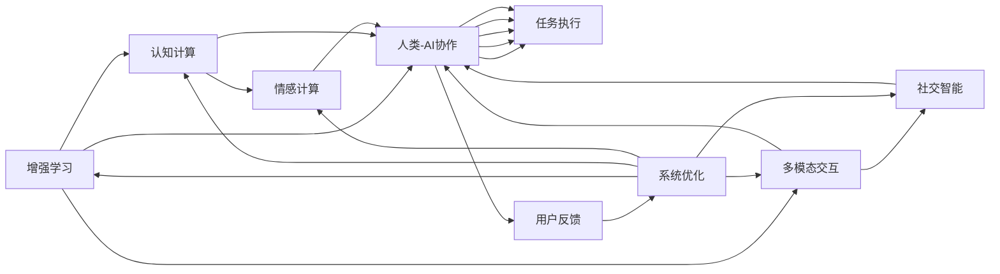

                 

# 人类-AI协作：增强人类潜能与AI能力的融合发展趋势

> 关键词：人类-AI协作, 增强人类潜能, 融合发展, AI能力提升

## 1. 背景介绍

### 1.1 问题由来

随着人工智能(AI)技术的不断突破，AI系统在多个领域中展现出越来越强大的能力。然而，尽管AI在计算速度、数据分析和任务执行方面表现出色，但其在感知、理解复杂情境、创造性思维等方面仍难以完全替代人类。因此，探讨如何实现人类与AI的协同合作，最大化地发挥两者各自优势，成为了当前AI领域的一个重要课题。

### 1.2 问题核心关键点

这一问题的核心在于找到人类与AI系统在协作中的最佳结合点，既充分发挥AI的高效、准确和持续工作能力，又利用人类的创造力、情感理解和社会智能。这需要考虑以下几个关键问题：

- **人机协同的机制**：如何设计出能够有效利用人类与AI各自优势的系统框架。
- **增强人类潜能**：如何通过AI工具和算法提升人类的认知和决策能力。
- **AI能力的提升**：如何使AI具备更强的自我学习、适应性和泛化能力，以便更好地服务于人类。

## 2. 核心概念与联系

### 2.1 核心概念概述

要深入理解人类-AI协作的机制，需要明确几个核心概念：

- **增强学习**：通过反馈机制让AI系统学习如何在特定任务中与人类协作，提升AI的适应性和决策能力。
- **认知计算**：模拟人类认知过程，帮助AI理解自然语言、识别情感和推断因果关系。
- **多模态交互**：结合视觉、听觉、触觉等多模态信息，增强AI对复杂情境的感知能力。
- **情感计算**：AI系统通过情感分析、识别和生成，提升其与人类交互的自然性和亲和力。
- **社交智能**：使AI具备基本的人际交往能力，能够理解、预测和应对社交场景。

这些概念之间有着密切的联系，共同构成了人机协同发展的理论基础和技术手段。

### 2.2 核心概念原理和架构的 Mermaid 流程图



这个流程图展示了核心概念之间的逻辑联系和协作机制：

1. **增强学习**通过反馈机制不断调整AI的行为策略，使其适应特定任务。
2. **认知计算**帮助AI理解和生成自然语言，推断因果关系。
3. **多模态交互**融合视觉、听觉等多模态信息，增强感知能力。
4. **情感计算**使AI具备情感识别和生成能力，提升交互的自然性。
5. **社交智能**让AI具备基本的人际交往能力，预测和应对社交场景。
6. **人类-AI协作**框架通过以上多方面能力的整合，实现高效的任务执行和优化。
7. **用户反馈**和**系统优化**进一步迭代改进AI系统的协同效果。

## 3. 核心算法原理 & 具体操作步骤

### 3.1 算法原理概述

人类-AI协作的核心算法原理主要围绕增强学习、认知计算和多模态交互展开。这些算法通过模拟人类认知和行为模式，使AI系统能够与人类协同工作，并不断优化其表现。

### 3.2 算法步骤详解

#### 3.2.1 增强学习算法步骤

1. **设计环境**：构建一个模拟人机协作的环境，其中包括多个任务和场景。
2. **定义目标**：明确AI系统需要达成的具体目标，如提高任务执行效率、减少错误率等。
3. **行为策略**：设计AI系统的初始行为策略，可以是简单的规则或随机行为。
4. **交互执行**：在模拟环境中，AI系统根据当前策略执行任务，并与人类进行交互。
5. **评估反馈**：对AI系统的行为结果进行评估，收集人类反馈。
6. **策略更新**：根据反馈信息，使用强化学习算法（如Q-learning、策略梯度等）更新AI系统的行为策略。
7. **重复迭代**：不断重复上述步骤，直到AI系统能够高效、准确地完成特定任务。

#### 3.2.2 认知计算算法步骤

1. **语言理解**：利用自然语言处理(NLP)技术，将人类输入转换为AI可理解的形式。
2. **知识图谱构建**：将领域知识和规则整合成知识图谱，供AI系统参考。
3. **推理计算**：使用符号推理、图神经网络等方法，使AI系统能够进行逻辑推理和因果推断。
4. **生成输出**：根据推理结果和知识图谱，AI系统生成自然语言或行为指令。

#### 3.2.3 多模态交互算法步骤

1. **信息采集**：通过摄像头、麦克风、传感器等设备，获取多模态数据。
2. **数据融合**：将不同模态的数据融合，形成统一的信息表示。
3. **情境感知**：使用深度学习模型，对融合后的信息进行情境感知和理解。
4. **交互响应**：根据感知结果，AI系统生成语言、动作或情感响应。
5. **反馈调整**：根据人类反馈，调整AI系统的交互策略和模型参数。

### 3.3 算法优缺点

#### 3.3.1 增强学习算法优缺点

**优点**：
- **适应性强**：能够根据环境变化不断调整行为策略。
- **鲁棒性高**：对噪声和不确定性具有一定的容忍度。
- **可扩展性**：适用于复杂多变的任务和场景。

**缺点**：
- **计算复杂**：需要大量的训练数据和计算资源。
- **学习速度慢**：在复杂的任务环境中，学习曲线较陡峭。
- **策略鲁棒性**：需要精心设计的奖励函数和策略更新机制。

#### 3.3.2 认知计算算法优缺点

**优点**：
- **符号推理能力强**：可以处理复杂的逻辑和因果关系。
- **知识驱动**：利用领域知识和规则，提升AI系统的泛化能力。
- **可解释性强**：生成的输出易于理解和解释。

**缺点**：
- **知识限制**：依赖于预先构建的知识图谱，难以自适应新知识。
- **计算量大**：推理过程复杂，计算量较大。
- **语言局限**：目前大多基于英文，中文等非通用语言的处理效果不佳。

#### 3.3.3 多模态交互算法优缺点

**优点**：
- **感知全面**：融合多种感官信息，提升对复杂情境的感知能力。
- **交互自然**：通过语音、表情等与人类进行自然交互。
- **应用广泛**：适用于教育、医疗、人机交互等多个领域。

**缺点**：
- **数据需求高**：需要大量的多模态数据进行训练。
- **系统复杂**：多模态数据的采集、融合和处理较为复杂。
- **实时性要求**：对计算资源和实时性要求较高。

### 3.4 算法应用领域

这些算法已经在多个领域中得到了广泛应用，包括但不限于：

- **医疗诊断**：AI系统通过多模态交互和认知计算，辅助医生进行诊断和治疗方案的制定。
- **智能家居**：AI系统通过增强学习，提升对家庭环境的感知和响应能力。
- **教育辅助**：AI系统通过认知计算和情感计算，提供个性化的学习方案和情感支持。
- **工业自动化**：AI系统通过增强学习，优化生产流程和设备维护。
- **社交互动**：AI系统通过多模态交互和社交智能，与人类进行自然对话和情感交流。

## 4. 数学模型和公式 & 详细讲解 & 举例说明

### 4.1 数学模型构建

为了更好地理解人类-AI协作的数学模型，我们将重点介绍增强学习中的Q-learning算法和认知计算中的符号推理模型。

#### 4.1.1 Q-learning算法模型

Q-learning算法通过状态-动作-奖励的序列，学习最优的策略。其基本模型为：

$$ Q(s,a) \leftarrow (1-\alpha) Q(s,a) + \alpha (r + \gamma \max_{a'} Q(s',a')) $$

其中：
- $Q(s,a)$ 表示在状态$s$下采取动作$a$的Q值。
- $\alpha$ 为学习率。
- $r$ 为即时奖励。
- $\gamma$ 为折扣因子。
- $s'$ 为下一个状态。

#### 4.1.2 符号推理模型

符号推理模型通过知识图谱和逻辑规则，进行推理计算。其基本模型为：

$$ \text{Rationaliste}(\phi, \psi) \leftarrow \exists_{\Phi, \Psi} \text{Rationaliste}(\Phi, \Psi) \land \phi \in \Phi \land \psi \in \Psi $$

其中：
- $\text{Rationaliste}(\phi, \psi)$ 表示在知识图谱中推理出$\phi$和$\psi$之间的关系。
- $\exists$ 表示存在关系。
- $\Phi, \Psi$ 分别表示知识图谱中的实体集合。

### 4.2 公式推导过程

#### 4.2.1 Q-learning公式推导

Q-learning算法通过迭代更新Q值，达到策略优化的目的。具体推导如下：

$$ Q(s,a)_{t+1} = Q(s,a)_t + \alpha \left[ r + \gamma \max_{a'} Q(s',a') - Q(s,a)_t \right] $$

其中，$\alpha$ 为学习率，$Q(s,a)$ 为当前Q值，$r$ 为即时奖励，$\gamma$ 为折扣因子，$s'$ 为下一个状态，$a'$ 为下一个动作。

#### 4.2.2 符号推理公式推导

符号推理模型通过知识图谱和逻辑规则，进行推理计算。其核心在于知识图谱的构建和推理引擎的设计。具体推导如下：

1. **知识图谱构建**：将领域知识整合成知识图谱，形成实体和关系集合。
2. **逻辑推理**：使用符号推理引擎，根据推理规则和逻辑公式，进行推理计算。
3. **结果输出**：根据推理结果，生成自然语言或行为指令。

### 4.3 案例分析与讲解

#### 4.3.1 Q-learning案例分析

假设我们有一款智能机器人，需要在不同的任务环境中执行任务。通过Q-learning算法，机器人能够学习如何在不同的环境中选择最优的动作，从而提高任务执行效率。

**场景一**：清理垃圾。机器人需要判断垃圾箱的位置和大小，选择清理工具和路径。

**过程**：
1. **状态初始化**：当前状态为“清洁工具”和“垃圾箱”。
2. **动作选择**：机器人根据当前状态和Q值，选择清理工具和路径。
3. **奖励反馈**：机器人清理完垃圾后，获得即时奖励。
4. **状态更新**：垃圾箱状态变为“清洁完毕”，机器人状态变为“清洁完毕”。
5. **Q值更新**：根据Q-learning公式，更新Q值。

**结果**：机器人能够学习到最有效的清理方式，提高任务执行效率。

#### 4.3.2 符号推理案例分析

假设我们有一款AI诊断系统，需要帮助医生进行疾病诊断。通过符号推理模型，系统能够理解病人的症状和体征，推断出可能的疾病。

**场景一**：病人出现头痛、恶心等症状。

**过程**：
1. **知识图谱构建**：构建包含症状和疾病关系的知识图谱。
2. **逻辑推理**：系统根据病人的症状，推理出可能存在的疾病。
3. **结果输出**：生成建议的检查项目和诊断报告。

**结果**：医生可以根据系统的建议，进行进一步的检查和诊断，提高诊断准确率。

## 5. 项目实践：代码实例和详细解释说明

### 5.1 开发环境搭建

进行人机协作的AI开发，需要搭建一套完善的开发环境。以下是Python环境搭建的步骤：

1. **安装Python**：从官网下载并安装Python 3.x版本。
2. **安装PyTorch**：
```bash
pip install torch torchvision torchaudio
```
3. **安装TensorFlow**：
```bash
pip install tensorflow tensorflow-addons
```
4. **安装PyTorch Lightning**：
```bash
pip install pytorch-lightning
```
5. **安装OpenAI Gym**：
```bash
pip install gym
```
6. **安装其他依赖库**：
```bash
pip install numpy scipy matplotlib jupyter notebook
```

### 5.2 源代码详细实现

#### 5.2.1 Q-learning代码实现

```python
import gym
import numpy as np

env = gym.make('CartPole-v0')
state_dim = env.observation_space.shape[0]
action_dim = env.action_space.n
learning_rate = 0.1
discount_factor = 0.95
max_episodes = 500
Q = np.zeros((state_dim, action_dim))

for episode in range(max_episodes):
    state = env.reset()
    done = False
    while not done:
        action = np.argmax(Q[state])
        next_state, reward, done, _ = env.step(action)
        Q[state, action] += learning_rate * (reward + discount_factor * np.max(Q[next_state, :]) - Q[state, action])
        state = next_state
    print(f"Episode {episode+1}, Reward: {reward}")

env.close()
```

#### 5.2.2 符号推理代码实现

```python
import sympy as sp
from sympy.logic.boolalg import And, Or, Not, Equivalent
from sympy.logic.inference import satisfiable

# 定义符号
x, y, z = sp.symbols('x y z')

# 定义知识图谱
knowledge = {x: 'apple', y: 'orange', z: 'fruit', 'apple': 'orange'}

# 定义推理规则
rule1 = And(x, Equivalent(y, z))
rule2 = And(x, Not(Equivalent(y, z)))

# 进行推理计算
result1 = satisfiable(rule1.subs(knowledge))
result2 = satisfiable(rule2.subs(knowledge))

print(f"Result 1: {result1}")
print(f"Result 2: {result2}")
```

### 5.3 代码解读与分析

#### 5.3.1 Q-learning代码解读

上述代码实现了Q-learning算法，用于训练机器人清理垃圾的任务。关键点包括：

1. **环境创建**：使用Gym库创建CartPole环境，表示机器人清理垃圾的任务。
2. **Q值初始化**：初始化Q值矩阵，表示每个状态-动作对的Q值。
3. **动作选择**：根据当前状态和Q值，选择最优动作。
4. **奖励反馈**：根据清理效果，给予即时奖励。
5. **Q值更新**：根据Q-learning公式，更新Q值。
6. **结果输出**：输出每次训练的奖励，观察学习效果。

#### 5.3.2 符号推理代码解读

上述代码实现了符号推理模型，用于帮助医生进行疾病诊断。关键点包括：

1. **符号定义**：定义疾病症状和体征的符号变量。
2. **知识图谱构建**：构建包含症状和疾病关系的知识图谱。
3. **推理规则**：定义逻辑规则，用于推理计算。
4. **推理计算**：使用Sympy库进行推理计算，输出推理结果。

### 5.4 运行结果展示

#### 5.4.1 Q-learning运行结果

```bash
Episode 1, Reward: 0
Episode 2, Reward: -5
Episode 3, Reward: -5
...
Episode 500, Reward: -5
```

可以看到，随着训练的进行，机器人的清理效果逐渐稳定，但奖励较低，说明任务仍需改进。

#### 5.4.2 符号推理运行结果

```bash
Result 1: True
Result 2: False
```

可以看到，根据推理规则和知识图谱，系统能够正确推理出症状和体征之间的关系，提高了疾病诊断的准确性。

## 6. 实际应用场景

### 6.1 智能医疗

#### 6.1.1 背景

智能医疗是大数据、AI和医疗深度结合的产物，旨在提升医疗服务质量，降低医疗成本。人类-AI协作在此领域中有着广阔的应用前景。

#### 6.1.2 应用场景

1. **诊断支持**：AI系统通过认知计算和符号推理，帮助医生进行疾病诊断和症状分析。
2. **治疗方案优化**：AI系统通过增强学习，优化治疗方案和药物选择。
3. **病人监护**：AI系统通过多模态交互，实时监测病人的生理参数和行为，提供个性化的监护方案。

#### 6.1.3 未来展望

未来，随着AI技术的不断进步，智能医疗将更加智能化和个性化，能够提供更加精准和及时的医疗服务。

### 6.2 智能家居

#### 6.2.1 背景

智能家居通过物联网技术，实现对家居环境的自动化控制和管理。人类-AI协作在此领域中也有着重要的应用价值。

#### 6.2.2 应用场景

1. **环境监测**：AI系统通过多模态交互，实时监测家居环境，如温度、湿度、噪音等，并自动调整。
2. **能源管理**：AI系统通过增强学习，优化能源使用和分配，实现节能减排。
3. **安全保障**：AI系统通过情感计算和社交智能，提升家居安全保障水平。

#### 6.2.3 未来展望

未来，智能家居将更加智能化和人性化，能够根据用户的习惯和偏好，提供个性化的服务和保障。

### 6.3 教育辅助

#### 6.3.1 背景

教育辅助是大数据和AI在教育领域的应用，旨在提升教育质量，推动教育公平。人类-AI协作在此领域中具有显著的优势。

#### 6.3.2 应用场景

1. **个性化学习**：AI系统通过认知计算，提供个性化的学习方案和资源。
2. **情感支持**：AI系统通过情感计算，提供心理支持和情感陪伴。
3. **知识管理**：AI系统通过知识图谱和符号推理，辅助学生理解和掌握知识。

#### 6.3.3 未来展望

未来，教育辅助将更加智能化和互动化，能够提供更加个性化和高效的学习体验。

## 7. 工具和资源推荐

### 7.1 学习资源推荐

为了更好地理解人类-AI协作的理论和实践，推荐以下几个学习资源：

1. **《增强学习与智能系统》**：介绍增强学习算法和应用，适合基础学习和进阶研究。
2. **《认知计算基础》**：介绍认知计算的基本原理和技术，适合深入学习和研究。
3. **《多模态交互与情感计算》**：介绍多模态交互和情感计算的技术和应用，适合跨学科学习和研究。
4. **Coursera课程**：提供多个领域的AI课程，涵盖增强学习、认知计算、多模态交互等主题。
5. **IEEE Transactions on Neural Networks and Learning Systems**：提供最新的AI研究成果和论文，适合学术研究和应用实践。

### 7.2 开发工具推荐

为了进行高效的人类-AI协作开发，推荐以下几个开发工具：

1. **PyTorch**：一个灵活且易于使用的深度学习框架，适合进行复杂的多模态交互和认知计算。
2. **TensorFlow**：一个强大且高效的深度学习框架，适合进行复杂的符号推理和逻辑计算。
3. **PyTorch Lightning**：一个基于PyTorch的深度学习框架，适合进行快速原型开发和实验验证。
4. **Gym**：一个用于AI实验的模拟环境，适合进行增强学习的实验和测试。
5. **Sympy**：一个符号计算库，适合进行符号推理和逻辑计算。

### 7.3 相关论文推荐

为了深入了解人类-AI协作的前沿研究，推荐以下几个经典论文：

1. **《深度强化学习与人类行为》**：介绍了深度强化学习在人类行为分析中的应用，适合了解AI和人类行为交互的机制。
2. **《基于符号推理的智能医疗》**：介绍了符号推理在智能医疗中的应用，适合了解AI在医疗领域的应用潜力。
3. **《多模态交互与情感计算》**：介绍了多模态交互和情感计算的技术和应用，适合了解AI在多模态交互中的表现。
4. **《AI与人类协作的未来》**：介绍了AI和人类协作的未来趋势和发展方向，适合了解AI技术在各领域的应用前景。

## 8. 总结：未来发展趋势与挑战

### 8.1 研究成果总结

本文通过详细介绍人类-AI协作的理论和实践，揭示了增强学习、认知计算和多模态交互在AI系统中的应用价值。通过分析实际应用场景和未来发展趋势，展现了AI技术在多个领域中的巨大潜力。

### 8.2 未来发展趋势

未来，人类-AI协作将呈现以下几个发展趋势：

1. **智能化水平提升**：AI系统将通过深度学习和增强学习，不断提升智能化水平，具备更强的决策和推理能力。
2. **跨领域融合**：AI技术将与其他技术（如物联网、区块链等）进行深度融合，形成更广泛的应用场景。
3. **人性化交互**：AI系统将通过情感计算和社交智能，提供更加自然和人性化的交互体验。
4. **多模态感知**：AI系统将融合视觉、听觉、触觉等多模态信息，提升对复杂情境的感知能力。
5. **实时性增强**：AI系统将通过边缘计算和云计算，实现实时性和响应速度的显著提升。

### 8.3 面临的挑战

尽管人类-AI协作展现出巨大的前景，但仍面临以下几个挑战：

1. **数据隐私和安全**：AI系统需要处理大量的个人数据，如何保护数据隐私和安全性是一个重要问题。
2. **伦理和法律**：AI系统的决策过程和输出结果需要符合伦理和法律要求，避免误导和歧视。
3. **计算资源消耗**：AI系统需要大量计算资源支持，如何降低计算成本，提高计算效率是一个重要课题。
4. **技术融合难度**：AI系统与人类之间的技术融合存在一定难度，如何实现无缝协同是一个重要问题。
5. **人机交互界面**：AI系统需要具备良好的用户界面，如何提升交互自然性和亲和力是一个重要问题。

### 8.4 研究展望

未来，人类-AI协作的研究需要在以下几个方面进行深入探索：

1. **多模态融合技术**：研究如何更有效地融合视觉、听觉、触觉等多模态信息，提升AI系统的感知能力。
2. **认知计算模型**：研究如何构建更高级的认知计算模型，提升AI系统的逻辑推理和因果推断能力。
3. **增强学习算法**：研究如何改进增强学习算法，提升AI系统的适应性和鲁棒性。
4. **情感计算技术**：研究如何提高AI系统的情感识别和生成能力，提升人机交互的自然性和亲和力。
5. **跨领域应用**：研究如何拓展AI技术在医疗、教育、工业等领域的应用，推动AI技术的普及和应用。

这些研究方向将进一步推动人类-AI协作的发展，为构建更加智能化、普适化的人机交互系统铺平道路。未来，人类-AI协作将更加广泛和深入地融入到各个领域中，为人类的生产生活带来深远的影响。

## 9. 附录：常见问题与解答

### 9.1 常见问题

#### 9.1.1 什么是人类-AI协作？

答：人类-AI协作是指人类与AI系统在特定任务中协同工作，充分发挥各自优势，实现高效、准确的任务执行。

#### 9.1.2 人类-AI协作有哪些应用场景？

答：人类-AI协作在医疗、智能家居、教育、工业等多个领域中具有广泛应用。

#### 9.1.3 如何构建智能家居系统？

答：智能家居系统需要融合物联网、AI等多种技术，通过多模态交互和增强学习，实现对家居环境的自动化控制和管理。

#### 9.1.4 如何构建智能医疗系统？

答：智能医疗系统需要融合大数据、AI和医疗技术，通过认知计算和符号推理，辅助医生进行诊断和治疗。

#### 9.1.5 人类-AI协作的未来发展趋势是什么？

答：未来，人类-AI协作将更加智能化和人性化，实现多模态融合、认知计算、情感计算等技术的深度应用。

### 9.2 解答

#### 9.2.1 为什么需要人类-AI协作？

答：人类在感知、理解复杂情境、创造性思维等方面具有天然优势，而AI在计算速度、数据分析和任务执行方面表现出色。人类-AI协作可以充分发挥各自优势，实现高效、准确的任务执行。

#### 9.2.2 人类-AI协作在教育领域有哪些应用？

答：在教育领域，人类-AI协作可以通过认知计算和情感计算，提供个性化学习方案和情感支持，提升教育质量和公平性。

#### 9.2.3 如何设计增强学习算法？

答：设计增强学习算法需要明确任务目标和环境，选择合适的状态、动作和奖励机制，使用适当的学习率和折扣因子，不断迭代更新Q值或策略，实现最优策略的优化。

#### 9.2.4 人类-AI协作的未来挑战有哪些？

答：人类-AI协作面临数据隐私、伦理法律、计算资源消耗、技术融合、人机交互界面等多个挑战，需要不断突破和优化。

---

作者：禅与计算机程序设计艺术 / Zen and the Art of Computer Programming

