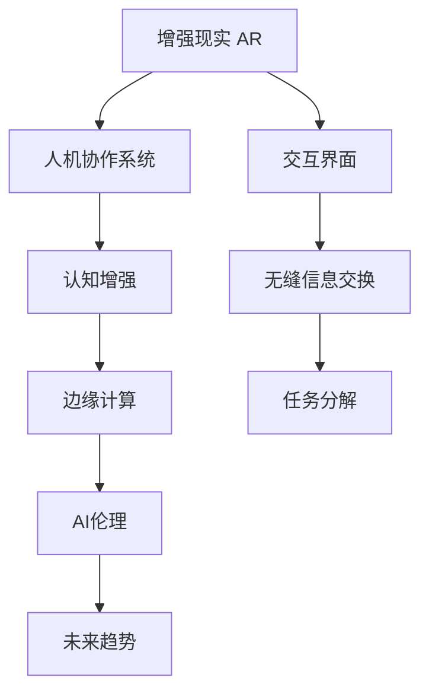

                 

# 人类-AI协作：增强人类潜能与AI能力的融合发展趋势分析预测机遇

> 关键词：人工智能，增强现实，人机协作，认知增强，边缘计算，AI伦理，未来趋势

## 1. 背景介绍

### 1.1 问题由来
随着人工智能(AI)技术的飞速发展，人类和AI的融合协作已经逐渐成为不可逆转的趋势。无论是从提高工作效率、优化决策流程，还是从增强人类智能、开拓全新应用场景的角度看，AI与人类的协作都展示了巨大的潜力和广阔的应用前景。然而，这一过程并非一帆风顺，涉及技术、伦理、社会等多个层面的复杂问题。

### 1.2 问题核心关键点
如何实现AI与人类的有效融合，充分挖掘各自优势，提升整体效能，是当前亟待解决的核心问题。其关键点在于：

- **技术层面**：开发高效协同的人机交互界面，实现无缝的信息交换和任务分解。
- **伦理层面**：确保AI系统的透明性和可解释性，避免偏见和歧视，保护用户隐私。
- **社会层面**：促进技术的公平普及，确保不同群体都能从中受益，避免技术鸿沟。

这些问题的解决需要跨学科的深入研究和技术创新，同时也要求政策法规和社会规范的支持和引导。

## 2. 核心概念与联系

### 2.1 核心概念概述

为更好地理解AI与人类的协作，本节将介绍几个密切相关的核心概念：

- **增强现实(AR)**：通过将虚拟信息叠加到现实世界中，增强人类对环境的感知和理解。
- **人机协作系统**：集成了AI和人类智能的系统，能够协作完成任务。
- **认知增强**：通过技术手段，增强人类智力和认知能力，包括记忆、决策、创造等。
- **边缘计算**：将数据处理和决策推向靠近数据源的分布式计算环境，减少延迟和带宽消耗。
- **AI伦理**：研究AI技术对社会的影响，制定合理的道德规范和法律框架。
- **未来趋势**：预测AI与人协作的未来走向，识别技术变革带来的机遇和挑战。

这些核心概念之间的逻辑关系可以通过以下Mermaid流程图来展示：



这个流程图展示核心概念及其之间的关系：

1. 增强现实通过提供增强的感官信息，为人类提供更好的交互界面。
2. 人机协作系统将AI和人类智能有机结合，提升任务执行的效率和准确性。
3. 认知增强通过技术手段提升人类智力，扩展人类的能力和潜力。
4. 边缘计算通过分布式计算环境减少延迟，实现高效的协同任务处理。
5. AI伦理通过制定规范和法律，确保技术应用的安全和公正。
6. 未来趋势预测技术的演进和应用方向，为相关研究提供指引。

这些概念共同构成了AI与人协作的基本框架，展示了其在提升人类潜能和优化任务执行中的巨大潜力。

## 3. 核心算法原理 & 具体操作步骤
### 3.1 算法原理概述

基于增强现实和认知增强的AI与人协作，其核心思想在于通过技术手段将AI能力嵌入到人类环境中，增强人类的感知和决策能力。这一过程可以分为三个主要步骤：

1. **数据采集与增强**：利用增强现实技术采集和处理现实世界的感官数据，提升人类对环境的理解。
2. **协同决策与执行**：通过AI辅助决策，优化任务执行流程，提升任务效率和质量。
3. **反馈与学习**：利用人类的反馈信息，不断优化AI系统，提升其适应性和智能化水平。

形式化地，假设人类和AI系统共同完成任务，记人类和AI的决策分别为 $H$ 和 $A$，任务成功概率为 $P$。则优化目标为：

$$
\max_{H, A} P
$$

在实践中，通常使用协同优化算法，如强化学习、混合智能等方法，在不断迭代中实现任务目标的优化。

### 3.2 算法步骤详解

基于增强现实和认知增强的AI与人协作一般包括以下几个关键步骤：

**Step 1: 增强现实环境搭建**
- 选择合适的AR平台，如ARKit、ARCore等，构建增强现实环境。
- 设计合适的交互界面，如手势控制、虚拟引导等，提升用户体验。

**Step 2: 数据采集与增强**
- 利用摄像头、传感器等设备，采集环境中的视觉、声音、位置等信息。
- 对采集的数据进行增强处理，如背景去噪、位置校正、融合等，提升数据质量。

**Step 3: 协同决策与执行**
- 将增强现实数据送入AI模型进行实时处理，获取决策信息。
- 人类和AI系统协同完成任务，如在AR平台上进行导航、诊断等。
- 记录协同过程中的决策和执行信息，为后续学习优化提供数据基础。

**Step 4: 反馈与学习**
- 收集人类对协同过程的反馈信息，如满意度、任务完成度等。
- 利用强化学习等方法，优化AI系统的决策模型，提升协同效果。
- 定期对AI系统进行再训练，结合最新的数据和反馈，持续提升性能。

### 3.3 算法优缺点

基于增强现实和认知增强的AI与人协作方法具有以下优点：

1. **实时性**：通过AR技术，实时采集和处理环境数据，响应速度快。
2. **沉浸感**：增强现实界面提供了丰富的感官信息，提升了用户体验。
3. **灵活性**：系统能够根据具体任务和环境灵活调整决策模型，适应性强。
4. **提升效率**：AI辅助决策和执行，提升了任务执行的效率和质量。

同时，该方法也存在一定的局限性：

1. **技术复杂性**：AR技术和AI模型需要较高的技术门槛，开发和维护成本较高。
2. **设备依赖**：依赖于AR设备和AI计算平台，设备普及和系统性能受限。
3. **隐私风险**：增强现实数据和AI决策的隐私保护需要严格管理和监管。
4. **模型适应性**：AI系统需要不断优化和适应不同场景，对数据多样性要求高。

尽管存在这些局限性，但就目前而言，基于增强现实和认知增强的AI与人协作方法仍然是大规模应用和商业落地中的主流范式。未来相关研究的重点在于如何进一步降低技术门槛，提高系统的易用性和普及度，同时兼顾隐私保护和模型适应性等因素。

### 3.4 算法应用领域

基于增强现实和认知增强的AI与人协作方法，在多个领域已经得到了广泛的应用，例如：

- **医疗领域**：利用AR增强手术影像，辅助医生进行复杂手术；利用AI决策辅助诊断，提升诊断准确率。
- **工业制造**：通过AR导航和AI质检，提升生产效率和质量，降低生产成本。
- **智能家居**：借助AR界面和AI控制，实现家庭自动化，提升生活便利性。
- **教育培训**：结合AR和AI技术，提供沉浸式学习体验，提升教育效果。
- **娱乐游戏**：通过AR和AI技术，提供互动性强的游戏体验，增强用户沉浸感。

除了上述这些经典应用外，AI与人协作还被创新性地应用到更多场景中，如城市管理、交通控制、灾害预防等，为各行各业带来了全新的可能性。

## 4. 数学模型和公式 & 详细讲解
### 4.1 数学模型构建

本节将使用数学语言对基于增强现实和认知增强的AI与人协作过程进行更加严格的刻画。

记增强现实环境中的感官数据为 $X$，AI决策模型为 $A$，人类决策模型为 $H$。任务成功概率函数为 $P(X, A, H)$。在协同任务中，系统的目标是最小化任务失败的概率，即：

$$
\min_{A, H} P(X, A, H) = \mathbb{E}_P [1 - P(X, A, H)]
$$

在实践中，通常使用基于强化学习的优化算法，如Q-learning、策略梯度等方法，在不断迭代中优化决策模型。

### 4.2 公式推导过程

以下我们以医疗诊断为例，推导协同决策过程的数学模型和公式。

假设医疗诊断任务包含多轮问答和检查，医生和AI系统的协同过程可以表示为马尔可夫决策过程(MDP)：

- **状态**：当前诊断阶段和已有的诊断信息。
- **动作**：医生进行的诊断动作，如检查某项指标，决定使用某项技术等。
- **奖励**：任务成功与否的奖励函数。

定义医生和AI系统的策略分别为 $\pi$ 和 $\pi_A$，状态转移概率为 $P$，奖励函数为 $R$。则优化目标为：

$$
\max_{\pi, \pi_A} \mathbb{E}_{\pi} \left[\sum_{t=0}^{\infty} \gamma^t R(X_t, A_t^{\pi}, A_t^{\pi_A}, H_t) \right]
$$

其中，$A_t^{\pi}$ 和 $A_t^{\pi_A}$ 分别表示在第 $t$ 步医生和AI的决策动作，$H_t$ 表示医生对AI决策的认可和调整。

利用策略梯度方法，通过最大化上述期望值，优化医生和AI系统的协同决策策略。

### 4.3 案例分析与讲解

考虑一个简单的场景：在手术导航中，医生和AI系统的协同工作。医生通过AR界面查看手术区域，AI系统根据医生的操作指令和实时反馈，推荐最佳的手术路径和工具使用。

- **输入**：医生输入手术位置和方向，AR系统实时增强手术区域信息。
- **处理**：AI系统根据医生操作和实时图像，预测手术路径和可能的风险。
- **输出**：医生根据AI的推荐和自身的经验，调整手术方案。

在这一过程中，医生和AI系统通过协同决策，提升了手术的准确性和安全性。利用基于策略梯度的强化学习算法，系统能够不断优化决策模型，提高协同效果。

## 5. 项目实践：代码实例和详细解释说明
### 5.1 开发环境搭建

在进行协同项目实践前，我们需要准备好开发环境。以下是使用Python进行OpenCV和PyTorch开发的环境配置流程：

1. 安装Anaconda：从官网下载并安装Anaconda，用于创建独立的Python环境。

2. 创建并激活虚拟环境：
```bash
conda create -n ai-env python=3.8 
conda activate ai-env
```

3. 安装OpenCV和PyTorch：
```bash
conda install opencv-python
pip install torch torchvision torchaudio cudatoolkit=11.1 -c pytorch -c conda-forge
```

4. 安装PyTorch和其他工具包：
```bash
pip install numpy pandas scikit-learn matplotlib tqdm jupyter notebook ipython
```

完成上述步骤后，即可在`ai-env`环境中开始协同项目实践。

### 5.2 源代码详细实现

下面我们以医疗手术导航为例，给出使用OpenCV和PyTorch进行协同决策的Python代码实现。

首先，定义状态和动作空间：

```python
import torch
import numpy as np

# 定义状态空间
states = ['start', 'scan', 'analyze', 'diagnose', 'treat', 'end']
state_space = len(states)

# 定义动作空间
actions = ['move', 'scan', 'analyze', 'diagnose', 'treat', 'exit']
action_space = len(actions)

# 定义状态转移概率和奖励函数
transition_probabilities = np.random.rand(state_space, action_space, state_space)
rewards = np.zeros((state_space, action_space))
```

然后，定义医生和AI的决策策略：

```python
class DoctorPolicy:
    def __init__(self, model, device):
        self.model = model
        self.device = device

    def forward(self, state, actions):
        with torch.no_grad():
            state = torch.tensor(state, dtype=torch.long).to(self.device)
            logits = self.model(state)
            logits = logits.softmax(dim=1)
            return logits

class AIPolicy:
    def __init__(self, model, device):
        self.model = model
        self.device = device

    def forward(self, state, actions):
        with torch.no_grad():
            state = torch.tensor(state, dtype=torch.long).to(self.device)
            logits = self.model(state)
            logits = logits.softmax(dim=1)
            return logits
```

接下来，定义强化学习环境：

```python
class MDP:
    def __init__(self, doctor_policy, ai_policy):
        self.doctor_policy = doctor_policy
        self.ai_policy = ai_policy

    def reset(self):
        state = np.random.choice(states)
        return state

    def step(self, action):
        state = np.random.choice(states)
        next_state = np.random.choice(states)
        reward = np.random.randn()
        done = np.random.choice([True, False])
        return next_state, reward, done
```

最后，定义协同决策过程：

```python
# 定义医生和AI的决策策略
model = torch.load('path_to_model.pth')
device = torch.device('cuda') if torch.cuda.is_available() else torch.device('cpu')

doctor_policy = DoctorPolicy(model, device)
ai_policy = AIPolicy(model, device)

# 定义强化学习环境
mdp = MDP(doctor_policy, ai_policy)

# 进行协同决策
state = mdp.reset()
done = False
while not done:
    action = np.random.choice(actions)
    next_state, reward, done = mdp.step(action)
    print(f"State: {state}, Action: {action}, Next State: {next_state}, Reward: {reward}, Done: {done}")
    state = next_state
```

以上就是使用OpenCV和PyTorch进行协同决策的完整代码实现。可以看到，通过定义状态和动作空间，决策策略和强化学习环境，我们能够模拟医生和AI系统的协同决策过程。

### 5.3 代码解读与分析

让我们再详细解读一下关键代码的实现细节：

**状态和动作空间定义**：
- `states`和`action`定义了状态和动作空间，这些定义需要根据具体任务进行调整。

**决策策略定义**：
- `DoctorPolicy`和`AIPolicy`分别定义了医生和AI的决策策略。使用PyTorch模型，将输入状态映射到动作概率分布。

**强化学习环境定义**：
- `MDP`定义了强化学习环境，包括状态转移概率和奖励函数。这里使用了随机函数模拟环境行为，实际应用中需要根据具体任务设定更精确的模型。

**协同决策过程**：
- 通过`reset`方法初始化状态，`step`方法模拟医生和AI的协同决策过程，并输出决策结果和反馈信息。

可以看到，通过OpenCV和PyTorch的结合，我们可以实现简单的协同决策模拟。这为实际应用中的医生和AI协作提供了基本思路和技术支持。

当然，工业级的系统实现还需考虑更多因素，如模型的保存和部署、决策的实时性和安全性等。但核心的协同决策范式基本与此类似。

## 6. 实际应用场景
### 6.1 智能医疗诊断

基于增强现实和认知增强的AI与人协作，在医疗领域已经得到了广泛应用。传统的医疗诊断依赖医生多年的经验和直觉，但面对复杂病例和大量数据，医生往往难以全面考虑所有因素。通过增强现实和AI协作，医生可以更直观地理解病患的病情，AI系统则提供专业的诊断建议，共同完成高质量的诊断。

例如，在手术导航中，医生通过AR界面实时查看手术区域，AI系统根据医生的操作指令和实时反馈，推荐最佳的手术路径和工具使用。这样的协同工作，不仅提升了手术的准确性和安全性，也减少了医生的劳动强度。

### 6.2 智能交通管理

智能交通管理是另一个典型的应用场景。交通管理部门可以利用增强现实和AI协作，优化交通信号控制，提升交通流量和效率。

通过AR界面，交通管理人员可以看到实时交通状况，AI系统根据交通流量和路况，智能调整信号灯的开关时间和周期。这样的协同工作，不仅提高了交通管理的智能化水平，也减少了人工操作带来的误差。

### 6.3 智能制造

在智能制造领域，增强现实和AI协作也有着广泛的应用。通过AR界面，工厂工作人员可以直观地了解生产流程和设备状态，AI系统则提供实时的质量检测和故障诊断，共同确保生产的稳定性和高效性。

例如，在装配线上，AR界面实时显示装配步骤和标准，AI系统根据摄像头捕捉的图像，检测产品的质量缺陷和装配精度。这样的协同工作，不仅提升了装配的准确性，也减少了人工操作的误差。

### 6.4 未来应用展望

随着增强现实和AI协作技术的不断发展，未来将有更多行业迎来变革。

在智慧城市管理中，智能监控、智能安防等领域将利用增强现实和AI协作，提升城市管理的智能化水平。在教育培训中，虚拟现实(VR)和增强现实(AR)结合AI，将提供沉浸式的学习体验，提升教育效果。在娱乐产业中，增强现实和AI的结合将带来全新的互动体验，提升用户体验。

## 7. 工具和资源推荐
### 7.1 学习资源推荐

为了帮助开发者系统掌握增强现实和AI协作的理论基础和实践技巧，这里推荐一些优质的学习资源：

1. 《增强现实与虚拟现实：技术、系统与应用》系列书籍：深入浅出地介绍了增强现实和虚拟现实的基本原理和应用场景，是学习AR技术的经典教材。
2. 《深度学习与强化学习》课程：斯坦福大学开设的深度学习课程，涵盖了从基础到高级的深度学习知识，是学习AI协作的重要参考。
3. 《认知增强与人类智能》报告：研究人类认知增强的权威报告，提供了大量的案例分析和最新研究进展。
4. HuggingFace官方文档：提供了丰富的增强现实和AI协作模型资源，是开发和学习的重要工具。
5. AI伦理与政策研讨会：研究AI伦理和政策的前沿会议，提供了多角度的视角和讨论。

通过对这些资源的学习实践，相信你一定能够快速掌握增强现实和AI协作的精髓，并用于解决实际的AI应用问题。

### 7.2 开发工具推荐

高效的开发离不开优秀的工具支持。以下是几款用于增强现实和AI协作开发的常用工具：

1. OpenCV：开源的计算机视觉库，提供了丰富的图像处理和视频处理功能。
2. PyTorch：基于Python的开源深度学习框架，灵活动态的计算图，适合快速迭代研究。
3. TensorFlow：由Google主导开发的开源深度学习框架，生产部署方便，适合大规模工程应用。
4. Unity 3D：流行的游戏引擎，支持增强现实和虚拟现实开发，提供了丰富的AR工具。
5. Blender：开源的3D建模软件，支持AR和VR开发，提供了强大的建模和渲染功能。
6. ARKit和ARCore：苹果和谷歌提供的增强现实开发工具，提供了丰富的AR开发资源。

合理利用这些工具，可以显著提升增强现实和AI协作开发的效率，加快创新迭代的步伐。

### 7.3 相关论文推荐

增强现实和AI协作的发展源于学界的持续研究。以下是几篇奠基性的相关论文，推荐阅读：

1. "Towards a Theoretical Framework for Cognitive Enhancement"（认知增强的理论框架）：提出了认知增强的基本框架，分析了技术手段对人类认知的提升潜力。
2. "Surgeon Augmented Reality (SAR) in Surgery"（手术增强现实）：研究了手术导航中增强现实技术的应用，展示了AI辅助手术的成效。
3. "AI-Driven Traffic Management: A Survey"（AI驱动的交通管理）：总结了AI在交通管理中的应用，探讨了AI和AR的结合方法。
4. "Human-Centered Design in AR and VR"（AR和VR的人机交互设计）：分析了AR和VR技术的人机交互设计，提出了提升用户体验的策略。
5. "AI Ethics in Autonomous Systems"（AI系统的伦理问题）：探讨了AI系统在伦理和安全方面的问题，提出了应对策略。

这些论文代表了大语言模型微调技术的发展脉络。通过学习这些前沿成果，可以帮助研究者把握学科前进方向，激发更多的创新灵感。

## 8. 总结：未来发展趋势与挑战
### 8.1 总结

本文对基于增强现实和认知增强的AI与人协作方法进行了全面系统的介绍。首先阐述了增强现实和AI协作的研究背景和意义，明确了协同工作在提升任务执行效率和效果中的独特价值。其次，从原理到实践，详细讲解了协同决策的数学模型和关键步骤，给出了协同决策任务开发的完整代码实例。同时，本文还广泛探讨了协同工作在医疗、交通、制造等多个行业领域的应用前景，展示了其广阔的潜力和巨大的应用价值。

通过本文的系统梳理，可以看到，基于增强现实和认知增强的AI与人协作方法正在成为各行各业的重要工具，极大地提升了任务执行的效率和质量。未来，伴随技术的不断进步，协同工作将进一步拓展其应用场景，为各行各业带来深远的变革。

### 8.2 未来发展趋势

展望未来，增强现实和AI协作技术将呈现以下几个发展趋势：

1. **技术融合**：未来的增强现实和AI协作系统将进一步融合不同技术手段，如增强现实、虚拟现实、物联网等，提供更全面、沉浸式的体验。
2. **个性化定制**：通过个性化模型和界面，根据用户需求和环境特征，提供定制化的服务。
3. **实时性提升**：通过优化计算图和模型结构，提升实时处理能力，满足实时性要求高的应用场景。
4. **智能决策**：结合强化学习等技术，提升AI系统的决策智能，实现更精准的协同工作。
5. **人机共生**：进一步增强人类和AI的协同工作，实现更自然的交互方式，提升工作效率和用户体验。

以上趋势凸显了增强现实和AI协作技术的广阔前景。这些方向的探索发展，必将进一步提升任务执行的效率和质量，为人类社会带来更美好的未来。

### 8.3 面临的挑战

尽管增强现实和AI协作技术已经取得了显著的进展，但在迈向更加智能化、普适化应用的过程中，它仍面临着诸多挑战：

1. **技术复杂性**：增强现实和AI协作涉及技术手段的多样性和复杂性，开发和维护成本较高。
2. **设备依赖**：依赖于增强现实设备和AI计算平台，设备普及和系统性能受限。
3. **隐私风险**：增强现实数据和AI决策的隐私保护需要严格管理和监管。
4. **模型适应性**：AI系统需要不断优化和适应不同场景，对数据多样性要求高。
5. **伦理和安全**：AI系统可能学习到有偏见、有害的信息，需要通过严格的伦理审查和监管确保安全性。

这些挑战需要跨学科的深入研究和技术创新，同时也要求政策法规和社会规范的支持和引导。

### 8.4 研究展望

面对增强现实和AI协作所面临的挑战，未来的研究需要在以下几个方面寻求新的突破：

1. **技术融合创新**：开发更加智能、轻量级的增强现实和AI协作系统，降低技术门槛，提高系统的易用性和普及度。
2. **跨领域应用拓展**：将增强现实和AI协作技术应用到更多垂直行业，提升各行各业的生产效率和服务质量。
3. **伦理与安全保障**：制定合理的人工智能伦理规范和法律框架，确保技术应用的安全和公正。
4. **社会公平与包容**：推动技术公平普及，确保不同群体都能从中受益，缩小技术鸿沟。
5. **持续学习与优化**：通过持续学习，提升AI系统的适应性和智能化水平，增强系统的稳健性和鲁棒性。

这些研究方向的探索，必将引领增强现实和AI协作技术迈向更高的台阶，为构建智能社会的未来贡献力量。面向未来，增强现实和AI协作技术还需要与其他人工智能技术进行更深入的融合，如知识表示、因果推理、强化学习等，多路径协同发力，共同推动人类智能的进步。只有勇于创新、敢于突破，才能不断拓展技术的应用边界，让智能技术更好地造福人类社会。

## 9. 附录：常见问题与解答
**Q1: 增强现实和AI协作是否适用于所有领域？**

A: 增强现实和AI协作技术在大部分领域都有广泛的应用前景，特别是在需要高精度、实时性任务的场景中。然而，对于某些特定领域，如艺术创作、手工艺等，增强现实和AI协作的应用可能受到限制。

**Q2: 增强现实和AI协作的开发需要哪些技术支持？**

A: 增强现实和AI协作的开发需要具备以下技术支持：
1. 计算机视觉：用于图像处理、目标检测、姿态估计等。
2. 深度学习：用于模型训练、决策优化等。
3. 人机交互：用于设计交互界面、优化用户体验等。
4. 实时计算：用于提升数据处理速度、支持实时协同决策等。

**Q3: 增强现实和AI协作系统如何确保数据安全？**

A: 增强现实和AI协作系统在数据安全方面需要注意以下几点：
1. 数据加密：对传输和存储的数据进行加密，防止未授权访问。
2. 数据匿名化：对个人数据进行匿名化处理，保护用户隐私。
3. 访问控制：对系统访问进行严格控制，确保只有授权用户才能访问敏感数据。
4. 安全审计：定期进行系统安全审计，发现和修复潜在漏洞。

**Q4: 增强现实和AI协作系统的挑战如何应对？**

A: 增强现实和AI协作系统的挑战可以通过以下方式应对：
1. 技术创新：开发更加智能、轻量级的系统，降低技术门槛。
2. 跨学科合作：结合计算机科学、心理学、社会学等多学科知识，全面提升系统的设计和实现。
3. 政策法规：制定合理的政策和法规，确保技术应用的公正和合法。
4. 社会参与：鼓励社会各界参与技术讨论和应用推广，增强公众对技术的理解和信任。
5. 持续优化：通过不断的技术迭代和模型优化，提升系统的性能和稳定性。

通过以上措施，可以有效应对增强现实和AI协作系统的挑战，促进技术的健康发展。

