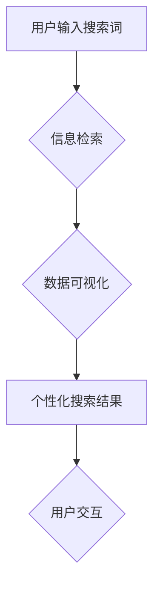

                 

## 搜索结果可视化：AI的数据呈现

> 关键词：搜索结果可视化、数据呈现、人工智能、信息检索、可视化技术、用户体验、交互设计

### 1. 背景介绍

在信息爆炸的时代，海量数据无处不在，搜索引擎作为信息获取的主要入口，面临着如何有效地呈现海量搜索结果的挑战。传统的文本列表形式难以满足用户对信息快速理解和获取的需求。搜索结果可视化应运而生，它利用图形、图表等多种视觉元素，将搜索结果以更直观、易懂的方式呈现给用户，提升用户体验，帮助用户更快速地找到所需信息。

随着人工智能技术的快速发展，搜索结果可视化迎来了新的机遇。AI算法可以对用户搜索意图进行更精准的理解，并根据用户偏好和上下文信息，生成个性化的可视化结果。例如，AI可以根据用户的地理位置、搜索历史、阅读习惯等信息，推荐更相关的搜索结果，并以地图、图表、时间线等形式呈现，帮助用户更直观地了解信息。

### 2. 核心概念与联系

搜索结果可视化是一个跨学科的领域，涉及信息检索、数据可视化、人工智能、交互设计等多个领域。

**2.1 信息检索**

信息检索是搜索引擎的核心技术，它负责根据用户的搜索词，从海量数据中找到相关信息。信息检索算法通常包括关键词匹配、文本相似度计算、语义理解等环节。

**2.2 数据可视化**

数据可视化是指将数据以图形、图表等形式呈现，以帮助用户理解和分析数据。常用的数据可视化类型包括柱状图、折线图、饼图、散点图等。

**2.3 人工智能**

人工智能可以帮助搜索引擎更智能地理解用户的搜索意图，并生成更个性化的搜索结果。常见的AI技术包括自然语言处理、机器学习、深度学习等。

**2.4 交互设计**

交互设计是指如何设计用户与搜索引擎的交互方式，以确保用户能够轻松地使用搜索引擎，并获得满意的搜索结果。

**2.5 Mermaid 流程图**



### 3. 核心算法原理 & 具体操作步骤

**3.1 算法原理概述**

搜索结果可视化的核心算法原理是将搜索结果映射到不同的视觉元素，并根据用户需求进行个性化定制。常见的算法包括：

* **聚类算法:** 将搜索结果根据相似度进行分组，并以不同的颜色、形状等视觉元素表示不同的类别。
* **树状图算法:** 将搜索结果以树状结构呈现，展示不同主题之间的关系。
* **网络图算法:** 将搜索结果以网络图的形式呈现，展示不同实体之间的连接关系。
* **时间线算法:** 将搜索结果按照时间顺序排列，以时间线的形式呈现。

**3.2 算法步骤详解**

1. **数据预处理:** 对搜索结果进行清洗、格式化、提取关键词等操作，以便于后续的算法处理。
2. **特征提取:** 从搜索结果中提取特征信息，例如关键词、文本内容、链接地址、发布日期等。
3. **算法选择:** 根据用户的搜索意图和数据特点，选择合适的算法进行处理。
4. **可视化呈现:** 将处理后的数据映射到不同的视觉元素，并以交互的方式呈现给用户。

**3.3 算法优缺点**

不同的算法具有不同的优缺点，需要根据实际情况进行选择。例如，聚类算法可以有效地将搜索结果进行分类，但对于复杂的数据集可能难以找到最佳的聚类结果。树状图算法可以清晰地展示不同主题之间的关系，但对于大量数据可能难以呈现完整的信息。

**3.4 算法应用领域**

搜索结果可视化技术在各个领域都有广泛的应用，例如：

* **新闻搜索:** 将新闻文章以时间线、地图等形式呈现，帮助用户快速了解事件的发展过程和地域分布。
* **学术搜索:** 将学术论文以网络图的形式呈现，展示不同研究方向之间的联系。
* **电商搜索:** 将商品信息以图表、产品展示等形式呈现，帮助用户快速了解商品特点和价格。

### 4. 数学模型和公式 & 详细讲解 & 举例说明

**4.1 数学模型构建**

搜索结果可视化通常需要构建数学模型来描述数据之间的关系，并指导算法的处理过程。例如，可以使用距离度量来计算搜索结果之间的相似度，可以使用聚类算法来将搜索结果进行分组。

**4.2 公式推导过程**

距离度量公式：

$$
d(x, y) = \sqrt{\sum_{i=1}^{n}(x_i - y_i)^2}
$$

其中，$x$ 和 $y$ 是两个数据点，$x_i$ 和 $y_i$ 是两个数据点在第 $i$ 维上的坐标，$n$ 是数据点的维度。

**4.3 案例分析与讲解**

假设我们想要将搜索结果以聚类的方式进行可视化，可以使用k-means算法进行聚类。k-means算法的目标是将数据点划分为k个簇，使得每个簇内的点彼此相似，而不同簇之间的点彼此不相似。

k-means算法的步骤如下：

1. 随机选择k个数据点作为初始的聚类中心。
2. 将每个数据点分配到距离其最近的聚类中心所在的簇。
3. 计算每个簇的中心点。
4. 将每个数据点重新分配到距离其最近的聚类中心所在的簇。
5. 重复步骤2-4，直到聚类结果不再变化。

### 5. 项目实践：代码实例和详细解释说明

**5.1 开发环境搭建**

* Python 3.x
* Jupyter Notebook
* Matplotlib
* Seaborn
* Scikit-learn

**5.2 源代码详细实现**

```python
import matplotlib.pyplot as plt
from sklearn.cluster import KMeans

# 数据集
data = [[1, 2], [1.5, 1.8], [5, 8], [8, 8], [1, 0.6], [9, 11]]

# 训练KMeans模型
kmeans = KMeans(n_clusters=2)
kmeans.fit(data)

# 获取聚类标签
labels = kmeans.labels_

# 可视化结果
plt.scatter(data[:, 0], data[:, 1], c=labels)
plt.title('KMeans聚类结果')
plt.show()
```

**5.3 代码解读与分析**

* 首先，我们导入必要的库，包括matplotlib用于可视化，scikit-learn用于聚类算法。
* 然后，我们定义一个数据集，包含多个数据点。
* 接下来，我们使用KMeans算法训练模型，并指定聚类数量为2。
* 训练完成后，我们可以获取每个数据点的聚类标签。
* 最后，我们使用matplotlib绘制散点图，将不同聚类的点用不同的颜色表示。

**5.4 运行结果展示**

运行代码后，会生成一个散点图，将数据点根据聚类结果进行分组，不同颜色表示不同的簇。

### 6. 实际应用场景

**6.1 新闻搜索**

搜索引擎可以将新闻文章以时间线、地图等形式呈现，帮助用户快速了解事件的发展过程和地域分布。例如，用户搜索“新冠疫情”，搜索引擎可以将相关新闻以时间线的形式呈现，展示疫情的爆发时间、传播路径、防控措施等信息。

**6.2 学术搜索**

搜索引擎可以将学术论文以网络图的形式呈现，展示不同研究方向之间的联系。例如，用户搜索“人工智能”，搜索引擎可以将相关论文以网络图的形式呈现，展示不同人工智能领域的论文之间的引用关系，帮助用户了解人工智能研究的最新进展和热点方向。

**6.3 电商搜索**

搜索引擎可以将商品信息以图表、产品展示等形式呈现，帮助用户快速了解商品特点和价格。例如，用户搜索“手机”，搜索引擎可以将相关商品以图表的形式呈现，展示不同品牌的手机参数、价格、评价等信息，帮助用户快速找到心仪的商品。

**6.4 未来应用展望**

随着人工智能技术的不断发展，搜索结果可视化将更加智能化、个性化。未来，搜索引擎将能够根据用户的搜索意图、上下文信息、偏好等因素，生成更加精准、个性化的可视化结果，帮助用户更快速、更有效地获取信息。

### 7. 工具和资源推荐

**7.1 学习资源推荐**

* **书籍:**

    * 《数据可视化：探索数据背后的故事》
    * 《交互式数据可视化》

* **在线课程:**

    * Coursera: Data Visualization Specialization
    * edX: Data Visualization with Tableau

**7.2 开发工具推荐**

* **Python库:**

    * Matplotlib
    * Seaborn
    * Plotly
    * Bokeh

* **可视化工具:**

    * Tableau
    * Power BI
    * D3.js

**7.3 相关论文推荐**

* **Information Visualization: Perception for Design**
* **Interactive Data Visualization: Foundations, Techniques, and Applications**

### 8. 总结：未来发展趋势与挑战

**8.1 研究成果总结**

搜索结果可视化技术已经取得了显著的进展，能够有效地提升用户体验，帮助用户更快速、更有效地获取信息。

**8.2 未来发展趋势**

* **更智能的算法:** 利用人工智能技术，开发更智能的算法，能够更精准地理解用户的搜索意图，并生成更个性化的可视化结果。
* **更丰富的交互方式:** 开发更丰富的交互方式，例如语音交互、手势交互、虚拟现实交互等，提升用户体验。
* **跨平台融合:** 将搜索结果可视化技术融合到不同的平台，例如移动设备、智能家居等，提供更加便捷的搜索体验。

**8.3 面临的挑战**

* **数据质量:** 搜索结果可视化依赖于高质量的数据，如何保证数据准确、完整、及时是重要的挑战。
* **算法复杂度:** 一些复杂的搜索结果可视化算法计算量较大，需要进一步优化算法效率。
* **用户体验:** 如何设计更加直观、易懂、用户友好的可视化界面是重要的挑战。

**8.4 研究展望**

未来，搜索结果可视化技术将继续朝着更智能、更个性化、更交互化的方向发展，为用户提供更加便捷、高效的信息获取体验。


### 9. 附录：常见问题与解答

**9.1 如何选择合适的搜索结果可视化算法？**

选择合适的算法需要根据实际情况进行判断，例如数据类型、数据规模、用户需求等。

**9.2 如何保证搜索结果可视化的准确性？**

保证数据准确、完整、及时是关键，同时还需要选择合适的算法和参数，并进行充分的测试和验证。

**9.3 如何设计更加用户友好的搜索结果可视化界面？**

需要考虑用户认知习惯、交互方式、视觉体验等因素，设计直观、易懂、美观的界面。


作者：禅与计算机程序设计艺术 / Zen and the Art of Computer Programming 
<end_of_turn>

