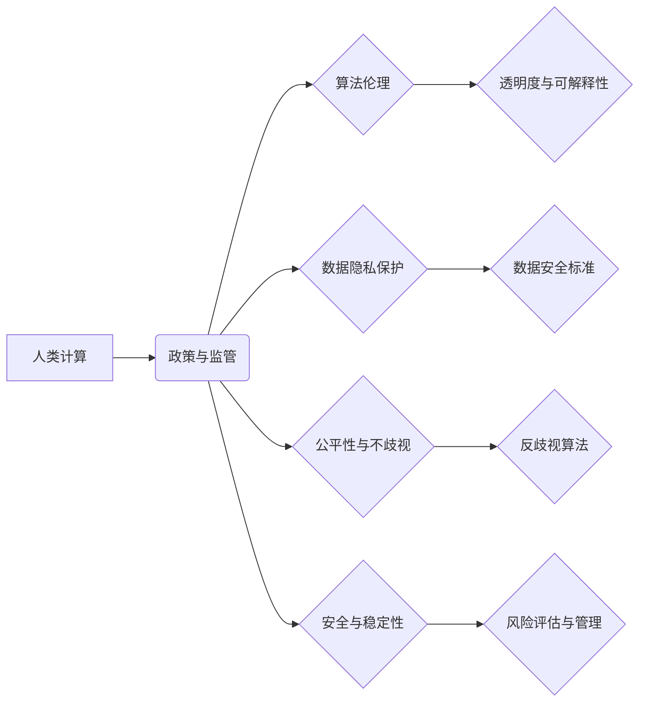

                 

## 政策与监管：引导人类计算的健康发展方向

> 关键词：人工智能、监管、伦理、可持续发展、数据隐私、算法透明度、公平性、法律框架、技术标准

### 1. 背景介绍

人类计算正处于一个前所未有的发展阶段。从深度学习的突破到量子计算的兴起，人工智能（AI）正在深刻地改变着我们的生活、工作和社会结构。然而，这种飞速发展也带来了新的挑战和风险，例如算法偏见、数据隐私泄露、工作岗位替代等。因此，制定有效的政策和监管框架，引导人类计算健康发展，至关重要。

### 2. 核心概念与联系

**2.1  人类计算的定义**

人类计算是指人类与计算机协同工作，利用计算机的计算能力和人类的创造力和判断力，共同解决复杂问题。它涵盖了人工智能、大数据、云计算等多个领域，并不断融合新的技术和应用场景。

**2.2  政策与监管的作用**

政策和监管旨在通过制定规则、标准和规范，引导人类计算的发展方向，确保其安全、可持续和对社会有益。

**2.3  核心概念关系图**



### 3. 核心算法原理 & 具体操作步骤

**3.1  算法原理概述**

人类计算的核心算法包括机器学习、深度学习、自然语言处理、计算机视觉等。这些算法通过训练数据，学习模式和规律，从而实现对复杂问题的解决。

**3.2  算法步骤详解**

1. **数据收集和预处理:** 收集相关数据，并进行清洗、转换和格式化等预处理工作。
2. **特征提取:** 从原始数据中提取有用的特征，用于算法训练。
3. **模型选择:** 根据具体任务选择合适的算法模型，例如线性回归、决策树、支持向量机等。
4. **模型训练:** 使用训练数据训练模型，调整模型参数，使其能够准确地预测或分类。
5. **模型评估:** 使用测试数据评估模型的性能，例如准确率、召回率、F1-score等。
6. **模型部署:** 将训练好的模型部署到实际应用场景中，用于预测或分类新的数据。

**3.3  算法优缺点**

**优点:**

* 能够处理海量数据，发现隐藏的模式和规律。
* 能够不断学习和改进，提高预测和分类的准确性。
* 能够自动化完成许多重复性任务，提高效率。

**缺点:**

* 需要大量的训练数据，数据质量直接影响算法性能。
* 算法模型的解释性较差，难以理解其决策过程。
* 存在算法偏见和歧视的风险，需要进行伦理审查。

**3.4  算法应用领域**

* **医疗保健:** 疾病诊断、药物研发、个性化医疗。
* **金融服务:** 欺诈检测、风险评估、投资决策。
* **交通运输:** 自动驾驶、交通流量预测、物流优化。
* **教育:** 个性化学习、智能辅导、自动批改。

### 4. 数学模型和公式 & 详细讲解 & 举例说明

**4.1  数学模型构建**

机器学习算法通常基于数学模型，例如线性回归模型、逻辑回归模型、支持向量机模型等。这些模型通过数学公式来描述数据之间的关系，并利用训练数据来估计模型参数。

**4.2  公式推导过程**

例如，线性回归模型的目标是找到一条直线，能够最佳地拟合数据点。模型的数学公式如下：

$$y = w_0 + w_1x$$

其中，$y$ 是预测值，$x$ 是输入特征，$w_0$ 和 $w_1$ 是模型参数。

通过最小化模型预测值与实际值之间的误差，可以求解出最佳的模型参数。

**4.3  案例分析与讲解**

假设我们想要预测房价，输入特征包括房屋面积、房间数量、地理位置等。我们可以使用线性回归模型来建立房价预测模型。通过训练数据，我们可以估计出模型参数 $w_0$ 和 $w_1$，从而预测新的房屋价格。

### 5. 项目实践：代码实例和详细解释说明

**5.1  开发环境搭建**

可以使用 Python 语言和相关的机器学习库，例如 scikit-learn、TensorFlow、PyTorch 等，来开发人类计算项目。

**5.2  源代码详细实现**

```python
from sklearn.linear_model import LinearRegression

# 准备数据
X = [[100, 2], [150, 3], [200, 4]]  # 房屋面积和房间数量
y = [200000, 300000, 400000]  # 房价

# 创建线性回归模型
model = LinearRegression()

# 训练模型
model.fit(X, y)

# 预测新房价
new_house = [[250, 3]]
predicted_price = model.predict(new_house)

print(f"预测新房价: {predicted_price[0]}")
```

**5.3  代码解读与分析**

这段代码演示了如何使用 scikit-learn 库中的 LinearRegression 模型来预测房价。

首先，我们准备了房屋面积和房间数量作为输入特征，以及对应的房价作为目标变量。

然后，我们创建了一个 LinearRegression 模型对象，并使用 fit() 方法训练模型。

最后，我们使用 predict() 方法预测新房子的价格。

**5.4  运行结果展示**

运行代码后，会输出预测的新房价。

### 6. 实际应用场景

**6.1  医疗诊断辅助系统**

利用机器学习算法分析患者的病历、影像数据等信息，辅助医生进行疾病诊断。

**6.2  个性化教育平台**

根据学生的学习进度和能力，提供个性化的学习内容和辅导。

**6.3  智能客服系统**

利用自然语言处理技术，实现与用户的自然对话，提供快速、高效的客户服务。

**6.4  未来应用展望**

人类计算将在未来各个领域发挥越来越重要的作用，例如：

* **科学研究:** 加速科学发现，解决复杂科学问题。
* **社会治理:** 提高政府服务效率，促进社会公平正义。
* **经济发展:** 推动产业升级，创造新的经济增长点。

### 7. 工具和资源推荐

**7.1  学习资源推荐**

* **在线课程:** Coursera、edX、Udacity 等平台提供丰富的 AI 和机器学习课程。
* **书籍:** 《深度学习》、《机器学习实战》等经典书籍。
* **开源项目:** TensorFlow、PyTorch 等开源机器学习框架。

**7.2  开发工具推荐**

* **Python:** 广泛应用于 AI 开发，拥有丰富的机器学习库。
* **Jupyter Notebook:** 用于编写和运行 Python 代码，方便进行数据分析和模型实验。
* **云计算平台:** AWS、Azure、GCP 等云平台提供强大的计算资源和 AI 服务。

**7.3  相关论文推荐**

* **AlphaGo论文:** 《Mastering the game of Go with deep neural networks and tree search》
* **BERT论文:** 《BERT: Pre-training of Deep Bidirectional Transformers for Language Understanding》
* **GPT-3论文:** 《Language Models are Few-Shot Learners》

### 8. 总结：未来发展趋势与挑战

**8.1  研究成果总结**

近年来，人类计算领域取得了显著进展，例如深度学习的突破、自然语言处理的飞速发展、计算机视觉的快速进步等。这些成果为解决人类面临的各种挑战提供了新的思路和方法。

**8.2  未来发展趋势**

* **更强大的计算能力:** 量子计算、神经形态计算等新兴计算技术将推动人类计算的进一步发展。
* **更智能的算法:** 算法将更加智能化、自动化，能够更好地理解和处理复杂数据。
* **更广泛的应用场景:** 人类计算将应用于更多领域，例如医疗保健、教育、金融、交通等。

**8.3  面临的挑战**

* **算法伦理:** 算法偏见、数据隐私泄露等伦理问题需要得到有效解决。
* **可解释性:** 许多机器学习算法的决策过程难以解释，需要提高算法的可解释性。
* **公平性:** 确保算法公平公正，避免歧视和偏见。

**8.4  研究展望**

未来，人类计算研究需要更加注重伦理、公平性和可解释性，并与社会发展相协调，共同构建一个更加美好的未来。

### 9. 附录：常见问题与解答

**9.1  什么是算法偏见？**

算法偏见是指算法在训练数据中学习到的偏差，导致算法在预测或分类时对某些群体产生歧视。

**9.2  如何解决算法偏见？**

* 使用更加多样化的训练数据。
* 采用公平性算法设计和评估方法。
* 对算法进行定期审查和调整。

**9.3  如何保护数据隐私？**

* 使用加密技术保护数据安全。
* 遵循数据隐私法规和标准。
* 采取匿名化和去标识化技术处理敏感数据。


作者：禅与计算机程序设计艺术 / Zen and the Art of Computer Programming 
<end_of_turn>

