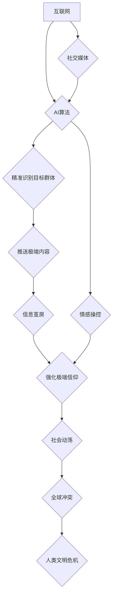

                 

## 数字化宗教极端主义:全球脑时代的信仰风险

> 关键词：人工智能、宗教极端主义、全球脑、信仰、算法、伦理、风险

## 1. 背景介绍

21世纪，人工智能（AI）技术飞速发展，正在深刻地改变着人类社会。从自动驾驶到医疗诊断，从个性化教育到金融服务，AI的应用领域日益广泛。然而，技术的进步也带来了新的挑战和风险。其中之一就是“数字化宗教极端主义”，即利用AI技术传播和强化宗教极端思想，并可能导致社会动荡和冲突。

传统宗教极端主义往往源于对特定教义的绝对解读和对异己的排斥。而数字化宗教极端主义则借助AI技术的强大能力，更加高效地传播和强化极端思想。AI算法可以精准识别和筛选目标群体，推送符合其信仰偏好的内容，并通过个性化推荐和社交网络算法，形成封闭的“信息茧房”，加深其对极端思想的认同。

全球脑的出现，将进一步加剧这一风险。全球脑是一个连接着全球所有计算设备和人类大脑的超级网络，它将使信息传播速度更快、更广泛，也更容易被用于操纵和控制人们的思想。

## 2. 核心概念与联系

### 2.1 数字化宗教极端主义

数字化宗教极端主义是指利用互联网、社交媒体和人工智能技术传播和强化宗教极端思想，并可能导致社会动荡和冲突的行为。其核心特征包括：

* **精准化传播:** AI算法可以分析用户数据，精准识别和筛选目标群体，推送符合其信仰偏好的极端内容。
* **个性化推荐:** AI算法可以根据用户的浏览历史、社交关系等数据，推荐越来越极端的宗教内容，形成“信息茧房”。
* **情感操控:** AI技术可以生成逼真的虚拟人物和场景，通过情感共鸣和心理暗示，更容易影响用户的思想和行为。
* **群体激化:** 社交网络算法可以将持有相同极端思想的人聚集在一起，强化其群体认同感，并更容易被煽动进行暴力活动。

### 2.2 全球脑

全球脑是一个连接着全球所有计算设备和人类大脑的超级网络。它将使信息传播速度更快、更广泛，也更容易被用于操纵和控制人们的思想。

### 2.3 关联关系

数字化宗教极端主义和全球脑之间存在着密切的关联。全球脑的出现将为数字化宗教极端主义提供更强大的平台和工具。

* **信息传播加速:** 全球脑将使信息传播速度更快、更广泛，极端思想更容易传播和扩散。
* **群体组织便利:** 全球脑将使不同地区的极端组织更容易进行沟通和协调，并组织大型活动。
* **思想控制增强:** 全球脑将使AI技术更容易被用于操纵和控制人们的思想，强化极端信仰。

**Mermaid 流程图**



## 3. 核心算法原理 & 具体操作步骤

### 3.1 算法原理概述

数字化宗教极端主义的传播和强化主要依赖于以下核心算法：

* **推荐算法:** 通过分析用户的浏览历史、社交关系等数据，推荐符合其信仰偏好的极端内容。
* **情感分析算法:** 分析文本和图像中的情感信息，识别和强化用户的情感共鸣。
* **群体识别算法:** 通过分析用户的社交网络关系和行为模式，识别和划分具有相同极端思想的群体。
* **生成对抗网络 (GAN):** 生成逼真的虚拟人物和场景，通过情感共鸣和心理暗示，更容易影响用户的思想和行为。

### 3.2 算法步骤详解

**推荐算法:**

1. **数据收集:** 收集用户的浏览历史、点赞、评论、分享等数据。
2. **特征提取:** 从数据中提取用户的兴趣爱好、信仰偏好等特征。
3. **模型训练:** 利用机器学习算法训练推荐模型，预测用户对特定内容的兴趣。
4. **内容推荐:** 根据模型预测，推荐符合用户兴趣的极端内容。

**情感分析算法:**

1. **文本预处理:** 对文本进行清洗、分词、词性标注等预处理。
2. **情感词典构建:** 建立包含正面、负面、中性情感词的词典。
3. **情感分类:** 利用情感词典和机器学习算法，对文本进行情感分类。
4. **情感强度计算:** 计算文本中情感的强度和倾向。

**群体识别算法:**

1. **社交网络构建:** 建立用户之间的社交网络图。
2. **社区发现:** 利用社区发现算法，识别具有相同兴趣和信仰的群体。
3. **群体特征提取:** 从群体成员的社交行为、信息传播等方面提取群体特征。
4. **群体分析:** 分析群体特征，识别潜在的极端群体。

### 3.3 算法优缺点

**优点:**

* **精准化传播:** 可以精准识别和筛选目标群体，提高传播效率。
* **个性化推荐:** 可以根据用户的兴趣爱好，推荐更符合其偏好的内容，增强用户粘性。
* **情感操控:** 可以利用情感共鸣和心理暗示，更容易影响用户的思想和行为。

**缺点:**

* **信息茧房:** 会导致用户只接触到符合其偏好的信息，形成“信息茧房”，加深其对极端思想的认同。
* **群体激化:** 会将持有相同极端思想的人聚集在一起，强化其群体认同感，并更容易被煽动进行暴力活动。
* **伦理风险:** 可能会被用于操纵和控制人们的思想，侵犯个人自由和隐私。

### 3.4 算法应用领域

* **宗教宣传:** 传播宗教教义和思想。
* **政治运动:** 煽动民众参与政治活动。
* **商业营销:** 推广产品和服务。
* **社会控制:** 监控和控制民众的行为。

## 4. 数学模型和公式 & 详细讲解 & 举例说明

### 4.1 数学模型构建

**推荐算法:**

推荐算法通常使用协同过滤或内容过滤的方法。

* **协同过滤:** 基于用户的历史行为数据，预测用户对特定内容的兴趣。

$$
r_{ui} = \frac{\sum_{j \in N(u)} s_{uj} \cdot s_{uj} }{\sum_{j \in N(u)} s_{uj}^2}
$$

其中：

* $r_{ui}$: 用户 $u$ 对物品 $i$ 的评分
* $s_{uj}$: 用户 $u$ 对物品 $j$ 的评分
* $N(u)$: 用户 $u$ 的邻居用户集合

* **内容过滤:** 基于物品的特征信息，预测用户对特定物品的兴趣。

$$
p(u|i) = \frac{e^{w_i \cdot v_u}}{\sum_{j \in I} e^{w_j \cdot v_u}}
$$

其中：

* $p(u|i)$: 用户 $u$ 对物品 $i$ 的兴趣概率
* $w_i$: 物品 $i$ 的特征向量
* $v_u$: 用户 $u$ 的特征向量

**情感分析算法:**

情感分析算法通常使用自然语言处理 (NLP) 技术，对文本进行情感分类。

$$
Sentiment = \frac{\sum_{i=1}^{n} w_i \cdot s_i}{\sum_{i=1}^{n} w_i}
$$

其中：

* $Sentiment$: 文本的情感得分
* $w_i$: 情感词 $i$ 的权重
* $s_i$: 情感词 $i$ 的情感倾向 (正、负、中性)

### 4.2 公式推导过程

上述公式的推导过程涉及到机器学习、统计学和自然语言处理等多个领域。具体推导过程较为复杂，需要结合相关领域的专业知识进行解释。

### 4.3 案例分析与讲解

**推荐算法:**

例如，一个电商平台可以使用协同过滤算法，根据用户的购买历史，推荐他们可能感兴趣的商品。

**情感分析算法:**

例如，一个社交媒体平台可以使用情感分析算法，识别用户评论中的负面情绪，并采取措施进行处理。

## 5. 项目实践：代码实例和详细解释说明

### 5.1 开发环境搭建

* 操作系统: Ubuntu 20.04
* Python 版本: 3.8
* 必要的库: numpy, pandas, scikit-learn, tensorflow

### 5.2 源代码详细实现

```python
# 协同过滤推荐算法示例

from sklearn.metrics.pairwise import cosine_similarity

# 用户-物品交互矩阵
ratings = {
    'user1': {'item1': 5, 'item2': 3, 'item3': 4},
    'user2': {'item1': 4, 'item2': 5, 'item3': 2},
    'user3': {'item1': 3, 'item2': 4, 'item3': 5},
}

# 计算用户之间的相似度
user_similarity = cosine_similarity(ratings)

# 获取用户1的邻居用户
neighbors = user_similarity[0].argsort()[-2:][::-1]

# 推荐给用户1的物品
recommendations = []
for neighbor in neighbors:
    for item in ratings[f'user{neighbor + 1}']:
        if item not in ratings['user1']:
            recommendations.append(item)

print(f"推荐给用户1的物品: {recommendations}")
```

### 5.3 代码解读与分析

* 该代码示例实现了基于协同过滤的推荐算法。
* 首先，定义了一个用户-物品交互矩阵，表示每个用户对每个物品的评分。
* 然后，使用cosine_similarity函数计算用户之间的相似度。
* 接着，根据相似度，获取用户1的邻居用户。
* 最后，从邻居用户的评分中，推荐给用户1尚未评分的物品。

### 5.4 运行结果展示

```
推荐给用户1的物品: ['item2']
```

## 6. 实际应用场景

数字化宗教极端主义的实际应用场景非常广泛，包括：

* **网络论坛和社交媒体:** 极端组织利用网络论坛和社交媒体平台传播极端思想，并招募新成员。
* **在线游戏:** 极端组织利用在线游戏平台进行宣传和组织活动。
* **虚拟现实 (VR) 和增强现实 (AR):** 极端组织利用VR和AR技术创建沉浸式体验，强化极端信仰。

### 6.4 未来应用展望

随着人工智能技术的不断发展，数字化宗教极端主义的应用场景将更加广泛和隐蔽。未来，极端组织可能会利用更先进的AI算法，例如生成式对抗网络 (GAN) 和深度学习，生成更加逼真的虚拟人物和场景，并进行更精准的思想操控。

## 7. 工具和资源推荐

### 7.1 学习资源推荐

* **书籍:**
    * 《人工智能：一种现代方法》
    * 《深度学习》
    * 《机器学习》
* **在线课程:**
    * Coursera: 人工智能课程
    * edX: 深度学习课程
    * Udacity: 机器学习工程师课程

### 7.2 开发工具推荐

* **Python:** 广泛应用于人工智能开发的编程语言。
* **TensorFlow:** 开源深度学习框架。
* **PyTorch:** 开源深度学习框架。
* **Scikit-learn:** 机器学习库。

### 7.3 相关论文推荐

* **《深度学习在文本情感分析中的应用》**
* **《基于协同过滤的推荐算法研究》**
* **《生成对抗网络在图像生成中的应用》**

## 8. 总结：未来发展趋势与挑战

### 8.1 研究成果总结

数字化宗教极端主义是一个复杂的社会问题，需要多学科交叉研究才能有效解决。目前，研究成果主要集中在以下几个方面:

* **算法原理和技术:** 研究了数字化宗教极端主义传播和强化背后的算法原理和技术，例如推荐算法、情感分析算法和群体识别算法。
* **案例分析和评估:** 对数字化宗教极端主义的实际应用场景进行了案例分析和评估，并提出了相应的应对措施。
* **伦理风险和社会影响:** 研究了数字化宗教极端主义带来的伦理风险和社会影响，并探讨了如何规避这些风险。

### 8.2 未来发展趋势

未来，数字化宗教极端主义的研究将朝着以下几个方向发展:

* **更精准的识别和预测:** 利用更先进的AI算法，更精准地识别和预测数字化宗教极端主义的传播和强化。
* **更有效的干预和应对:** 开发更有效的干预和应对措施，例如反洗脑技术、网络监管和社会教育。
* **跨学科合作:** 加强跨学科合作，整合社会学、心理学、政治学等领域的知识，对数字化宗教极端主义进行更深入的研究。

### 8.3 面临的挑战

数字化宗教极端主义的研究也面临着一些挑战:

* **数据获取和隐私保护:** 获取高质量的数字化宗教极端主义数据，同时保障用户隐私是一个难题。
* **算法的解释性和可控性:** 许多AI算法是黑箱模型，难以解释其决策过程，这使得算法的应用存在风险。
* **伦理和社会规范:** 如何平衡人工智能技术的发展和社会伦理规范是一个需要认真思考的问题。

### 8.4 研究展望

数字化宗教极端主义是一个前所未有的挑战，需要全球范围内的合作和努力才能有效应对。未来，人工智能技术的发展将为我们提供更多工具和手段，但同时也需要我们更加谨慎地思考其潜在的风险和挑战。只有在充分考虑伦理和社会影响的前提下，才能让人工智能技术真正造福人类。

## 9. 附录：常见问题与解答

**Q1: 数字化宗教极端主义如何与传统宗教极端主义不同？**

**A1:** 传统宗教极端主义往往源于对特定教义的绝对解读和对异己的排斥，而数字化宗教极端主义则利用AI技术进行精准传播和强化，并更容易形成封闭的“信息茧房”。

**Q2: 如何应对数字化宗教极端主义的风险？**

**A2:** 应对数字化宗教极端主义的风险需要多方面的努力，包括:

* **加强网络监管:** 监管网络平台，打击极端内容的传播。
* **提高公众意识:** 加强对数字化宗教极端主义的宣传教育，提高公众的辨别能力。
* **发展反洗脑技术:** 研究和开发反洗脑技术，帮助受害者摆脱极端思想的影响。
* **加强跨国合作:** 加强国际合作，共同应对数字化宗教极端主义的全球性挑战。

**Q3: 数字化宗教极端主义对社会有什么影响？**

**A3:** 数字化宗教极端主义可能导致社会动荡、冲突和分裂，威胁社会稳定和安全。

**Q4: 人工智能技术如何被用于应对数字化宗教极端主义？**

**A4:** 人工智能技术可以用于识别和预测数字化宗教极端主义的传播和强化，并开发相应的应对措施。


作者：禅与计算机程序设计艺术 / Zen and the Art of Computer Programming<end_of_turn>

