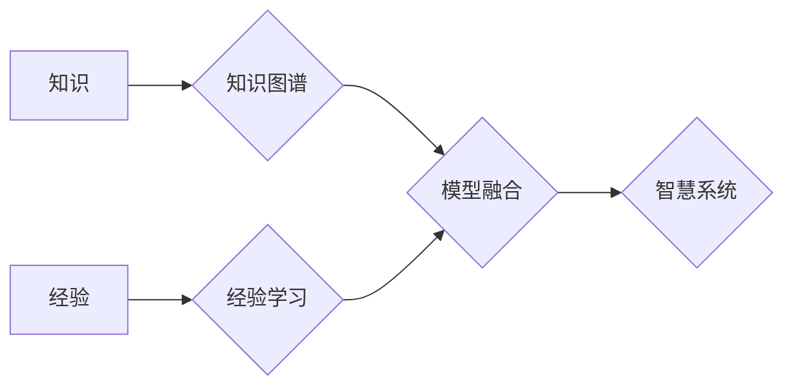

                 

## 智慧的源泉：知识与经验的完美融合

> 关键词：人工智能、知识图谱、经验学习、深度学习、迁移学习、模型融合、智慧系统

### 1. 背景介绍

在当今数据爆炸的时代，人工智能（AI）正以惊人的速度发展，并深刻地改变着我们的生活。从自动驾驶到医疗诊断，从个性化推荐到智能客服，AI技术正在各个领域展现出强大的应用潜力。然而，现有的AI模型大多依赖于海量数据进行训练，而现实世界中，许多领域的数据获取成本高昂，且数据分布不均匀，这限制了AI模型的泛化能力和实际应用场景。

知识和经验是人类智慧的基石，它们赋予我们对世界的理解和解决问题的能力。如何将知识和经验融入到AI模型中，使其能够更智能、更灵活、更具普适性，是人工智能领域面临的重大挑战。

### 2. 核心概念与联系

**2.1 知识与经验**

* **知识**是指对客观世界事物的认知和理解，它可以是事实、概念、规则、原理等。知识通常是结构化的，可以通过符号表示和逻辑推理。
* **经验**是指通过感官感知和实践活动积累的，对事物运行规律和解决问题的认知。经验往往是非结构化的，难以用符号表示，但它蕴含着丰富的洞察力和判断力。

**2.2 知识图谱与经验学习**

* **知识图谱**是一种结构化的知识表示形式，它以实体和关系为节点，构建了一个知识网络。知识图谱可以存储和组织大量知识，并支持知识推理和查询。
* **经验学习**是指从经验数据中学习知识和技能，并将其应用于新的场景。经验学习方法通常包括强化学习、迁移学习和案例库学习等。

**2.3 模型融合**

模型融合是指将多个不同类型的AI模型组合在一起，以提高模型的性能和鲁棒性。模型融合可以利用不同模型的优势，弥补各自的不足，从而获得更好的整体效果。

**2.4 智慧系统**

智慧系统是指能够利用知识和经验，进行智能决策、自动执行任务、持续学习和进化的系统。智慧系统是将人工智能技术与知识和经验相结合的最终目标。

**Mermaid 流程图**



### 3. 核心算法原理 & 具体操作步骤

**3.1 算法原理概述**

本文将介绍一种基于知识图谱和经验学习的智慧系统构建方法。该方法将知识图谱作为知识表示基础，利用经验学习算法从经验数据中提取知识和技能，并通过模型融合技术将知识和经验融入到AI模型中，从而构建出更智能、更灵活、更具普适性的智慧系统。

**3.2 算法步骤详解**

1. **知识图谱构建:** 收集和整理相关领域的知识，构建知识图谱。知识图谱可以采用RDF、OWL等标准格式进行表示。
2. **经验数据采集:** 收集和整理相关领域的经验数据，例如案例、日志、专家意见等。
3. **经验学习:** 利用强化学习、迁移学习或案例库学习等算法，从经验数据中提取知识和技能。
4. **知识和经验融合:** 将知识图谱中的知识和经验学习得到的技能融合到AI模型中。
5. **模型训练和评估:** 利用融合后的模型进行训练和评估，并不断优化模型参数和结构。
6. **智慧系统部署:** 将训练好的模型部署到实际应用场景中，构建智慧系统。

**3.3 算法优缺点**

* **优点:**
    * 能够利用知识和经验，提高模型的泛化能力和鲁棒性。
    * 能够处理非结构化数据，扩展AI模型的应用场景。
    * 能够支持知识推理和决策，增强模型的智能性。
* **缺点:**
    * 知识图谱构建和经验数据采集需要大量的人工投入。
    * 知识和经验融合算法的复杂度较高，需要不断进行研究和优化。

**3.4 算法应用领域**

* **医疗诊断:** 利用知识图谱和经验学习，构建能够辅助医生诊断疾病的AI系统。
* **金融风险管理:** 利用知识图谱和经验学习，构建能够识别和预测金融风险的AI系统。
* **智能制造:** 利用知识图谱和经验学习，构建能够优化生产流程和提高生产效率的AI系统。
* **个性化教育:** 利用知识图谱和经验学习，构建能够提供个性化学习方案的AI系统。

### 4. 数学模型和公式 & 详细讲解 & 举例说明

**4.1 数学模型构建**

知识图谱可以表示为一个三元组的集合： (h, r, t)，其中 h 代表主语，r 代表关系，t 代表宾语。例如， ( "张三", "工作", "百度" ) 表示张三在百度工作。

经验学习可以采用强化学习框架进行建模。强化学习算法的目标是通过与环境交互，学习一个策略，使得在特定时间段内获得最大的奖励。

**4.2 公式推导过程**

强化学习中的Bellman方程可以用来更新策略值函数：

$$
V(s) = \max_{\alpha} \sum_{s'} P(s' | s, \alpha) [r(s, \alpha, s') + \gamma V(s')]
$$

其中：

* $V(s)$ 是状态 $s$ 的价值函数。
* $\alpha$ 是策略。
* $P(s' | s, \alpha)$ 是从状态 $s$ 执行策略 $\alpha$ 到状态 $s'$ 的转移概率。
* $r(s, \alpha, s')$ 是从状态 $s$ 执行策略 $\alpha$ 到状态 $s'$ 的奖励。
* $\gamma$ 是折扣因子。

**4.3 案例分析与讲解**

假设我们构建一个智能客服系统，利用知识图谱存储客户常见问题和解决方案，利用经验学习算法从历史对话数据中学习客户的意图和需求。

* **知识图谱:** 可以存储客户常见问题、解决方案、产品信息、服务流程等知识。
* **经验学习:** 可以利用强化学习算法训练一个模型，识别客户的意图和需求，并根据知识图谱提供相应的解决方案。

### 5. 项目实践：代码实例和详细解释说明

**5.1 开发环境搭建**

* Python 3.x
* TensorFlow 或 PyTorch
* Neo4j 或其他知识图谱数据库

**5.2 源代码详细实现**

```python
# 知识图谱加载
from neo4j import GraphDatabase

driver = GraphDatabase.driver("bolt://localhost:7687", auth=("neo4j", "password"))
session = driver.session()

# 查询知识图谱
result = session.run("MATCH (n:Product) RETURN n.name")
for record in result:
    print(record["n.name"])

# 经验学习模型训练
from tensorflow.keras.models import Sequential
from tensorflow.keras.layers import Embedding, LSTM, Dense

# ... 模型训练代码 ...

# 模型融合
# 将知识图谱中的知识和经验学习模型的输出融合

# ... 模型融合代码 ...

# 智慧系统部署
# 将融合后的模型部署到实际应用场景中
```

**5.3 代码解读与分析**

* 代码首先加载知识图谱数据库，并查询知识图谱中的产品名称。
* 然后，使用TensorFlow或PyTorch框架训练经验学习模型，例如用于识别客户意图的文本分类模型。
* 最后，将知识图谱中的知识和经验学习模型的输出融合，构建最终的智慧系统模型。

**5.4 运行结果展示**

* 智慧系统能够根据客户的输入，从知识图谱中获取相关信息，并结合经验学习模型的预测结果，提供更准确、更个性化的服务。

### 6. 实际应用场景

**6.1 智能客服**

智慧系统可以构建智能客服系统，能够理解客户的自然语言输入，并根据知识图谱和经验学习，提供准确、高效的客户服务。

**6.2 个性化推荐**

智慧系统可以构建个性化推荐系统，根据用户的历史行为、偏好和知识图谱中的商品信息，推荐更符合用户需求的商品或服务。

**6.3 自动驾驶**

智慧系统可以构建自动驾驶系统，利用知识图谱中的道路信息、交通规则和经验学习算法，帮助车辆安全、高效地行驶。

**6.4 未来应用展望**

随着人工智能技术的发展，智慧系统将应用于更多领域，例如医疗诊断、金融风险管理、智能制造等。

### 7. 工具和资源推荐

**7.1 学习资源推荐**

* **书籍:**
    * 《深度学习》
    * 《人工智能：现代方法》
    * 《知识图谱》
* **在线课程:**
    * Coursera
    * edX
    * Udacity

**7.2 开发工具推荐**

* **知识图谱数据库:** Neo4j, GraphDB
* **机器学习框架:** TensorFlow, PyTorch
* **编程语言:** Python

**7.3 相关论文推荐**

* 《知识图谱与深度学习的融合》
* 《经验学习在人工智能中的应用》
* 《智慧系统构建方法研究》

### 8. 总结：未来发展趋势与挑战

**8.1 研究成果总结**

本文介绍了一种基于知识图谱和经验学习的智慧系统构建方法，该方法能够有效地融合知识和经验，构建更智能、更灵活、更具普适性的智慧系统。

**8.2 未来发展趋势**

* **知识图谱的规模和复杂度将不断提高。**
* **经验学习算法将更加智能化和自动化。**
* **模型融合技术将更加完善和高效。**

**8.3 面临的挑战**

* **知识图谱构建和维护成本高昂。**
* **经验学习算法的复杂度较高，需要不断进行研究和优化。**
* **智慧系统需要具备更高的安全性、可靠性和可解释性。**

**8.4 研究展望**

未来，我们将继续研究知识图谱和经验学习的融合技术，构建更智能、更安全、更可靠的智慧系统，为人类社会的发展做出贡献。

### 9. 附录：常见问题与解答

* **Q1: 知识图谱和经验学习有什么区别？**

* **A1:** 知识图谱是一种结构化的知识表示形式，而经验学习是指从经验数据中学习知识和技能。

* **Q2: 模型融合有什么好处？**

* **A2:** 模型融合可以利用不同模型的优势，弥补各自的不足，从而获得更好的整体效果。

* **Q3: 智慧系统有哪些应用场景？**

* **A3:** 智慧系统可以应用于智能客服、个性化推荐、自动驾驶等多个领域。


作者：禅与计算机程序设计艺术 / Zen and the Art of Computer Programming 
<end_of_turn>

