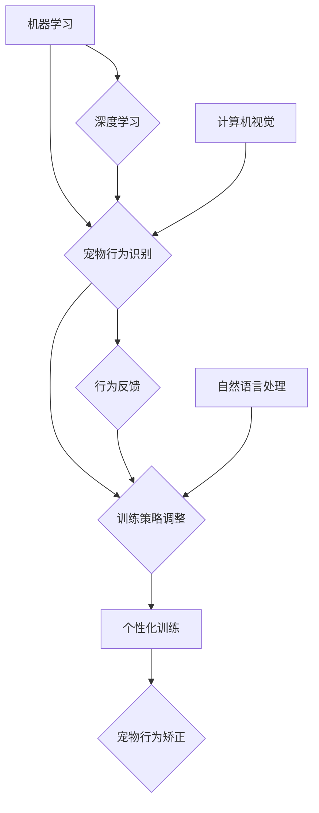

                 

## 智能宠物行为矫正创业：科学的宠物训练

> 关键词：人工智能、机器学习、宠物训练、行为矫正、深度学习、计算机视觉

## 1. 背景介绍

宠物已经成为许多家庭不可或缺的成员，它们为我们的生活增添了欢乐和陪伴。然而，宠物的行为问题也常常给主人带来困扰，例如吠叫、破坏家具、大小便失禁等。传统的宠物训练方法往往依赖于主人的经验和耐心，效率低下，且难以针对不同宠物的个性化需求。

近年来，人工智能技术飞速发展，为宠物行为矫正提供了新的解决方案。智能宠物行为矫正创业旨在利用人工智能技术，开发出更加科学、高效、个性化的宠物训练系统，帮助宠物主人解决行为问题，提升宠物的生活质量。

## 2. 核心概念与联系

智能宠物行为矫正创业的核心概念包括：

* **机器学习:** 利用算法从数据中学习，识别宠物的行为模式，并根据模式预测和调整训练策略。
* **深度学习:** 一种更高级的机器学习方法，能够处理更复杂的数据，例如图像和声音，更准确地识别宠物的行为。
* **计算机视觉:** 利用计算机技术分析图像和视频，识别宠物的动作、表情和姿势，为训练提供更精准的反馈。
* **自然语言处理:** 理解和处理人类语言，例如主人对宠物的指令和反馈，以便系统更好地理解训练目标。

这些核心概念相互关联，共同构成了智能宠物行为矫正系统的框架。



## 3. 核心算法原理 & 具体操作步骤

### 3.1  算法原理概述

智能宠物行为矫正系统通常采用监督学习算法，例如卷积神经网络（CNN）和循环神经网络（RNN），来识别宠物的行为模式。

* **CNN:** 擅长处理图像数据，可以识别宠物的动作、姿势和表情。
* **RNN:** 擅长处理序列数据，可以识别宠物的行为序列，例如吠叫、跳跃、坐下等。

训练过程中，需要大量的标注数据，例如宠物的行为视频和对应的标签。系统通过学习这些数据，建立起宠物行为与特征之间的映射关系，从而能够识别新的宠物行为。

### 3.2  算法步骤详解

1. **数据收集:** 收集大量宠物行为视频数据，并进行标注，例如标记宠物的动作、姿势、表情等。
2. **数据预处理:** 对收集到的数据进行清洗、格式化和增强，例如裁剪视频、调整分辨率、增加数据多样性等。
3. **模型选择:** 选择合适的深度学习模型，例如CNN或RNN，并根据任务需求进行调整。
4. **模型训练:** 利用标注数据训练模型，调整模型参数，使其能够准确识别宠物的行为。
5. **模型评估:** 使用测试数据评估模型的性能，例如准确率、召回率、F1-score等。
6. **模型部署:** 将训练好的模型部署到智能宠物行为矫正系统中，用于识别宠物的行为。

### 3.3  算法优缺点

**优点:**

* **高准确率:** 深度学习算法能够识别复杂的宠物行为模式，具有较高的准确率。
* **个性化训练:** 可以根据宠物的个体差异，调整训练策略，提高训练效果。
* **自动化训练:** 系统能够自动识别宠物的行为，并提供相应的训练反馈，减轻主人的负担。

**缺点:**

* **数据依赖:** 需要大量的标注数据进行训练，数据收集和标注成本较高。
* **模型复杂:** 深度学习模型的训练和部署需要较高的技术水平。
* **伦理问题:** 宠物行为矫正系统可能会对宠物的行为产生过度干预，需要谨慎考虑伦理问题。

### 3.4  算法应用领域

智能宠物行为矫正算法可以应用于以下领域：

* **宠物训练软件:** 开发智能宠物训练软件，帮助主人训练宠物的行为。
* **智能宠物玩具:** 开发智能宠物玩具，通过游戏的方式进行宠物训练。
* **宠物行为分析:** 分析宠物的行为数据，识别潜在的行为问题，并提供预警和建议。
* **宠物医疗诊断:** 利用宠物行为数据辅助诊断宠物的疾病。

## 4. 数学模型和公式 & 详细讲解 & 举例说明

### 4.1  数学模型构建

智能宠物行为矫正系统通常采用强化学习算法，例如Q-learning，来训练宠物的行为。强化学习算法的核心思想是通过奖励和惩罚机制，引导宠物学习目标行为。

在强化学习模型中，宠物的行为被表示为状态，环境的反馈被表示为奖励或惩罚。宠物的目标是学习一个策略，使得在给定的状态下选择最优的行为，从而获得最大的总奖励。

### 4.2  公式推导过程

Q-learning算法的核心公式为：

$$Q(s,a) = Q(s,a) + \alpha [r + \gamma \max_{a'} Q(s',a') - Q(s,a)]$$

其中：

* $Q(s,a)$ 表示在状态 $s$ 下执行动作 $a$ 的价值函数。
* $\alpha$ 表示学习率，控制着学习速度。
* $r$ 表示在状态 $s$ 下执行动作 $a$ 后获得的奖励。
* $\gamma$ 表示折扣因子，控制着未来奖励的权重。
* $s'$ 表示执行动作 $a$ 后进入的下一个状态。
* $a'$ 表示在下一个状态 $s'$ 下执行的动作。

### 4.3  案例分析与讲解

例如，训练宠物坐下行为，我们可以将“坐下”作为动作 $a$，状态 $s$ 可以表示为宠物的姿势，奖励 $r$ 可以设置为正值，惩罚 $r$ 可以设置为负值。

当宠物执行“坐下”动作后进入“坐下”状态时，系统会给予正值奖励，并更新 $Q(s,a)$ 值。反之，如果宠物没有执行“坐下”动作，或者执行了其他动作，系统会给予负值惩罚，并更新 $Q(s,a)$ 值。

通过不断重复训练，宠物会逐渐学习到执行“坐下”动作可以获得奖励，从而提高“坐下”行为的概率。

## 5. 项目实践：代码实例和详细解释说明

### 5.1  开发环境搭建

智能宠物行为矫正系统可以使用Python语言开发，并结合深度学习框架TensorFlow或PyTorch。

开发环境需要包含以下软件：

* Python 3.x
* TensorFlow或PyTorch
* OpenCV (计算机视觉库)
* NumPy (数值计算库)
* Matplotlib (数据可视化库)

### 5.2  源代码详细实现

以下是一个简单的CNN模型实现示例，用于识别宠物的行为：

```python
import tensorflow as tf

# 定义模型结构
model = tf.keras.models.Sequential([
    tf.keras.layers.Conv2D(32, (3, 3), activation='relu', input_shape=(64, 64, 3)),
    tf.keras.layers.MaxPooling2D((2, 2)),
    tf.keras.layers.Conv2D(64, (3, 3), activation='relu'),
    tf.keras.layers.MaxPooling2D((2, 2)),
    tf.keras.layers.Flatten(),
    tf.keras.layers.Dense(10, activation='softmax')
])

# 编译模型
model.compile(optimizer='adam',
              loss='sparse_categorical_crossentropy',
              metrics=['accuracy'])

# 训练模型
model.fit(x_train, y_train, epochs=10)

# 评估模型
loss, accuracy = model.evaluate(x_test, y_test)
print('Loss:', loss)
print('Accuracy:', accuracy)
```

### 5.3  代码解读与分析

* **模型结构:** 该模型是一个简单的CNN模型，包含两个卷积层和两个最大池化层，用于提取图像特征。最后是一个全连接层，用于分类。
* **编译模型:** 使用Adam优化器、交叉熵损失函数和准确率作为评估指标。
* **训练模型:** 使用训练数据训练模型，训练10个 epochs。
* **评估模型:** 使用测试数据评估模型的性能，输出损失值和准确率。

### 5.4  运行结果展示

训练完成后，可以将模型应用于新的宠物行为视频数据，识别宠物的行为。

## 6. 实际应用场景

智能宠物行为矫正系统可以应用于以下实际场景：

* **家庭宠物训练:** 帮助主人训练宠物的基本行为，例如坐下、握手、等待等。
* **宠物行为问题解决:** 针对宠物的吠叫、破坏家具、大小便失禁等行为问题提供解决方案。
* **宠物社交训练:** 帮助宠物学会与其他宠物和人类和谐相处。
* **宠物医疗辅助:** 通过分析宠物的行为数据，辅助诊断宠物的疾病。

### 6.4  未来应用展望

未来，智能宠物行为矫正系统将更加智能化、个性化和人性化。

* **更精准的行为识别:** 利用更先进的计算机视觉和自然语言处理技术，识别更复杂和细微的宠物行为。
* **更个性化的训练方案:** 根据宠物的个体差异，定制个性化的训练方案，提高训练效果。
* **更人性化的交互方式:** 利用语音交互、触控交互等方式，让主人和宠物之间更加自然、便捷地进行训练。
* **远程监控和训练:** 通过云平台，实现远程监控和训练，方便主人随时随地了解宠物的行为和训练进度。

## 7. 工具和资源推荐

### 7.1  学习资源推荐

* **书籍:**
    * 《深度学习》 by Ian Goodfellow, Yoshua Bengio, and Aaron Courville
    * 《机器学习》 by Tom Mitchell
* **在线课程:**
    * Coursera: 深度学习 Specialization
    * Udacity: 机器学习 Engineer Nanodegree
* **博客和网站:**
    * TensorFlow Blog: https://blog.tensorflow.org/
    * PyTorch Blog: https://pytorch.org/blog/

### 7.2  开发工具推荐

* **深度学习框架:** TensorFlow, PyTorch
* **计算机视觉库:** OpenCV
* **数值计算库:** NumPy
* **数据可视化库:** Matplotlib

### 7.3  相关论文推荐

* **《Attention Is All You Need》:** https://arxiv.org/abs/1706.03762
* **《Deep Reinforcement Learning with Double Q-learning》:** https://arxiv.org/abs/1509.06461
* **《Convolutional Neural Networks for Visual Recognition》:** https://arxiv.org/abs/1409.1556

## 8. 总结：未来发展趋势与挑战

### 8.1  研究成果总结

智能宠物行为矫正创业取得了显著的成果，例如开发出能够识别宠物行为的深度学习模型，并将其应用于宠物训练软件和智能宠物玩具。

### 8.2  未来发展趋势

未来，智能宠物行为矫正创业将朝着以下方向发展：

* **更精准的行为识别:** 利用更先进的计算机视觉和自然语言处理技术，识别更复杂和细微的宠物行为。
* **更个性化的训练方案:** 根据宠物的个体差异，定制个性化的训练方案，提高训练效果。
* **更人性化的交互方式:** 利用语音交互、触控交互等方式，让主人和宠物之间更加自然、便捷地进行训练。
* **远程监控和训练:** 通过云平台，实现远程监控和训练，方便主人随时随地了解宠物的行为和训练进度。

### 8.3  面临的挑战

智能宠物行为矫正创业也面临着一些挑战：

* **数据收集和标注:** 需要大量的标注数据进行训练，数据收集和标注成本较高。
* **模型复杂度:** 深度学习模型的训练和部署需要较高的技术水平。
* **伦理问题:** 宠物行为矫正系统可能会对宠物的行为产生过度干预，需要谨慎考虑伦理问题。

### 8.4  研究展望

未来，需要进一步研究以下问题：

* 如何更有效地收集和标注宠物行为数据。
* 如何开发更简单、更易于部署的深度学习模型。
* 如何更好地解决智能宠物行为矫正系统带来的伦理问题。


## 9. 附录：常见问题与解答

**Q1: 智能宠物行为矫正系统真的有效吗？**

A1: 智能宠物行为矫正系统已经取得了一定的成果，但效果因宠物的个体差异、训练方法和主人配合程度而异。

**Q2: 使用智能宠物行为矫正系统需要花费多少时间和精力？**

A2: 使用智能宠物行为矫正系统需要主人投入一定的学习时间和精力，但总体来说比传统的宠物训练方法更便捷高效。

**Q3: 智能宠物行为矫正系统会对宠物造成伤害吗？**

A3: 智能宠物行为矫正系统的设计目的是帮助宠物学习，不会对宠物造成伤害。但主人需要根据宠物的反应调整训练方法，避免过度干预。


作者：禅与计算机程序设计艺术 / Zen and the Art of Computer Programming 
<end_of_turn>

