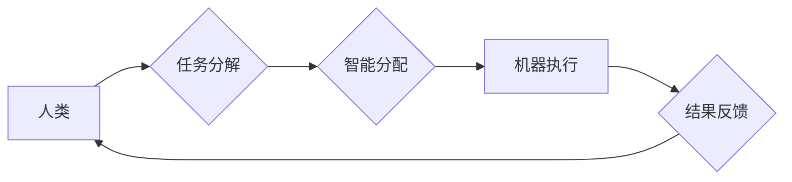

                 

## 未来工作：人机协作，重塑职业未来图景

> 关键词： 人机协作、人工智能、自动化、职业转型、未来工作、协同智能、数字孪生、新兴职业

### 1. 背景介绍

科技的飞速发展，特别是人工智能（AI）的蓬勃兴起，正在深刻地改变着人类社会，包括我们工作的方式。自动化技术日益成熟，机器能够完成越来越多的任务，这引发了人们对未来工作的担忧和思考：人类的工作将被机器取代吗？未来工作会是什么样子的？

面对这些挑战和机遇，我们需要积极探索人机协作的新模式，构建更加高效、智能、可持续的未来工作体系。

### 2. 核心概念与联系

**2.1 人机协作**

人机协作是指人类和机器在共同完成任务的过程中相互配合、相互补充，发挥各自优势，实现协同增效的模式。

**2.2 人工智能**

人工智能是指模拟人类智能行为的计算机系统，包括学习、推理、决策、感知、语言理解等能力。

**2.3 自动化**

自动化是指利用技术手段，使生产或工作过程无需人工干预，能够自动完成的模式。

**2.4 协同智能**

协同智能是指多个智能体（包括人类和机器）在共同目标下，通过信息共享、任务分配、协同决策等方式，实现智能协作，并超越单个智能体的能力。

**2.5 数字孪生**

数字孪生是指利用物理世界对象的数字化模型，实时反映其状态、行为和演变趋势，并进行模拟和预测的虚拟系统。

**2.6 流程图**



### 3. 核心算法原理 & 具体操作步骤

**3.1 算法原理概述**

人机协作的核心算法原理是基于智能分配和协同决策。

* **智能分配:** 通过分析任务特征、人员技能和机器能力，智能系统能够将任务分配到最合适的执行者，实现资源优化和效率提升。
* **协同决策:** 在任务执行过程中，人类和机器可以实时沟通、共享信息，共同决策，并根据实际情况进行调整，提高决策的准确性和效率。

**3.2 算法步骤详解**

1. **任务分解:** 将复杂的任务分解成多个子任务，每个子任务具有明确的定义和目标。
2. **智能评估:** 对每个子任务进行评估，分析其所需技能、资源和时间等因素，并根据机器能力和人员技能进行匹配。
3. **任务分配:** 根据评估结果，智能系统将任务分配到最合适的执行者，可以是人类、机器，或两者协同完成。
4. **任务执行:** 执行者根据任务指令和共享信息，完成各自的任务。
5. **结果反馈:** 执行者将完成的任务结果反馈给智能系统，并进行评估和分析。
6. **协同决策:** 智能系统根据反馈结果，对任务执行过程进行调整和优化，并进行协同决策，以提高整体效率和质量。

**3.3 算法优缺点**

* **优点:**
    * 提高效率：通过智能分配和协同决策，可以有效利用资源，提高工作效率。
    * 提升质量：机器能够执行重复性、高精度任务，释放人类精力，专注于更复杂、更具创造性的工作。
    * 增强创新：人机协作可以促进知识共享和创新思维，推动工作创新。
* **缺点:**
    * 技术复杂性：实现人机协作需要复杂的算法和技术支持，需要投入大量研发资源。
    * 数据安全问题：人机协作需要共享大量数据，需要加强数据安全保护。
    * 伦理挑战：人机协作可能会引发一些伦理问题，例如责任归属、算法偏见等，需要进行深入探讨和解决。

**3.4 算法应用领域**

人机协作算法广泛应用于各个领域，例如：

* **制造业:** 机器人协作，智能生产线，预测性维护。
* **医疗保健:** 辅助诊断，手术机器人，个性化治疗。
* **金融服务:** 风险评估，欺诈检测，客户服务。
* **教育培训:** 个性化学习，智能辅导，在线教学。

### 4. 数学模型和公式 & 详细讲解 & 举例说明

**4.1 数学模型构建**

人机协作的数学模型可以基于博弈论、决策树、强化学习等理论构建。

* **博弈论:** 可以将人机协作视为一个多智能体博弈，分析不同智能体之间的策略选择和结果。
* **决策树:** 可以构建决策树模型，模拟人机协作过程中的决策过程，并评估不同决策的优劣。
* **强化学习:** 可以利用强化学习算法，训练智能系统，使其能够在人机协作过程中不断学习和优化策略。

**4.2 公式推导过程**

例如，在任务分配问题中，可以使用效用函数来评估不同任务分配方案的优劣。

效用函数可以定义为：

$$U(T,A) = \sum_{i=1}^{n} w_i \cdot f_i(T_i, A_i)$$

其中：

* $U(T,A)$ 是任务分配方案 $(T,A)$ 的效用值。
* $T$ 是任务集合。
* $A$ 是执行者集合。
* $w_i$ 是任务 $i$ 的权重。
* $f_i(T_i, A_i)$ 是任务 $i$ 在执行者 $A_i$ 下的效用函数。

**4.3 案例分析与讲解**

例如，在自动驾驶领域，人机协作系统可以将驾驶任务分解成多个子任务，例如感知、规划、控制等，并根据驾驶场景和驾驶员意图，智能分配任务给驾驶员和自动驾驶系统。

### 5. 项目实践：代码实例和详细解释说明

**5.1 开发环境搭建**

* 操作系统：Ubuntu 20.04
* 编程语言：Python 3.8
* 库依赖：TensorFlow, PyTorch, OpenCV

**5.2 源代码详细实现**

```python
# 任务分配模块
def allocate_task(tasks, agents):
    # 根据任务特征和代理能力进行匹配
    # ...
    return task_assignments

# 协同决策模块
def collaborate_decision(task_results, shared_knowledge):
    # 根据任务结果和共享知识进行决策
    # ...
    return decision

# 主程序
if __name__ == "__main__":
    # 初始化任务和代理
    tasks = ...
    agents = ...

    # 任务分配
    task_assignments = allocate_task(tasks, agents)

    # 任务执行
    for agent, tasks in task_assignments.items():
        for task in tasks:
            # ...

    # 协同决策
    decision = collaborate_decision(task_results, shared_knowledge)

    # ...
```

**5.3 代码解读与分析**

* 任务分配模块：根据任务特征和代理能力进行匹配，将任务分配给最合适的执行者。
* 协同决策模块：根据任务结果和共享知识进行决策，优化任务执行过程。
* 主程序：初始化任务和代理，进行任务分配、任务执行和协同决策。

**5.4 运行结果展示**

运行结果可以展示任务执行效率、决策准确率等指标，评估人机协作系统的性能。

### 6. 实际应用场景

**6.1 制造业**

* 机器人协作：机器人与人类协同工作，完成复杂、高精度的生产任务。
* 智能生产线：利用人工智能和自动化技术，构建智能生产线，提高生产效率和质量。

**6.2 医疗保健**

* 辅助诊断：人工智能系统辅助医生进行诊断，提高诊断准确率。
* 手术机器人：机器人辅助医生进行手术，提高手术精度和安全性。

**6.3 金融服务**

* 风险评估：人工智能系统评估投资风险，帮助投资者做出更明智的决策。
* 欺诈检测：人工智能系统检测金融交易中的欺诈行为，保护用户资产安全。

**6.4 教育培训**

* 个性化学习：人工智能系统根据学生的学习情况，提供个性化的学习内容和辅导。
* 智能辅导：人工智能系统提供智能辅导，帮助学生解决学习难题。

**6.5 未来应用展望**

人机协作技术将应用于更多领域，例如：

* 城市管理：智能交通系统、智慧城市建设。
* 环境保护：环境监测、污染治理。
* 科学研究：数据分析、模型模拟。

### 7. 工具和资源推荐

**7.1 学习资源推荐**

* **书籍:**
    * 人工智能：一种现代方法
    * 深度学习
    * 人机协作
* **在线课程:**
    * Coursera: 人工智能课程
    * edX: 深度学习课程
    * Udacity: 人机协作课程

**7.2 开发工具推荐**

* **编程语言:** Python, Java, C++
* **机器学习框架:** TensorFlow, PyTorch, scikit-learn
* **机器人平台:** ROS, Gazebo

**7.3 相关论文推荐**

* 人机协作中的智能分配算法
* 人机协作中的协同决策方法
* 人机协作的未来发展趋势

### 8. 总结：未来发展趋势与挑战

**8.1 研究成果总结**

人机协作技术取得了显著进展，在多个领域取得了成功应用。

**8.2 未来发展趋势**

* **更智能的协作:** 人工智能技术将更加智能化，能够更好地理解人类意图，并提供更精准的协作支持。
* **更广泛的应用:** 人机协作技术将应用于更多领域，改变人们的工作方式和生活方式。
* **更人性化的设计:** 人机协作系统将更加人性化，更加易于使用和理解。

**8.3 面临的挑战**

* **技术挑战:** 人机协作技术还面临着一些技术挑战，例如算法复杂性、数据安全等。
* **伦理挑战:** 人机协作可能会引发一些伦理问题，例如责任归属、算法偏见等，需要进行深入探讨和解决。
* **社会挑战:** 人机协作可能会导致部分工作岗位被取代，需要进行社会转型和职业教育。

**8.4 研究展望**

未来，我们需要继续加强人机协作技术的研究，探索更智能、更安全、更人性化的协作模式，并积极应对技术、伦理和社会挑战，推动人机协作技术更好地服务于人类社会。

### 9. 附录：常见问题与解答

**9.1 如何选择合适的协作模式？**

选择合适的协作模式需要根据具体任务的特点、人员技能和机器能力进行综合考虑。

**9.2 如何保障人机协作过程中的数据安全？**

需要采取相应的技术措施，例如数据加密、访问控制等，保障数据安全。

**9.3 人机协作会取代人类工作吗？**

人机协作旨在提高工作效率和质量，而不是取代人类工作。未来，人类和机器将更加紧密地合作，共同创造更加美好的未来。


作者：禅与计算机程序设计艺术 / Zen and the Art of Computer Programming 
<end_of_turn>

