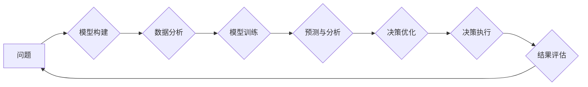

                 

## 模型思维在决策中的应用

> 关键词：模型思维、决策、人工智能、机器学习、数据分析、预测、优化

### 1. 背景介绍

在当今数据爆炸的时代，面对纷繁复杂的决策问题，传统的经验主义和直觉决策方式已难以满足需求。我们需要更科学、更有效的方法来分析数据、识别模式、预测未来，并做出最佳决策。模型思维应运而生，它提供了一种强大的工具，帮助我们构建决策模型，以更清晰、更系统地理解问题，并找到最优解。

模型思维的核心在于将复杂问题抽象成数学模型，并通过模型进行分析和预测。这种方法可以帮助我们：

* **清晰化问题：** 将模糊的、主观的决策问题转化为清晰、可量化的模型，更容易理解和分析。
* **识别模式：** 通过模型的分析，可以识别出数据中的隐藏模式和趋势，帮助我们洞察问题本质。
* **预测未来：** 基于历史数据和模型的预测能力，可以预估未来可能发生的情况，为决策提供参考。
* **优化决策：** 通过模型的模拟和测试，可以评估不同决策方案的优劣，选择最优解。

### 2. 核心概念与联系

模型思维的核心概念包括：

* **模型：** 模型是一种简化现实世界的抽象，用于描述系统或过程的结构和行为。模型可以是数学公式、图表、流程图等形式。
* **假设：** 模型建立的基础是假设，即对现实世界某些现象或关系的简化假设。
* **变量：** 模型中的变量是影响系统或过程的关键因素，它们可以是定量或定性变量。
* **关系：** 模型描述了变量之间的关系，例如因果关系、依赖关系等。

模型思维与人工智能、机器学习等领域密切相关。人工智能通过构建模型来模拟人类智能，机器学习则通过训练模型来学习数据中的模式。模型思维为这些领域提供了理论基础和方法论指导。

**Mermaid 流程图**



### 3. 核心算法原理 & 具体操作步骤

#### 3.1 算法原理概述

模型思维的核心算法原理是基于数据分析和建模，通过以下步骤实现决策优化：

1. **问题定义：** 明确决策目标和范围，识别关键变量和关系。
2. **数据收集：** 收集与决策问题相关的历史数据，确保数据质量和代表性。
3. **模型选择：** 根据问题特点和数据类型选择合适的模型，例如线性回归、逻辑回归、决策树等。
4. **模型训练：** 使用历史数据训练模型，调整模型参数，使其能够准确预测未来结果。
5. **模型评估：** 使用测试数据评估模型的预测精度和泛化能力，并进行模型优化。
6. **决策应用：** 将训练好的模型应用于实际决策，预测不同决策方案的结果，并选择最优解。

#### 3.2 算法步骤详解

1. **问题定义：** 

   * 确定决策目标：例如，提高销售额、降低成本、提升客户满意度等。
   * 识别关键变量：例如，产品价格、营销活动、客户特征等。
   * 建立变量关系假设：例如，价格下降会导致销量增加，营销活动投入增加会导致销售额提升等。

2. **数据收集：**

   * 确定数据来源：例如，销售记录、市场调研、客户反馈等。
   * 确保数据质量：例如，数据完整性、准确性、一致性等。
   * 数据预处理：例如，数据清洗、数据转换、数据归一化等。

3. **模型选择：**

   * 根据问题类型选择模型：例如，回归问题可以选择线性回归、逻辑回归等；分类问题可以选择决策树、支持向量机等。
   * 考虑模型复杂度和 interpretability：简单模型更容易理解，但可能无法捕捉复杂关系；复杂模型可以捕捉更多信息，但可能难以解释。

4. **模型训练：**

   * 使用历史数据训练模型，调整模型参数，使其能够准确预测未来结果。
   * 选择合适的训练算法：例如，梯度下降、随机梯度下降等。
   * 监控模型训练过程，评估模型性能，并进行模型调参。

5. **模型评估：**

   * 使用测试数据评估模型的预测精度和泛化能力。
   * 使用评价指标：例如，准确率、召回率、F1-score等。
   * 进行模型优化：例如，调整模型参数、选择不同的模型结构等。

6. **决策应用：**

   * 将训练好的模型应用于实际决策，预测不同决策方案的结果。
   * 分析模型预测结果，选择最优决策方案。
   * 持续监控决策效果，并根据实际情况进行模型更新和调整。

#### 3.3 算法优缺点

**优点：**

* **数据驱动：** 基于数据分析和建模，决策更加客观、科学。
* **预测能力：** 可以预测未来可能发生的情况，为决策提供参考。
* **优化决策：** 可以评估不同决策方案的优劣，选择最优解。
* **可量化：** 模型参数和结果可以量化，方便比较和分析。

**缺点：**

* **模型复杂度：** 建立和训练复杂的模型需要专业知识和技术。
* **数据依赖：** 模型的准确性依赖于数据质量和代表性。
* **假设限制：** 模型建立的基础是假设，假设的准确性会影响模型的预测结果。
* **解释性：** 某些复杂模型的决策过程难以解释，难以获得决策者的信任。

#### 3.4 算法应用领域

模型思维和相关算法广泛应用于各个领域，例如：

* **金融：** 风险评估、信用评分、投资决策等。
* **医疗：** 疾病诊断、治疗方案推荐、药物研发等。
* **电商：** 商品推荐、价格优化、用户画像等。
* **制造业：** 预测性维护、生产优化、质量控制等。
* **交通：** 交通流量预测、路线规划、智能交通管理等。

### 4. 数学模型和公式 & 详细讲解 & 举例说明

#### 4.1 数学模型构建

在模型思维中，数学模型是描述系统或过程的关键工具。常见的数学模型类型包括：

* **线性回归模型：** 用于预测连续变量，假设变量之间存在线性关系。
* **逻辑回归模型：** 用于预测分类变量，假设变量之间存在非线性关系。
* **决策树模型：** 用于分类或回归问题，通过树形结构决策规则进行预测。
* **神经网络模型：** 复杂模型，模拟大脑神经网络结构，用于解决更复杂的预测问题。

#### 4.2 公式推导过程

以线性回归模型为例，其目标是找到一条直线，使得预测值与实际值之间的误差最小。

**线性回归模型公式：**

$$y = \beta_0 + \beta_1x + \epsilon$$

其中：

* $y$ 是预测值
* $x$ 是输入变量
* $\beta_0$ 是截距
* $\beta_1$ 是斜率
* $\epsilon$ 是误差项

**最小二乘法：**

线性回归模型的参数 $\beta_0$ 和 $\beta_1$ 可以通过最小二乘法求解，其目标是最小化预测值与实际值之间的平方误差。

$$SSE = \sum_{i=1}^{n}(y_i - \hat{y}_i)^2$$

其中：

* $SSE$ 是平方误差和
* $y_i$ 是实际值
* $\hat{y}_i$ 是预测值

通过求解 $\frac{\partial SSE}{\partial \beta_0} = 0$ 和 $\frac{\partial SSE}{\partial \beta_1} = 0$，可以得到 $\beta_0$ 和 $\beta_1$ 的最小二乘解。

#### 4.3 案例分析与讲解

**案例：预测房价**

假设我们想要预测房屋价格，已知房屋面积和房屋所在区域等特征数据。我们可以使用线性回归模型来构建预测模型。

* **输入变量：** 房屋面积
* **输出变量：** 房屋价格

通过收集历史房价数据，我们可以训练线性回归模型，并得到模型参数 $\beta_0$ 和 $\beta_1$。

然后，我们可以使用训练好的模型预测新房子的价格。例如，如果新房子的面积为 100 平方米，则预测价格为：

$$y = \beta_0 + \beta_1 * 100$$

其中 $\beta_0$ 和 $\beta_1$ 是模型训练得到的参数。

### 5. 项目实践：代码实例和详细解释说明

#### 5.1 开发环境搭建

* **编程语言：** Python
* **机器学习库：** scikit-learn
* **数据处理库：** pandas
* **可视化库：** matplotlib

#### 5.2 源代码详细实现

```python
import pandas as pd
from sklearn.linear_model import LinearRegression
from sklearn.model_selection import train_test_split
from sklearn.metrics import mean_squared_error

# 加载数据
data = pd.read_csv('house_price.csv')

# 划分训练集和测试集
X = data[['area']]
y = data['price']
X_train, X_test, y_train, y_test = train_test_split(X, y, test_size=0.2, random_state=42)

# 创建线性回归模型
model = LinearRegression()

# 训练模型
model.fit(X_train, y_train)

# 预测测试集结果
y_pred = model.predict(X_test)

# 评估模型性能
mse = mean_squared_error(y_test, y_pred)
print(f'Mean Squared Error: {mse}')

# 可视化预测结果
import matplotlib.pyplot as plt
plt.scatter(X_test, y_test, color='blue')
plt.plot(X_test, y_pred, color='red')
plt.xlabel('Area')
plt.ylabel('Price')
plt.title('House Price Prediction')
plt.show()
```

#### 5.3 代码解读与分析

* **数据加载和预处理：** 使用 pandas 库加载数据，并选择需要使用的特征和目标变量。
* **数据划分：** 使用 train_test_split 函数将数据划分为训练集和测试集，用于模型训练和评估。
* **模型创建和训练：** 使用 scikit-learn 库创建线性回归模型，并使用 fit 函数训练模型。
* **模型预测：** 使用 predict 函数预测测试集结果。
* **模型评估：** 使用 mean_squared_error 函数评估模型性能，并打印结果。
* **可视化结果：** 使用 matplotlib 库绘制散点图和预测曲线，直观展示模型预测效果。

#### 5.4 运行结果展示

运行代码后，会输出模型的均方误差值，以及房屋面积与价格之间的预测曲线图。

### 6. 实际应用场景

模型思维在决策中的应用场景非常广泛，例如：

* **金融风险管理：** 建立信用评分模型，评估客户的贷款风险，并制定相应的风险控制策略。
* **精准营销：** 建立用户画像模型，分析用户的行为特征和偏好，进行精准的营销推广。
* **医疗诊断辅助：** 建立疾病诊断模型，根据患者的症状和检查结果，辅助医生进行诊断。
* **智能交通管理：** 建立交通流量预测模型，预测交通拥堵情况，并优化交通信号灯控制策略。

### 6.4 未来应用展望

随着人工智能技术的不断发展，模型思维在决策中的应用将更加广泛和深入。未来，我们可以期待：

* **更复杂、更精准的模型：** 深度学习等新兴技术将推动模型的复杂度和精准度提升。
* **更智能的决策辅助：** 模型将能够提供更深入的分析和建议，帮助决策者做出更明智的决策。
* **更个性化的决策：** 模型将能够根据用户的个人特征和需求，提供个性化的决策方案。

### 7. 工具和资源推荐

#### 7.1 学习资源推荐

* **书籍：**
    * 《模式识别》 - Christopher Bishop
    * 《机器学习》 - Tom Mitchell
    * 《深度学习》 - Ian Goodfellow, Yoshua Bengio, Aaron Courville
* **在线课程：**
    * Coursera: Machine Learning by Andrew Ng
    * edX: Artificial Intelligence by Columbia University
    * Udacity: Deep Learning Nanodegree

#### 7.2 开发工具推荐

* **Python:** 
    * scikit-learn: 机器学习库
    * TensorFlow: 深度学习库
    * PyTorch: 深度学习库
* **数据可视化工具:**
    * matplotlib
    * seaborn
    * plotly

#### 7.3 相关论文推荐

* **《Attention Is All You Need》:** 
    * https://arxiv.org/abs/1706.03762
* **《Deep Residual Learning for Image Recognition》:** 
    * https://arxiv.org/abs/1512.03385
* **《Generative Adversarial Networks》:** 
    * https://arxiv.org/abs/1406.2661

### 8. 总结：未来发展趋势与挑战

#### 8.1 研究成果总结

模型思维在决策中的应用取得了显著成果，为各个领域带来了新的机遇和挑战。

#### 8.2 未来发展趋势

* **模型自动化：** 自动化模型构建和训练过程，降低模型开发门槛。
* **模型解释性：** 提高模型的解释性，帮助决策者理解模型决策过程。
* **模型可解释性：** 增强模型的可解释性，提高模型的可信度和可接受性。
* **模型鲁棒性：** 提高模型的鲁棒性，使其能够应对数据噪声和异常值。

#### 8.3 面临的挑战

* **数据质量问题：** 模型的准确性依赖于数据质量，数据不完整、不准确或存在偏差都会影响模型性能。
* **模型复杂度问题：** 复杂模型难以理解和解释，难以获得决策者的信任。
* **伦理问题：** 模型决策可能存在偏见或歧视，需要关注模型的公平性和伦理问题。

#### 8.4 研究展望

未来，模型思维在决策中的应用将继续深入发展，需要进一步研究以下问题：

* 如何构建更准确、更可靠的模型？
* 如何提高模型的解释性和可信度？
* 如何解决模型决策中的伦理问题？


### 9. 附录：常见问题与解答

* **Q1：模型思维与经验主义决策有什么区别？**

   A1：经验主义决策依赖于个人的经验和直觉，而模型思维则基于数据分析和建模，更加客观和科学。

* **Q2：如何选择合适的模型？**

   A2：选择合适的模型需要根据具体问题类型和数据特点进行选择。

* **Q3：如何评估模型性能？**

   A3：可以使用各种评价指标评估模型性能，例如准确率、召回率、F1-score等。

* **Q4：模型思维的应用范围有哪些？**

   A4：模型思维的应用范围非常广泛，包括金融、医疗、电商、制造业等各个领域。


作者：禅与计算机程序设计艺术 / Zen and the Art of Computer Programming<end_of_turn>

