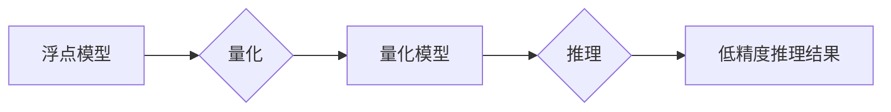

                 

## 模型量化：提高推理效率的关键技术

> 关键词：模型量化、深度学习、推理效率、精度损失、量化方法、神经网络、硬件加速

## 1. 背景介绍

深度学习模型在图像识别、自然语言处理、语音识别等领域取得了显著的成就。然而，这些模型通常具有庞大的参数量和复杂的计算结构，导致推理速度慢、部署成本高。为了解决这一问题，模型量化技术应运而生。

模型量化是指将模型中的浮点参数（通常为32位）转换为低精度数据类型（如8位整数），从而减少模型的存储空间和计算量，提高推理效率。近年来，随着移动设备和嵌入式系统的普及，模型量化技术得到了广泛关注。

## 2. 核心概念与联系

模型量化技术的核心是将浮点数转换为低精度整数，并通过量化算法和量化后训练方法来最小化精度损失。

**量化流程图:**



**核心概念:**

* **浮点模型:** 深度学习模型通常使用浮点数（如32位）来表示参数和激活值。
* **量化:** 将浮点数转换为低精度整数，例如8位整数（INT8）。
* **量化模型:** 量化后的深度学习模型，参数和激活值都使用低精度整数表示。
* **推理:** 使用量化模型进行预测或分类。

**联系:**

模型量化通过将浮点模型转换为量化模型，从而实现推理效率的提升。量化后的模型在硬件上执行速度更快，并且所需的存储空间更小。

## 3. 核心算法原理 & 具体操作步骤

### 3.1  算法原理概述

模型量化算法的核心是找到一种方法，将浮点数映射到低精度整数，同时尽量保持模型的精度。常用的量化方法包括：

* **静态量化:** 在训练完成后，将浮点参数和激活值静态地映射到低精度整数。
* **动态量化:** 在推理过程中，根据输入数据动态地调整量化参数。

### 3.2  算法步骤详解

**静态量化步骤:**

1. **训练浮点模型:** 使用标准的深度学习框架训练浮点模型。
2. **量化参数:** 将浮点参数映射到低精度整数，可以使用最小二乘法、均值量化等方法。
3. **量化激活值:** 将激活值映射到低精度整数，可以使用线性量化、对数量化等方法。
4. **重新训练量化模型:** 使用量化后的模型进行微调训练，以补偿量化带来的精度损失。

**动态量化步骤:**

1. **训练浮点模型:** 使用标准的深度学习框架训练浮点模型。
2. **量化参数:** 将浮点参数映射到低精度整数。
3. **动态调整量化参数:** 在推理过程中，根据输入数据动态调整量化参数，以保持模型的精度。

### 3.3  算法优缺点

**静态量化:**

* **优点:** 
    * 推理速度快，因为量化参数和激活值是固定的。
    * 硬件加速效果好，因为低精度整数更容易被硬件加速。
* **缺点:** 
    * 精度损失可能较大，因为量化过程是离散的。
    * 无法适应不同的输入数据。

**动态量化:**

* **优点:** 
    * 精度损失较小，因为量化参数可以根据输入数据动态调整。
    * 可以适应不同的输入数据。
* **缺点:** 
    * 推理速度可能较慢，因为需要动态调整量化参数。
    * 硬件加速效果可能不如静态量化好。

### 3.4  算法应用领域

模型量化技术广泛应用于以下领域:

* **移动设备:** 将深度学习模型部署到移动设备上，例如手机、平板电脑等。
* **嵌入式系统:** 将深度学习模型部署到嵌入式系统上，例如智能家居、无人机等。
* **边缘计算:** 将深度学习模型部署到边缘设备上，例如工业自动化、医疗诊断等。

## 4. 数学模型和公式 & 详细讲解 & 举例说明

### 4.1  数学模型构建

**量化模型的数学模型:**

假设浮点参数为 $w_f$，量化后为 $w_q$，量化范围为 $[min_q, max_q]$，则量化公式为:

$$w_q = round(\frac{w_f - min_f}{max_f - min_f} \times (max_q - min_q) + min_q)$$

其中，$min_f$ 和 $max_f$ 分别为浮点参数的最小值和最大值。

**量化激活值的数学模型:**

假设浮点激活值为 $a_f$，量化后为 $a_q$，量化范围为 $[min_q, max_q]$，则量化公式为:

$$a_q = round(\frac{a_f - min_a}{max_a - min_a} \times (max_q - min_q) + min_q)$$

其中，$min_a$ 和 $max_a$ 分别为激活值的最小值和最大值。

### 4.2  公式推导过程

量化公式的推导过程是将浮点数据映射到低精度整数的范围。

**参数量化:**

1. 首先，将浮点参数 $w_f$ 归一化到 $[0, 1]$ 的范围。
2. 然后，将归一化后的值乘以量化范围 $(max_q - min_q)$，得到量化后的整数值。
3. 最后，将整数值加上量化范围的最小值 $min_q$，得到最终的量化参数 $w_q$。

**激活值量化:**

激活值量化的过程与参数量化类似，只是将激活值 $a_f$ 代入公式中。

### 4.3  案例分析与讲解

**案例:**

假设一个浮点参数 $w_f = 0.75$，量化范围为 $[0, 255]$，则量化后的整数值 $w_q$ 为:

$$w_q = round(\frac{0.75 - 0}{1 - 0} \times (255 - 0) + 0) = 191$$

**讲解:**

通过量化公式，将浮点参数 $0.75$ 映射到低精度整数 $191$。

## 5. 项目实践：代码实例和详细解释说明

### 5.1  开发环境搭建

* **操作系统:** Ubuntu 20.04
* **深度学习框架:** TensorFlow 2.x
* **编程语言:** Python 3.7

### 5.2  源代码详细实现

```python
import tensorflow as tf

# 定义一个简单的卷积神经网络模型
model = tf.keras.models.Sequential([
    tf.keras.layers.Conv2D(32, (3, 3), activation='relu', input_shape=(28, 28, 1)),
    tf.keras.layers.MaxPooling2D((2, 2)),
    tf.keras.layers.Flatten(),
    tf.keras.layers.Dense(10, activation='softmax')
])

# 训练模型
model.compile(optimizer='adam',
              loss='sparse_categorical_crossentropy',
              metrics=['accuracy'])
model.fit(x_train, y_train, epochs=10)

# 量化模型
converter = tf.lite.TFLiteConverter.from_keras_model(model)
tflite_model = converter.convert()

# 保存量化模型
with open('quantized_model.tflite', 'wb') as f:
    f.write(tflite_model)
```

### 5.3  代码解读与分析

* **模型定义:** 代码定义了一个简单的卷积神经网络模型，用于手写数字识别。
* **模型训练:** 使用 Adam 优化器和交叉熵损失函数训练模型。
* **模型量化:** 使用 TensorFlow Lite 的 `TFLiteConverter` 将模型转换为量化模型。
* **模型保存:** 将量化模型保存为 `.tflite` 文件。

### 5.4  运行结果展示

量化后的模型可以部署到移动设备或嵌入式系统上，并实现更快的推理速度。

## 6. 实际应用场景

### 6.1  移动设备应用

* **图像识别:** 在手机上识别物体、场景、人脸等。
* **语音识别:** 将语音转换为文本，用于语音助手、语音输入等应用。
* **自然语言处理:** 进行文本分类、情感分析、机器翻译等任务。

### 6.2  嵌入式系统应用

* **智能家居:** 控制家电、识别人脸、语音控制等。
* **无人机:** 进行图像识别、路径规划、避障等。
* **医疗诊断:** 进行图像分析、疾病诊断等。

### 6.3  边缘计算应用

* **工业自动化:** 进行机器视觉、缺陷检测等。
* **智能交通:** 进行车辆识别、交通流量分析等。
* **金融风控:** 进行欺诈检测、风险评估等。

### 6.4  未来应用展望

随着模型量化技术的不断发展，其应用场景将更加广泛，例如:

* **低功耗设备:** 将深度学习模型部署到低功耗设备上，例如可穿戴设备、传感器等。
* **实时推理:** 实现实时推理，例如自动驾驶、增强现实等。
* **个性化服务:** 根据用户的个人数据进行个性化量化，提供更精准的服务。

## 7. 工具和资源推荐

### 7.1  学习资源推荐

* **书籍:**

    * 《深度学习》 by Ian Goodfellow, Yoshua Bengio, and Aaron Courville
    * 《动手学深度学习》 by Aurélien Géron

* **在线课程:**

    * TensorFlow 官方教程: https://www.tensorflow.org/tutorials
    * Coursera 深度学习课程: https://www.coursera.org/specializations/deep-learning

### 7.2  开发工具推荐

* **TensorFlow Lite:** https://www.tensorflow.org/lite
* **PyTorch Mobile:** https://pytorch.org/mobile/
* **ONNX Runtime:** https://onnxruntime.ai/

### 7.3  相关论文推荐

* **Quantized Neural Networks: Training Neural Networks with Low Precision Weights and Activations** by Jacob B. Schwarz, et al.
* **Quantization-aware Training: A Methodology for Quantizing Deep Neural Networks** by Florian Knoll, et al.

## 8. 总结：未来发展趋势与挑战

### 8.1  研究成果总结

模型量化技术取得了显著的成果，能够有效提高深度学习模型的推理效率，并降低部署成本。

### 8.2  未来发展趋势

* **更精确的量化方法:** 研究更精确的量化方法，以减少量化带来的精度损失。
* **自适应量化:** 研究自适应量化方法，能够根据不同的输入数据动态调整量化参数。
* **混合精度量化:** 研究混合精度量化方法，将不同精度的数据类型混合使用，以平衡精度和效率。

### 8.3  面临的挑战

* **精度损失:** 量化过程会带来精度损失，如何有效地减少精度损失是模型量化技术面临的挑战。
* **硬件支持:** 不同的硬件平台对量化模型的支持程度不同，需要针对不同的硬件平台进行优化。
* **模型复杂度:** 对于复杂模型，量化过程更加困难，需要研究更有效的量化算法。

### 8.4  研究展望

未来，模型量化技术将继续发展，并应用于更多领域。研究人员将继续探索更精确、更有效的量化方法，以推动深度学习模型在更广泛场景下的应用。

## 9. 附录：常见问题与解答

**问题 1:** 模型量化会带来什么精度损失？

**答案:** 模型量化会带来一定的精度损失，但可以通过量化方法和训练技巧来最小化损失。

**问题 2:** 模型量化适用于哪些类型的模型？

**答案:** 模型量化适用于各种类型的深度学习模型，包括卷积神经网络、循环神经网络等。

**问题 3:** 如何选择合适的量化方法？

**答案:** 选择合适的量化方法需要考虑模型的类型、精度要求、硬件平台等因素。

**问题 4:** 模型量化需要修改原有的模型代码吗？

**答案:** 

有些量化方法需要修改模型代码，而有些方法则不需要修改代码，可以直接使用量化工具进行转换。

**问题 5:** 模型量化后的模型可以部署到哪些平台？

**答案:** 模型量化后的模型可以部署到移动设备、嵌入式系统、云端等平台。


作者：禅与计算机程序设计艺术 / Zen and the Art of Computer Programming<end_of_turn>

