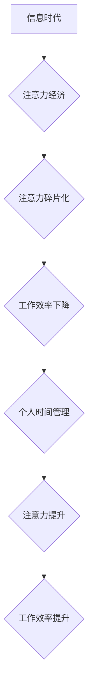

                 

## 注意力经济与个人时间管理的艺术

> 关键词：注意力经济、时间管理、深度工作、信息过滤、专注力、效率提升、数字工具

### 1. 背景介绍

在当今信息爆炸的时代，我们每个人都被无休止的信息流所包围。电子邮件、社交媒体、新闻推送、即时通讯软件，无时无刻不在争夺我们的注意力。这种注意力碎片化现象，被称为“注意力经济”，它深刻地影响着我们的工作效率、学习能力和生活质量。

注意力经济的本质是，注意力成为了稀缺的资源，而那些能够有效获取和利用注意力的人，就拥有了巨大的竞争优势。然而，在信息过载的时代，如何有效地管理自己的注意力，成为了每个人都面临的挑战。

### 2. 核心概念与联系

#### 2.1 注意力经济

注意力经济是指在信息时代，注意力成为了最宝贵的资源，而那些能够有效获取和利用注意力的人，就拥有了巨大的竞争优势。

#### 2.2 个人时间管理

个人时间管理是指个人对自身时间进行规划、安排和控制，以提高工作效率、学习效率和生活质量。

#### 2.3 核心概念联系

注意力经济与个人时间管理有着密切的联系。

* **注意力是时间管理的基础：**  有效地管理时间，首先要学会管理自己的注意力。只有集中注意力，才能高效地完成任务，提高工作效率。
* **时间管理可以提升注意力：**  合理的安排时间，可以减少信息干扰，创造出专注于特定任务的环境，从而提升注意力。

**Mermaid 流程图：**



### 3. 核心算法原理 & 具体操作步骤

#### 3.1 算法原理概述

个人时间管理的核心算法原理是基于“番茄工作法”和“帕累托法则”。

* **番茄工作法：** 将工作时间划分为25分钟的“番茄”工作周期，中间休息5分钟，每四个“番茄”休息20-30分钟。这种方法可以帮助人们集中注意力，提高工作效率。
* **帕累托法则：** 认为80%的结果来自于20%的努力。因此，个人时间管理的关键是识别和优先处理最重要的20%的任务。

#### 3.2 算法步骤详解

1. **目标设定：** 明确每天需要完成的任务和目标。
2. **任务分解：** 将大任务分解成小的、可管理的任务。
3. **优先级排序：** 根据帕累托法则，将任务按照重要程度进行排序。
4. **时间分配：** 使用番茄工作法，将时间分配给不同的任务。
5. **休息与放松：** 定期休息，避免过度疲劳。
6. **反思与调整：** 定期反思自己的时间管理方法，并根据实际情况进行调整。

#### 3.3 算法优缺点

**优点：**

* 提高工作效率
* 增强专注力
* 减少拖延
* 改善时间管理习惯

**缺点：**

* 需要一定的自律性
* 不适合所有类型的任务
* 可能导致过度专注，忽略其他重要的事情

#### 3.4 算法应用领域

* 工作和学习
* 个人生活
* 项目管理
* 团队协作

### 4. 数学模型和公式 & 详细讲解 & 举例说明

#### 4.1 数学模型构建

我们可以用一个简单的数学模型来描述注意力经济和个人时间管理的关系：

* **注意力资源：**  假设注意力资源是一个有限的量，可以用一个变量 A 表示。
* **信息干扰：**  信息干扰可以看作是注意力资源的消耗，可以用一个变量 I 表示。
* **工作效率：**  工作效率可以看作是注意力资源和时间资源的乘积，可以用一个变量 E 表示。

**公式：**

$$E = A * T$$

其中：

* E 代表工作效率
* A 代表注意力资源
* T 代表时间资源

#### 4.2 公式推导过程

我们可以推导出以下公式：

$$E = (A - I) * T$$

其中：

* I 代表信息干扰

这个公式表明，工作效率不仅取决于注意力资源和时间资源，还取决于信息干扰的大小。

#### 4.3 案例分析与讲解

假设一个程序员每天有 8 小时的工作时间 (T = 8)。他的注意力资源 A = 100。如果他每天受到 20 的信息干扰 (I = 20)，那么他的工作效率为：

$$E = (100 - 20) * 8 = 640$$

如果他能够减少信息干扰到 10，那么他的工作效率将提高到：

$$E = (100 - 10) * 8 = 720$$

这个例子说明，减少信息干扰可以显著提高工作效率。

### 5. 项目实践：代码实例和详细解释说明

#### 5.1 开发环境搭建

* 操作系统：Windows/macOS/Linux
* 编程语言：Python
* 开发工具：VS Code/Atom/Sublime Text

#### 5.2 源代码详细实现

```python
import time

class Timer:
    def __init__(self, duration):
        self.duration = duration

    def start(self):
        self.start_time = time.time()

    def stop(self):
        end_time = time.time()
        elapsed_time = end_time - self.start_time
        return elapsed_time

    def is_elapsed(self):
        return time.time() - self.start_time >= self.duration

# 使用番茄工作法
timer = Timer(25 * 60)  # 设置番茄工作时间为25分钟
timer.start()

while not timer.is_elapsed():
    # 工作
    print("工作中...")
    time.sleep(1)

print("休息时间！")
```

#### 5.3 代码解读与分析

* `Timer` 类：用于管理番茄工作时间。
* `start()` 方法：记录开始时间。
* `stop()` 方法：计算工作时间并返回。
* `is_elapsed()` 方法：判断是否超过番茄工作时间。
* 主程序：创建一个 `Timer` 对象，启动计时器，并在计时器未结束之前进行工作。

#### 5.4 运行结果展示

程序运行后，将每隔 25 分钟提醒用户休息，并显示工作时间。

### 6. 实际应用场景

#### 6.1 工作场景

* 程序员：使用番茄工作法提高代码编写效率。
* 写作人员：集中注意力完成写作任务。
* 设计师：专注于设计方案的创作。

#### 6.2 学习场景

* 学生：集中注意力学习课程内容。
* 自学者：高效地完成学习目标。
* 语言学习者：利用碎片时间进行语言练习。

#### 6.3 个人生活场景

* 阅读：专注于阅读书籍，提高阅读理解能力。
* 运动：集中注意力进行锻炼，提升运动效果。
* 冥想：专注于冥想练习，放松身心。

#### 6.4 未来应用展望

随着人工智能技术的不断发展，未来个人时间管理工具将更加智能化和个性化。例如：

* 基于人工智能的注意力监测和提醒系统。
* 自动化的任务分配和时间规划系统。
* 个性化的学习和工作模式推荐系统。

### 7. 工具和资源推荐

#### 7.1 学习资源推荐

* 书籍：《深度工作》、《番茄工作法》、《时间管理艺术》
* 网站：Zen Habits, Getting Things Done, Lifehacker
* 课程：Coursera, Udemy, edX

#### 7.2 开发工具推荐

* 时间管理软件：Todoist, Asana, Trello
*  Pomodoro 计时器：Focus Keeper, Forest, TomatoTimer
* 信息过滤工具：Freedom, Cold Turkey, StayFocusd

#### 7.3 相关论文推荐

* Nir Eyal, Hooked: How to Build Habit-Forming Products
* Cal Newport, Deep Work: Rules for Focused Success in a Distracted World
* David Allen, Getting Things Done: The Art of Stress-Free Productivity

### 8. 总结：未来发展趋势与挑战

#### 8.1 研究成果总结

注意力经济与个人时间管理的研究成果表明，有效地管理注意力，可以显著提高工作效率、学习效率和生活质量。番茄工作法和帕累托法则等方法，为个人时间管理提供了有效的工具和策略。

#### 8.2 未来发展趋势

未来，个人时间管理工具将更加智能化和个性化，能够更好地适应用户的需求和习惯。人工智能技术将被广泛应用于注意力监测、任务分配和时间规划等领域，帮助人们更加高效地管理时间。

#### 8.3 面临的挑战

* **信息干扰的不断增加：**  随着互联网和移动设备的普及，信息干扰越来越严重，这给个人时间管理带来了新的挑战。
* **个性化需求的差异化：**  每个人的工作习惯、学习方式和生活方式都不同，因此需要开发更加个性化的时间管理工具。
* **技术伦理问题：**  人工智能技术在个人时间管理中的应用，也引发了一些伦理问题，例如数据隐私和算法偏见等。

#### 8.4 研究展望

未来，个人时间管理的研究将更加注重以下几个方面：

* **开发更加智能化和个性化的时间管理工具。**
* **研究注意力经济的本质和规律，探索更有效的注意力管理方法。**
* **解决人工智能技术在个人时间管理中的伦理问题，确保技术应用的安全性、公平性和可控性。**

### 9. 附录：常见问题与解答

**问题：** 如何克服信息干扰？

**解答：**

* **关闭不必要的通知：**  关闭手机和电脑上的不必要的通知，减少信息干扰。
* **使用信息过滤工具：**  使用 Freedom, Cold Turkey, StayFocusd 等工具，屏蔽社交媒体和网站，集中注意力。
* **设定工作时间：**  设定固定的工作时间，并在工作时间之外避免使用电子设备。

**问题：** 如何提高专注力？

**解答：**

* **练习冥想：**  冥想可以帮助人们训练专注力，提高抗干扰能力。
* **番茄工作法：**  使用番茄工作法，将工作时间划分为25分钟的周期，中间休息5分钟，可以帮助人们集中注意力。
* **创造专注环境：**  选择一个安静、舒适的环境进行工作，减少外界干扰。


作者：禅与计算机程序设计艺术 / Zen and the Art of Computer Programming 
<end_of_turn>

