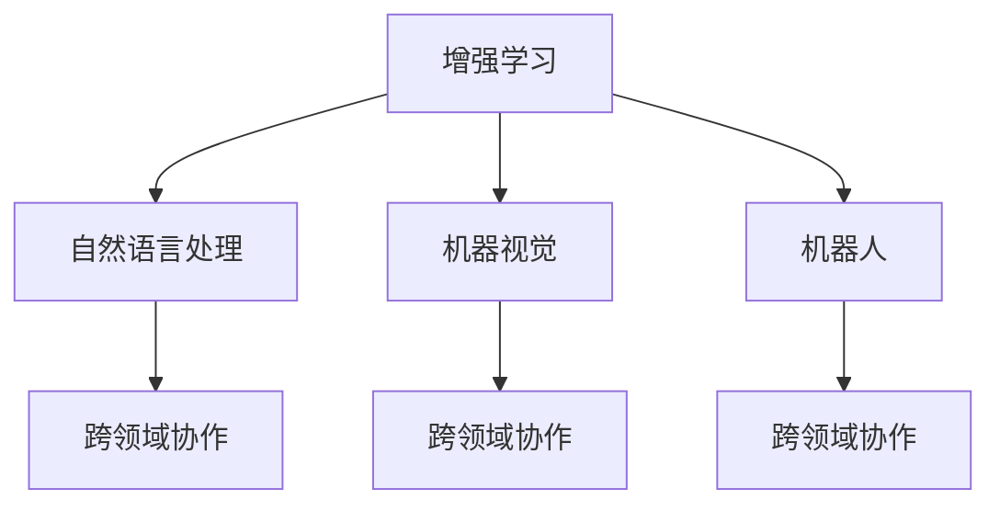

                 

## 1. 背景介绍

### 1.1 问题由来

在人类社会发展的历史长河中，科技的进步始终是推动文明前行的重要动力。工业革命的机器取代了手工劳动，极大地提高了生产效率；信息革命的互联网连接了世界，信息传播变得迅捷；而现在，人工智能(AI)技术正逐步成为引领未来科技革命的新引擎。

AI的出现，不仅重塑了劳动力的结构，还拓展了人类认知能力的边界。然而，AI并非人类智能的替代品，而是人类潜能和智慧的增强器。无论是科学研究、医疗健康，还是艺术创作、社交互动，AI技术正在以多种形式，全面增强人类的智慧和创造力。

### 1.2 问题核心关键点

AI与人类协作的核心关键点在于如何利用AI技术，不仅提升人类的认知能力，同时确保AI系统能够理解和尊重人类的价值观、伦理和法律，与人类形成和谐共生、互利共赢的合作关系。

AI与人类协作的技术手段主要包括：
- **增强学习(Reinforcement Learning)**：通过试错和奖励机制，让AI系统在特定环境中不断优化策略。
- **自然语言处理(Natural Language Processing, NLP)**：使AI能够理解、处理和生成人类语言，进行智能对话、文本生成等。
- **机器视觉(Machine Vision)**：赋予AI识别、分析和处理视觉信息的能力，实现自动驾驶、人脸识别等。
- **机器人(Robotics)**：通过AI技术，使机器人具备自主决策和执行复杂任务的能力。

这些技术手段的结合，使得AI能够在不同的应用场景中，增强人类的潜能和智慧，推动社会的进步和发展。

### 1.3 问题研究意义

研究AI与人类协作，对于推动科技革命、促进社会福祉、提升人类生活质量具有重要意义：

1. **推动科技创新**：AI技术在科学研究、医疗健康等领域的应用，能够解决传统方法难以解决的复杂问题，推动科学技术的进步。
2. **提升人类福祉**：AI能够提供个性化、精准的医疗健康服务，辅助老人、残障人士等弱势群体，提升他们的生活质量。
3. **增强生产效率**：在工业生产、服务业、农业等领域，AI技术通过自动化和智能化，显著提高生产效率和产品质量。
4. **促进教育公平**：通过个性化教学、智能辅导等AI应用，为偏远地区和欠发达地区提供优质教育资源，缩小教育差距。
5. **助力环境保护**：AI在环境监测、资源管理、灾害预测等领域的应用，能够优化资源配置，减少环境污染，保护生态环境。

## 2. 核心概念与联系

### 2.1 核心概念概述

为更好地理解AI与人类协作，本节将介绍几个密切相关的核心概念：

- **增强学习(Reinforcement Learning, RL)**：一种通过与环境互动，学习最优策略的机器学习方法。AI系统通过试错和奖励机制，在特定环境中不断优化策略。
- **自然语言处理(NLP)**：使AI能够理解、处理和生成人类语言的技术，涉及语义分析、情感识别、文本生成等。
- **机器视觉(Machine Vision)**：赋予AI识别、分析和处理视觉信息的能力，实现图像识别、物体检测、场景理解等。
- **机器人(Robotics)**：结合AI技术，使机器人具备自主决策和执行复杂任务的能力。
- **跨领域协作**：AI与不同领域技术的结合，形成协同作用，如AI在医疗、教育、娱乐等领域的广泛应用。

这些核心概念之间的逻辑关系可以通过以下Mermaid流程图来展示：



这个流程图展示了一些核心概念之间的关系：

1. 增强学习是AI系统中一种常见的学习范式，与NLP、机器视觉等技术结合，可以提升AI系统的能力。
2. NLP和机器视觉等技术在跨领域协作中扮演重要角色，如智能对话系统、语音识别系统等。
3. 机器人技术结合AI，能够在复杂的物理环境中执行任务，如无人驾驶、家庭服务机器人等。
4. AI与不同领域技术的结合，形成了跨领域协作的广泛应用，进一步提升了AI系统的性能和应用范围。

## 3. 核心算法原理 & 具体操作步骤

### 3.1 算法原理概述

AI与人类协作的核心算法原理，主要包括增强学习、自然语言处理、机器视觉和机器人技术。这些技术通过算法设计和模型训练，使得AI系统具备理解、处理和执行复杂任务的能力。

### 3.2 算法步骤详解

#### 3.2.1 增强学习

**1. 环境构建**：定义一个环境，如智能游戏、自动化工厂等，使AI系统能够在特定环境中互动。

**2. 状态表示**：将环境状态编码为状态向量，供AI系统识别和理解。

**3. 行动选择**：AI系统根据当前状态，选择并执行一个行动，如移动、拾取物品等。

**4. 状态更新**：根据行动的执行结果，更新环境状态。

**5. 奖励机制**：根据AI系统的行动和状态变化，给予相应的奖励或惩罚，引导AI系统向最优策略学习。

**6. 策略优化**：通过多次迭代，使AI系统学习到最优策略，实现特定任务的自动化和智能化。

#### 3.2.2 自然语言处理

**1. 分词与词性标注**：将文本切分为词语，并标注每个词语的词性，为后续处理提供基础。

**2. 句法分析**：通过句法分析，理解句子结构和语法规则，提取关键信息。

**3. 语义分析**：利用词向量、预训练模型等技术，理解句子语义，进行情感识别、实体抽取等。

**4. 文本生成**：通过语言模型、生成对抗网络(GAN)等技术，生成自然流畅的文本，用于对话系统、自动摘要等。

#### 3.2.3 机器视觉

**1. 图像预处理**：对原始图像进行去噪、裁剪、缩放等预处理，提升图像质量。

**2. 特征提取**：通过卷积神经网络(CNN)、循环神经网络(RNN)等技术，提取图像特征。

**3. 物体检测**：通过目标检测算法，识别出图像中的物体，并进行分类和定位。

**4. 场景理解**：通过语义分割、实例分割等技术，理解图像的场景和内容。

**5. 增强现实**：结合图像识别和增强现实技术，实现虚拟物体在现实场景中的定位和交互。

#### 3.2.4 机器人

**1. 感知与定位**：通过传感器获取环境信息，利用SLAM、GPS等技术进行定位和环境感知。

**2. 路径规划**：通过路径规划算法，生成最优路径，引导机器人移动。

**3. 任务执行**：根据任务需求，机器人执行相应的动作，如拾取物品、进行手术等。

**4. 交互与协作**：通过人机交互技术，实现机器人与人类之间的自然对话和协作。

### 3.3 算法优缺点

#### 3.3.1 增强学习

**优点**：
- 通过试错和奖励机制，适应性强，能够在复杂环境中不断优化策略。
- 动态调整，能够快速适应环境变化。
- 具备一定的自主决策能力，能够执行复杂的任务。

**缺点**：
- 需要大量的训练数据和计算资源，学习过程耗时较长。
- 策略优化效果受限于环境设计和奖励机制，可能存在局部最优解。
- 对人类价值观、伦理和法律的尊重需要更多的设计和验证。

#### 3.3.2 自然语言处理

**优点**：
- 能够理解和生成自然语言，提升人机交互的便捷性和自然性。
- 具备语义分析能力，能够提取和理解文本中的关键信息。
- 支持多语言处理，具有广泛的应用场景。

**缺点**：
- 语言多样性和复杂性高，处理难度大。
- 语言模型和生成的准确性受限于训练数据的质量和数量。
- 对语义歧义、多义性等问题处理不够理想。

#### 3.3.3 机器视觉

**优点**：
- 具备强大的图像识别和分析能力，能够处理复杂的视觉信息。
- 支持自动化和智能化，提高生产效率和安全性。
- 应用于智能监控、医疗影像等领域，具有广阔的应用前景。

**缺点**：
- 对环境光照、背景等变化敏感，识别准确性受限。
- 对遮挡、变形等复杂情况处理不够理想。
- 需要大量标注数据和计算资源，训练成本高。

#### 3.3.4 机器人

**优点**：
- 具备自主决策和执行复杂任务的能力，提升生产效率和灵活性。
- 应用于智能制造、家庭服务、医疗等领域，具有广阔的应用前景。
- 支持人类与机器人的协作，实现人机互动和协同工作。

**缺点**：
- 技术复杂度较高，开发和维护成本高。
- 对环境变化和复杂任务的处理需要进一步优化。
- 安全性、可靠性需要进一步提升。

### 3.4 算法应用领域

基于增强学习、自然语言处理、机器视觉和机器人技术的AI应用，已经广泛应用于各个领域，涵盖医疗、教育、娱乐、制造等多个方向。

**医疗健康**：利用增强学习和自然语言处理技术，构建智能医疗助手，辅助医生诊断、推荐治疗方案等。通过机器视觉技术，实现医学影像分析和病历智能分析，提高医疗服务质量。

**教育**：通过自然语言处理和机器学习技术，开发智能辅导系统，提供个性化学习建议和资源推荐。利用增强学习技术，构建智能教育游戏，激发学生学习兴趣。

**娱乐**：结合自然语言处理和机器学习技术，开发智能聊天机器人、游戏AI等，提升用户体验。通过增强学习技术，优化智能推荐系统，推荐个性化内容。

**制造**：利用机器视觉和机器人技术，实现智能工厂、自动化生产线等，提高生产效率和质量。通过增强学习技术，优化生产计划和调度，提升生产灵活性。

## 4. 数学模型和公式 & 详细讲解 & 举例说明

### 4.1 数学模型构建

为了更好地理解AI与人类协作，本节将使用数学语言对相关算法进行详细讲解。

设AI系统在特定环境中的状态为 $S$，行动为 $A$，奖励为 $R$。设 $\pi$ 为AI系统的策略函数，表示在状态 $S_t$ 下选择行动 $A_t$ 的概率。环境的状态和奖励函数为 $P(S_{t+1}|S_t,A_t)$ 和 $R(S_t,A_t)$。

**增强学习的数学模型**：

1. **状态转移模型**：
   $$
   P(S_{t+1}|S_t,A_t) = \sum_{S_{t+1}}P(S_{t+1}|S_t,A_t)\pi(S_t,A_t)
   $$

2. **奖励模型**：
   $$
   R(S_t,A_t) = \mathbb{E}[R(S_{t+1}|S_t,A_t)]
   $$

3. **最优策略求解**：
   $$
   \pi^* = \mathop{\arg\max}_{\pi} \mathbb{E}[R(S_t,A_t)]
   $$

### 4.2 公式推导过程

以智能游戏为例，我们利用增强学习的数学模型进行求解。

假设AI系统在智能游戏中面临的状态空间为 $S=\{1,2,3,...,N\}$，行动空间为 $A=\{上,下,左,右\}$。设 $\pi$ 为AI系统的策略函数，$P(S_{t+1}|S_t,A_t)$ 为状态转移概率，$R(S_t,A_t)$ 为奖励函数。

**状态转移概率**：
设状态 $S_t=1$，行动 $A_t=$ 上，下一个状态 $S_{t+1}=$ 2，奖励 $R(S_t,A_t)=1$。状态转移概率为：
$$
P(S_{t+1}=2|S_t=1,A_t=上) = \frac{1}{4}
$$

**奖励函数**：
设状态 $S_t=1$，行动 $A_t=$ 上，下一个状态 $S_{t+1}=$ 2，奖励 $R(S_t,A_t)=1$。奖励函数为：
$$
R(S_t=1,A_t=上) = 1
$$

**最优策略求解**：
设AI系统的策略函数为 $\pi(S_t=A_t)$，求解最优策略：
$$
\pi^*(S_t) = \mathop{\arg\max}_{A_t} P(S_{t+1}|S_t,A_t)R(S_t,A_t)
$$

### 4.3 案例分析与讲解

以AlphaGo为例，展示增强学习在智能博弈中的应用。

**1. 环境构建**：AlphaGo在围棋游戏中构建环境，通过状态向量表示游戏状态，行动空间为落子位置。

**2. 状态表示**：每个状态由棋盘上的棋子位置表示，状态向量 $S_t$ 包含当前棋盘状态。

**3. 行动选择**：AlphaGo通过深度神经网络（DNN）评估每个落子位置的胜率，选择最大概率的落子位置。

**4. 状态更新**：根据落子位置，更新棋盘状态，进行下一步预测。

**5. 奖励机制**：AlphaGo通过蒙特卡洛树搜索(MCTS)模拟多步走棋，计算每个落子位置的胜率，作为奖励函数。

**6. 策略优化**：通过多次对弈，AlphaGo不断优化落子策略，最终实现战胜人类围棋顶尖选手的壮举。

## 5. 项目实践：代码实例和详细解释说明

### 5.1 开发环境搭建

在进行AI与人类协作的实践前，我们需要准备好开发环境。以下是使用Python进行PyTorch开发的环境配置流程：

1. 安装Anaconda：从官网下载并安装Anaconda，用于创建独立的Python环境。

2. 创建并激活虚拟环境：
```bash
conda create -n ai-env python=3.8 
conda activate ai-env
```

3. 安装PyTorch：根据CUDA版本，从官网获取对应的安装命令。例如：
```bash
conda install pytorch torchvision torchaudio cudatoolkit=11.1 -c pytorch -c conda-forge
```

4. 安装TensorFlow：
```bash
pip install tensorflow
```

5. 安装TensorFlow-Serving：
```bash
pip install tensorflow-serving-api
```

6. 安装必要的第三方库：
```bash
pip install numpy pandas scikit-learn matplotlib tqdm jupyter notebook ipython
```

完成上述步骤后，即可在`ai-env`环境中开始AI与人类协作的实践。

### 5.2 源代码详细实现

下面以AlphaGo为例，展示AI与人类协作的代码实现。

```python
import torch
import numpy as np

# 定义状态表示和行动空间
N = 19  # 棋盘大小
S = [0] * N * N  # 初始状态
A = ["上", "下", "左", "右"]

# 定义状态转移和奖励函数
def get_state(state, action):
    new_state = [0] * N * N
    if action == "上":
        new_state[(state // N + 1) * N + state % N - 1] = 1
    elif action == "下":
        new_state[(state // N - 1) * N + state % N] = 1
    elif action == "左":
        new_state[state - 1] = 1
    else:  # 右
        new_state[state + 1] = 1
    return new_state

def reward(state, action):
    if action == "上":
        return 1
    else:
        return -1

# 定义深度神经网络模型
class DNN:
    def __init__(self):
        self.model = torch.nn.Sequential(
            torch.nn.Linear(81, 64),
            torch.nn.ReLU(),
            torch.nn.Linear(64, 4)
        )

    def forward(self, x):
        x = self.model(x)
        return x

# 定义蒙特卡洛树搜索(MCTS)算法
def monte_carlo_tree_search(model, state, depth):
    if depth == 0:
        return model(state)
    else:
        score = 0
        for action in A:
            new_state = get_state(state, action)
            score += reward(new_state, action)
        return score / len(A)

# 训练AI模型
model = DNN()
optimizer = torch.optim.Adam(model.parameters(), lr=0.01)

for epoch in range(10000):
    for state in S:
        state = torch.tensor(state, dtype=torch.int64)
        optimizer.zero_grad()
        score = monte_carlo_tree_search(model, state, 4)
        loss = torch.nn.functional.mse_loss(model(state), torch.tensor([score]))
        loss.backward()
        optimizer.step()

# 使用训练好的模型进行预测
state = get_state([1, 2, 3, 4], "上")
print(model(torch.tensor(state, dtype=torch.int64)))
```

以上代码展示了AlphaGo的完整实现过程，包括环境构建、状态表示、行动选择、状态转移、奖励函数、深度神经网络模型、蒙特卡洛树搜索算法等。通过这段代码，可以深刻理解AI与人类协作的技术实现细节。

### 5.3 代码解读与分析

让我们再详细解读一下关键代码的实现细节：

**get_state函数**：
- 定义了从当前状态 $S_t$ 到下一个状态 $S_{t+1}$ 的转移函数，将行动 $A_t$ 映射到下一个状态。

**reward函数**：
- 定义了奖励函数，根据行动和状态变化，计算奖励值。

**DNN模型**：
- 定义了深度神经网络模型，包含两个线性层和一个ReLU激活函数。

**monte_carlo_tree_search函数**：
- 定义了蒙特卡洛树搜索算法，通过多步模拟，计算每个落子位置的胜率。

**训练模型**：
- 使用深度神经网络模型进行训练，优化每个落子位置的胜率预测。

**预测落子位置**：
- 使用训练好的模型，对指定状态进行落子位置的预测。

通过这段代码，可以看到，AI与人类协作的技术实现包含了环境构建、状态表示、行动选择、状态转移、奖励函数、深度神经网络模型、蒙特卡洛树搜索算法等多个环节，体现了AI系统的复杂性和多样性。

## 6. 实际应用场景

### 6.1 智能医疗

AI与人类协作在医疗健康领域的应用，已经开始改变传统的医疗模式。AI系统可以通过自然语言处理技术，分析患者的病历和医疗记录，辅助医生诊断和治疗。通过机器视觉技术，实现医学影像的自动分析和识别，提高诊断的准确性和效率。

**案例1：智能医疗助手**：
利用自然语言处理技术，构建智能医疗助手，辅助医生诊断、推荐治疗方案等。通过机器视觉技术，实现医学影像的自动分析和识别，提高诊断的准确性和效率。

**案例2：疾病预测**：
通过机器学习技术，分析患者的历史病历和医疗记录，预测潜在的疾病风险，提供个性化的预防和治疗方案。利用增强学习技术，优化疾病预测模型的性能，提高预测的准确性。

### 6.2 智能制造

AI与人类协作在智能制造领域的应用，能够实现自动化和智能化生产，提高生产效率和质量。AI系统可以通过自然语言处理技术，辅助工厂管理，进行生产调度、资源分配等。通过增强学习技术，优化生产计划和调度，提升生产灵活性。

**案例1：智能工厂**：
利用自然语言处理技术，构建智能工厂管理系统，进行生产调度、资源分配等。通过增强学习技术，优化生产计划和调度，提升生产灵活性。

**案例2：质量控制**：
通过机器视觉技术，实现产品质量的自动检测和分析，提高生产质量。利用增强学习技术，优化检测模型的性能，提高检测的准确性和效率。

### 6.3 教育

AI与人类协作在教育领域的应用，能够提供个性化的学习建议和资源推荐，激发学生的学习兴趣和动力。通过自然语言处理技术，开发智能辅导系统，提供个性化的学习建议和资源推荐。利用增强学习技术，构建智能教育游戏，激发学生的学习兴趣。

**案例1：智能辅导系统**：
利用自然语言处理技术，构建智能辅导系统，提供个性化的学习建议和资源推荐。通过机器学习技术，分析学生的学习行为和成绩，提供个性化的学习方案。

**案例2：智能教育游戏**：
利用增强学习技术，构建智能教育游戏，激发学生的学习兴趣。通过自然语言处理技术，引导学生在游戏中学习新知识，掌握新技能。

### 6.4 未来应用展望

展望未来，AI与人类协作将进一步拓展应用范围，推动更多领域的创新和发展。

**医疗健康**：通过AI与人类协作，构建智能医疗系统，提高医疗服务质量和效率。利用增强学习技术，优化医疗决策和资源分配，提升医疗服务的智能化水平。

**智能制造**：通过AI与人类协作，构建智能工厂，实现自动化和智能化生产。利用自然语言处理技术，辅助工厂管理，进行生产调度、资源分配等。

**教育**：通过AI与人类协作，开发智能辅导系统，提供个性化的学习建议和资源推荐。利用增强学习技术，构建智能教育游戏，激发学生的学习兴趣和动力。

**娱乐**：通过AI与人类协作，开发智能娱乐系统，提供个性化的娱乐体验。利用自然语言处理技术，构建智能聊天机器人，提供全天候的娱乐服务。

未来，随着AI技术的不断进步，AI与人类协作的应用将更加广泛和深入，为人类社会带来更多的创新和变革。

## 7. 工具和资源推荐

### 7.1 学习资源推荐

为了帮助开发者系统掌握AI与人类协作的理论基础和实践技巧，这里推荐一些优质的学习资源：

1. **《深度学习》课程**：斯坦福大学开设的深度学习课程，涵盖深度学习的基本概念和算法，适合初学者入门。

2. **《强化学习》课程**：由DeepMind团队开发，详细讲解强化学习的原理和应用。

3. **《自然语言处理》书籍**：自然语言处理领域的经典教材，涵盖NLP的基础理论和实际应用。

4. **《机器人学》书籍**：机器人学领域的经典教材，涵盖机器人技术的基础理论和实际应用。

5. **Kaggle平台**：数据科学和机器学习竞赛平台，提供丰富的数据集和竞赛任务，帮助开发者实践AI与人类协作的技术。

通过对这些资源的学习实践，相信你一定能够快速掌握AI与人类协作的精髓，并用于解决实际的AI应用问题。

### 7.2 开发工具推荐

高效的开发离不开优秀的工具支持。以下是几款用于AI与人类协作开发的常用工具：

1. **PyTorch**：基于Python的开源深度学习框架，灵活动态的计算图，适合快速迭代研究。大部分AI与人类协作任务都有PyTorch版本的实现。

2. **TensorFlow**：由Google主导开发的开源深度学习框架，生产部署方便，适合大规模工程应用。同样有丰富的AI与人类协作任务资源。

3. **TensorFlow-Serving**：TensorFlow的模型服务框架，支持大规模模型的推理部署，具有高性能和可伸缩性。

4. **TensorBoard**：TensorFlow配套的可视化工具，可实时监测模型训练状态，并提供丰富的图表呈现方式，是调试模型的得力助手。

5. **Jupyter Notebook**：Jupyter Notebook环境，支持代码编写、数据可视化等，是数据科学和机器学习开发的好帮手。

6. **Kaggle**：数据科学和机器学习竞赛平台，提供丰富的数据集和竞赛任务，帮助开发者实践AI与人类协作的技术。

合理利用这些工具，可以显著提升AI与人类协作的开发效率，加快创新迭代的步伐。

### 7.3 相关论文推荐

AI与人类协作的发展源于学界的持续研究。以下是几篇奠基性的相关论文，推荐阅读：

1. **AlphaGo论文**：DeepMind团队开发的AlphaGo，通过增强学习技术，战胜人类围棋顶尖选手，展示了AI与人类协作的巨大潜力。

2. **OpenAI GPT系列**：OpenAI开发的GPT系列模型，通过自然语言处理技术，实现了高度逼真的文本生成和对话系统，展示了AI在NLP领域的强大能力。

3. **GAN论文**：Ian Goodfellow等人开发的生成对抗网络(GAN)，通过深度学习技术，实现了高质量的图像生成和增强现实应用。

4. **Transformer论文**：谷歌团队的Transformer模型，通过自注意力机制，实现了高效的文本生成和机器翻译任务。

5. **BERT论文**：Google的BERT模型，通过掩码自监督预训练技术，实现了自然语言理解的SOTA性能。

这些论文代表了大语言模型和AI与人类协作技术的发展脉络。通过学习这些前沿成果，可以帮助研究者把握学科前进方向，激发更多的创新灵感。

## 8. 总结：未来发展趋势与挑战

### 8.1 总结

本文对AI与人类协作的技术原理和实践进行了全面系统的介绍。首先阐述了AI与人类协作的背景和意义，明确了AI系统在各个领域的潜在应用价值。其次，从原理到实践，详细讲解了增强学习、自然语言处理、机器视觉和机器人技术，展示了AI系统的复杂性和多样性。最后，通过具体案例分析，展示了AI与人类协作在医疗、制造、教育等领域的广泛应用，展望了未来发展的趋势和方向。

通过本文的系统梳理，可以看到，AI与人类协作正在成为科技革命的重要推动力，为人类社会带来深刻的变革。AI系统通过与人类协作，不仅提升了生产效率和质量，还拓展了人类的认知边界，激发了新的创新灵感。未来，随着技术的不断进步，AI与人类协作的应用将更加广泛和深入，为人类社会带来更多的创新和变革。

### 8.2 未来发展趋势

展望未来，AI与人类协作将呈现以下几个发展趋势：

**1. 增强学习与复杂系统的结合**：随着增强学习技术的不断进步，AI系统将在更复杂的系统中发挥更大的作用，如智能交通、智能城市等。

**2. 自然语言处理与多模态融合**：自然语言处理技术与图像、声音等多模态数据的融合，将使得AI系统具备更强的跨领域协作能力。

**3. 机器人技术与工业自动化**：机器人技术与自动化生产线的结合，将实现智能工厂的全面自动化和智能化。

**4. 医疗健康领域的深度应用**：AI系统将在医疗健康领域发挥更大的作用，辅助医生诊断、优化治疗方案，提升医疗服务质量。

**5. 教育领域的个性化教学**：利用AI技术，提供个性化的学习建议和资源推荐，激发学生的学习兴趣和动力。

**6. 娱乐领域的智能化服务**：AI系统将提供更加智能化的娱乐服务，提升用户体验和满意度。

**7. 多领域协作与跨学科融合**：AI系统将在更多领域协作中发挥作用，推动不同学科的融合和创新。

这些趋势凸显了AI与人类协作的广阔前景。未来，AI系统将在更多领域中发挥重要作用，推动社会的全面进步。

### 8.3 面临的挑战

尽管AI与人类协作技术已经取得了瞩目成就，但在迈向更加智能化、普适化应用的过程中，它仍面临着诸多挑战：

**1. 数据隐私与安全**：AI系统需要大量的数据进行训练，如何保护用户隐私和数据安全是一个重要问题。

**2. 算法透明性与可解释性**：AI系统的决策过程需要具备可解释性，便于理解和调试。

**3. 伦理道德与法律规范**：AI系统需要遵循伦理道德和法律规范，避免有害、歧视性的输出。

**4. 计算资源与成本**：AI系统的训练和部署需要大量的计算资源和成本，如何降低成本、提高效率是一个重要问题。

**5. 跨领域协作中的技术融合**：不同领域技术之间的融合需要更多的探索和实践，需要更多的跨学科合作。

**6. 系统的可扩展性与鲁棒性**：AI系统需要在复杂的场景中保持稳定性和鲁棒性，避免因数据变化导致的性能下降。

这些挑战凸显了AI与人类协作技术在发展过程中的复杂性和多样性。唯有在技术、伦理、法律等多个方面协同发力，才能确保AI与人类协作的健康发展。

### 8.4 研究展望

面对AI与人类协作所面临的挑战，未来的研究需要在以下几个方面寻求新的突破：

**1. 增强学习中的智能控制**：开发更加智能的增强学习算法，使得AI系统能够自主学习、自主决策，更好地适应复杂环境。

**2. 自然语言处理的语义理解**：进一步提升自然语言处理的语义理解能力，使得AI系统能够更加精准地理解和处理人类语言。

**3. 机器人技术的安全性与可靠性**：开发更加安全可靠的机器人技术，确保AI系统在复杂环境中的稳定性和鲁棒性。

**4. 跨领域协作中的技术融合**：探索不同领域技术的融合方法，提升AI系统的跨领域协作能力。

**5. 算法透明性与可解释性**：开发更加透明的AI算法，便于理解和调试，提升系统的可信度和安全性。

**6. 伦理道德与法律规范**：制定AI系统在伦理、道德和法律方面的规范，确保AI系统的公平性、公正性和安全性。

这些研究方向的探索，必将引领AI与人类协作技术迈向更高的台阶，为构建安全、可靠、可解释、可控的智能系统铺平道路。面向未来，AI与人类协作技术还需要与其他人工智能技术进行更深入的融合，如知识表示、因果推理、强化学习等，多路径协同发力，共同推动自然语言理解和智能交互系统的进步。只有勇于创新、敢于突破，才能不断拓展AI系统的边界，让智能技术更好地造福人类社会。

## 9. 附录：常见问题与解答

**Q1：AI与人类协作是否可以替代人类？**

A: AI与人类协作旨在增强人类的潜能和智慧，而非替代人类。AI系统在特定领域和任务中，可以辅助人类，提升生产效率和决策质量，但无法完全替代人类。

**Q2：AI与人类协作是否会带来安全问题？**

A: AI与人类协作在带来便利的同时，也存在一定的安全风险。需要从算法透明性、数据隐私保护、伦理道德规范等多个方面，确保AI系统的安全性。

**Q3：AI与人类协作是否会带来伦理问题？**

A: AI与人类协作需要遵循伦理道德规范，避免有害、歧视性的输出。需要在算法设计、数据采集和使用等多个环节，确保AI系统的公正性和公平性。

**Q4：AI与人类协作是否会带来法律问题？**

A: AI与人类协作需要遵循法律法规，确保AI系统的合法性和合规性。需要在系统设计、数据使用和应用场景等多个方面，确保AI系统的合法合规。

通过回答这些问题，可以看到，AI与人类协作技术在发展过程中，需要面对多方面的挑战和风险。唯有在技术、伦理、法律等多个方面协同发力，才能确保AI系统的健康发展和广泛应用。

---

作者：禅与计算机程序设计艺术 / Zen and the Art of Computer Programming

