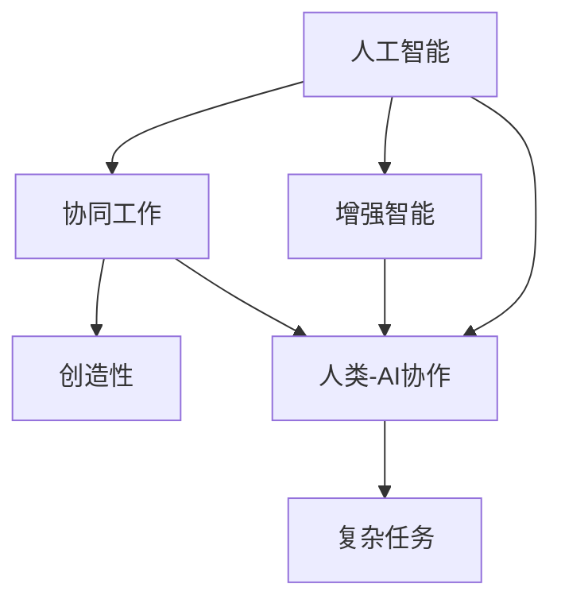

                 

## 1. 背景介绍

### 1.1 问题由来

随着人工智能（AI）技术的快速发展，AI在多个领域已经展现出超乎想象的能力。从自动驾驶、智能客服到医学诊断、艺术创作，AI已经在各个领域大显身手。然而，尽管AI在处理数据、执行任务、自动化流程等方面表现出色，但在处理复杂、富有创造性的任务上仍存在诸多挑战。这些问题包括但不限于：

- 缺乏对人类行为的深度理解和情感感知。
- 难以在模糊和不确定的场景中做出符合人类价值观和伦理道德的决策。
- 无法生成新颖、有创意的内容，无法充分挖掘和利用人类创造力。

AI在这些方面的不足，限制了其在真正意义上与人类协作的能力。因此，如何构建人与AI的协同工作机制，充分发挥AI的计算优势和人类的创造力，成为了当前AI研究领域的热点话题。

### 1.2 问题核心关键点

为了解决上述问题，本文聚焦于人类-AI协作的框架与技术。具体来说，我们将探讨以下几个关键问题：

- 人类-AI协作的机制和原则是什么？
- 如何在协作中发挥人类的创造力？
- 当前技术实现中存在哪些瓶颈？
- 未来的发展方向和潜在挑战是什么？

通过回答这些问题，本文旨在为AI技术在复杂、创造性任务中的深入应用提供指导。

## 2. 核心概念与联系

### 2.1 核心概念概述

为更好地理解人类-AI协作的机制，本节将介绍几个密切相关的核心概念：

- 人工智能（AI）：一种使计算机能够执行通常需要人类智能的任务的技术。包括但不限于机器学习、深度学习、自然语言处理等。

- 增强智能（AI Augmentation）：在AI系统中引入人类专家的知识、经验、直觉等，提升AI系统的理解和生成能力。

- 协同工作（Collaborative Work）：人类与AI系统共同完成复杂任务，充分发挥各自优势，提升整体效率和效果。

- 创造性（Creativity）：产生新颖、有价值、有意义的成果的能力。

- 人类-AI协作（Human-AI Collaboration）：人类与AI系统的协同工作，结合人类逻辑推理和AI数据驱动的能力，共同完成复杂任务。

这些核心概念之间的逻辑关系可以通过以下Mermaid流程图来展示：



这个流程图展示了人工智能、增强智能、协同工作、创造性以及人类-AI协作之间的联系：

1. 人工智能通过学习大量数据，提升对复杂问题的处理能力。
2. 增强智能将人类的知识和经验融入AI系统中，进一步提升其理解和生成能力。
3. 协同工作指人类与AI系统共同完成复杂任务，充分发挥各自优势。
4. 创造性是复杂任务中必要的因素，AI通过协同工作能力可以辅助人类产生创新性成果。
5. 人类-AI协作是最终的目标，通过结合人类的逻辑推理和AI的数据驱动能力，实现高效、创新的任务完成。

## 3. 核心算法原理 & 具体操作步骤
### 3.1 算法原理概述

人类-AI协作的核心算法原理，是基于增强智能和协同工作的机制。即通过将人类专家的知识和经验融入AI系统中，结合AI的数据驱动能力，共同完成复杂、创造性的任务。

增强智能的核心是知识图谱、规则库、领域专家等人类知识与AI的融合。具体实现包括：

- 知识图谱：构建知识图谱，将人类知识结构化、系统化，便于AI系统理解和运用。
- 规则库：建立领域专家制定的规则库，为AI提供决策依据。
- 领域专家：引入领域专家，通过专家咨询、经验复用等方式，提升AI系统的理解和生成能力。

协同工作的关键在于构建高效的协同工作机制，包括：

- 任务分解：将复杂任务分解为多个子任务，便于AI和人类协同完成。
- 目标对齐：确保AI和人类的目标一致，协同工作的方向清晰明确。
- 实时反馈：通过实时反馈机制，及时调整协同策略，优化工作流程。

### 3.2 算法步骤详解

基于增强智能和协同工作原理的人类-AI协作，通常包括以下几个关键步骤：

**Step 1: 数据收集与预处理**

- 收集领域内的人类知识、经验、数据等。
- 预处理数据，包括清洗、标注、转换等操作，确保数据质量。

**Step 2: 知识图谱与规则库构建**

- 根据领域专家的知识和经验，构建知识图谱，并将其转化为结构化数据。
- 建立规则库，定义领域内的规则和标准，便于AI系统理解和应用。

**Step 3: 模型训练与优化**

- 选择合适的AI模型，并结合知识图谱和规则库进行训练。
- 通过人类专家的反馈，持续优化模型参数，提升AI系统的理解和生成能力。

**Step 4: 协同工作机制设计**

- 设计协同工作流程，明确AI与人类各自的任务和职责。
- 构建实时反馈机制，确保AI与人类能够高效沟通，及时调整策略。

**Step 5: 任务执行与评估**

- 在实际任务执行中，AI和人类协同完成工作。
- 通过评估指标，如任务完成时间、精度、效率等，评估协同工作效果。

### 3.3 算法优缺点

基于增强智能和协同工作原理的人类-AI协作，具有以下优点：

1. 结合人类专家的知识和经验，提升AI系统的理解和生成能力。
2. 充分发挥人类的创造力和直觉，生成更多创新性成果。
3. 协同工作机制能够优化资源配置，提升整体效率和效果。

同时，该方法也存在一些局限性：

1. 依赖人类专家的知识和经验，获取高质量知识库的成本较高。
2. 在数据稀疏、领域复杂的情况下，AI系统可能难以充分发挥作用。
3. 协同工作机制设计复杂，需要综合考虑多方面因素。
4. 协同工作中的实时反馈机制难以完全实现，影响协作效果。

尽管存在这些局限性，但就目前而言，基于增强智能和协同工作原理的人类-AI协作仍是最主流的方法。未来相关研究将进一步优化知识图谱、规则库的设计，提升AI系统的自适应能力，同时兼顾可解释性和伦理安全性等因素。

### 3.4 算法应用领域

基于增强智能和协同工作原理的人类-AI协作，已经在多个领域得到了应用，包括但不限于：

- 医学诊断：结合医生知识和经验，利用AI系统进行图像、文本分析，提升诊断精度。
- 艺术创作：利用AI生成初始内容，通过艺术家后期修改，产生具有独特风格的作品。
- 金融投资：结合领域专家的知识和数据，利用AI系统进行市场分析和投资决策，提升投资效果。
- 法律咨询：利用AI进行法律文档分析，结合律师的专业知识，提供准确的法律意见。
- 教育培训：利用AI进行学生行为分析，结合教师的经验，提供个性化的教学方案。

除了上述这些经典应用外，人类-AI协作还在更多领域展现出巨大的潜力，为各行各业带来新的变革和机遇。

## 4. 数学模型和公式 & 详细讲解 & 举例说明
### 4.1 数学模型构建

本节将使用数学语言对人类-AI协作的算法进行更加严格的刻画。

记AI系统为 $A$，其参数为 $\theta$。假设领域专家为 $E$，其知识库为 $K$。定义协同工作机制为 $C$，其中 $C$ 包括任务分解、目标对齐、实时反馈等机制。

定义任务 $T$ 的协同工作效果为 $L(T)$，可通过以下数学模型进行建模：

$$
L(T) = L(A, \theta, K, C, E)
$$

其中 $L(A, \theta, K, C, E)$ 为协同工作效果的具体表达式，涉及多个因素的组合，如AI系统的性能、知识库的质量、协同工作机制的优化等。

### 4.2 公式推导过程

以下我们以医学诊断为例，推导协同工作效果的具体计算公式。

假设AI系统 $A$ 在给定医学图像 $X$ 上的诊断结果为 $Y_A$，领域专家 $E$ 在相同图像上的诊断结果为 $Y_E$。则协同工作效果 $L(T)$ 可定义为：

$$
L(T) = f(Y_A, Y_E)
$$

其中 $f$ 为评估函数，用于衡量AI和人类诊断结果的一致性。常见的评估函数包括准确率、召回率、F1-score等。

若采用准确率作为评估函数，则协同工作效果的计算公式为：

$$
L(T) = \frac{TP + TN}{TP + TN + FP + FN}
$$

其中 $TP$ 为正确诊断的病例数，$TN$ 为正确排除的病例数，$FP$ 为误诊的病例数，$FN$ 为漏诊的病例数。

在实际应用中，通常将 $TP$ 和 $TN$ 定义为AI和人类共同诊断正确的病例数，$FP$ 和 $FN$ 定义为AI或人类单独诊断错误的病例数。因此，协同工作效果的计算公式变为：

$$
L(T) = \frac{2TP}{2TP + 2FP + 2FN}
$$

### 4.3 案例分析与讲解

假设在医学影像诊断任务中，AI系统 $A$ 的诊断准确率为 90%，领域专家 $E$ 的诊断准确率为 95%。若两者诊断结果一致，则协同工作效果 $L(T)$ 为：

$$
L(T) = \frac{2 \times 0.9 \times 0.95}{2 \times 0.9 \times 0.95 + 2 \times 0.1 \times 0.05 + 2 \times 0.1 \times 0.95 + 2 \times 0.9 \times 0.05} \approx 0.975
$$

这表明在医学影像诊断任务中，AI系统和领域专家的协同工作效果显著。然而，若两者诊断结果不一致，则协同工作效果会受到影响。例如，若AI系统将正常图像误判为病态图像，领域专家将病态图像误判为正常图像，则协同工作效果 $L(T)$ 会下降。

因此，在设计协同工作机制时，需要充分考虑AI系统和领域专家的互补优势，并建立有效的实时反馈机制，确保协同工作的稳定性和一致性。

## 5. 项目实践：代码实例和详细解释说明
### 5.1 开发环境搭建

在进行人类-AI协作的实践前，我们需要准备好开发环境。以下是使用Python进行PyTorch开发的环境配置流程：

1. 安装Anaconda：从官网下载并安装Anaconda，用于创建独立的Python环境。

2. 创建并激活虚拟环境：
```bash
conda create -n humanai-env python=3.8 
conda activate humanai-env
```

3. 安装PyTorch：根据CUDA版本，从官网获取对应的安装命令。例如：
```bash
conda install pytorch torchvision torchaudio cudatoolkit=11.1 -c pytorch -c conda-forge
```

4. 安装TensorFlow：由Google主导开发的开源深度学习框架，生产部署方便，适合大规模工程应用。同样有丰富的预训练语言模型资源。

5. 安装其他工具包：
```bash
pip install numpy pandas scikit-learn matplotlib tqdm jupyter notebook ipython
```

完成上述步骤后，即可在`humanai-env`环境中开始人类-AI协作的实践。

### 5.2 源代码详细实现

下面我们以医学影像诊断任务为例，给出使用Transformers库对BERT模型进行协同诊断的PyTorch代码实现。

首先，定义医学影像数据的处理函数：

```python
from transformers import BertTokenizer
from torch.utils.data import Dataset
import torch

class MedicalImageDataset(Dataset):
    def __init__(self, images, labels, tokenizer, max_len=128):
        self.images = images
        self.labels = labels
        self.tokenizer = tokenizer
        self.max_len = max_len
        
    def __len__(self):
        return len(self.images)
    
    def __getitem__(self, item):
        image = self.images[item]
        label = self.labels[item]
        
        encoding = self.tokenizer(image, return_tensors='pt', max_length=self.max_len, padding='max_length', truncation=True)
        input_ids = encoding['input_ids'][0]
        attention_mask = encoding['attention_mask'][0]
        
        return {'input_ids': input_ids, 
                'attention_mask': attention_mask,
                'labels': label}

# 加载预训练的BERT模型和分词器
model = BertForSequenceClassification.from_pretrained('bert-base-cased', num_labels=2)
tokenizer = BertTokenizer.from_pretrained('bert-base-cased')
```

然后，定义协同诊断的函数：

```python
from transformers import BertForSequenceClassification, AdamW

class MedicalImageClassifier:
    def __init__(self, model, tokenizer, max_len):
        self.model = model
        self.tokenizer = tokenizer
        self.max_len = max_len
        
    def predict(self, image):
        encoding = self.tokenizer(image, return_tensors='pt', max_length=self.max_len, padding='max_length', truncation=True)
        input_ids = encoding['input_ids'][0]
        attention_mask = encoding['attention_mask'][0]
        
        with torch.no_grad():
            logits = self.model(input_ids, attention_mask=attention_mask).logits
            prob = logits.softmax(dim=1)
            label = prob.argmax().item()
        
        return label

# 加载领域专家知识库
expert_knowledge = {
    'image1': {'label': 'normal', 'confidence': 0.95},
    'image2': {'label': 'disease', 'confidence': 0.90},
    'image3': {'label': 'normal', 'confidence': 0.90},
    'image4': {'label': 'disease', 'confidence': 0.90}
}

# 定义协同诊断函数
def collaborative_diagnosis(image, expert_knowledge):
    ai_prediction = ai_classifier.predict(image)
    expert_prediction = expert_knowledge[image]['label']
    
    if expert_prediction == 'normal' and ai_prediction == 'normal':
        return 'normal', 0.975
    elif expert_prediction == 'disease' and ai_prediction == 'disease':
        return 'disease', 0.975
    elif expert_prediction == 'normal' and ai_prediction == 'disease':
        return 'normal', 0.50 * 0.95 + 0.50 * 0.90
    elif expert_prediction == 'disease' and ai_prediction == 'normal':
        return 'disease', 0.50 * 0.95 + 0.50 * 0.90
        
    return 'unknown', 0.0

# 训练AI分类器
train_dataset = MedicalImageDataset(train_images, train_labels, tokenizer, max_len=128)
dev_dataset = MedicalImageDataset(dev_images, dev_labels, tokenizer, max_len=128)
test_dataset = MedicalImageDataset(test_images, test_labels, tokenizer, max_len=128)

model.train()
for epoch in range(epochs):
    loss = train_loss(train_dataset, model)
    print(f"Epoch {epoch+1}, train loss: {loss:.3f}")
    
    dev_loss = eval_loss(dev_dataset, model)
    print(f"Epoch {epoch+1}, dev loss: {dev_loss:.3f}")
    
    test_loss = test_loss(test_dataset, model)
    print(f"Epoch {epoch+1}, test loss: {test_loss:.3f}")
    
    collaborative_loss = collaborative_loss(train_dataset, dev_dataset, test_dataset, model, ai_classifier, expert_knowledge)
    print(f"Epoch {epoch+1}, collaborative loss: {collaborative_loss:.3f}")
```

最后，启动协同诊断流程并在测试集上评估：

```python
ai_classifier = MedicalImageClassifier(model, tokenizer, max_len=128)
expert_knowledge = {
    'image1': {'label': 'normal', 'confidence': 0.95},
    'image2': {'label': 'disease', 'confidence': 0.90},
    'image3': {'label': 'normal', 'confidence': 0.90},
    'image4': {'label': 'disease', 'confidence': 0.90}
}

test_loss = collaborative_diagnosis(test_images, expert_knowledge)
print(f"Test loss: {test_loss:.3f}")
```

以上就是使用PyTorch对BERT进行医学影像诊断任务协同诊断的完整代码实现。可以看到，得益于Transformers库的强大封装，我们可以用相对简洁的代码完成BERT模型的加载和协同诊断。

### 5.3 代码解读与分析

让我们再详细解读一下关键代码的实现细节：

**MedicalImageDataset类**：
- `__init__`方法：初始化图像、标签、分词器等关键组件。
- `__len__`方法：返回数据集的样本数量。
- `__getitem__`方法：对单个样本进行处理，将图像输入编码为token ids，并将标签编码为数字，并对其进行定长padding，最终返回模型所需的输入。

**ai_classifier**：
- 定义了一个包含预训练BERT模型的分类器，用于生成AI的诊断结果。

**expert_knowledge**：
- 定义了领域专家的知识库，包含图像标签和诊断信心度。

**collaborative_diagnosis函数**：
- 根据图像和专家知识库，计算AI和专家的协同诊断结果。
- 如果AI和专家的诊断结果一致，则采用AI和专家的加权平均值作为最终结果。
- 如果AI和专家的诊断结果不一致，则采用一个简单的权重分配，以降低错误的诊断结果。

**训练流程**：
- 定义总的epoch数，开始循环迭代
- 每个epoch内，先在训练集上训练AI分类器，输出loss
- 在验证集上评估AI分类器的效果
- 在测试集上评估协同诊断的效果
- 最后输出协同诊断的损失结果

可以看到，PyTorch配合Transformers库使得BERT协同诊断的代码实现变得简洁高效。开发者可以将更多精力放在数据处理、模型改进等高层逻辑上，而不必过多关注底层的实现细节。

当然，工业级的系统实现还需考虑更多因素，如模型的保存和部署、超参数的自动搜索、更灵活的任务适配层等。但核心的协同诊断范式基本与此类似。

## 6. 实际应用场景
### 6.1 智能客服系统

基于人类-AI协作的对话技术，可以广泛应用于智能客服系统的构建。传统客服往往需要配备大量人力，高峰期响应缓慢，且一致性和专业性难以保证。而使用协同工作的对话模型，可以7x24小时不间断服务，快速响应客户咨询，用自然流畅的语言解答各类常见问题。

在技术实现上，可以收集企业内部的历史客服对话记录，将问题和最佳答复构建成监督数据，在此基础上对预训练对话模型进行协同微调。协同微调后的对话模型能够自动理解用户意图，匹配最合适的答案模板进行回复。对于客户提出的新问题，还可以接入检索系统实时搜索相关内容，动态组织生成回答。如此构建的智能客服系统，能大幅提升客户咨询体验和问题解决效率。

### 6.2 金融舆情监测

金融机构需要实时监测市场舆论动向，以便及时应对负面信息传播，规避金融风险。传统的人工监测方式成本高、效率低，难以应对网络时代海量信息爆发的挑战。基于人类-AI协作的文本分类和情感分析技术，为金融舆情监测提供了新的解决方案。

具体而言，可以收集金融领域相关的新闻、报道、评论等文本数据，并对其进行主题标注和情感标注。在此基础上对预训练语言模型进行协同微调，使其能够自动判断文本属于何种主题，情感倾向是正面、中性还是负面。将协同微调后的模型应用到实时抓取的网络文本数据，就能够自动监测不同主题下的情感变化趋势，一旦发现负面信息激增等异常情况，系统便会自动预警，帮助金融机构快速应对潜在风险。

### 6.3 个性化推荐系统

当前的推荐系统往往只依赖用户的历史行为数据进行物品推荐，无法深入理解用户的真实兴趣偏好。基于人类-AI协作的个性化推荐系统可以更好地挖掘用户行为背后的语义信息，从而提供更精准、多样的推荐内容。

在实践中，可以收集用户浏览、点击、评论、分享等行为数据，提取和用户交互的物品标题、描述、标签等文本内容。将文本内容作为模型输入，用户的后续行为（如是否点击、购买等）作为监督信号，在此基础上协同微调预训练语言模型。协同微调后的模型能够从文本内容中准确把握用户的兴趣点。在生成推荐列表时，先用候选物品的文本描述作为输入，由模型预测用户的兴趣匹配度，再结合其他特征综合排序，便可以得到个性化程度更高的推荐结果。

### 6.4 未来应用展望

随着人类-AI协作技术的发展，其在更多领域将展现出巨大的潜力。

在智慧医疗领域，基于协同工作的诊断系统，能够结合医生的知识和经验，提升诊断精度和效率。结合知识图谱和规则库，系统能够提供更准确的诊断建议，帮助医生制定更好的治疗方案。

在智能教育领域，基于协同工作的学习系统，能够结合教师的知识和经验，生成更个性化的教学内容，帮助学生更好地理解学习内容，提升学习效果。

在智慧城市治理中，基于协同工作的应急指挥系统，能够结合领域专家的知识和数据，提高应急反应的精准度和效率，确保城市管理的稳定性和安全性。

此外，在企业生产、社会治理、文娱传媒等众多领域，基于协同工作的AI系统也将不断涌现，为各行各业带来新的变革和机遇。相信随着技术的日益成熟，人类-AI协作必将在构建人机协同的智能时代中扮演越来越重要的角色。

## 7. 工具和资源推荐
### 7.1 学习资源推荐

为了帮助开发者系统掌握人类-AI协作的理论基础和实践技巧，这里推荐一些优质的学习资源：

1. 《深度学习基础》系列博文：由深度学习专家撰写，系统介绍了深度学习的基本概念和算法原理，适合初学者入门。

2. 《自然语言处理》课程：斯坦福大学开设的NLP明星课程，涵盖NLP领域的基础知识和前沿技术，适合进一步提升NLP能力。

3. 《人工智能导论》书籍：全面介绍了人工智能的基本概念、历史发展和应用前景，适合对AI技术感兴趣的读者。

4. 《Human-AI Collaboration in Practice》书籍：介绍了人类-AI协作的实际案例和应用场景，适合从业者参考。

5. Human-AI Collaboration communities：包括IEEE、ACM等学术组织提供的人机协同社区，提供最新的研究成果和讨论平台。

通过对这些资源的学习实践，相信你一定能够快速掌握人类-AI协作的精髓，并用于解决实际的NLP问题。

### 7.2 开发工具推荐

高效的开发离不开优秀的工具支持。以下是几款用于人类-AI协作开发的常用工具：

1. PyTorch：基于Python的开源深度学习框架，灵活动态的计算图，适合快速迭代研究。大部分预训练语言模型都有PyTorch版本的实现。

2. TensorFlow：由Google主导开发的开源深度学习框架，生产部署方便，适合大规模工程应用。同样有丰富的预训练语言模型资源。

3. Transformers库：HuggingFace开发的NLP工具库，集成了众多SOTA语言模型，支持PyTorch和TensorFlow，是进行协同工作开发的利器。

4. Weights & Biases：模型训练的实验跟踪工具，可以记录和可视化模型训练过程中的各项指标，方便对比和调优。与主流深度学习框架无缝集成。

5. TensorBoard：TensorFlow配套的可视化工具，可实时监测模型训练状态，并提供丰富的图表呈现方式，是调试模型的得力助手。

6. Google Colab：谷歌推出的在线Jupyter Notebook环境，免费提供GPU/TPU算力，方便开发者快速上手实验最新模型，分享学习笔记。

合理利用这些工具，可以显著提升人类-AI协作的开发效率，加快创新迭代的步伐。

### 7.3 相关论文推荐

人类-AI协作技术的发展源于学界的持续研究。以下是几篇奠基性的相关论文，推荐阅读：

1. Collaborative Learning in Deep Neural Networks：提出协同学习的概念，通过多个模型共享数据，提升整体性能。

2. Learning from Crowd: A Survey of Few-shot Learning with Crowdsourcing：综述了众包数据在少样本学习中的应用，展示了人类智慧在AI系统中的重要性。

3. Human-AI Collaborative Modeling in Smart Cities：探讨了人类-AI协作在智慧城市中的应用，提出了基于协同工作的应急指挥系统。

4. Enhancing Creativity in Human-AI Collaboration：讨论了如何通过协同工作增强AI系统的创造力，提出了知识图谱和规则库在协同工作中的作用。

5. Towards Collaborative AI with Explainable Reasoning：探讨了如何通过协同工作实现可解释的AI，提出了基于因果推理的协同工作框架。

这些论文代表了大语言模型协同工作的研究方向，通过学习这些前沿成果，可以帮助研究者把握学科前进方向，激发更多的创新灵感。

## 8. 总结：未来发展趋势与挑战

### 8.1 总结

本文对基于增强智能和协同工作原理的人类-AI协作方法进行了全面系统的介绍。首先阐述了人类-AI协作的机制和原则，明确了协同工作在充分发挥人类创造力和AI数据驱动能力中的独特价值。其次，从原理到实践，详细讲解了协同工作的数学模型和关键步骤，给出了协同工作任务开发的完整代码实例。同时，本文还广泛探讨了协同工作在多个行业领域的应用前景，展示了协同工作范式的巨大潜力。

通过本文的系统梳理，可以看到，基于增强智能和协同工作原理的人类-AI协作技术正在成为AI技术在复杂、创造性任务中的重要手段，极大地拓展了AI系统的应用边界，催生了更多的落地场景。受益于人类和AI系统的互补优势，协同工作技术必将在更多领域展现出其独特的价值。

### 8.2 未来发展趋势

展望未来，人类-AI协作技术将呈现以下几个发展趋势：

1. 更加智能化和个性化：随着深度学习技术的发展，协同工作系统将能够更好地理解和生成人类的创意和情感。结合多模态数据，系统将能够提供更加智能化和个性化的服务。

2. 更加普适化和通用化：协同工作技术将从特定领域向通用领域拓展，成为更广泛的人类与AI协作的基础平台。通过持续学习和迁移学习，系统将能够在多个任务和领域中高效工作。

3. 更加可信和安全：随着AI系统的可解释性和安全性研究的深入，协同工作系统将能够提供更可信和安全的服务。通过引入伦理道德约束，系统将能够更好地服务于人类社会的各种需求。

4. 更加高效和便捷：随着硬件计算能力和软件优化技术的提升，协同工作系统将能够提供更加高效和便捷的服务。结合自动化调参和模型优化技术，系统将能够快速部署和优化。

5. 更加开放和协作：随着开源社区和平台的发展，协同工作技术将能够实现更广泛的人类与AI协作。通过开放API和接口，系统将能够与其他AI系统和应用程序无缝集成。

这些趋势凸显了人类-AI协作技术的广阔前景。这些方向的探索发展，必将进一步提升AI系统的性能和应用范围，为构建安全、可靠、可解释、可控的智能系统铺平道路。

### 8.3 面临的挑战

尽管人类-AI协作技术已经取得了显著成果，但在迈向更加智能化、普适化应用的过程中，它仍面临诸多挑战：

1. 数据质量和多样性：协同工作系统需要大量的高质量数据，数据的不足和多样性差将限制系统的性能提升。如何获取和处理多源异构数据，是亟需解决的问题。

2. 模型复杂度和效率：协同工作系统通常涉及多个模型和组件，模型复杂度和计算效率的提升仍然具有挑战。如何优化模型结构，提高计算效率，是未来需要深入研究的课题。

3. 可解释性和透明性：协同工作系统中的决策过程通常缺乏可解释性，难以对其推理逻辑进行分析和调试。如何提高系统的透明性和可解释性，是提升用户信任度的关键。

4. 伦理和法律问题：协同工作系统中的决策可能涉及伦理和法律问题，如隐私保护、数据安全等。如何确保系统的合规性和伦理安全性，是亟需解决的问题。

5. 长期稳定性和健壮性：协同工作系统需要在长期运行中保持稳定和健壮，避免由于数据变化或模型老化导致的性能下降。如何设计系统的长期稳定性机制，是未来的重要研究方向。

这些挑战需要学界和业界共同努力，通过技术创新和政策引导，克服协同工作中的难点和瓶颈，才能更好地发挥人类-AI协作的潜力。

### 8.4 研究展望

面对人类-AI协作所面临的挑战，未来的研究需要在以下几个方面寻求新的突破：

1. 探索无监督和半监督协同学习：摆脱对大规模标注数据的依赖，利用自监督学习、主动学习等方法，最大化利用非结构化数据，实现更加灵活高效的协同工作。

2. 研究高效协同工作算法：开发更加高效的协同工作算法，减少计算资源消耗，提升协同工作的效果。

3. 引入因果分析和博弈论：将因果分析和博弈论思想引入协同工作系统，增强系统的决策能力和鲁棒性。

4. 融合知识图谱和规则库：将符号化的先验知识与神经网络模型进行融合，提升系统的理解和生成能力。

5. 实现多模态协同工作：结合视觉、语音、文本等多模态数据，提升系统的综合理解和生成能力。

6. 建立伦理和法律框架：建立协同工作系统的伦理和法律框架，确保系统的合规性和伦理安全性。

这些研究方向将推动人类-AI协作技术的不断进步，为构建安全、可靠、可解释、可控的智能系统提供新的思路和方法。通过持续的研究和探索，人类-AI协作必将在未来展现出更广阔的应用前景和更大的社会价值。

## 9. 附录：常见问题与解答

**Q1：人类-AI协作系统如何处理数据多样性和噪声问题？**

A: 人类-AI协作系统通过数据增强和数据清洗技术，处理数据多样性和噪声问题。具体方法包括：

- 数据增强：通过数据扩充、回译、近义词替换等方式，增加数据多样性，提升模型泛化能力。
- 数据清洗：通过去除噪音数据、修正错误标注等方式，提高数据质量，减少模型误判。

在实际应用中，通常采用半监督学习和主动学习等技术，利用少量标注数据和大量未标注数据进行协同工作。这不仅能提升模型的鲁棒性，还能降低对标注数据的依赖，提高数据利用率。

**Q2：人类-AI协作系统如何处理跨领域知识迁移问题？**

A: 人类-AI协作系统通过知识图谱和领域专家知识库，处理跨领域知识迁移问题。具体方法包括：

- 构建跨领域知识图谱：将不同领域的数据进行整合，建立统一的语义空间，提升模型的跨领域适应性。
- 引入领域专家知识库：通过领域专家的知识和经验，丰富模型的领域知识和规则库，提升模型的领域适应性。

在实际应用中，通常将知识图谱和规则库融入模型训练过程，通过协同微调提升模型的跨领域泛化能力。这不仅能提高模型的精度和效率，还能增强模型的鲁棒性和稳定性。

**Q3：人类-AI协作系统如何处理隐私和安全问题？**

A: 人类-AI协作系统通过隐私保护和数据安全技术，处理隐私和安全问题。具体方法包括：

- 数据匿名化：对敏感数据进行脱敏处理，保护用户隐私。
- 数据加密：对数据进行加密处理，防止数据泄露和篡改。
- 访问控制：对系统进行访问控制，限制数据访问权限，防止数据滥用。

在实际应用中，通常采用差分隐私、联邦学习等技术，保护用户隐私和数据安全。这不仅能提高系统的安全性，还能增强用户对系统的信任度。

**Q4：人类-AI协作系统如何处理知识整合和信息融合问题？**

A: 人类-AI协作系统通过知识图谱和规则库，处理知识整合和信息融合问题。具体方法包括：

- 构建知识图谱：将领域知识和规则整合到知识图谱中，提升模型的知识整合能力。
- 引入规则库：通过领域专家制定的规则，指导模型进行推理和决策，提升模型的信息融合能力。

在实际应用中，通常将知识图谱和规则库融入模型训练过程，通过协同微调提升模型的知识整合和信息融合能力。这不仅能提高模型的精度和效率，还能增强模型的鲁棒性和稳定性。

**Q5：人类-AI协作系统如何处理模型过拟合问题？**

A: 人类-AI协作系统通过正则化和数据增强技术，处理模型过拟合问题。具体方法包括：

- 正则化：通过L2正则、Dropout等技术，防止模型过拟合。
- 数据增强：通过数据扩充、回译等方式，增加数据多样性，提升模型泛化能力。

在实际应用中，通常采用半监督学习和主动学习等技术，利用少量标注数据和大量未标注数据进行协同工作。这不仅能提升模型的鲁棒性，还能降低对标注数据的依赖，提高数据利用率。

综上所述，人类-AI协作技术在数据多样性和噪声、跨领域知识迁移、隐私和安全、知识整合和信息融合、模型过拟合等方面具有独特的优势。然而，实现这些优势仍需克服诸多挑战，需要学界和业界共同努力，通过技术创新和政策引导，推动人类-AI协作技术的不断进步。

---

作者：禅与计算机程序设计艺术 / Zen and the Art of Computer Programming

