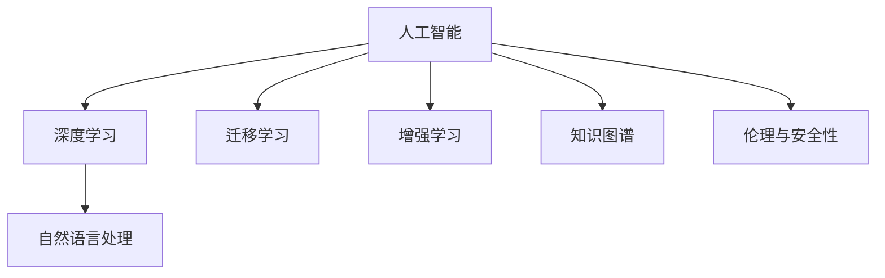

                 

## 1. 背景介绍

### 1.1 问题由来
随着人工智能技术的飞速发展，尤其是深度学习在计算机视觉、自然语言处理、语音识别等领域的突破性应用，我们正在迈向一个全新的时代——AI 时代。在这个时代，机器不仅能够自主学习、自主决策，还具备了远超人类智慧的能力。然而，尽管 AI 在技术和应用上取得了显著进展，它仍未能完全掌握人类智慧的奥秘。

### 1.2 问题核心关键点
人类智慧的核心在于对复杂现象的深度理解和推理。这不仅需要庞大的知识库、精确的逻辑推理能力，还需要高水平的创造力和情感智能。虽然 AI 在单一任务上可以表现出人类水平甚至超越人类的性能，但在整体理解和创造力方面仍存在巨大的差距。因此，如何通过 AI 技术挖掘和模仿人类智慧，成为当前研究的前沿问题。

## 2. 核心概念与联系

### 2.1 核心概念概述

为更好地理解 AI 时代的新力量，本节将介绍几个密切相关的核心概念：

- **人工智能**（Artificial Intelligence, AI）：指利用计算机和算法实现模拟人类智能的科学，包括机器学习、深度学习、自然语言处理、计算机视觉等领域。
- **深度学习**（Deep Learning, DL）：指通过多层神经网络模型，模拟人类神经元的工作机制，实现对数据的高效处理和复杂特征的自动提取。
- **自然语言处理**（Natural Language Processing, NLP）：指使计算机能够理解、处理和生成自然语言的技术，包括文本分类、情感分析、机器翻译、对话系统等。
- **迁移学习**（Transfer Learning）：指利用预训练模型在不同任务间的知识迁移，减少新任务训练所需的数据和计算资源。
- **增强学习**（Reinforcement Learning, RL）：指通过与环境的交互，使智能体在不断试错中学习最优策略，广泛应用于游戏、机器人控制等。
- **知识图谱**（Knowledge Graph）：指通过语义网络表示的实体和关系，帮助机器理解和推理复杂世界中的知识和逻辑。
- **伦理与安全性**：随着 AI 技术在实际应用中的普及，伦理与安全性问题变得尤为关键，如何确保 AI 系统的公正、透明、可控，成为研究热点。

这些核心概念之间的逻辑关系可以通过以下 Mermaid 流程图来展示：



这个流程图展示了许多核心概念及其之间的关系：

1. 人工智能是深度学习和自然语言处理等技术的总称。
2. 迁移学习和增强学习分别通过不同的学习方式，帮助 AI 系统更好地应用知识和解决问题。
3. 知识图谱为 AI 系统提供了结构化的知识和逻辑推理基础。
4. 伦理与安全性是 AI 系统可靠性和可信度的保障。

这些概念共同构成了 AI 时代的新力量，为实现智能系统的全面智能化奠定了基础。

## 3. 核心算法原理 & 具体操作步骤
### 3.1 算法原理概述

AI 时代的新力量，本质上是通过深度学习等技术，实现对复杂数据的深度理解和自主决策。其核心思想是：通过大规模数据训练神经网络，使模型自动学习并提取数据中的复杂特征，从而实现对新数据的高效处理和预测。

形式化地，假设给定一个数据集 $D=\{(x_i,y_i)\}_{i=1}^N$，其中 $x_i$ 为输入特征，$y_i$ 为标签。模型的目标是通过学习输入和标签之间的关系，构建一个映射函数 $f$，使得 $f(x_i) \approx y_i$。

常见的方法包括：

- **监督学习**：通过带有标签的数据集 $D$ 训练模型 $f$，使得模型能够预测新的未标签数据。
- **无监督学习**：利用未标记的数据集 $D$，通过自组织学习或聚类等方法，发现数据中的潜在结构和模式。
- **强化学习**：通过与环境的交互，通过奖励和惩罚机制，使模型在不断的试错中学习最优策略。

### 3.2 算法步骤详解

以监督学习为例，AI 时代的新力量主要包括以下几个关键步骤：

**Step 1: 准备数据集**
- 收集和整理大规模数据集 $D$，确保数据的多样性和质量。
- 将数据集划分为训练集、验证集和测试集，保证模型评估的公正性。

**Step 2: 选择模型和优化器**
- 根据任务特点选择合适的神经网络模型（如卷积神经网络、循环神经网络、Transformer 等）。
- 选择优化器（如 SGD、Adam、RMSprop 等）及其超参数，如学习率、批大小、迭代次数等。

**Step 3: 训练模型**
- 使用训练集 $D_{train}$ 对模型进行前向传播和反向传播，更新模型参数。
- 在验证集 $D_{valid}$ 上评估模型性能，避免过拟合。
- 调整超参数，如学习率、批大小、正则化参数等，优化模型效果。

**Step 4: 模型评估与部署**
- 在测试集 $D_{test}$ 上评估模型性能，对比不同模型的效果。
- 将训练好的模型部署到实际应用中，进行大规模的推理和决策。
- 持续收集新数据，定期重新训练和优化模型。

### 3.3 算法优缺点

AI 时代的新力量具有以下优点：

- **高效性**：通过深度学习等技术，AI 系统能够在短时间内处理大量数据，实现高效的数据分析和学习。
- **可扩展性**：AI 系统可以通过增加数据量和计算资源，进一步提升性能和能力。
- **灵活性**：AI 系统能够适应多种任务和应用场景，具有较强的通用性和泛化能力。
- **自动化**：AI 系统能够自主学习、自主决策，减少人为干预，提升工作效率。

同时，该方法也存在一定的局限性：

- **数据依赖性**：AI 系统依赖高质量、大规模的数据进行训练，数据的质量和数量直接影响模型效果。
- **模型复杂性**：深度学习模型复杂，训练和推理需要大量的计算资源和时间，对硬件要求较高。
- **可解释性不足**：AI 系统的决策过程往往缺乏可解释性，难以理解其内部工作机制。
- **伦理与安全风险**：AI 系统在决策过程中可能存在偏见、有害信息等，需要严格控制和监管。

尽管存在这些局限性，但就目前而言，基于深度学习的 AI 系统已成为实现人类智慧的重要手段，为人类生产生活带来了革命性的变化。未来相关研究的重点在于如何进一步降低对数据的依赖，提高模型的可解释性和安全性，同时兼顾效率和性能。

### 3.4 算法应用领域

AI 时代的新力量已经在诸多领域得到广泛应用，具体如下：

- **医疗健康**：通过图像识别、自然语言处理等技术，辅助医生诊断、制定治疗方案，提升医疗服务质量。
- **智能交通**：通过计算机视觉、强化学习等技术，实现自动驾驶、智能交通管理，提升交通安全和效率。
- **金融科技**：通过数据分析、预测模型等技术，提供智能投顾、风险控制等服务，提升金融决策的准确性。
- **零售电商**：通过推荐系统、自然语言处理等技术，提升用户购物体验，优化库存管理。
- **教育培训**：通过智能评估、个性化学习等技术，提供个性化教育服务，提升学习效果。
- **智能家居**：通过语音识别、自然语言处理等技术，实现智能家居控制，提升生活质量。

除了上述这些经典应用外，AI 时代的新力量还被创新性地应用到更多场景中，如自动翻译、内容生成、情感分析、多模态融合等，为各行各业带来新的发展机遇。

## 4. 数学模型和公式 & 详细讲解
### 4.1 数学模型构建

形式化地，AI 时代的新力量通常通过以下数学模型进行建模：

假设给定训练集 $D=\{(x_i,y_i)\}_{i=1}^N$，其中 $x_i \in \mathbb{R}^d$ 为输入特征，$y_i \in \mathbb{R}$ 为标签。模型的目标是通过学习输入和标签之间的关系，构建一个映射函数 $f: \mathbb{R}^d \rightarrow \mathbb{R}$。

在监督学习中，我们通常使用如下的损失函数：

$$
\mathcal{L}(f) = \frac{1}{N} \sum_{i=1}^N (y_i - f(x_i))^2
$$

其中 $y_i - f(x_i)$ 为预测误差，$f(x_i)$ 为模型输出。

### 4.2 公式推导过程

以最简单的线性回归为例，推导模型的参数更新公式。

假设模型为 $f(x_i) = w^T x_i + b$，其中 $w \in \mathbb{R}^d$ 为权重向量，$b \in \mathbb{R}$ 为偏置项。

根据损失函数，我们有：

$$
\mathcal{L}(f) = \frac{1}{N} \sum_{i=1}^N (y_i - (w^T x_i + b))^2
$$

对 $w$ 和 $b$ 求导，得到梯度：

$$
\frac{\partial \mathcal{L}(f)}{\partial w} = -\frac{2}{N} \sum_{i=1}^N (y_i - f(x_i)) x_i
$$

$$
\frac{\partial \mathcal{L}(f)}{\partial b} = -\frac{2}{N} \sum_{i=1}^N (y_i - f(x_i))
$$

通过梯度下降等优化算法，更新模型参数：

$$
w \leftarrow w - \eta \frac{\partial \mathcal{L}(f)}{\partial w}
$$

$$
b \leftarrow b - \eta \frac{\partial \mathcal{L}(f)}{\partial b}
$$

其中 $\eta$ 为学习率。

### 4.3 案例分析与讲解

以图像分类为例，分析深度学习模型的参数更新过程。

假设给定训练集 $D=\{(x_i,y_i)\}_{i=1}^N$，其中 $x_i$ 为输入图像，$y_i$ 为标签。

模型的输出为 $f(x_i) = w^T \sigma(z(x_i)) + b$，其中 $z(x_i)$ 为卷积和池化后的特征表示，$\sigma$ 为激活函数，$w$ 和 $b$ 为可训练参数。

损失函数为交叉熵损失：

$$
\mathcal{L}(f) = -\frac{1}{N} \sum_{i=1}^N y_i \log f(x_i) + (1-y_i) \log (1-f(x_i))
$$

对 $w$ 和 $b$ 求导，得到梯度：

$$
\frac{\partial \mathcal{L}(f)}{\partial w} = \frac{1}{N} \sum_{i=1}^N [y_i f(x_i) - (1-y_i) (1-f(x_i))] \sigma'(z(x_i)) z(x_i)
$$

$$
\frac{\partial \mathcal{L}(f)}{\partial b} = \frac{1}{N} \sum_{i=1}^N [y_i f(x_i) - (1-y_i) (1-f(x_i))]
$$

通过梯度下降等优化算法，更新模型参数：

$$
w \leftarrow w - \eta \frac{\partial \mathcal{L}(f)}{\partial w}
$$

$$
b \leftarrow b - \eta \frac{\partial \mathcal{L}(f)}{\partial b}
$$

可以看到，深度学习模型的参数更新过程相对复杂，涉及多个层次的特征提取和融合，但核心思想仍然是基于梯度下降等优化算法，最小化预测误差。

## 5. 项目实践：代码实例和详细解释说明
### 5.1 开发环境搭建

在进行项目实践前，我们需要准备好开发环境。以下是使用Python进行PyTorch开发的环境配置流程：

1. 安装Anaconda：从官网下载并安装Anaconda，用于创建独立的Python环境。

2. 创建并激活虚拟环境：
```bash
conda create -n pytorch-env python=3.8 
conda activate pytorch-env
```

3. 安装PyTorch：根据CUDA版本，从官网获取对应的安装命令。例如：
```bash
conda install pytorch torchvision torchaudio cudatoolkit=11.1 -c pytorch -c conda-forge
```

4. 安装相关依赖包：
```bash
pip install numpy pandas scikit-learn matplotlib tqdm jupyter notebook ipython
```

5. 安装相关库：
```bash
pip install torch torchvision transformers
```

完成上述步骤后，即可在`pytorch-env`环境中开始项目实践。

### 5.2 源代码详细实现

这里我们以图像分类任务为例，使用 PyTorch 实现一个简单的卷积神经网络（CNN）模型。

首先，定义模型类：

```python
import torch
import torch.nn as nn
import torch.nn.functional as F

class Net(nn.Module):
    def __init__(self):
        super(Net, self).__init__()
        self.conv1 = nn.Conv2d(1, 10, kernel_size=5)
        self.conv2 = nn.Conv2d(10, 20, kernel_size=5)
        self.conv2_drop = nn.Dropout2d()
        self.fc1 = nn.Linear(320, 50)
        self.fc2 = nn.Linear(50, 10)
    
    def forward(self, x):
        x = F.relu(self.conv1(x))
        x = F.max_pool2d(x, 2)
        x = F.relu(self.conv2(x))
        x = F.max_pool2d(x, 2)
        x = self.conv2_drop(x)
        x = x.view(-1, 320)
        x = F.relu(self.fc1(x))
        x = F.dropout(x, training=self.training)
        x = self.fc2(x)
        return F.log_softmax(x, dim=1)
```

然后，定义数据加载器和训练函数：

```python
from torch.utils.data import DataLoader
from torchvision import datasets, transforms

train_dataset = datasets.MNIST(root='data', train=True, download=True, transform=transforms.Compose([
    transforms.ToTensor(),
    transforms.Normalize((0.1307,), (0.3081,))
]))

test_dataset = datasets.MNIST(root='data', train=False, download=True, transform=transforms.Compose([
    transforms.ToTensor(),
    transforms.Normalize((0.1307,), (0.3081,))
]))

train_loader = DataLoader(train_dataset, batch_size=64, shuffle=True)
test_loader = DataLoader(test_dataset, batch_size=64, shuffle=False)

def train_model(model, device, optimizer, criterion, num_epochs=10):
    model.train()
    for epoch in range(num_epochs):
        train_loss = 0
        for data, target in train_loader:
            data, target = data.to(device), target.to(device)
            optimizer.zero_grad()
            output = model(data)
            loss = criterion(output, target)
            loss.backward()
            optimizer.step()
            train_loss += loss.item()
        print(f'Epoch {epoch+1} Train Loss: {train_loss/len(train_loader)}')
    return model
```

最后，启动训练流程并在测试集上评估：

```python
import torch.optim as optim
from torchvision import models

device = torch.device('cuda' if torch.cuda.is_available() else 'cpu')

model = models.resnet50(pretrained=True)
model.fc = Net().fc2

optimizer = optim.SGD(model.parameters(), lr=0.01, momentum=0.5)
criterion = nn.NLLLoss()

model = train_model(model, device, optimizer, criterion, num_epochs=10)

with torch.no_grad():
    correct = 0
    total = 0
    for data, target in test_loader:
        data, target = data.to(device), target.to(device)
        output = model(data)
        _, predicted = torch.max(output.data, 1)
        total += target.size(0)
        correct += (predicted == target).sum().item()

print(f'Accuracy on test set: {100 * correct / total}%')
```

以上就是使用 PyTorch 实现图像分类的完整代码实例。通过简单的卷积神经网络，我们可以看到 AI 时代的新力量如何通过深度学习实现高效的特征提取和分类。

### 5.3 代码解读与分析

让我们再详细解读一下关键代码的实现细节：

**Net类**：
- `__init__`方法：初始化卷积层、池化层、全连接层等组件。
- `forward`方法：定义前向传播流程，实现输入特征到输出标签的映射。

**train_model函数**：
- 对训练数据进行批处理，并使用梯度下降更新模型参数。
- 在每个epoch结束时，输出训练损失。
- 返回训练好的模型。

**训练流程**：
- 定义训练次数、批大小等超参数，启动模型训练。
- 在训练集上训练，输出每个epoch的训练损失。
- 在测试集上评估模型性能，输出测试准确率。

可以看到，PyTorch提供了便捷的深度学习框架，使得模型构建和训练变得简单易懂。开发者可以将更多精力放在模型优化和数据处理上，而不必过多关注底层实现细节。

当然，工业级的系统实现还需考虑更多因素，如模型的保存和部署、超参数的自动搜索、更灵活的任务适配层等。但核心的 AI 时代新力量的实现原理基本与此类似。

## 6. 实际应用场景
### 6.1 医疗健康

在医疗健康领域，AI 时代的新力量能够通过图像识别、自然语言处理等技术，辅助医生诊断、制定治疗方案，提升医疗服务质量。

以医学影像分析为例，通过深度学习模型对医学影像进行自动分割、病变识别，可以大大提高医生的诊断效率和准确性。此外，自然语言处理技术可以自动提取和归纳医学文献中的知识点，为医生提供决策支持。

### 6.2 智能交通

在智能交通领域，AI 时代的新力量能够通过计算机视觉、增强学习等技术，实现自动驾驶、智能交通管理，提升交通安全和效率。

自动驾驶技术通过摄像头、雷达等传感器采集环境信息，结合深度学习模型进行路径规划和决策。智能交通管理系统则通过实时监控交通状况，自动调整信号灯和路线，优化交通流量。

### 6.3 金融科技

在金融科技领域，AI 时代的新力量能够通过数据分析、预测模型等技术，提供智能投顾、风险控制等服务，提升金融决策的准确性。

智能投顾通过深度学习模型分析市场数据，生成个性化的投资建议。风险控制系统则通过多维度的数据分析，识别和预测金融风险，提前采取应对措施。

### 6.4 零售电商

在零售电商领域，AI 时代的新力量能够通过推荐系统、自然语言处理等技术，提升用户购物体验，优化库存管理。

推荐系统通过分析用户行为和偏好，生成个性化的商品推荐。自然语言处理技术则可以实现智能客服，提升客户满意度。

### 6.5 教育培训

在教育培训领域，AI 时代的新力量能够通过智能评估、个性化学习等技术，提供个性化教育服务，提升学习效果。

智能评估系统通过深度学习模型分析学生的作业和考试成绩，生成个性化的反馈和建议。个性化学习系统则根据学生的学习进度和能力，生成个性化的学习内容和路径。

### 6.6 智能家居

在智能家居领域，AI 时代的新力量能够通过语音识别、自然语言处理等技术，实现智能家居控制，提升生活质量。

智能家居控制系统通过语音识别技术，实现对家居设备的语音控制。自然语言处理技术则可以实现智能对话，为用户提供更自然的交互体验。

## 7. 工具和资源推荐
### 7.1 学习资源推荐

为了帮助开发者系统掌握 AI 时代的新力量，这里推荐一些优质的学习资源：

1. **《深度学习》（Deep Learning）**：Ian Goodfellow 等人著作的经典教材，系统介绍了深度学习的原理和应用。
2. **《Python深度学习》（Deep Learning with Python）**：Francois Chollet 等人著的实战教程，详细讲解了深度学习模型的实现和应用。
3. **Coursera 深度学习课程**：由 Andrew Ng 等人讲授的深度学习课程，系统介绍了深度学习的理论和实践。
4. **PyTorch官方文档**：提供了丰富的深度学习框架介绍和样例代码，适合快速入门和深入学习。
5. **Kaggle竞赛平台**：提供大量的数据集和竞赛任务，帮助开发者实践深度学习技术，提升实战能力。

通过对这些资源的学习实践，相信你一定能够快速掌握 AI 时代的新力量的核心原理和实践技巧，并用于解决实际的 NLP 问题。

### 7.2 开发工具推荐

高效的开发离不开优秀的工具支持。以下是几款用于 AI 时代的新力量开发的常用工具：

1. **PyTorch**：基于 Python 的开源深度学习框架，灵活动态的计算图，适合快速迭代研究。大部分预训练语言模型都有 PyTorch 版本的实现。
2. **TensorFlow**：由 Google 主导开发的开源深度学习框架，生产部署方便，适合大规模工程应用。同样有丰富的预训练语言模型资源。
3. **Jupyter Notebook**：免费的交互式编程环境，支持实时显示代码输出和可视化图表，非常适合 AI 研究和学习。
4. **GitHub**：全球最大的代码托管平台，提供丰富的开源项目和社区支持，方便开发者分享和学习代码。
5. **Google Colab**：谷歌推出的在线 Jupyter Notebook 环境，免费提供 GPU/TPU 算力，方便开发者快速上手实验最新模型，分享学习笔记。

合理利用这些工具，可以显著提升 AI 时代新力量的开发效率，加快创新迭代的步伐。

### 7.3 相关论文推荐

AI 时代的新力量在不断发展演进，以下是几篇奠基性的相关论文，推荐阅读：

1. **AlexNet**：2012 年 ImageNet 图像识别比赛冠军，首次展示了深度学习在计算机视觉中的强大能力。
2. **VGGNet**：2014 年 ImageNet 图像识别比赛冠军，提出了多层次卷积网络的结构。
3. **ResNet**：2015 年 ImageNet 图像识别比赛冠军，提出了残差连接的网络结构，解决了深度网络训练困难的问题。
4. **Transformer**：2017 年提出的自注意力机制，彻底改变了自然语言处理领域，提高了语言模型的理解和生成能力。
5. **BERT**：2018 年提出的预训练语言模型，利用自监督学习任务，大幅提升了模型的语言理解和生成能力。

这些论文代表了大规模深度学习技术的发展脉络。通过学习这些前沿成果，可以帮助研究者把握学科前进方向，激发更多的创新灵感。

## 8. 总结：未来发展趋势与挑战

### 8.1 总结

本文对 AI 时代的新力量进行了全面系统的介绍。首先阐述了 AI 技术的背景和意义，明确了深度学习在实现人类智慧中的独特价值。其次，从原理到实践，详细讲解了深度学习的数学模型和关键步骤，给出了具体的代码实例。同时，本文还探讨了 AI 技术在医疗健康、智能交通、金融科技等多个领域的应用前景，展示了 AI 时代新力量的广阔应用空间。最后，本文精选了学习资源和开发工具，为开发者提供全面的技术支持。

通过本文的系统梳理，可以看到，AI 时代的新力量正在成为实现人类智慧的重要手段，极大地拓展了计算机视觉、自然语言处理等技术的边界，为人类生产生活带来了革命性的变化。未来相关研究的重点在于如何进一步降低对数据的依赖，提高模型的可解释性和安全性，同时兼顾效率和性能。

### 8.2 未来发展趋势

展望未来，AI 时代的新力量将呈现以下几个发展趋势：

1. **多模态融合**：AI 系统将更加注重多模态数据的整合，如视觉、语音、文本等，提升系统的全面感知能力。
2. **深度强化学习**：结合强化学习，AI 系统将能够更加灵活地应对复杂环境，提升决策能力。
3. **可解释性与透明性**：AI 系统将更加注重决策过程的可解释性和透明性，提升用户信任度。
4. **大规模分布式计算**：AI 系统将更加依赖大规模分布式计算资源，提升系统的处理能力和响应速度。
5. **跨领域知识图谱**：AI 系统将更加注重跨领域知识图谱的构建，提升系统的泛化能力和应用范围。

以上趋势凸显了 AI 时代新力量的巨大潜力，为实现智能系统的全面智能化奠定了基础。

### 8.3 面临的挑战

尽管 AI 时代的新力量已经取得了显著进展，但在迈向更加智能化、普适化应用的过程中，它仍面临着诸多挑战：

1. **数据依赖性**：AI 系统依赖高质量、大规模的数据进行训练，数据的质量和数量直接影响模型效果。
2. **模型复杂性**：深度学习模型复杂，训练和推理需要大量的计算资源和时间，对硬件要求较高。
3. **可解释性不足**：AI 系统的决策过程往往缺乏可解释性，难以理解其内部工作机制。
4. **伦理与安全风险**：AI 系统在决策过程中可能存在偏见、有害信息等，需要严格控制和监管。

尽管存在这些挑战，但就目前而言，基于深度学习的 AI 系统已成为实现人类智慧的重要手段，为人类生产生活带来了革命性的变化。未来相关研究的重点在于如何进一步降低对数据的依赖，提高模型的可解释性和安全性，同时兼顾效率和性能。

### 8.4 研究展望

面对 AI 时代新力量面临的挑战，未来的研究需要在以下几个方面寻求新的突破：

1. **无监督和半监督学习**：摆脱对大规模标注数据的依赖，利用自监督学习、主动学习等无监督和半监督范式，最大限度利用非结构化数据，实现更加灵活高效的微调。
2. **知识图谱与多模态融合**：将符号化的先验知识，如知识图谱、逻辑规则等，与神经网络模型进行巧妙融合，引导微调过程学习更准确、合理的语言模型。同时加强不同模态数据的整合，实现视觉、语音等多模态信息与文本信息的协同建模。
3. **因果分析与博弈论**：将因果分析方法引入 AI 系统，识别出系统决策的关键特征，增强输出解释的因果性和逻辑性。借助博弈论工具刻画人机交互过程，主动探索并规避系统的脆弱点，提高系统稳定性。
4. **伦理与安全性**：在模型训练目标中引入伦理导向的评估指标，过滤和惩罚有偏见、有害的输出倾向。同时加强人工干预和审核，建立模型行为的监管机制，确保输出符合人类价值观和伦理道德。

这些研究方向的探索，必将引领 AI 时代新力量的不断演进，为构建安全、可靠、可解释、可控的智能系统铺平道路。面向未来，AI 时代新力量还需要与其他人工智能技术进行更深入的融合，如知识表示、因果推理、强化学习等，多路径协同发力，共同推动自然语言理解和智能交互系统的进步。只有勇于创新、敢于突破，才能不断拓展语言模型的边界，让智能技术更好地造福人类社会。

## 9. 附录：常见问题与解答

**Q1：深度学习模型如何处理大规模数据？**

A: 深度学习模型通过多层神经网络，自动提取和抽象数据中的复杂特征，从而实现对大规模数据的有效处理。具体而言，通过卷积层、池化层、全连接层等组件，模型能够逐步缩小数据维度，提取关键特征。此外，通过梯度下降等优化算法，模型能够高效更新参数，不断提升模型的预测精度。

**Q2：深度学习模型如何避免过拟合？**

A: 深度学习模型通常通过正则化、Dropout、Early Stopping 等技术避免过拟合。正则化通过限制模型复杂度，防止模型过度适应训练数据。Dropout 通过随机丢弃部分神经元，减少模型间的依赖关系。Early Stopping 通过监测验证集上的性能，提前停止训练，防止过拟合。此外，数据增强、模型集成等技术也有助于提高模型的泛化能力。

**Q3：如何提高深度学习模型的可解释性？**

A: 深度学习模型的可解释性不足一直是研究热点。目前，通过可视化技术、特征可视化、部分可解释模型等方法，研究人员正在逐步提高深度学习模型的可解释性。可视化技术可以直观展示模型的决策过程，帮助理解模型的内部机制。特征可视化可以展示模型在输入数据中的关键特征，帮助识别模型的敏感点和盲区。部分可解释模型则通过简化模型结构，实现更易理解的部分模型，提升模型的可解释性。

**Q4：AI 系统在医疗健康领域的应用前景如何？**

A: AI 系统在医疗健康领域具有广泛的应用前景。通过图像识别技术，AI 系统能够辅助医生进行病灶识别、病变分析等，提升诊断效率和准确性。通过自然语言处理技术，AI 系统能够自动提取和归纳医学文献中的知识点，为医生提供决策支持。此外，通过个性化学习技术，AI 系统能够根据患者的病情和历史数据，提供个性化的治疗方案，提升治疗效果。

**Q5：AI 系统在智能交通领域的应用前景如何？**

A: AI 系统在智能交通领域具有巨大的应用潜力。通过计算机视觉技术，AI 系统能够实现自动驾驶、智能交通管理等，提升交通安全和效率。自动驾驶技术通过摄像头、雷达等传感器采集环境信息，结合深度学习模型进行路径规划和决策。智能交通管理系统则通过实时监控交通状况，自动调整信号灯和路线，优化交通流量。

**Q6：AI 系统在金融科技领域的应用前景如何？**

A: AI 系统在金融科技领域具有广泛的应用前景。通过数据分析和预测模型，AI 系统能够提供智能投顾、风险控制等服务，提升金融决策的准确性。智能投顾通过深度学习模型分析市场数据，生成个性化的投资建议。风险控制系统则通过多维度的数据分析，识别和预测金融风险，提前采取应对措施。

**Q7：AI 系统在零售电商领域的应用前景如何？**

A: AI 系统在零售电商领域具有广泛的应用前景。通过推荐系统，AI 系统能够提升用户购物体验，优化库存管理。推荐系统通过分析用户行为和偏好，生成个性化的商品推荐。自然语言处理技术则可以实现智能客服，提升客户满意度。

**Q8：AI 系统在教育培训领域的应用前景如何？**

A: AI 系统在教育培训领域具有广泛的应用前景。通过智能评估，AI 系统能够生成个性化的反馈和建议，提升学习效果。通过个性化学习系统，AI 系统能够根据学生的学习进度和能力，生成个性化的学习内容和路径，实现因材施教。

**Q9：AI 系统在智能家居领域的应用前景如何？**

A: AI 系统在智能家居领域具有广泛的应用前景。通过语音识别技术，AI 系统能够实现对家居设备的语音控制。自然语言处理技术则可以实现智能对话，为用户提供更自然的交互体验。

通过这些常见问题的解答，希望能帮助读者更好地理解 AI 时代的新力量，并在实际应用中发挥其潜力。

