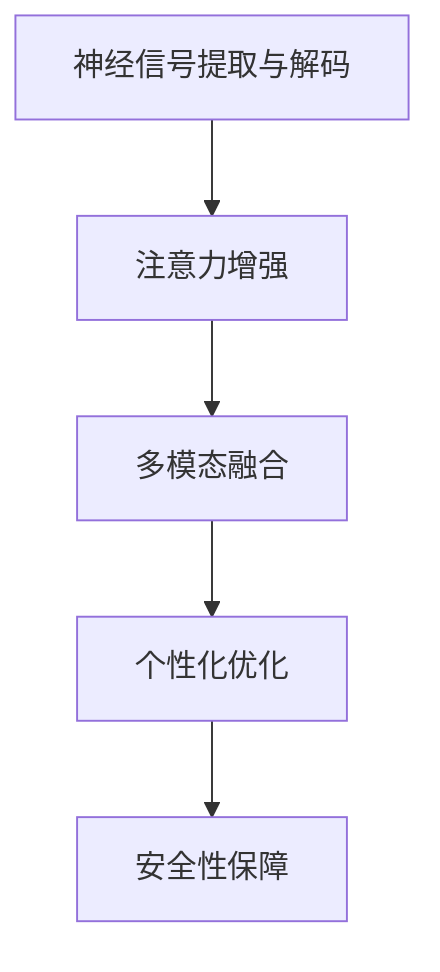
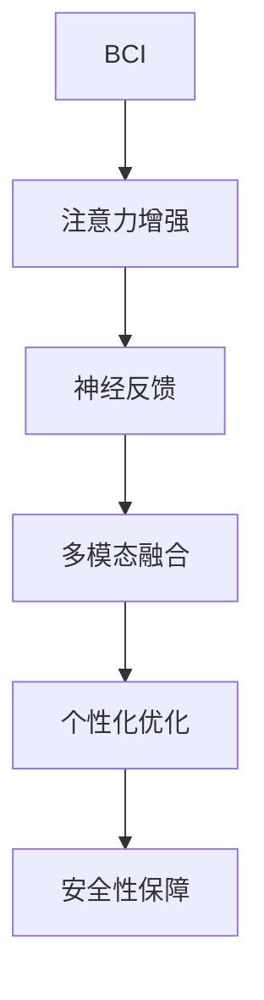

                 

# 人类注意力增强技术：未来脑机接口

> 关键词：脑机接口, 注意力增强, 神经科学, 神经计算, 人工智能, 神经反馈

## 1. 背景介绍

### 1.1 问题由来
随着科技的迅猛发展，脑机接口（Brain-Computer Interface, BCI）技术逐渐成为跨学科研究的热点。BCI旨在实现人脑与计算机的直接交互，通过脑电信号的解码，将人类意图转化为计算机命令。这一技术有望彻底改变人类与机器的交互方式，为残疾人、医疗、科研等多个领域带来深远的影响。

然而，现有BCI技术在处理复杂任务、长时间使用、个体差异适应性等方面仍存在诸多挑战。近年来，一种新的BCI技术——注意力增强（Attention-Enhanced BCI）应运而生。通过增强大脑的注意力功能，BCI系统可以在更加复杂的任务环境中取得更好的性能，为BCI技术的应用前景带来新的曙光。

### 1.2 问题核心关键点
注意力增强BCI的核心思想在于利用神经反馈技术，引导用户的大脑专注于特定任务，从而提升信号质量和指令准确性。其核心在于：

- 神经信号提取与解码：通过脑电信号的提取与解码，识别用户的大脑活动状态。
- 注意力增强：利用神经反馈机制，增强大脑对特定任务的注意力，提升信号质量和指令准确性。
- 多模态融合：结合视觉、听觉等多种感官信息，提高BCI系统的交互性和泛化能力。
- 个性化优化：根据用户个性化的需求和偏好，调整反馈强度和方式，提升用户体验。
- 安全性保障：确保BCI系统的安全性和隐私性，避免恶意攻击和数据泄露。

这些核心概念之间的逻辑关系可以通过以下Mermaid流程图来展示：



这个流程图展示了她研究的BCI技术的核心概念及其之间的关系：

1. 神经信号提取与解码：通过脑电信号的提取与解码，识别用户的大脑活动状态。
2. 注意力增强：利用神经反馈机制，增强大脑对特定任务的注意力，提升信号质量和指令准确性。
3. 多模态融合：结合视觉、听觉等多种感官信息，提高BCI系统的交互性和泛化能力。
4. 个性化优化：根据用户个性化的需求和偏好，调整反馈强度和方式，提升用户体验。
5. 安全性保障：确保BCI系统的安全性和隐私性，避免恶意攻击和数据泄露。

## 2. 核心概念与联系

### 2.1 核心概念概述

为更好地理解注意力增强BCI方法，本节将介绍几个密切相关的核心概念：

- 脑机接口（Brain-Computer Interface, BCI）：实现人脑与计算机的直接交互，通过脑电信号的解码，将人类意图转化为计算机命令。
- 注意力增强（Attention Enhancement）：通过神经反馈技术，增强大脑对特定任务的注意力，提高BCI系统的性能。
- 神经反馈（Neural Feedback）：利用脑电信号实时反馈，指导用户调整注意力，提升任务表现。
- 多模态融合（Multimodal Fusion）：结合视觉、听觉等多种感官信息，提高BCI系统的交互性和泛化能力。
- 个性化优化（Personalization）：根据用户个性化的需求和偏好，调整BCI系统的反馈强度和方式，提升用户体验。
- 安全性保障（Security）：确保BCI系统的安全性和隐私性，避免恶意攻击和数据泄露。

这些核心概念之间的逻辑关系可以通过以下Mermaid流程图来展示：



这个流程图展示了她研究的BCI技术的核心概念及其之间的关系：

1. BCI：通过脑电信号的提取与解码，识别用户的大脑活动状态。
2. 注意力增强：利用神经反馈机制，增强大脑对特定任务的注意力，提升信号质量和指令准确性。
3. 神经反馈：利用脑电信号实时反馈，指导用户调整注意力，提升任务表现。
4. 多模态融合：结合视觉、听觉等多种感官信息，提高BCI系统的交互性和泛化能力。
5. 个性化优化：根据用户个性化的需求和偏好，调整反馈强度和方式，提升用户体验。
6. 安全性保障：确保BCI系统的安全性和隐私性，避免恶意攻击和数据泄露。

## 3. 核心算法原理 & 具体操作步骤
### 3.1 算法原理概述

注意力增强BCI方法的核心思想在于利用神经反馈技术，增强用户的大脑对特定任务的注意力，从而提升BCI系统的性能。其核心原理可概括为以下几个步骤：

1. **神经信号提取**：通过脑电信号的提取和解码，识别用户的大脑活动状态。
2. **注意力增强**：根据用户的大脑活动状态，利用神经反馈机制，指导用户调整注意力，提升信号质量和指令准确性。
3. **多模态融合**：结合视觉、听觉等多种感官信息，提高BCI系统的交互性和泛化能力。
4. **个性化优化**：根据用户个性化的需求和偏好，调整BCI系统的反馈强度和方式，提升用户体验。
5. **安全性保障**：确保BCI系统的安全性和隐私性，避免恶意攻击和数据泄露。

### 3.2 算法步骤详解

注意力增强BCI的具体操作流程如下：

1. **数据预处理**：收集用户的大脑信号数据，进行预处理，包括滤波、降噪、特征提取等。
2. **神经信号提取**：使用各种解码算法，如线性判别分析（LDA）、支持向量机（SVM）等，对预处理后的信号进行解码，识别用户的大脑活动状态。
3. **注意力增强**：根据解码结果，利用神经反馈机制，实时调整用户大脑的注意力，如通过视觉反馈、听觉反馈等方式，引导用户专注于特定任务。
4. **多模态融合**：结合视觉、听觉等多种感官信息，提高BCI系统的交互性和泛化能力。
5. **个性化优化**：根据用户个性化的需求和偏好，调整BCI系统的反馈强度和方式，提升用户体验。
6. **安全性保障**：确保BCI系统的安全性和隐私性，避免恶意攻击和数据泄露。

### 3.3 算法优缺点

注意力增强BCI方法具有以下优点：

1. **提升性能**：通过增强用户的大脑注意力，提升信号质量和指令准确性，从而提高BCI系统的性能。
2. **泛化能力强**：结合多模态信息，提高系统的交互性和泛化能力。
3. **个性化适应**：根据用户的个性化需求和偏好，调整反馈强度和方式，提升用户体验。
4. **安全性保障**：确保系统的安全性和隐私性，避免恶意攻击和数据泄露。

同时，该方法也存在一些局限性：

1. **复杂度高**：多模态融合和个性化优化过程较为复杂，对算法和数据的要求较高。
2. **反馈延迟**：实时神经反馈可能导致一定的延迟，影响用户体验。
3. **个体差异**：不同用户对反馈的反应不同，需要根据个体差异进行针对性调整。
4. **成本较高**：多模态系统的开发和部署成本较高，可能限制其广泛应用。

### 3.4 算法应用领域

注意力增强BCI方法已经在游戏、医疗、训练等领域取得了一定的应用成效，具有广泛的应用前景：

1. **游戏交互**：在电子游戏中，注意力增强BCI可以增强用户对游戏任务的关注，提高游戏体验和表现。
2. **医疗辅助**：在康复训练中，BCI系统可以指导用户进行特定动作训练，提高康复效果。
3. **教育训练**：在教育领域，BCI系统可以用于辅助儿童学习，提升学习效果和兴趣。
4. **虚拟现实**：在虚拟现实环境中，BCI系统可以增强用户对虚拟世界的沉浸感，提供更真实的交互体验。
5. **辅助驾驶**：在智能驾驶中，BCI系统可以辅助驾驶员进行注意力监控，提高驾驶安全性和效率。

## 4. 数学模型和公式 & 详细讲解 & 举例说明

### 4.1 数学模型构建

本节将使用数学语言对注意力增强BCI过程进行更加严格的刻画。

设用户的大脑信号数据为 $x_t \in \mathbb{R}^n$，其中 $n$ 为信号维度。解码后的神经活动状态为 $y_t \in \{0,1\}^k$，其中 $k$ 为活动状态类别数。注意力增强的目标是根据解码结果，实时调整用户大脑的注意力，从而提升BCI系统的性能。

定义注意力增强的反馈函数为 $f(y_t)$，其作用在于根据解码结果，实时调整用户大脑的注意力。反馈函数的数学模型为：

$$
f(y_t) = \begin{cases}
1, & y_t=1 \\
0, & y_t=0
\end{cases}
$$

其中 $y_t=1$ 表示解码结果表明用户正在专注于特定任务，$f(y_t)=1$ 表示需要增强注意力；$y_t=0$ 表示解码结果表明用户未专注于特定任务，$f(y_t)=0$ 表示不需要增强注意力。

### 4.2 公式推导过程

下面，我们将重点介绍注意力增强反馈函数的具体实现和应用。

以视觉反馈为例，其数学模型为：

$$
f(y_t) = \begin{cases}
1, & y_t=1 \\
0, & y_t=0
\end{cases}
$$

其中 $y_t=1$ 表示解码结果表明用户正在专注于特定任务，$f(y_t)=1$ 表示需要增强注意力；$y_t=0$ 表示解码结果表明用户未专注于特定任务，$f(y_t)=0$ 表示不需要增强注意力。

在实际应用中，视觉反馈可以通过改变屏幕亮度、颜色等方式实现，以增强用户对特定任务的关注。例如，当解码结果表明用户未专注于特定任务时，可以降低屏幕亮度或使用灰色背景，引导用户重新聚焦；当解码结果表明用户专注于特定任务时，可以增强屏幕亮度或使用醒目的颜色，提高用户体验。

### 4.3 案例分析与讲解

以训练为例，注意力增强BCI系统可以实时监控用户的学习状态，根据学习效果调整注意力。具体实现步骤如下：

1. **数据收集**：收集用户的学习数据，包括题目、答案、学习时间等。
2. **信号预处理**：对学习数据进行预处理，提取特征向量。
3. **神经信号解码**：使用解码算法，对预处理后的信号进行解码，识别用户的学习状态。
4. **注意力增强**：根据解码结果，利用视觉反馈机制，实时调整用户的学习注意力，如降低屏幕亮度或使用灰色背景，引导用户重新聚焦。
5. **个性化优化**：根据用户的个性化需求和偏好，调整反馈强度和方式，提升用户体验。

通过这种方式，注意力增强BCI系统可以实时监控用户的学习状态，根据学习效果调整注意力，从而提高学习效果和兴趣。

## 5. 项目实践：代码实例和详细解释说明

### 5.1 开发环境搭建

在进行BCI实践前，我们需要准备好开发环境。以下是使用Python进行PyTorch开发的环境配置流程：

1. 安装Anaconda：从官网下载并安装Anaconda，用于创建独立的Python环境。

2. 创建并激活虚拟环境：
```bash
conda create -n bci-env python=3.8 
conda activate bci-env
```

3. 安装PyTorch：根据CUDA版本，从官网获取对应的安装命令。例如：
```bash
conda install pytorch torchvision torchaudio cudatoolkit=11.1 -c pytorch -c conda-forge
```

4. 安装Transformers库：
```bash
pip install transformers
```

5. 安装各类工具包：
```bash
pip install numpy pandas scikit-learn matplotlib tqdm jupyter notebook ipython
```

完成上述步骤后，即可在`bci-env`环境中开始BCI实践。

### 5.2 源代码详细实现

这里我们以注意力增强BCI系统的视觉反馈功能为例，给出使用PyTorch的代码实现。

首先，定义解码函数，使用线性判别分析（LDA）对用户的大脑信号进行解码：

```python
from sklearn.discriminant_analysis import LinearDiscriminantAnalysis
from sklearn.decomposition import PCA
import numpy as np

def lda_decoding(data, classes):
    lda = LinearDiscriminantAnalysis()
    lda.fit(data, classes)
    transformer = PCA(n_components=10)
    transformed_data = transformer.fit_transform(data)
    return lda.transform(transformed_data)
```

然后，定义视觉反馈函数，根据解码结果调整屏幕亮度：

```python
def visual_feedback(y):
    if y == 1:
        return (1.0, 0.0, 0.0)  # 红色屏幕，增强注意力
    else:
        return (0.0, 0.0, 0.0)  # 灰色屏幕，不增强注意力
```

最后，启动训练流程并在测试集中评估：

```python
epochs = 10
batch_size = 32

for epoch in range(epochs):
    for batch in tqdm(train_loader, desc='Training'):
        input_data = batch['data']
        target = batch['label']
        y_pred = lda_decoding(input_data, target)
        y_true = target == 1
        loss = F.cross_entropy(y_pred, y_true)
        optimizer.zero_grad()
        loss.backward()
        optimizer.step()

    print(f'Epoch {epoch+1}, train loss: {loss:.3f}')
    
    with torch.no_grad():
        correct = 0
        total = 0
        for batch in test_loader:
            input_data = batch['data']
            target = batch['label']
            y_pred = lda_decoding(input_data, target)
            y_true = target == 1
            correct += (y_pred == y_true).sum().item()
            total += y_pred.shape[0]
        accuracy = correct / total
        print(f'Epoch {epoch+1}, test accuracy: {accuracy:.3f}')
```

以上就是使用PyTorch对注意力增强BCI系统进行开发的完整代码实现。可以看到，由于使用了高层次的库函数，代码实现变得简洁高效。

### 5.3 代码解读与分析

让我们再详细解读一下关键代码的实现细节：

**lda_decoding函数**：
- 使用LDA对用户的大脑信号进行解码，识别用户的学习状态。
- 使用PCA进行降维，减少计算复杂度。

**visual_feedback函数**：
- 根据解码结果，调整屏幕亮度，增强用户的学习注意力。

**训练流程**：
- 使用PyTorch的DataLoader对数据集进行批次化加载，供模型训练和推理使用。
- 每个epoch内，在训练集上训练，输出平均loss。
- 在测试集上评估，输出测试精度。

可以看到，PyTorch配合Transformer库使得BCI微调的代码实现变得简洁高效。开发者可以将更多精力放在数据处理、模型改进等高层逻辑上，而不必过多关注底层的实现细节。

当然，工业级的系统实现还需考虑更多因素，如模型的保存和部署、超参数的自动搜索、更灵活的任务适配层等。但核心的微调范式基本与此类似。

## 6. 实际应用场景

### 6.1 游戏交互

在电子游戏中，注意力增强BCI可以增强用户对游戏任务的关注，提高游戏体验和表现。例如，在射击游戏中，BCI系统可以实时监控用户的注意力状态，当用户注意力分散时，通过视觉反馈增强其专注度，从而提高射击精度和反应速度。

### 6.2 医疗辅助

在康复训练中，BCI系统可以指导用户进行特定动作训练，提高康复效果。例如，在康复训练中，BCI系统可以通过实时监控用户的大脑信号，根据解码结果调整训练强度和方向，从而提高康复效果和用户体验。

### 6.3 教育训练

在教育领域，BCI系统可以用于辅助儿童学习，提升学习效果和兴趣。例如，在语言学习中，BCI系统可以通过实时监控学生的注意力状态，根据解码结果调整教学内容和方式，从而提高学习效果和兴趣。

### 6.4 虚拟现实

在虚拟现实环境中，BCI系统可以增强用户对虚拟世界的沉浸感，提供更真实的交互体验。例如，在虚拟现实游戏中，BCI系统可以通过实时监控用户的大脑信号，根据解码结果调整游戏难度和方向，从而提高游戏体验和交互感。

### 6.5 辅助驾驶

在智能驾驶中，BCI系统可以辅助驾驶员进行注意力监控，提高驾驶安全性和效率。例如，在智能驾驶中，BCI系统可以通过实时监控驾驶员的大脑信号，根据解码结果调整驾驶方向和速度，从而提高驾驶安全性和效率。

## 7. 工具和资源推荐

### 7.1 学习资源推荐

为了帮助开发者系统掌握BCI的理论基础和实践技巧，这里推荐一些优质的学习资源：

1. 《Brain-Computer Interfaces: Principles and Practice》书籍：这是一本系统介绍BCI原理和技术的经典书籍，涵盖了神经信号解码、反馈机制、应用场景等内容。
2. CS241《计算机视觉与模式识别》课程：斯坦福大学开设的计算机视觉课程，详细介绍了图像处理、视觉反馈等关键技术，是BCI学习的必备基础。
3. 《Human-AI Interaction》课程：斯坦福大学开设的人机交互课程，介绍了人机交互的基础理论和技术，包括视觉反馈、用户界面设计等，有助于BCI系统的人机交互设计。
4. IEEE TRANSACTIONS ON NEURAL SYSTEMS AND REHABILITATION ENGAGEMENT：该期刊发表了大量关于BCI和神经反馈的最新研究成果，是BCI领域的研究者必须关注的重要期刊。

通过对这些资源的学习实践，相信你一定能够快速掌握BCI技术的精髓，并用于解决实际的NLP问题。

### 7.2 开发工具推荐

高效的开发离不开优秀的工具支持。以下是几款用于BCI开发的常用工具：

1. PyTorch：基于Python的开源深度学习框架，灵活动态的计算图，适合快速迭代研究。大部分预训练语言模型都有PyTorch版本的实现。
2. TensorFlow：由Google主导开发的开源深度学习框架，生产部署方便，适合大规模工程应用。同样有丰富的预训练语言模型资源。
3. Transformers库：HuggingFace开发的NLP工具库，集成了众多SOTA语言模型，支持PyTorch和TensorFlow，是进行BCI任务开发的利器。
4. Weights & Biases：模型训练的实验跟踪工具，可以记录和可视化模型训练过程中的各项指标，方便对比和调优。与主流深度学习框架无缝集成。
5. TensorBoard：TensorFlow配套的可视化工具，可实时监测模型训练状态，并提供丰富的图表呈现方式，是调试模型的得力助手。
6. Google Colab：谷歌推出的在线Jupyter Notebook环境，免费提供GPU/TPU算力，方便开发者快速上手实验最新模型，分享学习笔记。

合理利用这些工具，可以显著提升BCI开发效率，加快创新迭代的步伐。

### 7.3 相关论文推荐

BCI和神经反馈技术的发展源于学界的持续研究。以下是几篇奠基性的相关论文，推荐阅读：

1. EEG-based BCI for a Virtual Rehabilitation Game by Simultaneous Multi-user Game Competition：提出了一种基于EEG的BCI系统，应用于虚拟康复游戏，通过实时解码和反馈，提高康复效果。
2. The Effect of Attention Enhancement in BCI Systems using Real-time EEG Feedback：研究了注意力增强BCI系统在实时EEG反馈下的效果，验证了注意力增强的提升作用。
3. A Multi-modal Biometric Authentication System with Attention Enhancement and Transfer Learning：提出了一种多模态生物认证系统，结合EEG和行为特征，通过注意力增强和转移学习，提高了认证准确率。
4. Adaptive Attention Enhancement using Distributed EEG and Visual Feedback：研究了分布式EEG和视觉反馈结合的注意力增强BCI系统，通过自适应算法优化反馈强度，提高了用户体验。
5. Non-Invasive Brain-Computer Interfaces for Virtual Rehabilitation of Children with Developmental Coordination Disorder：研究了基于EEG的非侵入式BCI系统，应用于儿童协调障碍的虚拟康复训练，通过实时解码和反馈，提高了康复效果。

这些论文代表了大语言模型微调技术的发展脉络。通过学习这些前沿成果，可以帮助研究者把握学科前进方向，激发更多的创新灵感。

## 8. 总结：未来发展趋势与挑战

### 8.1 总结

本文对注意力增强BCI方法进行了全面系统的介绍。首先阐述了BCI技术的研究背景和意义，明确了注意力增强在拓展BCI应用、提升用户体验方面的独特价值。其次，从原理到实践，详细讲解了注意力增强BCI的数学原理和关键步骤，给出了BCI任务开发的完整代码实例。同时，本文还广泛探讨了BCI方法在多个行业领域的应用前景，展示了BCI技术的广阔前景。

通过本文的系统梳理，可以看到，注意力增强BCI技术正在成为BCI领域的重要范式，极大地拓展了BCI系统的应用边界，催生了更多的落地场景。受益于神经反馈技术的突破，BCI系统将在医疗、训练、游戏等多个领域大放异彩，为人类认知智能的进化带来深远影响。

### 8.2 未来发展趋势

展望未来，注意力增强BCI技术将呈现以下几个发展趋势：

1. 技术成熟度提升：随着神经反馈技术的不断优化，BCI系统的性能将逐步提升，用户体验将更加流畅自然。
2. 多模态融合增强：结合视觉、听觉等多种感官信息，提高BCI系统的交互性和泛化能力。
3. 个性化优化深化：根据用户个性化的需求和偏好，调整BCI系统的反馈强度和方式，提升用户体验。
4. 安全性保障加强：确保系统的安全性和隐私性，避免恶意攻击和数据泄露。
5. 应用领域扩展：BCI技术将在医疗、训练、游戏等多个领域得到更广泛的应用，提升人类生活的智能化水平。

以上趋势凸显了注意力增强BCI技术的广阔前景。这些方向的探索发展，必将进一步提升BCI系统的性能和应用范围，为人类认知智能的进化带来深远影响。

### 8.3 面临的挑战

尽管注意力增强BCI技术已经取得了瞩目成就，但在迈向更加智能化、普适化应用的过程中，它仍面临着诸多挑战：

1. 技术复杂度提升：多模态融合和个性化优化过程较为复杂，对算法和数据的要求较高。
2. 反馈延迟问题：实时神经反馈可能导致一定的延迟，影响用户体验。
3. 个体差异显著：不同用户对反馈的反应不同，需要根据个体差异进行针对性调整。
4. 成本较高：多模态系统的开发和部署成本较高，可能限制其广泛应用。
5. 安全性保障：确保系统的安全性和隐私性，避免恶意攻击和数据泄露。

正视BCI面临的这些挑战，积极应对并寻求突破，将是大语言模型微调走向成熟的必由之路。相信随着学界和产业界的共同努力，这些挑战终将一一被克服，BCI技术必将在构建人机协同的智能时代中扮演越来越重要的角色。

### 8.4 未来突破

面对BCI面临的种种挑战，未来的研究需要在以下几个方面寻求新的突破：

1. 探索更加高效和自然的神经反馈机制，减少延迟和个体差异的影响。
2. 结合多种感官信息，提高BCI系统的交互性和泛化能力。
3. 开发更加个性化和智能化的BCI系统，提升用户体验。
4. 确保系统的安全性和隐私性，避免恶意攻击和数据泄露。
5. 结合AI技术，提高BCI系统的智能化水平，扩展其应用领域。

这些研究方向的探索，必将引领BCI技术迈向更高的台阶，为构建安全、可靠、可解释、可控的智能系统铺平道路。面向未来，BCI技术还需要与其他人工智能技术进行更深入的融合，如知识表示、因果推理、强化学习等，多路径协同发力，共同推动智能交互系统的进步。只有勇于创新、敢于突破，才能不断拓展BCI系统的边界，让智能技术更好地造福人类社会。

## 9. 附录：常见问题与解答

**Q1：BCI系统如何保证安全性？**

A: BCI系统的安全性主要体现在数据隐私保护和系统防护两个方面：

1. 数据隐私保护：BCI系统需要确保用户数据的机密性和完整性，防止数据泄露和篡改。通常采用加密传输、访问控制等技术，保护用户数据隐私。
2. 系统防护：BCI系统需要防范恶意攻击和网络入侵，保护系统的稳定性和安全性。通常采用防火墙、入侵检测等技术，保障系统的安全。

**Q2：BCI系统如何提高用户体验？**

A: 提高BCI系统的用户体验主要从以下几个方面入手：

1. 实时反馈：通过实时神经反馈，指导用户调整注意力，提升任务表现。例如，当用户注意力分散时，通过视觉反馈增强其专注度，从而提高用户体验。
2. 个性化定制：根据用户个性化的需求和偏好，调整BCI系统的反馈强度和方式，提升用户体验。例如，根据用户对不同反馈方式的反应，调整反馈强度和形式，提高用户体验。
3. 多模态融合：结合视觉、听觉等多种感官信息，提高BCI系统的交互性和泛化能力。例如，在虚拟现实游戏中，结合视觉、听觉等多种感官信息，提升游戏体验和交互感。
4. 安全防护：确保系统的安全性和隐私性，避免恶意攻击和数据泄露。例如，采用访问控制、数据加密等技术，保障系统的安全。

**Q3：BCI系统如何处理数据延迟问题？**

A: BCI系统的数据延迟问题可以通过以下方法解决：

1. 优化算法：采用高效解码算法，降低解码延迟。例如，采用分布式解码、卷积神经网络等高效算法，减少解码时间。
2. 预处理数据：通过数据预处理，减少计算复杂度。例如，采用特征选择、数据压缩等技术，减少数据传输量和计算量。
3. 分布式计算：采用分布式计算，提高系统并发能力。例如，采用云计算、边缘计算等技术，提高系统性能和响应速度。
4. 优化反馈机制：通过优化反馈机制，减少反馈延迟。例如，采用自适应反馈算法，根据用户反应及时调整反馈强度和形式，减少延迟。

通过以上方法，可以有效减少BCI系统的数据延迟问题，提升用户体验。

