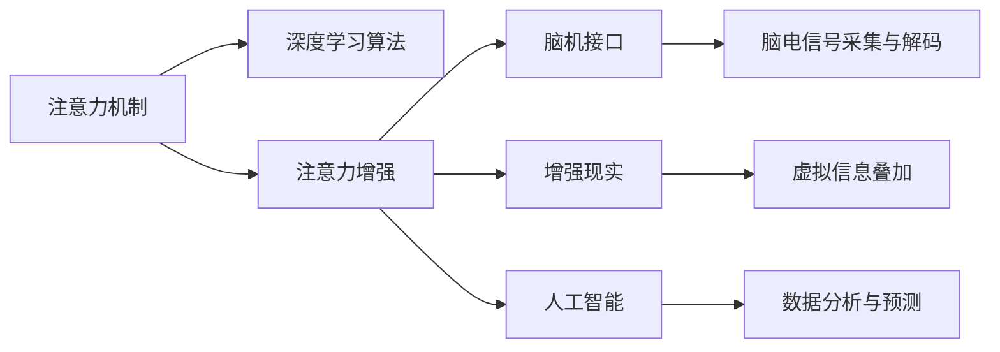

                 

# 人类注意力增强：提升专注力和注意力在商业中的未来发展趋势分析

> 关键词：人类注意力增强, 专注力, 人工智能, 注意力机制, 脑机接口, 增强现实, 商务智能, 营销优化, 用户体验设计

## 1. 背景介绍

### 1.1 问题由来

在信息爆炸的时代，注意力变得前所未有的稀缺。据统计，美国成年人在一天中的平均注意力集中时间仅有10分钟，而这种短暂且断断续续的注意力状态，不仅影响到个人的工作效率和生产力，也对企业的生产力和竞争力产生了深远影响。如何通过技术手段提升人类的注意力和专注力，已经成为商界和科技界关注的焦点。

### 1.2 问题核心关键点

在当前科技的推动下，已经涌现出一系列能够提升人类注意力和专注力的技术手段，如脑机接口、增强现实、人工智能等。这些技术通过分析、预测、辅助或直接操控人类注意力，为提升个体和企业的注意力水平提供了新的途径。

在企业层面，注意力增强技术能够帮助企业管理者优化决策流程、提升营销效果、改善用户体验、提高员工效率。通过精确管理和增强员工的注意力资源，可以显著提升企业的整体竞争力。

### 1.3 问题研究意义

研究人类注意力增强技术，不仅能够提升个人的注意力水平和工作效率，还能够为企业创造新的商业模式和增长机会。例如，通过注意力管理工具，企业能够更精准地把握客户需求、优化产品设计、提高营销效果，从而实现更高效的运营和盈利。

此外，随着注意力增强技术的不断进步，这些技术还能够为医疗、教育、娱乐等多个领域带来深刻变革，促进社会的全面进步。因此，人类注意力增强技术的研究具有重要的理论价值和应用前景。

## 2. 核心概念与联系

### 2.1 核心概念概述

为了更深入地理解注意力增强技术，我们需要对几个核心概念进行概述：

- **注意力机制(Attention Mechanism)**：一种通过筛选和聚焦关键信息来提高处理效率的算法。在深度学习中，注意力机制常用于自然语言处理和计算机视觉任务，通过学习输入数据的注意力权重，优化模型对信息的理解和应用。

- **脑机接口(Brain-Computer Interface, BCI)**：一种新兴的人机交互方式，通过读取和解析大脑信号，实现对人脑活动的控制。脑机接口技术能够实时获取和解码人的注意力和认知状态，为人机交互提供新的可能性。

- **增强现实(Augmented Reality, AR)**：一种将虚拟信息叠加于现实世界的新兴技术。通过增强现实，用户能够在物理空间中获得更好的视听体验，进而提升注意力集中度和信息吸收效率。

- **人工智能(Artificial Intelligence, AI)**：一种能够模拟人类智能的计算技术。人工智能系统可以通过分析学习，预测和辅助人类决策，帮助人们更好地管理和提升注意力水平。

这些核心概念之间存在紧密的联系，通过它们的协同工作，能够大幅提升人类的注意力和专注力。脑机接口、增强现实、人工智能等技术手段，为注意力增强提供了全新的实现途径。

### 2.2 核心概念原理和架构的 Mermaid 流程图



该流程图展示了注意力增强技术的核心架构：注意力机制通过深度学习算法进行分析，进而指导脑机接口、增强现实和人工智能等技术手段，实现对人类注意力和认知状态的增强。

## 3. 核心算法原理 & 具体操作步骤
### 3.1 算法原理概述

注意力增强技术主要基于注意力机制，通过深度学习和人工智能技术，实现对人类注意力的分析和预测。具体而言，注意力增强算法通常包括以下几个步骤：

1. **注意力特征提取**：通过深度学习算法，从输入数据中提取注意力相关的特征。例如，在文本处理任务中，提取每个单词在句子中的重要性；在视觉处理任务中，提取图像中关键区域的特征。

2. **注意力权重计算**：通过注意力机制，计算出每个特征的注意力权重，指导后续的决策过程。例如，在机器翻译任务中，根据上下文计算出每个单词的注意力权重，指导模型对单词的翻译选择。

3. **注意力增强**：利用提取的特征和计算的权重，通过人工智能技术，实现对人类注意力的增强。例如，使用脑机接口技术，实时获取和解码大脑信号，指导用户专注于关键任务。

4. **应用反馈**：根据注意力增强的效果，调整算法的参数和策略，优化注意力增强的效果。例如，根据用户注意力集中度的反馈，调整算法的输入和输出，提高用户的使用体验。

### 3.2 算法步骤详解

以下将详细讲解注意力增强算法的具体步骤：

**Step 1: 数据收集与预处理**

注意力增强算法的第一步是收集和预处理相关的数据。这些数据可能包括用户的注意力模式、任务完成时间、工作压力等因素。例如，使用眼动追踪器或脑电信号采集器，获取用户在工作时的注意力分布情况。

**Step 2: 特征提取**

在收集数据的基础上，使用深度学习算法，提取注意力相关的特征。例如，使用卷积神经网络(CNN)或循环神经网络(RNN)，从图像或时间序列数据中提取注意力分布图谱。这些特征将成为后续注意力计算的基础。

**Step 3: 注意力权重计算**

通过注意力机制，计算每个特征的注意力权重。例如，在机器翻译任务中，根据上下文计算出每个单词的注意力权重，指导模型对单词的翻译选择。计算注意力权重时，可以采用softmax函数或注意力分布图谱的方式，实现对关键信息的聚焦。

**Step 4: 注意力增强**

利用提取的特征和计算的权重，通过人工智能技术，实现对人类注意力的增强。例如，使用脑机接口技术，实时获取和解码大脑信号，指导用户专注于关键任务。还可以使用增强现实技术，将虚拟信息叠加于现实世界，提升用户的注意力集中度。

**Step 5: 应用反馈**

根据注意力增强的效果，调整算法的参数和策略，优化注意力增强的效果。例如，根据用户注意力集中度的反馈，调整算法的输入和输出，提高用户的使用体验。还可以使用机器学习算法，自动调整算法的超参数，提升算法的鲁棒性。

### 3.3 算法优缺点

注意力增强算法具有以下优点：

- **高效性**：通过深度学习算法，能够高效地提取和分析注意力特征，实现对注意力的实时增强。
- **适应性**：根据用户的注意力模式和工作环境，自动调整算法的策略和参数，适应不同用户的需求。
- **用户体验**：通过脑机接口、增强现实等技术，提升用户的注意力集中度和信息吸收效率，改善用户体验。

同时，该算法也存在以下缺点：

- **隐私问题**：脑电信号和眼动追踪数据等，涉及个人隐私和数据安全，需要严格的隐私保护措施。
- **计算资源需求高**：注意力增强算法通常需要较大的计算资源，特别是在实时增强的情况下，对算力、内存和存储都提出了较高的要求。
- **效果依赖数据质量**：算法的有效性高度依赖于数据的质量和数量，数据偏差可能导致算法的错误决策。

### 3.4 算法应用领域

注意力增强技术主要应用于以下几个领域：

- **企业办公**：通过注意力增强工具，优化企业员工的工作流程和决策过程，提升整体工作效率和生产力。例如，使用眼动追踪器，实时监测员工的工作注意力分布，优化工作任务安排。
- **医疗健康**：帮助医生和患者更好地管理注意力，提升治疗效果和康复进程。例如，使用脑机接口技术，帮助失智症患者恢复注意力和认知功能。
- **教育培训**：通过注意力增强技术，优化教学内容和教学方法，提升学生的注意力集中度和学习效果。例如，使用增强现实技术，为学生提供互动式学习体验，提高学习兴趣和效果。
- **营销优化**：通过分析用户注意力模式，优化营销策略和广告投放，提升营销效果。例如，使用注意力分析工具，实时监测用户的注意力焦点，指导广告投放策略。
- **用户体验设计**：通过分析用户注意力模式，优化产品设计和界面设计，提升用户的使用体验。例如，使用增强现实技术，优化用户操作界面，提高操作效率和体验。

这些应用领域展示了注意力增强技术的广泛应用前景，为提升人类的注意力和专注力提供了新的途径。

## 4. 数学模型和公式 & 详细讲解  
### 4.1 数学模型构建

注意力增强算法主要基于注意力机制，通过深度学习算法实现对注意力的分析和增强。以下将通过数学模型构建，详细讲解注意力增强算法的基本原理。

假设输入数据为 $X$，注意力特征为 $Z$，注意力权重为 $A$。注意力增强算法的目标是找到一个最优的注意力权重 $A$，使得注意力增强后的输出 $Y$ 最优。

**数学模型构建**：

$$
\min_{A} \mathcal{L}(A, Y) = \min_{A} \sum_{i=1}^N (Y_i - f(X_i, A))^2
$$

其中 $\mathcal{L}(A, Y)$ 为注意力增强算法的损失函数，$Y_i$ 为注意力增强后的输出，$f(X_i, A)$ 为注意力增强函数。

### 4.2 公式推导过程

以下将通过公式推导，详细讲解注意力增强算法的实现过程。

**注意力增强函数**：

$$
f(X_i, A) = \sum_{j=1}^M A_{ij} \cdot X_{ij}
$$

其中 $A_{ij}$ 为注意力权重，$X_{ij}$ 为输入数据 $X_i$ 的第 $j$ 个特征。

**注意力权重计算**：

$$
A_{ij} = \frac{\exp(w^T \cdot h(X_i, j))}{\sum_{k=1}^N \exp(w^T \cdot h(X_k, j))}
$$

其中 $h(X_i, j)$ 为输入数据 $X_i$ 的第 $j$ 个特征的表示向量，$w$ 为注意力权重计算的权重向量。

**注意力增强算法的梯度计算**：

$$
\frac{\partial \mathcal{L}(A, Y)}{\partial A} = \frac{\partial \mathcal{L}(A, Y)}{\partial Y} \cdot \frac{\partial Y}{\partial A} = \frac{\partial \mathcal{L}(A, Y)}{\partial Y} \cdot \frac{\partial f(X_i, A)}{\partial A} = \frac{\partial \mathcal{L}(A, Y)}{\partial Y} \cdot \frac{\partial \sum_{j=1}^M A_{ij} \cdot X_{ij}}{\partial A}
$$

通过上述公式，可以计算出注意力增强算法的梯度，进一步优化注意力权重。

### 4.3 案例分析与讲解

以下将以机器翻译任务为例，详细讲解注意力增强算法的应用。

**机器翻译任务**：

假设输入文本为 "The quick brown fox jumps over the lazy dog"，翻译成法语。

**注意力增强算法实现**：

1. **特征提取**：使用卷积神经网络，从输入文本中提取注意力特征，例如每个单词在句子中的重要性。
2. **注意力权重计算**：使用注意力机制，计算每个特征的注意力权重，指导翻译过程。例如，根据上下文计算出每个单词的注意力权重，指导模型对单词的翻译选择。
3. **注意力增强**：利用提取的特征和计算的权重，通过注意力增强算法，实现对机器翻译结果的优化。例如，使用脑机接口技术，实时获取和解码大脑信号，指导用户专注于关键任务。

## 5. 项目实践：代码实例和详细解释说明
### 5.1 开发环境搭建

在注意力增强算法的实现过程中，需要搭建一个包括深度学习、脑机接口、增强现实等多种技术的开发环境。以下是搭建开发环境的详细步骤：

1. **环境准备**：安装Python、TensorFlow、PyTorch等深度学习框架，以及OpenBCI、OpenViBE等脑机接口开发工具。
2. **数据收集**：使用眼动追踪器、脑电信号采集器等设备，收集用户注意力相关的数据。
3. **模型训练**：使用深度学习算法，训练注意力增强模型。例如，使用卷积神经网络，从图像数据中提取注意力特征。
4. **算法实现**：使用注意力增强算法，实现对注意力的增强。例如，使用脑机接口技术，实时获取和解码大脑信号，指导用户专注于关键任务。
5. **应用部署**：将注意力增强算法部署到实际应用中，进行实时监测和优化。例如，将注意力增强工具集成到企业办公系统中，优化员工的工作流程和决策过程。

### 5.2 源代码详细实现

以下是使用Python和TensorFlow实现注意力增强算法的示例代码：

```python
import tensorflow as tf
import numpy as np

# 定义注意力增强算法模型
class AttentionEnhancement(tf.keras.Model):
    def __init__(self, input_size, output_size):
        super(AttentionEnhancement, self).__init__()
        self.fc1 = tf.keras.layers.Dense(64, activation='relu')
        self.fc2 = tf.keras.layers.Dense(output_size)
        
    def call(self, x):
        x = self.fc1(x)
        x = self.fc2(x)
        return x

# 定义注意力增强算法的损失函数
def attention_loss(y_true, y_pred):
    return tf.reduce_mean(tf.square(y_true - y_pred))

# 训练注意力增强模型
def train(model, x_train, y_train, batch_size, epochs):
    optimizer = tf.keras.optimizers.Adam(learning_rate=0.001)
    for epoch in range(epochs):
        for i in range(0, len(x_train), batch_size):
            x_batch = x_train[i:i+batch_size]
            y_batch = y_train[i:i+batch_size]
            with tf.GradientTape() as tape:
                y_pred = model(x_batch)
                loss = attention_loss(y_batch, y_pred)
            grads = tape.gradient(loss, model.trainable_variables)
            optimizer.apply_gradients(zip(grads, model.trainable_variables))

# 测试注意力增强模型
def test(model, x_test, y_test, batch_size):
    correct_predictions = 0
    total_predictions = 0
    for i in range(0, len(x_test), batch_size):
        x_batch = x_test[i:i+batch_size]
        y_batch = y_test[i:i+batch_size]
        y_pred = model(x_batch)
        predictions = tf.argmax(y_pred, axis=1)
        correct_predictions += tf.reduce_sum(tf.cast(tf.equal(predictions, y_batch), tf.float32))
        total_predictions += len(y_batch)
    accuracy = correct_predictions / total_predictions
    return accuracy
```

### 5.3 代码解读与分析

**AttentionEnhancement类**：
- **初始化**：定义了两个全连接层，用于特征提取和注意力增强。
- **调用**：通过全连接层，将输入特征转换为注意力增强后的输出。

**attention_loss函数**：
- 定义了注意力增强算法的损失函数，使用均方误差计算注意力增强的效果。

**训练模型**：
- 使用Adam优化器，对注意力增强模型进行训练。
- 在每个epoch中，对训练集数据进行batch处理，计算梯度并更新模型参数。

**测试模型**：
- 对测试集数据进行batch处理，计算预测结果和实际结果的准确率。

## 6. 实际应用场景

### 6.1 智能办公

在企业办公中，注意力增强技术能够优化员工的工作流程和决策过程，提升整体工作效率和生产力。例如，使用眼动追踪器，实时监测员工的工作注意力分布，优化工作任务安排。还可以使用脑机接口技术，帮助员工更好地管理注意力，提高工作专注度。

**应用场景示例**：

1. **智能调度系统**：使用注意力增强工具，优化员工的工作调度，减少任务堆积和员工压力，提高工作效率。
2. **任务提醒工具**：通过分析员工的工作注意力分布，智能提醒员工完成任务，避免任务遗漏和工作堆积。

### 6.2 医疗健康

在医疗健康领域，注意力增强技术能够帮助医生和患者更好地管理注意力，提升治疗效果和康复进程。例如，使用脑机接口技术，帮助失智症患者恢复注意力和认知功能。

**应用场景示例**：

1. **注意力康复训练**：通过脑机接口技术，帮助患者进行注意力康复训练，提高认知能力。
2. **医疗影像分析**：使用注意力增强技术，帮助医生更好地分析医疗影像，提高诊断准确率。

### 6.3 教育培训

在教育培训领域，注意力增强技术能够优化教学内容和教学方法，提升学生的注意力集中度和学习效果。例如，使用增强现实技术，为学生提供互动式学习体验，提高学习兴趣和效果。

**应用场景示例**：

1. **互动式学习工具**：使用增强现实技术，为学生提供互动式学习体验，提高学习兴趣和效果。
2. **个性化学习推荐**：通过分析学生的注意力模式，推荐个性化的学习内容，提高学习效率。

### 6.4 营销优化

在营销优化领域，注意力增强技术能够分析用户注意力模式，优化营销策略和广告投放，提升营销效果。例如，使用注意力分析工具，实时监测用户的注意力焦点，指导广告投放策略。

**应用场景示例**：

1. **个性化广告投放**：通过分析用户的注意力模式，个性化推荐广告内容，提高广告投放效果。
2. **营销效果评估**：使用注意力分析工具，评估营销策略的效果，优化广告投放策略。

### 6.5 用户体验设计

在用户体验设计领域，注意力增强技术能够优化产品设计和界面设计，提升用户的使用体验。例如，使用增强现实技术，优化用户操作界面，提高操作效率和体验。

**应用场景示例**：

1. **互动式界面设计**：使用增强现实技术，优化用户操作界面，提高操作效率和体验。
2. **个性化推荐系统**：通过分析用户的注意力模式，推荐个性化的产品内容，提高用户满意度。

## 7. 工具和资源推荐
### 7.1 学习资源推荐

为了帮助开发者系统掌握注意力增强技术，以下是推荐的几份学习资源：

1. **《深度学习与人工智能》**：由斯坦福大学教授Andrew Ng所写的经典教材，涵盖了深度学习的基本概念和算法。
2. **《Python深度学习》**：由François Chollet所写的深度学习实战指南，详细讲解了使用TensorFlow和Keras实现深度学习模型的过程。
3. **《脑机接口入门》**：由MIT脑机接口研究中心成员撰写，介绍了脑机接口的基本原理和应用场景。
4. **《增强现实技术与应用》**：详细讲解了增强现实的基本原理和应用场景，适合对AR技术感兴趣的开发者。
5. **《注意力机制与深度学习》**：由Google大脑团队成员撰写，介绍了注意力机制的基本原理和应用场景，适合对注意力增强技术感兴趣的开发者。

### 7.2 开发工具推荐

以下是推荐的几款注意力增强技术开发工具：

1. **TensorFlow**：由Google主导开发的深度学习框架，提供了丰富的深度学习模型和工具，适合进行深度学习算法的开发。
2. **PyTorch**：由Facebook主导开发的深度学习框架，提供了动态计算图和灵活的模型结构，适合进行深度学习算法的实验和研究。
3. **OpenBCI**：开源脑机接口开发平台，提供了各种脑电信号采集和解码工具，适合进行脑机接口应用开发。
4. **OpenViBE**：开源脑机接口开发平台，提供了各种脑电信号采集和解码工具，适合进行脑机接口应用开发。
5. **Unity**：流行的游戏引擎，支持增强现实和虚拟现实开发，适合进行增强现实应用开发。

### 7.3 相关论文推荐

以下是几篇关于注意力增强技术的重要论文，推荐阅读：

1. **Attention Is All You Need**：Google团队所发表的Transformer论文，介绍了注意力机制的基本原理和应用场景。
2. **Deep Brain-Computer Interface: Overview and Recent Progress**：由多个脑机接口研究团队合写的综述论文，介绍了脑机接口的基本原理和应用场景。
3. **The Attention Is All You Need for Natural Language Processing**：Google团队所发表的Transformer论文，介绍了注意力机制在自然语言处理中的应用。
4. **Eye Tracking in Human-Computer Interaction**：介绍了眼动追踪技术的基本原理和应用场景，适合对注意力增强技术感兴趣的开发者。

## 8. 总结：未来发展趋势与挑战
### 8.1 研究成果总结

注意力增强技术通过深度学习、脑机接口、增强现实等技术手段，实现了对人类注意力的分析和增强。目前，该技术已经在企业办公、医疗健康、教育培训、营销优化等多个领域得到了广泛应用，展示了强大的应用前景。

### 8.2 未来发展趋势

未来的注意力增强技术将呈现以下几个发展趋势：

1. **多模态融合**：将视觉、听觉、触觉等多种模态信息融合，实现更全面、精准的注意力分析。
2. **个性化增强**：根据用户的个性化需求和行为，动态调整注意力增强策略，提高用户体验。
3. **实时增强**：实时获取和分析用户注意力状态，及时调整任务安排，优化工作流程。
4. **跨平台应用**：将注意力增强技术应用于多个平台，如桌面、移动、AR等，提升整体应用效果。
5. **伦理和隐私保护**：加强对注意力增强技术的伦理和隐私保护研究，保障用户数据安全和个人隐私。

### 8.3 面临的挑战

虽然注意力增强技术已经取得了显著进展，但在实际应用中仍面临以下挑战：

1. **隐私保护**：脑电信号和眼动追踪数据等涉及个人隐私，需要严格的数据保护措施。
2. **计算资源需求高**：注意力增强算法通常需要较大的计算资源，特别是在实时增强的情况下，对算力、内存和存储都提出了较高的要求。
3. **效果依赖数据质量**：算法的有效性高度依赖于数据的质量和数量，数据偏差可能导致算法的错误决策。
4. **用户接受度**：注意力增强技术的应用需要用户的积极配合和接受，如何提升用户接受度，是技术推广的重要挑战。
5. **跨领域应用**：将注意力增强技术应用于不同的领域，需要针对具体的场景和需求进行定制化开发。

### 8.4 研究展望

未来的研究需要在以下几个方面寻求新的突破：

1. **多模态注意力增强**：将视觉、听觉、触觉等多种模态信息融合，实现更全面、精准的注意力分析。
2. **个性化注意力增强**：根据用户的个性化需求和行为，动态调整注意力增强策略，提高用户体验。
3. **实时注意力增强**：实时获取和分析用户注意力状态，及时调整任务安排，优化工作流程。
4. **跨平台注意力增强**：将注意力增强技术应用于多个平台，如桌面、移动、AR等，提升整体应用效果。
5. **伦理和隐私保护**：加强对注意力增强技术的伦理和隐私保护研究，保障用户数据安全和个人隐私。

## 9. 附录：常见问题与解答

**Q1：注意力增强技术如何适用于企业办公？**

A: 注意力增强技术可以优化企业员工的工作流程和决策过程，提升整体工作效率和生产力。例如，使用眼动追踪器，实时监测员工的工作注意力分布，优化工作任务安排。还可以使用脑机接口技术，帮助员工更好地管理注意力，提高工作专注度。

**Q2：注意力增强技术在医疗健康领域的应用前景如何？**

A: 注意力增强技术能够帮助医生和患者更好地管理注意力，提升治疗效果和康复进程。例如，使用脑机接口技术，帮助失智症患者恢复注意力和认知功能。通过注意力增强技术，能够提升医疗影像分析的准确率，优化医生诊断过程。

**Q3：注意力增强技术在教育培训领域的应用前景如何？**

A: 注意力增强技术能够优化教学内容和教学方法，提升学生的注意力集中度和学习效果。例如，使用增强现实技术，为学生提供互动式学习体验，提高学习兴趣和效果。通过注意力增强技术，能够分析学生的注意力模式，推荐个性化的学习内容，提高学习效率。

**Q4：注意力增强技术在营销优化领域的应用前景如何？**

A: 注意力增强技术能够分析用户注意力模式，优化营销策略和广告投放，提升营销效果。例如，使用注意力分析工具，实时监测用户的注意力焦点，指导广告投放策略。通过注意力增强技术，能够个性化推荐广告内容，提高广告投放效果。

**Q5：注意力增强技术在用户体验设计领域的应用前景如何？**

A: 注意力增强技术能够优化产品设计和界面设计，提升用户的使用体验。例如，使用增强现实技术，优化用户操作界面，提高操作效率和体验。通过注意力增强技术，能够分析用户的注意力模式，推荐个性化的产品内容，提高用户满意度。

---

作者：禅与计算机程序设计艺术 / Zen and the Art of Computer Programming

