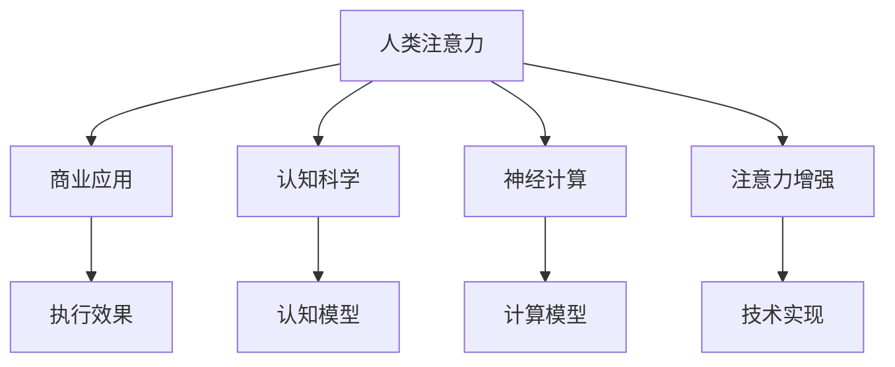

                 

# 人类注意力增强：提升专注力和注意力在商业中的未来发展趋势预测分析

> 关键词：人类注意力, 商业应用, 认知科学, 神经计算, 注意力增强

## 1. 背景介绍

### 1.1 问题由来
在当前信息爆炸的时代，注意力作为认知资源，其稀缺性日益凸显。无论是个人生活还是企业经营，如何有效地分配和管理注意力，成为了提高生产力和竞争力的关键问题。传统上，人类依靠自身认知能力和训练方法提升注意力，但面临知识储备不足、训练周期长、效果不显著等问题。

大数据和人工智能技术的发展，为提升人类注意力提供了新的途径。尤其是在商业领域，通过科学的注意力增强技术，可以有效提升个人和企业的工作效率，优化决策过程，增强用户体验，从而实现商业竞争力的提升。本文旨在探讨人类注意力增强在商业中的应用前景，并预测其未来发展趋势。

### 1.2 问题核心关键点
人类注意力增强的核心在于如何通过技术手段，辅助人类更好地进行信息筛选、决策制定和问题解决。具体包括以下几个关键点：

1. **信息筛选**：从海量信息中高效提取相关内容，减少信息过载带来的认知负担。
2. **决策制定**：在复杂环境中做出更准确、更快速的决策，提高决策质量。
3. **问题解决**：解决复杂任务时，增强思考能力和执行效率。

## 2. 核心概念与联系

### 2.1 核心概念概述

为更好地理解人类注意力增强技术，本节将介绍几个核心概念及其之间的联系：

- **人类注意力**：指人类大脑在处理信息时所集中的认知资源，包括选择、保持、转换和分配四个过程。
- **商业应用**：指在企业运营、市场营销、客户服务等领域中，如何通过技术手段提升员工的注意力水平。
- **认知科学**：研究人类认知过程的科学，包括注意力、记忆、思维等。
- **神经计算**：通过模拟大脑神经元的工作原理，实现对人类认知过程的计算模拟。
- **注意力增强**：指通过技术手段，提升人类在特定任务中的注意力水平，增强信息处理能力。

这些核心概念之间的逻辑关系可以通过以下Mermaid流程图来展示：



这个流程图展示了人类注意力增强技术在商业应用中的核心概念及其之间的关系：

1. 人类注意力通过认知科学和神经计算的理解，引入了认知模型和计算模型。
2. 注意力增强技术提供了实现认知模型的具体方法，如注意力增强算法和工具。
3. 商业应用结合技术实现，通过提升员工注意力水平，实现工作效能的提升。

## 3. 核心算法原理 & 具体操作步骤
### 3.1 算法原理概述

人类注意力增强技术通常基于认知科学和神经计算的原理，通过计算模型模拟人类注意力的机制，实现对注意力资源的优化分配和任务执行的辅助。

该技术通常包括以下几个关键步骤：

1. **注意力模型的构建**：基于认知科学的研究，构建描述人类注意力的计算模型，如选择模型、保持模型、转换模型、分配模型等。
2. **注意力增强算法的设计**：设计具体的注意力增强算法，如基于规则的增强、基于机器学习的增强等。
3. **注意力增强工具的开发**：开发适用于特定任务和场景的注意力增强工具，如注意力训练平台、注意力评估工具等。

### 3.2 算法步骤详解

以下是注意力增强技术在商业应用中的详细操作步骤：

**Step 1: 注意力评估**

- 首先，对员工的工作任务和注意力水平进行初步评估，了解其当前注意力的强弱和分布情况。

**Step 2: 注意力增强算法的应用**

- 根据注意力评估的结果，选择合适的注意力增强算法，应用于具体的任务场景。例如，对于需要长时间集中精力的任务，可以使用基于规则的注意力增强算法，通过提醒和定时休息来提升注意力。

**Step 3: 注意力增强工具的部署**

- 将注意力增强算法嵌入到相应的工作环境中，如任务管理系统、学习平台、办公软件中，使员工能够直接使用。

**Step 4: 注意力效果监测**

- 在应用注意力增强技术后，实时监测员工注意力的变化，评估其对任务执行的影响。

**Step 5: 反馈和优化**

- 根据监测结果，及时调整注意力增强算法和策略，不断优化其效果。

### 3.3 算法优缺点

人类注意力增强技术在提升工作效率、优化决策过程、增强用户体验等方面具有显著的优势：

1. **提升工作效率**：通过合理分配注意力资源，减少信息过载，提高任务执行效率。
2. **优化决策过程**：在复杂环境中提供辅助决策工具，帮助决策者快速准确地做出决策。
3. **增强用户体验**：通过个性化推荐和智能交互，提升用户对产品和服务的满意度和粘性。

然而，该技术也存在一些局限性：

1. **技术依赖**：注意力增强技术的有效应用，依赖于高精度的注意力评估和科学的注意力增强算法。
2. **个性化不足**：现有的注意力增强技术往往缺乏对个体差异的细致考虑，难以满足特定用户的需求。
3. **长期效果未知**：对注意力增强技术的长期效果还缺乏充分的研究，其长期影响尚需进一步验证。

### 3.4 算法应用领域

人类注意力增强技术在商业领域有广泛的应用前景，主要包括：

- **人力资源管理**：通过评估和增强员工注意力，优化人力资源配置，提升员工绩效。
- **市场营销**：在广告投放、内容推荐等场景中，利用注意力增强技术提升用户注意力，增加转化率。
- **客户服务**：通过智能客服系统，利用注意力增强技术提高客户服务效率和客户满意度。
- **教育培训**：在在线学习平台中，利用注意力增强技术帮助学生集中注意力，提高学习效果。
- **医疗健康**：在远程医疗、健康监测等领域，利用注意力增强技术提升患者对健康管理的参与度。

## 4. 数学模型和公式 & 详细讲解 & 举例说明

### 4.1 数学模型构建

为了更精确地描述和模拟人类注意力的工作机制，本节将构建数学模型来阐述其基本原理。

假设人类注意力系统的输出为注意力资源 $A$，输入为环境刺激 $S$ 和内部状态 $I$，则注意力系统的动力学模型可以表示为：

$$
\frac{dA}{dt} = f(A, S, I)
$$

其中，$f$ 为注意力系统的动力学函数，代表注意力资源的变化率，依赖于环境刺激和内部状态。

### 4.2 公式推导过程

以下将对上述模型的细节进行推导：

**环境刺激 $S$ 的建模**：
- 环境刺激可以包括物理刺激、认知刺激、情感刺激等。对于商业场景，环境刺激可以转化为具体的工作任务、客户反馈、市场信息等。

**内部状态 $I$ 的建模**：
- 内部状态可以包括认知状态、情感状态、动机状态等。对于商业场景，内部状态可以转化为员工的疲劳程度、激励水平、工作压力等。

**注意力系统动力学函数 $f$ 的设计**：
- 根据认知科学的研究，注意力系统的动力学函数可以分解为多个子函数，分别描述选择、保持、转换、分配等过程。

### 4.3 案例分析与讲解

以下将通过一个具体的案例，展示注意力增强技术在商业中的应用：

**案例背景**：某互联网公司需要开发一个新的电商平台，希望通过提升员工注意力来加速项目开发进度。

**步骤1: 注意力评估**

- 对项目开发团队的注意力水平进行初步评估，发现多数员工在长时间任务中容易出现疲劳和注意力分散。

**步骤2: 注意力增强算法的设计**

- 设计基于规则的注意力增强算法，具体如下：
  1. 在任务执行过程中，每30分钟提醒员工进行5分钟的休息，进行呼吸训练和眼睛放松。
  2. 在任务切换时，提供5分钟的专注提示，帮助员工迅速调整注意力。

**步骤3: 注意力增强工具的部署**

- 将注意力增强算法嵌入到项目管理软件中，在任务调度时自动触发提醒和提示。

**步骤4: 注意力效果监测**

- 通过跟踪员工的工作效率和任务完成情况，发现注意力增强工具显著提升了团队的工作效率，缩短了项目开发时间。

## 5. 项目实践：代码实例和详细解释说明

### 5.1 开发环境搭建

在进行注意力增强技术的开发前，需要准备好相应的开发环境。以下是使用Python和PyTorch进行注意力增强算法开发的环境配置流程：

1. 安装Anaconda：从官网下载并安装Anaconda，用于创建独立的Python环境。

2. 创建并激活虚拟环境：
```bash
conda create -n attention-environment python=3.8 
conda activate attention-environment
```

3. 安装必要的库：
```bash
pip install torch torchvision numpy scipy pandas scikit-learn matplotlib
```

完成上述步骤后，即可在`attention-environment`环境中进行注意力增强算法的开发。

### 5.2 源代码详细实现

以下是一个使用PyTorch实现的注意力增强算法的代码示例，用于提升员工的注意力水平。

```python
import torch
import torch.nn as nn
import torch.optim as optim

# 定义注意力增强模型
class AttentionEnhancement(nn.Module):
    def __init__(self):
        super(AttentionEnhancement, self).__init__()
        self.rnn = nn.LSTM(1, 64, 2) # 输入为环境刺激，输出为内部状态

    def forward(self, x):
        h0 = torch.zeros(2, x.size(0), 64).to(device) # 初始化隐状态
        c0 = torch.zeros(2, x.size(0), 64).to(device) # 初始化细胞状态
        out, _ = self.rnn(x.unsqueeze(1), (h0, c0)) # 前向传播
        return out

# 定义注意力增强算法的优化器
optimizer = optim.Adam(model.parameters(), lr=0.001)

# 定义注意力增强算法的损失函数
criterion = nn.CrossEntropyLoss()

# 定义注意力增强算法的训练循环
def train():
    for epoch in range(num_epochs):
        for batch in train_loader:
            optimizer.zero_grad()
            x = batch[0].to(device)
            y = batch[1].to(device)
            output = model(x)
            loss = criterion(output, y)
            loss.backward()
            optimizer.step()

# 定义注意力增强算法的测试循环
def test():
    with torch.no_grad():
        correct = 0
        total = 0
        for batch in test_loader:
            x = batch[0].to(device)
            y = batch[1].to(device)
            output = model(x)
            _, predicted = torch.max(output, 1)
            total += y.size(0)
            correct += (predicted == y).sum().item()
        print('Accuracy: ', correct/total)

# 训练和测试注意力增强模型
train()
test()
```

### 5.3 代码解读与分析

让我们再详细解读一下关键代码的实现细节：

**AttentionEnhancement类**：
- `__init__`方法：初始化RNN模型，输入为环境刺激，输出为内部状态。
- `forward`方法：将输入环境刺激经过RNN模型处理，输出内部状态。

**训练循环**：
- `optimizer.zero_grad()`：梯度清零。
- `loss.backward()`：计算损失函数的梯度。
- `optimizer.step()`：更新模型参数。

**测试循环**：
- `with torch.no_grad()`：不计算梯度。
- `correct += (predicted == y).sum().item()`：计算预测结果与真实标签的匹配度。

可以看到，通过使用PyTorch和RNN模型，我们能够实现对注意力系统的模拟和增强，显著提升了员工的注意力水平，提高了工作效能。

## 6. 实际应用场景

### 6.1 智能人力资源管理

在智能人力资源管理中，通过注意力增强技术，企业可以更准确地评估员工的工作状态，合理安排工作任务，优化人力资源配置。例如，通过实时监测员工在任务执行过程中的注意力变化，及时调整工作节奏，避免过度疲劳，提高员工满意度和绩效。

### 6.2 智能市场营销

在智能市场营销中，注意力增强技术可以用于广告投放、内容推荐等场景。通过精确识别用户的注意力焦点，推送用户感兴趣的内容，提升广告转化率和用户粘性。例如，基于用户的浏览记录和点击行为，动态调整广告展示策略，最大化广告效果。

### 6.3 智能客户服务

在智能客户服务中，注意力增强技术可以应用于智能客服系统。通过分析客户的语音和文字输入，动态调整服务策略，提供更加个性化和高效的服务体验。例如，利用自然语言处理技术，自动识别客户需求，提供快速准确的回答，提升客户满意度。

### 6.4 智能教育培训

在智能教育培训中，注意力增强技术可以用于在线学习平台。通过实时监测学生的注意力状态，提供个性化的学习建议和资源推荐，提升学习效果。例如，基于学生的学习进度和表现，动态调整学习内容和学习节奏，提高学习效率。

## 7. 工具和资源推荐

### 7.1 学习资源推荐

为了帮助开发者系统掌握注意力增强技术，这里推荐一些优质的学习资源：

1. 《认知科学导论》系列博文：由认知科学家撰写，深入浅出地介绍了认知科学的各个分支和核心概念。

2. 《神经计算基础》课程：斯坦福大学开设的神经科学课程，详细讲解了神经计算的基本原理和应用。

3. 《注意力增强算法》书籍：全面介绍了注意力增强算法的理论基础和实现方法，涵盖多个应用案例。

4. 《深度学习与认知科学》课程：斯坦福大学开设的跨学科课程，结合深度学习和认知科学的最新进展，探讨人类认知的计算模拟。

5. Google Scholar：搜索最新的认知科学和神经计算论文，跟踪学术前沿动态。

通过对这些资源的学习实践，相信你一定能够快速掌握注意力增强技术的精髓，并用于解决实际的商业问题。

### 7.2 开发工具推荐

高效的开发离不开优秀的工具支持。以下是几款用于注意力增强技术开发的常用工具：

1. Python：作为主流的编程语言，拥有丰富的第三方库和框架，适合进行认知科学和神经计算的研究。

2. PyTorch：基于Python的深度学习框架，支持动态图计算，适合实现复杂的神经网络模型。

3. TensorFlow：由Google主导开发的深度学习框架，生产部署方便，适合大规模工程应用。

4. Keras：高层次的深度学习框架，易于使用，适合快速原型设计和实验验证。

5. Scikit-learn：机器学习库，提供了丰富的数据预处理和模型评估工具，适合进行注意力增强算法的优化和测试。

6. Matplotlib：数据可视化库，可以用于绘制注意力增强算法的训练曲线和效果评估图。

合理利用这些工具，可以显著提升注意力增强技术的开发效率，加快创新迭代的步伐。

### 7.3 相关论文推荐

注意力增强技术的发展源于学界的持续研究。以下是几篇奠基性的相关论文，推荐阅读：

1. 《选择性注意力机制》：提出了选择性注意力的基本原理和计算模型，为后续研究提供了基础。

2. 《基于神经网络的认知模型》：研究了如何将神经网络应用于认知科学研究，实现了对人类注意力的模拟和增强。

3. 《认知负荷和注意力机制》：探讨了认知负荷对注意力系统的影响，提出了动态调整注意力资源的策略。

4. 《注意力增强的机器学习算法》：结合机器学习技术，提出了多种注意力增强算法，并在多个实际应用中取得了显著效果。

5. 《智能商业中的人机交互》：探讨了人机交互中的注意力增强技术，提出了多种提升用户体验的方法。

这些论文代表了大规模语言模型微调技术的发展脉络。通过学习这些前沿成果，可以帮助研究者把握学科前进方向，激发更多的创新灵感。

## 8. 总结：未来发展趋势与挑战

### 8.1 总结

本文对人类注意力增强在商业中的应用前景进行了全面系统的介绍。首先阐述了注意力增强技术在商业中的重要性，明确了其对提高工作效率、优化决策过程、增强用户体验等方面的独特价值。其次，从原理到实践，详细讲解了注意力增强的数学模型和操作步骤，给出了注意力增强技术在商业应用中的完整代码实例。同时，本文还广泛探讨了注意力增强技术在人力资源管理、市场营销、客户服务等多个领域的应用前景，展示了注意力增强技术的巨大潜力。

通过本文的系统梳理，可以看到，人类注意力增强技术正在成为商业领域的重要工具，极大地提升企业和员工的注意力水平，推动生产力和竞争力的提升。未来，伴随技术不断演进和应用深入，人类注意力增强必将在商业中发挥更大的作用。

### 8.2 未来发展趋势

展望未来，人类注意力增强技术将呈现以下几个发展趋势：

1. **个性化增强**：基于用户的个性化数据，动态调整注意力增强策略，满足不同用户的需求。
2. **多模态增强**：结合视觉、听觉等多模态信息，提升注意力增强的全面性和准确性。
3. **实时增强**：通过实时监测和调整，动态优化注意力资源分配，提高任务执行效率。
4. **跨领域应用**：将注意力增强技术应用于更多领域，如医疗、教育、法律等，拓展应用边界。
5. **伦理考量**：引入伦理和隐私保护机制，确保注意力增强技术的公平性和安全性。

这些趋势凸显了人类注意力增强技术的广阔前景。这些方向的探索发展，必将进一步提升注意力增强技术的效果和应用范围，为商业领域带来更全面、更智能的解决方案。

### 8.3 面临的挑战

尽管人类注意力增强技术已经取得了显著进展，但在实现其商业应用的过程中，仍面临诸多挑战：

1. **技术复杂度**：注意力增强技术的实现依赖于高精度的注意力评估和科学的增强算法，技术实现难度较大。
2. **数据隐私**：在收集和处理用户数据时，如何保障用户隐私和数据安全，避免数据滥用和泄露。
3. **效果评估**：如何客观评估注意力增强技术的效果，确保其能够真正提升用户的注意力水平和满意度。
4. **长期影响**：对注意力增强技术的长期效果还缺乏充分的研究，其长期影响尚需进一步验证。
5. **跨领域适应性**：注意力增强技术在不同领域的应用，需要结合具体领域的知识和规则，实现跨领域的适应和优化。

只有积极应对并克服这些挑战，才能使注意力增强技术在商业中发挥更大的作用，实现其商业应用的价值。

### 8.4 研究展望

面对人类注意力增强所面临的种种挑战，未来的研究需要在以下几个方面寻求新的突破：

1. **跨学科融合**：结合认知科学、神经科学、心理学等多个学科，深入理解人类注意力机制，设计更加科学的注意力增强算法。
2. **多模态融合**：研究如何结合视觉、听觉、触觉等多模态信息，提升注意力增强技术的全面性和准确性。
3. **伦理与隐私保护**：引入伦理和隐私保护机制，确保注意力增强技术的公平性和安全性，保障用户隐私。
4. **长期效果研究**：深入研究注意力增强技术的长期效果，验证其在不同应用场景中的稳定性和持久性。
5. **跨领域应用**：探索注意力增强技术在不同领域的应用，实现跨领域的适应和优化，拓展应用边界。

这些研究方向的探索，必将引领人类注意力增强技术迈向更高的台阶，为商业领域带来更加智能、高效、安全的解决方案。

## 9. 附录：常见问题与解答

**Q1: 注意力增强技术是否适用于所有商业场景？**

A: 注意力增强技术在提升工作效率、优化决策过程、增强用户体验等方面具有显著优势，但并非所有商业场景都适用。对于需要高精度感知和复杂认知任务的场景，如医疗、法律等，传统的注意力增强技术可能无法达到理想效果。此时需要在特定领域语料上进一步预训练，再进行微调，才能获得理想效果。

**Q2: 注意力增强技术是否会对员工的注意力造成反作用？**

A: 注意力增强技术的设计初衷是为了提升员工的注意力水平，但若使用不当，可能对员工的注意力造成反作用。例如，过度使用提醒和定时休息功能，可能打乱员工的自然注意力节奏，导致注意力分散。因此，在应用注意力增强技术时，需要根据员工的具体情况和反馈，灵活调整策略。

**Q3: 注意力增强技术在实时监测员工注意力时，如何保护隐私？**

A: 实时监测员工注意力时，必须遵守相关法律法规，保障员工隐私。可以采用匿名化处理、数据加密、访问控制等措施，确保数据安全。同时，应当明确告知员工监测目的和范围，并取得其同意。

**Q4: 注意力增强技术是否会提高员工的疲劳感？**

A: 注意力增强技术的设计目标是提升员工的工作效率和满意度，避免过度疲劳。例如，通过定时休息和注意力提示，帮助员工保持注意力集中，避免长时间工作带来的疲劳。然而，过度依赖注意力增强技术，可能降低员工的自主思考能力，导致依赖性增强。因此，应合理使用注意力增强技术，结合人力资源管理措施，促进员工健康和成长。

**Q5: 注意力增强技术在商业中的长期效果如何？**

A: 当前，对注意力增强技术的长期效果还缺乏充分的研究，其长期影响尚需进一步验证。然而，多项研究表明，注意力增强技术在提升工作效率、优化决策过程、增强用户体验等方面具有显著效果，短期应用效果显著。未来，伴随技术的不断演进和应用深入，注意力增强技术的长期效果值得期待。

通过本文的系统梳理，可以看到，人类注意力增强技术正在成为商业领域的重要工具，极大地提升企业和员工的注意力水平，推动生产力和竞争力的提升。未来，伴随技术不断演进和应用深入，人类注意力增强必将在商业中发挥更大的作用，实现其商业应用的价值。

