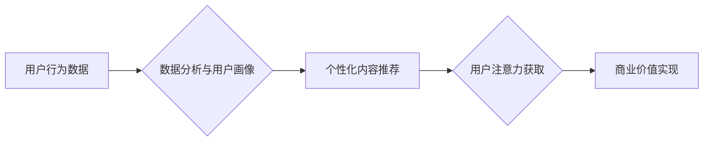

                 

##  注意力经济与个性化营销：为受众创建定制、有针对性的信息和体验

> 关键词：注意力经济、个性化营销、推荐系统、深度学习、用户行为分析、数据挖掘、A/B测试、机器学习

### 1. 背景介绍

在当今信息爆炸的时代，人们每天面临着海量的资讯和信息流。如何有效地获取和处理这些信息成为了一个巨大的挑战。同时，企业也面临着如何突破信息过载，抓住用户注意力，并将其转化为商业价值的难题。

注意力经济的概念应运而生，它强调了在信息时代，注意力是稀缺的资源，而拥有和控制注意力意味着拥有巨大的商业价值。 

个性化营销作为一种应对信息过载的有效策略，旨在根据用户的个人特征、兴趣爱好、行为模式等信息，为其提供定制化的产品、服务和信息体验。通过精准的定位和个性化的内容推荐，个性化营销可以有效地提升用户参与度、转化率和客户忠诚度。

### 2. 核心概念与联系

#### 2.1 注意力经济

注意力经济的核心概念是：

* **注意力是稀缺资源:** 在信息爆炸的时代，人们每天接触的信息量巨大，注意力有限，因此，获取和保持用户的注意力成为了至关重要的竞争要素。
* **注意力具有价值:**  拥有和控制用户注意力意味着拥有巨大的商业价值。企业可以通过吸引用户的注意力，引导其消费行为，从而实现商业目标。
* **注意力是可衡量的:** 通过各种数据分析手段，可以量化用户的注意力，例如阅读时长、点击率、停留时间等。

#### 2.2 个性化营销

个性化营销的核心概念是：

* **用户centric:** 将用户需求放在首位，根据用户的个人特征和行为模式，提供定制化的产品、服务和信息体验。
* **数据驱动:** 利用大数据分析技术，挖掘用户的行为模式、兴趣爱好等信息，为个性化营销提供数据支撑。
* **精准定位:** 通过精准的用户画像，将目标用户细分，并针对不同用户群体的需求，提供个性化的营销方案。

#### 2.3  核心概念联系

注意力经济和个性化营销相互关联，共同构成了信息时代企业获取用户注意力和实现商业价值的有效策略。

个性化营销通过数据分析和用户画像，精准定位目标用户，并根据用户的兴趣爱好和行为模式，提供定制化的信息和体验，从而有效地吸引用户的注意力，提升用户参与度和转化率。

**Mermaid 流程图**



### 3. 核心算法原理 & 具体操作步骤

#### 3.1 算法原理概述

个性化营销的核心算法通常基于机器学习和深度学习技术，通过训练模型，学习用户行为模式和偏好，并根据这些信息，预测用户的兴趣和需求，从而实现个性化内容推荐。

常见的个性化推荐算法包括：

* **协同过滤:** 基于用户的历史行为数据，推荐与用户兴趣相似的其他用户喜欢的商品或内容。
* **内容过滤:** 基于商品或内容的特征信息，推荐与用户兴趣相符的商品或内容。
* **基于知识的推荐:** 基于用户知识图谱和商品知识图谱，推荐符合用户需求和偏好的商品或内容。
* **深度学习推荐:** 利用深度神经网络，学习用户行为数据和商品特征数据的复杂关系，实现更精准的个性化推荐。

#### 3.2 算法步骤详解

以协同过滤算法为例，其具体操作步骤如下：

1. **数据收集:** 收集用户行为数据，例如用户购买历史、浏览记录、评分等。
2. **数据预处理:** 对用户行为数据进行清洗、转换和特征提取，例如将用户购买历史转换为用户-商品交互矩阵。
3. **模型训练:** 利用机器学习算法，训练协同过滤模型，例如基于用户的协同过滤模型或基于物品的协同过滤模型。
4. **模型评估:** 使用测试数据评估模型的性能，例如准确率、召回率、覆盖率等。
5. **个性化推荐:** 根据用户的历史行为数据和训练好的模型，预测用户对商品的兴趣，并推荐与用户兴趣相似的商品。

#### 3.3 算法优缺点

**协同过滤算法的优点:**

* 能够发现用户之间的隐性关联，推荐与用户兴趣相似的商品或内容。
* 算法相对简单，易于实现。

**协同过滤算法的缺点:**

* 数据稀疏性问题: 当用户行为数据稀疏时，算法难以准确预测用户的兴趣。
* 冷启动问题: 对新用户和新商品的推荐效果较差。

#### 3.4 算法应用领域

协同过滤算法广泛应用于以下领域:

* **电子商务:** 商品推荐、用户画像、个性化营销。
* **内容推荐:** 视频推荐、音乐推荐、新闻推荐。
* **社交网络:** 朋友推荐、兴趣小组推荐。

### 4. 数学模型和公式 & 详细讲解 & 举例说明

#### 4.1 数学模型构建

协同过滤算法的核心是用户-商品交互矩阵，该矩阵表示用户对商品的评分或购买行为。

假设有N个用户和M个商品，则用户-商品交互矩阵可以表示为一个N x M的矩阵，其中每个元素代表用户对商品的评分或购买行为。

#### 4.2 公式推导过程

基于用户的协同过滤算法的目的是预测用户对商品的评分。

假设用户u对商品i的评分为r(u,i)，则可以使用以下公式预测用户u对商品j的评分:

$$
\hat{r}(u,j) = \bar{r}_u + \frac{\sum_{i \in N(u)} (r(u,i) - \bar{r}_u) * (r(i,j) - \bar{r}_j)}{\sum_{i \in N(u)} (r(u,i) - \bar{r}_u)^2}
$$

其中:

* $\bar{r}_u$ 是用户u的平均评分。
* $\bar{r}_j$ 是商品j的平均评分。
* $N(u)$ 是与用户u交互过的商品的集合。

#### 4.3 案例分析与讲解

假设有三个用户和三个商品，用户-商品交互矩阵如下:

| 用户 | 商品1 | 商品2 | 商品3 |
|---|---|---|---|
| 用户1 | 5 | 3 | 4 |
| 用户2 | 4 | 5 | 2 |
| 用户3 | 3 | 4 | 5 |

我们可以使用上述公式预测用户1对商品3的评分。

首先计算用户1的平均评分: $\bar{r}_1 = (5 + 3 + 4) / 3 = 4$

然后计算商品3的平均评分: $\bar{r}_3 = (4 + 2 + 5) / 3 = 3.67$

接下来计算与用户1交互过的商品的集合: $N(1) = {商品1, 商品2, 商品3}$

最后将这些值代入公式，即可得到用户1对商品3的预测评分。

### 5. 项目实践：代码实例和详细解释说明

#### 5.1 开发环境搭建

* Python 3.x
* scikit-learn
* pandas
* numpy

#### 5.2 源代码详细实现

```python
import pandas as pd
from sklearn.metrics.pairwise import cosine_similarity

# 加载用户-商品交互数据
data = pd.read_csv('user_item_data.csv')

# 构建用户-商品交互矩阵
user_item_matrix = data.pivot_table(index='user_id', columns='item_id', values='rating')

# 计算余弦相似度
user_similarity = cosine_similarity(user_item_matrix)

# 预测用户对商品的评分
def predict_rating(user_id, item_id):
    # 获取用户与其他用户的相似度
    user_similarity_scores = user_similarity[user_id]

    # 获取与当前用户相似度最高的k个用户
    k = 5
    similar_users = user_similarity_scores.argsort()[-k:][::-1]

    # 计算预测评分
    predicted_rating = 0
    for similar_user in similar_users:
        if user_item_matrix.loc[similar_user, item_id] is not None:
            predicted_rating += user_item_matrix.loc[similar_user, item_id] * user_similarity_scores[similar_user]

    return predicted_rating / sum(user_similarity_scores[similar_users])

# 示例预测
user_id = 1
item_id = 3
predicted_rating = predict_rating(user_id, item_id)
print(f'用户{user_id}对商品{item_id}的预测评分为:{predicted_rating}')
```

#### 5.3 代码解读与分析

* 代码首先加载用户-商品交互数据，并构建用户-商品交互矩阵。
* 然后使用余弦相似度计算用户之间的相似度。
* 预测用户对商品的评分函数 `predict_rating` 首先获取与当前用户相似度最高的k个用户，然后根据这些用户的评分和相似度，计算预测评分。

#### 5.4 运行结果展示

运行代码后，会输出用户对商品的预测评分。

### 6. 实际应用场景

#### 6.1 电子商务

* **商品推荐:** 根据用户的购买历史、浏览记录等数据，推荐与用户兴趣相似的商品。
* **个性化营销:** 根据用户的兴趣爱好和行为模式，推送个性化的促销信息和优惠券。
* **用户画像:** 通过分析用户的购买行为和浏览记录，构建用户画像，以便更好地理解用户的需求和偏好。

#### 6.2 内容推荐

* **视频推荐:** 根据用户的观看历史、点赞记录等数据，推荐与用户兴趣相似的视频。
* **音乐推荐:** 根据用户的播放历史、收藏记录等数据，推荐与用户口味相符的音乐。
* **新闻推荐:** 根据用户的阅读历史、关注领域等数据，推荐与用户兴趣相关的新闻。

#### 6.3 社交网络

* **朋友推荐:** 根据用户的社交关系和兴趣爱好，推荐与用户性格相似的潜在朋友。
* **兴趣小组推荐:** 根据用户的兴趣爱好和参与记录，推荐与用户兴趣相关的兴趣小组。

#### 6.4 未来应用展望

随着人工智能技术的不断发展，个性化营销将更加智能化、精准化和个性化。

* **多模态数据融合:** 将文本、图像、视频等多模态数据融合，构建更全面的用户画像，实现更精准的个性化推荐。
* **实时个性化:** 基于用户的实时行为数据，动态调整推荐策略，提供更个性化的体验。
* **增强现实和虚拟现实:** 利用增强现实和虚拟现实技术，为用户提供更沉浸式的个性化体验。

### 7. 工具和资源推荐

#### 7.1 学习资源推荐

* **书籍:**
    * 《推荐系统实践》
    * 《深度学习》
* **在线课程:**
    * Coursera: Recommender Systems
    * Udacity: Machine Learning Engineer Nanodegree

#### 7.2 开发工具推荐

* **Python:** 
    * scikit-learn
    * TensorFlow
    * PyTorch
* **数据分析工具:**
    * pandas
    * numpy
    * matplotlib

#### 7.3 相关论文推荐

* **协同过滤算法:**
    * "Collaborative Filtering for Implicit Feedback Datasets"
    * "Matrix Factorization Techniques for Recommender Systems"
* **深度学习推荐:**
    * "Neural Collaborative Filtering"
    * "Deep Learning for Recommender Systems: A Survey"

### 8. 总结：未来发展趋势与挑战

#### 8.1 研究成果总结

注意力经济与个性化营销是信息时代企业获取用户注意力和实现商业价值的重要策略。

个性化推荐算法在电子商务、内容推荐和社交网络等领域取得了显著的成果，为用户提供了更精准、更个性化的体验。

#### 8.2 未来发展趋势

* **多模态数据融合:** 将文本、图像、视频等多模态数据融合，构建更全面的用户画像，实现更精准的个性化推荐。
* **实时个性化:** 基于用户的实时行为数据，动态调整推荐策略，提供更个性化的体验。
* **增强现实和虚拟现实:** 利用增强现实和虚拟现实技术，为用户提供更沉浸式的个性化体验。

#### 8.3 面临的挑战

* **数据隐私:** 个性化营销需要收集和分析用户的个人数据，如何保护用户的隐私安全是一个重要的挑战。
* **算法公平性:** 个性化推荐算法可能会存在偏差，导致某些用户获得更优质的推荐，而另一些用户则获得更差的推荐，如何确保算法公平性是一个重要的研究方向。
* **用户信任:** 用户对个性化推荐的信任度是至关重要的，如何建立用户的信任，并避免过度营销是一个需要解决的问题。

#### 8.4 研究展望

未来，个性化营销将朝着更加智能化、精准化和个性化的方向发展。

研究者将继续探索新的算法和技术，以更好地理解用户的需求和偏好，并提供更个性化的体验。

同时，也将更加重视数据隐私、算法公平性和用户信任等问题，确保个性化营销能够健康、可持续地发展。

### 9. 附录：常见问题与解答

#### 9.1 如何评估个性化推荐算法的性能？

常用的评估指标包括准确率、召回率、覆盖率、NDCG等。

#### 9.2 如何处理数据稀疏性问题？

常用的方法包括：

* 使用矩阵分解技术，将用户-商品交互矩阵分解成低维空间的表示。
* 使用协同过滤算法，利用用户的相似性来预测用户的兴趣。
* 使用内容过滤算法，根据商品的特征信息来推荐商品。

#### 9.3 如何避免过度营销？

* 尊重用户的隐私，避免过度收集用户的个人数据。
* 提供用户控制权，允许用户选择接收哪些类型的推荐。
* 定期评估推荐效果，并根据用户的反馈进行调整。


作者：禅与计算机程序设计艺术 / Zen and the Art of Computer Programming 
<end_of_turn>

